# [**Dart**](https://dart.dev/)@[**🐦`Flutter`**](https://flutter.dev)<font color=red>靶场项目</font>蓝皮书📘

<p align="left">
  <a></a>
  <a></a>
  <a></a>
  <a></a>
  <a href="https://github.com/295060456/JobsFlutterBaseConfigDemo"></a>
  <a></a>
  <a href="https://github.com/295060456/JobsFlutterBaseConfigDemo/stargazers"></a>
  <a href="https://github.com/295060456/JobsFlutterBaseConfigDemo/network"></a>
  <a></a>
  <a></a>
  <a></a>
</p>

[toc]

当前总行数：

## 🔥<font id=前言>前言</font>

>温馨提示🔔：本文较长，需要⏬下载到本地以后，方能完整阅读。推荐阅读器 ➤ [**Typora**](https://typora.io/)

* **工欲善其事必先利其器**
* **站在巨人的肩膀上，才能看得更远**
* **面向信仰编程**

## 一、🎯项目白皮书 <a href="#前言" style="font-size:17px; color:green;"><b>🔼</b></a> <a href="#🔚" style="font-size:17px; color:green;"><b>🔽</b></a>

> 程序员是一个高消耗的职业，除了日常基本的业务开发以外，新事物的不断涌现也需要持续性的学习，所以是一件非常消耗精力的事；而且由于长期的高压、高情绪、熬夜，**会打乱人体内正常的内分泌节奏**，大概率也会逐渐的引发各种职业疾病。业内普遍认为程序员的**黄金年龄在25～35周岁**。那么，还是希望，在我们（亦或者是暂时性的）离开这个行业的时候，一定要为自己或者后人，留下点什么，算是这么多年的一个工作总结。此外，能最大化的辅助人，帮助其在极短的时间内去：<u>回忆/上手/学习/实验</u>这个编程语言下的工程项目。所以，此项目就一定是要结合商业需求去务实拓展，解决当前痛点。

* ✅品控标准（只能严格的保证编译器正常，而不能完全保证运行时的不出错）
  * 一定要保证这个工程的成功编译通过，方便以后项目直接进行引用，乃至开新版本
  * <font color=blue>**示例Demo可能因为相关Api的升级，没有及时的覆盖处理，可能会出现闪退。修复即可**</font>
* 📌 自此以后，所有新开的项目都可以根据这个**根项目**来进行统一的调配和使用
  * 将它作为所有项目的母版和基类，最大限度的做到全局的统一
  * 日积月累的记录一些平时生产生活中萌发的一些优秀的想法、灵光一现的创意。包括但不仅限于：<u>语法糖的封装</u>、<u>方法的调用</u>，<u>第三方的选用</u>、以及一些心得体会
* 🎯 作为某些代码**实践靶场**，在实际开发过程中，是非常有必要的
  * 为我们快速且稳定的复现一些业务场景，作为代码实验室🧪，而搭建的一个平台
* 📝 作为代码笔记，记录一些常用的代码，方便查阅
  * 主要形式是：<font color=red>**可以直接运行的代码**</font> ➕ <font color=red>**文字性叙述**</font> ➕ <font color=red>**图文混编讲解**</font>
  * 作为学习的资料，可以快速了解到一些常用的知识，大幅**降低学习成本**
  * 作为其他项目的参考，可以快速的了解到项目的架构，代码规范，以及一些设计模式
  * 这么一些优秀的成果，其来源不仅仅是来自于作者本身的持续付出与积累。更是这个领域大家庭中各路优秀作者的智慧结晶
* 👩**保姆级教程**：附带独立的测试单元
  * 对于单个的[**Flutter**](https://flutter.dev/)工程文件（小**Demo**）可以利用[**运行脚本**](./【MacOS】☀️双击运行Flutter项目（iOS 模拟器）.command)，在**MacOS**的**终端**直接拖入进行运行和展示（终端运行不支持断点，只能输出日志）
  * 为了保证各个**Demo**在形式上的独立性，所以尽可能的在单个`.dart`文件里面进行叙述。**每一个[Flutter](https://flutter.dev/)的Demo文件里，都会存在其程序的入口函数**
* 🌍友情外链🔗
  * [**Jobs**](https://github.com/) **自我知识产权**
    * [**Jobs相关文档支持**](https://github.com/JobsKit/JobsDocs)
    * [**效率工具：SourceTree的脚本配置**](https://github.com/JobsKit/SourceTree.sh)
    * [**常见环境变量配置文件（按使用场景分类）**](https://github.com/JobsKit/JobsMacEnvVarConfig)
  * 外部支持文档
    * [**Dart/Flutter社区生态：Pub.dev**](https://pub.dev/)
    * [**Flutter 面试知识点集锦· GitBook**](https://guoshuyu.cn/home/wx/Flutter-msjj.html)
    * [**Flutter 实战@第二版**](https://book.flutterchina.club/)
    * [**在 Flutter 里使用 Stream**](https://juejin.cn/post/6844904131287580685)
    * [**Flutter 教程 Async**](https://www.youtube.com/watch?v=qBksSix4qj0&list=PLDD3xNHFJjoob3GCF1JqaDxwrOTmpGGbe&index=1)
* 🌟特色与亮点
  * [**Github**](https://github.com/)统一管理[**VSCode**](https://code.visualstudio.com/)配置
  * 脚本一键配置[**Flutter**](https://flutter.dev/)开发环境
  * 脚本一键执行授权（**ZSH终端函数**）
  * [**Sourcetree**](https://www.sourcetreeapp.com/)工具：锚定特殊环境运行（[**fvm**](https://fvm.app/)、[**jenv**](https://www.jenv.be/)）
  * **iOS**/**Android**模拟器录屏（**独立脚本**）
  * 新建**iOS**/**Android**模拟器（**独立脚本**）
  * 脚本一键替换**iOS**/**Android**的启动图和应用程序图标（**独立脚本**）
  * **iOS**/安卓打包工具（**ZSH终端函数**/[**Sourcetree**](https://www.sourcetreeapp.com/)**工具脚本**/**独立脚本**）
  * 终端易用工具（**ZSH终端函数**/**独立脚本**）
    * 开发环境
    * 颜色格式转换（可显示色块）
    * 时间戳转换
  * 靶场项目
    * [**Flutter**](https://flutter.dev/)易用语法糖
    * 独立[**Dart**](https://dart.dev/)文件的[**Flutter**](https://flutter.dev/).**Demo**

## 二、开发周边 <a href="#前言" style="font-size:17px; color:green;"><b>🔼</b></a> <a href="#🔚" style="font-size:17px; color:green;"><b>🔽</b></a>

### 1、[**Typora**](https://typora.io/)  <a href="#前言" style="font-size:17px; color:green;"><b>🔼</b></a> <a href="#🔚" style="font-size:17px; color:green;"><b>🔽</b></a>

### 2、😱[**ohmyz.sh**](https://ohmyz.sh/) <a href="#前言" style="font-size:17px; color:green;"><b>🔼</b></a> <a href="#🔚" style="font-size:17px; color:green;"><b>🔽</b></a>

```shell
sh -c "$(curl -fsSL https://raw.githubusercontent.com/ohmyzsh/ohmyzsh/master/tools/install.sh)"
```

or

```shell
sh -c "$(wget https://raw.githubusercontent.com/ohmyzsh/ohmyzsh/master/tools/install.sh -O -)"
```

### 3、🏠[**Homebrew**](https://brew.sh/)  <a href="#前言" style="font-size:17px; color:green;"><b>🔼</b></a> <a href="#🔚" style="font-size:17px; color:green;"><b>🔽</b></a>

```shell
/bin/bash -c "$(curl -fsSL https://raw.githubusercontent.com/Homebrew/install/HEAD/install.sh)"
```

#### 3.1、🏠[**Homebrew**](https://brew.sh/).[<font color=red>Dart</font>](https://dart.dev/)  <a href="#前言" style="font-size:17px; color:green;"><b>🔼</b></a> <a href="#🔚" style="font-size:17px; color:green;"><b>🔽</b></a>

> [**Flutter**](https://flutter.dev/) 里面自带一个[Dart](https://dart.dev/) 环境，理论上是比最新的[Dart](https://dart.dev/) 版本落后的。如果系统里面既装了[Dart](https://dart.dev/) 环境又装了[**Flutter**](https://flutter.dev/)环境，那么[**Flutter**](https://flutter.dev/)项目默认使用[**Flutter**](https://flutter.dev/).SDK里面自带那个[Dart](https://dart.dev/) 环境

```
brew tap dart-lang/dart
```

#### 3.2、🏠<font id=jenv>[**Homebrew**](https://brew.sh/).[<font color=red>jenv</font>](https://github.com/jenv/jenv) </font> <a href="#前言" style="font-size:17px; color:green;"><b>🔼</b></a> <a href="#🔚" style="font-size:17px; color:green;"><b>🔽</b></a>

>涉及到[**Android**](https://www.android.com/)的部分需要[**Java**](https://www.java.com/zh-CN/)环境的支持（打包、运行）
>
>[<font color=red>jenv</font>](https://github.com/jenv/jenv)不会自动下载/关联 **JDK**，需要手动进行操作
>
>如果使用[<font color=red>jenv</font>](https://github.com/jenv/jenv)那么系统全局环境变量里面就不能写
>
>```shell
>'export JAVA_HOME=$(/usr/libexec/java_home)'
>'export PATH="$JAVA_HOME/bin:$PATH"'
>```

* 环境变量

  ```shell
  export PATH="$HOME/.jenv/bin:$PATH"
  eval "$(jenv init -)"
  export JAVA_HOME="$HOME/.jenv/versions/$(jenv version-name)"
  export PATH="$JAVA_HOME/bin:$PATH"
  ```

* ```shell
  jenv versions --bare --verbose
  ```

  >在 **shell** 脚本中遍历所有已添加的 **JDK** 版本路径；
  >
  >检查某个版本到底对应哪个目录（例如是否是[**Homebrew**](https://brew.sh/)安装的、[**SDKMAN**](https://sdkman.io/) 安装的等）；

* ```shell
  jenv add/remove JDK.path
  ```

  >```shell
  ># Homebrew.JDK.path 的固定格式
  >/opt/homebrew/opt/openjdk@17/libexec/openjdk.jdk/Contents/Home
  >```
  >
  >```shell
  >jenv_add() {
  >	for v in 8 11 17 21; do
  >path="/opt/homebrew/opt/openjdk@${v}/libexec/openjdk.jdk/Contents/Home"
  >[[ -x "$path/bin/java" ]] && jenv add "$path"
  >done
  >
  >jenv rehash
  >}
  >```

* ```shell
  jenv rehash # 重新生成 shims，使得你添加或切换的 Java 版本能被系统识别并生效。
  ```

* 用 [**jenv**](https://github.com/jenv/jenv)切换[**Java**](https://www.java.com/zh-CN/)环境

  ```shell
  jenv versions --bare --verbose # 用这里的结果
  
  # 删除构建失败的 jenv 中间件
  rm -f ~/.jenv/shims/.jenv-shim
  
  # 1、让 jenv 在当前 shell 生效
  eval "$(jenv init -)"
  
  # 2、启用 export 插件（自动导出 JAVA_HOME）
  jenv enable-plugin export
  
  # 3、让 jenv 识别本机 JDK 17（若已识别可跳过）
  jenv add "$(/usr/libexec/java_home -v 17)" >/dev/null 2>&1
  
  # 4、更新 shims（新增 JDK 后建议做一次）
  jenv rehash
  
  # 5、在项目内锁定到 JDK 17（JDK 版本号按 jenv versions 里显示来）
  jenv local openjdk64-17.0.16 # 或者 17.0.16
  
  # 6、全局（所有项目默认）
  jenv global openjdk64-24.0.2
  
  # 7、重新加载环境（让 export 插件立刻生效）
  jenv shell openjdk64-17.0.16
  
  # 8、 验证
  echo ""
  java -version
  echo ""
  echo "JAVA_HOME=$JAVA_HOME"
  echo ""
  ```

  > **整个MacOS系统里面用最新的JDK；而在具体的[Flutter](https://flutter.dev/)项目里面用指定版本的JDK**
  >
  > ```shell
  > ➜  Desktop java --version
  > openjdk 24.0.2 2025-07-15
  > OpenJDK Runtime Environment Homebrew (build 24.0.2)
  > OpenJDK 64-Bit Server VM Homebrew (build 24.0.2, mixed mode, sharing)
  > ➜  Desktop /Users/jobs/Documents/Github/flutter_tiyu_app
  > ➜  flutter_tiyu_app git:(JobsBranch@永利（金）) ✗ java --version
  > openjdk 17.0.16 2025-07-15
  > OpenJDK Runtime Environment Homebrew (build 17.0.16+0)
  > OpenJDK 64-Bit Server VM Homebrew (build 17.0.16+0, mixed mode, sharing)
  > ➜  flutter_tiyu_app git:(JobsBranch@永利（金）) ✗
  > ```

### 4、[**利用quicktype自动建立数据模型**](https://github.com/JobsKits/JobsDocs/blob/main/利用quicktype自动建立数据模型.md/利用quicktype自动建立数据模型.md) <a href="#前言" style="font-size:17px; color:green;"><b>🔼</b></a> <a href="#🔚" style="font-size:17px; color:green;"><b>🔽</b></a>

### 5、[**向附近设备分享文件**](https://localsend.org/download) <a href="#前言" style="font-size:17px; color:green;"><b>🔼</b></a> <a href="#🔚" style="font-size:17px; color:green;"><b>🔽</b></a>

### 6、**Git**忽略文件 <a href="#前言" style="font-size:17px; color:green;"><b>🔼</b></a> <a href="#🔚" style="font-size:17px; color:green;"><b>🔽</b></a>

```shell
# Flutter/Dart/Pub related
**/doc/api/
**/ios/Flutter/.last_build_id
.dart_tool/
.flutter-plugins
.flutter-plugins-dependencies
.pub-cache/
.pub/
/build/

# Miscellaneous
*.class
*.log
*.pyc
*.swp
.DS_Store
.atom/
.build/
.buildlog/
.history
.svn/
.swiftpm/
migrate_working_dir/

# The .vscode folder contains launch configuration and tasks you configure in
# VS Code which you may wish to be included in version control, so this line
# is commented out by default.
#.vscode/settings.json
#!.vscode/settings.local.json

# IntelliJ related
*.iml
*.ipr
*.iws
.idea/

# FVM Version Cache
.fvm/

# Flutter plugins metadata
.flutter-plugins
.flutter-plugins-dependencies
plugins/

# 各平台编译
/linux/
/macos/
/windows/
/web/
/ios/
/android/
```

## 三、相关配置 <a href="#前言" style="font-size:17px; color:green;"><b>🔼</b></a> <a href="#🔚" style="font-size:17px; color:green;"><b>🔽</b></a>

### 1、🌱[**环境配置**](https://github.com/JobsKit/JobsMacEnvVarConfig) ➤ [**Flutter**](https://flutter.dev/)  <a href="#前言" style="font-size:17px; color:green;"><b>🔼</b></a> <a href="#🔚" style="font-size:17px; color:green;"><b>🔽</b></a>

* 📃`MacOS` 系统环境变量文件 ➤ 写于`.zshrc`里面的函数，**在终端直接通过函数名进行调用**（不断更新中...）

  ```shell
  # ✅ 一键重新加载常见配置文件
  save() {
    local files=(
      "$HOME/.bash_profile"
      "$HOME/.bashrc"
      "$HOME/.zshrc"
      "$HOME/.profile"
      "$HOME/.oh-my-zsh/oh-my-zsh.sh"  # Oh My Zsh 主文件
    )

    for file in "${files[@]}"; do
      if [[ -f "$file" ]]; then
        source "$file"
        echo -e "\033[1;32m✅ 已加载配置文件：file://$file\033[0m"
      else
        echo -e "\033[1;33m⚠️ 未找到配置文件：file://$file\033[0m"
      fi
    done

    echo -e "\n📎 ⌘Command + 点击路径可打开对应文件（macOS Terminal 支持）"
  }

  # ✅ 仅首次执行 save 函数，防止递归
  if [[ -z "$JOBS_ALREADY_RUN" ]]; then
    export JOBS_ALREADY_RUN=1
    command -v save &>/dev/null && save
  fi
  ```

  ```shell
  # ✅ 重启终端
  rb() {
    exec "$SHELL"
  }
  ```

  ```
  # ✅ 更新
  update() {
      brew update && brew upgrade && brew cleanup && brew doctor && brew -v # Homebrew
      dart pub global activate fvm                                          # fvm
  }
  ```

  ```shell
  # ================================== Flutter 命令重载（优先 FVM） ==================================
  # 功能：
  #   1. 如果项目目录存在 `.fvm/fvm_config.json`，优先使用该项目绑定的 FVM Flutter SDK。
  #   2. 检测 FVM 是否可用（VSCode 内最容易失效的情况）：
  #        - 如果 `fvm` 命令不可用，自动执行：
  #            a) dart pub global deactivate fvm    # 卸载现有 FVM 快照
  #            b) dart pub global activate fvm      # 重新全局激活 FVM
  #            c) hash -r                           # 刷新命令缓存
  #   3. 如果 FVM 可用，使用 `fvm flutter` 执行；
  #      如果 FVM 依然不可用，则直接调用 `.fvm/flutter_sdk/bin/flutter` 兜底。
  #   4. 如果当前目录不是 FVM 项目，调用系统全局 Flutter。
  # 作用：
  #   - 保证无论是终端、VSCode 还是脚本运行，始终优先用项目内的 Flutter SDK，
  #     并且自动修复 FVM 失效问题，避免因为环境切换导致构建失败。
  # 注意：
  #   - 避免递归调用，使用 `command` 明确调用系统命令。
  #   - 要放在 `~/.zshrc` 或 `~/.bashrc` 中，确保所有 shell 会话生效。
  flutter() {
    # 项目里有 .fvm 就优先用项目 SDK；没有就走系统 flutter
    if [[ -f .fvm/fvm_config.json && -x .fvm/flutter_sdk/bin/flutter ]]; then
      # 先试 fvm 是否可用，不可用就修复快照（VSCode 里最容易坏）
      if ! command -v fvm >/dev/null 2>&1 || ! fvm --version >/dev/null 2>&1; then
        if command -v dart >/dev/null 2>&1; then
          dart pub global deactivate fvm >/dev/null 2>&1 || true
          dart pub global activate  fvm >/dev/null 2>&1 || true
          hash -r
        fi
      fi

      # 如果 fvm 现在可用，就走 fvm；否则直接用项目本地 flutter 二进制兜底
      if command -v fvm >/dev/null 2>&1 && fvm --version >/dev/null 2>&1; then
        command fvm flutter "$@"
      else
        command .fvm/flutter_sdk/bin/flutter "$@"
      fi
    else
      # 非 fvm 项目：调用系统里的 flutter（避免递归用 `command`）
      command flutter "$@"
    fi
  }
  ```

  ```shell
  # 场景：
  #   当执行 flutter / fvm 时出现以下错误：
  #     "Can't load Kernel binary: Invalid kernel binary format version."
  #     "fvm as globally activated doesn't support Dart X.X.X"
  #   原因：
  #     全局安装的 fvm 是用旧版本 Dart SDK 编译的，与当前 Dart SDK 内核版本不匹配。
  #   解决：
  #     1. 卸载旧的全局 fvm
  #     2. 用当前 Dart SDK 重新全局安装 fvm（会重新编译成当前版本可用的 kernel）
  #     3. 清除 shell 的命令缓存，让新安装的 fvm 生效
  fixfvm() {
    echo "🔍 检查并修复 fvm 与 Dart SDK 的内核版本不匹配问题..."

    # 1️⃣ 卸载旧的全局 fvm
    dart pub global deactivate fvm || true
    rm -rf ~/.pub-cache/bin/fvm* ~/.pub-cache/global_packages/fvm

    # 2️⃣ 使用当前 Dart SDK 重新安装 fvm
    dart pub global activate fvm

    # 3️⃣ 清空 shell 命令缓存，确保调用到新版本
    hash -r

    echo "✅ fvm 已重新安装并与当前 Dart SDK 匹配"
  }
  ```

  ```shell
  # ✅ 检查 Dart / FVM / Flutter 版本信息
  check1() {
    echo "===================================================================="
    echo " 1️⃣ Dart 位置 & 版本"
    echo "===================================================================="
    echo "📍 which dart:"; which dart
    echo "🔖 dart --version:"; dart --version
    echo ""

    echo "===================================================================="
    echo " 2️⃣ FVM 位置 & 版本"
    echo "===================================================================="
    echo "📍 which fvm:"; which fvm
    echo "🔖 fvm --version:"; fvm --version
    echo ""

    echo "===================================================================="
    echo " 3️⃣ Flutter 位置 & 版本（通过 fvm/flutter）"
    echo "===================================================================="
    # zsh: 判断 flutter 是否为函数
    if whence -v flutter | grep -q "shell function"; then
      echo "📍 flutter 是 shell function(打印函数体（便于排查重载逻辑）)："
      functions flutter
      echo "📍 flutter 可执行路径（忽略函数优先找可执行文件）："
      whence -p flutter || echo "（无同名可执行文件，只有函数）"
    else
      echo "📍 flutter 路径："
      whence -p flutter      # 等价于只查 PATH 中的可执行文件
    fi

    echo "🔖 flutter --version:"; flutter --version
    echo "===================================================================="
  }
  ```

  ```shell
  # ✅ 快捷打开系统配置文件
  a(){
    open $HOME/.bash_profile
  }

  b(){
    open $HOME/.zshrc
  }
  ```

* **Shell** 启动配置文件优先级（从高到低）

  * 1️⃣ `~/.bash_profile`

    * **触发时机**：Bash 登录 Shell（macOS 默认终端首次启动 Bash、SSH 登录等）。
    * **说明**：<font color=red>**优先级最高**</font>如果存在该文件，Bash **不会**再读取 `~/.bash_login` 或 `~/.profile`。

  * 2️⃣ `~/.bash_login`

    * **触发时机**：仅在 `~/.bash_profile` 不存在时，Bash 登录 Shell 才会读取它。
    * **说明**：**使用频率低**，作用与 `~/.bash_profile` 基本相同。

  * 3️⃣ `~/.profile`

    * **触发时机**：登录 Shell 启动时（Bash、Zsh、Sh 等）。

    * **说明**：通用 POSIX 登录 Shell 配置。

      >Bash 登录 Shell 会在 `~/.bash_profile` 和 `~/.bash_login` 都不存在时读取它。
      >
      >适合放**跨 Shell 通用**的环境变量（如 JAVA_HOME、PATH）。

  * 4️⃣ `~/.bashrc`

    * **触发时机**：Bash 非登录 Shell（如新开一个终端标签、`bash` 命令启动）。

    * **说明**：更常用

      > 常放**别名**、**函数**、**交互式提示符**等交互配置。
      >
      > 如果想在登录 Shell 中也执行 `.bashrc`，需在 `.bash_profile` 里 `source` 它。

  * 5️⃣  `~/.zshrc`

    * **触发时机**：任何情况下启动 Zsh（登录和非登录都执行）。
    * **说明**：**Zsh 独立配置（对 Zsh 来说是最高优先）**。<font color=red>**macOS** **Catalina** 及以后默认 Shell</font>。

* <font color=red>为了方便管理，只配置 **`bash_profile`** 和 **`.zshrc`** </font>

  <details>
  <summary>.bash_profile</summary>

  ```shell
  # 每次打开终端默认进入桌面目录
  cd "$HOME/Desktop"
  
  # 配置 Rbenv.ruby 环境变量（需安装 rbenv）
  if command -v rbenv &>/dev/null; then
    export PATH="$HOME/.rbenv/bin:$PATH"
    eval "$(rbenv init -)"
  else
    echo "⚠️ 未检测到 rbenv，请执行 brew install rbenv 安装"
  fi
  if command -v ruby &>/dev/null; then
    export PATH="/usr/local/opt/ruby/bin:$PATH"
    export LDFLAGS="-L/usr/local/opt/ruby/lib"
    export CPPFLAGS="-I/usr/local/opt/ruby/include"
    export PKG_CONFIG_PATH="/usr/local/opt/ruby/lib/pkgconfig"
  else
    echo "⚠️ 未检测到 ruby，建议执行 brew install ruby"
  fi
  
  # 配置 Curl 环境变量（需 Homebrew 安装）
  if command -v curl &>/dev/null; then
    export PATH="/usr/local/opt/curl/bin:$PATH"
    export LDFLAGS="-L/usr/local/opt/curl/lib"
    export CPPFLAGS="-I/usr/local/opt/curl/include"
    export PKG_CONFIG_PATH="/usr/local/opt/curl/lib/pkgconfig"
  else
    echo "⚠️ curl 未通过 brew 安装，建议执行 brew install curl"
  fi
  
  # 配置 VSCode 命令行（code）
  if [[ -d "/Applications/Visual Studio Code.app/Contents/Resources/app/bin" ]]; then
    export PATH="$PATH:/Applications/Visual Studio Code.app/Contents/Resources/app/bin"
    if ! command -v code &>/dev/null; then
      echo "⚠️ VSCode 已安装但未配置 code 命令，请在 VSCode 中运行：Shell Command: Install code in PATH"
    fi
  else
    echo "⚠️ 未检测到 VSCode，请先安装 Visual Studio Code 后再运行本脚本"
  fi
  
  # 配置 Flutter 环境变量
  if ! command -v fvm &>/dev/null; then
    if [[ -d "/opt/homebrew/Caskroom/flutter/latest/flutter/bin" ]]; then
      export PATH="/opt/homebrew/Caskroom/flutter/latest/flutter/bin:$PATH"
    elif [[ -d "/usr/local/Caskroom/flutter/latest/flutter/bin" ]]; then
      export PATH="/usr/local/Caskroom/flutter/latest/flutter/bin:$PATH"
    elif [[ -d "$HOME/flutter/bin" ]]; then
      export PATH="$HOME/flutter/bin:$PATH"
    elif [[ -d "$HOME/Documents/GitHub.Jobs/Flutter.SDK/Flutter.SDK.last/bin" ]]; then
      export PATH="$HOME/Documents/GitHub.Jobs/Flutter.SDK/Flutter.SDK.last/bin:$PATH"
    else
      echo "⚠️ 未找到 Flutter SDK，请手动配置路径"
    fi
  fi
  export PUB_HOSTED_URL=https://pub.dartlang.org
  export FLUTTER_STORAGE_BASE_URL=https://storage.googleapis.com
  
  # 配置 FVM 环境变量
  export PATH="$HOME/.pub-cache/bin:$PATH"
  if command -v fvm &>/dev/null; then
    flutter() { fvm flutter "$@"; }
  else
    echo "⚠️ 未检测到 fvm，请执行 flutter pub global activate fvm 安装"
  fi
  
  # 配置 Android SDK 环境变量
  if [[ -d "$HOME/Library/Android/sdk" ]]; then
    export ANDROID_SDK_ROOT="$HOME/Library/Android/sdk"
    export PATH="$PATH:$ANDROID_SDK_ROOT/platform-tools:$ANDROID_SDK_ROOT/cmdline-tools/latest/bin:$ANDROID_SDK_ROOT/emulator:$ANDROID_SDK_ROOT/tools:$ANDROID_SDK_ROOT/tools/bin"
  else
    echo "⚠️ 未检测到 Android SDK，请安装 Android Studio 或配置 ANDROID_SDK_ROOT"
  fi
  
  # 配置 JDK / OpenJDK / SDKMAN
  export JAVA_HOME="/opt/homebrew/opt/openjdk"  # 默认值（优先级最低）
  if /usr/libexec/java_home &>/dev/null; then
    export JAVA_HOME=$(/usr/libexec/java_home)
  fi
  case ":$PATH:" in
    *":$JAVA_HOME/bin:"*) ;;
    *) export PATH="$JAVA_HOME/bin:$PATH" ;;
  esac
  if [[ -s "$HOME/.sdkman/bin/sdkman-init.sh" ]]; then
    export SDKMAN_DIR="$HOME/.sdkman"
    source "$HOME/.sdkman/bin/sdkman-init.sh"
  else
    echo "⚠️ 未检测到 SDKMAN，请访问 https://sdkman.io 安装"
  fi
  
  # 配置 Gradle 环境变量
  if command -v gradle &>/dev/null; then
    export PATH="$HOME/Documents/Gradle/gradle-8.7/bin:$PATH"
  else
    echo "⚠️ 未检测到 gradle，建议执行 brew install gradle 安装"
  fi
  
  # 配置 pipx 环境变量
  if command -v pipx &>/dev/null; then
    export PATH="$PATH:$HOME/.local/bin"
  else
    echo "⚠️ pipx 未安装，建议执行 brew install pipx"
  fi
  
  ```
  </details>

  <details>
  <summary>.zshrc</summary>

  ```dart
  export ZSH="$HOME/.oh-my-zsh"
  ZSH_THEME="robbyrussell"
  plugins=(git)
  source $ZSH/oh-my-zsh.sh
  
  # -------------------- flutter() 重载（优先 FVM） --------------------
  flutter() {
    emulate -L zsh
    setopt no_aliases
  
    # 向上寻找项目根：.fvmrc 或 .fvm/flutter_sdk
    local d="$PWD"
    local root=""
  
    while [[ "$d" != "/" ]]; do
      if [[ -f "$d/.fvmrc" || -x "$d/.fvm/flutter_sdk/bin/flutter" || -f "$d/.fvm/fvm_config.json" ]]; then
        root="$d"
        break
      fi
      d="${d:h}"
    done
  
    # 1) 最可靠：如果项目已有 .fvm/flutter_sdk，直接用它（不依赖系统 flutter，也不依赖 fvm 命令）
    if [[ -n "$root" && -x "$root/.fvm/flutter_sdk/bin/flutter" ]]; then
      command "$root/.fvm/flutter_sdk/bin/flutter" "$@"
      return $?
    fi
  
    # 2) 项目有 .fvmrc / fvm_config.json：走 fvm flutter（读取项目配置）
    if [[ -n "$root" && ( -f "$root/.fvmrc" || -f "$root/.fvm/fvm_config.json" ) ]]; then
      if command -v fvm >/dev/null 2>&1; then
        command fvm flutter "$@"
        return $?
      fi
      print -u2 "✖ 检测到 FVM 项目，但找不到 fvm 命令。请先安装 fvm。"
      return 127
    fi
  
    # 3) 非 FVM 项目：走系统 flutter（若存在）
    if command -v flutter >/dev/null 2>&1; then
      command flutter "$@"
      return $?
    fi
  
    print -u2 "✖ flutter: command not found（未安装系统 Flutter，且当前目录不在 FVM 项目内）"
    return 127
  }
  
  jobs() {
    local files=(
      "$HOME/.bash_profile"
      "$HOME/.bashrc"
      "$HOME/.zshrc"
      "$HOME/.oh-my-zsh/oh-my-zsh.sh"
    )
    for file in "${files[@]}"; do
      if [[ -f "$file" ]]; then
        source "$file"
        echo "\033[1;32m✅ 已加载配置文件：file://$file\033[0m"
      else
        echo "\033[1;33m⚠️ 未找到配置文件：file://$file\033[0m"
      fi
    done
    echo "\n📎 ⌘Command + 点击路径可打开对应文件（macOS Terminal 支持）"
  }
  
  if [[ -z "$JOBS_ALREADY_RUN" ]]; then
    export JOBS_ALREADY_RUN=1
    command -v jobs &>/dev/null && jobs
  fi
  ```
  </details>

### 2、[<font color=red>**FVM**</font>](https://fvm.app/) <a href="#前言" style="font-size:17px; color:green;"><b>🔼</b></a> <a href="#🔚" style="font-size:17px; color:green;"><b>🔽</b></a>

> <font color=red>**F**</font>lutter <font color=red>**V**</font>ersion <font color=red>**M**</font>anagement
>
> 为每一个项目配置（锁定🔒）一个单独的[**Flutter**](https://flutter.dev/)环境，和系统环境区分开，方便切环境运行（测试）代码

* 安装[**FVM**](https://fvm.app/)

  * 官方 Install Script（推荐，自动配置 PATH）

    ```shell
    curl -fsSL https://fvm.app/install.sh | bash
    ```

    ```shell
    curl -fsSL https://fvm.app/install.sh | bash -s 3.2.1
    ```

  * 通过 🍺[**Homebrew**](https://brew.sh/) 安装

    ```shell
    brew tap leoafarias/fvm
    brew install fvm
    ```

  * 安装**dart**环境以后再安装**FVM**

    ```shell
    dart pub global activate fvm
    ```

* 由[**FVM**](https://fvm.app/)锁定的版本信息，写入在[**Flutter**](https://flutter.dev/)项目根目录下的**`.fvm/fvm_config.json`**（隐藏文件夹）

  ```json
  {
    "flutterSdkVersion": "3.13.9", /// 当前项目锁定使用的 Flutter 版本
    "pinVersions": false /// 是否锁定精确版本（通常设为 false）
  }
  ```

* 由[**FVM**](https://fvm.app/)管理的[**Flutter**](https://flutter.dev/).**SDK**的缓存目录：`.fvm/flutter_sdk/`

* 环境变量配置：`.bash_profile`

  > 🌟全局定义了一个 shell 函数，把所有的 `flutter` 命令都转发给 `fvm`
  >
  > 📌 那么 [**FVM**](https://fvm.app/) 是怎么知道用哪个 [**Flutter**](https://flutter.dev/).**SDK**？
  >
  > * [**FVM**](https://fvm.app/) 会优先查找**当前项目的 `.fvm/fvm_config.json`** 文件；
  >
  > * 如果你不在 [**Flutter**](https://flutter.dev/) 项目目录，[**FVM**](https://fvm.app/) 会使用你设置的 **全局默认 [Flutter](https://flutter.dev/).SDK 版本**。
  >
  >   ```shell
  >   ➜  Desktop fvm global
  >   ? Select a version:  ›
  >   ❯ stable
  >     3.32.6
  >     3.24.5
  >   ```

  ```shell
  # 配置 FVM 环境变量
  export PATH="$HOME/.pub-cache/bin:$PATH"
  if command -v fvm &>/dev/null; then
    flutter() { fvm flutter "$@"; }
  else
    echo "⚠️ 未检测到 fvm，请执行 flutter pub global activate fvm 安装"
  fi
  ```

  ```shell
  ➜  Desktop which flutter
  
  flutter () {
  	fvm flutter "$@"
  }
  ```

* 🔒锁版本文件

  

  | 文件/路径                                                    | 位置                                              | 是否建议提交   | 作用                                                         | 备注说明                                                     |
  | ------------------------------------------------------------ | ------------------------------------------------- | -------------- | ------------------------------------------------------------ | ------------------------------------------------------------ |
  | `.fvmrc`                                                     | 项目根目录                                        | ✅ **建议提交** | 显式标记希望使用的 [**Flutter**](https://flutter.dev/) 版本（如 `3.32.6` 或 `stable`）方便团队协作、CI 自动读取 | 仅一行纯文本，不支持注释，适用于版本声明                     |
  | `.fvm/fvm_config.json`                                       | 项目目录内 `.fvm/`                                | ❌ **建议忽略** | 实际执行时 FVM 内部记录的配置信息：包含 `flutterSdkVersion`、`channel`、`cachePath` 等 | [**FVM**](https://fvm.app/) 自动生成，用于代理和定位 [**Flutter**](https://flutter.dev/).**SDK** ，不可手动编辑 |
  | `.fvm/flutter_sdk`                                           | `.fvm/` 中软链接                                  | ❌ 忽略         | 指向你电脑上的实际 [**Flutter**](https://flutter.dev/).**SDK**  位置（`~/.fvm/versions/3.32.6`） | 用于让 `fvm flutter` 命令生效，指向实际安装版本              |
  | `~/.fvm/versions/<version>`                                  | 全局路径                                          | ✅ 本地缓存     | 实际安装的 [**Flutter**](https://flutter.dev/).**SDK** ，供多个项目共用 | 每个版本只安装一次，多项目共享此目录，无需提交               |
  | `release` 文件<br>`.fvm/versions/<version>/version` 或 `release` | [**Flutter**](https://flutter.dev/).**SDK**  内部 | ❌ 不关心       | [**Flutter**](https://flutter.dev/).**SDK** 自带的版本描述文件，标识当前版本及 channel | 可用于诊断或展示 [**Flutter**](https://flutter.dev/).**SDK**  内部信息，一般无需关心或操作 |

* 🧰[**FVM**](https://fvm.app/)命令行使用方式：

  * **查看当前 [FVM](https://fvm.app/) 的全局默认版本**

    ```shell
    fvm global
    ```

  * **查看所有可用版本**

    ```
    fvm releases
    ```

  * **查看当前项目锁定版本**

    ```shell
    fvm flutter --version
    ```

  * 查询可用**`channel`**

    ```shell
    fvm flutter channel
    ```

    ```shell
    ➜  Desktop flutter channel
    Flutter channels:
      master (latest development branch, for contributors)
      main (latest development branch, follows master channel)
      beta (updated monthly, recommended for experienced users)
    * stable (updated quarterly, for new users and for production app releases)
    ```

    | channel  | 说明                                                         | 适用人群       |
    | -------- | ------------------------------------------------------------ | -------------- |
    | `stable` | **稳定发布，适合生产环境**                                   | 普通开发者 ✅   |
    | `beta`   | **新功能预览版，较稳定**                                     | 有经验的开发者 |
    | `main`   | **主开发分支，功能最前沿**<br>从 [**Flutter**](https://flutter.dev/) 3.22 开始，[**Flutter**](https://flutter.dev/) 团队对 channel 进行了重构，**废弃了 `dev` channel 的独立维护**，其功能完全被 `main` 取代。 | 需体验最新特性 |
    | `master` | **[Flutter](https://flutter.dev/) 引擎贡献者使用**           | 深度参与者     |

  * 升级（切换）由[**FVM**](https://fvm.app/)管理的[**Flutter**](https://flutter.dev/).**SDK**

    ```shell
    # 如果有必要，需要先切换channel，再upgrade
    fvm flutter channel main
    fvm flutter upgrade
    ```

    | 命令                 | 含义                                                         | 是否修改项目配置                |
    | -------------------- | ------------------------------------------------------------ | ------------------------------- |
    | `fvm install stable` | 安装**最新稳定版本**到本地缓存                               | ❌                               |
    | `fvm use stable`     | 设置当前项目使用最新稳定版本                                 | ✅                               |
    | `fvm global stable`  | 设置全局默认版本                                             | ✅（全局）                       |
    | `fvm upgrade`        | 1️⃣ **获取当前项目 `.fvm/fvm_config.json` 中配置的 `flutterSdkVersion` 所属 channel（如 stable、beta、dev、master）**；<br>2️⃣ 然后从该 **channel** 中 **升级到该 channel 的最新版本** | ✅（更新版本但不换 **channel**） |

### 3、IDE <a href="#前言" style="font-size:17px; color:green;"><b>🔼</b></a> <a href="#🔚" style="font-size:17px; color:green;"><b>🔽</b></a>

#### 3.1、[**Xcode**](https://developer.apple.com/xcode/) <a href="#前言" style="font-size:17px; color:green;"><b>🔼</b></a> <a href="#🔚" style="font-size:17px; color:green;"><b>🔽</b></a>

##### 3.1.1、网站限制 <a href="#前言" style="font-size:17px; color:green;"><b>🔼</b></a> <a href="#🔚" style="font-size:17px; color:green;"><b>🔽</b></a>
* 个别地区（比如：柬埔寨），需要将浏览器语言改为英文状态，方可进入[**苹果开发者网站**](https://developer.apple.com/)

##### 3.1.2、📱关于**iOS**模拟器（最新版本[**XCode**](https://developer.apple.com/xcode/)：16.4） <a href="#前言" style="font-size:17px; color:green;"><b>🔼</b></a> <a href="#🔚" style="font-size:17px; color:green;"><b>🔽</b></a>

  * [**过期的模拟器配件**](https://github.com/JobsKits/Xcode_Sys_lib)

  * iOS模拟器下载@终端

    ```shell
    rm -rf ~/Library/Caches/com.apple.dt.Xcode
    rm -rf ~/Library/Developer/CoreSimulator/Caches
    
    xcodebuild -downloadPlatform iOS --verbose
    ```

  * **iOS**存在假后台现象，有时需要主动手动关闭进程

  * **iOS**模拟器目录

    * ```shell
      ~/Library/Developer/CoreSimulator/Devices/
      ```

      > <font color=red>**最常用的目录**</font>
      >
      > 🧼 清理建议：清理 `~/Library/Developer/CoreSimulator/Devices/` 可以释放大量空间，但会移除所有模拟器的 App 安装数据。
      >
      > **每个模拟器实例对应一个 UUID 子目录**。子目录包含该模拟器的所有数据，例如：
      >
      > - 应用程序数据（App 安装后的容器、沙盒）
      > - `data/` 目录里有模拟器的 `Documents`、`tmp`、`Library` 等路径
      > - `device.plist` 存储了模拟器的配置信息（名称、系统版本、状态等）
      > - `logs/` 保存了日志
      >
      > 当你运行模拟器、安装应用、查看沙盒路径，访问的就是这个目录中的对应路径。

    * ```
      ~/Library/Developer/CoreSimulator/Volumes/
      ```

      > 🧼 清理建议：`Volumes/` 通常空间不大，**可以直接删除**，Xcode 会自动重新创建。
      >
      > * 存放模拟器用到的 **挂载卷（Volumes）数据**。
      >
      > - 用于模拟 **iOS 设备的磁盘结构**，包括 `/Volumes` 中的挂载点。
      > - 一些 App 或系统组件可能会在模拟器中访问 `/Volumes` 路径（类似 macOS 磁盘挂载），就会挂载此目录中的数据。
      >
      > 例如：模拟器运行中，如果用户或 App 尝试挂载外部磁盘，或创建虚拟磁盘（如` .dmg `文件），就可能映射到这个目录。
      >
      > 📌 注意事项：
      >
      > - 通常这个目录在未特殊使用挂载卷的模拟器中是空的。
      > - 可被清理，**Xcode** 会在需要时自动重新创建。

  * 查看目前有的**iOS**模拟器安装包

    ```shell
    xcrun simctl list runtimes
    ```

  * 打印所有模拟器实例路径和设备名称

    ```shell
    xcrun simctl list devices -j | jq -r '.devices | to_entries[] | .value[] | select(.isAvailable == true) | "\(.name) (\(.state))\n↪︎  Path: ~/Library/Developer/CoreSimulator/Devices/\(.udid)\n"' 
    ```

    或，

    ```shell
    xcrun simctl list devices | grep -E '^    ' | while read -r line; do
      name=$(echo "$line" | cut -d '(' -f1 | xargs)
      uuid=$(echo "$line" | grep -oE '[A-F0-9\-]{36}')
      echo "$name"
      echo "↪︎  Path: ~/Library/Developer/CoreSimulator/Devices/$uuid"
      echo ""
    done
    ```

  * 最新版本的Xcode（目前是：16.4），在设备选择器里面点选了较低版本的iOS模拟器（比如说：iPhone 7），只能通过命令行进行实例化并打开

    ```shell
    xcrun simctl list devices | grep 'iPhone 7'
    xcrun simctl boot "iPhone 7"
    ```

    

  * 命令行唤起**iOS**模拟器

    ```shell
    open -a Simulator
    ```

  * 如果更新或者删除**xcode**，那么下载的**iOS**模拟器将会丢失


#### 3.2、[**Android Studio**](https://developer.android.com/studio?hl=zh-cn) <a href="#前言" style="font-size:17px; color:green;"><b>🔼</b></a> <a href="#🔚" style="font-size:17px; color:green;"><b>🔽</b></a>

##### 3.2.1、[**点我➤下载Android Studio历史版本**](https://developer.android.com/studio/archive?utm_source=chatgpt.com&hl=zh-cn) <a href="#前言" style="font-size:17px; color:green;"><b>🔼</b></a> <a href="#🔚" style="font-size:17px; color:green;"><b>🔽</b></a>


##### 3.2.2、<font color=red>**配置JDK的地方和其他SDK的不一样**</font> <a href="#前言" style="font-size:17px; color:green;"><b>🔼</b></a> <a href="#🔚" style="font-size:17px; color:green;"><b>🔽</b></a>

* 配置**JDK**：

  <div style="text-align: center;">
    
    
  </div>

* 配置其他的**SDK**：

  <div style="text-align: center;">
  
  
  </div>

##### 3.2.3、**`./android/gradlew`** </font> <a href="#前言" style="font-size:17px; color:green;"><b>🔼</b></a> <a href="#🔚" style="font-size:17px; color:green;"><b>🔽</b></a>

> 这个文件是来自：`android/gradle/wrapper/gradle-wrapper.propertie`
>
> ```
> distributionUrl=https\://services.gradle.org/distributions/gradle-7.6.3-bin.zip
> ```
>
> 去 `https://services.gradle.org` 下载指定版本 zip

```shell
./android/gradlew -v # 先定位到Flutter项目的根目录。运行成功的前提是指定项目使用的Jenv.JDK或者是全局配置的Java变量
```

##### 3.2.4、🤖关于[**Android**](https://www.android.com/)模拟器

* 查看已有**AVD**模拟器

  ```shell
  avdmanager list avd
  ```

  > ```shell
  > ➜  Desktop avdmanager list avd
  > Available Android Virtual Devices:
  > 
  > The following Android Virtual Devices could not be loaded:
  >     Name: Medium_Phone_API_36
  >     Path: /Users/jobs/.android/avd/Medium_Phone_API_36.avd
  >    Error: Missing system image for Google Play arm64-v8a Medium Phone API 36.
  > ```

* 运行[**Android**](https://www.android.com/)模拟器

  ```shell
  emulator -avd <运行avdmanager list avd以后拿到的Name>
  ```

  > ```
  > emulator -avd Medium_Phone_API_36
  > ```

* 查看正在运行的模拟器设备

  ```shell
  adb devices
  ```

  > ```shell
  > ➜  Desktop adb devices
  > List of devices attached
  > emulator-5554	device
  > ```

* 查看模拟器 /data 剩余空间

  ```shell
  adb shell df -h /data
  ```
  
* 卸载已装旧包（避免覆盖写更大体积失败）

  ```shell
  adb uninstall com.your.package   # 替换成你的 applicationId
  # 或者直接让 flutter 先卸载再装
  flutter run --uninstall-first
  ```
  
* 如果之前改过安装位置（外部/优先SD卡），先恢复默认（这条很关键，和“Failed to override installation location”强相关）：

  ```shell
  adb shell pm set-install-location 0   # 0=自动  1=内部  2=外部
  ```
  
* 命令行批量卸载

  ```shell
  adb shell pm list packages | grep chrome
  adb shell pm uninstall --user 0 com.android.chrome
  # 替换为实际包名，--user 0 仅对当前用户卸载（系统镜像仍在）
  ```
  
* 清理 **Dalvik**/**ART** 临时编译产物（可回收一些空间）：

  ```shell
  adb shell cmd package compile --reset -a
  ```
  
* 改配置文件：扩容/重置（更自由）

  > 编辑 `~/.android/avd/<你的AVD名字>.avd/config.ini`，加入/修改以下项：
  >
  > 保存后 **Cold Boot**（AVD Manager → 下拉 → Cold Boot Now）。
  
  ```dart
  disk.dataPartition.size=8G
  hw.sdCard=yes
  sdcard.size=512M
  ```
  
* [**Flutter**](https://flutter.dev/)/**Gradle** 残留导致重新打包变大或失败：

  ```shell
  flutter clean
  rm -rf android/.gradle android/build build
  flutter pub get
  ```
  
* 快速杀死所有模拟器实例

  ```shell
  adb emu kill
  ```

#### 3.3、[**VSCode**](https://code.visualstudio.com/) <a href="#前言" style="font-size:17px; color:green;"><b>🔼</b></a> <a href="#🔚" style="font-size:17px; color:green;"><b>🔽</b></a>

##### 3.3.1、🔔温馨提示 <a href="#前言" style="font-size:17px; color:green;"><b>🔼</b></a> <a href="#🔚" style="font-size:17px; color:green;"><b>🔽</b></a>

* [**VSCode**](https://code.visualstudio.com/) 里面有一个终端，是实际上运行项目时候调用的

* **MacOS**@[**VSCode**](https://code.visualstudio.com/) 格式化`*.json`快捷键：`option`➕`shift`➕`f`

##### 3.3.2、🔧 <font color=red>**安装插件**</font> <a href="#前言" style="font-size:17px; color:green;"><b>🔼</b></a> <a href="#🔚" style="font-size:17px; color:green;"><b>🔽</b></a>

* [<font color=red>**Language Support for Java(TM) by Red Hat**</font>](https://marketplace.visualstudio.com/items?itemName=redhat.java)

  > 1️⃣ `command + shift + p` ➤
  >
  > ```shell
  > Java: Configure Java Runtime 							 # 图形化配置 Java 环境
  > Java: Restart Language Server              # 重启 VS Code Java 插件
  > Java: Clean Java Language Server Workspace # 清理Java语言服务器工作区，清除语言服务器缓存，修复错误
  > ...
  > ```
  >
  > 2️⃣ 如果显示不正常则需要删除该插件的目录，并且卸载以后，重新安装
  >
  > ```shell
  > rm -rf ~/.vscode/extensions/redhat.java-*
  > rm -rf ~/.vscode-java
  > ```
  >
  > 3️⃣ 设置[**VSCode**](https://code.visualstudio.com/)关联的**JDK**版本
  >
  > <div style="text-align: center;">
  > 
  > 
  > </div>
  >4️⃣ 必要时重启[**VSCode**](https://code.visualstudio.com/)
  
* [**GitLens — Git supercharged**](https://marketplace.visualstudio.com/items?itemName=eamodio.gitlens)

* [**Error Lens**](https://marketplace.visualstudio.com/items?itemName=usernamehw.errorlens)：错误高亮

  * 配置`.vscode/settings.json`

    ```json
    // 🚫 本文件为个人本地 VS Code 设置，仅供自己使用，不推荐加入 Git 管理
    {
      "errorLens.enabled": true,
      "errorLens.fontStyleItalic": false,
      "errorLens.errorBackground": "#ff000033", // 红色背景半透明
      "errorLens.warningBackground": "#ffa50033", // 橙色背景半透明
      "errorLens.infoBackground": "#0080ff33" // 蓝色背景半透明
    }
    ```

* [**Bracket Select**](https://marketplace.visualstudio.com/items?itemName=chunsen.bracket-select)（默认快捷键：`option` + `A`）

  > 选中括号内的内容以备操作

* 如果[**VSCode**](https://code.visualstudio.com/)打开[**Flutter**](https://flutter.dev/)项目以后没有办法通过`command`+`click`的形式点进去看，那么需要`command`+`shift`+`x` => 安装[**Dart**](https://dart.dev/)/[**Flutter**](https://flutter.dev/)

  <div style="text-align: center;">
  
  
  </div>

##### 3.3.3、⚙️[**VSCode**](https://code.visualstudio.com/)的配置文件 <a href="#前言" style="font-size:17px; color:green;"><b>🔼</b></a> <a href="#🔚" style="font-size:17px; color:green;"><b>🔽</b></a>

* [**VSCode**](https://code.visualstudio.com/)键盘快捷键：打开命令面板 (**`⌘`**➕**`Shift`**➕**`P`**) ，输入➤  **`Preferences: Open Keyboard Shortcuts (JSON)`**

  > 此文件位于[**VSCode**](https://code.visualstudio.com/)软件内部：`~/Library/Application Support/Code/User/keybindings.json`
  >
  > 因为路径中间只有空格，所以需要用转义字符
  >
  > ```shell
  > open ~/Library/Application\ Support/Code/User/keybindings.json
  > ```

  ```json
  // Place your key bindings in this file to override the defaultsauto[]
  [
      {
          "key": "alt+r",
          "command": "dart.startDebugging"
      },
      // Go
      {
          "key": "alt+f",
          "command": "go.godoctor.extract"
      },
  
      {
          "key": "cmd+\\",
          "command": "editor.debug.action.toggleBreakpoint",
          "when": "editorTextFocus && !editorReadonly"
      },
  
      // mysql.workbench
      {
          "key": "ctrl+alt+n",
          "command": "workbench.action.reloadWindow",
          "when": "isDevelopment"
      },
  
      {
          "key": "cmd+k",
          "command": "-workbench.action.terminal.clear",
          "when": "terminalFocus && terminalHasBeenCreated || terminalFocus && terminalProcessSupported"
      },
      {
          "key": "cmd+l",
          "command": "workbench.action.terminal.clearSelection",
          "when": "terminalFocus && terminalHasBeenCreated && terminalTextSelected && !terminalFindVisible || terminalFocus && terminalProcessSupported && terminalTextSelected && !terminalFindVisible"
      },
      {
          "key": "escape",
          "command": "-workbench.action.terminal.clearSelection",
          "when": "terminalFocus && terminalHasBeenCreated && terminalTextSelected && !terminalFindVisible || terminalFocus && terminalProcessSupported && terminalTextSelected && !terminalFindVisible"
      },
      {
          "key": "cmd+k",
          "command": "workbench.action.terminal.clear"
      },
      {
          "key": "cmd+k",
          "command": "workbench.output.action.clearOutput"
      },
      {
          "key": "alt+r",
          "command": "workbench.action.debug.start",
          "when": "!inDebugMode"
      },
      {
          "key": "ctrl+.",
          "command": "editor.action.quickFix",
          "when": "editorHasCodeActionsProvider && textInputFocus && !editorReadonly"
      },
      {
          "key": "cmd+.",
          "command": "-editor.action.quickFix",
          "when": "editorHasCodeActionsProvider && textInputFocus && !editorReadonly"
      },
      {
          "key": "cmd+r",
          "command": "-workbench.action.debug.start",
          "when": "!inDebugMode"
      },
      // {
      //     "key": "cmd+r",
      //     "command": "-workbench.action.reloadWindow",
      //     "when": "isDevelopment"
      // },
      // {
      //     "key": "cmd+r",
      //     "command": "-workbench.action.debug.start",
      //     "when": "!inDebugMode"
      // }
  
      // code
      // {
      //     "key": "alt+r",
      //     "command": "code-runner.run"
      // },
      // {
      //     "key": "ctrl+alt+n",
      //     "command": "-code-runner.run"
      // },
  ]
  ```

* [**VSCode**](https://code.visualstudio.com/)锚定具体[**Flutter**](https://flutter.dev/)项目的[<font color=red>**配置文件**</font>](https://github.com/JobsKits/JobsCommand-Flutter/blob/main/配置相关/【MacOS】⏬双击配置VSCode.command)

  * **Git**管理➤[<font color=red>**一键下载**</font>](https://github.com/JobsKits/JobsCommand-Flutter/blob/main/【MacOS】⏬双击下载VSCode@Flutter的配置文件.command)

    

  * 直接（手动）同步下列文件到目标项目中

    ```mermaid
    %% vscode 配置文件结构
    flowchart TD
        A[Flutter项目根目录] --> B[.vscode/]
        B --> B1[extensions.json ✅ 插件推荐列表<br/>（推荐加入 Git）]
        B --> B2[launch.json ▶️ 启动配置<br/>（如调试 main.dart）（推荐加入 Git）]
        B --> B3[settings.json ⚙️ 全局项目设置<br/>（⚠️ 视情况加入 Git，仅保留通用设置）]
        B --> B4[settings.local.json 🧪 本地专属设置<br/>（❌ 不建议加入 Git，应添加至 .gitignore）]
        B --> B5[tasks.json 🔁 自定义任务<br/>（如自动构建、格式化）（推荐加入 Git）]
    ```

    * `extensions.json` ➤ <font color=green>推荐加入**Git**管理</font>

      ```json
      /// 推荐使用的插件清单（团队统一）
      {
          "recommendations": [
              // ✅ Flutter/Dart 支持
              "dart-code.flutter", // Flutter 插件（包含 Dart 支持）
              // ✅ 通用开发体验
              "esbenp.prettier-vscode", // Prettier 格式化工具
              "editorconfig.editorconfig", // 统一代码风格配置
              "streetsidesoftware.code-spell-checker", // 拼写检查器（防错别字）
              "gruntfuggly.todo-tree", // 高亮 TODO / FIXME 等标记
              "formulahendry.auto-rename-tag", // 自动重命名 HTML/Widget 标签
              "formulahendry.auto-close-tag", // 自动闭合标签（如 HTML）
              // ✅ Git 支持增强
              "eamodio.gitlens", // Git 历史高亮与增强
              "github.vscode-pull-request-github", // GitHub PR 工具
              // ✅ 国际化支持（如果你用到了 easy_localization 或 i18n）
              "lokalise.i18n-ally", // i18n 文件辅助管理
              // ✅ 中文语言包（可选）
              "ms-ceintl.vscode-language-pack-zh-hans" // 中文语言支持（若为中文环境）
          ]
      }
      ```

    * `launch.json` ➤ <font color=green>推荐加入**Git**管理</font>

      ```json
      /// 调试配置（如 Flutter 调试参数）
      {
          // 使用 IntelliSense 了解相关属性。
          // 悬停以查看现有属性的描述。
          // 欲了解更多信息，请访问: https://go.microsoft.com/fwlink/?linkid=830387
          "version": "0.2.0",
          "configurations": [
              {
                  "name": "JobsFlutterBaseConfigDemo", // 调试配置名称
                  "request": "launch", // 调试器请求类型，通常为 "launch" 或 "attach"
                  "type": "dart", // 调试器类型，通常为 "dart" 或 "flutter"
                  "program": "lib/调用本地相册+调用本机摄像头拍照（全部验证通过）/CameraDemo.dart", // ❤️要调试的程序的入口点
                  "flutterMode": "debug",
                  /// 👇关闭 SDK 和外部库的调用栈展开
                  "debugSdkLibraries": false,
                  "debugExternalLibraries": false,
                  "env": {// 配置Java环境（Android运行打包需要）
                    "JAVA_HOME": "/opt/homebrew/opt/openjdk/libexec/openjdk.jdk/Contents/Home",
                    "PATH": "/opt/homebrew/opt/openjdk/libexec/openjdk.jdk/Contents/Home/bin:${env:PATH}"
                  }
              },
              // {
              //     "name": "JobsFlutterBaseConfigDemo (profile mode)",
              //     "request": "launch",
              //     "type": "dart",
              //     "flutterMode": "profile"
              // },
              // {
              //     "name": "JobsFlutterBaseConfigDemo (release mode)",
              //     "request": "launch",
              //     "type": "dart",
              //     "flutterMode": "release"
              // }
          ]
      }
      ```

    * `settings.json` ➤ <font color=red>不推荐加入**Git**管理</font>

      ```json
      // 🚫 本文件为个人本地 VS Code 设置，仅供自己使用，不推荐加入 Git 管理
      {
        // ✅ 指定 CMake 项目的源代码目录（用于 CMake 插件）
        "cmake.sourceDirectory": "/Users/jobs/Documents/GitHub/JobsFlutterBaseConfig/jobs_flutter_base_config/linux",
      
        // ✅ Java 编译时的空值分析模式（自动启用 null 安全检查）
        "java.compile.nullAnalysis.mode": "automatic",
      
        // ✅ Dart 编辑器：整理 import 时总是使用 package 引用风格
        "dart.editImports": "always_use_package_imports",
      
        // ✅ 关闭 VSCode 的校验提示
        "json.schemaDownload.enable": false,
        "json.validate.enable": false,
      
        // ✅ 每次保存文件时自动格式化代码
        "editor.formatOnSave": true,
      
        // ✅ 当窗口失焦时自动保存
        "files.autoSave": "afterDelay",
      
        // ✅ 自动保存延迟，100ms
        "files.autoSaveDelay": 100,
      
        // ✅ 关闭窗口时自动保存未保存文件（热退出）
        "files.hotExit": "onExitAndWindowClose",
      
        // ✅ 每次保存时自动移除每行末尾多余的空格
        "files.trimTrailingWhitespace": true,
      
        // ✅ 文件末尾自动插入一个换行符，符合编码规范
        "files.insertFinalNewline": true,
      
        // ✅ 保存文件时如有冲突，自动覆盖磁盘上的版本（避免弹出冲突提示）
        "files.saveConflictResolution": "overwriteFileOnDisk",
      
        // ✅ 启动时恢复上次打开的文件
        "window.restoreWindows": "all",
      
        // ✅ 括号配对高亮.显示括号对的引导线（active 表示仅在光标位于括号上时显示）@项目级配置
        "editor.guides.bracketPairs": "active",
      
        // ✅ 括号配对高亮.启用括号颜色匹配功能@项目级配置
        "editor.bracketPairColorization.enabled": true,
      
        // ✅ 始终高亮当前括号对
        "editor.matchBrackets": "always",
      
        // ✅ Flutter SDK 路径（使用 FVM 管理的版本路径）
        "dart.flutterSdkPath": ".fvm/versions/3.24.5",
        "dart.sdkPath": ".fvm/flutter_sdk/bin/cache/dart-sdk",
      
        // ✅ 让 VSCode 终端继承 Shell 环境（通常默认 true）
        "terminal.integrated.inheritEnv": true,
      
        // ✅ 在左侧 gutter 区域显示断点栏（点击即可像 Xcode 一样打断点）
        "editor.glyphMargin": true,
      
        // ✅ 自定义调试/断点相关的配色和行高
        "workbench.colorCustomizations": {
          // 🔹 当前行背景高亮（半透明，方便定位）
          "editor.lineHighlightBackground": "#2B314080",
      
          // 🔹 当前行边框颜色（配合背景高亮，视觉更明显）
          "editor.lineHighlightBorder": "#2B3140",
      
          // 🔹 加大行高，增大断点点击区域，避免点歪
          "editor.lineHeight": 24,
      
          // 🔹 字体大小（可根据个人习惯调整）
          "editor.fontSize": 14,
      
          // 🔴 已验证断点（正常断点）图标颜色
          "debugIcon.breakpointForeground": "#FF5A5A",
      
          // 🟤 已禁用断点颜色
          "debugIcon.breakpointDisabledForeground": "#C06F6F",
      
          // 🟠 未验证断点颜色（比如调试器还没 attach 时）
          "debugIcon.breakpointUnverifiedForeground": "#FFAA00",
      
          // 🟢 当前执行栈所在断点颜色（正在运行到的断点）
          "debugIcon.breakpointCurrentStackframeForeground": "#23D17F",
      
          // 🟠 条件断点颜色（只有满足条件时才触发）
          "debugIcon.breakpointConditionalForeground": "#FFAA00"
        },
      
        // ✅ 配置 errorLens
        "errorLens.enabled": true,
        "errorLens.fontStyleItalic": false,
        "errorLens.errorBackground": "#ff000033", // 红色背景半透明
        "errorLens.warningBackground": "#ffa50033", // 橙色背景半透明
        "errorLens.infoBackground": "#0080ff33", // 蓝色背景半透明
      
        "problems.showCurrentInStatus": true, // 状态栏显示当前行的问题
        "problems.showCurrentInStatusSeverity": "warning", // 显示级别（error/warning/info）
        "problems.decorations.enabled": true // 在行号旁边显示小图标
      }
      ```
  
  * **Git**忽略文件对于[**VSCode**](https://code.visualstudio.com/)的配置文件的处理：**团队开发一般不建议Git同步**
  
    ```
    # 当前文件：Flutter项目根目录/.gitignore
    
    # VSCode
    .vscode/
    ```
  

##### 3.3.4、设备选择 <a href="#前言" style="font-size:17px; color:green;"><b>🔼</b></a> <a href="#🔚" style="font-size:17px; color:green;"><b>🔽</b></a>

`Cmd + Shift + P`  ➤ 输入：`Flutter: Select Device`

### 4、`flutter run` <a href="#前言" style="font-size:17px; color:green;"><b>🔼</b></a> <a href="#🔚" style="font-size:17px; color:green;"><b>🔽</b></a>

* <font color=red size=5>`flutter run`</font> <font color=red>**在执行时会自动下载项目依赖**，即使刚刚执行了 `flutter clean`</font>

* [**Flutter**](https://flutter.dev/)**首次初始化/首次跑某个版本** 时的行为：它会从 `storage.googleapis.com` 下载引擎工具链（framework、gen_snapshot 等）到 `bin/cache`。如果没有这一步，直接设备运行会崩溃

  ```dart
  ➜  JobsBaseConfig@JobsFlutterBaseConfigDemo git:(main) ✗ flutter run
  Flutter assets will be downloaded from https://storage.googleapis.com. Make sure you trust this
  source!
  Downloading darwin-x64/framework tools...                          14.4s
  Downloading darwin-x64/gen_snapshot tools...                        5.8s
  Downloading darwin-x64-profile/framework tools...                   7.2s
  Downloading darwin-x64-profile tools...                          1,250ms
  Downloading darwin-x64-profile/gen_snapshot tools...                6.1s
  Downloading darwin-x64-release/framework tools...                  68.8s
  Downloading darwin-x64-release tools...                          1,156ms
  Downloading darwin-x64-release/gen_snapshot tools...                4.6s
  ```

## 四、⚖️[**Flutter**](https://flutter.dev/)代码规范 <a href="#前言" style="font-size:17px; color:green;"><b>🔼</b></a> <a href="#🔚" style="font-size:17px; color:green;"><b>🔽</b></a>

* 无状态的**`Widget`**用函数式表达，没有必要用**Class**表达。**`Widget`** 的名字小写字母开头。

* 有状态的**`Widget`**还是用系统的写法表达（即，将状态进行分离）

* 对于公共页面，将<font color=red>公有**`Widget`**</font>和<font color=red>相关计算工具（方法）</font>进行抽离，到[**Mixin**](#混入)层：

  * 关于公有**`Widget`**的[**Mixin**](#混入)层 => `CommonWidgetMixin`

  * 关于相关计算工具（方法）的[**Mixin**](#混入)层 => `CommonToolsMixin`

  * 相关继承约束关系

    ```dart
    mixin CommonWidgetMixin on CommonToolsMixin
    ```

* 因为[**Flutter**](https://flutter.dev/)里面<font color=red>万物皆**`Widget`**</font>，所以从代码功能解耦的角度，有必要对**`Widget`**进行<a href="#Widget拓展语法糖" style="font-size:17px; color:green;"><b>相关扩充</b></a>

## 五、💥[**Flutter**](https://flutter.dev/)代码讲解 <a href="#前言" style="font-size:17px; color:green;"><b>🔼</b></a> <a href="#🔚" style="font-size:17px; color:green;"><b>🔽</b></a>

### 1、🖨️调试打印 <a href="#前言" style="font-size:17px; color:green;"><b>🔼</b></a> <a href="#🔚" style="font-size:17px; color:green;"><b>🔽</b></a>

#### 1.1、🖨️系统自带的打印方法：`debugPrint` <a href="#前言" style="font-size:17px; color:green;"><b>🔼</b></a> <a href="#🔚" style="font-size:17px; color:green;"><b>🔽</b></a>

* ```dart
  debugPrint(this);
  ```

* ```dart
  print(this);
  ```

#### 1.2、🖨️第三方封装的打印方法：<font id=极光原生推送>🌌</font><a href="#极光原生推送" style="font-size:20px; color:green;"><b>极光原生推送</b></a>全局打印（🧨强烈推荐）<a href="#前言" style="font-size:17px; color:green;"><b>🔼</b></a> <a href="#🔚" style="font-size:17px; color:green;"><b>🔽</b></a>

> 虽然这个方法原本是插件内部封装的，但它本质上是一个对 `print()` 的增强封装，用法通用、效果更强大。

```dart
FlutterPluginEngagelab.printMy(xxx);
```

| 优点                      | 说明                    |
| ------------------------- | ----------------------- |
| ✅ 统一管理日志输出        | 方便集中控制            |
| ✅ 可扩展（加颜色/时间）   | 比原生 `print()` 更灵活 |
| ✅ 可加日志等级 / tag      | 比如 `[INFO]` `[ERROR]` |
| ✅ 可屏蔽 **Release** 输出 | 保证线上不暴露调试信息  |
| ✅ 日志更美观 / 可写文件   | 后期接入文件记录也方便  |

#### 1.3、对系统&自定义打印方法的二次封装 <a href="#前言" style="font-size:17px; color:green;"><b>🔼</b></a> <a href="#🔚" style="font-size:17px; color:green;"><b>🔽</b></a>

```dart
import 'package:flutter_tiyu_app/utils/JobsCommonUtil.dart';

extension AnyLogGetter<T> on T {
  /// 使用点语法 `.log;` 打印对象
  T get log {
    assert(() {
      // ignore: avoid_print
      print(this);
      return true;
    }());
    return this; // 返回自身，方便链式调用
  }
}

extension JobsPrintExt<T> on T {
  /// 调用 .p 就会走 JobsPrint(this)
  T get p {
    JobsPrint(this);
    return this; // 返回自身，方便链式调用
  }

  T l(String tag) {
    JobsPrint({'$tag': this});
    return this;
  }
}
```

> 使用方式：
>
> ```dart
> rawList.log;
> rawList.p;
> ```

####  1.4、🖨️自定义打印（对象）方法 <a href="#前言" style="font-size:17px; color:green;"><b>🔼</b></a> <a href="#🔚" style="font-size:17px; color:green;"><b>🔽</b></a>

>* **Mock**数据：最外层字典
>
>  ```dart
>  final mockData = {
>  "status": "success",
>    "code": 200,
>    "meta": {
>      "page": 1,
>      "total": 3,
>    },
>    "user": {
>      "id": 123,
>      "name": "Alice",
>      "roles": ["admin", "editor", "user"],
>      "settingsJson":
>          '{"theme": "dark", "language": "en", "notifications": {"email": true, "sms": false}}', // JSON字符串
>      "address": {
>        "city": "Wonderland",
>        "zip": "12345",
>        "coords": [51.5074, 0.1278]
>      }
>    },
>    "items": [
>      {
>        "id": 1,
>        "name": "Item 1",
>        "price": 10.5,
>        "tagsJson": '["tag1", "tag2", {"nested": "value"}]', // JSON字符串
>      },
>      {
>        "id": 2,
>        "name": "Item 2",
>        "price": 20.0,
>        "details": {"weight": "1kg", "color": "red"}
>      }
>    ],
>    "rawJson": '{"a":1,"b":[2,3,{"c":4}]}', // JSON字符串
>  };
>  ```
>
>  > * 在控制台打印
>  >
>  >   ```dart
>  >   // 打印整个对象
>  >   po(mockData);
>  >   // 打印指定路径
>  >   po(mockData, path: 'user.settingsJson');
>  >   ```
>  >
>  > * 在程序内打印
>  >
>  >   ```dart
>  >   JobsPrint(mockData);
>  >   ```
>
>* **Mock**数据：最外层数组
>
>   ```dart
>   final mockListData = [
>     {
>       "id": 1,
>       "name": "First",
>       "metaJson":
>           '{"views": 100, "likes": 50, "tags": ["news", "sports"]}', // JSON字符串
>       "details": {
>         "category": "A",
>         "attributes": [
>           {"key": "color", "value": "red"},
>           {"key": "size", "value": "M"}
>         ]
>       }
>     },
>     {
>       "id": 2,
>       "name": "Second",
>       "metaJson":
>           '{"views": 200, "likes": 120, "tags": ["tech", "gaming"]}', // JSON字符串
>       "details": {
>         "category": "B",
>         "attributes": [
>           {"key": "material", "value": "cotton"},
>           {"key": "origin", "value": "USA"}
>         ]
>       }
>     },
>     '{"jsonStringRoot": true, "nested": {"a": 1, "b": [10, 20]}}' // 根List里的JSON字符串
>   ];
>   ```
>
>  > * 在控制台打印
>  >
>  >   ```dart
>  >   // 打印整个对象
>  >   po(mockListData);
>  >   // 打印指定路径
>  >   po(mockListData, path: '[0]');
>  >   po(mockListData, path: '[0].details.attributes[1].value');
>  >   ```
>  >
>  > * 在程序内打印
>  >
>  >   ```dart
>  >   JobsPrint(mockListData);
>  >   ```

##### 1.4.1、控制台打印 <a href="#前言" style="font-size:17px; color:green;"><b>🔼</b></a> <a href="#🔚" style="font-size:17px; color:green;"><b>🔽</b></a>

<span>
  
  
  
</span>

```dart
/// =============================== 控制台打印对象 ===============================
/// 命名po，延续iOS开发中打印对象的方法命名的传统
void po(
  dynamic? input, {
  String? path, // 点语法: 't.actionCfg.gameType'
  int maxDepth = 6, // 最大展开层级
  int maxItems = 30, // 每层最多多少元素
  int maxString = 200, // 字符串显示最大长度
  bool showTypes = true,
}) {
  dynamic obj = input;

  if (path == null || path.trim().isEmpty) {
    JobsPrint(input);
    return;
  }

  final result = _resolvePath(input, path);
  JobsPrint(result);

  // 如果是类似 NetworkResponse/Response 且有 data 属性，默认先拿 data
  try {
    if (!(obj is Map || obj is List) && (obj as dynamic?)?.data != null) {
      obj = (obj as dynamic).data;
    }
  } catch (_) {}

  // 点路径（逐层时也会自动解码 JSON 字符串）
  if (path != null && path.isNotEmpty) {
    for (final k in path.split('.')) {
      obj = _decodeIfJsonString(obj);
      if (obj is Map && obj.containsKey(k)) {
        obj = obj[k];
      } else {
        debugPrint('<Key not found: $k>');
        return;
      }
    }
  }

  // 根也尝试一次解码
  obj = _decodeIfJsonString(obj);

  final seen = <int>{}; // 简单循环保护
  void walk(dynamic v, int depth, String indent, String? k) {
    final prefix = k == null ? '' : '$k: ';
    final type = showTypes ? ' <${v.runtimeType}>' : '';

    if (v == null) {
      debugPrint('$indent${prefix}null$type');
      return;
    }

    // 循环引用保护
    final id = identityHashCode(v);
    if (v is Map || v is List) {
      if (seen.contains(id)) {
        debugPrint('$indent${prefix}<cyclic>$type');
        return;
      }
      seen.add(id);
    }

    // 字符串里包着 JSON，自动解一次
    if (v is String) {
      final decoded = _tryDecodeJson(v);
      if (decoded != null) {
        walk(decoded, depth, indent, k);
        return;
      }
    }

    if (v is Map) {
      final entries = v.entries.toList();
      debugPrint('$indent${prefix}{${entries.length}}$type');
      if (depth >= maxDepth) {
        debugPrint('$indent  … <maxDepth>');
        return;
      }
      final limit = entries.length.clamp(0, maxItems);
      for (var i = 0; i < limit; i++) {
        final e = entries[i];
        walk(e.value, depth + 1, '$indent  ', e.key.toString());
      }
      if (entries.length > limit) {
        debugPrint('$indent  … and ${entries.length - limit} more');
      }
      return;
    }

    if (v is List) {
      debugPrint('$indent${prefix}[${v.length}]$type');
      if (depth >= maxDepth) {
        debugPrint('$indent  … <maxDepth>');
        return;
      }
      final limit = v.length.clamp(0, maxItems);
      for (var i = 0; i < limit; i++) {
        walk(v[i], depth + 1, '$indent  ', '[$i]');
      }
      if (v.length > limit) {
        debugPrint('$indent  … and ${v.length - limit} more');
      }
      return;
    }

    // 普通值
    var s = v.toString();
    if (s.length > maxString) s = '${s.substring(0, maxString)}…';
    debugPrint('$indent$prefix$s$type');
  }

  walk(obj, 0, '', null);
}

dynamic _resolvePath(Object? data, String path) {
  dynamic current = data;

  // 按 . 分割，再处理每段可能包含的 [index]
  final parts = path.split('.');
  for (var part in parts) {
    // 支持 foo[0][1] 连写
    final reg = RegExp(r'([^\[\]]+)|\[(\d+)\]');
    for (final match in reg.allMatches(part)) {
      if (match.group(1) != null) {
        // Map key
        if (current is String &&
            (current.trim().startsWith('{') ||
                current.trim().startsWith('['))) {
          current = json.decode(current);
        }
        if (current is Map) {
          current = current[match.group(1)];
        } else {
          throw '当前不是 Map，无法取 key ${match.group(1)}';
        }
      } else if (match.group(2) != null) {
        // List index
        final idx = int.parse(match.group(2)!);
        if (current is String &&
            (current.trim().startsWith('{') ||
                current.trim().startsWith('['))) {
          current = json.decode(current);
        }
        if (current is List) {
          if (idx >= 0 && idx < current.length) {
            current = current[idx];
          } else {
            throw 'List 下标越界: $idx';
          }
        } else {
          throw '当前不是 List，无法取下标 $idx';
        }
      }
    }
  }
  return current;
}

dynamic _decodeIfJsonString(dynamic v) {
  if (v is String) {
    final decoded = _tryDecodeJson(v);
    if (decoded != null) return decoded;
  }
  return v;
}

dynamic _tryDecodeJson(String s) {
  final trimmed = s.trimLeft();
  if (trimmed.isEmpty) return null;
  final firstChar = trimmed[0];
  if (!(firstChar == '{' || firstChar == '[')) return null;
  try {
    final d = jsonDecode(s);
    return (d is Map || d is List) ? d : null;
  } catch (_) {
    return null;
  }
}

class _Printed<T> {
  final T value;
  _Printed(this.value);

  @override
  String toString() {
    // VSCode 展开时，走我们自己的多行格式化
    final unwrapped = _unwrapForPretty(value, maxUnwrap: 3);
    return _messageToPrettyString(
      unwrapped,
      maxDepth: 6,
      maxItemsPerLevel: 200,
    );
  }
}

// 语法糖：任何对象上直接 .jobsee()
extension InspectX on Object? {
  /// 方法名前加前缀，避免与内置方法冲突
  void jobsee({
    String? path,
    int maxDepth = 6,
    int maxItems = 30,
    int maxString = 200,
    bool showTypes = true,
  }) =>
      po(
        this,
        path: path,
        maxDepth: maxDepth,
        maxItems: maxItems,
        maxString: maxString,
        showTypes: showTypes,
      );

  /// 控制台打一份（美化），并返回包装器用于链式：resp.p.value
  _Printed<Object?> get p {
    final unwrapped = _unwrapForPretty(this, maxUnwrap: 3);
    JobsPrint(unwrapped); // 只打一份美化后的
    return _Printed(this); // 链式拿原对象：.p.value
  }
}

Object? _unwrapForPretty(Object? v, {int maxUnwrap = 2}) {
  var cur = v;
  for (int i = 0; i < maxUnwrap; i++) {
    final next = _unwrapKnown(cur);
    if (identical(next, cur)) break;
    cur = next;
  }
  return cur;
}

// 针对常见响应类型做 Duck Typing：有 data/body 就取出来；能 toJson 就用 toJson
Object? _unwrapKnown(Object? v) {
  if (v == null) return null;
  if (v is Map ||
      v is Iterable ||
      v is String ||
      v is num ||
      v is bool ||
      v is DateTime) {
    return v;
  }

  // 1) data
  try {
    final d = (v as dynamic).data;
    if (d != null) return d;
  } catch (_) {}

  // 2) body
  try {
    final b = (v as dynamic).body;
    if (b != null) return b;
  } catch (_) {}

  // 3) toJson
  try {
    final j = (v as dynamic).toJson();
    if (j is Map || j is List) return j;
  } catch (_) {}

  // 4) 最后一招：字符串里如果是 { ... } 或 [ ... ]，尝试 jsonDecode（不强制）
  final s = v.toString().trim();
  if ((s.startsWith('{') && s.endsWith('}')) ||
      (s.startsWith('[') && s.endsWith(']'))) {
    try {
      final j = jsonDecode(s);
      if (j is Map || j is List) return j;
    } catch (_) {/* 忽略 */}
  }

  return v; // 保持原样
}

/// =============================== 程序内打印 ==================================
void JobsPrint(Object? message,
    {int maxDepth = 6, int maxItemsPerLevel = 200}) {
  final String where = _captureCaller();
  final normalized = _unwrapForPretty(message, maxUnwrap: 3);
  final String text = _messageToPrettyString(
    normalized,
    maxDepth: maxDepth,
    maxItemsPerLevel: maxItemsPerLevel,
  );
  _emit('[$where]\n$text'); // 换行更清晰
}

/// 根据环境选择输出：优先插件，其次 debugPrint，兜底 print
void _emit(String s) {
  final bool onMobile = !kIsWeb && (GetPlatform.isAndroid || GetPlatform.isIOS);
  try {
    if (onMobile) {
      // 1) 原生插件
      try {
        FlutterPluginEngagelab.printMy(s);
      } catch (_) {
        // 忽略插件异常
      }
    }
    // 2) 一律也打到控制台（debugPrint 带节流；出问题再兜底 print）
    try {
      debugPrint(s);
    } catch (_) {
      // ignore: avoid_print
      print(s);
    }
  } catch (_) {
    // ignore: avoid_print
    print(s);
  }
}

/// 捕获调用方文件:行号
String _captureCaller() {
  final lines = StackTrace.current.toString().split('\n');
  for (var i = 1; i < lines.length && i < 5; i++) {
    final s = _formatStackTraceLine(lines[i]);
    if (s != null) return s;
  }
  return 'unknown:0';
}

String? _formatStackTraceLine(String line) {
  final re1 = RegExp(r'\(([^:()]+):(\d+)(?::\d+)?\)');
  final m1 = re1.firstMatch(line);
  if (m1 != null) return '${m1.group(1)}:${m1.group(2)}';

  final re2 = RegExp(r'(\S+\.dart)\s+(\d+)(?::\d+)?');
  final m2 = re2.firstMatch(line);
  if (m2 != null) return '${m2.group(1)}:${m2.group(2)}';

  return null;
}

/// 对象转字符串（带 JSON 识别 & 美化）
String _messageToPrettyString(
  Object? value, {
  int maxDepth = 6,
  int maxItemsPerLevel = 200,
}) {
  return _pretty(value, maxDepth, maxItemsPerLevel, 0);
}

String _pretty(
  Object? value,
  int maxDepth,
  int maxItemsPerLevel,
  int depth,
) {
  if (depth > maxDepth) return '...';
  if (value == null) return 'null';

  if (value is String) {
    final s = value.trim();
    if ((s.startsWith('{') && s.endsWith('}')) ||
        (s.startsWith('[') && s.endsWith(']'))) {
      try {
        final decoded = json.decode(s);
        return _pretty(decoded, maxDepth, maxItemsPerLevel, depth + 1);
      } catch (_) {
        return value;
      }
    }
    return value;
  }

  if (value is num || value is bool || value is DateTime) {
    return value.toString();
  }

  if (value is Map) {
    final entries = value.entries.toList();
    final limited = entries.length > maxItemsPerLevel
        ? entries.sublist(0, maxItemsPerLevel)
        : entries;
    final b = StringBuffer()..writeln('{');
    for (var i = 0; i < limited.length; i++) {
      final e = limited[i];
      final v = _pretty(e.value, maxDepth, maxItemsPerLevel, depth + 1)
          .replaceAll('\n', '\n  ');
      b.writeln('  ${e.key}: $v${i == limited.length - 1 ? '' : ','}');
    }
    if (entries.length > limited.length) {
      b.writeln('  ... (${entries.length - limited.length} more)');
    }
    b.write('}');
    return b.toString();
  }

  if (value is Iterable) {
    final list = value.toList();
    final limited = list.length > maxItemsPerLevel
        ? list.sublist(0, maxItemsPerLevel)
        : list;
    final b = StringBuffer()..writeln('[');
    for (var i = 0; i < limited.length; i++) {
      final v = _pretty(limited[i], maxDepth, maxItemsPerLevel, depth + 1)
          .replaceAll('\n', '\n  ');
      b.writeln('  $v${i == limited.length - 1 ? '' : ','}');
    }
    if (list.length > limited.length) {
      b.writeln('  ... (${list.length - limited.length} more)');
    }
    b.write(']');
    return b.toString();
  }

  try {
    final dynamic jsonData = (value as dynamic).toJson();
    return _pretty(jsonData, maxDepth, maxItemsPerLevel, depth + 1);
  } catch (_) {
    return value.toString();
  }
}
```

##### 1.4.2、程序内打印 <a href="#前言" style="font-size:17px; color:green;"><b>🔼</b></a> <a href="#🔚" style="font-size:17px; color:green;"><b>🔽</b></a>

```dart
import 'dart:convert';
import 'package:flutter/foundation.dart' show kIsWeb;
import 'package:flutter/material.dart' show debugPrint;
import 'package:get/get.dart';
import 'package:intl/intl.dart';
import 'package:flutter_plugin_engagelab/flutter_plugin_engagelab.dart';

void JobsPrint(Object? message,
    {int maxDepth = 6, int maxItemsPerLevel = 200}) {
  final String where = _captureCaller();
  final String text = _messageToPrettyString(
    message,
    maxDepth: maxDepth,
    maxItemsPerLevel: maxItemsPerLevel,
  );
  _emit('[$where] $text');
}

/// 根据环境选择输出：优先插件，其次 debugPrint，兜底 print
void _emit(String s) {
  final bool onMobile = !kIsWeb && (GetPlatform.isAndroid || GetPlatform.isIOS);
  try {
    if (onMobile) {
      // 1) 原生插件
      try {
        FlutterPluginEngagelab.printMy(s);
      } catch (_) {
        // 忽略插件异常
      }
    }
    // 2) 一律也打到控制台（debugPrint 带节流；出问题再兜底 print）
    try {
      debugPrint(s);
    } catch (_) {
      // ignore: avoid_print
      print(s);
    }
  } catch (_) {
    // ignore: avoid_print
    print(s);
  }
}

/// 捕获调用方文件:行号
String _captureCaller() {
  final lines = StackTrace.current.toString().split('\n');
  for (var i = 1; i < lines.length && i < 5; i++) {
    final s = _formatStackTraceLine(lines[i]);
    if (s != null) return s;
  }
  return 'unknown:0';
}

String? _formatStackTraceLine(String line) {
  final re1 = RegExp(r'\(([^:()]+):(\d+)(?::\d+)?\)');
  final m1 = re1.firstMatch(line);
  if (m1 != null) return '${m1.group(1)}:${m1.group(2)}';

  final re2 = RegExp(r'(\S+\.dart)\s+(\d+)(?::\d+)?');
  final m2 = re2.firstMatch(line);
  if (m2 != null) return '${m2.group(1)}:${m2.group(2)}';

  return null;
}

/// 对象转字符串（带 JSON 识别 & 美化）
String _messageToPrettyString(
  Object? value, {
  int maxDepth = 6,
  int maxItemsPerLevel = 200,
}) {
  return _pretty(value, maxDepth, maxItemsPerLevel, 0);
}

String _pretty(
  Object? value,
  int maxDepth,
  int maxItemsPerLevel,
  int depth,
) {
  if (depth > maxDepth) return '...';
  if (value == null) return 'null';

  if (value is String) {
    final s = value.trim();
    if ((s.startsWith('{') && s.endsWith('}')) ||
        (s.startsWith('[') && s.endsWith(']'))) {
      try {
        final decoded = json.decode(s);
        return _pretty(decoded, maxDepth, maxItemsPerLevel, depth + 1);
      } catch (_) {
        return value;
      }
    }
    return value;
  }

  if (value is num || value is bool || value is DateTime) {
    return value.toString();
  }

  if (value is Map) {
    final entries = value.entries.toList();
    final limited = entries.length > maxItemsPerLevel
        ? entries.sublist(0, maxItemsPerLevel)
        : entries;
    final b = StringBuffer()..writeln('{');
    for (var i = 0; i < limited.length; i++) {
      final e = limited[i];
      final v = _pretty(e.value, maxDepth, maxItemsPerLevel, depth + 1)
          .replaceAll('\n', '\n  ');
      b.writeln('  ${e.key}: $v${i == limited.length - 1 ? '' : ','}');
    }
    if (entries.length > limited.length) {
      b.writeln('  ... (${entries.length - limited.length} more)');
    }
    b.write('}');
    return b.toString();
  }

  if (value is Iterable) {
    final list = value.toList();
    final limited = list.length > maxItemsPerLevel
        ? list.sublist(0, maxItemsPerLevel)
        : list;
    final b = StringBuffer()..writeln('[');
    for (var i = 0; i < limited.length; i++) {
      final v = _pretty(limited[i], maxDepth, maxItemsPerLevel, depth + 1)
          .replaceAll('\n', '\n  ');
      b.writeln('  $v${i == limited.length - 1 ? '' : ','}');
    }
    if (list.length > limited.length) {
      b.writeln('  ... (${list.length - limited.length} more)');
    }
    b.write(']');
    return b.toString();
  }

  try {
    final dynamic jsonData = (value as dynamic).toJson();
    return _pretty(jsonData, maxDepth, maxItemsPerLevel, depth + 1);
  } catch (_) {
    return value.toString();
  }
}

/// 工具函数
bool compareVersion(String version1, String version2, [int length = 3]) {
  List<int> parse(String v) {
    final parts = v.split('.');
    final out = <int>[];
    for (var i = 0; i < length; i++) {
      out.add(i < parts.length && parts[i].isNotEmpty
          ? int.tryParse(parts[i]) ?? 0
          : 0);
    }
    return out;
  }

  final a = parse(version1);
  final b = parse(version2);
  for (var i = 0; i < length; i++) {
    if (a[i] != b[i]) return a[i] > b[i];
  }
  return false;
}

String getNowTime() {
  final now = DateTime.now();
  final main = DateFormat('yyyy/MM/ddTHH:mm:ss.SSS').format(now);
  final ap = DateFormat('a').format(now);
  return '$main $ap';
}

bool isAlphabet(String text) => RegExp(r'^[a-zA-Z]+$').hasMatch(text);
bool containsAlphabetAndNumbers(String text) =>
    RegExp(r'^[a-zA-Z0-9]+$').hasMatch(text);
bool containsUppercase(String text) => RegExp(r'[A-Z]').hasMatch(text);
bool isEmail(String text) =>
    RegExp(r'^[\w-]+(\.[\w-]+)*@([\w-]+\.)+[a-zA-Z]{2,7}$').hasMatch(text);
bool isNumber(String text) =>
    RegExp(r'^[+]*[(]{0,1}[0-9]{1,4}[)]{0,1}[-\s\./0-9]*$').hasMatch(text);
bool containsUppercaseAndLowercase(String text) =>
    RegExp(r'[A-Z]').hasMatch(text) && RegExp(r'[a-z]').hasMatch(text);
bool containsNumbers(String text) => RegExp(r'[0-9]').hasMatch(text);
bool numberContainsSpecialCharacters(String text) =>
    RegExp(r'[^\d]').hasMatch(text);
bool isStringOnlyWhitespace(String input) => input.trim().isEmpty;

DateTime getLocalDate(int utcTimestamp) {
  if (utcTimestamp < DateTime(1980).millisecondsSinceEpoch) {
    utcTimestamp *= 1000;
  }
  return DateTime.fromMillisecondsSinceEpoch(utcTimestamp, isUtc: true)
      .toLocal();
}

int getMaxDays(int year, int month) =>
    (month < 1 || month > 12) ? 0 : DateTime(year, month + 1, 0).day;

bool isDateValid(int year, int month, int day) {
  try {
    final d = DateTime(year, month, day);
    return d.year == year && d.month == month && d.day == day;
  } catch (_) {
    return false;
  }
}

bool isOver18Years(int y, int m, int d) {
  final now = DateTime.now();
  var age = now.year - y;
  if (now.month < m || (now.month == m && now.day < d)) age--;
  return age >= 18;
}
```

### 2、`SystemChrome`常用于设置<u>**状态栏和系统底部导航栏样式**</u>的配置 <a href="#前言" style="font-size:17px; color:green;"><b>🔼</b></a> <a href="#🔚" style="font-size:17px; color:green;"><b>🔽</b></a>

<font color=red>**尤其在 APP 启动时、页面初始化时非常常见**</font>

> 1、`SystemChrome`：来自 `package:flutter/services.dart`，用于设置系统级 UI 交互（如状态栏、导航栏）
>
> 2、`SystemUiOverlayStyle`：一个数据类，描述状态栏/导航栏的颜色、图标亮度等

```dart
SystemChrome.setSystemUIOverlayStyle(const SystemUiOverlayStyle(
    statusBarColor: Colors.white, // 状态栏背景颜色
    statusBarIconBrightness: Brightness.dark, // 状态栏图标颜色（黑色）
    statusBarBrightness: Brightness.light, // 适用于iOS

    systemNavigationBarColor: Colors.white, // 导航栏背景颜色
    systemNavigationBarIconBrightness: Brightness.dark, // 导航栏图标为黑色
    systemNavigationBarDividerColor: Colors.white, // 导航栏分割线颜色（可选）
  ));
```

###  3、🚪配置入口 <a href="#前言" style="font-size:17px; color:green;"><b>🔼</b></a> <a href="#🔚" style="font-size:17px; color:green;"><b>🔽</b></a>

#### 3.1、🚪配置项目入口   <a href="#前言" style="font-size:17px; color:green;"><b>🔼</b></a> <a href="#🔚" style="font-size:17px; color:green;"><b>🔽</b></a>

```dart
Future<void> main() async{return runApp(XXX)};
void main() => runApp(XXX);
```

<details>
<summary>MaterialApp</summary>

```dart
import 'package:jobs_flutter_base_config/JobsDemoTools/JobsFlutterTools/JobsRunners/JobsMaterialRunner.dart';// 公共测试器路径
void main() => runApp(const JobsMaterialRunner(CustomOverlayDemo(),title:'XXX'));
/// 或者
void main() {
  runApp(JobsMaterialRunner.builder(
    title: 'Flutter Bloc Demo',
    builder: (ctx) {
      return BlocProvider(
        create: (_) => CounterBloc(),
        child: const CounterPage(),
      );
    },
  ));
}
```
</details>

<details>
<summary>CupertinoApp</summary>

```dart
  import 'package:jobs_flutter_base_config/JobsDemoTools/JobsFlutterTools/JobsRunners/JobsCupertinoRunner.dart';// 公共测试器路径
  void main() => runApp(const JobsCupertinoRunner(CustomOverlayDemo(),title:'XXX'));
  /// 或者
  void main() {
    runApp(JobsCupertinoRunner.builder(
      title: 'Flutter Bloc Demo',
      builder: (ctx) {
        return BlocProvider(
          create: (_) => CounterBloc(),
          child: const CounterPage(),
        );
      },
    ));
  }
```
</details>

<details>
<summary>GetMaterialApp</summary>

```dart
import 'package:jobs_flutter_base_config/JobsDemoTools/JobsFlutterTools/JobsRunners/JobsGetXRunner.dart';// 公共测试器路径
void main() =>
    runApp(JobsGetRunner(const PageB(), navigatorObservers:[routeObserver],title: '路由变化的监听测试'));
/// 或者
void main() {
  runApp(JobsGetRunner.builder(
    title: 'Obx 测试',
    builder: (ctx) => Center(
      child: Obx(() => Text('当前值：${controller.count}')),
    ),
  ));
}
```
</details>

#### 3.2、🚪配置页面的入口   <a href="#前言" style="font-size:17px; color:green;"><b>🔼</b></a> <a href="#🔚" style="font-size:17px; color:green;"><b>🔽</b></a>

##### 3.2.1、🚪配置首页入口   <a href="#前言" style="font-size:17px; color:green;"><b>🔼</b></a> <a href="#🔚" style="font-size:17px; color:green;"><b>🔽</b></a>

<details>
<summary>点击展开代码</summary>

```dart
GetMaterialApp(
  initialRoute: AppPages.INITIAL,      // 从哪个页面开始
  initialBinding: MainBindings(),      // 启动前先注入哪些依赖
  getPages: AppPages.routes,           // 有哪些页面能被跳转
)
```
```dart
MaterialApp(
  home: Builder(
    builder: (ctx) => Scaffold(
      appBar: AppBar(
        title:
            Text(title ?? (child?.runtimeType.toString() ?? 'Builder')),
      ),
      body: Center(
        child: builder != null
            ? builder!(ctx)
            : child ?? Text('请传入 child 或 builder'.tr),
      ),
    ),
  ),
)
```

```dart
CupertinoApp(
  home: Builder(
    builder: (ctx) => CupertinoPageScaffold(
      navigationBar: CupertinoNavigationBar(
        middle:
            Text(title ?? (child?.runtimeType.toString() ?? 'Builder')),
      ),
      child: SafeArea(
        child: child ?? Text('请传入 child 或 builder'.tr),
      ),
    ),
  ),
)
```

</details>

##### 3.2.2、搭建页面的基本结构   <a href="#前言" style="font-size:17px; color:green;"><b>🔼</b></a> <a href="#🔚" style="font-size:17px; color:green;"><b>🔽</b></a>

> [**Flutter**](https://flutter.dev/) 页面如果没有被如下👇结构组件包裹，就没有默认 UI 背景结构（如白底、**AppBar**、状态栏空间等）——看起来就像“一片黑”或者“没有显示内容”。

| 组件名                                    | 所属库                                   | 用途 / 特点                                                  |
| ----------------------------------------- | ---------------------------------------- | ------------------------------------------------------------ |
| **Scaffold**                              | Material                                 | 最常用，构建 Material 风格页面结构（AppBar、Drawer、FAB、BottomSheet 等） |
| **CupertinoPageScaffold**                 | Cupertino                                | 构建 iOS 风格页面结构，支持 `navigationBar` 和 `child`       |
| **CupertinoTabScaffold**                  | Cupertino                                | iOS 风格的底部标签栏结构，配合 `CupertinoTabBar` 使用        |
| **NestedScrollView**                      | Material                                 | 支持协调滚动的页面结构（如 Collapsing AppBar）               |
| **CustomScrollView**                      | Material                                 | 更灵活的滚动结构，通常配合 SliverAppBar、SliverList 使用     |
| **PageView**                              | Material                                 | 可横向翻页的容器，常用于引导页或 Tab 页面切换                |
| **TabBarView** + **DefaultTabController** | Material                                 | 用于构建 Tab 页面结构，搭配 AppBar 的 TabBar 使用            |
| **Navigator** / **Router**                | Flutter Core                             | 构建自定义的导航堆栈管理结构（底层的页面容器）               |
| **ShellRoute (GoRouter)**                 | go_router                                | 用于统一页面结构的嵌套路由容器（Web 和 App 通用）            |
| **GetMaterialApp + GetBuilder / GetView** | [**GetX**](https://pub.dev/packages/get) | [**GetX**](https://pub.dev/packages/get)  状态管理中用于统一结构的容器类组合 |
| **Phoenix**                               | `flutter_phoenix`                        | 用于“热重启”整个 app 的容器结构                              |
| **DevicePreview**                         | `device_preview`                         | 用于响应式预览，模拟不同设备的结构容器                       |

### 4、[**Flutter**](https://flutter.dev/)<font color=red>**项目中比较标准且完整的启动流程**</font> <a href="#前言" style="font-size:17px; color:green;"><b>🔼</b></a> <a href="#🔚" style="font-size:17px; color:green;"><b>🔽</b></a>

> 1️⃣ `SystemChrome` 限制方向
>
> 2️⃣ `WakelockPlus` 保持屏幕常亮
>
> 3️⃣ [**`GetX`**](https://pub.dev/packages/get)  依赖注入、路由
>
> 4️⃣ `SpUtil` 读取缓存
>
> 5️⃣ `ScreenUtil` 适配设计图尺寸
>
> 6️⃣ `EasyLoading` 全局 loading 提示
>
> 7️⃣ 多语言支持
>
> 8️⃣ 自定义生命周期监听

<details>
<summary>点击展开代码</summary>

```dart
SystemChrome.setPreferredOrientations([
    DeviceOrientation.portraitUp,/// 强制设置 App 只允许竖屏朝上
  ]).then((_) async {
    WakelockPlus.enable();/// 保持屏幕常亮，不自动息屏
    Get.put(AppLifecycleController()); /// 注册生命周期监听
    String currentLanguage =
        await SpUtil.getString("currentLanguageType") ?? "zh";
    NetworkService().setLanguageNum(currentLanguage);
    /// 自定义路由监听器，可在页面切换时做记录、埋点、统计等。
    final AppNavigatorObserver appNavigatorObserver = AppNavigatorObserver();
    runApp(
      /// ScreenUtilInit 是 flutter_screenutil 提供的入口，配合设计稿尺寸进行尺寸适配；
      /// 1125x2436 是 iPhone X 的设计尺寸（单位是 px，不是 dp）；
      /// 可自动适配不同分辨率设备，保证 UI 不变形。
      ScreenUtilInit(
        designSize: const Size(1125, 2436), /// 目前给到的设计图尺寸，如有变动，后续再改
        minTextAdapt: true,
        splitScreenMode: true,
        builder: (context, child) {
          return GetMaterialApp(
            debugShowCheckedModeBanner: false,
            title: 'XXXXX',
            navigatorObservers: [appNavigatorObserver],
            localizationsDelegates: const [
              GlobalMaterialLocalizations.delegate,
              GlobalWidgetsLocalizations.delegate,
              GlobalCupertinoLocalizations.delegate,
            ],
            supportedLocales: supportedLocales,/// 支持语言列表；
            initialRoute: AppPages.INITIAL,
            initialBinding: MainBindings(),
            getPages: AppPages.routes,
            builder: EasyLoading.init(),/// 配置全局 loading 样式；
            translations: AppTranslations(),/// 实现了 GetTranslations 的类，提供语言资源。
            locale: Locale(currentLanguage),/// 当前语言；
            fallbackLocale: const Locale("en"),/// 无匹配时的默认语言。
          );
        },
      ),
    );
    configLoading();/// 配置 EasyLoading 的样式，如动画、字体、遮罩等。
  });
```
</details>

### 5、`WidgetsFlutterBinding`确保[**Flutter**](https://flutter.dev/)框架与底层平台（如 `MethodChannel`、插件）之间的桥梁已完成初始化 <a href="#前言" style="font-size:17px; color:green;"><b>🔼</b></a> <a href="#🔚" style="font-size:17px; color:green;"><b>🔽</b></a>

> [**Flutter**](https://flutter.dev/) 有一个叫做 **`WidgetsBinding`** 的东西，它是所有 **`Widget`** 框架的核心，它负责：
>
> - 管理生命周期（如 `build`、`rebuild`）
> - 管理 `SchedulerBinding`（帧调度）
> - 管理平台通道（如使用 `MethodChannel` 调用原生方法）
>
> 在 `runApp()` 之前，你必须保证这个 **Binding** 已经初始化。

```dart
WidgetsFlutterBinding.ensureInitialized();
```

比如，在使用以下功能前，一定要进行初始化：

- 使用 `SharedPreferences.getInstance()`
- 调用 `SystemChrome.setPreferredOrientations(...)`
- 使用 `await Firebase.initializeApp()`
- 使用 `PathProvider.getApplicationDocumentsDirectory()`
- 调用原生插件（任何与平台通道有关的）

> 如果没有调用 `WidgetsFlutterBinding.ensureInitialized()`，可能会报错类似：
>
> ```shell
> Binding has not yet been initialized.
> ```

### 6、`DartPingIOS`在 **iOS** 上启用 **native** 层实现的 <font color=red>**ping 功能**</font> <a href="#前言" style="font-size:17px; color:green;"><b>🔼</b></a> <a href="#🔚" style="font-size:17px; color:green;"><b>🔽</b></a>

> 1️⃣ 因为 **iOS** 的网络权限和限制较多，`dart_ping` 需要通过原生插件配合实现 `ping`，所以需要先进行手动注册
>
> 2️⃣ 这个调用对 **[Android](https://www.android.com/) 不需要**（在 [**Android**](https://www.android.com/) 上使用 `Ping` 不需要额外处理，直接用即可）

<details>
<summary>注册</summary>

```dart
DartPingIOS.register();
```
</details>

<details>
<summary>使用</summary>

```dart
final ping = Ping('8.8.8.8', count: 4);

ping.stream.listen((event) {
  print(event.summary); // 或 event.response
});
```
</details>

<details>
<summary>配置</summary>

* `Info.plist `

  ```xml
  <key>NSAppTransportSecurity</key>
  <dict>
    <key>NSAllowsArbitraryLoads</key>
    <true/>
  </dict>
  ```

* `pubspec.yaml`

  ```yaml
  dependencies:
    dart_ping: any
  # iOS 需要单独引入
  dart_ping_ios: any
  ```

### 7、利用**`SharedPreferences`**对数据进行存取 <a href="#前言" style="font-size:17px; color:green;"><b>🔼</b></a> <a href="#🔚" style="font-size:17px; color:green;"><b>🔽</b></a>

> 1️⃣ 封装原生 `SharedPreferences` 支持的所有类型
>
> 2️⃣ 额外支持了自定义对象（**Bean**）的存取
>
> 💥 [**Flutter**](https://flutter.dev/).**`SharedPreferences`** == OC.**`NSUserDefaults`** == Swift.**`UserDefaults`**

<details>
<summary>点击展开代码</summary>

```dart
/// SpUtil.dart
import 'dart:convert';
import 'package:shared_preferences/shared_preferences.dart';
import 'app_json_serializable.dart';
/// 存储配置信息的工具类
class SpUtil {
  /// 保存String类型数据
  static Future<void> saveString(String key, String value) async {
    final prefs = await SharedPreferences.getInstance();
    await prefs.setString(key, value);
  }
  /// 获取String类型数据
  static Future<String?> getString(String key) async {
    final prefs = await SharedPreferences.getInstance();
    return prefs.getString(key);
  }
  /// 保存Int类型数据
  static Future<void> saveInt(String key, int value) async {
    final prefs = await SharedPreferences.getInstance();
    await prefs.setInt(key, value);
  }
  /// 获取Int类型数据
  static Future<int?> getInt(String key) async {
    final prefs = await SharedPreferences.getInstance();
    return prefs.getInt(key);
  }
  /// 保存Double类型数据
  static Future<void> saveDouble(String key, double value) async {
    final prefs = await SharedPreferences.getInstance();
    await prefs.setDouble(key, value);
  }
  /// 获取Double类型数据
  static Future<double?> getDouble(String key) async {
    final prefs = await SharedPreferences.getInstance();
    return prefs.getDouble(key);
  }
  /// 保存Bool类型数据
  static Future<void> saveBool(String key, bool value) async {
    final prefs = await SharedPreferences.getInstance();
    await prefs.setBool(key, value);
  }
  /// 获取Bool类型数据
  static Future<bool?> getBool(String key) async {
    final prefs = await SharedPreferences.getInstance();
    return prefs.getBool(key);
  }
  /// 保存String类型列表数据
  static Future<void> saveStringList(String key, List<String> value) async {
    final prefs = await SharedPreferences.getInstance();
    await prefs.setStringList(key, value);
  }
  /// 获取String类型列表数据
  static Future<List<String>?> getStringList(String key) async {
    final prefs = await SharedPreferences.getInstance();
    return prefs.getStringList(key);
  }
  /// 通过key删除指定数据
  static Future<void> remove(String key) async {
    final prefs = await SharedPreferences.getInstance();
    await prefs.remove(key);
  }
  /// 清空数据
  static Future<void> clear() async {
    final prefs = await SharedPreferences.getInstance();
    await prefs.clear();
  }
  /// 保存序列化的bean
  static Future<void> saveBean<T extends AppJsonSerializable>(
      String key, T value) async {
    final prefs = await SharedPreferences.getInstance();
    String jsonString = jsonEncode(value.toJson());
    await prefs.setString(key, jsonString);
  }
  /// 拿出bean
  static Future<T?> getBean<T extends AppJsonSerializable>(
      String key, T Function(Map<String, dynamic>) fromJson) async {
    final prefs = await SharedPreferences.getInstance();
    String? jsonString = prefs.getString(key);
    if (jsonString != null) {
      Map<String, dynamic> jsonMap = jsonDecode(jsonString);
      return fromJson(jsonMap);
    }
    return null;
  }
}
```
</details>

### 8、[**Flutter**](https://flutter.dev/).**SDK**标准<a href="#模态" style="color:green; font-size:25px;"><b>模态</b></a>弹窗组件（截至 2025）<a href="#前言" style="font-size:17px; color:green;"><b>🔼</b></a> <a href="#🔚" style="font-size:17px; color:green;"><b>🔽</b></a>

| 名称                            | 类型                        | 用途说明                       | 所属库                           |
| ------------------------------- | --------------------------- | ------------------------------ | -------------------------------- |
| **`showDialog()`**              | <font color=red>方法</font> | 通用弹窗封装                   | `package:flutter/material.dart`  |
| **`showGeneralDialog()`**       | <font color=red>方法</font> | 自定义内容和动画的底层弹窗方法 | `package:flutter/material.dart`  |
| **`showModalBottomSheet()`**    | <font color=red>方法</font> | 弹出底部模态弹窗               | `package:flutter/material.dart`  |
| **`showDatePicker()`**          | <font color=red>方法</font> | 弹出日期选择器                 | `package:flutter/material.dart`  |
| **`showTimePicker()`**          | <font color=red>方法</font> | 弹出时间选择器                 | `package:flutter/material.dart`  |
| **`showSearch()`**              | <font color=red>方法</font> | 弹出搜索页（全屏弹窗）         | `package:flutter/material.dart`  |
| **`showAboutDialog()`**         | <font color=red>方法</font> | 显示应用信息弹窗               | `package:flutter/material.dart`  |
| **`showLicensePage()`**         | <font color=red>方法</font> | 显示 **License** 页面          | `package:flutter/material.dart`  |
| **`showCupertinoDialog()`**     | <font color=red>方法</font> | 弹出 iOS 风格弹窗              | `package:flutter/cupertino.dart` |
| **`showCupertinoModalPopup()`** | <font color=red>方法</font> | 弹出 iOS 风格底部弹窗          | `package:flutter/cupertino.dart` |

| 名称                        | 类型                          | 用途说明                           | 所属库                           |
| --------------------------- | ----------------------------- | ---------------------------------- | -------------------------------- |
| **`AlertDialog`**           | <font color=green>组件</font> | 标准提示对话框                     | `package:flutter/material.dart`  |
| **`SimpleDialog`**          | <font color=green>组件</font> | 简单选项对话框                     | `package:flutter/material.dart`  |
| **`Dialog`**                | <font color=green>组件</font> | 可自定义内容                       | `package:flutter/material.dart`  |
| **`LicensePage`**           | <font color=green>组件</font> | **License** 页面容器               | `package:flutter/material.dart`  |
| **`CupertinoAlertDialog`**  | <font color=green>组件</font> | iOS 风格对话框组件                 | `package:flutter/cupertino.dart` |
| **`CupertinoActionSheet`**  | <font color=green>组件</font> | iOS 风格底部弹窗内容               | `package:flutter/cupertino.dart` |
| **`CupertinoPopupSurface`** | <font color=green>组件</font> | 弹窗表面组件（用于自定义弹窗外观） | `package:flutter/cupertino.dart` |


* `AlertDialog`（最常用）

  <details>
  <summary>点击展开代码</summary>

  ```dart
  showDialog(
    context: context,
    builder: (context) {
      return AlertDialog(
        title: Text('提示'),
        content: Text('你确定要删除吗？'),
        actions: [
          TextButton(
            onPressed: () => Navigator.of(context).pop(false),
            child: Text('取消'),
          ),
          TextButton(
            onPressed: () => Navigator.of(context).pop(true),
            child: Text('确定'),
          ),
        ],
      );
    },
  );
  ```
  </details>

* `SimpleDialog`

  <details>
  <summary>点击展开代码</summary>

  ```dart
  /// 适合展示多个选项
  showDialog(
    context: context,
    builder: (context) {
      return SimpleDialog(
        title: Text('请选择'),
        children: [
          SimpleDialogOption(
            onPressed: () => Navigator.pop(context, 'A'),
            child: Text('选项A'),
          ),
          SimpleDialogOption(
            onPressed: () => Navigator.pop(context, 'B'),
            child: Text('选项B'),
          ),
        ],
      );
    },
  );
  ```
  </details>

* `Dialog`

  <details>
  <summary>点击展开代码</summary>

  ```dart
  /// 一个基础的对话框容器，通常用于自定义弹窗
  showDialog(
    context: context,
    builder: (context) {
      return Dialog(
        shape: RoundedRectangleBorder(borderRadius: BorderRadius.circular(12)),
        child: Padding(
          padding: const EdgeInsets.all(16.0),
          child: Column(
            mainAxisSize: MainAxisSize.min,
            children: [
              Text('自定义内容'),
              SizedBox(height: 10),
              ElevatedButton(
                onPressed: () => Navigator.pop(context),
                child: Text('关闭'),
              ),
            ],
          ),
        ),
      );
    },
  );
  ```
  </details>

* `showDialog`

  <details>
  <summary>点击展开代码</summary>

  ```dart
  /// 异步等待用户返回结果
  /// Dart 中所有未初始化的对象变量（包括 bool）在类中默认值是 null，因为 Dart 是一个 空安全（null safety）语言。
  bool? confirmed = await showDialog<bool>(
    context: context,
    builder: (context) {
      return AlertDialog(
        title: Text('确认'),
        content: Text('是否保存？'),
        actions: [
          TextButton(onPressed: () => Navigator.pop(context, false), child: Text('取消')),
          TextButton(onPressed: () => Navigator.pop(context, true), child: Text('确定')),
        ],
      );
    },
  );
  if (confirmed == true) {
    // 用户点击了确定
  }
  ```
  </details>

* `showGeneralDialog`

  <details>
  <summary>点击展开代码</summary>

  ```dart
  /// 完全自定义弹窗 + 动画
  showGeneralDialog(
    context: context,
    barrierDismissible: true,
    barrierLabel: '弹窗',
    barrierColor: Colors.black54,
    transitionDuration: Duration(milliseconds: 300),
    pageBuilder: (_, __, ___) {
      return Center(
        child: Container(
          width: 250,
          height: 150,
          padding: EdgeInsets.all(20),
          color: Colors.white,
          child: Text('自定义弹窗内容'),
        ),
      );
    },
    transitionBuilder: (_, animation, __, child) {
      return ScaleTransition(
        scale: animation,
        child: child,
      );
    },
  );
  ```
  </details>

  ...demo未完待补充


### 9、第三方@[**`EasyLoading`**](https://pub.dev/documentation/flutter_easyloading/latest/) <a href="#前言" style="font-size:17px; color:green;"><b>🔼</b></a> <a href="#🔚" style="font-size:17px; color:green;"><b>🔽</b></a>

| 类型       | 方法                                    | 说明                |
| ---------- | --------------------------------------- | ------------------- |
| 加载中     | `EasyLoading.show()`                    | 显示默认加载动画    |
| 自定义提示 | `EasyLoading.show(status: '加载中...')` | 自定义提示文本      |
| 成功提示   | `EasyLoading.showSuccess('成功')`       | 显示带 ✅ 的成功提示 |
| 失败提示   | `EasyLoading.showError('失败')`         | 显示带 ❌ 的错误提示 |
| 信息提示   | `EasyLoading.showInfo('信息')`          | 显示 ℹ️ 的信息提示   |
| 关闭提示   | `EasyLoading.dismiss()`                 | 隐藏所有提示        |

* 引入第三方@[**`EasyLoading`**](https://pub.dev/documentation/flutter_easyloading/latest/)

  ```yaml
  /// pubspec.yaml
  dependencies:
    flutter_easyloading: any
  ```

* 入口处进行全局化配置

  ```dart
  void main() async {
    configLoading()
  }
  
  void configLoading() {
    // EasyLoading.instance
    //   ..loadingStyle = EasyLoadingStyle.light
    //   ..backgroundColor = Colors.white // 自定义背景颜色
    //   ..dismissOnTap = true; // 点击不能关闭加载框
  
    EasyLoading.instance
      ..indicatorType = EasyLoadingIndicatorType.fadingCircle
      ..loadingStyle = EasyLoadingStyle.custom
      ..backgroundColor = Colors.white
      ..indicatorColor = const Color(theme01MainColor)
      ..textColor = const Color(theme01MainColor)
      ..dismissOnTap = true; // 点击不能关闭加载框
    // ..maskType = EasyLoadingMaskType.custom
    // ..maskColor = Colors.black.withOpacity(0.1)
  }
  ```

* 使用场景

  ```dart
  Future<void> reqDataList() async {
    try {
      /// class CommonLoadingView extends StatelessWidget
      EasyLoading.show(indicator: const CommonLoadingView());
      /// TODO
    } finally {
      EasyLoading.dismiss();
    }
  }
  ```
  
  ```dart
  // 成功提示
  EasyLoading.showSuccess('复制成功');
  
  // 失败提示
  EasyLoading.showError('保存失败');
  
  // 信息提示
  EasyLoading.showInfo('请先登录');
  
  // Toast 提示
  EasyLoading.showToast('操作已完成');
  
  // 普通 Loading
  EasyLoading.show(status: '加载中...');
  
  // 进度条 Loading（0.0 ~ 1.0）
  EasyLoading.showProgress(0.3, status: '进度 30%');
  
  // 关闭 Loading
  EasyLoading.dismiss();
  ```

### 10、<font id=极光原生推送>[**极光原生推送**](https://www.engagelab.com/zh_CN)</font>：[**`FlutterPluginEngagelab`**](https://pub.dev/packages/flutter_plugin_engagelab) <a href="#前言" style="font-size:17px; color:green;"><b>🔼</b></a> <a href="#🔚" style="font-size:17px; color:green;"><b>🔽</b></a>

> 来自于：`package:flutter_plugin_engagelab/flutter_plugin_engagelab.dart`
>
> 1️⃣ iOS / Android 推送消息接收与处理
>
> 2️⃣ 获取设备注册 ID
>
> 3️⃣ 设置角标
>
> 4️⃣ 推送事件回调
>
> 5️⃣ 设置调试模式等...

| 方法                                          | 说明                                                    |
| --------------------------------------------- | ------------------------------------------------------- |
| **`addEventHandler({ onMTCommonReceiver })`** | 注册原生端发来的事件处理回调                            |
| **`getRegistrationId()`**                     | 获取当前设备的 **Registration ID**（推送唯一标识）      |
| **`initIos({appKey, channel})`**              | 初始化 iOS 推送 SDK                                     |
| **`initAndroid()`**                           | 初始化 [**Android**](https://www.android.com/) 推送 SDK |
| **`setNotificationBadge(int count)`**         | 设置通知角标数（如：0）                                 |
| **`resetNotificationBadge()`**                | 重置角标                                                |
| **`printMy(String msg)`**                     | 用于 **debug** 打印（SDK 内封装）                       |
| **`checkNotificationAuthorizationIos()`**     | 检查 iOS 用户是否开启通知权限                           |
| **`configDebugMode(bool)`**                   | 设置是否开启调试模式                                    |

```dart
/// pubspec.yaml
dependencies:
  flutter_plugin_engagelab: any
```

### 11、[**`OpenInstall`**](https://www.openinstallglobal.com/)：移动端的安装/拉新/渠道统计 SDK <a href="#前言" style="font-size:17px; color:green;"><b>🔼</b></a> <a href="#🔚" style="font-size:17px; color:green;"><b>🔽</b></a>

```dart
Future<void> initOpeninstall() async {
  OpeninstallFlutterPlugin openinstallFlutterPlugin =
      OpeninstallFlutterPlugin();
  openinstallFlutterPlugin.setDebug(true);
  openinstallFlutterPlugin.init(wakeupHandler);
  // 错误：应该在业务需要时再调用 install 获取参数
  // openinstallFlutterPlugin.install(installHandler);
}

Future wakeupHandler(Map<String, Object> data) async {
  FlutterPluginEngagelab.printMy("wakeupHandler: $data");
}
```

* `install()` 是用于获取安装参数的，**只能调用一次且应当在需要时（如首次打开 APP 的时候）调用**。否则可能时机不对导致参数获取不到。

### 12、⏰获取当前时间 <a href="#前言" style="font-size:17px; color:green;"><b>🔼</b></a> <a href="#🔚" style="font-size:17px; color:green;"><b>🔽</b></a>

<a href="#onDateTime.dart" style="font-size:17px; color:green;"><b>➤onDateTime.dart</b></a>

```dart
/// 调用输出（格式）：2025/07/13T14:38:45.123 PM
String getNowTime() {
  final time = DateTime.now();

  DateFormat formatter = DateFormat('yyyy/MM/ddTHH:mm:ss.SSS');
  String formattedDate = formatter.format(time);

  DateFormat amPmFormatter = DateFormat('a');
  String amPm = amPmFormatter.format(time);
  return '$formattedDate ${amPm == 'AM' ? 'AM' : 'PM'}';
}
```

```dart
// 当前时间
DateTime now = DateTime.now();
// 指定时间
DateTime specific = DateTime(2024, 7, 31, 14, 30); // 2024年7月31日 14:30
// 从字符串解析（注意格式）
DateTime parsed = DateTime.parse("2024-07-31 14:30:00");

print(now.year);       // 年
print(now.month);      // 月
print(now.day);        // 日
print(now.hour);       // 时
print(now.minute);     // 分
print(now.second);     // 秒
print(now.weekday);    // 星期几（1=星期一，7=星期日）
```

* 📆 日期格式符

  | 格式符  | 含义             | 示例输出 | 说明                      |
  | ------- | ---------------- | -------- | ------------------------- |
  | `y`     | 年（1位或多位）  | `2025`   | 只写一个 `y` 会是简写年份 |
  | `yy`    | 年（两位）       | `25`     | 2025 → 25                 |
  | `yyyy`  | 年（四位）       | `2025`   | 常用                      |
  | `M`     | 月份（1–12）     | `7`      | 一位数无前导 0            |
  | `MM`    | 月份（两位）     | `07`     | 补足前导 0                |
  | `MMM`   | 月份缩写         | `Jul`    | 英文缩写                  |
  | `MMMM`  | 月份全称         | `July`   | 英文全称                  |
  | `MMMMM` | 月份首字母       | `J`      |                           |
  | `d`     | 日（1–31）       | `3`      |                           |
  | `dd`    | 日（两位）       | `03`     |                           |
  | `E`     | 星期缩写         | `Sun`    |                           |
  | `EEE`   | 星期缩写         | `Sun`    |                           |
  | `EEEE`  | 星期全称         | `Sunday` |                           |
  | `EEEEE` | 星期首字母       | `S`      |                           |
  | `c`     | 周中的天（数字） | `7`      | 通常周日为 7              |

* ⏰ 时间格式符（Time fields）

  | 格式符 | 含义                 | 示例输出     | 说明                     |
  | ------ | -------------------- | ------------ | ------------------------ |
  | `a`    | 上午/下午            | `AM` 或 `PM` | 可根据 locale 显示中文   |
  | `h`    | 12小时制小时（1–12） | `5`          | 无前导 0                 |
  | `hh`   | 12小时制小时（两位） | `05`         | 有前导 0                 |
  | `H`    | 24小时制小时（0–23） | `17`         | 无前导 0                 |
  | `HH`   | 24小时制小时（两位） | `17`         | 有前导 0                 |
  | `m`    | 分钟（0–59）         | `8`          |                          |
  | `mm`   | 分钟（两位）         | `08`         |                          |
  | `s`    | 秒（0–59）           | `3`          |                          |
  | `ss`   | 秒（两位）           | `03`         |                          |
  | `S`    | 毫秒（1 位）         | `4`          | 可能输出一位、两位或三位 |
  | `SSS`  | 毫秒（三位）         | `004`        | 推荐用                   |

* 🌍 时区

  | 格式符 | 含义             | 示例输出              | 说明                   |
  | ------ | ---------------- | --------------------- | ---------------------- |
  | `z`    | 时区缩写         | `GMT+8`               | 不一定是标准时区名     |
  | `zzzz` | 时区全称         | `Greenwich Mean Time` | 部分 locale 才支持     |
  | `Z`    | RFC 822 时区格式 | `+0800`               | 通常用于 API、ISO 标准 |
  | `ZZZZ` | 时区全称 + 偏移  | `GMT+08:00`           | 比 `Z` 更人性化        |

* 🔣 其他符号用法

  | 符号       | 含义                     | 示例或说明                          |
  | ---------- | ------------------------ | ----------------------------------- |
  | `'...'`    | 字面量（原样输出）       | `'T'` → `T`                         |
  | `T`        | 字符 T（需要写成 `'T'`） | 常用于分隔日期与时间（如 ISO 格式） |
  | `G`        | 公元纪元（Era）          | `AD`、`BC`                          |
  | `Q`        | 季度（数字）             | `3`                                 |
  | `QQQ`      | 季度缩写                 | `Q3`                                |
  | `QQQQ`     | 季度全称                 | `3rd quarter`                       |
  | `w` / `ww` | 一年中的第几周           | `27`                                |
  | `D`        | 一年中的第几天           | `194`                               |
  | `k` / `kk` | 24小时制（1–24）         | `24`（不会是 0）                    |
  | `K` / `KK` | 12小时制（0–11）         | `0` 表示 12点                       |

### 13、🔜  <font color=red>**推页面**</font> <a href="#前言" style="font-size:17px; color:green;"><b>🔼</b></a> <a href="#🔚" style="font-size:17px; color:green;"><b>🔽</b></a>

#### 13.1、🔜 <font id=Navigator>**`Navigator`**</font> <a href="#前言" style="font-size:17px; color:green;"><b>🔼</b></a> <a href="#🔚" style="font-size:17px; color:green;"><b>🔽</b></a>

> 1️⃣ 在 [**Flutter**](https://flutter.dev/) 中，每一个 `Navigator` 都会有**自己的路由栈**，并不是全局唯一的
>
> 2️⃣ 可以有多个 **Navigator**👇
>
> ```dart
> MaterialApp → Navigator A （根）
>           └── Scaffold → Navigator B （嵌套）
> ```
>
> 3️⃣ 默认调用 `Navigator.of(context)`，是**从当前 context 向上查找最近的 Navigator**，**而不是找最上层的**

##### 13.1.1、🔜 正向传参 <a href="#前言" style="font-size:17px; color:green;"><b>🔼</b></a> <a href="#🔚" style="font-size:17px; color:green;"><b>🔽</b></a>

* 构造函数传参（✅最推荐）

  ```dart
  Navigator.push(
    context,
    MaterialPageRoute(builder: (context) => SecondPage(name: 'Jobs')),
  );
  ```

  ```dart
  class SecondPage extends StatelessWidget {
    final String name;
    const SecondPage({super.key, required this.name});
  }
  ```

* 全局变量或状态管理器传参：（如使用 `Provider`、[**`GetX`**](https://pub.dev/packages/get) 、`Riverpod`、`Bloc` 等状态管理框架共享数据）

  * [**`Provider`**](https://pub.dev/packages/provider)

    <details>
    <summary>点击展开代码</summary>

    ```dart
    import 'package:flutter/material.dart';
    import 'package:provider/provider.dart';

    void main() {
      runApp(
        ChangeNotifierProvider(create: (_) => UserModel(), child: MyApp()),
      );
    }

    class UserModel extends ChangeNotifier {
      String name = '默认名';
      void updateName(String newName) {
        name = newName;
        notifyListeners();
      }
    }

    class MyApp extends StatelessWidget {
      @override
      Widget build(BuildContext context) => MaterialApp(home: HomePage());
    }

    class HomePage extends StatelessWidget {
      @override
      Widget build(BuildContext context) {
        final user = Provider.of<UserModel>(context);
        return Scaffold(
          appBar: AppBar(title: Text('首页')),
          body: Center(
            child: ElevatedButton(
              child: Text('设置用户名并跳转'),
              onPressed: () {
                user.updateName('Provider 用户');
                Navigator.push(context, MaterialPageRoute(builder: (_) => SecondPage()));
              },
            ),
          ),
        );
      }
    }

    class SecondPage extends StatelessWidget {
      @override
      Widget build(BuildContext context) {
        final user = Provider.of<UserModel>(context);
        return Scaffold(
          appBar: AppBar(title: Text('第二页')),
          body: Center(child: Text('用户名：${user.name}')),
        );
      }
    }
    ```
    </details>

  * [**`GetX`**](https://pub.dev/packages/get)

    <details>
    <summary>点击展开代码</summary>

    ```dart
    import 'package:flutter/material.dart';
    import 'package:get/get.dart';

    void main() {
      runApp(GetMaterialApp(home: HomePage()));
    }

    class UserController extends GetxController {
      var name = '默认名'.obs;
    }

    class HomePage extends StatelessWidget {
      final UserController controller = Get.put(UserController());

      @override
      Widget build(BuildContext context) => Scaffold(
            appBar: AppBar(title: Text('首页')),
            body: Center(
              child: ElevatedButton(
                child: Text('设置用户名并跳转'),
                onPressed: () {
                  controller.name.value = 'GetX 用户';
                  Get.to(() => SecondPage());
                },
              ),
            ),
          );
    }

    class SecondPage extends StatelessWidget {
      final UserController controller = Get.find();
      @override
      Widget build(BuildContext context) => Scaffold(
            appBar: AppBar(title: Text('第二页')),
            body: Center(
              child: Obx(() => Text('用户名：${controller.name.value}')),
            ),
          );
    }
    ```
    </details>

  * [**`Riverpod`**](https://pub.dev/packages/riverpod)

    <details>
    <summary>点击展开代码</summary>

    ```dart
    import 'package:flutter/material.dart';
    import 'package:flutter_riverpod/flutter_riverpod.dart';

    final userProvider = StateProvider<String>((ref) => '默认名');

    void main() {
      runApp(ProviderScope(child: MyApp()));
    }

    class MyApp extends StatelessWidget {
      @override
      Widget build(BuildContext context) => MaterialApp(home: HomePage());
    }

    class HomePage extends ConsumerWidget {
      @override
      Widget build(BuildContext context, WidgetRef ref) {
        return Scaffold(
          appBar: AppBar(title: Text('首页')),
          body: Center(
            child: ElevatedButton(
              child: Text('设置用户名并跳转'),
              onPressed: () {
                ref.read(userProvider.notifier).state = 'Riverpod 用户';
                Navigator.push(context, MaterialPageRoute(builder: (_) => SecondPage()));
              },
            ),
          ),
        );
      }
    }

    class SecondPage extends ConsumerWidget {
      @override
      Widget build(BuildContext context, WidgetRef ref) {
        final name = ref.watch(userProvider);
        return Scaffold(
          appBar: AppBar(title: Text('第二页')),
          body: Center(child: Text('用户名：$name')),
        );
      }
    }
    ```
    </details>

  * [**`bloc`**](https://pub.dev/packages/bloc)

    > ✅ 优点：适合跨页面传递大量数据
    > ❌ 缺点：可能过度依赖全局状态，调试成本高

    <details>
    <summary>点击展开代码</summary>

    ```dart
    import 'package:flutter/material.dart';
    import 'package:flutter_bloc/flutter_bloc.dart';
    
    void main() {
      runApp(BlocProvider(create: (_) => UserCubit(), child: MyApp()));
    }
    
    class UserCubit extends Cubit<String> {
      UserCubit() : super('默认名');
      void updateName(String newName) => emit(newName);
    }
    
    class MyApp extends StatelessWidget {
      @override
      Widget build(BuildContext context) => MaterialApp(home: HomePage());
    }
    
    class HomePage extends StatelessWidget {
      @override
      Widget build(BuildContext context) {
        final cubit = context.read<UserCubit>();
        return Scaffold(
          appBar: AppBar(title: Text('首页')),
          body: Center(
            child: ElevatedButton(
              child: Text('设置用户名并跳转'),
              onPressed: () {
                cubit.updateName('Bloc 用户');
                Navigator.push(context, MaterialPageRoute(builder: (_) => SecondPage()));
              },
            ),
          ),
        );
      }
    }
    
    class SecondPage extends StatelessWidget {
      @override
      Widget build(BuildContext context) {
        return Scaffold(
          appBar: AppBar(title: Text('第二页')),
          body: Center(
            child: BlocBuilder<UserCubit, String>(
              builder: (context, state) => Text('用户名：$state'),
            ),
          ),
        );
      }
    }
    ```
    </details>

* 通过单例类或静态变量传参

  > ✅ 优点：简单粗暴
  >  ❌ 缺点：不推荐用于生产环境，数据污染风险高

  <details>
  <summary>点击展开代码</summary>

  ```dart
  /// 例：用一个单例缓存临时参数（不推荐，但可应急）
  class PageCache {
    static String? tempMessage;
  }

  // 设置参数
  PageCache.tempMessage = 'Hello';

  // 在新页面读取
  Text(PageCache.tempMessage ?? '')
  ```
  </details>

* 使用 `RouteSettings` 自定义参数（进阶命名路由）

  > ✅ 优点：适合大型项目进行集中统一路由处理
  >  ❌ 缺点：写法较复杂

  <details>
  <summary>点击展开代码</summary>

  ```dart
  onGenerateRoute: (settings) {
    if (settings.name == '/second') {
      final args = settings.arguments as Map;
      return MaterialPageRoute(
        builder: (_) => SecondPage(name: args['name']),
      );
    }
  }
  ```
  </details>

* 命名路由 + `ModalRoute.of(context)?.settings.arguments`：**适合多页面统一管理时使用**

  > ✅ 优点：搭配 `onGenerateRoute` 可统一路由管理
  >  ❌ 缺点：参数类型校验靠自己，不如构造函数安全

  <details>
  <summary>点击展开代码</summary>

  ```dart
  /// 注册路由：
  MaterialApp(
    initialRoute: '/',
    routes: {
      '/': (context) => HomePage(),
      '/second': (context) => SecondPage(),
    },
  );
  ```
  ```dart
  /// 跳转传参：
  Navigator.pushNamed(
    context,
    '/second',
    arguments: {'name': 'Jobs'},
  );
  ```

  ```dart
  /// 接收参数：
  class SecondPage extends StatelessWidget {
    @override
    Widget build(BuildContext context) {
      final args = ModalRoute.of(context)?.settings.arguments as Map?;
      final name = args?['name'];
  
      return Scaffold(
        body: Center(child: Text('Hello $name')),
      );
    }
  }
  ```

  </details>

##### 13.1.2、🔜 返向传参 <a href="#前言" style="font-size:17px; color:green;"><b>🔼</b></a> <a href="#🔚" style="font-size:17px; color:green;"><b>🔽</b></a>

* 标准型

   ```dart
   final result = await Navigator.push(...);
   Navigator.pop(context, 返回值);
   ```

* 全局变量或状态管理器传参：（如使用  [**`Provider`**](https://pub.dev/packages/provider)、[**`GetX`**](https://pub.dev/packages/get) 、[**`Riverpod`**](https://pub.dev/packages/riverpod)、[**Bloc**](https://pub.dev/packages/bloc) 等状态管理框架共享数据）

  * [**`Provider`**](https://pub.dev/packages/provider)

    通过模型同步（间接传参）

    <details>
    <summary>点击展开代码</summary>

    ```dart
    class UserModel extends ChangeNotifier {
      String result = '无';
      void setResult(String value) {
        result = value;
        notifyListeners();/// notifyListeners(); 不是“全局”通知，而是对注册了它这个对象的所有监听者发通知。
      }
    }

    // 首页
    ElevatedButton(
      onPressed: () async {
        Navigator.push(context, MaterialPageRoute(builder: (_) => SecondPage()));
      },
      child: Text('跳转到第二页'),
    ),
    Text('返回结果：${Provider.of<UserModel>(context).result}'),

    // 第二页
    onPressed: () {
      Provider.of<UserModel>(context, listen: false).setResult('Provider 的返回值');
      Navigator.pop(context);
    },
    ```
    </details>

  * [<font color=red>**`GetX`**</font>](https://pub.dev/packages/get)

    使用 `Get.back(result: value)`（标准方式）

    <details>
    <summary>点击展开代码</summary>

    ```dart
    // 首页
    ElevatedButton(
      onPressed: () async {
        final result = await Get.to(() => SecondPage());
        print('返回值：$result');
      },
      child: Text('跳转并接收返回值'),
    );

    // 第二页
    ElevatedButton(
      onPressed: () => Get.back(result: 'GetX 的返回值'),
      child: Text('返回并传值'),
    );
    ```
    </details>

  * [**`Riverpod`**](https://pub.dev/packages/riverpod)

    修改状态再 pop（间接）

    <details>
    <summary>点击展开代码</summary>

    ```dart
    final resultProvider = StateProvider<String>((ref) => '无');

    // 首页
    ElevatedButton(
      onPressed: () async {
        await Navigator.push(context, MaterialPageRoute(builder: (_) => SecondPage()));
      },
      child: Text('跳转'),
    ),
    Text('返回值：${ref.watch(resultProvider)}'),

    // 第二页
    ref.read(resultProvider.notifier).state = 'Riverpod 返回值';
    Navigator.pop(context);
    ```
    </details>

  * [**`Bloc`**](https://pub.dev/packages/bloc)

    emit 状态后 pop（间接）

    <details>
    <summary>点击展开代码</summary>

    ```dart
    class ResultCubit extends Cubit<String> {
      ResultCubit() : super('无');
      void setResult(String val) => emit(val);
    }
    
    // 首页
    BlocBuilder<ResultCubit, String>(
      builder: (_, result) => Column(
        children: [
          ElevatedButton(
            onPressed: () => Navigator.push(context, MaterialPageRoute(builder: (_) => SecondPage())),
            child: Text('跳转'),
          ),
          Text('返回值：$result'),
        ],
      ),
    );
    
    // 第二页
    context.read<ResultCubit>().setResult('Bloc 的返回值');
    Navigator.pop(context);
    ```
    </details>

#### 13.2、🔜[**GetX**](https://pub.dev/packages/get)<a href="#GetX路由" style="font-size:20px; color:green;"><b>路由（跳转查看）</b></a> <a href="#前言" style="font-size:17px; color:green;"><b>🔼</b></a> <a href="#🔚" style="font-size:17px; color:green;"><b>🔽</b></a>

#### 13.3、🔜[**GetX**](https://pub.dev/packages/get)<a href="#Getx@正向路由传参" style="font-size:20px; color:green;"><b>正向路由传参（跳转查看）</b></a> <a href="#前言" style="font-size:17px; color:green;"><b>🔼</b></a> <a href="#🔚" style="font-size:17px; color:green;"><b>🔽</b></a>


#### 13.4、🔜 弹出页面 <a href="#前言" style="font-size:17px; color:green;"><b>🔼</b></a> <a href="#🔚" style="font-size:17px; color:green;"><b>🔽</b></a>

##### 13.4.1、🔜[**GetX**](https://pub.dev/packages/get)<a href="#GetX弹出框" style="font-size:20px; color:green;"><b>弹出框（跳转查看）</b></a> <a href="#前言" style="font-size:17px; color:green;"><b>🔼</b></a> <a href="#🔚" style="font-size:17px; color:green;"><b>🔽</b></a>

* 本质上只是对 [**Flutter**](https://flutter.dev/) 原生弹窗 API 的封装。
* 简化了 **context** 传递，不用层层传 **context**，也省去了 **Navigator** 调用。
* <font color=red>**顶层必须是在`GetMaterialApp`之下**</font>，方可起作用。否则点击弹出无效

##### 13.4.2、🔜 [**Flutter**](https://flutter.dev/)原生弹出框 <a href="#前言" style="font-size:17px; color:green;"><b>🔼</b></a> <a href="#🔚" style="font-size:17px; color:green;"><b>🔽</b></a>

* 中间弹出

  ```dart
  showDialog(
    context: context,
    builder: (context) {
      return AlertDialog(
        title: const Text("标题"),
        content: const Text("这是弹窗的内容"),
        actions: [
          TextButton(
            onPressed: () => Navigator.of(context).pop(), // 关闭弹窗
            child: const Text("取消"),
          ),
          TextButton(
            onPressed: () {
              // 确认逻辑
              Navigator.of(context).pop("ok");
            },
            child: const Text("确定"),
          ),
        ],
      );
    },
  );
  ```

  ```dart
  /// 任意 Widget
  showDialog(
    context: context,
    barrierDismissible: false, // 点击背景是否可关闭
    builder: (context) {
      return Dialog(
        shape: RoundedRectangleBorder(borderRadius: BorderRadius.circular(12)),
        child: Padding(
          padding: const EdgeInsets.all(20),
          child: Column(
            mainAxisSize: MainAxisSize.min,
            children: [
              const Text("自定义弹窗"),
              const SizedBox(height: 20),
              ElevatedButton(
                onPressed: () => Navigator.of(context).pop(),
                child: const Text("关闭"),
              ),
            ],
          ),
        ),
      );
    },
  );
  ```

* 底部弹出

  ```dart
  showModalBottomSheet(
    context: context,
    shape: const RoundedRectangleBorder(
      borderRadius: BorderRadius.vertical(top: Radius.circular(16)),
    ),
    builder: (context) {
      return Wrap(
        children: [
          ListTile(
            title: const Text("选项1"),
            onTap: () => Navigator.of(context).pop(1),
          ),
          ListTile(
            title: const Text("选项2"),
            onTap: () => Navigator.of(context).pop(2),
          ),
        ],
      );
    },
  );
  ```

#### 13.5、🔜 <a href="#按钮的封装" style="font-size:20px; color:green;"><b>按钮的封装</b></a>（跳转查看）<a href="#前言" style="font-size:17px; color:green;"><b>🔼</b></a> <a href="#🔚" style="font-size:17px; color:green;"><b>🔽</b></a>

### 14、🔙 导航栏返回按钮 <a href="#前言" style="font-size:17px; color:green;"><b>🔼</b></a> <a href="#🔚" style="font-size:17px; color:green;"><b>🔽</b></a>

<details>
<summary>点击展开代码➤自定义点击事件（返回）</summary>

```dart
Scaffold(
  backgroundColor: const Color(colorF5F5F5),
  appBar: AppBar(
      backgroundColor: Colors.white,
      centerTitle: true,
      leading: BackButton(
        onPressed: () {
          Get.back();
          dismissPop();
        },
      ),
      title: Text("分享赚钱")),
  body: Center(),
);
```

</details>

<details>
<summary>点击展开代码➤监听+定义</summary>

```dart
/// PageC
class PageC extends RouteAwareStatefulPage {
  const PageC({super.key, super.onTap, super.buttonChild})
      : super(title: 'Page C');

  @override
  State<PageC> createState() => _PageCState();
}

class _PageCState extends RouteAwareState<PageC> {}
```
```dart
abstract class RouteAwareStatefulPage extends StatefulWidget {
  final String title;
  final VoidCallback? onTap;
  final Widget? buttonChild;

  const RouteAwareStatefulPage({
    super.key,
    required this.title,
    this.onTap,
    this.buttonChild,
  });
}

abstract class RouteAwareState<T extends RouteAwareStatefulPage>
    extends State<T> with RouteAware {
  @override
  void didChangeDependencies() {
    super.didChangeDependencies();
    routeObserver.subscribe(this, ModalRoute.of(context)! as PageRoute);
  }

  @override
  void dispose() {
    routeObserver.unsubscribe(this);
    super.dispose();
  }

  @override
  void didPush() => debugPrint('📥 ${widget.title} pushed');
  @override
  void didPop() => debugPrint('📤 ${widget.title} popped');
  @override
  void didPopNext() => debugPrint('🔙 Return to ${widget.title}');
  @override
  void didPushNext() => debugPrint('➡️ Navigate away from ${widget.title}');

  @override
  Widget build(BuildContext context) {
    return PopConfirmWrapper(
      child: Scaffold(
        appBar: AppBar(title: Text(widget.title)),
        body: Center(
          child: Column(
            mainAxisSize: MainAxisSize.min,
            children: [
              Text('当前页面：${widget.title}'.tr,
                  style: normalTextStyle(fontSize: 24)),
              const SizedBox(height: 20),
              ElevatedButton(
                onPressed: widget.onTap,
                child: widget.buttonChild ?? Text('点我'.tr),
              ),
            ],
          ),
        ),
      ),
    );
  }
}
```

</details>

### 15、🖥️[**Flutter**](https://flutter.dev)屏幕尺寸方案 <a href="#前言" style="font-size:17px; color:green;"><b>🔼</b></a> <a href="#🔚" style="font-size:17px; color:green;"><b>🔽</b></a>

| 工具/方式            | 作用                              | 用法示例                                                     |
| -------------------- | --------------------------------- | ------------------------------------------------------------ |
| `MediaQuery`         | 获取屏幕宽高/边距/键盘高度        | **屏幕高**：`MediaQuery.of(context).size.height`<br/>**屏幕宽**：`MediaQuery.of(context).size.width;` |
| `SafeArea`           | 自动避开状态栏/导航栏             | `SafeArea(child: ...)`                                       |
| `flutter_screenutil` | 屏幕尺寸适配（**dp**/**sp**统一） | `20.w`, `14.sp`, `EdgeInsets.all(10.r)`                      |
| `LayoutBuilder`      | 自适应布局大小判断                | `constraints.maxWidth < 600 ? PhoneLayout() : TabletLayout()` |
| `KeyboardVisibility` | 键盘弹出监听，处理遮挡问题        | `KeyboardVisibilityController().onChange.listen(...)`        |

#### 15.1、[**`ScreenUtil`**](https://pub.dev/packages/flutter_screenutil)  <a href="#前言" style="font-size:17px; color:green;"><b>🔼</b></a> <a href="#🔚" style="font-size:17px; color:green;"><b>🔽</b></a>

```yaml
dependencies:
  flutter_screenutil: any # 用于屏幕适配
```

> ```dart
> ScreenUtil().orientation       ///获取屏幕方向
> ScreenUtil().textScaleFactor   /// 每个逻辑像素的字体像素数，字体的缩放比例
> ScreenUtil().pixelRatio        /// 设备的像素密度
> ScreenUtil().screenWidth       /// 当前设备宽度 dp
> ScreenUtil().screenHeight      ///当前设备高度 dp
> ScreenUtil().statusBarHeight   /// 状态栏高度 dp 刘海屏会更高
> ScreenUtil().bottomBarHeight   /// 底部安全区距离 dp
> ScreenUtil().scaleWidth        /// 实际尺寸（宽）与UI设计的比例
> ScreenUtil().scaleHeight       /// 实际尺寸（高）与UI设计的比例
> ScreenUtil().scaleText         /// 计算字体缩放比例：
> ```

#### 15.2、**`WidgetsBinding`** <a href="#前言" style="font-size:17px; color:green;"><b>🔼</b></a> <a href="#🔚" style="font-size:17px; color:green;"><b>🔽</b></a>

* 不依托于**`BuildContext`**，从 [**Flutter**](https://flutter.dev/) Engine 直接拿底层数据
  * **一次性获取**，不会自动触发 `build`
  * 当用户旋转屏幕、进入分屏时，`physicalSize` 会变

```dart
void JobsScreenListener() {
  /// 需要监听，以获取最新的值
  WidgetsBinding.instance.platformDispatcher.onMetricsChanged = () {
    final window = WidgetsBinding.instance.platformDispatcher.views.first;
    final newWidth  = window.physicalSize.width / window.devicePixelRatio;
    final newHeight = window.physicalSize.height / window.devicePixelRatio;
    debugPrint('屏幕变化了: $newWidth x $newHeight');
  };
}
```

#### 15.3、**`MediaQuery`** <a href="#前言" style="font-size:17px; color:green;"><b>🔼</b></a> <a href="#🔚" style="font-size:17px; color:green;"><b>🔽</b></a>

* 依托于**`BuildContext`**

* <font color=red>**运行时计算的值，不能用const**</font>

* [**Flutter**](https://flutter.dev/) 内部会在屏幕旋转、分屏变化时，**重新 build** 包含 `MediaQuery` 的 **widget**

* 如果确定 `context` 一定在 `MaterialApp` / `Scaffold` 下，那么：

  ```dart
  MediaQuery.of(context).size.height;
  MediaQuery.of(context).size.width;
  ```

* 调用的 `context` **不在 MaterialApp / WidgetsApp 的 widget 树下**，或者还没挂载 `MediaQuery` 时，它会是 `null`

  ```dart
  MediaQuery.maybeOf(context);
  ```

* 拿到**安全区域**尺寸：去掉状态栏 和 底部导航

  ```dart
  final safeWidth  = MediaQuery.of(context).size.width;
  final safeHeight = MediaQuery.of(context).size.height
                   - MediaQuery.of(context).padding.top
                   - MediaQuery.of(context).padding.bottom;
  ```

#### 15.4、<font color=red>**`SafeArea`**</font> <a href="#前言" style="font-size:17px; color:green;"><b>🔼</b></a> <a href="#🔚" style="font-size:17px; color:green;"><b>🔽</b></a>

* 参考资料
  * [**SafeArea & MediaQuery**](https://docs.flutter.dev/ui/adaptive-responsive/safearea-mediaquery)
  * [**Layouts in Flutter**](https://docs.flutter.dev/ui/layout)

* 系统遮挡区的定义👇

  | 场景                   | 说明                                                         |
  | ---------------------- | ------------------------------------------------------------ |
  | ⏫ 顶部状态栏           | iOS 顶部刘海、状态栏；Android 通知栏                         |
  | ⏬ 底部系统导航栏       | **Android**底部导航按钮区域（Back/Home/Recent）              |
  | 📱 **iPhone** 刘海/下巴 | **iPhone** **X**/**11**/**12**/**13**/**14**/**15** 系列的`凹口`和`下巴`区域 |
  | 🆘 横屏下的左右边缘     | 一些设备横屏时会有侧边手势栏                                 |

* 🔔**温馨提示**

  *  **适合用于顶层布局容器，自动（可选避让方向）避开系统遮挡区域的`Widget`**

    ```dart
    SafeArea(
      top: false, // 如果已经有 AppBar，就不需要顶部避让
      child: Scaffold(
        body: ...
      ),
    )
    ```

  * `SafeArea` 通常应该放在最外层（或接近最外层），且**全局只需要用一次**

  * `SafeArea`.`maintainBottomViewPadding`：是否在键盘弹出时 **保留底部系统内边距（padding）**

    * `SafeArea` 会根据 **系统 UI（状态栏、刘海、底部导航条、键盘）** 自动加上内边距，避免内容被遮挡
    * 当 **键盘弹出** 时，[**Flutter**](https://flutter.dev/) 通常会自动 **移除/减少底部内边距**，以便内容能贴近键盘

  * 不应该在 **`main()`** 中使用 `SafeArea`：**`SafeArea` 依赖于 `MediaQuery`，而 `main()` 没有构建**<a href="#BuildContext" style="font-size:17px; color:green;"><b>上下文**`BuildContext`**</b></a>

    * `SafeArea` 的工作机制：它从 `MediaQuery.of(context)` 中获取系统的安全区域（状态栏、刘海、导航栏等）进行 padding。
    * 而 `main()` 中，还没有构建 `MaterialApp`，没有<a href="#BuildContext" style="font-size:17px; color:green;"><b>上下文**`BuildContext`**</b></a>树，自然没有 `MediaQuery`，所以 `SafeArea` 无法生效。
  
  * 💥 **不要嵌套多个 `SafeArea`**：会导致 `MediaQuery` `padding` 被多次应用，造成布局偏移。<font color=red>若有嵌套需求，使用 **`MediaQuery.removePadding`**</font>

    * 使用 `MediaQuery.removePadding`（兼容旧版 Flutter）
  
      🔹 优点：兼容旧版本
      🔹 缺点：要手动指定 `removeTop`、`removeBottom`，逻辑略复杂
  
      ```dart
      SafeArea(
        child: MediaQuery.removePadding(
          context: context,
          removeTop: true, // 根据需求移除
          removeBottom: true,
          child: YourNestedContent(),
        ),
      )
      ```
  
  * 💥 **不要与 `Scaffold.resizeToAvoidBottomInset` 冲突使用**：会出现布局跳动、挤压、底部空间错误等问题
  
    * 推荐只用 `SafeArea` 或使用 `resizeToAvoidBottomInset: false`
  
      ```dart
      Scaffold(
        resizeToAvoidBottomInset: false, // 避免 SafeArea 冲突
        body: SafeArea(
          child: ...,
        ),
      )
      ```
  
  * 🟡 **不能代替键盘避让机制**：`SafeArea` 只考虑系统 UI（如状态栏、刘海、底部 Home 指示器等），不负责键盘避让
  
    * 如果有键盘弹出需求，需结合 `MediaQuery` 或 `KeyboardAvoider` 等手动处理。
  
  * ⚠️ **对 Dialog/Overlay 等不是在根节点渲染的内容无效**：`SafeArea` 必须在拥有 `MediaQuery` 的<a href="#BuildContext" style="font-size:17px; color:green;"><b>上下文**`BuildContext`**</b></a>中才起作用（通常是 `MaterialApp` 或 `WidgetsApp` 之下），否则无效。
  
  * **`CupertinoPageScaffold` 自带 SafeArea 行为**，但自定义页面仍需要手动处理。
  
  * ⚠️ **与 `AppBar` 共用时应只作用于 body**：否则会让 AppBar 有额外顶部边距，一般只包裹 `Scaffold.body` 即可。

#### 15.5、[**`flutter_screenutil`**](https://pub.dev/packages/flutter_screenutil)  <a href="#前言" style="font-size:17px; color:green;"><b>🔼</b></a> <a href="#🔚" style="font-size:17px; color:green;"><b>🔽</b></a>

* ‼️重要说明

  * [**ScreenUtilInit**](https://pub.dev/packages/flutter_screenutil).**builder** 后面的参数

    | App 类型                              | 是否支持                                  | 原因说明                                         |
    | ------------------------------------- | ----------------------------------------- | ------------------------------------------------ |
    | `MaterialApp`                         | ✅ 支持                                    | 官方推荐用法，内部已处理 context 初始化逻辑      |
    | `CupertinoApp`                        | ❌ 不支持                                  | 无 `MediaQuery`，`ScreenUtil` 初始化失败或不完整 |
    | `GetMaterialApp`                      | ❌ 不直接支持                              | 内部结构不同，`context` 获取时机不同             |
    | `WidgetsApp`                          | ⚠️ 勉强支持                                | 需自己确保 `MediaQuery` 注入，使用受限           |
    | `Builder` 包装 + 任意 App（如下所示） | ✅ <font color=red>**推荐替代方案**</font> | 手动传入 `context`，可兼容任何框架（包括 GetX）  |

  * `ScreenUtilInit` 内部依赖：

    - `MediaQuery.of(context)` 初始化设备尺寸等；
    - `WidgetsBinding.instance.window.physicalSize` 是兜底；
    - 一般通过 `MaterialApp` 创建完整的 widget 树，包括 `MediaQuery`、`Localizations` 等。

* 使用

  <details>
  <summary>点击展开代码</summary>

  ```yaml
  dependencies:
    flutter_screenutil: any
  ```
  ```dart
  import 'package:flutter_screenutil/flutter_screenutil.dart';
  ```

  ```dart
  Widget build(BuildContext context) => ScreenUtilInit(
      designSize: const Size(1125, 2436),// 👈 指定设计稿尺寸
      minTextAdapt: true,
      builder: (context, child) => GetMaterialApp(/// ← 可以替换成 CupertinoApp、WidgetsApp 等
          debugShowCheckedModeBanner: false,
          title: title ?? 'GetX Demo',
          theme: ThemeData(
            primarySwatch: Colors.blue,
          ),
          home: Builder(
            builder: (ctx) => Scaffold(
              appBar: AppBar(
                title:
                    Text(title ?? (child?.runtimeType.toString() ?? 'Builder')),
              ),
              body: builder != null ? builder!(ctx) : child!,
            ),
          ),
        )
    );
  ```

  ```dart
  520.h     // 表示高度适配值
  300.w     // 表示宽度适配值
  16.sp     // 表示字体大小适配值
  ```

  </details>

#### 15.6、📐 键盘遮挡通用处理方案  <a href="#前言" style="font-size:17px; color:green;"><b>🔼</b></a> <a href="#🔚" style="font-size:17px; color:green;"><b>🔽</b></a>

🌹类似于**iOS**里面的[**IQKeyboardManager**](https://github.com/hackiftekhar/IQKeyboardManager)，➤ **监听键盘的高度变化，动态将视图往上推这么多距离，避免输入控件被遮挡。**

> **MediaQuery**.**of(context)**.**viewInsets**.**bottom**，是 [**Flutter**](https://flutter.dev/) 提供的一个<u> **动态值**</u>，表示：当前屏幕底部被`系统遮挡`的高度
>
> | 系统遮挡 | MediaQuery.of(context).viewInsets.bottom 值 |
> | -------- | ------------------------------------------- |
> | 没有遮挡 | 0                                           |
> | 键盘弹出 | 键盘的实际高度（比如 300）                  |

```dart
/// ❌ 如果你什么都不处理：
/// 键盘一弹出
/// TextField 就会被 直接挡住
/// 页面不能滑动，你根本看不到它了
Scaffold(
  body: Column(
    children: [
      Spacer(),
      TextField(), // 输入框靠下
    ],
  ),
)
```

```dart
/// 键盘未弹出	页面正常显示
/// 键盘弹出	被键盘挡住的区域会被 Padding 顶上来
/// 内容超出	SingleChildScrollView 允许你滚动看到全部内容（即使被键盘挡住）
/// 🔥 SafeArea + SingleChildScrollView + Padding
SafeArea(
  child: Scaffold(
    resizeToAvoidBottomInset: true,
    body: SingleChildScrollView(
      child: Padding(
        /// 在底部添加一个动态的 padding（内边距）
        /// 它的值是：MediaQuery.of(context).viewInsets.bottom
        /// 也就是把你的页面内容整体往上推这么多空间，避免输入框被键盘挡住。
        padding: EdgeInsets.only(bottom: MediaQuery.of(context).viewInsets.bottom),
        child: Column(
          children: [
      			Spacer(),
     			  TextField(), // 输入框靠下
   			  ],
        ),
      ),
    ),
  ),
)
```

* [**Flutter**](https://flutter.dev/) 没有像 **iOS** 那样原生的 `keyboardWillShow` 事件，但可以通过：

  - `MediaQuery.of(context).viewInsets.bottom`
  - 或者 `flutter_keyboard_visibility` 包来监听键盘状态变化

  手动加 `ScrollView + Padding`，就等同于**Flutter 版 IQKeyboardManager**

#### 15.7、🔄 响应式布局：根据宽度切换布局  <a href="#前言" style="font-size:17px; color:green;"><b>🔼</b></a> <a href="#🔚" style="font-size:17px; color:green;"><b>🔽</b></a>

```dart
LayoutBuilder(
  builder: (context, constraints) {
    if (constraints.maxWidth < 600) {
      return PhoneLayout();
    } else {
      return TabletLayout();
    }
  },
)
```

### 16、[**Dart**](https://dart.dev/).**Object** <a href="#前言" style="font-size:17px; color:green;"><b>🔼</b></a> <a href="#🔚" style="font-size:17px; color:green;"><b>🔽</b></a>

> 在 Dart 中，**所有类最终都继承自 `Object`**，所以这些方法每个类都自动拥有

| 方法                                  | 返回类型  | 作用                                                         | 是否常重写                  |
| ------------------------------------- | --------- | ------------------------------------------------------------ | --------------------------- |
| `toString()`                          | `String`  | 将对象转换为字符串，常用于打印、日志调试。                   | ✅ 经常重写，用于调试打印等  |
| `operator ==(Object other)`           | `bool`    | 比较两个对象是否相等                                         | ✅ 自定义比较逻辑时必须重写  |
| `get hashCode`                        | `int`     | 返回对象的哈希值，配合 `==` 使用<br>**在内存中快速定位/查找用的 ID** | ✅ 如果重写 `==`，必须重写它 |
| `noSuchMethod(Invocation invocation)` | `dynamic` | 拦截未定义方法调用。<br>捕获未定义的方法调用（动态调用时），用于实现“代理”、“Mock”、“动态接口”等。 | ⚠️ 高级用法，较少用          |
| `runtimeType`                         | `Type`    | 返回当前对象的运行时实际类型，常用于调试或类型判断           | ❌ 不能重写，只能调用        |
| `identical(a, b)`                     | `bool`    | 判断两个对象是否为同一引用                                   | ❌ 静态方法，不可重写        |

```dart
class XXX{}
/// 👆等价于👇：
class XXX extends Object{}
```

### 17、在[**Flutter**](https://flutter.dev/)中，支持<font color=red>**滑动**</font>的所有核心**`Widget`** <a href="#前言" style="font-size:17px; color:green;"><b>🔼</b></a> <a href="#🔚" style="font-size:17px; color:green;"><b>🔽</b></a>

> **Grid**：网格

* 滚动条

  * **iOS** 滚动指示器是 **`UIScrollView`** 自带的

    | 特点               | 描述                                                         |
    | ------------------ | ------------------------------------------------------------ |
    | **内置指示器**     | 滚动条（scroll indicator）是 **`UIScrollView`** 自带的 UI 行为 |
    | **无需配置**       | 系统自动根据 `contentOffset` 和 `contentSize` 来决定是否显示滚动条 |
    | **开启/关闭控制**  | 通过属性控制：`showsVerticalScrollIndicator = YES/NO`        |
    | **无法自定义**     | 样式和位置难以自定义，除非私有 API 或覆盖子视图（不推荐）    |
    | **滚动驱动指示器** | 滚动行为自动驱动指示器变化，无需开发者手动干预               |

  * [**Flutter**](https://flutter.dev/) 滚动指示器是独立的 `Scrollbar` 组件

    | 特点                    | 描述                                                         |
    | ----------------------- | ------------------------------------------------------------ |
    | **不是内置的**          | 默认的 `ListView` / `SingleChildScrollView` 是**没有滚动条**的 |
    | **需要手动包裹**        | 必须外层手动包一层 `Scrollbar` 才有滚动条效果                |
    | **需要共享 controller** | `Scrollbar` 要和内部滚动组件**共用一个 `ScrollController`**，才能同步滚动 |
    | **支持自定义样式**      | 可以设置颜色、厚度、是否总是显示、是否交互拖动等             |
    | **滚动驱动指示器**      | 由 controller 驱动滚动，`Scrollbar` 通过绑定 controller 来同步滚动位置 |

  * 📌 总结

    | 对比点             | iOS                 | [**Flutter**](https://flutter.dev/)  |
    | ------------------ | ------------------- | ------------------------------------ |
    | 滚动条来源         | `UIScrollView` 内置 | 需要手动用 `Scrollbar` 包裹          |
    | 滚动条是否自动同步 | ✅ 系统自动          | ❌ 需通过 `ScrollController` 手动同步 |
    | 是否可以自定义     | ❌ 非常受限          | ✅ 颜色、宽度、交互、拖拽等全可自定义 |
    | 是否可以拖动条滚动 | ❌ 不能（仅视觉）    | ✅ `interactive: true` 支持拖动滚动   |

* [**Flutter**](https://flutter.dev/).**SDK** 内置的滚动组件

  | 类型       | Widget                                              | 说明                     |
  | ---------- | --------------------------------------------------- | ------------------------ |
  | 列表类     | `ListView`                                          | 常用线性滚动列表         |
  | 网格类     | `GridView`                                          | 类似 `UICollectionView`  |
  | 分页类     | `PageView`                                          | 左右滑动分页             |
  | 单组件滚动 | `SingleChildScrollView`                             | 嵌套滚动或表单滑动常用   |
  | 可重排列表 | `ReorderableListView`                               | 内置拖拽重排             |
  | 组合滚动   | `CustomScrollView` + `SliverList` / `SliverGrid`    | 复杂结构滚动             |
  | 多滚动嵌套 | `NestedScrollView`                                  | 滑动联动（如顶部折叠）   |
  | 滚动增强   | `Scrollbar`、`RefreshIndicator`、`ScrollController` | 滚动条、刷新、跳转控制等 |

  <details>
  <summary>ListView</summary>

  ```dart
  Widget build(BuildContext context) {
    return ListView.builder(
      itemCount: 20, // 列表项数量
      itemBuilder: (context, index) {
        return ListTile(title: Text('Item $index'));
      },
      scrollDirection: Axis.vertical, // 滚动方向（默认垂直，可设置为 Axis.horizontal）
      reverse: false, // 是否倒序显示列表项
      controller: ScrollController(), // 滚动控制器，可用于跳转滚动位置
      primary: false, // 是否使用主滚动区域（true时自动连接主 ScrollController）
      physics: BouncingScrollPhysics(), // 滚动物理特性（惯性、回弹、滑动行为）
      shrinkWrap: false, // 是否根据子组件内容自动收缩（true时适合嵌套）
      padding: EdgeInsets.all(8), // 内容的内边距
      cacheExtent: 100.0, // 预加载区域（列表滚动到临近位置时提前构建）
      keyboardDismissBehavior: ScrollViewKeyboardDismissBehavior.manual,
      // 键盘收起行为，可选 manual / onDrag
      restorationId: 'listViewDemo', // 状态恢复用的 ID，用于记住滚动位置
      clipBehavior: Clip.hardEdge, // 内容溢出裁剪方式
    );
  }
  ```
  </details>

  <details>
  <summary>GridView</summary>

  ```dart
  Widget build(BuildContext context) {
    return GridView.count(
      crossAxisCount: 3, // 每行几个格子
      mainAxisSpacing: 10.0, // 主轴（垂直方向）间距
      crossAxisSpacing: 10.0, // 横向间距
      childAspectRatio: 1.0, // 宽高比，1.0 = 正方形
      scrollDirection: Axis.vertical, // 默认垂直滚动
      reverse: false, // 是否倒序显示
      controller: ScrollController(), // 滚动控制器
      physics: ClampingScrollPhysics(), // Android 风格滑动物理
      shrinkWrap: false, // 是否自动收缩（适合嵌套）
      padding: EdgeInsets.all(8), // 外边距
      primary: false, // 是否占用主滚动视图
      restorationId: 'gridViewDemo', // 状态恢复 ID
      clipBehavior: Clip.hardEdge, // 内容裁剪
      children: List.generate(
        30,
        (index) => Container(
          color: Colors.blue,
          child: Center(child: Text('Item $index')),
        ),
      ),
    );
  }
  ```
  </details>

  <details>
  <summary>PageView</summary>

  ```dart
  Widget build(BuildContext context) {
    return PageView.builder(
      itemCount: 5, // 页数
      itemBuilder: (context, index) => Center(child: Text('Page $index')),

      scrollDirection: Axis.horizontal, // 横向或纵向滑动（默认水平）
      reverse: false, // 是否反向滑动（右滑变成前一页）
      controller: PageController(
        initialPage: 0, // 初始页码
        keepPage: true, // 是否保持滚动状态
        viewportFraction: 1.0, // 页面占屏幕宽度比例（<1 时可显示部分下一页）
      ),
      physics: BouncingScrollPhysics(), // 滑动行为，支持弹性、惯性、回弹
      pageSnapping: true, // 是否自动对齐整页（分页吸附）
      onPageChanged: (index) {
        print('页面切换到 $index');
      },
      allowImplicitScrolling: false, // 是否允许“懒加载下一页”（用于动画提前构建）
      restorationId: 'pageViewDemo', // 状态恢复 ID（用于恢复页码）
      clipBehavior: Clip.hardEdge, // 裁剪行为
    );
  }
  ```
  </details>

  <details>
  <summary>SingleChildScrollView</summary>

  ```dart
  Widget build(BuildContext context) {
    return SingleChildScrollView(
      scrollDirection: Axis.vertical, // 垂直或水平滚动
      reverse: false, // 是否倒序显示（适合聊天界面）
      padding: EdgeInsets.all(16), // 内容边距
      primary: false, // 是否使用主滚动视图（如嵌套情况设为 false）
      physics: AlwaysScrollableScrollPhysics(), // 滑动物理（允许空状态也能滑动）
      controller: ScrollController(), // 控制器，可用于定位滚动
      clipBehavior: Clip.hardEdge, // 内容超出裁剪方式
      keyboardDismissBehavior: ScrollViewKeyboardDismissBehavior.onDrag,
      // 拖动时是否自动收起键盘（适合表单）
      restorationId: 'singleChildScrollViewDemo', // 状态恢复 ID
      child: Column(
        crossAxisAlignment: CrossAxisAlignment.start,
        children: List.generate(20, (i) => Text('Line $i')),
      ),
    );
  }
  ```
  </details>

  <details>
  <summary>ReorderableListView（支持拖拽排序）</summary>

  ```dart
  Widget build(BuildContext context) {
    return ReorderableListView(
      onReorder: (oldIndex, newIndex) {
        print('从 $oldIndex 拖动到 $newIndex');
        // 拖动完成后需自己更新数据源，否则 UI 不会刷新
      },

      children: List.generate(
        10,
        (index) => ListTile(
          key: ValueKey(index), // 🔥 必须提供 Key，否则无法拖拽
          title: Text('Item $index'),
          leading: Icon(Icons.drag_handle), // 可拖动提示图标
        ),
      ),

      scrollDirection: Axis.vertical, // 滚动方向（默认垂直，可横向）
      reverse: false, // 是否倒序显示
      controller: ScrollController(), // 滚动控制器
      padding: EdgeInsets.symmetric(vertical: 12), // 列表边距
      physics: BouncingScrollPhysics(), // 滚动物理（弹性）
      proxyDecorator: (child, index, animation) {
        // 拖动时自定义拖拽视图样式
        return Material(
          elevation: 6,
          child: child,
        );
      },
      buildDefaultDragHandles: true, // 是否使用默认拖动手柄（设置 false 自定义）
      keyboardDismissBehavior: ScrollViewKeyboardDismissBehavior.onDrag,
      clipBehavior: Clip.hardEdge,
      restorationId: 'reorderListDemo',
    );
  }
  ```
  </details>

  <details>
  <summary>CustomScrollView（组合多个 Sliver 的高级滚动结构）</summary>

  ```dart
  Widget build(BuildContext context) {
    return CustomScrollView(
      scrollDirection: Axis.vertical, // 滚动方向
      reverse: false, // 是否倒序滚动
      controller: ScrollController(), // 滚动控制器
      physics: ClampingScrollPhysics(), // 滚动物理（安卓风格）
      primary: false,
      shrinkWrap: false, // 是否根据内容自动收缩（通常为 false）
      keyboardDismissBehavior: ScrollViewKeyboardDismissBehavior.manual,
      restorationId: 'customScrollViewDemo',
      clipBehavior: Clip.hardEdge,

      slivers: [
        SliverAppBar(
          pinned: true, // 是否固定顶部（吸顶）
          expandedHeight: 150.0,
          flexibleSpace: FlexibleSpaceBar(
            title: Text('SliverAppBar'),
          ),
        ),
        SliverToBoxAdapter(
          child: Container(
            height: 80,
            color: Colors.amber,
            child: Center(child: Text('普通内容')),
          ),
        ),
        SliverList(
          delegate: SliverChildBuilderDelegate(
            (context, index) => ListTile(title: Text('Item $index')),
            childCount: 10,
          ),
        ),
        SliverGrid(
          delegate: SliverChildBuilderDelegate(
            (context, index) => Container(
              color: Colors.blue[100 * ((index % 8) + 1)],
              child: Center(child: Text('Grid $index')),
            ),
            childCount: 8,
          ),
          gridDelegate: SliverGridDelegateWithFixedCrossAxisCount(
            crossAxisCount: 2, // 每行几个
            mainAxisSpacing: 8,
            crossAxisSpacing: 8,
            childAspectRatio: 1.2,
          ),
        ),
      ],
    );
  }
  ```
  > `CustomScrollView` 是构建复杂滚动结构的核心框架，适合处理：
  >
  > - 吸顶 header（SliverAppBar）
  > - 列表 + 网格混排
  > - 内容自适应 + 滚动联动
  > - 替代 `NestedScrollView` 解决性能问题

  </details>

  <details>
  <summary>SliverGrid 全属性示例（Flutter 原生 Sliver 网格）</summary>

  ```dart
  Widget build(BuildContext context) {
    return CustomScrollView(
      slivers: [
        SliverPadding(
          padding: EdgeInsets.all(8), // 外边距
          sliver: SliverGrid(
            delegate: SliverChildBuilderDelegate(
              (context, index) {
                return Container(
                  color: Colors.primaries[index % Colors.primaries.length],
                  child: Center(child: Text('Item $index')),
                );
              },
              childCount: 20, // 子项总数
            ),
            gridDelegate: SliverGridDelegateWithFixedCrossAxisCount(
              crossAxisCount: 3, // 每行显示几个格子
              mainAxisSpacing: 10.0, // 垂直方向格子之间的间距
              crossAxisSpacing: 10.0, // 水平方向格子之间的间距
              childAspectRatio: 1.2, // 宽高比（>1 表示更宽）
            ),
          ),
        ),
      ],
    );
  }
  ```
  > ❌ **`SliverGrid` 不能单独作为 `Widget` 返回**，因为它不是继承自 `Widget`，而是继承自 **`SliverMultiBoxAdaptorWidget`**，只能被放在 `CustomScrollView.slivers` 中使用。

  </details>

  <details>
  <summary>NestedScrollView（嵌套滚动视图）</summary>

  ```dart
  Widget build(BuildContext context) {
    return NestedScrollView(
      controller: ScrollController(), // 外层滚动控制器
      physics: BouncingScrollPhysics(), // 滚动物理
      headerSliverBuilder: (context, innerBoxIsScrolled) => [
        SliverAppBar(
          pinned: true, // 固定顶部吸顶
          expandedHeight: 200.0,
          flexibleSpace: FlexibleSpaceBar(
            title: Text('Nested Header'),
          ),
        ),
      ],
      body: ListView.builder(
        itemCount: 30,
        itemBuilder: (context, index) => ListTile(title: Text('Item $index')),
      ),
      floatHeaderSlivers: false, // header 是否浮动（和 SliverAppBar 的 floating 联动）
      scrollDirection: Axis.vertical,
      clipBehavior: Clip.hardEdge,
      restorationId: 'nestedScrollViewDemo',
    );
  }
  ```
  </details>

  <details>
  <summary>Scrollbar（添加滚动条）</summary>

  ```dart
  Widget build(BuildContext context) {
    return Scrollbar(
      child: ListView.builder(
        itemCount: 20,
        itemBuilder: (context, index) => ListTile(title: Text('Item $index')),
      ),

      thumbVisibility: true, // 始终显示滚动条（默认只在滚动时可见）
      trackVisibility: true, // 显示滚动轨道
      interactive: true, // 是否支持拖动滚动条进行滑动
      thickness: 6.0, // 滚动条宽度
      radius: Radius.circular(8), // 滚动条圆角
      controller: ScrollController(), // 滚动控制器（与内部 ListView 保持一致）
      scrollbarOrientation: ScrollbarOrientation.right, // 滚动条显示在右侧或左侧
    );
  }
  ```
  </details>

  <details>
  <summary>展示 RefreshIndicator 的全部属性用法（下拉刷新）</summary>

  ```dart
  Widget build(BuildContext context) {
    return RefreshIndicator(
      // ✅ 下拉刷新触发回调（返回 Future）
      onRefresh: () async {
        await Future.delayed(Duration(seconds: 1));
        print('刷新完成');
      },
      // ✅ 刷新圈下拉的触发偏移（单位 px）
      displacement: 60.0, // 默认是 40
      // ✅ 圈圈的颜色
      color: Colors.blue,
      // ✅ 圈圈背景颜色（Material 风格）
      backgroundColor: Colors.yellow[100],
      // ✅ 圈圈线条粗细
      strokeWidth: 3.0,
      // ✅ 是否必须从“边缘”才能触发刷新（默认：onEdge）
      triggerMode: RefreshIndicatorTriggerMode.any,
      // onEdge = 必须从顶部边缘拖动
      // any = 只要滚动组件内向下拖就可触发
      // ✅ 控制是否允许刷新触发（拦截器）
      notificationPredicate: (ScrollNotification notification) {
        print('滚动通知类型: ${notification.runtimeType}');
        // 例如只允许在没有拖动时刷新
        return notification is ScrollStartNotification;
      },
      // ✅ 刷新区域（child 必须是可滚动组件）
      child: ListView.builder(
        physics: AlwaysScrollableScrollPhysics(), // 即使内容不足也可下拉
        itemCount: 15,
        itemBuilder: (context, index) => ListTile(title: Text('Item $index')),
      ),
    );
  }
  ```
  </details>

  <details>
  <summary>组合 RefreshIndicator + ScrollController 实现上下拉完整体验（带分页）</summary>

  ```dart
  class RefreshLoadMoreDemo extends StatefulWidget {
    @override
    _RefreshLoadMoreDemoState createState() => _RefreshLoadMoreDemoState();
  }

  class _RefreshLoadMoreDemoState extends State<RefreshLoadMoreDemo> {
    final ScrollController _scrollController = ScrollController();
    List<int> _data = List.generate(20, (i) => i);
    bool _isLoadingMore = false;

    @override
    void initState() {
      super.initState();
      // ✅ 监听滚动，触发上拉加载更多
      _scrollController.addListener(() {
        if (_scrollController.position.pixels >=
            _scrollController.position.maxScrollExtent - 50) {
          _loadMore();
        }
      });
    }
    // ✅ 下拉刷新逻辑
    Future<void> _handleRefresh() async {
      await Future.delayed(Duration(seconds: 1));
      setState(() {
        _data = List.generate(20, (i) => i);
      });
    }
    // ✅ 上拉加载更多逻辑
    Future<void> _loadMore() async {
      if (_isLoadingMore) return;
      _isLoadingMore = true;

      await Future.delayed(Duration(seconds: 1));
      setState(() {
        int current = _data.length;
        _data.addAll(List.generate(10, (i) => current + i));
      });

      _isLoadingMore = false;
    }

    @override
    Widget build(BuildContext context) {
      return RefreshIndicator(
        onRefresh: _handleRefresh,
        child: ListView.builder(
          controller: _scrollController,
          itemCount: _data.length + 1, // 最后一项是 loading 指示器
          itemBuilder: (context, index) {
            if (index < _data.length) {
              return ListTile(title: Text('Item ${_data[index]}'));
            } else {
              return Padding(
                padding: const EdgeInsets.all(16),
                child: Center(child: CircularProgressIndicator()),
              );
            }
          },
        ),
      );
    }

    @override
    void dispose() {
      _scrollController.dispose();
      super.dispose();
    }
  }
  ```
  > 在**iOS**中没有专门的系统封装上拉加载、下拉刷新的控件（一般用[**MJRefresh**](https://github.com/CoderMJLee/MJRefresh)）
  >
  > 但是在[**Flutter**](https://flutter.dev/)由系统给提供了`RefreshIndicator`

  </details>

  <details>
  <summary>DraggableScrollableSheet（可拖动底部弹出滑动面板）</summary>

  ```dart
  Widget build(BuildContext context) {
    return DraggableScrollableSheet(
      initialChildSize: 0.3, // 初始高度（相对于父容器 0.0~1.0）
      minChildSize: 0.2, // 最小高度
      maxChildSize: 0.8, // 最大高度
      expand: true, // 是否填满父组件（false = 按需布局）
      builder: (context, scrollController) {
        return Container(
          color: Colors.grey[200],
          child: ListView.builder(
            controller: scrollController, // 控制滚动
            itemCount: 20,
            itemBuilder: (context, index) => ListTile(title: Text('Item $index')),
          ),
        );
      },
    );
  }
  ```
  </details>

* [**Flutter社区**](pub.dev)/第三方提供的滚动库

  | 库                                   | 说明                                                         |
  | ------------------------------------ | ------------------------------------------------------------ |
  | `flutter_staggered_grid_view`        | 实现瀑布流 Masonry 布局                                      |
  | `carousel_slider` / `flutter_swiper` | 高性能轮播组件（基于 PageView）                              |
  | `infinite_scroll_pagination`         | 分页加载列表组件                                             |
  | `extended_nested_scroll_view`        | 更强大的嵌套滚动支持，解决官方 NestedScrollView 滚动冲突问题 |
  | `pull_to_refresh`                    | 下拉刷新/上拉加载的封装库                                    |
  | `flutter_easyrefresh`（已停更）      | 曾经流行的刷新库（不推荐新项目用）                           |

### 18、👋[**Flutter**](https://flutter.dev/)<font color=red>**手势**</font> <a href="#前言" style="font-size:17px; color:green;"><b>🔼</b></a> <a href="#🔚" style="font-size:17px; color:green;"><b>🔽</b></a>

> 虽然本质是响应用户输入（如点击、滑动、拖动、缩放等），但它们的使用方式**确实也是通过 `Widget` 实现的**
>

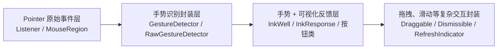

#### 18.1、👋[**Flutter**](https://flutter.dev/)中的手势系统本质（由三层机制组成）<a href="#前言" style="font-size:17px; color:green;"><b>🔼</b></a> <a href="#🔚" style="font-size:17px; color:green;"><b>🔽</b></a>

| 层级   | 名称                                                         | 说明                                                         |
| ------ | ------------------------------------------------------------ | ------------------------------------------------------------ |
| 1️⃣ 底层 | **Pointer 事件**：`Listener`<br/>➤ `Listener` 捕获的是 **Pointer 级别**，它能看到事件，但并不代表能改变 **GestureArena** 的裁决。<br>➤`Listener` 只能监听，但 **不能打破（干预） Arena 的胜负结果** | 原始事件监听<br/>如：**pointerDown**、**pointerMove**，等    |
| 2️⃣ 中层 | **Gesture 识别**：`GestureDetector`<br/>➤负责仲裁，一旦胜出就独占事件。 | 对原始事件进行识别封装<br/>如：**TapGestureRecognizer**、**DragGestureRecognizer**、**ScrollView**，等 |
| 3️⃣ 高层 | `InkWell`, `InkResponse`                                     | 组件化的手势 + 视觉反馈（如水波纹）                          |

#### 18.2、👋滚动控件的特殊性 <a href="#前言" style="font-size:17px; color:green;"><b>🔼</b></a> <a href="#🔚" style="font-size:17px; color:green;"><b>🔽</b></a>

- 滚动相关的组件（`ListView`、`SingleChildScrollView`、`PageView`）内部有自己的手势识别器

  它们会“吃掉”拖拽事件，除非：

  - 到边界后放弃（Android 常见）
  - 或者物理模型允许回弹（iOS 常见，仍会持有手势）

- <font color=red>想要协调父子滚动，必须通过 **Physics** 或 **通知机制**，而不是单纯依赖 Pointer 监听</font>

➤ 所以 **Pointer 监听无法改变滚动控件的既定行为**

#### 18.3、👋[**Flutter**](https://flutter.dev/) 中所有手势相关 **`Widget`** 一览（全量分类）<a href="#前言" style="font-size:17px; color:green;"><b>🔼</b></a> <a href="#🔚" style="font-size:17px; color:green;"><b>🔽</b></a>

* 🔹原始指针事件层（Pointer 级）：处理最底层的触摸事件（**pointer down** / **move** / **up** 等）

  | Widget               | 说明                                                         |
  | -------------------- | ------------------------------------------------------------ |
  | **`Listener`**       | 监听原始 **Pointer** 事件（触摸按下、移动、抬起、取消、进入、离开等） |
  | `MouseRegion`        | 专门处理鼠标事件（进入、悬停、离开、位置）                   |
  | `RawGestureDetector` | 手动构建手势识别器，适合自定义复杂手势识别逻辑               |
  | `IgnorePointer`      | 禁用子组件对 **Pointer** 事件的响应                          |
  | `AbsorbPointer`      | 拦截 **Pointer** 事件（自身响应但不传递给子组件）            |

* 🔹手势识别层（Gesture 级）：对原始 **Pointer** 的封装，负责识别出“点击/拖动/缩放”等语义手势

  | Widget                                                       | 说明                                                         |
  | ------------------------------------------------------------ | ------------------------------------------------------------ |
  | **`GestureDetector`**                                        | 支持 **tap**、**double tap**、**long press**、**drag**、**scale** 等完整手势<br/>❌ 无视觉反馈 |
  | `Dismissible`                                                | 支持滑动删除手势，内置动画                                   |
  | **`Draggable`**                                              | 可拖拽组件<br/>✅ 内建拖动逻辑                                |
  | `LongPressDraggable`                                         | 长按后触发拖拽                                               |
  | **`DragTarget`**                                             | 拖拽目标区，可接收拖拽数据<br/>✅ 内建拖动逻辑                |
  | `InteractiveViewer`                                          | 支持缩放、拖动、旋转的交互容器                               |
  | `GestureDetectorWithMultipleCustomGestureRecognizer`（自定义组合） | 自己组合多个识别器<br/>需 RawGestureDetector                 |

* 🔹手势 + 视觉反馈层（带交互视觉）：这些组件不仅支持手势识别，还附带点击反馈（如水波纹）

  | Widget                                                       | 说明                                                         |
  | ------------------------------------------------------------ | ------------------------------------------------------------ |
  | **`InkWell`**                                                | 点击水波纹效果，配合 `Material` 使用                         |
  | **`InkResponse`**                                            | 更灵活控制水波纹范围的点击组件<br>更灵活的 Ink 效果<br/>支持圆形<br/>可调点击区域等 |
  | `CupertinoButton`                                            | iOS 风格按钮，自带点击高亮反馈                               |
  | `MaterialButton` / `ElevatedButton` / `TextButton` / `OutlinedButton` | 都是封装了点击反馈的组件                                     |

  * ```dart
    /// 默认情况下，splashColor 和 highlightColor 都是从 Theme 里取的（一般是浅灰色），所以即使背景透明，也会看到点击的涟漪或暗色变化。
    /// 想让点击时完全没有视觉反应
    InkWell(
      onTap: onTap,
      onDoubleTap: onDoubleTap,
      onLongPress: onLongPress,
      borderRadius: borderRadius,
      splashColor: Colors.transparent, // 改成透明,
      highlightColor: Colors.transparent, // 改成透明,
      child: child,
    )
    ```

* 🔹组合行为类组件（复杂手势交互）

  | Widget                   | 说明                                          |
  | ------------------------ | --------------------------------------------- |
  | `PageView`               | 可横向/纵向滑动分页（内部使用拖拽手势）       |
  | **`Dismissible`**        | 处理左右滑动删除的手势（✅ 内建动画）          |
  | `RefreshIndicator`       | 下拉刷新（配合滚动手势触发）                  |
  | `Slider` / `RangeSlider` | 拖动滑块（拖拽 + tap）                        |
  | `Switch` / `Checkbox`    | 也支持手势（tap）但通常不直接作为手势组件使用 |

#### 18.4、👋通用点击组件 <a href="#前言" style="font-size:17px; color:green;"><b>🔼</b></a> <a href="#🔚" style="font-size:17px; color:green;"><b>🔽</b></a>

```dart
/// - ripple=true 走 Material+InkWell（有水波纹）
/// - ripple=false 走 GestureDetector（零视觉反馈）
/// - 支持 behavior（点击区域扩展）与 onPanUpdate（拖动手势）
/// - 可自定义圆角与水波纹/高亮颜色（不传则走 Theme）
class CommonRipple extends StatelessWidget {
  final Widget child; // 显示内容
  final GestureTapCallback? onTap; // 点击
  final GestureTapCallback? onDoubleTap; // 双击
  final GestureLongPressCallback? onLongPress; // 长按
  final GestureDragUpdateCallback? onPanUpdate; // 拖动
  final HitTestBehavior behavior; // 命中策略（默认 Opaque 扩大可点区域）
  final BorderRadius borderRadius; // 圆角
  final bool ripple; // 是否显示水波纹
  final Color? splashColor; // 水波纹颜色（ripple=true 时生效）
  final Color? highlightColor; // 高亮颜色（ripple=true 时生效）

  const CommonRipple({
    super.key,
    required this.child,
    this.onTap,
    this.onDoubleTap,
    this.onLongPress,
    this.onPanUpdate,
    this.behavior = HitTestBehavior.opaque,
    this.borderRadius = BorderRadius.zero,
    this.ripple = true,
    this.splashColor, // 不传走 Theme；传 Colors.transparent 可“隐形水波纹”
    this.highlightColor, // 同上
  });

  @override
  Widget build(BuildContext context) {
    if (!ripple) {
      // 纯手势，无任何视觉反馈
      return GestureDetector(
        behavior: behavior,
        onTap: onTap,
        onDoubleTap: onDoubleTap,
        onLongPress: onLongPress,
        onPanUpdate: onPanUpdate,
        child: child,
      );
    }

    // 有水波纹：InkWell 负责点击反馈；外层 GestureDetector 只负责拖动（不抢 tap）
    final ink = Material(
      color: Colors.transparent,
      shape: RoundedRectangleBorder(borderRadius: borderRadius),
      child: InkWell(
        onTap: onTap,
        onDoubleTap: onDoubleTap,
        onLongPress: onLongPress,
        borderRadius: borderRadius,
        splashColor: splashColor,
        highlightColor: highlightColor,
        child: child,
      ),
    );

    // 仅当需要拖动时才包一层，避免不必要的手势竞争
    if (onPanUpdate == null && behavior == HitTestBehavior.opaque) {
      return ink;
    }
    return GestureDetector(
      behavior: behavior,
      // 这里只放拖动相关，避免与 InkWell 抢 tap/longPress
      onPanUpdate: onPanUpdate,
      child: ink,
    );
  }
}
```

>**用法示例**
>
>```dart
>// 1) 有水波纹（主题色），并限制在圆角内
>CommonRipple(
>  borderRadius: BorderRadius.circular(16),
>  onTap: () => print('tap'),
>  child: Container(height: 48, alignment: Alignment.center, child: Text('Go')),
>);
>
>// 2) 有水波纹，但“隐形反馈”（不想看到涟漪/高亮）
>CommonRipple(
>  splashColor: Colors.transparent,
>  highlightColor: Colors.transparent,
>  onTap: () {},
>  child: const Icon(Icons.play_arrow),
>);
>
>// 3) 无水波纹，行为为 Opaque 扩大可点区域，同时支持拖动
>CommonRipple(
>  ripple: false,
>  behavior: HitTestBehavior.opaque,
>  onPanUpdate: (d) => print('dx=${d.delta.dx}, dy=${d.delta.dy}'),
>  child: const SizedBox(width: 200, height: 40, child: Text('Drag me')),
>);
>```

#### 18.5、👋[**Flutter**](https://flutter.dev/)<font color=red>**手势竞争**</font> <a href="#前言" style="font-size:17px; color:green;"><b>🔼</b></a> <a href="#🔚" style="font-size:17px; color:green;"><b>🔽</b></a>

##### 18.5.1、👋手势竞争的原理 <a href="#前言" style="font-size:17px; color:green;"><b>🔼</b></a> <a href="#🔚" style="font-size:17px; color:green;"><b>🔽</b></a>

* 事件发生后，所有对此事件感兴趣的手势识别器（recognizers）都会进入这个 **Gesture Arena**；
* 这些识别器先处于 **待定（pending）** 状态，等待更多事件来判断是否要**放弃**或**胜出**；
* 一旦某个识别器确认可以处理这个手势，就会尝试 **宣告胜利**；
* 其他竞争者可以选择放弃，也可能还在等待，但一旦胜者确定，其余的都被强制取消；

##### 18.5.2、👋胜负决策规则 <a href="#前言" style="font-size:17px; color:green;"><b>🔼</b></a> <a href="#🔚" style="font-size:17px; color:green;"><b>🔽</b></a>

> 优先级不是全局固定的，不同 recognizer 之间的实现有差异

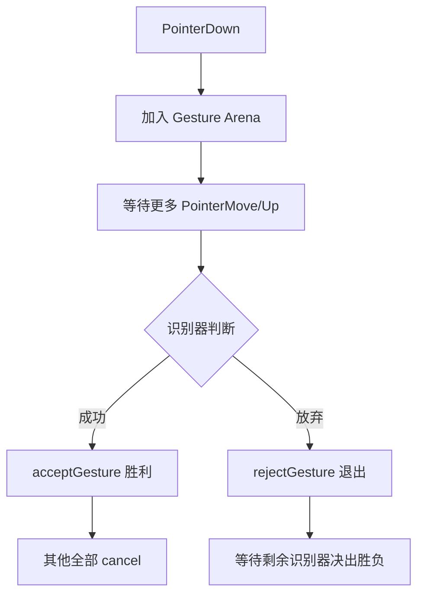

* 如果一个手势识别器 **主动认输**（`rejectGesture`），它就退出竞争；
* 如果一个手势识别器 **先确定识别成功**（`acceptGesture`），就会成为赢家，其他全部失败；
* 如果大家都没明确放弃，[**Flutter**](https://flutter.dev/) 会根据**优先级规则**决定赢家（比如拖拽比点击优先）；

##### 18.5.3、👋常用的手势冲突场景以及解决技巧（范式） <a href="#前言" style="font-size:17px; color:green;"><b>🔼</b></a> <a href="#🔚" style="font-size:17px; color:green;"><b>🔽</b></a>

> **尽早决策**：基于位移阈值（6~10px）尽快确定方向，另一方向立刻**沉默**
>
> **命中区域**：点击类交互，优先 `HitTestBehavior.translucent/opaque`，避免**只能点到文本**
>
> **水波纹**：任何 `Ink` 波纹都**必须有 `Material` 祖先**
>
> **混合滚动**：父子滚动**明确轴向**，必要时给一方 `NeverScrollableScrollPhysics`
>
> **原始监听**：统计/埋点走 `Listener`，不要和手势识别器抢

###### 18.5.3.1、👋`ListView` 滑动 🆚 `GestureDetector` onTap

> **现象**：轻扫/轻移后点击不触发，或只能点到文字不点空白
>
> **根因**：**Drag** 识别器与 **沉默** 竞争；命中区域小
>
> **范式**：`behavior: translucent/opaque` + 用 `onTapUp`（更稳）

<details>
<summary>点击查看代码</summary>

```dart
class ListViewTapFix extends StatelessWidget {
  const ListViewTapFix({super.key});
  @override
  Widget build(BuildContext context) {
    return ListView.builder(
      itemCount: 20,
      itemBuilder: (_, i) => GestureDetector(
        behavior: HitTestBehavior.translucent, // 整行都可点
        onTapUp: (_) => debugPrint('Tap item $i'),
        child: const Padding(
          padding: EdgeInsets.all(16),
          child: Text('点整行都行，轻微滑动也能识别'),
        ),
      ),
    );
  }
}
```
</details>

###### 18.5.3.2、👋`HorizontalDrag` 🆚  `VerticalDrag` 冲突

> **现象**：横竖两个拖拽识别器互相抢手势
>
> **根因**：两者同时入场；先赢者清场
>
> **范式**：用 `RawGestureDetector` 同时注册，按位移阈值决定优先方向（早决策，另一方放弃）

<details>
<summary>点击查看代码</summary>

```dart
class DragAxisArbiter extends StatefulWidget {
  const DragAxisArbiter({super.key});
  @override State<DragAxisArbiter> createState() => _S();
}
class _S extends State<DragAxisArbiter> {
  double dx=0, dy=0; bool decided=false; bool horizontalWin=false;

  @override
  Widget build(BuildContext context) {
    return RawGestureDetector(
      gestures: {
        HorizontalDragGestureRecognizer:
          GestureRecognizerFactoryWithHandlers<HorizontalDragGestureRecognizer>(
        () => HorizontalDragGestureRecognizer()
          ..onStart = (_) { dx=dy=0; decided=false; }
          ..onUpdate = (d) {
            dx += d.delta.dx.abs(); dy += d.delta.dy.abs();
            if (!decided && (dx>6 || dy>6)) { // 阈值
              decided = true; horizontalWin = dx >= dy;
            }
            if (!horizontalWin) return; // 竖向赢就忽略横向逻辑
            // 横向拖动逻辑...
          }, (r) {}),
        VerticalDragGestureRecognizer:
          GestureRecognizerFactoryWithHandlers<VerticalDragGestureRecognizer>(
        () => VerticalDragGestureRecognizer()
          ..onUpdate = (d) {
            if (decided && horizontalWin) return; // 横向赢时忽略纵向
            // 纵向拖动逻辑...
          }, (r) {})
      },
      behavior: HitTestBehavior.opaque,
      child: Container(
        height: 160, alignment: Alignment.center, color: Colors.amber.shade200,
        child: const Text('按位移阈值决定横/竖优先'),
      ),
    );
  }
}
```
</details>

###### 18.5.3.3、👋嵌套 `InkWell` / `GestureDetector`（内层不触发或波纹丢失）

> **现象**：外层先赢导致内层不响应；波纹不显示
>
> **根因**：父子手势竞争，父先接受；没有 `Material` 载体
>
> **范式**：给内层包 `Material`；必要时父层用 `IgnorePointer`/`absorbing=false`

<details>
<summary>点击查看代码</summary>

```dart
class NestedInkWellFix extends StatelessWidget {
  const NestedInkWellFix({super.key});
  @override
  Widget build(BuildContext context) {
    return GestureDetector( // 父层只做非冲突逻辑，避免 onTap 抢手势
      onLongPress: () => debugPrint('父层长按'),
      child: Material( // 提供墨水层
        color: Colors.transparent,
        child: InkWell(
          onTap: () => debugPrint('内层点击（有水波纹）'),
          child: const Padding(
            padding: EdgeInsets.all(16), child: Text('内层 InkWell'),
          ),
        ),
      ),
    );
  }
}
```
</details>

###### 18.5.3.4、👋`PageView`（横向滚动）嵌在可垂直滚动的父容器

> **现象**：横向翻页与父容器纵向滚动抢手势，翻页吃力。
>
> **根因**：两层滚动手势竞争。
>
> **范式**：限制父容器只纵向，子容器只横向；必要时用 `physics` 定向。

<details>
<summary>点击查看代码</summary>

```dart
class PageInScrollFix extends StatelessWidget {
  const PageInScrollFix({super.key});
  @override
  Widget build(BuildContext context) {
    return ListView(
      physics: const ClampingScrollPhysics(), // 只纵向
      children: [
        SizedBox(
          height: 200,
          child: PageView( // 只横向
            physics: const PageScrollPhysics(),
            children: const [ColoredBox(color: Colors.red), ColoredBox(color: Colors.blue)],
          ),
        ),
        const SizedBox(height: 800, child: Text('下面随便滚')),
      ],
    );
  }
}
```
</details>

###### 18.5.3.5、👋`GestureDetector` + `ListView` 同时存在，希望：点击 + 长按拖动排序

> **现象**：拖动排序和点击互斥，偶发点击不触发
>
> **根因**：**Tap** 与 **Drag** 竞争
>
> **范式**：点击用 `onTapUp`；拖动加**最小位移阈值**确认进入拖动模式

<details>
<summary>点击查看代码</summary>

```dart
class TapAndDragThreshold extends StatefulWidget {
  const TapAndDragThreshold({super.key});
  @override State<TapAndDragThreshold> createState() => _S();
}
class _S extends State<TapAndDragThreshold> {
  Offset? down; bool dragging=false;
  @override
  Widget build(BuildContext context) {
    return Listener( // 记录原始位移，独立于 GestureArena
      onPointerDown: (e){ down = e.position; dragging=false; },
      onPointerMove: (e){
        if (down!=null && (e.position - down!).distance > 6) dragging=true;
      },
      child: ListView.builder(
        itemCount: 20,
        itemBuilder: (_, i) => GestureDetector(
          behavior: HitTestBehavior.opaque,
          onTapUp: (_) { if(!dragging) debugPrint('Tap $i'); },
          onLongPressMoveUpdate: (_) => debugPrint('拖动中 $i'), // 你的排序逻辑
          child: Padding(
            padding: const EdgeInsets.all(16), child: Text('Item $i'),
          ),
        ),
      ),
    );
  }
}
```
</details>

###### 18.5.3.6、👋`InteractiveViewer`（可缩放/拖拽）内的点击热区失效

> **现象**：里层按钮/点击不触发
>
> **根因**：`InteractiveViewer` 抢走了拖拽/缩放手势
>
> **范式**：给子项用 `InkWell` + `behavior`；或把点击层放到 `Stack` 的上层并配 `IgnorePointer`/`AbsorbPointer` 精准控制

<details>
<summary>点击查看代码</summary>

```dart
class InteractiveViewerTapFix extends StatelessWidget {
  const InteractiveViewerTapFix({super.key});
  @override
  Widget build(BuildContext context) {
    return Stack(
      children: [
        InteractiveViewer(
          minScale: 1, maxScale: 3,
          child: Image.asset('assets/large_map.png', fit: BoxFit.cover),
        ),
        // 顶层可点热区
        Positioned(
          left: 40, top: 80,
          child: Material(
            color: Colors.transparent,
            child: InkWell(
              onTap: () => debugPrint('点到标记'),
              child: const Icon(Icons.location_on, size: 32),
            ),
          ),
        ),
      ],
    );
  }
}
```
</details>

###### 18.5.3.7、👋横向可滚容器中的纵向手势（或反之）

> **现象**：内层短轴方向手势不灵
>
> **根因**：父子滚动方向混淆
>
> **范式**：用 `SingleChildScrollView` 明确方向/禁用另一方向；或 `NeverScrollableScrollPhysics` 交给外层

<details>
<summary>点击查看代码</summary>

```dart
class AxisClearanceFix extends StatelessWidget {
  const AxisClearanceFix({super.key});
  @override
  Widget build(BuildContext context) {
    return SingleChildScrollView(
      scrollDirection: Axis.horizontal, // 明确只横向
      child: Row(
        children: List.generate(5, (i) =>
          SizedBox(
            width: 260,
            child: ListView( // 内层明确纵向滚
              physics: const ClampingScrollPhysics(),
              shrinkWrap: true,
              children: List.generate(10, (j) =>
                ListTile(title: Text('卡片 $i - 行 $j'))),
            ),
          ),
        ),
      ),
    );
  }
}
```
</details>

###### 18.5.3.8、👋父层 `GestureDetector` 抢走子层点击

> **现象**：父层 `onTap` 吃掉事件，子层不触发
>
> **根因**：父先赢 Arena
>
> **范式**：父层监听非冲突事件（如长按/双击）；或在父层用 `behavior: deferToChild`；或对子层包 `IgnorePointer` 控制穿透

<details>
<summary>点击查看代码</summary>

```dart
class ParentStealFix extends StatelessWidget {
  const ParentStealFix({super.key});
  @override
  Widget build(BuildContext context) {
    return GestureDetector(
      onLongPress: () => debugPrint('父层长按，不与子点击冲突'),
      behavior: HitTestBehavior.deferToChild, // 优先子节点命中
      child: Center(
        child: Material(
          child: InkWell(
            onTap: () => debugPrint('子层点击OK'),
            child: const Padding(
              padding: EdgeInsets.all(24), child: Text('子按钮'),
            ),
          ),
        ),
      ),
    );
  }
}
```
</details>

###### 18.5.3.9、👋`IgnorePointer` / `AbsorbPointer` 精确阻断或穿透

<details>
<summary>点击查看代码</summary>

```dart
class DemoIgnoreAbsorb extends StatelessWidget {
  const DemoIgnoreAbsorb({super.key});

  @override
  Widget build(BuildContext context) {
    return Stack(
      children: [
        // 底层：可点击背景
        Positioned.fill(
          child: GestureDetector(
            onTap: () => debugPrint('✅ 底层背景 tapped'),
            child: Container(color: Colors.green.shade100),
          ),
        ),

        // —— 二选一体验差异 ——
        // 1) IgnorePointer：自己不响应，事件“穿透”给底层
        // child: IgnorePointer(
        //   ignoring: true,
        //   child: _panel('IgnorePointer：点我会穿透到底层'),
        // ),

        // 2) AbsorbPointer：自己不响应，且“吸收”事件，不给底层
        child: AbsorbPointer(
          absorbing: true,
          child: _panel('AbsorbPointer：点我不会触发任何层'),
        ),
      ],
    );
  }

  Widget _panel(String text) => Align(
        alignment: Alignment.center,
        child: Container(
          width: 260, height: 120, alignment: Alignment.center,
          decoration: BoxDecoration(
            color: Colors.blue.withOpacity(0.4),
            borderRadius: BorderRadius.circular(12),
          ),
          child: Text(text, textAlign: TextAlign.center),
        ),
      );
}
```
</details>

###### 18.5.3.10、👋自定义 `GestureRecognizer`（精细控制胜负时机）

<details>
<summary>点击查看代码</summary>

```dart
import 'dart:async';
import 'package:flutter/gestures.dart';
import 'package:flutter/material.dart';

/// 按住 >= 300ms 才算成功；成功后 accept，其他手势被取消
class PressAndHoldGestureRecognizer extends OneSequenceGestureRecognizer {
  PressAndHoldGestureRecognizer({this.onHold});
  final VoidCallback? onHold;
  Timer? _t; bool _won = false;

  @override
  void addPointer(PointerDownEvent event) {
    startTrackingPointer(event.pointer);
    resolve(GestureDisposition.pending);
    _t = Timer(const Duration(milliseconds: 300), () {
      if (_won) return;
      _won = true;
      resolve(GestureDisposition.accepted); // 宣布胜利
      onHold?.call();
    });
  }

  @override
  void handleEvent(PointerEvent event) {
    if (event is PointerUpEvent || event is PointerCancelEvent) {
      stopTrackingPointer(event.pointer);
      _t?.cancel();
      if (!_won) resolve(GestureDisposition.rejected); // 未到 300ms 认输
    }
  }

  @override String get debugDescription => 'pressAndHold';
  @override void didStopTrackingLastPointer(int pointer) {}
  @override void dispose() { _t?.cancel(); super.dispose(); }
}

class DemoCustomRecognizer extends StatelessWidget {
  const DemoCustomRecognizer({super.key});

  @override
  Widget build(BuildContext context) {
    return Center(
      child: RawGestureDetector(
        gestures: {
          PressAndHoldGestureRecognizer:
              GestureRecognizerFactoryWithHandlers<PressAndHoldGestureRecognizer>(
            () => PressAndHoldGestureRecognizer(
              onHold: () => debugPrint('✅ Hold >= 300ms，赢下 Arena'),
            ),
            (r) {},
          ),
        },
        behavior: HitTestBehavior.opaque,
        child: Container(
          width: 220, height: 80, alignment: Alignment.center,
          color: Colors.orange.shade200,
          child: const Text('按住 ≥300ms 触发（自定义识别器）'),
        ),
      ),
    );
  }
}
```
</details>

#### 18.6、[**Flutter**](https://flutter.dev/)手势冲突⚔️（iOS/Android的核心差异） <a href="#前言" style="font-size:17px; color:green;"><b>🔼</b></a> <a href="#🔚" style="font-size:17px; color:green;"><b>🔽</b></a>

##### 18.6.1、👋手势竞技场机制差异 <a href="#前言" style="font-size:17px; color:green;"><b>🔼</b></a> <a href="#🔚" style="font-size:17px; color:green;"><b>🔽</b></a>

* **Android**
  * 底层基于 `View.onInterceptTouchEvent`
  * 子 `ScrollView` 到边缘后，事件容易被“拦截”并交回父级

* **iOS**
  * [**Flutter**](https://flutter.dev/) 的 `GestureArena` 模拟了 `UIScrollView`
  * iOS 认为「垂直滚动」是一个整体区域，不轻易释放手势
  * 子 `ScrollView` 到边缘后，仍然尝试继续消费，不把事件交给父级

##### 18.6.2、👋滚动物理差异 <a href="#前言" style="font-size:17px; color:green;"><b>🔼</b></a> <a href="#🔚" style="font-size:17px; color:green;"><b>🔽</b></a>

* **Android 默认 → `ClampingScrollPhysics`**

  - 滚动到边界后立即**硬停**
  - 子视图停止消费，父级容易接管
* **iOS 默认 → `BouncingScrollPhysics`**
  * 滚动到边界还能**拉出一截回弹**
  * 子视图觉得自己还能继续滚动 → 不释放给父级

##### 18.6.3、👋`Pointer`监听的限制 <a href="#前言" style="font-size:17px; color:green;"><b>🔼</b></a> <a href="#🔚" style="font-size:17px; color:green;"><b>🔽</b></a>

##### 18.6.4、👋通用解释 <a href="#前言" style="font-size:17px; color:green;"><b>🔼</b></a> <a href="#🔚" style="font-size:17px; color:green;"><b>🔽</b></a>

* **Android** 的手势分发更**宽松**，子控件到边界会放手给父级

* **iOS** 的手势分发更“顽固”，子控件即使到边界也会继续尝试消费，导致父级无法接管

#### 18.7、👋[**Flutter**](https://flutter.dev/)手势语法糖🍬 <a href="#前言" style="font-size:17px; color:green;"><b>🔼</b></a> <a href="#🔚" style="font-size:17px; color:green;"><b>🔽</b></a>

<details>
<summary>Widget关于手势的拓展</summary>

```dart
import 'package:flutter/gestures.dart';
import 'package:flutter/material.dart';

/// 🍬语法糖：手势聚合
extension WidgetExtension on Widget {
  Widget gestures({
    Key? key,
    HitTestBehavior? behavior,
    bool excludeFromSemantics = false,
    DragStartBehavior dragStartBehavior = DragStartBehavior.start,

    // ==== Tap ====
    GestureTapDownCallback? onTapDown,
    GestureTapUpCallback? onTapUp,
    GestureTapCallback? onTap,
    GestureTapCancelCallback? onTapCancel,

    // ==== Secondary Tap ====
    GestureTapDownCallback? onSecondaryTapDown,
    GestureTapUpCallback? onSecondaryTapUp,
    GestureTapCallback? onSecondaryTap,
    GestureTapCancelCallback? onSecondaryTapCancel,

    // ==== Tertiary Tap ====
    GestureTapDownCallback? onTertiaryTapDown,
    GestureTapUpCallback? onTertiaryTapUp,
    GestureTapCancelCallback? onTertiaryTapCancel,

    // ==== Double Tap ====
    GestureTapDownCallback? onDoubleTapDown,
    GestureTapCallback? onDoubleTap,
    GestureTapCancelCallback? onDoubleTapCancel,

    // ==== Long Press ====
    GestureLongPressDownCallback? onLongPressDown,
    GestureLongPressCallback? onLongPress,
    GestureLongPressStartCallback? onLongPressStart,
    GestureLongPressMoveUpdateCallback? onLongPressMoveUpdate,
    GestureLongPressUpCallback? onLongPressUp,
    GestureLongPressEndCallback? onLongPressEnd,

    // ==== Pan（自由拖拽）====
    GestureDragStartCallback? onPanStart,
    GestureDragUpdateCallback? onPanUpdate,
    GestureDragEndCallback? onPanEnd,
    GestureDragCancelCallback? onPanCancel,

    // ==== 水平拖拽 ====
    GestureDragStartCallback? onHorizontalDragStart,
    GestureDragUpdateCallback? onHorizontalDragUpdate,
    GestureDragEndCallback? onHorizontalDragEnd,
    GestureDragCancelCallback? onHorizontalDragCancel,

    // ==== 垂直拖拽 ====
    GestureDragStartCallback? onVerticalDragStart,
    GestureDragUpdateCallback? onVerticalDragUpdate,
    GestureDragEndCallback? onVerticalDragEnd,
    GestureDragCancelCallback? onVerticalDragCancel,

    // ==== 缩放（Pan 的超集）====
    GestureScaleStartCallback? onScaleStart,
    GestureScaleUpdateCallback? onScaleUpdate,
    GestureScaleEndCallback? onScaleEnd,
  }) {
    // ==== 🚨 冲突检测：Scale 与 Pan 系列不能同时使用 ====
    final hasScale =
        onScaleStart != null || onScaleUpdate != null || onScaleEnd != null;
    final hasAnyPan = onPanStart != null ||
        onPanUpdate != null ||
        onPanEnd != null ||
        onPanCancel != null ||
        onHorizontalDragStart != null ||
        onHorizontalDragUpdate != null ||
        onHorizontalDragEnd != null ||
        onHorizontalDragCancel != null ||
        onVerticalDragStart != null ||
        onVerticalDragUpdate != null ||
        onVerticalDragEnd != null ||
        onVerticalDragCancel != null;

    assert(
        !(hasScale && hasAnyPan),
        '❌ GestureDetector 冲突：Scale 已包含 Pan 功能，不可同时声明。'
        '➤ 如果需要拖拽 + 缩放，请仅使用 Scale 系列回调（focalPointDelta 处理平移，scale 处理缩放）。');

    // ==== Release 环境自动屏蔽冲突 ====
    final enablePan = !hasScale;

    return GestureDetector(
      key: key,
      behavior: behavior ?? HitTestBehavior.opaque,
      excludeFromSemantics: excludeFromSemantics,
      dragStartBehavior: dragStartBehavior,

      // Tap
      onTapDown: onTapDown,
      onTapUp: onTapUp,
      onTap: onTap,
      onTapCancel: onTapCancel,

      // Secondary
      onSecondaryTapDown: onSecondaryTapDown,
      onSecondaryTapUp: onSecondaryTapUp,
      onSecondaryTap: onSecondaryTap,
      onSecondaryTapCancel: onSecondaryTapCancel,

      // Tertiary
      onTertiaryTapDown: onTertiaryTapDown,
      onTertiaryTapUp: onTertiaryTapUp,
      onTertiaryTapCancel: onTertiaryTapCancel,

      // Double Tap
      onDoubleTapDown: onDoubleTapDown,
      onDoubleTap: onDoubleTap,
      onDoubleTapCancel: onDoubleTapCancel,

      // Long Press
      onLongPressDown: onLongPressDown,
      onLongPress: onLongPress,
      onLongPressStart: onLongPressStart,
      onLongPressMoveUpdate: onLongPressMoveUpdate,
      onLongPressUp: onLongPressUp,
      onLongPressEnd: onLongPressEnd,

      // Pan / Drag（仅当未使用 Scale 时才生效）
      onPanStart: enablePan ? onPanStart : null,
      onPanUpdate: enablePan ? onPanUpdate : null,
      onPanEnd: enablePan ? onPanEnd : null,
      onPanCancel: enablePan ? onPanCancel : null,

      onHorizontalDragStart: enablePan ? onHorizontalDragStart : null,
      onHorizontalDragUpdate: enablePan ? onHorizontalDragUpdate : null,
      onHorizontalDragEnd: enablePan ? onHorizontalDragEnd : null,
      onHorizontalDragCancel: enablePan ? onHorizontalDragCancel : null,

      onVerticalDragStart: enablePan ? onVerticalDragStart : null,
      onVerticalDragUpdate: enablePan ? onVerticalDragUpdate : null,
      onVerticalDragEnd: enablePan ? onVerticalDragEnd : null,
      onVerticalDragCancel: enablePan ? onVerticalDragCancel : null,

      // Scale
      onScaleStart: onScaleStart,
      onScaleUpdate: onScaleUpdate,
      onScaleEnd: onScaleEnd,

      child: this,
    );
  }

  // ==================== 🎯 常用手势语法糖 ====================
  Widget onTap(GestureTapCallback? fn,
          {HitTestBehavior behavior = HitTestBehavior.opaque}) =>
      gestures(onTap: fn, behavior: behavior);

  Widget onDoubleTap(GestureTapCallback? fn,
          {HitTestBehavior behavior = HitTestBehavior.opaque}) =>
      gestures(onDoubleTap: fn, behavior: behavior);

  Widget onLongPress(GestureLongPressCallback? fn,
          {HitTestBehavior behavior = HitTestBehavior.opaque}) =>
      gestures(onLongPress: fn, behavior: behavior);

  Widget onPan({
    GestureDragStartCallback? start,
    GestureDragUpdateCallback? update,
    GestureDragEndCallback? end,
    GestureDragCancelCallback? cancel,
    HitTestBehavior behavior = HitTestBehavior.opaque,
  }) =>
      gestures(
        onPanStart: start,
        onPanUpdate: update,
        onPanEnd: end,
        onPanCancel: cancel,
        behavior: behavior,
      );

  Widget onHorizontalDrag({
    GestureDragStartCallback? start,
    GestureDragUpdateCallback? update,
    GestureDragEndCallback? end,
    GestureDragCancelCallback? cancel,
    HitTestBehavior behavior = HitTestBehavior.opaque,
  }) =>
      gestures(
        onHorizontalDragStart: start,
        onHorizontalDragUpdate: update,
        onHorizontalDragEnd: end,
        onHorizontalDragCancel: cancel,
        behavior: behavior,
      );

  Widget onVerticalDrag({
    GestureDragStartCallback? start,
    GestureDragUpdateCallback? update,
    GestureDragEndCallback? end,
    GestureDragCancelCallback? cancel,
    HitTestBehavior behavior = HitTestBehavior.opaque,
  }) =>
      gestures(
        onVerticalDragStart: start,
        onVerticalDragUpdate: update,
        onVerticalDragEnd: end,
        onVerticalDragCancel: cancel,
        behavior: behavior,
      );

  Widget onScale({
    GestureScaleStartCallback? start,
    GestureScaleUpdateCallback? update,
    GestureScaleEndCallback? end,
    HitTestBehavior behavior = HitTestBehavior.opaque,
  }) =>
      gestures(
        onScaleStart: start,
        onScaleUpdate: update,
        onScaleEnd: end,
        behavior: behavior,
      );
}

```
</details>

<details>
<summary>使用方式</summary>

```dart
import 'package:jobs_flutter_base_config/JobsDemoTools/JobsFlutterTools/JobsRunners/JobsMaterialRunner.dart';
import 'package:jobs_flutter_base_config/JobsDemoTools/Utils/Extensions/WidgetExtension/JobsWidgetExtension.dart';

void main() =>
    runApp(const JobsMaterialRunner(GestureDemoPage(), title: '手势扩展示例'));

class GestureDemoPage extends StatefulWidget {
  const GestureDemoPage({super.key});

  @override
  State<GestureDemoPage> createState() => _GestureDemoPageState();
}

class _GestureDemoPageState extends State<GestureDemoPage> {
  String _log = "等待手势...";

  void _updateLog(String text) {
    setState(() => _log = text);
    debugPrint(text);
  }

  @override
  Widget build(BuildContext context) {
    return Column(
      children: [
        const SizedBox(height: 20),
        // 聚合 gestures 用法
        Container(
          color: Colors.blue,
          height: 100,
          width: 200,
          alignment: Alignment.center,
          child: const Text(
            "🖐 演示区\n可单击、双击、长按、拖动、缩放、鼠标中键点击",
            textAlign: TextAlign.center,
            style: TextStyle(color: Colors.white, fontSize: 14),
          ),
        ).center().gestures(
              onTap: () => _updateLog("➤ Tap"),
              onDoubleTap: () => _updateLog("➤ Double Tap"),
              onLongPress: () => _updateLog("➤ Long Press"),
              onScaleUpdate: (details) {
                // 平移：details.focalPointDelta
                final dx = details.focalPointDelta.dx;
                final dy = details.focalPointDelta.dy;

                // 缩放：details.scale（=1 表示纯平移）
                final scale = details.scale;

                _updateLog(
                    "➤ Scale pan(dx=$dx, dy=$dy), zoom=${scale.toStringAsFixed(2)}");
              },
              onTertiaryTapUp: (_) => _updateLog("➤ 中键点击 (Tertiary Tap Up)"),
            ),

        const SizedBox(height: 20),

        // 单一糖函数写法
        Container(
          color: Colors.green,
          height: 80,
          width: 180,
          alignment: Alignment.center,
          child: const Text(
            "🖐 演示区\n可单击、长按",
            textAlign: TextAlign.center,
            style: TextStyle(color: Colors.white, fontSize: 14),
          ),
        )
            .center()
            .onTap(() => _updateLog("✅ 单击"))
            .onLongPress(() => _updateLog("✅ 长按")),

        const SizedBox(height: 20),

        // 日志输出
        Text(
          _log,
          style: const TextStyle(fontSize: 16, color: Colors.black87),
        ),
      ],
    );
  }
}
```
</details>

#### 18.8、👋<font color=red>**`HitTestBehavior`**</font>  <a href="#前言" style="font-size:17px; color:green;"><b>🔼</b></a> <a href="#🔚" style="font-size:17px; color:green;"><b>🔽</b></a>

```dart
enum HitTestBehavior {
  deferToChild,  // 默认：只能点击内容区域
  opaque,        //（不透明的）整个区域可点，吃掉事件，不往下传
  translucent,   //（半透明的）区域可点，但事件还能继续传给下面的组件
}
```

* `HitTestBehavior.deferToChild`

  > 1️⃣ **如果 child 是空的 / 没有尺寸，就不会触发点击**
  >
  > 2️⃣ 如果 child 是空的 / 没有尺寸，就不会触发点击

  ```dart
  GestureDetector(
    behavior: HitTestBehavior.deferToChild,
    onTap: () => print("tap"),
    child: Container(), // 没尺寸 → 点不到
  )
  ```

* `HitTestBehavior.opaque`

  > 1️⃣ 即使 child **透明 / 没背景**，**整个 widget 区域都能响应点击**
  >
  > 2️⃣ 吃掉事件
  >
  > 3️⃣ 区域 = 父容器的 `size`

  ```dart
  GestureDetector(
    behavior: HitTestBehavior.opaque,
    onTap: () => print("tap"),
    child: SizedBox(width: 200, height: 100), // 空白区域也能点
  )
  ```

* `HitTestBehavior.translucent`

  >1️⃣ 和 `opaque` 类似：**空白区域也能点**。
  >
  >2️⃣ 区别是：事件还能继续往下传递（冒泡）；`opaque` 会**吃掉事件**，`translucent` 则是**自己响应 + 继续透传**

  ```dart
  Stack(
    children: [
      GestureDetector(
        onTap: () => print("底层点到了"),
        child: Container(width: 200, height: 200, color: Colors.red),
      ),
      GestureDetector(
        behavior: HitTestBehavior.translucent,
        onTap: () => print("上层点到了"),
        child: SizedBox(width: 200, height: 200),
      ),
    ],
  );
  ```

### 19、<font id=线性布局>🧱</font> [**Flutter**](https://flutter.dev/)布局类@**`Widget`** <a href="#前言" style="font-size:17px; color:green;"><b>🔼</b></a> <a href="#🔚" style="font-size:17px; color:green;"><b>🔽</b></a>

> 🔹 布局类：**看不见的结构控制**（渲染、显示逻辑、动态构建...）。类似 iOS 中的 [**Masonry**](https://github.com/SnapKit/Masonry) 或 **AutoLayout**

#### 19.1、🧱<font id=线性布局>线性布局（类似 iOS 的 `UIStackView`）</font><a href="#前言" style="font-size:17px; color:green;"><b>🔼</b></a> <a href="#🔚" style="font-size:17px; color:green;"><b>🔽</b></a>

| Widget                                                       | 功能说明                                                     |
| ------------------------------------------------------------ | ------------------------------------------------------------ |
| <a href="#Row" style="font-size:17px; color:green;"><b>`Row`</b></a> | 水平方向排列子组件                                           |
| <a href="#Column" style="font-size:17px; color:green;"><b>`Column`</b></a> | 垂直方向排列子组件                                           |
| <a href="#Row" style="font-size:17px; color:green;"><b>`Flex`</b></a> | 可指定主轴方向（横 / 竖）                                    |
| <a href="#Expanded" style="font-size:17px; color:green;"><b>**`Expanded`**</b></a> | 1️⃣ **占据剩余空间，弹性伸缩**<br/>2️⃣ <font color=red>**只在 `Row` / `Column` / `Flex` 中起作用**</font>，用来自动填满多余的可用空间<br/>3️⃣ 不能用于 `Stack` / `Container` / `GridView` 等其他布局中<br/>4️⃣ 占用的是剩余空间，不能强行撑大父 **Widget** |
| <a href="#Flexible" style="font-size:17px; color:green;"><b>`Flexible`</b></a> | 弹性布局，可选择占不占满                                     |
| <a href="#Spacer" style="font-size:17px; color:green;"><b>`Spacer`</b></a> | 空间占位器，<font color=red>**实质是 `Flexible` 封装**</font> |
| <a href="#SizedBox" style="font-size:17px; color:green;"><b>`SizedBox`</b></a> | 固定尺寸或间距                                               |

> `Expanded` 🆚 `Flexible`
>
> | 比较点   | `Expanded`                | `Flexible`                     |
> | -------- | ------------------------- | ------------------------------ |
> | 默认行为 | 强制填满剩余空间          | 可以填满，也可以由内容决定大小 |
> | 常用场景 | 占满空间、均分            | 需要灵活控制内容大小时使用     |
> | 包装效果 | 是 `Flexible(fit: tight)` | 可自定义 `fit: tight/loose`    |

##### 19.1.1、🧱<font id=Row>`Row`</font> <a href="#前言" style="font-size:17px; color:green;"><b>🔼</b></a> <a href="#🔚" style="font-size:17px; color:green;"><b>🔽</b></a> <a href="#线性布局" style="font-size:17px; color:green;"><b>⬆️</b></a>

##### 19.1.2、🧱<font id=Column>`Column`</font><a href="#前言" style="font-size:17px; color:green;"><b>🔼</b></a> <a href="#🔚" style="font-size:17px; color:green;"><b>🔽</b></a> <a href="#线性布局" style="font-size:17px; color:green;"><b>⬆️</b></a>

```dart
/// 无数据占位图
Column(
  children: [
    SizedBox(height: 5.h),
    SvgPicture.asset(
    Assets.theme1.images.home.iconListEmpty,
    width: 300.w,
    ),
    Text(
     '暂无数据',
      style: TextStyle(fontSize: 40.sp),
    ),
  ],
)
```

##### 19.1.3、🧱<font id=Flex>`Flex`</font> <a href="#前言" style="font-size:17px; color:green;"><b>🔼</b></a> <a href="#🔚" style="font-size:17px; color:green;"><b>🔽</b></a> <a href="#线性布局" style="font-size:17px; color:green;"><b>⬆️</b></a>

```dart
Flex(
  direction: Axis.horizontal, // 或 Axis.vertical
  mainAxisAlignment: MainAxisAlignment.center,
  crossAxisAlignment: CrossAxisAlignment.start,
  children: [
    Expanded(child: Text('A')),
    Expanded(child: Text('B')),
  ],
)
```

* 可以看作是 `Row` 和 `Column` 的通用版本，需要手动指定方向。

* 只要是基于 `Flex` 的布局组件（如 `Row`、`Column`、`Flex`），**都支持 `crossAxisAlignment`**，它控制的是 **“垂直于主轴方向” 的子组件对齐方式**。

  | Widget   | 主轴方向                      | 交叉轴方向（crossAxis） |
  | -------- | ----------------------------- | ----------------------- |
  | `Column` | 竖直（上下）                  | 水平（左右）            |
  | `Row`    | 水平（左右）                  | 竖直（上下）            |
  | `Flex`   | 可变（通过 `direction` 指定） | 取决于 `direction`      |

##### 19.1.4、🧱<font id=Expanded>**`Expanded`**</font> <a href="#前言" style="font-size:17px; color:green;"><b>🔼</b></a> <a href="#🔚" style="font-size:17px; color:green;"><b>🔽</b></a> <a href="#线性布局" style="font-size:17px; color:green;"><b>⬆️</b></a>

> 在**主轴方向**撑满父组件剩余空间

```dart
Row(
  children: [
    Expanded(
      flex: 1, // 默认值是 1
      child: Container(color: Colors.red, height: 50),
    ),
    Expanded(
      flex: 2, // 占用剩余空间的 2 份
      child: Container(color: Colors.blue, height: 50),
    ),
  ],
)
```

```dart
Row(
  children: [
    Container(width: 80, color: Colors.orange),
    Expanded(
      child: Container(color: Colors.green), // 自动填满剩余
    ),
  ],
)
```

##### 19.1.5、🧱<font id=Flexible>`Flexible`</font> <a href="#前言" style="font-size:17px; color:green;"><b>🔼</b></a> <a href="#🔚" style="font-size:17px; color:green;"><b>🔽</b></a> <a href="#线性布局" style="font-size:17px; color:green;"><b>⬆️</b></a>

| 特性         | Expanded                   | Flexible                       |
| ------------ | -------------------------- | ------------------------------ |
| 填充剩余空间 | **必须填充（强制拉伸）**   | **可选择是否填充**             |
| `fit` 属性   | 固定为 `tight`（填满空间） | `loose`（尽量小）或 `tight`    |
| 使用频率     | 更高                       | 多用于需要灵活缩放但不强制填满 |

##### 19.1.6、🧱<font id=Spacer>`Spacer`</font> <a href="#前言" style="font-size:17px; color:green;"><b>🔼</b></a> <a href="#🔚" style="font-size:17px; color:green;"><b>🔽 </b></a><a href="#线性布局" style="font-size:17px; color:green;"><b>⬆️</b></a>

> `Spacer` 用来占据 **可伸缩的空白区域**，常用于“把两个组件拉开”或“均分距离”。

```dart
Row(
  children: [
    Text('A'),
    Spacer(flex: 1),      // 占1份
    Text('B'),
    Spacer(flex: 2),      // 占2份
    Text('C'),
  ],
)
```

##### 19.1.7、🧱<font id=SizedBox>`SizedBox`</font> <a href="#前言" style="font-size:17px; color:green;"><b>🔼</b></a> <a href="#🔚" style="font-size:17px; color:green;"><b>🔽</b></a> <a href="#线性布局" style="font-size:17px; color:green;"><b>⬆️</b></a>

```dart
/// TODO
```

#### 19.2、🧱<font id=层叠布局>层叠布局（类似 iOS 的 Frame 布局 + zIndex）</font> <a href="#前言" style="font-size:17px; color:green;"><b>🔼</b></a> <a href="#🔚" style="font-size:17px; color:green;"><b>🔽</b></a>

| Widget                                                       | 功能说明                                          |
| ------------------------------------------------------------ | ------------------------------------------------- |
| <a href="#Stack" style="font-size:17px; color:green;"><b>`Stack`</b></a> | 层叠布局（类似 **iOS** 的 `UIView` 叠加）         |
| <a href="#Positioned" style="font-size:17px; color:green;"><b>`Positioned`</b></a> | **`Stack`** 子元素定位                            |
| <a href="#Align" style="font-size:17px; color:green;"><b>`Align`</b></a> | 子组件对齐（用于 **`Stack`**、普通 **`Widget`**） |
| <a href="#Center" style="font-size:17px; color:green;"><b>`Center`</b></a> | 子组件居中                                        |

##### 19.2.1、🧱<font id=Stack>`Stack`</font> <a href="#前言" style="font-size:17px; color:green;"><b>🔼</b></a> <a href="#🔚" style="font-size:17px; color:green;"><b>🔽</b></a> <a href="#层叠布局" style="font-size:17px; color:green;"><b>⬆️</b></a>

```dart
/// 在 Flutter 中，Positioned 不能 放在 Stack 外面，必须作为 Stack 的直接子组件。这是因为 Positioned 只在 Stack 内部生效，它的布局行为依赖于父级是 Stack。
Stack(
  alignment: Alignment.center, // 默认 topStart
  clipBehavior: Clip.none,     // 默认裁剪可超出边界
  children: [
    Container(width: 200, height: 200, color: Colors.red),
    Positioned(
      top: 20,
      left: 30,
      child: Container(width: 100, height: 100, color: Colors.green),
    ),
    Text('位于中间的文字'),
  ],
)
```

```dart
/// 一个 橙色的正方形（200x200） 在底部；
/// 然后在它的 左上角，再覆盖一个 蓝色半透明的正方形（100x100）；
Stack(
  children: [
    Container(width: 200, height: 200, color: Colors.orange),
    Container(width: 100, height: 100, color: Colors.blue.withOpacity(0.6)),
  ],
)
```

##### 19.2.2、🧱<font id=Positioned>`Positioned`</font> <a href="#前言" style="font-size:17px; color:green;"><b>🔼</b></a> <a href="#🔚" style="font-size:17px; color:green;"><b>🔽</b></a> <a href="#层叠布局" style="font-size:17px; color:green;"><b>⬆️</b></a>

> 精确像素位置
>
> <font color=red>只能与 `Stack` 搭配，不能与其他容器搭配</font>

##### 19.2.3、🧱<font id=Align>`Align`</font> <a href="#前言" style="font-size:17px; color:green;"><b>🔼</b></a> <a href="#🔚" style="font-size:17px; color:green;"><b>🔽</b></a> <a href="#层叠布局" style="font-size:17px; color:green;"><b>⬆️</b></a>

> `Align` 用来在父容器中对齐子组件的位置，支持各种方向（上下左右、居中等）

```dart
/// 把按钮放在右下角
Container(
  width: 300,
  height: 300,
  color: Colors.grey,
  child: Align(
    alignment: Alignment.bottomRight,
    child: ElevatedButton(onPressed: () {}, child: Text('点我')),
  ),
)
```

```dart
/// 自定义位置
/// 在 Flutter 的 Alignment(x, y) 中：（x 和 y 范围是 -1.0 ~ 1.0）
            y = -1.0
               ↑
   (-1, -1)     |     (1, -1)
      ┌─────────┬─────────┐
      │         │         │
      │         │         │
x = -1│         │         │x = 1
      │         │         │
      │         │         │
      └─────────┴─────────┘
   (-1, 1)      ↓     (1, 1)
            y = 1.0

🔸Alignment(0, 0)：正中间，居中对齐
🔸Alignment(1.0, 1.0)：右下角，最大偏移，贴到右下角
🔸Alignment(-1.0, -1.0)：左上角，最小偏移，贴到左上角

Align(
  alignment: Alignment(0.8, -0.5), // 相对于父视图的偏移比例值（不是像素值），表示子组件相对父容器的位置：右上偏下一点
  child: Icon(Icons.star, size: 40, color: Colors.orange),
)
```

##### 19.2.4、🧱<font id=Align>`Center`</font> <a href="#前言" style="font-size:17px; color:green;"><b>🔼</b></a> <a href="#🔚" style="font-size:17px; color:green;"><b>🔽</b></a> <a href="#层叠布局" style="font-size:17px; color:green;"><b>⬆️</b></a>

> | 参数名         | 类型      | 说明                                                         |
> | -------------- | --------- | ------------------------------------------------------------ |
> | `key`          | `Key?`    | 标准 [**Flutter**](https://flutter.dev/) 构造函数参数，用于标识 **`Widget`** |
> | `child`        | `Widget?` | 要居中的子组件                                               |
> | `widthFactor`  | `double?` | 若非 null，则 **Center** 的宽度 = `child.width * widthFactor` |
> | `heightFactor` | `double?` | 若非 null，则 **Center** 的高度 = `child.height * heightFactor` |

```dart
import 'package:flutter/material.dart';
import 'package:jobs_flutter_base_config/JobsDemoTools/JobsFlutterTools/JobsRunners/JobsMaterialRunner.dart';

void main() =>
    runApp(const JobsMaterialRunner(CenterDemo(), title: 'Center 属性演示'));

class MyApp extends StatelessWidget {
  const MyApp({super.key});

  @override
  Widget build(BuildContext context) {
    return const CenterDemo();
  }
}

class CenterDemo extends StatelessWidget {
  const CenterDemo({super.key});

  @override
  Widget build(BuildContext context) {
    return Container(
      color: Colors.grey[300],
      child: Center(
        widthFactor: 2.0, // 宽度为 child 的 2 倍
        heightFactor: 3.0, // 高度为 child 的 3 倍
        child: Container(
          color: Colors.blue,
          width: 80,
          height: 80,
          child: const Center(
            child: Text(
              '居中',
              style: TextStyle(color: Colors.white),
            ),
          ),
        ),
      ),
    );
  }
}
```

#### 19.3、🧱<font id=约束类布局>约束类布局（最接近 [**Masonry**](https://github.com/SnapKit/Masonry) 的思想）</font><a href="#前言" style="font-size:17px; color:green;"><b>🔼</b></a> <a href="#🔚" style="font-size:17px; color:green;"><b>🔽</b></a>

| Widget                                                       | 功能说明                 |
| ------------------------------------------------------------ | ------------------------ |
| <a href="#ConstrainedBox" style="font-size:17px; color:green;"><b>`ConstrainedBox`</b></a> | 添加最小最大尺寸约束     |
| <a href="#UnconstrainedBox" style="font-size:17px; color:green;"><b>`UnconstrainedBox`</b></a> | 移除父组件的约束         |
| <a href="#SizedBox" style="font-size:17px; color:green;"><b>`SizedBox`</b></a> | 固定宽高尺寸             |
| <a href="#FractionallySizedBox" style="font-size:17px; color:green;"><b>`FractionallySizedBox`</b></a> | 根据父尺寸按比例设置宽高 |
| <a href="#AspectRatio" style="font-size:17px; color:green;"><b>`AspectRatio`</b></a> | 按宽高比自动调整尺寸     |
| <a href="#LimitedBox" style="font-size:17px; color:green;"><b>`LimitedBox`</b></a> | 超出最大尺寸时才应用限制 |

##### 19.3.1、🧱<font id=ConstrainedBox>`ConstrainedBox`</font> <a href="#前言" style="font-size:17px; color:green;"><b>🔼</b></a> <a href="#🔚" style="font-size:17px; color:green;"><b>🔽</b></a> <a href="#约束类布局" style="font-size:17px; color:green;"><b>⬆️</b></a>

> 用来设置子组件的**最大/最小宽高限制**，不管子组件本身多大。

```dart
ConstrainedBox(
  constraints: BoxConstraints(
    minWidth: 100,
    maxWidth: 200,
    minHeight: 50,
    maxHeight: 100,
  ),
  child: Container(width: 300, height: 30, color: Colors.red),
)

📌 上面这个例子里，即使 Container 设置了 width: 300, height: 30，但 ConstrainedBox 会强行让它：
宽度：最大不能超过 200
高度：最小不能小于 50
🔚 最终实际大小是：200 x 50
```

```dart
ConstrainedBox(
  constraints: BoxConstraints(minWidth: 60, minHeight: 60),
  child: ConstrainedBox(
    constraints: BoxConstraints(minWidth: 90, minHeight: 20),
    child: Container(width: 30, height: 10, color: Colors.green),
  ),
)

minWidth: 取两个 minWidth 中较大的：90
minHeight: 取两个 minHeight 中较大的：60
➡️ 最终为：90 x 60
```

##### 19.3.2、🧱<font id=UnconstrainedBox>`UnconstrainedBox`</font> <a href="#前言" style="font-size:17px; color:green;"><b>🔼</b></a> <a href="#🔚" style="font-size:17px; color:green;"><b>🔽</b></a> <a href="#约束类布局" style="font-size:17px; color:green;"><b>⬆️</b></a>

##### 19.3.3、🧱<font id=SizedBox>`SizedBox`</font> <a href="#前言" style="font-size:17px; color:green;"><b>🔼</b></a> <a href="#🔚" style="font-size:17px; color:green;"><b>🔽</b></a> <a href="#约束类布局" style="font-size:17px; color:green;"><b>⬆️</b></a>

##### 19.3.4、🧱<font id=FractionallySizedBox>`FractionallySizedBox`</font> <a href="#前言" style="font-size:17px; color:green;"><b>🔼</b></a> <a href="#🔚" style="font-size:17px; color:green;"><b>🔽</b></a> <a href="#约束类布局" style="font-size:17px; color:green;"><b>⬆️</b></a>

##### 19.3.5、🧱<font id=AspectRatio>`AspectRatio`</font> <a href="#前言" style="font-size:17px; color:green;"><b>🔼</b></a> <a href="#🔚" style="font-size:17px; color:green;"><b>🔽</b></a> <a href="#约束类布局" style="font-size:17px; color:green;"><b>⬆️</b></a>

> `aspectRatio: 1.0` → 正方形
>
> `aspectRatio: 3 / 2` → 宽比高大 1.5 倍s

```dart
AspectRatio(
  aspectRatio: 16 / 9,  // 宽 : 高
  child: Container(color: Colors.red),
)
```

> 会创建一个长宽比为 **16:9** 的红色容器。无论父容器多大，`AspectRatio` 都会尽量调整自身的尺寸来保持这个比例。
>
> **计算规则**
>
> 1️⃣ `AspectRatio` 会先查看父容器的约束（constraints）。
>
> 2️⃣ 它会在这些约束范围内，找到一个尽量满足 `aspectRatio` 的尺寸。
>
> 3️⃣ 如果父容器宽度无限制（如 `Column` 没有约束），它会尝试根据高度来算宽度；
> 4️⃣ 如果高度无限制（如 `Row` 没有限制），它会根据宽度来算高度。

##### 19.3.6、🧱<font id=LimitedBox>`LimitedBox`</font> <a href="#前言" style="font-size:17px; color:green;"><b>🔼</b></a> <a href="#🔚" style="font-size:17px; color:green;"><b>🔽</b></a> <a href="#约束类布局" style="font-size:17px; color:green;"><b>⬆️</b></a>

#### 19.4、🧱<font id=自动换行&流式布局>自动换行&流式布局</font> <a href="#前言" style="font-size:17px; color:green;"><b>🔼</b></a> <a href="#🔚" style="font-size:17px; color:green;"><b>🔽</b></a>

| Widget                                                       | 功能说明                                     |
| ------------------------------------------------------------ | -------------------------------------------- |
| <a href="#Wrap" style="font-size:17px; color:green;"><b>`Wrap`</b></a> | 自动换行布局（类似 **HTML** 的 `flex-wrap`） |
| <a href="#Flow" style="font-size:17px; color:green;"><b>`Flow`</b></a> | 高级流式布局（需手动实现 **delegate**）      |

##### 19.4.1、🧱<font id=Wrap>`Wrap`</font> <a href="#前言" style="font-size:17px; color:green;"><b>🔼</b></a> <a href="#🔚" style="font-size:17px; color:green;"><b>🔽</b></a> <a href="#自动换行&流式布局" style="font-size:17px; color:green;"><b>⬆️</b></a>

##### 19.4.2、🧱<font id=Flow>`Flow`</font> <a href="#前言" style="font-size:17px; color:green;"><b>🔼</b></a> <a href="#🔚" style="font-size:17px; color:green;"><b>🔽</b></a> <a href="#自动换行&流式布局" style="font-size:17px; color:green;"><b>⬆️</b></a>

```dart
import 'package:flutter/material.dart';
import 'package:jobs_flutter_base_config/JobsDemoTools/JobsFlutterTools/JobsRunners/JobsMaterialRunner.dart';

void main() => runApp(const JobsMaterialRunner(FlowApp(), title: 'Flow 示例'));

class FlowApp extends StatelessWidget {
  const FlowApp({super.key});

  @override
  Widget build(BuildContext context) {
    return Center(
      child: Flow(
        delegate: MyFlowDelegate(),
        children: List.generate(10, (i) {
          return Container(
            width: 60,
            height: 40,
            color: Colors.primaries[i % Colors.primaries.length],
            alignment: Alignment.center,
            margin: const EdgeInsets.all(2),
            child: Text('$i', style: const TextStyle(color: Colors.white)),
          );
        }),
      ),
    );
  }
}

class MyFlowDelegate extends FlowDelegate {
  @override
  void paintChildren(FlowPaintingContext context) {
    double x = 0.0, y = 0.0;
    const spacing = 8.0;
    final maxWidth = context.size.width;

    for (int i = 0; i < context.childCount; i++) {
      final size = context.getChildSize(i)!;
      if (x + size.width > maxWidth) {
        x = 0;
        y += size.height + spacing;
      }
      context.paintChild(i, transform: Matrix4.translationValues(x, y, 0));
      x += size.width + spacing;
    }
  }

  @override
  Size getSize(BoxConstraints constraints) => Size(constraints.maxWidth, 200);

  @override
  bool shouldRepaint(covariant FlowDelegate oldDelegate) => false;
}
```

#### 19.5、🧱<font id=表格&网格布局>表格&网格布局</font> <a href="#前言" style="font-size:17px; color:green;"><b>🔼</b></a> <a href="#🔚" style="font-size:17px; color:green;"><b>🔽</b></a>

| Widget                                                       | 功能说明               |
| ------------------------------------------------------------ | ---------------------- |
| <a href="#Table" style="font-size:17px; color:green;"><b>`Table`</b></a> | 类似 HTML 表格布局     |
| <a href="#GridView" style="font-size:17px; color:green;"><b>`GridView`</b></a> | 网格布局（支持滚动）   |
| <a href="#SliverGrid" style="font-size:17px; color:green;"><b>`SliverGrid`</b></a> | 滚动性能优化的网格布局 |

##### 19.5.1、🧱<font id=Table>`Table`</font> <a href="#前言" style="font-size:17px; color:green;"><b>🔼</b></a> <a href="#🔚" style="font-size:17px; color:green;"><b>🔽</b></a> <a href="#表格&网格布局" style="font-size:17px; color:green;"><b>⬆️</b></a>

##### 19.5.2、🧱<font id=GridView>`GridView`</font> <a href="#前言" style="font-size:17px; color:green;"><b>🔼</b></a> <a href="#🔚" style="font-size:17px; color:green;"><b>🔽</b></a> <a href="#表格&网格布局" style="font-size:17px; color:green;"><b>⬆️</b></a>

##### 19.5.3、🧱<font id=SliverGrid>`SliverGrid`</font> <a href="#前言" style="font-size:17px; color:green;"><b>🔼</b></a> <a href="#🔚" style="font-size:17px; color:green;"><b>🔽</b></a> <a href="#表格&网格布局" style="font-size:17px; color:green;"><b>⬆️</b></a>

#### 19.6、🧱<font id=滚动&Sliver布局>滚动 & `Sliver` 布局</font> <a href="#前言" style="font-size:17px; color:green;"><b>🔼</b></a> <a href="#🔚" style="font-size:17px; color:green;"><b>🔽</b></a>

##### 19.6.1、🧱单子滚动 <a href="#前言" style="font-size:17px; color:green;"><b>🔼</b></a> <a href="#🔚" style="font-size:17px; color:green;"><b>🔽</b></a> <a href="#滚动&Sliver布局" style="font-size:17px; color:green;"><b>⬆️</b></a>

###### 19.6.1.1、🧱`SingleChildScrollView` —— 单个子节点的滚动容器 <a href="#前言" style="font-size:17px; color:green;"><b>🔼</b></a> <a href="#🔚" style="font-size:17px; color:green;"><b>🔽</b></a> <a href="#滚动&Sliver布局" style="font-size:17px; color:green;"><b>⬆️</b></a>

##### 19.6.2、🧱高级滚动视图 <a href="#前言" style="font-size:17px; color:green;"><b>🔼</b></a> <a href="#🔚" style="font-size:17px; color:green;"><b>🔽</b></a> <a href="#滚动&Sliver布局" style="font-size:17px; color:green;"><b>⬆️</b></a>

###### 19.6.2.1、`ListView` —— 基于 `SliverList` 的线性滚动列表 <a href="#前言" style="font-size:17px; color:green;"><b>🔼</b></a> <a href="#🔚" style="font-size:17px; color:green;"><b>🔽</b></a> <a href="#滚动&Sliver布局" style="font-size:17px; color:green;"><b>⬆️</b></a>

* `Column`.`children`.`Expanded`.`child`.`ListView.separated`（`row`同理）

  > `Column` → 给子 widget 的高度约束是 **无限高**。
  >
  > `ListView` → 必须要一个有限的高度，否则就会报错 / 什么都不显示。
  >
  > `Expanded` → 把 `ListView` 包起来，强制它“占据剩余空间”，这样就有了明确的高度约束。

###### 19.6.2.2、`GridView` —— 基于 `SliverGrid` 的网格滚动列表 <a href="#前言" style="font-size:17px; color:green;"><b>🔼</b></a> <a href="#🔚" style="font-size:17px; color:green;"><b>🔽</b></a> <a href="#滚动&Sliver布局" style="font-size:17px; color:green;"><b>⬆️</b></a>

###### 19.6.2.3、`PageView` —— 基于 `SliverFillViewport` 的分页滚动 <a href="#前言" style="font-size:17px; color:green;"><b>🔼</b></a> <a href="#🔚" style="font-size:17px; color:green;"><b>🔽</b></a> <a href="#滚动&Sliver布局" style="font-size:17px; color:green;"><b>⬆️</b></a>

##### 19.6.3、🧱通用`Sliver`容器 <a href="#滚动&Sliver布局" style="font-size:17px; color:green;"><b>⬆️</b></a>

###### 19.6.3.1、`CustomScrollView` —— 容器，支持组合多个 Sliver <a href="#前言" style="font-size:17px; color:green;"><b>🔼</b></a> <a href="#🔚" style="font-size:17px; color:green;"><b>🔽</b></a> <a href="#滚动&Sliver布局" style="font-size:17px; color:green;"><b>⬆️</b></a>

###### 19.6.3.2、`NestedScrollView` —— 支持嵌套滚动，常用场景：带 `SliverAppBar` + `TabBarView` <a href="#前言" style="font-size:17px; color:green;"><b>🔼</b></a> <a href="#🔚" style="font-size:17px; color:green;"><b>🔽</b></a> <a href="#滚动&Sliver布局" style="font-size:17px; color:green;"><b>⬆️</b></a>

##### 19.6.4、🧱`Sliver`基础组件 <a href="#前言" style="font-size:17px; color:green;"><b>🔼</b></a> <a href="#🔚" style="font-size:17px; color:green;"><b>🔽</b></a> <a href="#滚动&Sliver布局" style="font-size:17px; color:green;"><b>⬆️</b></a>

> 低层 API，**ListView**/**GridView** 的底层

###### 19.6.4.1、🧱`SliverList` —— 列表（线性）<a href="#前言" style="font-size:17px; color:green;"><b>🔼</b></a> <a href="#🔚" style="font-size:17px; color:green;"><b>🔽</b></a> <a href="#滚动&Sliver布局" style="font-size:17px; color:green;"><b>⬆️</b></a>

* **`ListView`** 本质就是 **`SliverList` + `Scrollable` 的高级封装**，用户不用自己写 **Sliver** 也能用。

* [**Flutter**](https://flutter.dev/) 把 **Sliver** 体系当成`底层协议`，大部分我们常用的滚动控件，都是在 **Sliver** 上的 **语法糖**

* `Column` 里放一个 `ListView`，必须给它**有界高度**，否则就不布局

  ```dart
  @override
  Widget build(BuildContext context) {
    return Column(
      children: [
        RecordSearchBar(onSearch: (q) => setState(() => _lastQuery = q)),
        const SizedBox(height: 8),
        Expanded(               // ← 必须要这个
          child: _buildList(), // _buildList 返回的是 ListView.builder
        ),
      ],
    );
  }
  ```

###### 19.6.4.2、🧱`SliverFixedExtentList` —— 固定高度列表 <a href="#前言" style="font-size:17px; color:green;"><b>🔼</b></a> <a href="#🔚" style="font-size:17px; color:green;"><b>🔽</b></a> <a href="#滚动&Sliver布局" style="font-size:17px; color:green;"><b>⬆️</b></a>
###### 19.6.4.3、🧱`SliverGrid` —— 网格 <a href="#前言" style="font-size:17px; color:green;"><b>🔼</b></a> <a href="#🔚" style="font-size:17px; color:green;"><b>🔽</b></a> <a href="#滚动&Sliver布局" style="font-size:17px; color:green;"><b>⬆️</b></a>
###### 19.6.4.4、🧱`SliverAppBar` —— 可折叠头部 <a href="#前言" style="font-size:17px; color:green;"><b>🔼</b></a> <a href="#🔚" style="font-size:17px; color:green;"><b>🔽</b></a> <a href="#滚动&Sliver布局" style="font-size:17px; color:green;"><b>⬆️</b></a>
###### 19.6.4.5、🧱`SliverPersistentHeader` —— 固定或吸顶头部 <a href="#前言" style="font-size:17px; color:green;"><b>🔼</b></a> <a href="#🔚" style="font-size:17px; color:green;"><b>🔽</b></a> <a href="#滚动&Sliver布局" style="font-size:17px; color:green;"><b>⬆️</b></a>
###### 19.6.4.6、🧱`SliverToBoxAdapter` —— 把普通 **widget** 适配成 **Sliver** <a href="#前言" style="font-size:17px; color:green;"><b>🔼</b></a> <a href="#🔚" style="font-size:17px; color:green;"><b>🔽</b></a> <a href="#滚动&Sliver布局" style="font-size:17px; color:green;"><b>⬆️</b></a>

##### 19.6.5、🧱`Sliver`布局控制 <a href="#前言" style="font-size:17px; color:green;"><b>🔼</b></a> <a href="#🔚" style="font-size:17px; color:green;"><b>🔽</b></a><a href="#滚动&Sliver布局" style="font-size:17px; color:green;"><b>⬆️</b></a>

###### 19.6.5.1、🧱`SliverPadding` —— **Sliver** 外边距 <a href="#前言" style="font-size:17px; color:green;"><b>🔼</b></a> <a href="#🔚" style="font-size:17px; color:green;"><b>🔽</b></a> <a href="#滚动&Sliver布局" style="font-size:17px; color:green;"><b>⬆️</b></a>
###### 19.6.5.2、🧱`SliverFillRemaining` —— 占满剩余空间 <a href="#前言" style="font-size:17px; color:green;"><b>🔼</b></a> <a href="#🔚" style="font-size:17px; color:green;"><b>🔽</b></a> <a href="#滚动&Sliver布局" style="font-size:17px; color:green;"><b>⬆️</b></a>
###### 19.6.5.3、🧱`SliverFillViewport` —— 类似 **PageView** 效果 <a href="#前言" style="font-size:17px; color:green;"><b>🔼</b></a> <a href="#🔚" style="font-size:17px; color:green;"><b>🔽</b></a> <a href="#滚动&Sliver布局" style="font-size:17px; color:green;"><b>⬆️</b></a>

#### 19.7、🧱<font id=边距&填充&对齐>边距&填充&对齐</font> <a href="#前言" style="font-size:17px; color:green;"><b>🔼</b></a> <a href="#🔚" style="font-size:17px; color:green;"><b>🔽</b></a>

| Widget                                                       | 功能说明                                                     |
| ------------------------------------------------------------ | ------------------------------------------------------------ |
| <a href="#Padding" style="font-size:17px; color:green;"><b>`Padding`</b></a> | 添加内边距                                                   |
| <a href="#Margin" style="font-size:17px; color:green;"><b>`Margin`</b></a> | ❌ 无此 **`Widget`**，可用 `Padding + Container` 模拟外边距   |
| <a href="#Container" style="font-size:17px; color:Red;"><b>`Container`</b></a> | 可组合设置 `padding`, `margin`, `alignment`。<font color=red>**是装饰 + 布局一体的`容器`**</font> |
| <a href="#Align" style="font-size:17px; color:green;"><b>`Align`</b></a> | 设置对齐方式                                                 |
| <a href="#Center" style="font-size:17px; color:green;"><b>`Center`</b></a> | 子组件居中                                                   |
| <a href="#Baseline" style="font-size:17px; color:green;"><b>`Baseline`</b></a> | 按基线对齐                                                   |
| <a href="#Baseline" style="font-size:17px; color:green;"><b>`Transform`</b></a> | 用于任何**`Widget`**外部来实现相对原位置的偏移               |

##### 19.7.1、🧱<font id=Padding>`Padding`</font> <a href="#前言" style="font-size:17px; color:green;"><b>🔼</b></a> <a href="#🔚" style="font-size:17px; color:green;"><b>🔽</b></a> <a href="#边距&填充&对齐" style="font-size:17px; color:green;"><b>⬆️</b></a>

##### 19.7.2、🧱<font id=Margin>`Margin`</font> <a href="#前言" style="font-size:17px; color:green;"><b>🔼</b></a> <a href="#🔚" style="font-size:17px; color:green;"><b>🔽</b></a> <a href="#边距&填充&对齐" style="font-size:17px; color:green;"><b>⬆️</b></a>

##### 19.7.3、🧱<font id=Container>`Container`</font> <a href="#前言" style="font-size:17px; color:green;"><b>🔼</b></a> <a href="#🔚" style="font-size:17px; color:green;"><b>🔽</b></a> <a href="#边距&填充&对齐" style="font-size:17px; color:green;"><b>⬆️</b></a>

##### 19.7.4、🧱<font id=Align>`Align`</font> <a href="#前言" style="font-size:17px; color:green;"><b>🔼</b></a> <a href="#🔚" style="font-size:17px; color:green;"><b>🔽</b></a> <a href="#边距&填充&对齐" style="font-size:17px; color:green;"><b>⬆️</b></a>

##### 19.7.5、🧱<font id=Center>`Center`</font> <a href="#前言" style="font-size:17px; color:green;"><b>🔼</b></a> <a href="#🔚" style="font-size:17px; color:green;"><b>🔽</b></a> <a href="#边距&填充&对齐" style="font-size:17px; color:green;"><b>⬆️</b></a>

##### 19.7.6、🧱<font id=Baseline>`Baseline`</font> <a href="#前言" style="font-size:17px; color:green;"><b>🔼</b></a> <a href="#🔚" style="font-size:17px; color:green;"><b>🔽</b></a> <a href="#边距&填充&对齐" style="font-size:17px; color:green;"><b>⬆️</b></a>

##### 19.7.7、🧱<font id=Baseline>`Transform`</font> <a href="#前言" style="font-size:17px; color:green;"><b>🔼</b></a> <a href="#🔚" style="font-size:17px; color:green;"><b>🔽</b></a> <a href="#边距&填充&对齐" style="font-size:17px; color:green;"><b>⬆️</b></a>

```dart
Transform.translate(
  offset: Offset(20, -10), // 向右移动 20px，向上移动 10px
  child: Container(
    width: 1, // 宽度固定为1个像素
    height: double.infinity, // 高度占满父容器
    color: Colors.white.withOpacity(0.35), // 白色，透明度 35%
  ),
)
```

| 特性/行为         | `Positioned`               | `Transform.translate`                  |
| ----------------- | -------------------------- | -------------------------------------- |
| 必须在 `Stack` 中 | ✅ 是                       | ❌ 否                                   |
| 影响布局位置      | ✅ 会改变布局（真正“移动”） | ❌ 仅视觉偏移，不影响父布局的计算       |
| 可以动画使用      | ❌ 手动实现动画             | ✅ 可配合动画控制偏移                   |
| 适用场景          | 精确放置子组件位置         | 轻量位置偏移、动画滑动、视觉错位效果等 |

#### 19.8、🧱<font id=布局辅助>布局辅助</font> <a href="#前言" style="font-size:17px; color:green;"><b>🔼</b></a> <a href="#🔚" style="font-size:17px; color:green;"><b>🔽</b></a>

| Widget                                                       | 功能说明                   |
| ------------------------------------------------------------ | -------------------------- |
| <a href="#Offstage" style="font-size:17px; color:green;"><b>`Offstage`</b></a> | 控制是否渲染但保留状态     |
| <a href="#Visibility" style="font-size:17px; color:green;"><b>`Visibility`</b></a> | 控制是否渲染并可动画       |
| <a href="#LayoutBuilder" style="font-size:17px; color:green;"><b>`LayoutBuilder`</b></a> | 可根据父约束动态构建子组件 |
| <a href="#CustomSingleChildLayout/CustomMultiChildLayout" style="font-size:17px; color:green;"><b>`CustomSingleChildLayout` / `CustomMultiChildLayout`</b></a> | 高级自定义布局逻辑         |

##### 19.8.1、🧱<font id=Offstage>`Offstage`</font> <a href="#前言" style="font-size:17px; color:green;"><b>🔼</b></a> <a href="#🔚" style="font-size:17px; color:green;"><b>🔽</b></a> <a href="#布局辅助" style="font-size:17px; color:green;"><b>⬆️</b></a>

```dart
/// TODO
```

##### 19.8.2、🧱<font id=Visibility>`Visibility`</font> <a href="#前言" style="font-size:17px; color:green;"><b>🔼</b></a> <a href="#🔚" style="font-size:17px; color:green;"><b>🔽</b></a> <a href="#布局辅助" style="font-size:17px; color:green;"><b>⬆️</b></a>

```dart
/// TODO
```

##### 19.8.3、🧱<font id=LayoutBuilder>`LayoutBuilder`</font> <a href="#前言" style="font-size:17px; color:green;"><b>🔼</b></a> <a href="#🔚" style="font-size:17px; color:green;"><b>🔽</b></a> <a href="#布局辅助" style="font-size:17px; color:green;"><b>⬆️</b></a>

```dart
/// TODO
```

##### 19.8.4、🧱<font id=CustomSingleChildLayout/CustomMultiChildLayout>`CustomSingleChildLayout` / `CustomMultiChildLayout`</font>  <a href="#前言" style="font-size:17px; color:green;"><b>🔼</b></a> <a href="#🔚" style="font-size:17px; color:green;"><b>🔽</b></a> <a href="#布局辅助" style="font-size:17px; color:green;"><b>⬆️</b></a>

* **`CustomSingleChildLayout `**

  > `CustomSingleChildLayout` 是 [**Flutter**](https://flutter.dev/) 中用于精确控制**单个子组件**布局的 **`Widget`**，它和 `CustomMultiChildLayout` 类似，但仅用于 **一个子组件**

  ```dart
  import 'package:flutter/material.dart';
  import 'package:jobs_flutter_base_config/JobsDemoTools/JobsFlutterTools/JobsRunners/JobsMaterialRunner.dart';

  void main() => runApp(const JobsMaterialRunner(CustomSingleLayoutApp(),
      title: '📐 CustomSingleChildLayout 示例'));

  class CustomSingleLayoutApp extends StatelessWidget {
    const CustomSingleLayoutApp({super.key});

    @override
    Widget build(BuildContext context) {
      return Container(
        width: 300,
        height: 200,
        color: Colors.grey.shade300,
        child: CustomSingleChildLayout(
          delegate: MySingleChildDelegate(),
          child: Container(
            width: 100,
            height: 60,
            color: Colors.blue,
            alignment: Alignment.center,
            child: const Text('Hello', style: TextStyle(color: Colors.white)),
          ),
        ),
      );
    }
  }

  class MySingleChildDelegate extends SingleChildLayoutDelegate {
    @override
    Offset getPositionForChild(Size size, Size childSize) {
      // 子组件放在底部中间
      return Offset(
        (size.width - childSize.width) / 2,
        size.height - childSize.height,
      );
    }

    @override
    Size getSize(BoxConstraints constraints) => constraints.biggest;

    @override
    bool shouldRelayout(covariant SingleChildLayoutDelegate oldDelegate) => false;
  }
  ```

* **`CustomMultiChildLayout`**

  ```dart
  import 'package:flutter/material.dart';
  import 'package:jobs_flutter_base_config/JobsDemoTools/JobsFlutterTools/JobsRunners/JobsMaterialRunner.dart';
  
  void main() => runApp(const JobsMaterialRunner(CustomLayoutApp(),
      title: 'CustomMultiChildLayout 示例'));
  
  class CustomLayoutApp extends StatelessWidget {
    const CustomLayoutApp({super.key});
  
    @override
    Widget build(BuildContext context) {
      return Center(
        child: CustomMultiChildLayout(
          delegate: MyCustomLayoutDelegate(),
          children: [
            LayoutId(
              id: 'topLeft',
              child: box(Colors.red, '左上'),
            ),
            LayoutId(
              id: 'topRight',
              child: box(Colors.green, '右上'),
            ),
            LayoutId(
              id: 'bottomCenter',
              child: box(Colors.blue, '下中'),
            ),
          ],
        ),
      );
    }
  
    static Widget box(Color color, String label) {
      return Container(
        width: 80,
        height: 50,
        color: color,
        alignment: Alignment.center,
        child: Text(label, style: const TextStyle(color: Colors.white)),
      );
    }
  }
  
  /// 具体的布局逻辑
  class MyCustomLayoutDelegate extends MultiChildLayoutDelegate {
    @override
    void performLayout(Size size) {
      if (hasChild('topLeft')) {
        layoutChild(
            'topLeft', const BoxConstraints.tightFor(width: 80, height: 50));
        positionChild('topLeft', const Offset(0, 0));
      }
  
      if (hasChild('topRight')) {
        layoutChild(
            'topRight', const BoxConstraints.tightFor(width: 80, height: 50));
        positionChild('topRight', Offset(size.width - 80, 0));
      }
  
      if (hasChild('bottomCenter')) {
        layoutChild('bottomCenter',
            const BoxConstraints.tightFor(width: 100, height: 60));
        positionChild(
            'bottomCenter', Offset((size.width - 100) / 2, size.height - 60));
      }
    }
  
    @override
    bool shouldRelayout(covariant MultiChildLayoutDelegate oldDelegate) => false;
  }
  ```

### 20、✅ [**Flutter**](https://flutter.dev/)中，实现相对位置布局的几种方式 <a href="#前言" style="font-size:17px; color:green;"><b>🔼</b></a> <a href="#🔚" style="font-size:17px; color:green;"><b>🔽</b></a>

#### 20.1、使用 `Column` / `Row`（线性排列 + 间距控制） <a href="#前言" style="font-size:17px; color:green;"><b>🔼</b></a> <a href="#🔚" style="font-size:17px; color:green;"><b>🔽</b></a>

<details>
<summary>点击展开代码</summary>

```dart
Column(
  children: [
    Text('我是锚点'),
    SizedBox(height: 10),
    Text('我在锚点下面 10'),
  ],
);
```
</details>

#### 20.2、使用 `Stack + Positioned`（绝对锚点式） <a href="#前言" style="font-size:17px; color:green;"><b>🔼</b></a> <a href="#🔚" style="font-size:17px; color:green;"><b>🔽</b></a>

<details>
<summary>点击展开代码</summary>

```dart
Stack(
  children: [
    Positioned(
      top: 100,
      left: 50,
      child: Text('锚点 A'),
    ),
    Positioned(
      top: 150, // 相对 Y 轴偏移
      left: 50,
      child: Text('锚点 A 下面 50'),
    ),
  ],
);
```
</details>

#### 20.3、使用 `Align` + `FractionalOffset`  <a href="#前言" style="font-size:17px; color:green;"><b>🔼</b></a> <a href="#🔚" style="font-size:17px; color:green;"><b>🔽</b></a>

> ✅ 适合相对父组件的对齐布局。相对“容器”对齐，但不能锚定某个兄弟控件

<details>
<summary>点击展开代码</summary>

```dart
Align(
  alignment: Alignment.bottomRight,
  child: Text("右下角锚点"),
);
```
</details>

#### 20.4、使用 `CustomMultiChildLayout` 实现锚定兄弟 **`Widget`**  <a href="#前言" style="font-size:17px; color:green;"><b>🔼</b></a> <a href="#🔚" style="font-size:17px; color:green;"><b>🔽</b></a>

> [**Flutter**](https://flutter.dev/) 的高级布局 **`Widget`**，支持**通过 key 锚定某个子`Widget` 的位置来放置另一个子 Widget**

<details>
<summary>点击展开代码</summary>

```dart
CustomMultiChildLayout(
  delegate: _AnchorLayoutDelegate(),
  children: [
    LayoutId(id: 'anchor', child: Text('锚点')),
    LayoutId(id: 'follower', child: Text('锚点下方')),
  ],
);

class _AnchorLayoutDelegate extends MultiChildLayoutDelegate {
  @override
  void performLayout(Size size) {
    Size anchorSize = layoutChild('anchor', BoxConstraints.loose(size));
    positionChild('anchor', Offset(0, 0));

    Size followerSize = layoutChild('follower', BoxConstraints.loose(size));
    positionChild('follower', Offset(0, anchorSize.height + 10));
  }

  @override
  bool shouldRelayout(MultiChildLayoutDelegate oldDelegate) => false;
}
```
</details>

### 21、🎍[**Flutter**](https://flutter.dev/)装饰相关@**`Widget`**  <a href="#前言" style="font-size:17px; color:green;"><b>🔼</b></a> <a href="#🔚" style="font-size:17px; color:green;"><b>🔽</b></a>

> 🔹 装饰类：**看得见的美化**（颜色、边框、阴影、裁剪...）

#### 21.1、🎍装饰容器组件（具备布局和装饰能力） <a href="#前言" style="font-size:17px; color:green;"><b>🔼</b></a> <a href="#🔚" style="font-size:17px; color:green;"><b>🔽</b></a>

| Widget / 类名            | 类型     | 功能说明                                                     |
| ------------------------ | -------- | ------------------------------------------------------------ |
| `Container`              | `Widget` | ✅ 最常用的容器+装饰组合，支持 `decoration`                   |
| `DecoratedBox`           | `Widget` | 纯装饰容器，类似 `Container` 的 `decoration` 部分<br><font color=red>单独提供 `BoxDecoration`</font> |
| `DecoratedBoxTransition` | `Widget` | 支持动画变化的装饰容器                                       |
| `Material`               | `Widget` | **Material** 风格容器，可设置阴影、圆角、颜色等              |
| `Ink`                    | `Widget` | 与 `InkWell` 配合实现水波纹背景、圆角、装饰色等              |

#### 21.2、🎍装饰构建类（**`Decoration`** 体系）<a href="#前言" style="font-size:17px; color:green;"><b>🔼</b></a> <a href="#🔚" style="font-size:17px; color:green;"><b>🔽</b></a>

| 类名                    | 类型                      | 功能说明                                               |
| ----------------------- | ------------------------- | ------------------------------------------------------ |
| `Decoration`            | 抽象类                    | [**Flutter**](https://flutter.dev/) 装饰体系核心抽象类 |
| `BoxDecoration`         | **`Decoration`**          | ✅ 最常用的装饰类（背景色、边框、圆角、阴影）           |
| `ShapeDecoration`       | **`Decoration`**          | 支持复杂形状的装饰（如 `StadiumBorder`）               |
| `UnderlineTabIndicator` | **`Decoration`**          | TabBar 下划线装饰                                      |
| `InputDecoration`       | 类（非 **`Decoration`**） | TextField 输入框样式结构，字段名相似但独立体系         |

##### 21.2.1、**`TextField`** <a href="#前言" style="font-size:17px; color:green;"><b>🔼</b></a> <a href="#🔚" style="font-size:17px; color:green;"><b>🔽</b></a>

* 控制器 / 焦点

  - **controller**：控制文本内容，管理 `text` / `selection`。不传则内部会创建，常见坑：必须在 `dispose` 时调用 `controller.dispose()`。
  - **focusNode**：焦点管理。配合 `FocusScope.of(context).requestFocus(node)` 来控制聚焦。
  - **undoController**：撤销/重做控制器，支持桌面/网页快捷键（Ctrl+Z/Ctrl+Shift+Z）。
  - **groupId**：同一组 `EditableText` 聚合（少用，内部机制用来共享输入法会话）。

* 外观 / 装饰

  - **decoration**：`InputDecoration`，控制 label、hint、边框、前后缀图标。设为 `null` → 完全移除装饰（包括内边距）。
  - **style**：输入文本样式（颜色、字体、大小等）。
  - **strutStyle**：行高控制，确保不同字符（emoji/中英混排）对齐。
  - **textAlign**：水平方向对齐（start/center/end）。
  - **textAlignVertical**：垂直方向对齐（top/center/bottom）。
  - **textDirection**：文字方向（LTR/RTL）。

* 输入法 / 键盘

  - **keyboardType**：键盘类型（text、multiline、number、email、phone…）。
  - **textInputAction**：软键盘右下角按钮行为（done、send、search、newline…）。
  - **textCapitalization**：英文大小写规则（none/words/sentences/allCharacters）。
  - **keyboardAppearance**：仅 iOS 生效，键盘亮/暗色。

* 文本行为

  - **readOnly**：只读模式，可选中复制，但不能编辑。
  - **autofocus**：页面加载后自动获取焦点。
  - **enabled**：是否启用（false 时灰显并忽略输入）。
  - **ignorePointers**：忽略指针事件（类似透明层）。
  - **scribbleEnabled**：是否允许 Apple Pencil Scribble 输入。
  - **enableIMEPersonalizedLearning**：是否允许输入法个性化学习。

* 密码 / 智能输入

  - **obscureText**：是否隐藏输入（密码）。必须是单行。
  - **obscuringCharacter**：隐藏字符，默认 `•`。
  - **autocorrect**：是否自动纠错。
  - **enableSuggestions**：是否开启输入建议。
  - **smartDashesType**：智能破折号（英文）。
  - **smartQuotesType**：智能引号（英文）。

* 行数 / 布局

  - **maxLines**：最大行数。
  - **minLines**：最小行数。
  - **expands**：是否填满父容器高度（此时 max/minLines 必须为 null）。

* 长度 / 计数

  - **maxLength**：最大字符数（按 Unicode 字素 cluster 计）。
  - **noMaxLength**：特殊常量，值 `-1`，表示只显示已输入长度。
  - **maxLengthEnforcement**：长度限制策略（enforced/none）。
  - **buildCounter**：自定义计数器，返回一个 Widget。返回 null → 完全不显示。

* 光标 / 选择

  - **cursorWidth**：光标宽度。
  - **cursorHeight**：光标高度。
  - **cursorRadius**：光标圆角。
  - **cursorOpacityAnimates**：光标是否动画闪烁。
  - **cursorColor**：光标颜色。
  - **cursorErrorColor**：错误状态下光标颜色。
  - **selectionHeightStyle**：选区高亮高度模式。
  - **selectionWidthStyle**：选区宽度模式。
  - **selectionControls**：选择控制器，决定手柄形状和菜单。
  - **enableInteractiveSelection**：是否允许交互选择。

* 滚动 / 溢出

  - **scrollController**：自定义滚动控制器。
  - **scrollPhysics**：滚动物理效果。
  - **scrollPadding**：输入框被键盘挡住时，自动滚动的额外留白。
  - **dragStartBehavior**：拖拽开始行为（start/down）。
  - **clipBehavior**：超出边界时的裁剪方式。

* 回调事件

  - **onChanged**：输入内容变化时回调。
  - **onEditingComplete**：编辑完成时回调（默认：收起键盘+失焦）。
  - **onSubmitted**：按下“完成/回车”键时回调。
  - **onAppPrivateCommand**：输入法私有命令回调（少用）。
  - **onTap**：首次点击输入框时回调。
  - **onTapAlwaysCalled**：是否每次点击都调用 `onTap`。
  - **onTapOutside**：点击输入框外部区域时回调（常用来收起键盘）。

* 状态管理 / 语义

  - **statesController**：`MaterialStatesController`，跟踪 disabled/hovered/error/focused 状态。
  - **mouseCursor**：鼠标悬停时的光标样式。
  - **restorationId**：状态恢复 ID（与 RestorationMixin 搭配，跨页面/重启恢复内容）。
  - **autofillHints**：自动填充提示（email、password、tel…）。
  - **contentInsertionConfiguration**：粘贴/拖拽插入的配置。
  - **contextMenuBuilder**：上下文菜单构建器（替代 toolbarOptions）。
  - **toolbarOptions**（废弃）：旧版剪切/复制/粘贴菜单开关。
  - **spellCheckConfiguration**：拼写检查配置。
  - **magnifierConfiguration**：放大镜配置（长按光标放大镜）。

* 其他

  - **canRequestFocus**：是否能请求焦点（false → 点不进输入框）。
  - **restorationId**：状态恢复用 ID。
  - **groupId**：多个输入框共享输入法。

#### 21.3、🎍装饰参数 / 协作类（**`Decoration`** 构成元素）<a href="#前言" style="font-size:17px; color:green;"><b>🔼</b></a> <a href="#🔚" style="font-size:17px; color:green;"><b>🔽</b></a>

| 类名                   | 类型                           | 功能说明                         |
| ---------------------- | ------------------------------ | -------------------------------- |
| `DecorationImage`      | 类                             | ✅ 设置背景图的样式、对齐、缩放等 |
| `Gradient`             | 抽象类                         | 渐变基类                         |
| ├─ `LinearGradient`    | Gradient                       | 线性渐变                         |
| ├─ `RadialGradient`    | Gradient                       | 放射状渐变                       |
| └─ `SweepGradient`     | Gradient                       | 扫描旋转渐变                     |
| `BoxShadow`            | 类（extends `ui.Shadow`）      | ✅ 阴影配置类                     |
| `BoxShape`             | 枚举                           | ✅ 设置矩形/圆形容器形状          |
| `Border`               | extends `BoxBorder`            | ✅ 设置边框                       |
| `BoxBorder`            | 抽象类                         | 边框抽象类                       |
| `BorderSide`           | 类                             | 单边边框                         |
| `BorderRadius`         | extends `BorderRadiusGeometry` | ✅ 圆角配置类                     |
| `BorderRadiusGeometry` | 抽象类                         | 圆角抽象父类                     |
| `BlendMode`            | 枚举                           | 图像混合模式（与 `color` 联用）  |
| `FilterQuality`        | 枚举                           | 图片缩放质量选项                 |

#### 21.4、🎍视觉增强类（非 **`Decoration`**，但常用于装饰）<a href="#前言" style="font-size:17px; color:green;"><b>🔼</b></a> <a href="#🔚" style="font-size:17px; color:green;"><b>🔽</b></a>

| `Widget` / 类名   | 类型     | 功能说明                             |
| ----------------- | -------- | ------------------------------------ |
| `ClipRRect`       | `Widget` | ✅ 裁剪圆角矩形                       |
| `ClipOval`        | `Widget` | 裁剪为椭圆                           |
| `ClipPath`        | `Widget` | 裁剪为任意路径形状                   |
| `ClipRect`        | `Widget` | 裁剪为矩形（基于子组件尺寸）         |
| `Opacity`         | `Widget` | 控制透明度                           |
| `BackdropFilter`  | `Widget` | ✅ 毛玻璃模糊效果                     |
| `ShaderMask`      | `Widget` | 使用着色器（渐变遮罩）               |
| `ColorFiltered`   | `Widget` | 对子组件颜色进行滤镜处理             |
| `CustomPaint`     | `Widget` | 自定义绘制（绘图）                   |
| `RepaintBoundary` | `Widget` | 性能优化：阻断重绘区域（不具装饰性） |

### 22、其他**`Widget`** 分类 <a href="#前言" style="font-size:17px; color:green;"><b>🔼</b></a> <a href="#🔚" style="font-size:17px; color:green;"><b>🔽</b></a>

#### 22.1、♻️ 交互类  <a href="#前言" style="font-size:17px; color:green;"><b>🔼</b></a> <a href="#🔚" style="font-size:17px; color:green;"><b>🔽</b></a>

> 提供用户输入、点击、拖拽、手势等功能

| 类型        | 常见 `Widget`                                  |
| ----------- | ---------------------------------------------- |
| 按钮类      | `ElevatedButton`, `TextButton`, `IconButton`   |
| 输入类      | `TextField`, `Form`, `DropdownButton`          |
| 滑动/拖动类 | `Slider`, `Switch`, `Draggable`, `Dismissible` |
| 手势类      | `GestureDetector`, `InkWell`                   |

##### 22.1.1、`DropdownButton`

```dart
DropdownButtonHideUnderline(
  child: DropdownButton<String>(
    isExpanded: true, // 让子控件 DropdownButton 和父级的 Container 一样宽
    value: selected,
    hint: const Text('选择游戏类别',
        style: TextStyle(color: K.subText, fontSize: 14)),
    dropdownColor: K.card,
    iconEnabledColor: K.subText,
    style: const TextStyle(color: K.text, fontSize: 14),
    items: items,
    onChanged: onChanged,
  ),
)
```

#### 22.2、🧭 导航 & 路由类 <a href="#前言" style="font-size:17px; color:green;"><b>🔼</b></a> <a href="#🔚" style="font-size:17px; color:green;"><b>🔽</b></a>

> 用于构建页面跳转、Tab 切换等

| 类型     | 常见 `Widget`                                 |
| -------- | --------------------------------------------- |
| 路由相关 | `Navigator`, `PageView`, `MaterialPageRoute`  |
| Tab 切换 | `TabBar`, `TabBarView`, `BottomNavigationBar` |

#### 22.3、🪓 功能控制类 <a href="#前言" style="font-size:17px; color:green;"><b>🔼</b></a> <a href="#🔚" style="font-size:17px; color:green;"><b>🔽</b></a>

> 用于生命周期控制、可见性、构建逻辑等

| 类型         | 常见 `Widget`                                   |
| ------------ | ----------------------------------------------- |
| 生命周期相关 | `StatefulBuilder`, `Builder`                    |
| 显隐控制     | `Visibility`, `Offstage`, `Opacity`             |
| 占位/延迟    | `FutureBuilder`, `StreamBuilder`, `Placeholder` |

##### 22.3.1、<font id=FutureBuilder>**`Widget`.`FutureBuilder`**</font> <a href="#前言" style="font-size:17px; color:green;"><b>🔼</b></a> <a href="#🔚" style="font-size:17px; color:green;"><b>🔽</b></a> 

> `FutureBuilder` 是 [**Flutter**](https://flutter.dev/) 里专门用来处理 <a href="#Future" style="font-size:17px; color:green;"><b>异步任务（Future）</b></a>**结果** 的 **Widget**。它的核心作用就是：在等待异步任务完成前、完成后、以及出错时，自动帮你切换 UI。

* 基本结构

  > **不要在 `builder` 里重新创建 Future**：会导致无限重建。
  >
  > ```dart
  > // ❌ 错误写法
  > FutureBuilder(
  > future: fetchData(), // 每次 build 都会重新请求
  > )
  > ```

  ```dart
  FutureBuilder<T>(
    future: someFuture, // 异步任务，比如网络请求
    builder: (BuildContext context, AsyncSnapshot<T> snapshot) {
      if (snapshot.connectionState == ConnectionState.waiting) {
        return CircularProgressIndicator(); // 加载中
      } else if (snapshot.hasError) {
        return Text('Error: ${snapshot.error}'); // 出错
      } else if (snapshot.hasData) {
        return Text('Result: ${snapshot.data}'); // 成功
      } else {
        return Text('没有数据');
      }
    },
  )
  ```

#### 22.4、🖥️ 内容展示类  <a href="#前言" style="font-size:17px; color:green;"><b>🔼</b></a> <a href="#🔚" style="font-size:17px; color:green;"><b>🔽</b></a>

> 用来呈现用户可见的内容：文字、图片、图标、视频等

| 类型     | 常见 `Widget`                                |
| -------- | -------------------------------------------- |
| 文本类   | `Text`, `RichText`, `SelectableText`         |
| 图片类   | `Image`, `FadeInImage`, `CachedNetworkImage` |
| 图标类   | `Icon`, `IconButton`                         |
| 其他媒体 | `VideoPlayer`, `Canvas`, `CustomPaint`       |

#### 22.5、🪣 容器类  <a href="#前言" style="font-size:17px; color:green;"><b>🔼</b></a> <a href="#🔚" style="font-size:17px; color:green;"><b>🔽</b></a>

>  用来包裹内容并提供 **样式、装饰、边框、背景、阴影**

| 常见例子        | 功能                                   |
| --------------- | -------------------------------------- |
| `Container`     | 最万能的容器（支持装饰、约束、对齐）   |
| `Card`          | 带圆角、阴影的容器                     |
| `DecoratedBox`  | 单独提供 `BoxDecoration`               |
| `PhysicalModel` | 控制阴影、抗锯齿、透明等底层视觉效果   |
| `Material`      | 实现 **material** 效果（配合 **Ink**） |

### 23、[**Dart**](https://dart.dev/).[**Flutter**](https://flutter.dev/)访问：🖼️相册、📹摄像头、🎤麦克风等系统级功能 <a href="#前言" style="font-size:17px; color:green;"><b>🔼</b></a> <a href="#🔚" style="font-size:17px; color:green;"><b>🔽</b></a>

> <font color=red>**办不到**</font>。**必须依赖原生平台能力（如 [**Android**](https://www.android.com/) 的 Java/Kotlin、iOS 的 Objective-C/Swift）**，因此这类功能在 [**Dart**](https://dart.dev/) 层都需要通过 **Platform Channel 或插件** 实现。
>
> [**Dart**](https://dart.dev/) 本身是运行在 **[Flutter](https://flutter.dev/) 引擎之上** 的语言，它运行在一个虚拟环境中，不能直接访问：
>
> - 相册（Photo Gallery）
> - 摄像头（Camera）
> - 麦克风（Microphone）
> - 蓝牙、NFC
> - 文件系统（特指 [**Android**](https://www.android.com/)/**iOS** 的私有路径）
> - 电池、传感器、GPS 等
>
> 这些都需要平台（[**Android**](https://www.android.com/)/**iOS**）的 **原生 API 提供支持**。

### 24、👂监听 <a href="#前言" style="font-size:17px; color:green;"><b>🔼</b></a> <a href="#🔚" style="font-size:17px; color:green;"><b>🔽</b></a>

#### 24.1、👂监听@路由：`NavigatorObserver` <a href="#前言" style="font-size:17px; color:green;"><b>🔼</b></a> <a href="#🔚" style="font-size:17px; color:green;"><b>🔽</b></a>

> 1️⃣ `class RouteObserver<R extends Route<dynamic>> extends NavigatorObserver `
>
> 2️⃣ 用于监听页面 push、pop、remove、replace 等 **路由事件**的类
>
> 3️⃣ `RouteObserver` 是`NavigatorObserver`的唯一官方子类

<details>
<summary>点击展开代码</summary>

```dart
import 'package:flutter/material.dart';
import 'package:flutter_plugin_engagelab/flutter_plugin_engagelab.dart';

class AppNavigatorObserver extends RouteObserver<PageRoute<dynamic>> {
  @override
  void didPop(Route route, Route? previousRoute) {
    super.didPop(route, previousRoute);
    // 监听返回事件
    if (route.settings.name != null && route.settings.name!.isNotEmpty) {
      FlutterPluginEngagelab.printMy("页面返回了: ${route.settings.name}");
    }
  }
}
```
```dart
final AppNavigatorObserver appNavigatorObserver = AppNavigatorObserver();

builder: (context, child) {
          return GetMaterialApp(
            debugShowCheckedModeBanner: false,
            title: '澳门新葡京',
            navigatorObservers: [appNavigatorObserver],
            localizationsDelegates: const [
              GlobalMaterialLocalizations.delegate,
              GlobalWidgetsLocalizations.delegate,
              GlobalCupertinoLocalizations.delegate,
            ],
            // supportedLocales: supportedLocales,
            // initialRoute: AppPages.INITIAL,
            // initialBinding: MainBindings(),
            // getPages: AppPages.routes,
            // builder: EasyLoading.init(),
            // translations: AppTranslations(),
            locale: Locale(currentLanguage),
            fallbackLocale: const Locale("en"),
          );
        }
```

</details>

#### 24.2、👂监听@APP 生命周期：`WidgetsBindingObserver` <a href="#前言" style="font-size:17px; color:green;"><b>🔼</b></a> <a href="#🔚" style="font-size:17px; color:green;"><b>🔽</b></a>

> 主要通过实现 `WidgetsBindingObserver` 接口来完成

* App 前后台切换（如 **iOS** 的 `applicationDidEnterBackground` / `applicationDidBecomeActive`）
* 屏幕尺寸变化（如旋转）
* 语言切换
* 内存压力警告等

#### 24.3、👂监听@滚动（未完待续） <a href="#前言" style="font-size:17px; color:green;"><b>🔼</b></a> <a href="#🔚" style="font-size:17px; color:green;"><b>🔽</b></a>

#### 24.4、👂监听@数据变化通知（未完待续） <a href="#前言" style="font-size:17px; color:green;"><b>🔼</b></a> <a href="#🔚" style="font-size:17px; color:green;"><b>🔽</b></a>

#### 24.5、👂<font id=监听@键盘（弹起&落下）>监听@键盘（弹起&落下）</font> <a href="#前言" style="font-size:17px; color:green;"><b>🔼</b></a> <a href="#🔚" style="font-size:17px; color:green;"><b>🔽</b></a>

* 全局键盘状态管理器，不依赖第三方，任何地方都能拿到

  >1️⃣ 键盘高度 `KeyboardService.instance.keyboardHeight`
  >
  >2️⃣ 监听可见性/高度变化（`ValueNotifier`）
  >
  >3️⃣ 一键收起键盘 `KeyboardService.instance.dismiss()`

  ```dart
  /// keybord_service.dart
  import 'package:flutter/widgets.dart';

  class KeyboardService with WidgetsBindingObserver {
    KeyboardService._();
    static final KeyboardService instance = KeyboardService._();

    /// 是否可见 & 高度（用 ValueNotifier 方便全局监听）
    final ValueNotifier<bool> isVisible = ValueNotifier<bool>(false);
    final ValueNotifier<double> height = ValueNotifier<double>(0);

    /// 初始化：在 main() 里调用一次
    void init() {
      WidgetsBinding.instance.addObserver(this); // 注册监听
      // 启动时同步一次
      final bottom = WidgetsBinding.instance.window.viewInsets.bottom;
      _update(bottom);
    }

    /// 可选：进程结束前调用
    void disposeService() {
      WidgetsBinding.instance.removeObserver(this); // 移除监听
    }

    /// 键盘变化回调
    @override
    void didChangeMetrics() {
      final bottom = WidgetsBinding.instance.window.viewInsets.bottom;
      _update(bottom);
      if (bottom > 0) {
        debugPrint("键盘弹起，高度: $bottom");
      } else {
        debugPrint("键盘收起");
      }
    }

    /// 工具：收起键盘
    void dismiss() {
      FocusManager.instance.primaryFocus?.unfocus();
    }

    /// 便捷 getter
    bool get visible => isVisible.value;
    double get keyboardHeight => height.value;

    void _update(double bottomInset) {
      final vis = bottomInset > 0;
      if (isVisible.value != vis) isVisible.value = vis;
      if (height.value != bottomInset) height.value = bottomInset;
    }
  }
  ```

  ```dart
  /// main.dart
  import 'package:flutter/material.dart';
  import 'keyboard_service.dart';

  void main() {
    WidgetsFlutterBinding.ensureInitialized();
    KeyboardService.instance.init(); // 全局只需一次
    runApp(const MyApp());
  }
  ```

  ```dart
  /// 便捷扩展
  import 'package:flutter/widgets.dart';

  extension KeyboardX on BuildContext {
    bool get keyboardVisible => MediaQuery.of(this).viewInsets.bottom > 0;
    double get keyboardHeight => MediaQuery.of(this).viewInsets.bottom;
  }

  final v = context.keyboardVisible;
  final h = context.keyboardHeight;
  ```

* 适配`GetxService`

  ```dart
  import 'package:flutter/widgets.dart';
  import 'package:get/get.dart';
  
  class KeyboardController extends GetxService with WidgetsBindingObserver {
    final visible = false.obs;
    final height = 0.0.obs;
  
    @override
    void onInit() {
      super.onInit();
      WidgetsBinding.instance.addObserver(this);
      final bottom = WidgetsBinding.instance.window.viewInsets.bottom;
      _update(bottom);
    }
  
    @override
    void onClose() {
      WidgetsBinding.instance.removeObserver(this);
      super.onClose();
    }
  
    @override
    void didChangeMetrics() {
      final bottom = WidgetsBinding.instance.window.viewInsets.bottom;
      _update(bottom);
    }
  
    void dismiss() => FocusManager.instance.primaryFocus?.unfocus();
  
    void _update(double bottom) {
      height.value = bottom;
      visible.value = bottom > 0;
    }
  }
  ```

  ```dart
  /// 注册
  await Get.putAsync<KeyboardController>(() async => KeyboardController());
  ```

  ```dart
  /// 使用
  Obx(() {
    final v = Get.find<KeyboardController>().visible.value;
    final h = Get.find<KeyboardController>().height.value;
    return Text(v ? '键盘高度: $h' : '键盘收起');
  });
  ```

#### 24.6、👂监听@网络（未完待续） <a href="#前言" style="font-size:17px; color:green;"><b>🔼</b></a> <a href="#🔚" style="font-size:17px; color:green;"><b>🔽</b></a>

### 25、富文本 <a href="#前言" style="font-size:17px; color:green;"><b>🔼</b></a> <a href="#🔚" style="font-size:17px; color:green;"><b>🔽</b></a>

#### 25.1、风评 <a href="#前言" style="font-size:17px; color:green;"><b>🔼</b></a> <a href="#🔚" style="font-size:17px; color:green;"><b>🔽</b></a>

* 🍎 **iOS** 🆚 🐦 [**Flutter**](https://flutter.dev/)

  * 🍎 **iOS** 的富文本能力（`NSAttributedString`），**几乎无所不能**

  * 🐦 [**Flutter**](https://flutter.dev/) 的痛点

    | 问题点                       | 原因                                                         |
    | ---------------------------- | ------------------------------------------------------------ |
    | ❌ 没有统一的富文本对象       | 没有类似 `NSAttributedString` 的官方结构，[**Flutter**](https://flutter.dev/) 用 `TextSpan` 来手动构建 |
    | ❌ `Text` 只能显示简单样式    | 复杂样式需 `RichText` + `TextSpan`                           |
    | ❌ 没有原生点击行为           | 点击行为必须手动实现 `GestureRecognizer`                     |
    | ❌ 图片/**WidgetSpan** 兼容差 | 不能很好地与文字混排，溢出等问题                             |
    | ❌ 没有富文本输入控件         | iOS **UITextView** 自带，[**Flutter**](https://flutter.dev/) 需要用第三方 |

* 🧠 为什么会这样？

  > [**Flutter**](https://flutter.dev/) 是跨平台框架，它的核心设计理念是“自己画 UI（**Skia**）”，所有文本渲染都是**自绘**：
  >
  > - **iOS（原生）**：富文本由操作系统提供支持（**UIKit** + **CoreText** + **WebKit**）
  > - [**Flutter**](https://flutter.dev/)：必须用 **Dart** 描述 => **Skia** 绘制 => 手动管理逻辑
  >
  > 所以，[**Flutter**](https://flutter.dev/) 没办法像 iOS 那样，一行代码全搞定。

#### 25.2、[**JobsRichText**](https://github.com/JobsKit/JobsFlutterBaseConfigDemo/blob/main/lib/JobsDemoTools/JobsFlutterTools/JobsRichText.dart) <a href="#前言" style="font-size:17px; color:green;"><b>🔼</b></a> <a href="#🔚" style="font-size:17px; color:green;"><b>🔽</b></a>

```dart
import 'package:flutter/material.dart';
import 'package:flutter_screenutil/flutter_screenutil.dart';
import 'package:flutter_tiyu_app/app/widget/JobsRunners/JobsMaterialRunner.dart';

void main() => runApp(JobsMaterialRunner(buildAmountShort(),title:'JobsRichTextDemo'));

Widget buildAmountShort() {
  final base = TextStyle(
    fontSize: 36.sp,
    color: const Color(0xFF63656E),
    fontWeight: FontWeight.w300,
  );

  return JobsRichText(
    baseStyle: base,
    segments: [
      seg('回归流水已经完成：'),
      seg('0', c: const Color(0xFF00C2C7)),
      seg(
        '元',
      ),
    ],
  );
}
```

### 26、Tab切换：**`IndexedStack`**  <a href="#前言" style="font-size:17px; color:green;"><b>🔼</b></a> <a href="#🔚" style="font-size:17px; color:green;"><b>🔽</b></a>


<details>
<summary>点击展开代码</summary>

```dart
class HomePage extends StatefulWidget {
  const HomePage({super.key});
  @override
  State<HomePage> createState() => _HomePageState();
}

class _HomePageState extends State<HomePage> {
  int _currentIndex = 0;

  final List<Widget> _pages = const [
    PageA(),
    PageB(),
    PageC(),
  ];

  @override
  Widget build(BuildContext context) {
    return Scaffold(
      body: IndexedStack(
        index: _currentIndex, // 当前选中项
        children: _pages,
      ),
      bottomNavigationBar: BottomNavigationBar(
        currentIndex: _currentIndex,
        onTap: (i) => setState(() => _currentIndex = i),
        items: const [
          BottomNavigationBarItem(icon: Icon(Icons.home), label: 'A'),
          BottomNavigationBarItem(icon: Icon(Icons.business), label: 'B'),
          BottomNavigationBarItem(icon: Icon(Icons.school), label: 'C'),
        ],
      ),
    );
  }
}
```
```dart
IndexedStack(
  index: 1, // 显示第几个子组件（从 0 开始）
  children: [
    WidgetA(),
    WidgetB(),
    WidgetC(),
  ],
)
```

```dart
/// GetX + IndexedStack
Obx(() => IndexedStack(
  index: tabCtrl.currentIndex.value,
  children: [
    PageA(),
    PageB(),
    PageC(),
  ],
))
```

> 只会**显示 index 对应的子组件**

其他子组件仍然 **在内存中保持状态，不会 rebuild**

</details>

### 27、状态管理工具  <a href="#前言" style="font-size:17px; color:green;"><b>🔼</b></a> <a href="#🔚" style="font-size:17px; color:green;"><b>🔽</b></a>

#### 27.1、[**`Provider`**](https://pub.dev/packages/provider)  <a href="#前言" style="font-size:17px; color:green;"><b>🔼</b></a> <a href="#🔚" style="font-size:17px; color:green;"><b>🔽</b></a>

by [**Rémi Rousselet**](https://github.com/rrousselGit)

> 1️⃣ [**`Provider`**](https://pub.dev/packages/provider) 是 [**Flutter**](https://flutter.dev/) 中用于**管理和共享状态（数据）**的工具，可以 **在整个 `widget` 树中方便、安全地传递数据和状态**，并在数据变化时自动更新 UI。
>
> 2️⃣ 本质上是对 [**Flutter**](https://flutter.dev/) 原生的 <a href="#InheritedWidget" style="font-size:17px; color:green;"><b>InheritedWidget</b></a> 和 `ChangeNotifier` 的封装，让状态共享变得更容易、更强大。
>
> 3️⃣ 是 [**Google**](https://www.google.com/) 官方推荐的 [**Flutter**](https://flutter.dev/) 状态管理方式。

| 组件名                   | 作用说明                                               |
| ------------------------ | ------------------------------------------------------ |
| `ChangeNotifier`         | 一个带监听能力的数据模型                               |
| `ChangeNotifierProvider` | 把模型放进 **`widget`** 树里共享                       |
| `Consumer`               | 用于读取并响应数据变化的 **`widget`**                  |
| `context.watch()`        | 监听数据并自动 **rebuild**（和 **Consumer** 效果类似） |
| `context.read()`         | 只读取一次，不监听                                     |
| `context.select()`       | 精准监听某个字段                                       |

* 🧩 和 [**`GetX`**](https://pub.dev/packages/get)  区别简要对比

  | 项目       | [**`Provider`**](https://pub.dev/packages/provider) | [**`GetX`**](https://pub.dev/packages/get) |
  | ---------- | --------------------------------------------------- | ------------------------------------------ |
  | 学习曲线   | 简单，推荐初学者                                    | 更灵活但略复杂                             |
  | UI刷新控制 | 精准，基于 `notifyListeners`                        | 自动，基于 `Obx`、`.obs`                   |
  | 架构解耦   | 明确，鼓励分层                                      | 灵活，不强制                               |
  | 依赖注入   | 手动注册                                            | 自动注册或懒加载更方便                     |

* 🧠 [**`Provider`**](https://pub.dev/packages/provider) 的三种使用方式对比

  | 用法                     | 是否监听变化 | 用途                           |
  | ------------------------ | ------------ | ------------------------------ |
  | `context.read<T>()`      | ❌ 否         | 用来调用方法、只读一次         |
  | `context.watch<T>()`     | ✅ 是         | 用来刷新 UI，监听整个模型      |
  | `context.select<T, R>()` | ✅ 精准监听   | 用来只监听模型中的某个字段变化 |

* **`notifyListeners()`**：**不是全局通知**，而是**对注册了它这个对象的所有监听者**发通知

  <details>
  <summary>点击展开代码</summary>

  ```dart
  class MyModel extends ChangeNotifier
  
  final myModel = MyModel(); // 这是一个 ChangeNotifier
  
  myModel.addListener(() {
    print('监听者 A 收到通知');
  });
  
  myModel.addListener(() {
    print('监听者 B 收到通知');
  });
  
  myModel.notifyListeners();
  ```
  </details>

#### 27.2、[**`riverpod`**](https://riverpod.dev/)  <a href="#前言" style="font-size:17px; color:green;"><b>🔼</b></a> <a href="#🔚" style="font-size:17px; color:green;"><b>🔽</b></a>

by [**Rémi Rousselet**](https://github.com/rrousselGit)

>  [**`Provider`**](https://pub.dev/packages/provider) 的升级（完全）重构版，解决了  [**`Provider`**](https://pub.dev/packages/provider)  的所有限制和设计缺陷，**推荐用于大型项目**

#### 27.3、[**`flutter_bloc`**](https://pub.dev/packages/flutter_bloc) <a href="#前言" style="font-size:17px; color:green;"><b>🔼</b></a> <a href="#🔚" style="font-size:17px; color:green;"><b>🔽</b></a>

> 1️⃣ [**flutter_bloc**](https://pub.dev/packages/flutter_bloc) 是 [**Google**](https://www.google.com/) 官方支持的 [**Flutter**](https://flutter.dev/) 状态管理库，基于 **BLoC**（<font color=red>**B**</font>usiness <font color=red>**Lo**</font>gic <font color=red>**C**</font>omponent） 思想封装，功能非常完整，尤其适合中大型项目。（不再手动管理 `StreamController`，代码更简洁）
>
> 2️⃣ 能做什么？
>
> ✅ 用于构建清晰的业务逻辑层（**Bloc**/**Cubit**）
> ✅ 实现输入事件 → 输出状态流转
> ✅ 组件化管理多个状态源
> ✅ 自动更新 UI，避免手动 setState
> ✅ 全局调试、测试能力优秀
> ✅ 可组合，可解耦，易维护
>
> 3️⃣ **BLoC**（<font color=red>**B**</font>usiness <font color=red>**Lo**</font>gic <font color=red>**C**</font>omponent） 的本质是一种**响应式编程思想**
>
> * **事件（Event）输入 → 状态（State）输出**
> * 通过 `Sink` 和 `Stream` 构建清晰的数据流动路径。
>
> 4️⃣  [**flutter_bloc**](https://pub.dev/packages/flutter_bloc) 提供的主要功能和类：
>
> | 类 / 方法名                  | 类型   | 用途说明                                                     |
> | ---------------------------- | ------ | ------------------------------------------------------------ |
> | **`Bloc<Event, State>`**     | 抽象类 | **BLoC** 的核心，处理事件并输出状态                          |
> | **`Cubit<State>`**           | 抽象类 | 简化版 **Bloc**，去掉了 **Event**，只操作状态（轻量状态管理） |
> | **`BlocProvider`**           | 组件   | 提供 **Bloc**/**Cubit**实例给 **`widget`** 树使用（依赖注入） |
> | **`MultiBlocProvider`**      | 组件   | 同时注册多个 **BlocProvider**                                |
> | **`BlocBuilder`**            | 组件   | 根据状态变化构建 UI，类似于 `Consumer`                       |
> | **`BlocListener`**           | 组件   | 监听状态变化，执行副作用（如弹窗、跳转等）                   |
> | **`BlocConsumer`**           | 组件   | `BlocBuilder` + `BlocListener` 的组合体                      |
> | **`RepositoryProvider`**     | 组件   | 注入 **Repository**（如 API 服务类等，便于测试和解耦）       |
> | **`BlocObserver`**           | 抽象类 | 全局监听 **Bloc** 生命周期：事件派发、状态变更、错误等（适合调试日志） |
> | **`context.read<T>()`**      | 方法   | 获取 **Bloc**/**Cubit** 实例，不触发 **`rebuild`**           |
> | **`context.watch<T>()`**     | 方法   | 获取并监听 **Bloc**/**Cubit**，状态变化时触发 **`rebuild`**  |
> | **`context.select<T, R>()`** | 方法   | 精准监听某个属性变化，避免无意义重建                         |

#### 27.4、🉐[**`GetX`**](https://pub.dev/packages/get) <a href="#前言" style="font-size:17px; color:green;"><b>🔼</b></a> <a href="#🔚" style="font-size:17px; color:green;"><b>🔽</b></a>

##### 27.4.1、🉐[**`GetX`**](https://pub.dev/packages/get) （六种）依赖注册方式对比表 <a href="#前言" style="font-size:17px; color:green;"><b>🔼</b></a> <a href="#🔚" style="font-size:17px; color:green;"><b>🔽</b></a>

> 在不设置 `permanent: true` 的默认情况下，**Get.put()**、**Get.lazyPut()**、**Get.create()** 所创建的对象，**生命周期都不会永久保留**，用完就“没了”或“会被释放”，只不过：
>
> - `put`/`lazyPut` 是**缓存后可能释放**；
> - `create` 是**压根就不缓存**，用一次 <font color=green>**new**</font> 一次。

|       特性       | <font color=red>`Get.put()`</font>                           | <font color=red>`Get.putAsync()`</font>            | <font color=red>`Get.lazyPut()`</font>            | <font color=red>`Get.create()`</font>      | `Get.putNamed()`                | `Get.replace()`                                              |
| :--------------: | :----------------------------------------------------------- | -------------------------------------------------- | ------------------------------------------------- | ------------------------------------------ | :------------------------------ | ------------------------------------------------------------ |
|     具体含义     | ➤ 注册**同步对象**到 [**`GetX`**](https://pub.dev/packages/get)  容器 | ➤ 注册**异步对象**，等待 Future 完成               | ➤ 注册**懒加载对象**，首次使用时才创建            | ➤ 注册**非单例对象**，每次 `find()` 都新建 | ➤ 注册**同类型对象（带 tag）**  | ➤ 替换已注册对象，用于热更新或环境切换                       |
|     是否异步     | ❌ 否                                                         | ✅ 是                                               | ❌ 否                                              | ❌ 否                                       | ❌ 否                            | ❌ 否                                                         |
|   对象创建时机   | ✅ 立即实例化                                                 | ⏳ 等待异步初始化完成                               | ⏱ 首次使用时实例化                                | 每次 `find()` 都创建新实例                 | ✅ 立即实例化                    | ✅ 立即实例化                                                 |
| 是否需要 `await` | ❌ 不需要                                                     | ✅ 需要 `await`                                     | ❌ 不需要                                          | ❌ 不需要                                   | ❌ 不需要                        | ❌ 不需要                                                     |
| 对象是否立即可用 | ✅ 是                                                         | ❌ 初始化前不可用                                   | ❌ 首次调用前不可用                                | ❌ 每次使用都需重新创建                     | ✅ 是                            | ✅ 是                                                         |
|     是否单例     | ✅ 是（全局唯一）                                             | ✅ 是（全局唯一）                                   | ✅ 是（全局唯一）                                  | ❌ 否，每次都创建                           | ✅ 是，但每个 `tag` 是独立的单例 | ✅ 是                                                         |
|   是否自动保活   | ❌ 默认不保活<br/>**除非手动设置`permanent: true`**           | ❌ 默认不保活<br/>**除非手动设置`permanent: true`** | ❌ 默认不保活<br>**除非手动设置`permanent: true`** | ❌ 不适用（不会缓存）                       | ❌ 默认不保活，需手动设置        | ✅ 会立即替换旧对象                                           |
|      常用于      | 页面 Controller、同步服务等                                  | 启动阶段异步服务（如缓存、数据库）                 | 页面懒加载逻辑、节省资源                          | 弹窗、表单、临时控制器                     | 同类型多实例（如用户 A/B）      | 切换环境、热更新、动态测试                                   |
|   使用位置推荐   | 页面加载/依赖注入阶段                                        | `main()` 启动阶段                                  | 页面逻辑中延迟使用                                | 动态组件、短生命周期逻辑                   | 注册同类对象到多个位置          | 测试或替换已有逻辑<br>⚠️ **使用前必须已经注册了一个旧对象**。 |

* **Get.put()**

  <details>
  <summary>点击展开代码</summary>

  ```dart
  /// 定义 Controller
  import 'package:get/get.dart';

  class CounterController extends GetxController {
    var count = 0.obs;
    void increment() {
      count++;
    }
  }
  ```
  ```dart
  /// 注册 Controller（通常在页面或入口）
  void main() {
    Get.put(CounterController()); // 👈 注册为全局单例
    runApp(MyApp());
  }
  ```

  ```dart
  /// 使用 Controller（在页面中）
  import 'package:flutter/material.dart';
  import 'package:get/get.dart';

  class MyApp extends StatelessWidget {
    @override
    Widget build(BuildContext context) {
      return GetMaterialApp(
        home: CounterPage(),
      );
    }
  }

  class CounterPage extends StatelessWidget {
    late final CounterController homeController;
    if (Get.isRegistered<CounterController>()) {
      homeController = Get.find<CounterController>();// 👈 获取已注册的 Controller
    }
    @override
    Widget build(BuildContext context) {
      return Scaffold(
        appBar: AppBar(title: Text('Get.put() 示例')),
        body: Center(
          child: Obx(() => Text('点击次数: ${controller.count}',
              style: TextStyle(fontSize: 24))),
        ),
        floatingActionButton: FloatingActionButton(
          onPressed: controller.increment,
          child: Icon(Icons.add),
        ),
      );
    }
  }
  ```

  </details>

* **Get.putAsync()**

  <details>
  <summary>点击展开代码</summary>

  ```dart
  /// 定义一个异步初始化的 Service
  import 'package:get/get.dart';

  class AuthService extends GetxService {
    late String token;

    Future<AuthService> init() async {
      await Future.delayed(Duration(seconds: 2)); // 模拟异步操作
      token = 'abc123_from_local_storage';
      return this;
    }

    String getToken() => token;
  }
  ```
  ```dart
  /// 在 main() 中注册服务（异步）
  void main() async {
    WidgetsFlutterBinding.ensureInitialized();
    await Get.putAsync<AuthService>(() => AuthService().init()); // 👈 异步注册服务
    runApp(MyApp());
  }
  ```

  ```dart
  /// 在页面中使用该服务
  import 'package:flutter/material.dart';
  import 'package:get/get.dart';

  class MyApp extends StatelessWidget {
    @override
    Widget build(BuildContext context) {
      return GetMaterialApp(
        home: AuthPage(),
      );
    }
  }

  class AuthPage extends StatelessWidget {
    late final authService;
    if (Get.isRegistered<AuthService>()) {
      authService = Get.find<AuthService>();// 👈 获取异步注册后的服务
    }
    @override
    Widget build(BuildContext context) {
      return Scaffold(
        appBar: AppBar(title: Text('Get.putAsync() 示例')),
        body: Center(
          child: Text('Token: ${authService.getToken()}',
              style: TextStyle(fontSize: 18)),
        ),
      );
    }
  }
  ```

  </details>

* **Get.lazyPut()** <font color=red>**不返回实例**</font>

  当第一次使用时，再去创建它的实例（懒加载）

  > <font color=red>**`fenix: false`（默认）**</font>：
  >
  > - 第一次用时创建实例；
  > - **被释放（GC）后不会自动再创建**；
  > - 再次访问时会报错：`Instance "HomeRequestManager" not found`.
  >
  > ✅ **`fenix: true`**：
  >
  > - 第一次用时创建；
  > - 即使被释放，**再次访问时仍然能自动重新创建！**
  > - 像“凤凰重生”一样（这就是名字 `fenix` 的来源）

  ```dart
  /// 注册
  Get.lazyPut(() => HomeRequestManager(), fenix: true);
  ```

  ```dart
  /// 使用
  late final manager;
  if (Get.isRegistered<HomeRequestManager>()) {
  	manager = Get.find<HomeRequestManager>();
  }
  ```

* **Get.create()**
  <details>
  <summary>点击展开代码</summary>

  ```dart
  /// TODO
  ```
  </details>

* **Get.putNamed()**
  <details>
  <summary>点击展开代码</summary>

  ```dart
  /// TODO
  ```
  </details>
* **Get.replace()**
  <details>
  <summary>点击展开代码</summary>

  ```dart
  /// TODO
  ```
  </details>
##### 27.4.2、🉐[**`GetX`**](https://pub.dev/packages/get) 的销毁机制 <a href="#前言" style="font-size:17px; color:green;"><b>🔼</b></a> <a href="#🔚" style="font-size:17px; color:green;"><b>🔽</b></a>

> 1️⃣ [**`GetX`**](https://pub.dev/packages/get)  中的依赖对象如果不是 `permanent: true`，默认在无人使用时可以被释放（或你手动释放）。
>
> 2️⃣ 即便是`permanent: true`也可以手动进行释放
>
> 3️⃣ **手动销毁用 `Get.delete<T>()` 或 `Get.deleteAll()`**。

| 方法                       | 说明                                                         |
| -------------------------- | ------------------------------------------------------------ |
| `Get.delete<T>()`          | 手动销毁某个类型的依赖，如 `Get.delete<HomeController>()`    |
| `Get.delete<T>(tag: 'xx')` | 销毁带有特定 `tag` 的对象                                    |
| `Get.deleteAll()`          | 销毁所有注册的依赖（慎用！）                                 |
| `Get.reload<T>()`          | 先删除再重新创建依赖（自动调用 `Get.create()` 或 `Get.lazyPut()`） |
| `Get.reset()`              | 重置整个依赖管理系统（清空所有 Controller、Service、路由信息等） |
| `Get.resetLazy<T>()`       | 重置指定类型的懒加载依赖（配合 `lazyPut`）                   |

##### 27.4.3、🉐[**`GetX`**](https://pub.dev/packages/get) <font color=red>**页面解耦绑定数据源**</font>💥 <a href="#前言" style="font-size:17px; color:green;"><b>🔼</b></a> <a href="#🔚" style="font-size:17px; color:green;"><b>🔽</b></a>

>  [**`GetX`**](https://pub.dev/packages/get)  推荐的最佳实践方式：**`GetPage`** ➕ **`Binding`** ➕ **`GetView` ** ➕ **`Controller`**

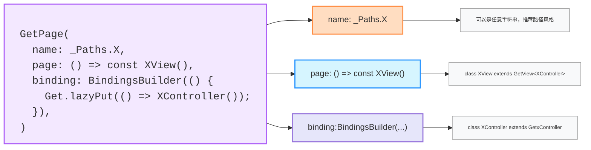
| 步骤                                           | 描述                            |
| ---------------------------------------------- | ------------------------------- |
| 1、进入 `/counter` 页面                        | 自动执行 `CounterBinding()`     |
| 2、**Binding** 中注册 **Controller**           | `Get.lazyPut()` 创建 Controller |
| 3、页面中通过 `GetView<T>` 获取 **controller** | 不用再写 `Get.find()`           |
| 4、`Obx` 监听数据变化                          | UI 实时刷新                     |
| 5、点击按钮调用 **controller** 方法            | 更新数据，触发刷新              |
<details>
<summary>点击展开代码</summary>

```dart
/// main.dart
import 'package:flutter/material.dart';
import 'package:get/get.dart';
import 'pages/counter_binding.dart';
import 'pages/counter_page.dart';

void main() {
  runApp(GetMaterialApp(
    title: 'GetX Binding Demo',
    initialRoute: '/counter',
    getPages: [
      GetPage(
        name: '/counter',
        page: () => const CounterPage(),
        binding: CounterBinding(), // 💡 自动注入 Controller
      ),
    ],
  ));
}
```

```dart
/// counter_controller.dart
import 'package:get/get.dart';

class CounterController extends GetxController {
  final count = 0.obs;

  void increment() => count.value++;
}
```

```dart
/// counter_binding.dart
import 'package:get/get.dart';
import 'counter_controller.dart';

class CounterBinding extends Bindings {
  @override
  void dependencies() {
    Get.lazyPut<CounterController>(() => CounterController());
  }
}
```

```dart
import 'package:flutter/material.dart';
import 'package:get/get.dart';
import 'counter_controller.dart';

class CounterPage extends GetView<CounterController> {
  const CounterPage({super.key});

  @override
  Widget build(BuildContext context) {
    return Scaffold(
      appBar: AppBar(title: const Text('计数器页面')),
      body: Center(
        child: Obx(() => Text(
              '当前计数：${controller.count.value}',
              style: const TextStyle(fontSize: 24),
            )),
      ),
      floatingActionButton: FloatingActionButton(
        onPressed: controller.increment,
        child: const Icon(Icons.add),
      ),
    );
  }
}
```

</details>

###### 27.4.3.1、🉐 **`GetxController`** <a href="#前言" style="font-size:17px; color:green;"><b>🔼</b></a> <a href="#🔚" style="font-size:17px; color:green;"><b>🔽</b></a>

> 1️⃣ `GetxController` 是一个继承自 `Controller` 的类，用于管理你的页面状态和业务逻辑。
>
> 2️⃣ 纯逻辑类

* 🉐 <font id=GetxController的生命周期>**`GetxController`** 的生命周期🧬</font> <a href="#前言" style="font-size:17px; color:green;"><b>🔼</b></a> <a href="#🔚" style="font-size:17px; color:green;"><b>🔽</b></a>

  > ⚠️ <font color=red>如果**`GetxController`**里面的字段（成员变量）构建失败，那么不会进**`GetxController`**的生命周期方法</font>。比如：
  >
  > `late AController ACtrl= Get.find();`如果`Get.find()`一个没有注册的**`GetxController`**，**即会引发构建失败**
  
  | 方法名                                 | 触发时机                                                     | 用途说明                                                     |
  | -------------------------------------- | ------------------------------------------------------------ | ------------------------------------------------------------ |
  | <font color=red>**`onInit()`**</font>  | 控制器初始化时自动调用（在构造函数之后）                     | 类似于 `initState()`，适合初始化变量、监听等                 |
  | <font color=red>**`onReady()`**</font> | 第一次 **frame** 渲染完成后调用                              | 类似于 `WidgetsBinding.instance.addPostFrameCallback`，适合执行依赖 UI 的逻辑，比如请求接口、导航等 |
  | <font color=red>**`onClose()`**</font> | 控制器被永久销毁时调用（如 `Get.delete()` 或路由移除）       | 清理资源，如取消订阅、关闭 **stream**、**timer** 等          |
  | `dispose()`                            | 和 `onClose()` 相同，通常不需要手动调用                      | <font color=red>**`onClose()`**</font> 内部默认会调用 `dispose()` |
  | `onStart()`                            | 不常用，**GetxController** 没有直接提供此生命周期            | 一般用于<a href="#GetView" style="font-size:17px; color:green;">**GetView**</a>或你自己扩展的生命周期控制 |
  | `onResumed()`                          | 配合<a href="#监听App生命周期状态变化" style="font-size:17px; color:green;">**GetObserver**</a>使用，表示页面 **resumed** 状态 | 类似 **App** 生命周期，见下方扩展                            |
  | `onPaused()`                           | 页面切到后台或被覆盖时                                       | ——                                                           |
  | `onDetached()`                         | 页面彻底退出时                                               | ——                                                           |
  
* 例：找到一个已经注册的控制器，并调用其中的方法

  ```dart
  if (Get.isRegistered<CounterController>()) {
    Get.find<CounterController>().increment();
  }
  ```

  ```dart
  class CounterController extends GetxController {
    var count = 0.obs; // 使用 .obs 将 count 变量转换为响应式变量
    void increment() {
      count.value++;
      update(); // 手动触发 UI 刷新
    }
  }
  ```

* 压栈参数要求：

  * `Get.put`的入参要求为：已经实例化好的对象
  * `Get.lazyPut`的入参要求为：一个回调函数。等到 `Get.find<T>()` 被调用时才会真正执行并实例化

* 语法糖封装

  ```dart
  import 'package:get/get.dart';
  
  /// 自动注册或获取 Controller（立即创建并返回）
  /// 用法：
  /// final MyController c = jobsFind(MyController());
  T JobsFind<T extends GetxController>(
    T instance, {
    bool permanent = true,
  }) {
    if (Get.isRegistered<T>()) {
      return Get.find<T>();
    } else {
      return Get.put<T>(instance, permanent: permanent);
    }
  }
  ```

###### 27.4.3.2、🉐 **`binding`** <a href="#前言" style="font-size:17px; color:green;"><b>🔼</b></a> <a href="#🔚" style="font-size:17px; color:green;"><b>🔽</b></a>

> **`binding` 就是提前绑定 `controller` 的地方。**让你不需要在页面里手动写 **`Get.put()`** 或 **`Get.lazyPut()`**

* `binding`写法一：`extends Bindings`

  ```dart
  GetPage(
    name: _Paths.AGENT_CENTER_REGISTER,
    page: () => const AgentCenterRegisterView(),
    binding: AgentCenterRegisterBinding(),
  ),
  ```

  ```dart
  class AgentCenterRegisterBinding extends Bindings {
    @override
    void dependencies() {
      Get.lazyPut<AgentCenterRegisterController>(
        () => AgentCenterRegisterController(),
      );
    }
  }
  ```

* `binding`写法二：`BindingsBuilder`

  ```dart
  GetPage(
    name: _Paths.AGENT_CENTER_GAME_RECORD,
    page: () => const AgentCenterGameRecordView(),
    binding: BindingsBuilder(() {
      Get.lazyPut(() => AgentCenterGameRecordController());
    }),
  ),
  ```

###### 27.4.3.3、🉐 <font id=Getx@正向路由传参>**[`GetX`](https://pub.dev/packages/get) （正向）路由传参**</font> <a href="#前言" style="font-size:17px; color:green;"><b>🔼</b></a> <a href="#🔚" style="font-size:17px; color:green;"><b>🔽</b></a>

* 数据绑定

  ```dart
  GetPage(
    name: _Paths.ACTIVITY_SHARE,
    page: () => const ActivityShareView(),
    binding: BindingsBuilder(() {
      Get.lazyPut(() => ActivityDetailController());
    }),
  ),
  ```

* （正向）传参数

  ```dart
  Get.toNamed(
    Routes.ACTIVITY_SHARE,
    arguments: {
      "title": itemData.activityName,
      "type": ActivityTypsEnum.share,
      "presaveModel": data,
    },
  );
  ```

* 获得参数

  ```dart
  class ActivityDetailController extends GetxController {
    @override
    void onInit() {
      super.onInit();
  
      final arguments = Get.arguments as Map<String, dynamic>;
    }
  }
  ```

###### 27.4.3.4、🉐 <font id=GetView>**`GetView<T>`**</font>  <a href="#前言" style="font-size:17px; color:green;"><b>🔼</b></a> <a href="#🔚" style="font-size:17px; color:green;"><b>🔽</b></a>

> * 是 `StatelessWidget` 的子类：`class GetView<T extends GetxController> extends StatelessWidget`
> * 适用于 `StatelessWidget`。<font color=red>不能用于 `StatefulWidget`</font>
> * 包含 UI
> * 本质是语法糖🍬，不是必须的，只是为了让代码 **更清晰、更模块化、更易维护**
>   * `GetView<T>` 是专门为某个 `GetxController` 创建的 **View**，简化视图中的 **controller** 获取
>   * 用于简化 **`View` 层和 `Controller` 层的绑定**。避免重复写 `final controller = Get.find<XXX>()`
>   * 对<font color=red>**中大型项目**</font>来说：**使用 `Binding` + `GetView` 是最推荐的架构规范**，能提升开发效率、团队协作与维护性。

<details>
<summary>点击展开代码</summary>

```dart
class CounterPage extends GetView<CounterController> {
  @override
  Widget build(BuildContext context) {
    return Scaffold(
      appBar: AppBar(title: Text('GetView 示例')),
      body: Center(
        child: Obx(() => Text('点击次数: ${controller.count}')),
      ),
      floatingActionButton: FloatingActionButton(
        onPressed: controller.increment,
        child: Icon(Icons.add),
      ),
    );
  }
}
/// 两种写法完全等价
class CounterPage extends StatelessWidget {
  late final CounterController controller;
  if (Get.isRegistered<CounterController>()) {
    controller = Get.find<CounterController>();// 👈 手动获取
  }
  @override
  Widget build(BuildContext context) {
    return Scaffold(
      appBar: AppBar(title: Text('StatelessWidget 示例')),
      body: Center(
        child: Obx(() => Text('点击次数: ${controller.count}')),
      ),
      floatingActionButton: FloatingActionButton(
        onPressed: controller.increment,
        child: Icon(Icons.add),
      ),
    );
  }
}
```
</details>

###### 27.4.3.5、🉐 [**`GetX`**](https://pub.dev/packages/get) 值的双向绑定：<font color=red>**`Obx`**</font> <a href="#前言" style="font-size:17px; color:green;"><b>🔼</b></a> <a href="#🔚" style="font-size:17px; color:green;"><b>🔽</b></a>

>  ```dart
>  final RxBool loading = false.obs;// 数据的包装
>  /// 任何地方都可以用。
>  /// 但是，如果在Obx下，会触发数据的双向绑定。
>  /// 如果不在Obx下，仅仅是读取数据
>  loading.value;// 数据的解包（使用）
>  ```

<details>
<summary>点击展开代码</summary>

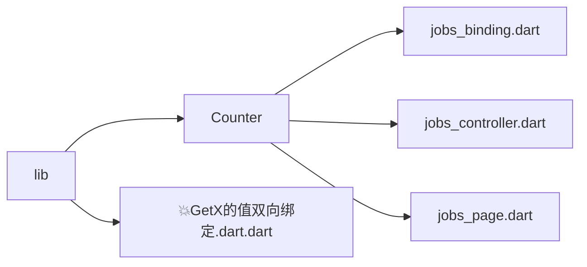
```dart
import 'package:flutter/material.dart';
import 'package:get/get.dart';
import 'package:jobs_flutter_base_config/JobsDemoTools/UI/UI.3rd🌹/GetX/💥GetX的值双向绑定/Counter/jobs_binding.dart';
import 'package:jobs_flutter_base_config/JobsDemoTools/UI/UI.3rd🌹/GetX/💥GetX的值双向绑定/Counter/jobs_page.dart';

void main() {
  runApp(
    GetMaterialApp(
      initialRoute: '/jobs',
      getPages: [
        GetPage(
          name: '/jobs',
          page: () => const JobsPage(),
          binding: JobsBinding(),
        ),
      ],
    ),
  );
}
```

```dart
/// jobs_page.dart
import 'package:flutter/material.dart';
import 'package:get/get.dart';
import 'jobs_controller.dart';

class JobsPage extends GetView<JobsController> {
  const JobsPage({super.key});

  @override
  Widget build(BuildContext context) {
    final textCtrl1 = TextEditingController();
    final textCtrl2 = TextEditingController();

    return Scaffold(
      appBar: AppBar(title: const Text('Jobs 双向绑定两个输入框')),
      body: Padding(
        padding: const EdgeInsets.all(20),
        child: Obx(() {
          // 更新 TextEditingController 的 text（防止无限循环）
          if (textCtrl1.text != controller.text.value) {
            textCtrl1.text = controller.text.value;
            textCtrl1.selection = TextSelection.fromPosition(
              TextPosition(offset: textCtrl1.text.length),
            );
          }

          if (textCtrl2.text != controller.text.value) {
            textCtrl2.text = controller.text.value;
            textCtrl2.selection = TextSelection.fromPosition(
              TextPosition(offset: textCtrl2.text.length),
            );
          }

          return Column(
            crossAxisAlignment: CrossAxisAlignment.start,
            children: [
              TextField(
                controller: textCtrl1,
                decoration: const InputDecoration(labelText: '输入框 1'),
                onChanged: (v) => controller.text.value = v,
              ),
              const SizedBox(height: 20),
              TextField(
                controller: textCtrl2,
                decoration: const InputDecoration(labelText: '输入框 2'),
                onChanged: (v) => controller.text.value = v,
              ),
              const SizedBox(height: 20),
              Text('你输入的是：${controller.text.value}'),
            ],
          );
        }),
      ),
    );
  }
}
```

```dart
/// jobs_controller.dart
import 'package:get/get.dart';

class JobsController extends GetxController {
  final RxString text = ''.obs;
}
```

```dart
/// jobs_binding.dart
import 'package:get/get.dart';
import 'jobs_controller.dart';

class JobsBinding extends Bindings {
  @override
  void dependencies() {
    Get.lazyPut(() => JobsController());
  }
}
```

</details>

###### 27.4.3.6、🉐 <font id=GetPage>**`GetPage()`**</font>📃 <a href="#前言" style="font-size:17px; color:green;"><b>🔼</b></a> <a href="#🔚" style="font-size:17px; color:green;"><b>🔽</b></a>

> 1️⃣ 用于在 `GetMaterialApp` 中注册页面，它包含了页面路径、页面构造函数、绑定依赖、转场动画等信息。
>
> 2️⃣ 是专为 `GetMaterialApp.getPages` 服务
>
> 3️⃣ 每一个 `GetPage` 都表示一个路由页面的配置项。

```dart
GetPage(
  name: '/home',                                   // 路由路径
  page: () => HomeView(),                          // 页面构造函数
  binding: HomeBinding(),                          // 单个依赖绑定
  bindings: [                                      // 可选：多个依赖绑定
    HomeBinding(),
    OtherBinding(),
  ],
  transition: Transition.fadeIn,                   // 页面跳转动画
  transitionDuration: Duration(milliseconds: 300), // 动画持续时间
  curve: Curves.easeInOut,                         // 动画曲线
  fullscreenDialog: false,                         // 是否为全屏对话框（iOS push 模态页）
  middlewares: [AuthMiddleware()],                 // 中间件：如登录校验、权限拦截
  popGesture: true,                                // 是否允许 iOS 侧滑返回
  preventDuplicates: true,                         // 防止重复跳转（如果当前页面就是这个）
  participatesInRootNavigator: true,               // 嵌套路由是否使用主导航器
  opaque: true,                                    // 是否覆盖下层页面（false 可透视）
  showCupertinoParallax: true,                     // iOS 动画是否使用弹性滑动效果
  children: [                                      // 嵌套路由（可选）
    GetPage(
      name: '/home/detail',
      page: () => DetailView(),
    )
  ],
)
```

###### 27.4.3.7、🉐 基于[**`GetX`**](https://pub.dev/packages/get) 最佳实践的完整项目结构模板（项目名为：`getx_demo`） <a href="#前言" style="font-size:17px; color:green;"><b>🔼</b></a> <a href="#🔚" style="font-size:17px; color:green;"><b>🔽</b></a>

<details>
<summary>点击展开代码</summary>

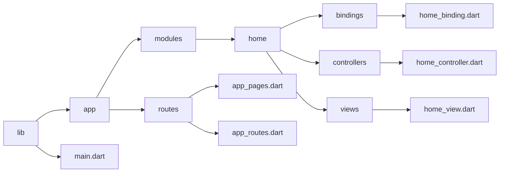
```dart
/// home_controller.dart
import 'package:get/get.dart';

class HomeController extends GetxController {
  var count = 0.obs;
  void increment() {
    count++;
  }
}
```

```dart
/// home_view.dart
import 'package:flutter/material.dart';
import 'package:get/get.dart';
import 'package:getx_demo/app/modules/home/controllers/home_controller.dart';

class HomeView extends GetView<HomeController> {
  @override
  Widget build(BuildContext context) {
    return Scaffold(
      appBar: AppBar(title: Text("Home")),
      body: Center(
        child: Obx(() => Text("点击次数: ${controller.count}",
            style: TextStyle(fontSize: 24))),
      ),
      floatingActionButton: FloatingActionButton(
        onPressed: controller.increment,
        child: Icon(Icons.add),
      ),
    );
  }
}
```

```dart
/// home_binding.dart
import 'package:get/get.dart';
import 'package:getx_demo/app/modules/home/controllers/home_controller.dart';

class HomeBinding extends Bindings {
  @override
  void dependencies() {
    Get.lazyPut<HomeController>(() => HomeController());
  }
}
```

```dart
/// app_routes.dart
abstract class AppRoutes {
  static const HOME = '/home';
}
```

```dart
/// app_pages.dart
import 'package:get/get.dart';
import 'package:getx_demo/app/modules/home/bindings/home_binding.dart';
import 'package:getx_demo/app/modules/home/views/home_view.dart';
import 'app_routes.dart';

class AppPages {
  static const INITIAL = AppRoutes.HOME;

  static final routes = [
    GetPage(
      name: AppRoutes.HOME,
      page: () => HomeView(),
      binding: HomeBinding(),
    ),
  ];
}
```

```dart
/// main.dart
import 'package:flutter/material.dart';
import 'package:get/get.dart';
import 'package:getx_demo/app/routes/app_pages.dart';

void main() {
  runApp(MyApp());
}

class MyApp extends StatelessWidget {
  @override
  Widget build(BuildContext context) {
    return GetMaterialApp(
      debugShowCheckedModeBanner: false,
      initialRoute: AppPages.INITIAL,
      getPages: AppPages.routes,
    );
  }
}
```

</details>

##### 27.4.4、🉐 <font id=GetX路由>[**`GetX`**](https://pub.dev/packages/get) 路由</font>🧭 <a href="#前言" style="font-size:17px; color:green;"><b>🔼</b></a> <a href="#🔚" style="font-size:17px; color:green;"><b>🔽</b></a>

>  [**`GetX`**](https://pub.dev/packages/get)  的路由系统是一套集命名路由、依赖注入、中间件、动画于一体的强大路由管理机制，推荐用 `GetPage` + 命名跳转方式为主线结构！

| 项目               | Flutter 原生导航      | GetX 路由系统                     |
| ------------------ | --------------------- | --------------------------------- |
| 跳转方式           | `Navigator.push(...)` | `Get.to(...)`、`Get.toNamed(...)` |
| 是否需要 context   | ✅ 必须                | ❌ 不需要                          |
| 命名路由           | ✅ 支持                | ✅ 支持，更强大                    |
| 是否支持依赖注入   | ❌ 不支持              | ✅ 支持 binding                    |
| 是否支持中间件拦截 | ❌ 不支持              | ✅ 支持                            |
| 转场动画           | 复杂                  | 简单（内建 `Transition` 枚举）    |
| 嵌套路由 / 子路由  | 较复杂                | ✅ 支持 children 嵌套路由          |

###### 27.4.4.1、🉐 [**`GetX`**](https://pub.dev/packages/get) 免路由管理页面（直接跳 **`Widget`**） <a href="#前言" style="font-size:17px; color:green;"><b>🔼</b></a> <a href="#🔚" style="font-size:17px; color:green;"><b>🔽</b></a>

  > ✅ 优点：不用提前注册页面
  > ❌ 缺点：不支持 **binding**、动画、中间件

  ```dart
  Get.to(ProfileView());        // 正常跳转
  Get.to(() => const PageB());  // 👈 免路由表跳转
  ```

| 写法                           | 含义                                                         | 是否推荐                                 |
| ------------------------------ | ------------------------------------------------------------ | ---------------------------------------- |
| `Get.to(const PageB());`       | **立即创建页面实例**，然后传给 `Get.to()`                    | ✅ 推荐，仅当不关心惰性加载时             |
| `Get.to(() => const PageB());` | **传入一个构造函数（函数体）,[`GetX`](https://pub.dev/packages/get)  会延迟调用** | ✅ 更推荐，尤其在复杂路由或需要懒加载场景 |

<details>
<summary>点击展开代码</summary>

```dart
class PageB extends StatelessWidget {
  const PageB({super.key});
  @override
  Widget build(BuildContext context) {
    return Center(
      child: Column(
        mainAxisSize: MainAxisSize.min, /// ✅ 内容居中紧凑排列
        children: [
          Text('当前页面：Page B'.tr, style: normalTextStyle(fontSize: 24)),
          const SizedBox(height: 20), /// ✅ 间距
          ElevatedButton(
            onPressed: () {
              Get.to(() => const PageC()); /// 👈 免路由表跳转
            },
            child: Text('Go to Page C'.tr),
          ),
        ],
      ),
    );
  }
}

TextStyle normalTextStyle({
  double fontSize = 16,
  Color color = Colors.yellow,
  FontWeight fontWeight = FontWeight.normal,
}) =>
    TextStyle(
      fontSize: fontSize,
      color: color,
      fontWeight: fontWeight,
      decoration: TextDecoration.none,
    );
```
```dart
Get.off(SettingsView());      // 替换当前页
Get.offAll(LoginView());      // 清空栈后跳转
```

</details>

###### 27.4.4.2、🉐 命名路由（推荐方式） <a href="#前言" style="font-size:17px; color:green;"><b>🔼</b></a> <a href="#🔚" style="font-size:17px; color:green;"><b>🔽</b></a>

> 需要配合<a href="#GetPage" style="font-size:17px; color:green;"><b>GetPage()</b></a> 注册

```dart
Get.toNamed('/home');
Get.offNamed('/login');
Get.offAllNamed('/splash');
```

* 路由表

  <details>
  <summary>点击展开代码</summary>

  ```dart
  // app/routes/app_routes.dart
  abstract class AppRoutes {
    static const home = '/home';
    static const login = '/login';
  }

  // app/routes/app_pages.dart
  class AppPages {
    static final routes = [
      GetPage(
        name: AppRoutes.home,
        page: () => HomeView(),
        binding: HomeBinding(),
      ),
      GetPage(
        name: AppRoutes.login,
        page: () => LoginView(),
      ),
    ];
  }

  // main.dart
  GetMaterialApp(
    initialRoute: AppRoutes.home,
    getPages: AppPages.routes,
  );

  // 页面跳转
  Get.toNamed(AppRoutes.login); // ✅ 命名跳转
  ```
  </details>

* 路由守卫：跳转时进行验权

  ```dart
  /// ✅ 登录了，就跳转成功到首页；
  /// ❌ 未登录，就被拦截并跳转到登陆；
  if (!LoginManager.isLogin) {
    Get.offAllNamed('/login');
  } else {
    Get.toNamed('/home');
  }
  ```

  等价于

  ```dart
  /// 创建一个中间件类：
  class AuthMiddleware extends GetMiddleware {
    @override
    RouteSettings? redirect(String? route) {
      if (!LoginManager.isLogin) {
        return const RouteSettings(name: '/login');
      }
      return null; // ✅ 允许跳转
    }
  }
  ```

  ```dart
  /// 加到路由中：
  GetPage(
    name: '/home',
    page: () => HomeView(),
    binding: HomeBinding(),
    middlewares: [AuthMiddleware()],
  )
  ```

  ```dart
  Get.toNamed('/home');
  ```
##### 27.4.5、🉐 **`GetxService`** <a href="#前言" style="font-size:17px; color:green;"><b>🔼</b></a> <a href="#🔚" style="font-size:17px; color:green;"><b>🔽</b></a>

> `GetxService` 是 [**`GetX`**](https://pub.dev/packages/get)  提供的**专门用于全局单例管理的服务类**，适合放一些只需要创建一次，整个 App 生命周期中都不释放的“后台服务”

| 特性             | GetxController           | GetxService                    |
| ---------------- | ------------------------ | ------------------------------ |
| 生命周期         | 跟随页面，可销毁重建     | 默认常驻内存，不会自动释放     |
| 创建方式         | 通常用于 UI 控制器       | 通常用于后台服务、工具类       |
| 是否推荐全局单例 | ❌ 不推荐（容易内存泄漏） | ✅ 推荐用于全局注册一次即可     |
| 示例用途         | 页面状态管理、交互逻辑等 | 网络服务、缓存服务、配置服务等 |


<details>
<summary>定义</summary>

```dart
class AuthService extends GetxService {
  String? token;

  Future<AuthService> init() async {
    // 初始化，例如从本地缓存读取 token
    token = await getSavedToken();
    return this;
  }

  Future<String?> getSavedToken() async {
    await Future.delayed(Duration(milliseconds: 300));
    return 'abc123';
  }
}
```
</details>

<details>
<summary>注册服务</summary>

```dart
Future<void> main() async {
  WidgetsFlutterBinding.ensureInitialized();
  await Get.putAsync<AuthService>(() => AuthService().init());
  runApp(MyApp());
}
```
</details>

<details>
<summary>使用</summary>

```dart
late final AuthService authService;
if (Get.isRegistered<AuthService>()) {
  authService = Get.find<AuthService>();
}
print(authService.token);
```
</details>

##### 27.4.6、🉐 [**`GetX`**](https://pub.dev/packages/get)  具有 UI 效果的函数方法（非 **`Widget`**） <a href="#前言" style="font-size:17px; color:green;"><b>🔼</b></a> <a href="#🔚" style="font-size:17px; color:green;"><b>🔽</b></a>

| 方法名                    | 用途/效果            | 说明                                                     |
| ------------------------- | -------------------- | -------------------------------------------------------- |
| **`Get.snackbar()`**      | 显示顶部/底部提示条  | 全局提示条，支持标题、内容、图标、自定义按钮、颜色等     |
| **`Get.dialog()`**        | 弹出一个自定义弹窗   | 可传入任意 **`Widget`**，类似原生 **`showDialog`**       |
| **`Get.defaultDialog()`** | 快速构建标准弹窗     | 内置标题、内容、确认/取消按钮，快速使用                  |
| **`Get.bottomSheet()`**   | 显示底部弹出菜单     | 类似微信弹窗，传入任意 **`Widget`**，自带滑入动画        |
| **`Get.generalDialog()`** | 自定义弹窗动画与内容 | 更底层的弹窗控制方式，可自定义动画效果和内容，控制更底层 |
| **`Get.showOverlay()`**   | 显示全屏遮罩层       | 常用于显示 **loading**、**toast**、**blur** 效果         |


* **`Get.snackbar()`**

  | 对比项                | [**Flutter**](https://flutter.dev/) 原生 `ScaffoldMessenger.showSnackBar` | [**`GetX`**](https://pub.dev/packages/get)  的 `Get.snackbar` |
  | --------------------- | ------------------------------------------------------------ | ------------------------------------------------------------ |
  | 是否需要 **context**  | ✅ 是                                                         | ❌ 否                                                         |
  | 显示位置              | 只能在底部                                                   | 支持顶部 / 底部                                              |
  | 是否依赖 **Scaffold** | ✅ 是                                                         | ❌ 否                                                         |
  | 自定义灵活性          | 一般                                                         | 非常高                                                       |

* **`Get.dialog()`**

  > **`Get.dialog()`** 默认用当前<a href="#BuildContext" style="font-size:17px; color:green;"><b>上下文**`BuildContext`**</b></a>找 <a href="#Navigator" style="font-size:17px; color:green;"><b>Navigator</b></a>

  [**`GetX`**](https://pub.dev/packages/get) 框架提供的弹窗方法

  | 参数名                   | 类型       | 说明                                           |
  | ------------------------ | ---------- | ---------------------------------------------- |
  | **`barrierDismissible`** | `bool`     | 是否点击背景关闭弹窗，默认 `true`              |
  | **`useSafeArea`**        | `bool`     | 是否使用 **SafeArea**，默认 `true`             |
  | **`name`**               | `String?`  | 给弹窗设置一个路由名（可选）                   |
  | **`transitionDuration`** | `Duration` | 动画持续时间，默认 200ms                       |
  | **`transitionCurve`**    | `Curve`    | 动画曲线，如 `Curves.easeInOut`                |
  | **`opaque`**             | `bool`     | 是否完全遮挡，默认 `false`                     |
  | **`barrierColor`**       | `Color`    | 背景颜色，默认 `Colors.black.withOpacity(0.5)` |

  <details>
  <summary>Get.dialog()</summary>

  ```dart
  ElevatedButton(
    onPressed: () async {
      final result = await Get.dialog<String>(
        _CustomDialogContent(),// 一个widget
  
        barrierDismissible: true, // ✅ 点击弹窗外区域是否关闭弹窗（true = 可关闭）
        barrierColor: Colors.black.withOpacity(0.5), // ✅ 弹窗背景遮罩颜色（通常为半透明黑色）
        useSafeArea: true, // ✅ 是否自动避开状态栏/刘海/底部安全区（默认 true）
  
        navigatorKey: Get.key, // ✅ 指定使用哪个 Navigator（默认用 Get.key 就行）
        arguments: {'from': '按钮点击'}, // ✅ 向弹窗内部传递参数（可通过 Get.arguments 获取）
  
        transitionDuration: Duration(milliseconds: 400), // ✅ 动画持续时间（默认 200ms）
        transitionCurve: Curves.easeInOutBack, // ✅ 动画曲线（决定进出弹窗的运动方式）
  
        name: '/custom-dialog', // ✅ 路由名称（可选，方便调试或拦截路由）
        routeSettings: RouteSettings(name: '/custom-dialog-settings'), // ✅ 更完整的路由配置（配合导航系统）
      );
  
      if (result != null) {
        Get.snackbar('返回结果', '你选择了: $result'); // ✅ 弹窗关闭后获取返回值
      }
    },
    child: Text('打开自定义弹窗'),
  )
  ```
  </details>

  <details>
  <summary>Get.defaultDialog()</summary>

  ```dart
  /// TODO
  ```
  </details>

  <details>
  <summary>Get.bottomSheet()</summary>

  ```dart
  /// TODO
  ```
  </details>

  <details>
  <summary>Get.generalDialog()</summary>

  ```dart
  /// TODO
  ```
  </details>

    <details>
  <summary>Get.showOverlay()</summary>

  ```dart
  /// TODO
  ```
  </details>

##### 27.4.7、🉐 [**`GetX`**](https://pub.dev/packages/get) 的 UI 控制行为函数 <a href="#前言" style="font-size:17px; color:green;"><b>🔼</b></a> <a href="#🔚" style="font-size:17px; color:green;"><b>🔽</b></a>

| **方法名**                       | **行为描述**                                         | **说明**                                                     |
| -------------------------------- | ---------------------------------------------------- | ------------------------------------------------------------ |
| **`Get.to()`**                   | 跳转到新页面                                         | 推入页面，可传 **`Widget`**、参数、动画等                    |
| **`Get.toNamed()`**              | 跳转到命名路由页面                                   | 使用 `getPages` 中注册的路由名                               |
| **`Get.off()`**                  | 替换当前页面                                         | 替代当前页面为目标 Widget 页面                               |
| **`Get.offNamed()`**             | 替换当前页面为命名路由                               | 当前页面将被目标命名路由替代                                 |
| **`Get.offAll()`**               | 清空页面栈并跳转到新页面                             | 路由栈清空，仅保留目标页面                                   |
| **`Get.offAllNamed()`**          | 清空页面栈并跳转到命名路由                           | 常用于登录成功后跳转主页                                     |
| **`Get.back()`**                 | 返回上一页 / 关闭当前 UI                             | 自动判断并关闭 **dialog**、**bottomSheet** 或返回页面，无需 **context** |
| **`Get.closeAllSnackbars()`**    | 关闭所有 **snackbar** 提示条                         | 如果多个提示叠加，可统一关闭                                 |
| **`Get.closeCurrentSnackbar()`** | 关闭当前 **snackbar** 提示条                         | 更细粒度，仅关闭最新一条                                     |
| **`Get.closeAllOverlays()`**     | 关闭所有 UI 覆盖层（含 **dialog**、**bottomSheet**） | 常用于退出登录、切换页面前统一关闭所有 UI 弹层               |
| **`Get.until((route) => ...)`**  | 一直返回直到符合条件                                 | 类似 `popUntil`，用于条件式多级返回                          |
| **`Get.canPop()`**               | 是否可以返回上一页                                   | 返回 `true/false`，类似 `Navigator.canPop()`                 |
| **`Get.isDialogOpen`**           | 当前是否有 **dialog** 被打开                         | 判断是否有弹窗正在显示中                                     |
| **`Get.isSnackbarOpen`**         | 当前是否有 **snackbar** 被打开                       | 判断是否有提示条正在显示中                                   |
| **`Get.isBottomSheetOpen`**      | 当前是否有 **bottomSheet** 被打开                    | 判断是否有底部弹窗正在显示中                                 |

##### 27.4.8、🉐 **`Get.key`🔑 **<a href="#前言" style="font-size:17px; color:green;"><b>🔼</b></a> <a href="#🔚" style="font-size:17px; color:green;"><b>🔽</b></a>

> **`Get.key` 就是给全局 Navigator 打了个 tag（标签）**，即：**全局 Navigator Key**。[**`GetX`**](https://pub.dev/packages/get)  把它注册到自己的容器里，之后你所有（**push**、**pop**、**dialog** 等）相关操作都可以**不需要 context，直接通过这个 tag 找到并调用 Navigator 的功能。**（<font color=red>类似于iOS的**通知机制**</font>）

| 传统 [**Flutter**](https://flutter.dev/) | [**`GetX`**](https://pub.dev/packages/get)                   |
| ---------------------------------------- | ------------------------------------------------------------ |
| **`Navigator.of(context)`**              | **`Get.key.currentState`**                                   |
| 弹窗必须要 **BuildContext**              | **`Get.dialog()`** 无需 **BuildContext**                     |
| 每个页面要传 **BuildContext**            | [**`GetX`**](https://pub.dev/packages/get)  容器中全局持有导航器 |
| UI 和状态管理耦合严重                    | UI/逻辑可分离，**Controller** 也能导航                       |

<details>
<summary>✅ 场景：从非 UI 层（比如 Service/Controller）弹出一个 Dialog，而不依赖 BuildContext</summary>

```dart
void main() {
  runApp(GetMaterialApp(
    navigatorKey: Get.key, // ✅ 注册全局导航器 必须初始化时配置一次
    home: MyHomePage(),
  ));
}

class AuthService {
  void checkLoginAndShowDialog() {
    /// ✅ 不依赖 context 就能显示 UI
    Get.dialog(
      AlertDialog(
        title: Text('未登录'),
        content: Text('请先登录才能继续操作'),
        actions: [
          TextButton(
            onPressed: () => Get.back(),
            child: Text('取消'),
          ),
          TextButton(
            onPressed: () {
              Get.back();
              Get.toNamed('/login'); // 可以继续跳转
            },
            child: Text('去登录'),
          ),
        ],
      ),
      navigatorKey: Get.key, // ✅ 关键点：指向全局 Navigator（此例里面可以不写）
      barrierDismissible: false,
    );
  }
}

ElevatedButton(
  onPressed: () {
    AuthService().checkLoginAndShowDialog(); // ✅ 不用 context，也能弹窗
  },
  child: Text('执行需要登录的操作'),
)
```
</details>

* ✅ 那什么时候 **必须写 `navigatorKey: Get.key`**？

  * ❗ 场景1：页面还没加载完成（比如在 `initState` 或 `GetxController.onInit()` 里直接弹）

    ```dart
    @override
    void initState() {
      super.initState();
      Future.delayed(Duration.zero, () {
        Get.dialog(AlertDialog(...)); // ❌ 可能找不到 Navigator.currentContext
      });
    }
    ```

  * ❗ 场景2：用了嵌套的<a href="#Shell页面" style="font-size:17px; color:green;"><b> Shell页面</b></a> / 子<a href="#Navigator" style="font-size:17px; color:green;"><b> `Navigator`</b></a>   （如 `BottomNavigationBar` + `Tab`）

    ```dart
    Scaffold(
      body: Navigator( // 👈 嵌套 navigator，Get.dialog 找不到上层 Navigator
        key: shellKey,
        ...
      ),
    );
    ```

> 🧠 **`navigatorKey: Get.key` 是保险机制：**
> 当你在 UI 按钮中弹窗，不写也可以；
> 但如果你在 非 UI <a href="#BuildContext" style="font-size:17px; color:green;"><b>上下文**`BuildContext`**</b></a> 或 <u>**嵌套导航结构**</u> 中调用弹窗，**就必须显式指定 `navigatorKey` 来避免找不到 Navigator 的错误。**
>
> **完全可以养成习惯：**
> ➤ **任何时候用 `Get.dialog()`，都写上 `navigatorKey: Get.key`**，
> ✅ 兼容所有场景、生命周期、嵌套结构，绝对不翻车。

##### 27.4.9、🉐 [**`GetX`**](https://pub.dev/packages/get) 多语言化  <a href="#前言" style="font-size:17px; color:green;"><b>🔼</b></a> <a href="#🔚" style="font-size:17px; color:green;"><b>🔽</b></a>

> 如果找不到对应 key，会 **原样返回原始字符串**（即 `"等待状态变化"`），不会报错或崩溃。

```dart
String status = "等待状态变化".tr;
```

##### 27.4.10、🉐 关于[**`GetX`**](https://pub.dev/packages/get) 的二次封装（语法糖🍬）<a href="#前言" style="font-size:17px; color:green;"><b>🔼</b></a> <a href="#🔚" style="font-size:17px; color:green;"><b>🔽</b></a>

<details>
<summary>点击展开代码</summary>

```dart
import 'package:get/get.dart';

/// 自动注册或获取 Controller（立即创建并返回）
/// 用法：
///   final c = getOrPut(() => MyController());
T getOrPut<T extends GetxController>(
  T Function() creator, {
  bool permanent = false,
}) {
  if (Get.isRegistered<T>()) {
    return Get.find<T>();
  } else {
    return Get.put<T>(creator(), permanent: permanent);
  }
}

/// 自动懒加载注册或获取 Controller（第一次用时才创建）
/// 用法：
///   final c = getOrLazyPut(() => MyController(), fenix: true);
T getOrLazyPut<T extends GetxController>(
  T Function() creator, {
  bool fenix = false,
}) {
  if (Get.isRegistered<T>()) {
    return Get.find<T>();
  } else {
    Get.lazyPut<T>(creator, fenix: fenix);
    return Get.find<T>();
  }
}
```
```dart
late final MyTabCtrl tabController = getOrPut(() => MyTabCtrl());
```

</details>

##### 27.4.11、🉐 **`GetInterface`**  <a href="#前言" style="font-size:17px; color:green;"><b>🔼</b></a> <a href="#🔚" style="font-size:17px; color:green;"><b>🔽</b></a>

> `GetInterface` 是 [**GetX**](https://pub.dev/packages/get)  全部功能 API 的“目录规范”，而 `Get` 是它的唯一实现。

##### 27.4.12、🉐 [**`GetX`**](https://pub.dev/packages/get)@通知📢  <a href="#前言" style="font-size:17px; color:green;"><b>🔼</b></a> <a href="#🔚" style="font-size:17px; color:green;"><b>🔽</b></a>

*  <a href="#InheritedWidget" style="font-size:17px; color:green;"><b>InheritedWidget</b></a>

* 👂监听

  * 纯逻辑监听器函数（不涉及UI）

    | 名称           | 说明                                  |
    | -------------- | ------------------------------------- |
    | **`ever`**     | 每次 **Rx** 改变都触发                |
    | **`once`**     | **Rx** 第一次改变触发一次             |
    | **`debounce`** | **Rx** 停止变化一段时间后触发（防抖） |
    | **`interval`** | **Rx** 在一段时间内只触发一次（节流） |
    | **`everAll`**  | 同时监听多个 **Rx**，任一改变就触发   |

    ```dart
    // main.dart
    import 'package:flutter/material.dart';
    import 'package:get/get.dart';
    import 'package:jobs_flutter_base_config/JobsDemoTools/JobsFlutterTools/JobsRunners/JobsGetXRunner.dart';
    import 'package:jobs_flutter_base_config/JobsDemoTools/Utils/JobsCommonUtil.dart';

    // ✅ 操作说明：
    // 点击“➕ 增加计数”按钮：
    // ever 每次触发；
    // once 只触发第一次；
    // interval 每隔 1 秒只触发一次；
    // everAll 也会触发。

    // 输入框中输入内容（如：abc）：
    // 每次变动不会立即触发 debounce；
    // 停止输入约 800ms 后才触发；
    // everAll 也会触发。

    void main() => runApp(JobsGetRunner(RxListenerDemo(), title: '🎯 GetX 监听器演示'));

    class RxListenerDemo extends StatelessWidget {
      final MyController controller = Get.put(MyController());

      @override
      Widget build(BuildContext context) {
        return Padding(
          padding: const EdgeInsets.all(16.0),
          child: Column(
            children: [
              Obx(() => Text('🧮 当前计数：${controller.counter}',
                  style: TextStyle(fontSize: 24))),
              ElevatedButton(
                onPressed: () => controller.counter.value++,
                child: const Text('➕ 增加计数'),
              ),
              const SizedBox(height: 20),
              TextField(
                decoration: const InputDecoration(labelText: '🔤 输入关键词'),
                onChanged: (val) => controller.keyword.value = val,
              ),
            ],
          ),
        );
      }
    }

    class MyController extends GetxController {
      // 声明两个响应式变量
      final RxInt counter = 0.obs;
      final RxString keyword = ''.obs;

      // 初始化监听器
      @override
      void onInit() {
        super.onInit();

        // 每次改变都触发
        ever(counter, (val) => JobsPrint("🔁 ever: counter = $val"));

        // 只触发第一次
        once(counter, (val) => JobsPrint("🎯 once: counter = $val"));

        // 防抖：停止改变后 800ms 再触发
        debounce(keyword, (val) => JobsPrint("⏳ debounce: keyword = $val"),
            time: Duration(milliseconds: 800));

        // 节流：每隔 1s 触发一次
        interval(counter, (val) => JobsPrint("🚦 interval: counter = $val"),
            time: Duration(seconds: 1));

        // 同时监听多个 Rx
        everAll([counter, keyword], (valList) {
          JobsPrint(
              "📦 everAll: counter = ${counter.value}, keyword = ${keyword.value}");
        });
      }
    }
    ```

  * UI监听器：**Obx**（以前是函数，现在版本上升为类）

    >```dart
    >class Obx extends ObxWidget
    >abstract class ObxWidget extends StatefulWidget
    >```

  *  <font id=监听App生命周期状态变化>**监听 App 生命周期状态变化**</font> **：`GetObserver`**(类)

    > ```dart
    > class GetObserver extends NavigatorObserver with WidgetsBindingObserver
    > ```

##### 27.4.13、🉐<font id=GetX弹出框> [**`GetX`**](https://pub.dev/packages/get)@弹出框</font>🪟 <a href="#前言" style="font-size:17px; color:green;"><b>🔼</b></a> <a href="#🔚" style="font-size:17px; color:green;"><b>🔽</b></a>

###### 27.4.13.1、🉐 `Get.dialog(widget)` <a href="#前言" style="font-size:17px; color:green;"><b>🔼</b></a> <a href="#🔚" style="font-size:17px; color:green;"><b>🔽</b></a>

```dart
Future<T?> dialog<T>(
  /// 要显示的对话框内容（必传），可以是 AlertDialog、Dialog 或自定义组件
  Widget widget, {

  /// 是否允许点击对话框外部关闭
  /// true = 点外部可关闭；false = 必须手动调用 Get.back() 关闭
  bool barrierDismissible = true,

  /// 背景遮罩层颜色（默认半透明黑色）
  /// 例如：Colors.black54
  Color? barrierColor,

  /// 是否使用 SafeArea，避免刘海屏 / 状态栏 / 底部虚拟按键遮挡
  bool useSafeArea = true,

  /// 指定使用哪个 Navigator 管理对话框
  /// 一般不需要传，默认使用全局 navigator
  GlobalKey<NavigatorState>? navigatorKey,

  /// 传递给对话框路由的参数，可通过 Get.arguments 获取
  Object? arguments,

  /// 对话框过渡动画的时长（默认约 300ms）
  Duration? transitionDuration,

  /// 对话框过渡动画的曲线（默认 Curves.easeOut）
  Curve? transitionCurve,

  /// 给路由命名，方便调试或追踪
  String? name,

  /// 原生 RouteSettings，包含 name 和 arguments
  /// 如果上面 name/arguments 不能满足需求，可通过此参数传递
  RouteSettings? routeSettings,
})
```

###### 27.4.13.2、🉐`Get.defaultDialog(widget)`<a href="#前言" style="font-size:17px; color:green;"><b>🔼</b></a> <a href="#🔚" style="font-size:17px; color:green;"><b>🔽</b></a>

```dart
Future<T?> defaultDialog<T>({
  /// 对话框标题文字（默认 "Alert"）
  String title = "Alert",

  /// 标题的内边距（padding）
  EdgeInsetsGeometry? titlePadding,

  /// 标题的文字样式
  TextStyle? titleStyle,

  /// 对话框中间的自定义内容（替代 middleText）
  Widget? content,

  /// 内容的内边距
  EdgeInsetsGeometry? contentPadding,

  /// 点击确认按钮的回调
  VoidCallback? onConfirm,

  /// 点击取消按钮的回调
  VoidCallback? onCancel,

  /// 点击自定义按钮的回调（如果有 custom 按钮）
  VoidCallback? onCustom,

  /// 取消按钮文字颜色
  Color? cancelTextColor,

  /// 确认按钮文字颜色
  Color? confirmTextColor,

  /// 确认按钮文字
  String? textConfirm,

  /// 取消按钮文字
  String? textCancel,

  /// 自定义按钮文字
  String? textCustom,

  /// 自定义确认按钮（完全自定义 Widget）
  Widget? confirm,

  /// 自定义取消按钮（完全自定义 Widget）
  Widget? cancel,

  /// 自定义按钮（第三个按钮，完全自定义 Widget）
  Widget? custom,

  /// 对话框背景色
  Color? backgroundColor,

  /// 是否允许点击对话框外部关闭（默认 true）
  bool barrierDismissible = true,

  /// 按钮背景色（仅对默认按钮有效，自定义 confirm/cancel/custom 时无效）
  Color? buttonColor,

  /// 中间的提示文字（如果没传 content，会显示这个，默认 "Dialog made in 3 lines of code"）
  String middleText = "Dialog made in 3 lines of code",

  /// 中间提示文字的样式
  TextStyle? middleTextStyle,

  /// 对话框圆角半径（默认 20.0）
  double radius = 20.0,

  // /// 自定义主题（暂时注释掉了，源码里有）
  // ThemeData themeData,

  /// 自定义 actions（比如你想自己传一组按钮，替代 textConfirm/textCancel）
  List<Widget>? actions,

  /// 处理返回键（Android 的物理返回键）时的回调
  /// 返回 true = 允许关闭；false = 禁止关闭
  WillPopCallback? onWillPop,

  /// 指定 navigatorKey（默认使用全局 navigator）
  GlobalKey<NavigatorState>? navigatorKey,
})
```

###### 27.4.13.3、🉐`Get.snackbar("标题", "副标题");` <a href="#前言" style="font-size:17px; color:green;"><b>🔼</b></a> <a href="#🔚" style="font-size:17px; color:green;"><b>🔽</b></a>

```dart
SnackbarController snackbar(
  /// 标题（一般用于简短提示，比如“成功”、“失败”）
  String title,

  /// 内容信息（主要说明性文字）
  String message, {

  /// 文本颜色（标题和内容文字颜色）
  Color? colorText,

  /// 显示时长（默认 3 秒），传 null = 永不消失（需要手动关闭）
  Duration? duration = const Duration(seconds: 3),

  /// 是否立即初始化（默认 true）
  /// - true: 调用后立刻显示
  /// - false: 可在 initState 中调用（延迟到下一帧显示）
  bool instantInit = true,

  /// 弹出位置（顶部/底部），默认 SnackPosition.TOP
  SnackPosition? snackPosition,

  /// 自定义标题 Widget（优先级高于 title）
  Widget? titleText,

  /// 自定义内容 Widget（优先级高于 message）
  Widget? messageText,

  /// 左侧图标
  Widget? icon,

  /// 图标是否有“呼吸脉冲”动画
  bool? shouldIconPulse,

  /// 最大宽度（限制 snackbar 宽度）
  double? maxWidth,

  /// 外边距（相对屏幕的 margin）
  EdgeInsets? margin,

  /// 内边距（内容 padding）
  EdgeInsets? padding,

  /// 圆角半径
  double? borderRadius,

  /// 边框颜色
  Color? borderColor,

  /// 边框宽度
  double? borderWidth,

  /// 背景颜色
  Color? backgroundColor,

  /// 左侧竖条指示器颜色（常用于强调状态）
  Color? leftBarIndicatorColor,

  /// 阴影效果
  List<BoxShadow>? boxShadows,

  /// 背景渐变
  Gradient? backgroundGradient,

  /// 右侧主按钮（例如“撤销”、“重试”）
  TextButton? mainButton,

  /// 点击 snackbar 的回调
  OnTap? onTap,

  /// 是否允许手动滑动关闭（默认 true）
  bool? isDismissible,

  /// 是否显示进度条（加载指示器）
  bool? showProgressIndicator,

  /// 滑动关闭方向（默认 DismissDirection.down）
  DismissDirection? dismissDirection,

  /// 进度条的控制器（可手动控制动画）
  AnimationController? progressIndicatorController,

  /// 进度条背景色
  Color? progressIndicatorBackgroundColor,

  /// 进度条前景色（动画颜色）
  Animation<Color>? progressIndicatorValueColor,

  /// 样式（floating = 悬浮，grounded = 紧贴边缘）
  SnackStyle? snackStyle,

  /// 入场动画曲线
  Curve? forwardAnimationCurve,

  /// 出场动画曲线
  Curve? reverseAnimationCurve,

  /// 动画持续时间（默认 250ms）
  Duration? animationDuration,

  /// 毛玻璃模糊程度（仅 snackbar 本身）
  double? barBlur,

  /// 遮罩模糊程度（全屏背景）
  double? overlayBlur,

  /// snackbar 状态变化回调（OPENING, OPEN, CLOSING, CLOSED）
  SnackbarStatusCallback? snackbarStatus,

  /// 遮罩颜色（配合 overlayBlur 使用）
  Color? overlayColor,

  /// 自定义输入表单（snackbar 内嵌一个表单，比如登录输入框）
  Form? userInputForm,
})
```

###### 27.4.13.4、🉐`Get.bottomSheet(Widget)` <a href="#前言" style="font-size:17px; color:green;"><b>🔼</b></a> <a href="#🔚" style="font-size:17px; color:green;"><b>🔽</b></a>

```dart
extension ExtensionBottomSheet on GetInterface {
  Future<T?> bottomSheet<T>(
    /// 底部弹出的内容（必传），可以是任意 Widget
    Widget bottomsheet, {

    /// 背景颜色
    Color? backgroundColor,

    /// 阴影高度（默认 Material 底部弹出会有）
    double? elevation,

    /// 是否是持久化 bottomSheet
    /// true = 不会随 route 切换而关闭（一般保持默认 true）
    bool persistent = true,

    /// 自定义形状（比如圆角：RoundedRectangleBorder）
    ShapeBorder? shape,

    /// 裁剪行为（默认 null = 不裁剪）
    Clip? clipBehavior,

    /// 背景遮罩层颜色（弹窗外部的半透明层）
    Color? barrierColor,

    /// 是否忽略 SafeArea
    /// true = 可以延伸到状态栏/底部区域
    bool? ignoreSafeArea,

    /// 是否允许全屏滚动控制
    /// true = 支持高度超过屏幕时滚动
    bool isScrollControlled = false,

    /// 是否使用根导航器（一般用默认 false）
    bool useRootNavigator = false,

    /// 是否允许点击遮罩层关闭（默认 true）
    bool isDismissible = true,

    /// 是否允许拖动下滑关闭（默认 true）
    bool enableDrag = true,

    /// 路由配置信息（可传 name/arguments 等）
    RouteSettings? settings,

    /// 进入动画持续时间（默认 200ms 左右）
    Duration? enterBottomSheetDuration,

    /// 退出动画持续时间（默认 200ms 左右）
    Duration? exitBottomSheetDuration,
  }) {
    // 实现内容在 GetX 源码中
  }
}
```

###### 27.4.13.5、🉐`Get.rawSnackbar()` <a href="#前言" style="font-size:17px; color:green;"><b>🔼</b></a> <a href="#🔚" style="font-size:17px; color:green;"><b>🔽</b></a>

> 比 `Get.snackbar` 更底层的版本，完全自定义内容

```dart
extension ExtensionSnackbar on GetInterface {
  SnackbarController rawSnackbar({
    /// 标题文本（简单字符串）
    String? title,

    /// 内容文本（简单字符串）
    String? message,

    /// 自定义标题 Widget（优先级高于 title）
    Widget? titleText,

    /// 自定义内容 Widget（优先级高于 message）
    Widget? messageText,

    /// 左侧图标
    Widget? icon,

    /// 是否立即初始化（默认 true，调用时立刻显示）
    bool instantInit = true,

    /// 图标是否有呼吸脉冲动画
    bool shouldIconPulse = true,

    /// 最大宽度（限制 Snackbar 宽度）
    double? maxWidth,

    /// 外边距（相对于屏幕的边距，默认 0）
    EdgeInsets margin = const EdgeInsets.all(0.0),

    /// 内边距（内容 padding，默认 16）
    EdgeInsets padding = const EdgeInsets.all(16),

    /// 圆角半径（默认 0）
    double borderRadius = 0.0,

    /// 边框颜色
    Color? borderColor,

    /// 边框宽度（默认 1.0）
    double borderWidth = 1.0,

    /// 背景颜色（默认深灰色 #303030）
    Color backgroundColor = const Color(0xFF303030),

    /// 左侧竖条指示器颜色（常用于强调状态）
    Color? leftBarIndicatorColor,

    /// 阴影效果
    List<BoxShadow>? boxShadows,

    /// 背景渐变
    Gradient? backgroundGradient,

    /// 右侧主按钮（例如“撤销”、“重试”）
    Widget? mainButton,

    /// 点击 snackbar 的回调
    OnTap? onTap,

    /// 显示时长（默认 3 秒）
    /// 传 null = 永不消失（需手动关闭）
    Duration? duration = const Duration(seconds: 3),

    /// 是否允许手动滑动关闭（默认 true）
    bool isDismissible = true,

    /// 滑动关闭方向（默认 null = 自动）
    DismissDirection? dismissDirection,

    /// 是否显示进度条（加载指示器）
    bool showProgressIndicator = false,

    /// 进度条控制器（可手动控制动画）
    AnimationController? progressIndicatorController,

    /// 进度条背景色
    Color? progressIndicatorBackgroundColor,

    /// 进度条前景色（动画颜色）
    Animation<Color>? progressIndicatorValueColor,

    /// 显示位置（TOP/ BOTTOM，默认 BOTTOM）
    SnackPosition snackPosition = SnackPosition.BOTTOM,

    /// 样式（FLOATING = 悬浮，GROUNDED = 紧贴边缘）
    SnackStyle snackStyle = SnackStyle.FLOATING,

    /// 入场动画曲线（默认 Curves.easeOutCirc）
    Curve forwardAnimationCurve = Curves.easeOutCirc,

    /// 出场动画曲线（默认 Curves.easeOutCirc）
    Curve reverseAnimationCurve = Curves.easeOutCirc,

    /// 动画持续时间（默认 1 秒）
    Duration animationDuration = const Duration(seconds: 1),

    /// snackbar 状态变化回调（OPENING, OPEN, CLOSING, CLOSED）
    SnackbarStatusCallback? snackbarStatus,

    /// 毛玻璃模糊程度（仅 snackbar 本身）
    double barBlur = 0.0,

    /// 遮罩模糊程度（全屏背景）
    double overlayBlur = 0.0,

    /// 遮罩颜色（配合 overlayBlur 使用）
    Color? overlayColor,

    /// 自定义输入表单（可在 snackbar 里放表单，例如登录框）
    Form? userInputForm,
  }) {
    // 实现内容在 GetX 源码中
  }
}
```

###### 27.4.13.6、🉐`Get.generalDialog(pageBuilder:X)` <a href="#前言" style="font-size:17px; color:green;"><b>🔼</b></a> <a href="#🔚" style="font-size:17px; color:green;"><b>🔽</b></a>

```dart
Future<T?> generalDialog<T>({
  /// 页面构建器（必传）
  /// 这里返回你要显示的 Widget（对话框内容），
  /// 参数：context, animation, secondaryAnimation
  required RoutePageBuilder pageBuilder,

  /// 是否允许点击遮罩层（对话框外部区域）关闭
  /// 默认 false = 必须手动关闭
  bool barrierDismissible = false,

  /// 无障碍辅助功能用的“屏障描述”（VoiceOver/屏幕阅读器会读）
  /// barrierDismissible = true 时必须传
  String? barrierLabel,

  /// 背景遮罩层颜色
  /// 默认半透明黑色（0x80000000）
  Color barrierColor = const Color(0x80000000),

  /// 过渡动画的持续时间（默认 200ms）
  Duration transitionDuration = const Duration(milliseconds: 200),

  /// 自定义过渡动画构建器
  /// 参数：context, animation, secondaryAnimation, child
  /// 如果不传，使用默认的渐隐渐现
  RouteTransitionsBuilder? transitionBuilder,

  /// 指定使用哪个 Navigator 管理路由（一般不需要）
  GlobalKey<NavigatorState>? navigatorKey,

  /// 额外的路由配置（可以传 name / arguments 等）
  RouteSettings? routeSettings,
})
```

### 28、导航栏左上角的<font color=green>**返回按钮🔙**</font>的<font color=red>**行为拦截和自定义**</font>  <a href="#前言" style="font-size:17px; color:green;"><b>🔼</b></a> <a href="#🔚" style="font-size:17px; color:green;"><b>🔽</b></a>

> 1️⃣ 用户点击 **iOS** 的导航栏返回键（左上角）
>
> 2️⃣ 调用 `Navigator.of(context).pop()`
>
> 3️⃣ **iOS** 上从屏幕左边缘滑动返回（手势返回）
>
> 💥 **根页面是没有返回键的**

<details>
<summary>对PageC进行返回按钮的监听</summary>

```dart
/// PageC
class PageC extends RouteAwareStatefulPage {
  const PageC({super.key, super.onTap, super.buttonChild})
      : super(title: 'Page C');

  @override
  State<PageC> createState() => _PageCState();
}

class _PageCState extends RouteAwareState<PageC> {}
```
```dart
abstract class RouteAwareStatefulPage extends StatefulWidget {
  final String title;
  final VoidCallback? onTap;
  final Widget? buttonChild;

  const RouteAwareStatefulPage({
    super.key,
    required this.title,
    this.onTap,
    this.buttonChild,
  });
}

abstract class RouteAwareState<T extends RouteAwareStatefulPage>
    extends State<T> with RouteAware {
  @override
  void didChangeDependencies() {
    super.didChangeDependencies();
    routeObserver.subscribe(this, ModalRoute.of(context)! as PageRoute);
  }

  @override
  void dispose() {
    routeObserver.unsubscribe(this);
    super.dispose();
  }

  @override
  void didPush() => debugPrint('📥 ${widget.title} pushed');
  @override
  void didPop() => debugPrint('📤 ${widget.title} popped');
  @override
  void didPopNext() => debugPrint('🔙 Return to ${widget.title}');
  @override
  void didPushNext() => debugPrint('➡️ Navigate away from ${widget.title}');

  @override
  Widget build(BuildContext context) {
    return PopConfirmWrapper(
      child: Scaffold(
        appBar: AppBar(title: Text(widget.title)),
        body: Center(
          child: Column(
            mainAxisSize: MainAxisSize.min,
            children: [
              Text('当前页面：${widget.title}'.tr,
                  style: normalTextStyle(fontSize: 24)),
              const SizedBox(height: 20),
              ElevatedButton(
                onPressed: widget.onTap,
                child: widget.buttonChild ?? Text('点我'.tr),
              ),
            ],
          ),
        ),
      ),
    );
  }
}
```

</details>

### 29、图片缓存框架 <a href="#前言" style="font-size:17px; color:green;"><b>🔼</b></a> <a href="#🔚" style="font-size:17px; color:green;"><b>🔽</b></a>

#### 29.1、[**CachedNetworkImage**](https://pub.dev/packages/cached_network_image)  <a href="#前言" style="font-size:17px; color:green;"><b>🔼</b></a> <a href="#🔚" style="font-size:17px; color:green;"><b>🔽</b></a>

== [**iOS.SDWebimage**](https://github.com/SDWebImage/SDWebImage)

<details>
<summary>CachedNetworkImage</summary>

```yaml
dependencies:
  cached_network_image: any
```

```dart
import 'package:flutter/material.dart';
import 'package:cached_network_image/cached_network_image.dart';
import 'package:flutter_cache_manager/flutter_cache_manager.dart';
import 'package:jobs_flutter_base_config/JobsDemoTools/JobsFlutterTools/JobsRunners/JobsGetXRunner.dart';

void main() => runApp(JobsGetRunner(const CachedNetworkImageDemo(),
    title: 'CachedNetworkImage 全属性示例'));

class CachedNetworkImageDemo extends StatelessWidget {
  const CachedNetworkImageDemo({super.key});

  @override
  Widget build(BuildContext context) {
    return Center(
      child: CachedNetworkImage(
        imageUrl: 'https://via.placeholder.com/150', // ✅ 图片地址（必填）
        httpHeaders: const {
          'Authorization': 'Bearer YOUR_TOKEN', // ✅ 自定义 HTTP 请求头（可选）
        },
        cacheKey: 'custom_cache_key', // ✅ 自定义缓存 key（可手动管理缓存）

        placeholder: (context, url) =>
            const CircularProgressIndicator(), // ✅ 加载中占位图
        progressIndicatorBuilder: (context, url, progress) {
          return Column(
            // ✅ 显示加载进度（字节）
            mainAxisAlignment: MainAxisAlignment.center,
            children: [
              const CircularProgressIndicator(),
              const SizedBox(height: 10),
              Text('${progress.downloaded} / ${progress.totalSize} bytes'),
            ],
          );
        },

        errorWidget: (context, url, error) =>
            const Icon(Icons.error), // ✅ 加载失败显示组件
        errorListener: (error) =>
            debugPrint('加载失败: $error'), // ✅ 错误监听器（不会 UI 显示，只打印）

        imageBuilder: (context, imageProvider) => Container(
          // ✅ 成功加载后自定义展示方式
          width: 200,
          height: 200,
          decoration: BoxDecoration(
            borderRadius: BorderRadius.circular(12),
            image: DecorationImage(
              image: imageProvider,
              fit: BoxFit.cover,
            ),
          ),
        ),

        fadeInDuration: const Duration(milliseconds: 500), // ✅ 图片淡入动画时间
        fadeOutDuration: const Duration(milliseconds: 300), // ✅ 占位图淡出动画时间
        fadeInCurve: Curves.easeIn, // ✅ 图片淡入动画曲线
        fadeOutCurve: Curves.easeOut, // ✅ 占位图淡出动画曲线
        placeholderFadeInDuration:
            const Duration(milliseconds: 200), // ✅ 占位图淡入时间

        width: 200, // ✅ 图片宽度
        height: 200, // ✅ 图片高度
        fit: BoxFit.cover, // ✅ 图片填充方式
        alignment: Alignment.center, // ✅ 对齐方式
        repeat: ImageRepeat.noRepeat, // ✅ 是否重复图像
        matchTextDirection: false, // ✅ 是否遵循文字方向（如 RTL）

        color: Colors.red.withValues(alpha: 0.2), // ✅ 与图片叠加的颜色
        colorBlendMode: BlendMode.overlay, // ✅ 颜色叠加方式
        filterQuality: FilterQuality.high, // ✅ 渲染质量（建议 high）

        memCacheWidth: 400, // ✅ 内存缓存图像最大宽度
        memCacheHeight: 400, // ✅ 内存缓存图像最大高度
        maxWidthDiskCache: 800, // ✅ 磁盘缓存图像最大宽度
        maxHeightDiskCache: 800, // ✅ 磁盘缓存图像最大高度

        cacheManager: DefaultCacheManager(), // ✅ 使用自定义 CacheManager（可选）

        useOldImageOnUrlChange: true, // ✅ 当 URL 改变时是否保留旧图像直到新图加载完
      ),
    );
  }
}

class MyCustomCacheManager extends CacheManager {
  static const String key = 'myCustomCache'; // 自定义缓存 key，用于标识缓存文件夹和数据库
  static final MyCustomCacheManager _instance =
      MyCustomCacheManager._internal(); // 单例实例，避免重复创建
  factory MyCustomCacheManager() => _instance; // 工厂构造，外部调用只用这个
  MyCustomCacheManager._internal() // 私有构造函数 + 自定义配置
      : super(
          Config(
            key,
            stalePeriod: const Duration(days: 3), // 超过 3 天视为“过期”
            maxNrOfCacheObjects: 100, // 最多缓存 100 个文件
            repo: JsonCacheInfoRepository(databaseName: key), // 使用默认 json 数据库存储
            fileService: HttpFileService(), // 使用默认 http 下载器
          ),
        );
}
```
</details>

#### 29.2、[**`flutter_advanced_networkimage_2`**](https://pub.dev/packages/flutter_advanced_networkimage_2/versions)  <a href="#前言" style="font-size:17px; color:green;"><b>🔼</b></a> <a href="#🔚" style="font-size:17px; color:green;"><b>🔽</b></a>

<details>
<summary>flutter_advanced_networkimage_2</summary>

```dart
import 'dart:typed_data';
import 'package:flutter/material.dart';
import 'package:flutter_advanced_networkimage_2/provider.dart';
import 'package:jobs_flutter_base_config/JobsDemoTools/JobsFlutterTools/JobsRunners/JobsGetXRunner.dart';
import 'package:jobs_flutter_base_config/JobsDemoTools/Utils/JobsCommonUtil.dart';

void main() => runApp(JobsGetRunner(const AdvancedNetworkImageDemo(),
    title: 'AdvancedNetworkImage 全属性示例'));

class AdvancedNetworkImageDemo extends StatelessWidget {
  const AdvancedNetworkImageDemo({super.key});

  @override
  Widget build(BuildContext context) {
    return Center(
      child: Image(
        image: AdvancedNetworkImage(
          'https://via.placeholder.com/150', // ✅ 图片 URL

          scale: 1.0, // ✅ 图片缩放因子，默认 1.0，通常不用改

          width: 300, // ✅ 要缓存到内存中的图片宽度（像素）
          height: 300, // ✅ 要缓存到内存中的图片高度（像素）

          header: const {
            'Authorization': 'Bearer YOUR_TOKEN', // ✅ HTTP 请求头，自定义认证或参数
          },

          useDiskCache: true, // ✅ 是否启用磁盘缓存，默认为 true

          retryLimit: 3, // ✅ 下载失败最大重试次数
          retryDuration: const Duration(seconds: 2), // ✅ 每次重试间隔
          retryDurationFactor: 1.5, // ✅ 重试间隔因子（用于指数退避）

          timeoutDuration: const Duration(seconds: 5), // ✅ 网络超时时间

          loadedCallback: () {
            JobsPrint("✅ 图片加载成功");
          }, // ✅ 图片加载成功回调

          loadFailedCallback: () {
            JobsPrint("❌ 图片加载失败");
          }, // ✅ 图片加载失败回调

          loadedFromDiskCacheCallback: () {
            JobsPrint("💾 从磁盘缓存加载");
          }, // ✅ 从磁盘缓存加载时回调

          fallbackAssetImage: 'assets/backup.png', // ✅ 加载失败时使用的 asset 图片（备选）

          fallbackImage: Uint8List.fromList(
              []), // ✅ 加载失败时使用的内存图片（优先级低于 fallbackAssetImage）

          cacheRule: const CacheRule(
            maxAge: Duration(days: 7), // ✅ 缓存有效时间
            storeDirectory: StoreDirectoryType.document, // ✅ 缓存目录位置
          ),

          loadingProgress: (received, total) {
            JobsPrint("📦 加载中：$received / $total");
          }, // ✅ 实时加载进度（字节）

          getRealUrl: () async {
            JobsPrint("🔗 获取真实 URL");
            return 'https://via.placeholder.com/150'; // ✅ 动态 URL 获取逻辑（重定向或加密）
          },

          preProcessing: (bytes) async {
            JobsPrint("🧪 下载前处理");
            return bytes; // ✅ 下载前可处理图片数据（如解密）
          },

          postProcessing: (bytes) async {
            JobsPrint("🧼 存储前处理");
            return bytes; // ✅ 存储前处理，比如加水印
          },

          printError: true, // ✅ 是否打印加载错误信息到控制台

          skipRetryStatusCode: const [404, 403], // ✅ 遇到这些状态码就不再重试（节省资源）

          id: 'custom_image_id', // ✅ 可选标识，用于跟踪、调试或手动控制缓存
        ),

        width: 200, // ✅ Widget 显示的宽度
        height: 200, // ✅ Widget 显示的高度
        fit: BoxFit.cover, // ✅ 填充方式
      ),
    );
  }
}
```
</details>

#### 29.4、[**`flutter_cache_manager`**](https://pub.dev/packages/flutter_cache_manager)  <a href="#前言" style="font-size:17px; color:green;"><b>🔼</b></a> <a href="#🔚" style="font-size:17px; color:green;"><b>🔽</b></a>

<details>
<summary>flutter_cache_manager + Image.file</summary>

```dart
import 'dart:io';

import 'package:flutter/material.dart';
import 'package:flutter_cache_manager/flutter_cache_manager.dart';
import 'package:jobs_flutter_base_config/JobsDemoTools/JobsFlutterTools/JobsRunners/JobsGetXRunner.dart';

void main() => runApp(JobsGetRunner(const FileImageCacheDemo(),
    title: 'flutter_cache_manager + Image.file 示例'));

class FileImageCacheDemo extends StatelessWidget {
  const FileImageCacheDemo({super.key});

  final String imageUrl = 'https://via.placeholder.com/150'; // ✅ 图片地址

  @override
  Widget build(BuildContext context) {
    return Center(
      child: FutureBuilder<File>(
        future: MyCustomCacheManager().getSingleFile(imageUrl), // ✅ 获取缓存文件
        builder: (context, snapshot) {
          if (snapshot.connectionState == ConnectionState.waiting) {
            return Column(
              mainAxisAlignment: MainAxisAlignment.center,
              children: const [
                CircularProgressIndicator(), // ✅ 加载中
                SizedBox(height: 10),
                Text('正在加载图片...'),
              ],
            );
          } else if (snapshot.hasError) {
            debugPrint('加载失败: ${snapshot.error}');
            return const Icon(Icons.error); // ✅ 加载失败
          } else if (snapshot.hasData) {
            final file = snapshot.data!;
            return Container(
              width: 200,
              height: 200,
              decoration: BoxDecoration(
                borderRadius: BorderRadius.circular(12),
                image: DecorationImage(
                  image: FileImage(file), // ✅ 使用缓存文件显示图片
                  fit: BoxFit.cover,
                ),
              ),
            );
          } else {
            return const Text('无图片可显示');
          }
        },
      ),
    );
  }
}

class MyCustomCacheManager extends CacheManager {
  static const String key = 'myCustomCache';
  static final MyCustomCacheManager _instance =
      MyCustomCacheManager._internal();

  factory MyCustomCacheManager() => _instance;

  MyCustomCacheManager._internal()
      : super(
          Config(
            key,
            stalePeriod: const Duration(days: 3),
            maxNrOfCacheObjects: 100,
            repo: JsonCacheInfoRepository(databaseName: key),
            fileService: HttpFileService(),
          ),
        );
}
```
</details>

#### 29.5、[**`octo_image`**](https://pub.dev/packages/octo_image)  <a href="#前言" style="font-size:17px; color:green;"><b>🔼</b></a> <a href="#🔚" style="font-size:17px; color:green;"><b>🔽</b></a>

```dart
/// TODO
```

#### 29.6、[**`FadeInImage`**](https://api.flutter.dev/flutter/widgets/FadeInImage-class.html) (by@[<font color=red>**Flutter**</font>.**SDK**](https://flutter.dev/)) <a href="#前言" style="font-size:17px; color:green;"><b>🔼</b></a> <a href="#🔚" style="font-size:17px; color:green;"><b>🔽</b></a>

<details>
<summary>FadeInImage</summary>

```dart
import 'package:flutter/material.dart';
import 'package:jobs_flutter_base_config/JobsDemoTools/JobsFlutterTools/JobsRunners/JobsGetXRunner.dart';
/// FadeInImage是系统原生的SDK
void main() => runApp(JobsGetRunner(const FadeInImageDemo(), title: 'FadeInImage 示例'));

class FadeInImageDemo extends StatelessWidget {
  const FadeInImageDemo({super.key});

  @override
  Widget build(BuildContext context) {
    return Center(
      child: FadeInImage.assetNetwork(
        placeholder: 'assets/loading.png',               // ✅ 本地占位图路径（需先在 pubspec.yaml 注册）
        image: 'https://via.placeholder.com/300x200',     // ✅ 网络图片 URL

        width: 300,                                       // ✅ 宽度
        height: 200,                                      // ✅ 高度
        fit: BoxFit.cover,                                // ✅ 图片填充方式

        fadeInDuration: const Duration(milliseconds: 500), // ✅ 图片淡入时间
        fadeOutDuration: const Duration(milliseconds: 300), // ✅ 占位图淡出时间

        imageErrorBuilder: (context, error, stackTrace) => // ✅ 加载失败时显示的 Widget
            const Icon(Icons.error, size: 48, color: Colors.red),

        alignment: Alignment.center,                      // ✅ 图片对齐方式
        repeat: ImageRepeat.noRepeat,                     // ✅ 是否重复图像
        matchTextDirection: false,                        // ✅ 是否遵循文字方向（用于 RTL 语言）
      ),
    );
  }
}

```
</details>

### 30、<font color=red>**数据处理&转化**</font> <a href="#前言" style="font-size:17px; color:green;"><b>🔼</b></a> <a href="#🔚" style="font-size:17px; color:green;"><b>🔽</b></a>

#### 30.1、取整 <a href="#前言" style="font-size:17px; color:green;"><b>🔼</b></a> <a href="#🔚" style="font-size:17px; color:green;"><b>🔽</b></a>

| 表达式                             | 结果         | 返回类型 | 属于实例方法 | 说明                                                         |
| ---------------------------------- | ------------ | -------- | ------------ | ------------------------------------------------------------ |
| `3.7.toInt()`                      | `3`          | `int`    | ✅ 是         | double → int，截断小数部分                                   |
| `3.toDouble()`                     | `3.0`        | `double` | ✅ 是         | int → double                                                 |
| `3.7.toString()`                   | `"3.7"`      | `String` | ✅ 是         | 转为字符串                                                   |
| `3.14159.toStringAsFixed(2)`       | `"3.14"`     | `String` | ✅ 是         | 四舍五入保留 2 位小数字符串                                  |
| `3.14159.toStringAsPrecision(4)`   | `"3.142"`    | `String` | ✅ 是         | 保留 4 位有效数字的字符串                                    |
| `314.159.toStringAsExponential(3)` | `"3.142e+2"` | `String` | ✅ 是         | 科学计数法字符串<br>🔹保留 3 位有效数字：`3.142`（四舍五入）<br>🔹指数是 `+2`（因为 `3.142 × 10² = 314.2`） |
| `int.parse("42")`                  | `42`         | `int`    | ❌ 否         | String → int                                                 |
| `double.parse("3.14")`             | `3.14`       | `double` | ❌ 否         | String → double                                              |
| `num.parse("5.5")`                 | `5.5`        | `num`    | ❌ 否         | String → 自动识别 int 或 double                              |

#### 30.2、有效数据 <a href="#前言" style="font-size:17px; color:green;"><b>🔼</b></a> <a href="#🔚" style="font-size:17px; color:green;"><b>🔽</b></a>

* 直接取**整数**，小数部分会被丢掉

  ```dart
  '≥${(e.amount ?? 0) ~/ 1000}',
  ```

* 保留 2 位小数：（比如 50000 → "50.00"）

  ```dart
  '${((e.amount ?? 0) / 1000).toStringAsFixed(2)}'
  ```

* 保留两位小数但去掉多余的 `.00`（比如 12.00 → 12）

  ```dart
  final value = (e.amount ?? 0) / 1000;
  final text = value.toStringAsFixed(().truncateToDouble() == value ? 0 : 2);
  print('≥$text');
  ```

#### 30.3、小数=>百分比%  <a href="#前言" style="font-size:17px; color:green;"><b>🔼</b></a> <a href="#🔚" style="font-size:17px; color:green;"><b>🔽</b></a>

```dart
'${((data ?? 0) * 100).toStringAsFixed(0)}%'
```

#### 30.4、字符串（≥）拼接➕数据（int）截取3位（3个0，即：参数1000） <a href="#前言" style="font-size:17px; color:green;"><b>🔼</b></a> <a href="#🔚" style="font-size:17px; color:green;"><b>🔽</b></a>

```dart
 <a href="#前言" style="font-size:17px; color:green;"><b>🔼</b></a> <a href="#🔚" style="font-size:17px; color:green;"><b>🔽</b></a>'≥${(data ?? 0) ~/ 1000}',
```

#### 30.5、数字位分隔符 <a href="#前言" style="font-size:17px; color:green;"><b>🔼</b></a> <a href="#🔚" style="font-size:17px; color:green;"><b>🔽</b></a>

* 千分位（3位分隔）

  ```dart
  final amount = 10000000;
  final formatted3 = NumberFormat('#,###').format(amount);
  print(formatted3); // 10,000,000
  ```

* 四位分隔

  ```dart
  String formatFourDigits(int value) {
    final s = value.toString();
    final buffer = StringBuffer();
    for (int i = 0; i < s.length; i++) {
      if (i != 0 && (s.length - i) % 4 == 0) {
        buffer.write(',');
      }
      buffer.write(s[i]);
    }
    return buffer.toString();
  }
  
  void main() {
    final amount = 10000000;
    print(formatFourDigits(amount)); // 1,0000,0000
  }
  ```

#### 30.6、♻️<font color=red>**循环处理数据**</font>（以下写法等价） <a href="#前言" style="font-size:17px; color:green;"><b>🔼</b></a> <a href="#🔚" style="font-size:17px; color:green;"><b>🔽</b></a>

> ```dart
> /// 遍历 List 的每个元素 item
> /// 把 item 交给 {} 里的函数处理（返回值是什么，就生成什么）
> /// 再把整个结果转换成一个新的 List
> List.map((item) {}).toList();
> ```

```dart
final rows = [
    for (final e in list)
      [
        '≥${(e.amount ?? 0) ~/ 1000}',
        '${((e.giftPercentage ?? 0) * 100).toStringAsFixed(0)}%'
      ],
  ];
```

```dart
final rows = list
    .where((e) => (e.amount ?? 0) > 0) // 如果还想加过滤条件（where）。比如只保留 amount > 0 的数据：
    .map((e) => [
          '≥${(e.amount ?? 0) ~/ 1000}',
          '${((e.giftPercentage ?? 0) * 100).toStringAsFixed(0)}%'
        ])
    .toList();
```

> `.map()` / `.where()` 之后如果不 `.toList()`，得到的就是 **中间数据**（准确说是 `Iterable` 的惰性视图），它不是一个真正存好数据的集合，而是一个**可以遍历的`配方`**：
>
> - 特点
>
>   * **惰性计算**
>
>     >数据不会马上生成，而是在你遍历的时候才去算。
>     >所以它更省内存，但不能像 `List` 那样随便乱用下标访问。
>
>   * **不能直接用下标、修改元素**。 例如：
>
>     ```dart
>     final rows = list.map((e) => e * 2); // 这是 Iterable 对象。
>     print(rows[0]); // ❌ 报错，因为 Iterable 没有 []。只有数组对象才是在内存里面连续的等块分布
>     rows.add(123);  // ❌ 报错，没有 add
>     ```
>
>   * **可以直接遍历**
>
>     ```dart
>     for (var r in rows) {
>       print(r); // ✅ 这里会边遍历边计算
>     }
>     ```
>
> - `toList()`是连接**`Iterable`**对象和**`List`**数组对象之间的桥梁
>
>   * **Iterable** = 配方 + 原材料（惰性，不占连续内存）
>
>   * **List** = 已经做好并摆好的菜（立即计算，占连续内存）
>
>   * **`.toList()`**就是 **动手做菜并摆盘** 这一步
>
>   * **什么时候需要 `.toList()`**
>
>     * 按索引访问（`rows[0]`）
>     * 修改集合（`add`、`remove`）
>     * 希望计算结果一次性缓存下来（多次遍历也不重复计算）
>
>   * 举例：如果 **map** 直接返回 **List**，它就会提前算 100 万个结果，占内存、耗时间
>
>     ```dart
>     final numbers = List.generate(1000000, (i) => i);
>     final result = numbers.map((e) => e * 2).take(5);
>     print(result.toList()); // 只算前5个，其余的不会算
>     ```
>
> - **`Iterable`**的本质
>
>   * **数据结构层面**：是一个抽象数据结构，里面不直接存储所有数据，而是保存了 **数据源引用 + 遍历规则（算法）**
>   * **算法层面**：惰性
>     - 不会提前把数据计算好并铺到内存里
>     - 只有在**迭代（`for`、`.forEach`、`.toList()`等）**时才按规则去算下一条数据
>     - 每次迭代，算法都会：现取 → 现算 → 现交付
>   * 内存特性
>     * 在没有遍历之前，`Iterable` 只占很少的内存（就是引用和函数闭包的开销）
>     * 遍历时才会临时生成数据，如果不存下来，数据用完就没了
>     * **只有 `.toList()` / `.toSet()`** 这种收集操作，才会把数据铺成连续内存

### 31、[<font color=red>**字符串处理**</font>](https://github.com/JobsKit/JobsFlutterBaseConfigDemo/blob/main/lib/JobsDemoTools/Utils/Extensions/AnyExtensions/onString.dart) <a href="#前言" style="font-size:17px; color:green;"><b>🔼</b></a> <a href="#🔚" style="font-size:17px; color:green;"><b>🔽</b></a>

#### 31.1、多行字符串语法 <a href="#前言" style="font-size:17px; color:green;"><b>🔼</b></a> <a href="#🔚" style="font-size:17px; color:green;"><b>🔽</b></a>

> 1️⃣ 三引号的目的：每一行省略都要加入的 `\n`（换行符）
>
> 2️⃣ 用 `'''` 是 Dart 官方推荐的**多行文本拼接方式**，特别适合 HTML、SQL、JSON 等结构化模板内容，优雅、简洁、无须转义。

| 写法             | 示例                 | 说明                             |
| ---------------- | -------------------- | -------------------------------- |
| `'''多行内容'''` | `'''line1\nline2'''` | 三个单引号，适合内容中含有双引号 |
| `"""多行内容"""` | `"""line1\nline2"""` | 三个双引号，适合内容中含有单引号 |

#### 31.2、字符串拼接 <a href="#前言" style="font-size:17px; color:green;"><b>🔼</b></a> <a href="#🔚" style="font-size:17px; color:green;"><b>🔽</b></a>

* ```dart
  /// 避免与系统其他的函数（add）重名
  extension StringAddExtension on String {
    String append(String suffix) => this + suffix;
  }
  ```

  > ```dart
  > /// 字符串拼接 + 字符串去掉开头和结尾的所有空白字符 + 字符串多语言化处理
  > Text("首页".append("Jobs").trim().tr),
  > ```

* ```dart
  /// 运算符重载
  extension StringAddExtension on String {
    String operator &(String suffix) => this + suffix; 
  }
  ```

  > ```dart
  > print("abc" & "123"); // abc123
  > ```

#### 31.3、字符串防空 <a href="#前言" style="font-size:17px; color:green;"><b>🔼</b></a> <a href="#🔚" style="font-size:17px; color:green;"><b>🔽</b></a>

* ```dart
  (title?.isEmpty ?? true) ? '暂无数据'.tr : title!
  ```

  > ```dart
  > String? title;
  > 
  > // 情况1：null
  > title = null;
  > // title?.isEmpty = null → ?? true → true → 走 '暂无数据'
  > 
  > // 情况2：空字符串
  > title = '';
  > // title?.isEmpty = true → 不用 ?? → true → 走 '暂无数据'
  > 
  > // 情况3：有内容
  > title = 'Flutter';
  > // title?.isEmpty = false → 不用 ?? → false → 走 title!
  > ```

* ```dart
  (title == null || title.isEmpty) ? '暂无数据'.tr : title
  ```

### 32、🧭 可以承载一切的**`WebViewWidget`** 工具模版 <a href="#前言" style="font-size:17px; color:green;"><b>🔼</b></a> <a href="#🔚" style="font-size:17px; color:green;"><b>🔽</b></a>

> 本质上是对 [**Flutter**](https://flutter.dev/) 官方的 `WebViewWidget`（来自 `webview_flutter` 插件）的 **二次封装增强版**

<details>
  <summary>JobsReactiveWebView.dart</summary>

  ```dart
  import 'package:flutter/material.dart';
  import 'package:get/get.dart';
  import 'package:jobs_flutter_base_config/JobsDemoTools/JobsFlutterTools/JobsRunners/JobsGetXRunner.dart';
  import 'package:jobs_flutter_base_config/JobsDemoTools/JobsFlutterTools/JobsWebView/htmlContent.dart';
  import 'JobsWebViewWidget.dart'; // 原始 WebView 组件

  void main() {
    final html = htmlContent();

    runApp(JobsGetRunner.builder(
      title: 'JobsReactiveWebView',
      builder: (ctx) => Center(
        child: SingleChildScrollView(
          child: Column(
            children: [
              const SizedBox(height: 12),
              JobsReactiveWebView(
                html: html,
                showLoading: true,
                enableScrollListen: true,
                interceptLinks: true,
                onHeightChanged: (h) {
                  debugPrint("📏 WebView 高度: $h");
                },
              ),
              const SizedBox(height: 16),
              const Text("✅ WebView 下方内容"),
            ],
          ),
        ),
      ),
    ));
  }

  class JobsReactiveWebView extends StatelessWidget {
    final String html;
    final double minHeight;
    final bool showLoading;
    final bool enableScrollListen;
    final bool interceptLinks;
    final void Function(double height)? onHeightChanged;

    const JobsReactiveWebView({
      super.key,
      required this.html,
      this.minHeight = 1,
      this.showLoading = false,
      this.enableScrollListen = false,
      this.interceptLinks = false,
      this.onHeightChanged,
    });

    @override
    Widget build(BuildContext context) {
      final RxDouble _height = 1.0.obs;

      return Obx(() => AnimatedContainer(
            duration: const Duration(milliseconds: 300),
            curve: Curves.easeInOut,
            height: _height.value < minHeight ? minHeight : _height.value,
            padding: const EdgeInsets.symmetric(horizontal: 12),
            child: JobsWebViewWidget(
              html: html,
              showLoading: showLoading,
              enableScrollListen: enableScrollListen,
              interceptLinks: interceptLinks,
              onHeightChanged: (h) {
                _height.value = h;
                onHeightChanged?.call(h); // 通知外部监听者（可选）
              },
            ),
          ));
    }
  }

  ```
  </details>

<details>
  <summary>JobsWebViewWidget.dart</summary>

  ```dart
  import 'dart:async';
  import 'package:flutter/material.dart';
  import 'package:get/get.dart';
  import 'package:jobs_flutter_base_config/JobsDemoTools/JobsFlutterTools/JobsRunners/JobsGetXRunner.dart';
  import 'package:jobs_flutter_base_config/JobsDemoTools/Utils/JobsCommonUtil.dart';
  import 'package:webview_flutter/webview_flutter.dart';

  /// --------------------------------------------------------------------------
  /// 🧩 通用 WebView 组件封装：JobsUniversalWebView
  ///
  /// ✅ 支持静态 HTML 或远程 URL 加载（二选一）
  /// ✅ 支持内容动态高度监听（通过 body.scrollHeight）
  /// ✅ 支持滚动监听（window.onscroll）
  /// ✅ 支持 a 标签链接拦截（内部跳转）
  /// ✅ 支持加载遮罩显示（showLoading）
  /// ✅ 支持外部获取 WebViewController
  ///
  /// 📌 注：不再依赖特定 HTML DOM 元素，如 #app，更通用稳定
  /// --------------------------------------------------------------------------

  // void main() => runApp(JobsGetRunner(
  //     JobsWebViewWidget(
  //       html: htmlContent(),
  //       showLoading: true,
  //       enableScrollListen: true,
  //       interceptLinks: true,
  //       onHeightChanged: (h) => JobsPrint('动态高度：$h'),
  //       onScrollChanged: (top) => JobsPrint('滚动位置：$top'),
  //       onInterceptLink: (href) => JobsPrint('被拦截的链接：$href'),
  //     ),
  //     title: 'JobsWebViewWidget'));

  void main() => runApp(JobsGetRunner(
      JobsWebViewWidget(
        url: "https://flutter.dev",
        showLoading: true,
        onControllerCreated: (controller) async {
          final title = await controller.getTitle();
          JobsPrint("网页标题：$title");
        },
      ),
      title: 'JobsWebViewWidget'));

  class JobsWebViewWidget extends StatefulWidget {
    final String? html;
    final String? url;
    final bool showLoading;
    final bool enableScrollListen;
    final bool interceptLinks;
    final Function(double height)? onHeightChanged;
    final Function(double scrollTop)? onScrollChanged;
    final Function(String interceptedUrl)? onInterceptLink;
    final Function(WebViewController controller)? onControllerCreated;

    const JobsWebViewWidget({
      super.key,
      this.html,
      this.url,
      this.showLoading = false,
      this.enableScrollListen = false,
      this.interceptLinks = false,
      this.onHeightChanged,
      this.onScrollChanged,
      this.onInterceptLink,
      this.onControllerCreated,
    });

    @override
    State<JobsWebViewWidget> createState() => _JobsUniversalWebViewState();
  }

  class _JobsUniversalWebViewState extends State<JobsWebViewWidget>
      with AutomaticKeepAliveClientMixin {
    late final WebViewController controller;
    bool isLoading = true;

    @override
    void initState() {
      super.initState();

      controller = WebViewController()
        ..setJavaScriptMode(JavaScriptMode.unrestricted)
        ..addJavaScriptChannel('Print', onMessageReceived: (message) {
          final msg = message.message;

          if (msg.startsWith("intercept:")) {
            widget.onInterceptLink?.call(msg.replaceFirst("intercept:", ""));
          } else {
            final top = double.tryParse(msg);
            if (top != null) {
              widget.onScrollChanged?.call(top);
            }
          }
        })
        ..setBackgroundColor(Colors.transparent)
        ..setNavigationDelegate(NavigationDelegate(
          onPageFinished: (url) async {
            await Future.delayed(const Duration(milliseconds: 300));

            if (widget.html != null) {
              // 用 body.scrollHeight 获取内容高度
              try {
                final rawHeight =
                    await controller.runJavaScriptReturningResult('''
                  (function() {
                    return document.body.scrollHeight.toString();
                  })()
                ''');
                final cleaned = "$rawHeight".replaceAll(RegExp(r'[^0-9.]'), '');
                final height = double.tryParse(cleaned);
                if (height != null && height > 0) {
                  widget.onHeightChanged?.call(height + 20);
                }
              } catch (e) {
                debugPrint('⚠️ 获取页面高度失败：$e');
              }
            }

            // 滚动监听注入
            if (widget.enableScrollListen) {
              controller.runJavaScript('''
                window.onscroll = function() {
                  var scrollTop = document.documentElement.scrollTop || document.body.scrollTop;
                  Print.postMessage(scrollTop.toString());
                };
              ''');
            }

            // 链接拦截注入
            if (widget.interceptLinks) {
              controller.runJavaScript('''
                document.addEventListener('click', function(e) {
                  var target = e.target;
                  while (target && target.tagName !== 'A') {
                    target = target.parentElement;
                  }
                  if (target && target.tagName === 'A' && target.href) {
                    if (!target.href.startsWith("http")) {
                      e.preventDefault();
                      Print.postMessage("intercept:" + target.href);
                    }
                  }
                }, false);
              ''');
            }

            if (widget.showLoading) {
              setState(() => isLoading = false);
            }
          },
        ));

      widget.onControllerCreated?.call(controller);

      if (widget.html != null) {
        controller.loadHtmlString(_wrapHtml(widget.html!));
      } else if (widget.url != null) {
        controller.loadRequest(Uri.parse(widget.url!));
      }
    }

    String _wrapHtml(String body) {
      final screenHeight = Get.context?.mediaQuerySize.height ?? 1000;
      return '''
  <!DOCTYPE html>
  <html>
    <head>
      <meta name="viewport" content="width=device-width, initial-scale=1.0, maximum-scale=1.0, user-scalable=no">
      <style>
        * { margin: 0; padding: 0; }
        html, body {
          width: 100% !important;
          height: auto !important;
          overflow: auto !important;
          -webkit-user-select: none;
          user-select: none;
        }
        img {
          max-width: 100% !important;
          height: auto !important;
          max-height: ${screenHeight}px !important;
        }
        table {
          width: 100% !important;
          border-collapse: collapse !important;
        }
        table td, table th {
          border: 1px solid #000 !important;
          text-align: center;
          vertical-align: middle;
          padding: 4px;
        }
      </style>
    </head>
    <body>
      $body
    </body>
  </html>
  ''';
    }

    @override
    Widget build(BuildContext context) {
      super.build(context);
      return Stack(
        children: [
          WebViewWidget(controller: controller),
          if (widget.showLoading && isLoading)
            const Positioned.fill(
              child: ColoredBox(
                color: Colors.white,
                child: Center(child: CircularProgressIndicator()),
              ),
            ),
        ],
      );
    }

    @override
    bool get wantKeepAlive => true;
  }

  ```
  </details>

### 33、[**Dart**](https://dart.dev/).[**Flutter**](https://flutter.dev/).**`Future`** <a href="#前言" style="font-size:17px; color:green;"><b>🔼</b></a> <a href="#🔚" style="font-size:17px; color:green;"><b>🔽</b></a>

* **`Future`** 有三种状态：

  * `uncompleted` 未完成
  * `completed with value` 成功返回
  * `completed with error` 异常返回

* **`Future`**/**`async`**/**`await`** ：**Dart**主线程（也叫 **UI isolate**）上的异步非阻塞（非多线程）

* **在 Dart 中，任何函数只要加了 `async`，它的返回类型都会被自动转换为 `Future` 或 `Future<T>`，哪怕你不显式声明 `Future`**

* **`sync`**、**`sync`**、**`async*`**、**`async`**

  * **`sync`**（默认）—— **同步函数**

    > * 按顺序一行一行执行，阻塞当前线程直到完成。
    > * 返回普通值

    ```dart
    int add(int a, int b) {
      return a + b;
    }
    ```

  * **`async` **—— **异步函数（返回 Future）**

    > * 表示这个函数是异步的，可能包含 `await`。
    > * 返回类型是 `Future<T>`。
    > * 不会阻塞主线程，适合网络请求、磁盘 IO 等耗时任务。

    ```dart
    Future<String> fetchData() async {
      await Future.delayed(Duration(seconds: 1));
      return '数据加载完成';
    }
    ```

  * **`sync*`** —— **同步生成器（返回 Iterable）**

    > - 用于逐步生成多个值。
    > - 返回 `Iterable<T>`
    > - 使用 `yield` 或 `yield*` 来发出值

    ```dart
    void main() {
      print('--- sync* 示例 ---');

      for (final value in countSync()) {
        print('sync* 输出: $value');
      }

      print('--- sync* 执行完毕 ---');
    }

    Iterable<int> countSync() sync* {
      for (int i = 1; i <= 3; i++) {
        print('sync* yield 前: $i');
        yield i;
        print('sync* yield 后: $i');
      }
    }
    ```

    输出结果（无延迟。`sync*` 是同步执行的，每次 `yield` 产生一个值，主线程马上处理。）：

    ```
    --- sync* 示例 ---
    sync* yield 前: 1
    sync* 输出: 1
    sync* yield 后: 1
    sync* yield 前: 2
    sync* 输出: 2
    sync* yield 后: 2
    sync* yield 前: 3
    sync* 输出: 3
    sync* yield 后: 3
    --- sync* 执行完毕 ---
    ```

  * **`async*`** —— **异步生成器（返回 Stream）**

    > - 用于异步逐步生成多个值。
    > - 返回 `Stream<T>`。
    > - 使用 `yield` 或 `yield*` 来发出值。
    > - 常用于 **WebSocket**、数据流等场景。

    ```dart
    void main() async {
      print('--- async* 示例 ---');
    
      await for (final value in countAsync()) {
        print('async* 输出: $value');
      }
    
      print('--- async* 执行完毕 ---');
    }
    
    Stream<int> countAsync() async* {
      for (int i = 1; i <= 3; i++) {
        print('async* yield 前: $i');
        await Future.delayed(Duration(seconds: 1)); // 模拟耗时
        yield i;
        print('async* yield 后: $i');
      }
    }
    ```

    输出结果（每秒输出一次）：

    ```
    --- async* 示例 ---
    async* yield 前: 1
    async* 输出: 1
    async* yield 后: 1
    async* yield 前: 2
    async* 输出: 2
    async* yield 后: 2
    async* yield 前: 3
    async* 输出: 3
    async* yield 后: 3
    --- async* 执行完毕 ---
    ```

* **`Future`** 是**微任务（microtask queue）**，<font color=red>**会在同步任务完成后执行**</font>

  ```dart
  void main() {
    print("1");
    Future(() => print("2"));
    print("3");
  }
  // 输出顺序：
  1
  3
  2 ✅
  ```

* 写法模板

  * 🧰 一站式 [**Flutter**](https://flutter.dev/) 学习模板（全功能演示）

    <details>
    <summary>点击展开代码</summary>

    ```dart
    import 'dart:async';

    void main() async {
      print("🟢 程序开始");

      // ✅ 1. Future.value：直接返回已完成的值（同步变异步）
      Future<String>.value("✅ value() 立即完成").then(print);

      // ✅ 2. Future.delayed：延迟执行任务
      Future.delayed(Duration(seconds: 1), () => "⏳ 1秒后返回数据").then(print);

      // ✅ 3. Future.error：构造一个立即失败的 Future
      Future.error("❌ error() 构造错误")
          .catchError((e) => print("🧯 捕获 error：$e"));

      // ✅ 4. Future.microtask：优先级高的微任务
      Future.microtask(() => print("⚡ microtask 优先执行"));

      // ✅ 5. then：任务完成后继续做事情
      fetchUserName().then((name) {
        print("👤 用户名：$name");
      });

      // ✅ 6. catchError：捕获 then 中的异常
      fetchUserWithError().then((_) {
        print("✅ 正常执行");
      }).catchError((e) {
        print("🔥 捕获到异常：$e");
      });

      // ✅ 7. whenComplete：无论成功失败都会执行（类似 finally）
      fetchUserName()
          .then((_) => print("🌈 成功"))
          .catchError((e) => print("⚠️ 错误"))
          .whenComplete(() => print("🔚 任务完成"));

      // ✅ 8. await：语法糖，更清晰（注意：必须在 async 函数中）
      String age = await fetchUserAge();
      print("🎂 用户年龄：$age");

      // ✅ 9. try-catch await 错误处理
      try {
        await fetchUserWithError();
      } catch (e) {
        print("🛑 try-catch 捕获错误：$e");
      }

      // ✅ 10. Future.wait：并行多个 Future
      List<Future<String>> futures = [fetchUserName(), fetchUserAge()];
      List<String> results = await Future.wait(futures);
      print("📦 Future.wait 结果：$results");

      print("🔵 程序结束");
    }

    // ===================== 模拟异步任务 ======================

    Future<String> fetchUserName() async {
      await Future.delayed(Duration(milliseconds: 500));
      return "Jobs";
    }

    Future<String> fetchUserAge() async {
      await Future.delayed(Duration(milliseconds: 300));
      return "28";
    }

    Future<void> fetchUserWithError() async {
      await Future.delayed(Duration(milliseconds: 300));
      throw "模拟网络异常";
    }
    ```
    输出结果：

    ```
    🟢 程序开始
    ⚡ microtask 优先执行
    ✅ value() 立即完成
    ⏳ 1秒后返回数据
    👤 用户名：Jobs
    🔥 捕获到异常：模拟网络异常
    🌈 成功
    🔚 任务完成
    🎂 用户年龄：28
    🛑 try-catch 捕获错误：模拟网络异常
    📦 Future.wait 结果：[Jobs, 28]
    🔵 程序结束
    ```

    </details>

  * 📌 最常用写法模板（推荐记住）

    ```dart
    Future<T> someAsyncTask() async {
      try {
        // 异步操作
        return await xxx;
      } catch (e) {
        // 错误处理
        throw e;
      }
    }
    ```

* 同步 🆚 异步

  * 同步 （带阻塞性）
  * 异步（不带阻塞性）：类似于C语言中的Block，其实还是一条线程，只是等待完成后用处理的结果

### 34、[**Dart**](https://dart.dev/).[**Flutter**](https://flutter.dev/) 多线程 <a href="#前言" style="font-size:17px; color:green;"><b>🔼</b></a> <a href="#🔚" style="font-size:17px; color:green;"><b>🔽</b></a>

> **在 Dart / [Flutter](https://flutter.dev/) 中，唯一支持的“多线程”机制就是 `Isolate`**，没有像其他语言（**Java**/**Kotlin**/**Swift**）那样的真正**多线程（共享内存线程）机制**。
>
> 🚫 为什么**Dart**没有传统多线程？
>
> **Dart** 为了保持单线程事件驱动模型的**简洁性、安全性**，选择用 `Isolate` 替代传统多线程：
>
> - 避免共享内存引起的竞争问题
> - 避免线程锁、死锁等问题
> - 更容易在移动端跨平台实现（[**Android**](https://www.android.com/)/**iOS** 一套逻辑）

* 🧠 [**Flutter**](https://flutter.dev/)  中的并发编程方案概览

  | 方式                                              | 是否多线程                | 是否阻塞 UI | 用途                                                   |
  | ------------------------------------------------- | ------------------------- | ----------- | ------------------------------------------------------ |
  | ✅ 普通异步   **`Future/async/await`**             | ❌（单线程）               | ❌ 非阻塞    | 网络请求、延时、文件读写等异步操作                     |
  | **`Timer`**                                       | ❌（单线程）               | ❌ 非阻塞    | 定时器（UI线程执行）                                   |
  | ✅ 密集计算   <font color=red>**`Isolate`**</font> | ✅（多线程）               | ❌ 非阻塞    | 密集计算、解析大文件等                                 |
  | ✅ 密集计算    **`compute()`**                     | ✅（简化版 **`Isolate`**） | ❌ 非阻塞    | [**Flutter**](https://flutter.dev/) 推荐的隔离计算方法 |

  * **`Isolate`**

    * **`Isolate`** 中的函数必须是顶级函数或静态方法（不能是闭包）。

    * 主 **`Isolate`** 发送消息给子 **`Isolate`** 时，需要通过 **`SendPort`** 发送。

    * 子 **`Isolate`** 接收消息时，需要通过 **`ReceivePort`** 接收。

    * 📦 实用包推荐

      | 包名                                                         | 用途说明                                                     |
      | ------------------------------------------------------------ | ------------------------------------------------------------ |
      | [**`flutter_isolate`**](https://pub.dev/packages/flutter_isolate) | 允许在[**Flutter**](https://flutter.dev/) 中创建新的 **isolate** 并运行 `Dart` 入口 |
      | [**`isolate_handler`**](https://pub.dev/packages/isolate_handler) | 更高级的 **isolate** 消息调度                                |
      | [**`worker_manager`**](https://pub.dev/packages/worker_manager) | 任务池 + **Isolate** 封装工具                                |

* ✅  复杂并发：第三方任务管理库

  * 🚀 常用 **Dart** 并发任务管理库推荐

    | 库名                                                         | 简介                                                         | 优势                               | 推荐指数       |
    | ------------------------------------------------------------ | ------------------------------------------------------------ | ---------------------------------- | -------------- |
    | [**`worker_manager`**](https://pub.dev/packages/worker_manager) | 支持任务池、自动取消、并发控制                               | ✅ 高并发 ✅ 简洁易用 ✅ 自动管理     | ⭐⭐⭐⭐⭐          |
    | [**`isolate_handler`**](https://pub.dev/packages/isolate_handler) | 多通道通信，支持多 Isolate 协调                              | ✅ 多任务通道 ✅ 可复用 Handler      | ⭐⭐⭐⭐           |
    | [**`flutter_isolate`**](https://pub.dev/packages/flutter_isolate) | 专为 [**Flutter**](https://flutter.dev/) 封装的 Isolate，可指定 **Dart** 入口 | ✅ 支持传 context ✅ 支持 asset 路径 | ⭐⭐⭐            |
    | [**`easy_isolate`**](https://pub.dev/packages/easy_isolate)  | 轻量封装 Isolate，API 简洁友好                               | ✅ 简洁 API ✅ 单任务模型            | ⭐⭐⭐            |
    | [**`simple_isolate`**](https://pub.dev/packages/simple_isolate) | 极简封装，简化 Isolate 通信                                  | ✅ 上手快 ✅ 轻量                    | ⭐⭐             |
    | [**`isolate_bloc`**](https://pub.dev/packages/isolate_bloc)  | 将 bloc 状态管理与 isolate 结合，适合 BLoC 项目架构使用      | ✅ 解耦 ✅ 多线程 bloc 模型          | ⭐⭐（特定场景） |

  * ✅ 实用场景对比

    | 任务场景                               | 推荐库                              |
    | -------------------------------------- | ----------------------------------- |
    | 需要任务队列/并发限制                  | `worker_manager` ✅                  |
    | 多个任务之间需通信/状态同步            | `isolate_handler` ✅                 |
    | 需要调用自定义 **Dart** 入口（多文件） | `flutter_isolate` ✅                 |
    | 简单封装，只想隔离执行函数             | `easy_isolate` / `simple_isolate` ✅ |
    | 已使用 Bloc，希望脱离主线程逻辑        | `isolate_bloc` ✅                    |

### 35、[**Dart**](https://dart.dev/).[**Flutter**](https://flutter.dev/).**Stream** <a href="#前言" style="font-size:17px; color:green;"><b>🔼</b></a> <a href="#🔚" style="font-size:17px; color:green;"><b>🔽</b></a>

> `Stream` 就是一个可以 **持续发出数据（异步事件）** 的对象。
>
> | 特性     | `Future`                       | `Stream`                                    |
> | -------- | ------------------------------ | ------------------------------------------- |
> | 数据个数 | **只能接收一次结果（单个值）** | **可以接收多个结果（事件序列）**            |
> | 用途     | 异步任务的“单次完成”           | 异步事件的“持续监听”                        |
> | 接收方式 | `then()` 或 `await`            | `listen()` 或 `StreamBuilder`               |
> | 举例     | 网络请求、延迟操作             | 聊天消息流、倒计时、输入监听、**WebSocket** |
> | 生命周期 | 一次性                         | 可以是持续的（直到关闭）                    |

* **Stream** 的分类

  | 类型                           | 特点                     | 示例                           |
  | ------------------------------ | ------------------------ | ------------------------------ |
  | **Single-subscription Stream** | 只能被监听一次           | 网络请求、输入框监听           |
  | **Broadcast Stream**           | 可以被多个监听器同时监听 | 事件总线、多组件监听同一事件源 |

  <details>
  <summary>Single-subscription Stream</summary>

  ```dart
  void main() {
    // 创建一个单订阅 Stream
    final stream = Stream<int>.fromIterable([1, 2, 3]);

    // 第一次监听 ✅ 成功
    stream.listen((event) {
      print("👂 第一次监听收到：$event");
    });

    // 第二次监听 ❌ 会报错
    Future.delayed(Duration(seconds: 1), () {
      stream.listen((event) {
        print("👂 第二次监听收到：$event");
      });
    });
  }
  ```
  ```
  👂 第一次监听收到：1
  👂 第一次监听收到：2
  👂 第一次监听收到：3
  Unhandled exception:
  Bad state: Stream has already been listened to.
  ```

  </details>

  <details>
  <summary>Broadcast Stream</summary>

  ```dart
  void main() {
    // 将单订阅流转换为广播流
    final controller = StreamController<String>.broadcast();

    // 监听器 A
    controller.stream.listen((event) {
      print("🅰️ A 监听器收到：$event");
    });

    // 监听器 B
    controller.stream.listen((event) {
      print("🅱️ B 监听器收到：$event");
    });

    // 添加数据
    controller.add("Hello");
    controller.add("World");

    // 关闭流
    controller.close();
  }
  ```
  ```
  🅰️ A 监听器收到：Hello
  🅱️ B 监听器收到：Hello
  🅰️ A 监听器收到：World
  🅱️ B 监听器收到：World
  ```

  </details>

* **Stream** 的使用方式

  ```dart
  // Widget 中的使用：StreamBuilder
  StreamBuilder<int>(
    stream: countStream(),
    builder: (context, snapshot) {
      if (snapshot.hasData) {
        return Text("数据：${snapshot.data}");
      } else {
        return CircularProgressIndicator();
      }
    },
  )
  ```

### 36、🧬<font id=Widget的生命周期>**`Widget`**的生命周期</font> <a href="#前言" style="font-size:17px; color:green;"><b>🔼</b></a> <a href="#🔚" style="font-size:17px; color:green;"><b>🔽</b></a>

#### 36.1、**`StatefulWidget`** 和 **`StatelessWidget`** 的关系 <a href="#前言" style="font-size:17px; color:green;"><b>🔼</b></a> <a href="#🔚" style="font-size:17px; color:green;"><b>🔽</b></a>

* 共同点

  > 1️⃣ 都继承自 `Widget`（[**Flutter**](https://flutter.dev/) 所有组件的基类）
  >
  > ```
  > Widget (抽象基类)
  > ├── StatelessWidget  // 无状态组件
  > └── StatefulWidget   // 有状态组件
  > ```
  >
  > 2️⃣ 都需要重写 `build(BuildContext context)`
  >
  > 3️⃣ 都可以返回任意 **`Widget`** 树

* 关键区别

  | 区别项                  | `StatelessWidget`  | `StatefulWidget`                                       |
  | ----------------------- | ------------------ | ------------------------------------------------------ |
  | 是否有状态变化          | ❌ 无（构造时定死） | ✅ 有（状态存在于 `State` 对象中）                      |
  | UI 是否可变             | ❌ 一旦创建就固定   | ✅ 可通过 `setState()` 动态更新                         |
  | 是否有对应的 `State` 类 | ❌ 没有             | ✅ 有（通过 `createState()` 创建）                      |
  | 生命周期复杂度          | 简单               | 更完整（**initState**、**dispose**、**didUpdate**...） |

#### 36.2、🧬**`StatelessWidget`** 的生命周期 <a href="#前言" style="font-size:17px; color:green;"><b>🔼</b></a> <a href="#🔚" style="font-size:17px; color:green;"><b>🔽</b></a>

- `StatelessWidget` 生命周期非常短，只有一次 `build` 调用：

  ```dart
  class MyWidget extends StatelessWidget {
    @override
    Widget build(BuildContext context) {
      print("build 调用");
      return Text('Hello');
    }
  }
  ```

#### 36.3、🧬**`StatefulWidget`** 的生命周期 <a href="#前言" style="font-size:17px; color:green;"><b>🔼</b></a> <a href="#🔚" style="font-size:17px; color:green;"><b>🔽</b></a>

 ```mermaid
 %% Flutter StatefulWidget 生命周期（含中文注释）
 graph TD
   A[constructor<br>构造函数（创建 Widget 实例）]
     --> B[createState<br>创建 State 对象（只调用一次）]
   B --> C[initState<br>初始化状态（相当于 iOS 的 viewDidLoad）]
   C --> D[didChangeDependencies<br>依赖改变时调用（第一次也会调用）]
   D --> E[build<br>构建 UI（每次 setState 都会触发）]
   E --> F[setState<br>状态更新，触发重新构建 build]
   F --> E
   E --> G[didUpdateWidget<br>父 Widget 更新参数时调用（例如 hot reload）]
   G --> E
   E --> H[deactivate<br>组件临时从树中移除（还未销毁）]
   H --> I[dispose<br>组件永久销毁，释放资源，例如取消监听器]
 ```

* **iOS** 和 [**Flutter**](https://flutter.dev/) 生命周期对比表

  | iOS UIViewController | [**Flutter**](https://flutter.dev/) StatefulWidget | 说明        |
  | -------------------- | -------------------------------------------------- | ----------- |
  | `init`               | `constructor`                                      | 初始化对象  |
  | `viewDidLoad`        | `initState`                                        | 页面加载    |
  | `viewWillAppear`     | `build` (每次刷新UI)                               | UI 即将展示 |
  | `viewDidAppear`      | `build` 完成后 UI 已渲染                           | -           |
  | `viewWillDisappear`  | `dispose`                                          | 销毁前清理  |
  | `deinit`/`dealloc`   | `dispose`                                          | 内存回收    |

* **`StatefulWidget`**生命周期代码模板

  ```dart
  class MyPage extends StatefulWidget {
    const MyPage({super.key});
  
    @override
    State<MyPage> createState() => _MyPageState(); // 创建 State 实例
  }
  
  class _MyPageState extends State<MyPage> {
  
    @override
    /// 适合做一次性初始化，例如请求数据、监听。
    void initState() {
      super.initState();
      print('initState'); // 类似 viewDidLoad
    }
  
    @override
    /// 当依赖的 InheritedWidget 改变时会触发。
    /// 通常会在第一次 build 前被调用一次。
    void didChangeDependencies() {
      super.didChangeDependencies();
      print('didChangeDependencies');
    }
  
    @override
    /// 每次 setState 时都会重新调用。
    Widget build(BuildContext context) {
      print('build'); // 类似 viewWillAppear -> viewDidAppear
      return Container();
    }
  
    @override
    /// 当父 Widget 重新创建并传入新的参数时调用。
    void didUpdateWidget(covariant MyPage oldWidget) {
      super.didUpdateWidget(oldWidget);
      print('didUpdateWidget');
    }
  
    @override
    /// Widget 临时从树中移除时触发（但未销毁）。
    void deactivate() {
      super.deactivate();
      print('deactivate');
    }
  
    @override
    /// 永久销毁前调用
    /// 适合取消计时器、关闭动画控制器等资源
    void dispose() {
      super.dispose();
      print('dispose'); // 类似 viewWillDisappear + deinit
    }
  }
  ```

### 37、🧬 <font id=Flutt.App的生命周期>[**Flutter**](https://flutter.dev/).**App**的生命周期</font>监听 <a href="#前言" style="font-size:17px; color:green;"><b>🔼</b></a> <a href="#🔚" style="font-size:17px; color:green;"><b>🔽</b></a>

#### 37.1、<a href="#混入" style="font-size:20px; color:green;"><b>混入</b></a> （mixin）观察者 <a href="#前言" style="font-size:17px; color:green;"><b>🔼</b></a> <a href="#🔚" style="font-size:17px; color:green;"><b>🔽</b></a>

```dart
class MyController extends GetxController with WidgetsBindingObserver
```

#### 37.2、添加观察者 <a href="#前言" style="font-size:17px; color:green;"><b>🔼</b></a> <a href="#🔚" style="font-size:17px; color:green;"><b>🔽</b></a>

```dart
@override
void onInit() {
  super.onInit();
  /// 向事件中心注册自己（通常是 State 或 Controller）为“订阅者”,使得可以接收 App 生命周期变化的通知。
  WidgetsBinding.instance.addObserver(this);
}
```

#### 37.3、监听变化 <a href="#前言" style="font-size:17px; color:green;"><b>🔼</b></a> <a href="#🔚" style="font-size:17px; color:green;"><b>🔽</b></a>

```dart
@override
void didChangeAppLifecycleState(AppLifecycleState state) {
  switch (state) {
    case AppLifecycleState.inactive:
      // 应用程序处于非活动状态
      debugPrint('应用程序处于非活动状态');
      break;
    case AppLifecycleState.paused:
      // 应用程序处于后台
      debugPrint('应用程序处于后台');
      break;
    case AppLifecycleState.resumed:
      // 应用程序处于前台并可交互
      debugPrint('应用程序处于前台并可交互');
      break;
    case AppLifecycleState.detached:
      // 应用程序没有关联的 Flutter 引擎
      debugPrint('应用程序没有关联的 Flutter 引擎');
      break;
      /// Flutter 3.22（Dart 3.3） 之后新增。仅在 iOS 和 Android 上生效
    case AppLifecycleState.hidden:
      // AppLifecycleState.hidden 是 Flutter 中的一个枚举值，它表示应用程序的状态在 iOS 平台上被隐藏时的状态。
      // 具体来说，AppLifecycleState.hidden 是在 iOS 上当用户按下主屏幕按钮或切换到另一个应用程序时，Flutter 应用程序进入后台并且不再可见的状态。
      // 在 Android 平台上没有完全对应的状态。
      // 在 Android 上，当应用程序进入后台时，通常会接收到 AppLifecycleState.paused 状态。
      debugPrint('Handle this case');
  }
  super.didChangeAppLifecycleState(state);
}
```

#### 37.4、移除观察者 <a href="#前言" style="font-size:17px; color:green;"><b>🔼</b></a> <a href="#🔚" style="font-size:17px; color:green;"><b>🔽</b></a>

```dart
@override
void onClose() {
  WidgetsBinding.instance.removeObserver(this);
  super.onClose();
}
```

### 38、[**Flutter**](https://flutter.dev/)原生动画 <a href="#前言" style="font-size:17px; color:green;"><b>🔼</b></a> <a href="#🔚" style="font-size:17px; color:green;"><b>🔽</b></a>

> ➕ 组件类（AnimatedXxx）
>
> ➕ 动画控制类（AnimationController/Tween）
>
> ➕ 辅助类（Curves）
>
> ➕ 动画基类/接口（Animation、Ticker 等）

#### 38.1、🟩 隐式动画组件 <a href="#前言" style="font-size:17px; color:green;"><b>🔼</b></a> <a href="#🔚" style="font-size:17px; color:green;"><b>🔽</b></a>

| 组件名                          | 描述                                                 |
| ------------------------------- | ---------------------------------------------------- |
| `AnimatedContainer`             | 宽高、颜色、边距、圆角等动画                         |
| `AnimatedOpacity`               | 透明度变化动画                                       |
| `AnimatedAlign`                 | 对齐方式动画                                         |
| `AnimatedPadding`               | 内边距动画                                           |
| `AnimatedPositioned`            | `Stack` 中的绝对定位动画                             |
| `AnimatedPositionedDirectional` | 对应 RTL 支持的动画                                  |
| `AnimatedDefaultTextStyle`      | 文字样式变更动画                                     |
| `AnimatedPhysicalModel`         | 阴影、颜色、形状变化动画                             |
| `AnimatedSize`                  | 内容大小变更动画                                     |
| `AnimatedSwitcher`              | 子组件切换动画（很常用）                             |
| `AnimatedCrossFade`             | 两个子组件之间淡入淡出                               |
| `AnimatedRotation`              | 旋转动画（[**Flutter**](https://flutter.dev/) 2.5+） |
| `AnimatedScale`                 | 缩放动画（[**Flutter**](https://flutter.dev/) 2.5+） |
| `AnimatedSlide`                 | 平移动画（[**Flutter**](https://flutter.dev/) 2.5+） |
| `AnimatedIcon`                  | 内置图标动画（如菜单 ⇄ 返回箭头）                    |

#### 38.2、🟥 显式动画核心类 <a href="#前言" style="font-size:17px; color:green;"><b>🔼</b></a> <a href="#🔚" style="font-size:17px; color:green;"><b>🔽</b></a>

| 类名                     | 说明                                 |
| ------------------------ | ------------------------------------ |
| `AnimationController`    | 控制动画的播放（启动、暂停、反转等） |
| `Animation<T>`           | 动画对象（可监听当前值）             |
| `Tween<T>`               | 从 A 到 B 的数值/颜色/偏移变化       |
| `TweenSequence`          | 连续多个 Tween 组合                  |
| `CurvedAnimation`        | 曲线包装器，将动画附加曲线           |
| `AnimatedBuilder`        | 绑定动画刷新的构建器组件             |
| `AnimatedWidget`         | 自定义动画组件基类                   |
| `AlwaysStoppedAnimation` | 静态动画值                           |
| `ReverseAnimation`       | 倒序动画包装器                       |
| `ProxyAnimation`         | 动态代理不同动画                     |
| `TrainHoppingAnimation`  | 切换动画序列                         |

#### 38.3、🎬 过渡（Transition）动画组件 <a href="#前言" style="font-size:17px; color:green;"><b>🔼</b></a> <a href="#🔚" style="font-size:17px; color:green;"><b>🔽</b></a>

> 用于构建显式动画

| Widget                         | 动画作用               |
| ------------------------------ | ---------------------- |
| `FadeTransition`               | 透明度变化             |
| `SlideTransition`              | 位移动画               |
| `ScaleTransition`              | 缩放动画               |
| `SizeTransition`               | 尺寸变化               |
| `RotationTransition`           | 旋转动画               |
| `AlignTransition`              | 对齐方式动画           |
| `PositionedTransition`         | Stack 中定位动画       |
| `RelativePositionedTransition` | 相对定位（Flutter 3+） |

#### 38.4、⚙️ 动画控制类 <a href="#前言" style="font-size:17px; color:green;"><b>🔼</b></a> <a href="#🔚" style="font-size:17px; color:green;"><b>🔽</b></a>

> 控制动画时钟（Ticker）

| 类/<a href="#混入" style="font-size:17px; color:green;"><b>混入</b></a> | 用途说明                          |
| ------------------------------------------------------------ | --------------------------------- |
| `Ticker`                                                     | 动画帧控制器（用于计时/驱动动画） |
| `TickerFuture`                                               | 动画完成时返回的 Future 对象      |
| `TickerProvider`                                             | 提供 Ticker（接口）               |
| `SingleTickerProviderStateMixin`                             | 一个控制器使用                    |
| `TickerProviderStateMixin`                                   | 多个控制器使用                    |

#### 38.5、🌀曲线函数（Curves 类） <a href="#前言" style="font-size:17px; color:green;"><b>🔼</b></a> <a href="#🔚" style="font-size:17px; color:green;"><b>🔽</b></a>

| 常用曲线        | 动画节奏          |
| --------------- | ----------------- |
| `linear`        | 匀速              |
| `easeIn`        | 慢慢加速进入      |
| `easeOut`       | 先快后慢          |
| `easeInOut`     | 慢进慢出          |
| `bounceIn/Out`  | 弹簧反弹效果      |
| `elasticIn/Out` | 有弹性的动画效果  |
| `decelerate`    | 快开始慢结束      |
| `fastOutSlowIn` | Material 动画推荐 |
| `cubic(...)`    | 自定义贝塞尔曲线  |

#### 38.6、🚀  页面切换动画 <a href="#前言" style="font-size:17px; color:green;"><b>🔼</b></a> <a href="#🔚" style="font-size:17px; color:green;"><b>🔽</b></a>

| 类名               | 功能说明                           |
| ------------------ | ---------------------------------- |
| `PageRouteBuilder` | 自定义页面切换动画                 |
| `Hero`             | 页面共享元素动画（缩放/移动）      |
| `ModalRoute.of`    | 可获取页面动画进度，控制弹出效果等 |
| `buildTransitions` | 可 override 修改默认路由切换效果   |


### 39、⌨️键盘行为 <a href="#前言" style="font-size:17px; color:green;"><b>🔼</b></a> <a href="#🔚" style="font-size:17px; color:green;"><b>🔽</b></a>

* <a href="#监听@键盘（弹起&落下）" style="font-size:17px; color:green;"><b>👂监听@键盘（弹起&落下）</b></a>

* 全局收键盘

  * 工具方法

    ```dart
    /// 让当前聚焦控件失去焦点
    void hideKeyboard() {
      /// 写法一：人为创建一个全新的、未绑定到任何输入控件的 FocusNode，然后请求焦点到它。
      /// 当前的焦点会切换到“空节点”，等价于“把焦点丢给一个不存在的地方”。
      /// 适合需要立即切换到其他输入控件的情况
      FocusScope.of(Get.context!).requestFocus(FocusNode());
      /// 写法二：
      /// 焦点会回到 null（没有任何控件拥有焦点）。
      /// 简单直接，适合单纯收键盘
      FocusManager.instance.primaryFocus?.unfocus();
    }
    ```

  * 封装成一个 `Widget`

    ```dart
    import 'package:flutter/material.dart';

    class KeyboardDismissWrapper extends StatelessWidget {
      final Widget child;
      const KeyboardDismissWrapper({super.key, required this.child});
      @override
      Widget build(BuildContext context) {
        return GestureDetector(
          behavior: HitTestBehavior.translucent, // 点击空白区域也能触发
          onTap: hideKeyboard,
          child: child,
        );
      }
    }
    ```

  * 使用方法

    ```dart
    @override
    Widget build(BuildContext context) {
      return KeyboardDismissWrapper(
        child: Scaffold(
          appBar: AppBar(title: Text('示例')),
          body: Column(
            children: [
              TextField(),
              TextField(),
            ],
          ),
        ),
      );
    }
    ```

### 40、🛜 网络请求 <a href="#前言" style="font-size:17px; color:green;"><b>🔼</b></a> <a href="#🔚" style="font-size:17px; color:green;"><b>🔽</b></a>

#### 40.1、[**Dio**](https://pub.dev/packages/dio) <a href="#前言" style="font-size:17px; color:green;"><b>🔼</b></a> <a href="#🔚" style="font-size:17px; color:green;"><b>🔽</b></a>

* 执行链  <a href="#前言" style="font-size:17px; color:green;"><b>🔼</b></a> <a href="#🔚" style="font-size:17px; color:green;"><b>🔽</b></a>

  * [**Retrofit**](https://pub.dev/packages/retrofit) ➕ [**Dio**](https://pub.dev/packages/dio) ➕ [**HttpClient**](https://pub.dev/packages/http_client)

    ```mermaid
    %%{init: {"flowchart": {"htmlLabels": false}} }%%
    flowchart TD
        A["业务代码<br/>调用 getLog('Hello')"] --> B["Retrofit 生成的 _LogClient 实现类"]
        B --> C["构造 RequestOptions\n拼接 URL/Headers/参数"]
        C --> D["Dio 实例<br/>执行 fetch() 请求"]
        D --> E["HttpClient<br/>(dart:io 底层 HTTP API)"]
        E --> F["TCP / Socket<br/>建立连接并传输"]
        F --> G["服务器<br/>接收并处理请求"]
        G --> H["返回 HTTP 响应数据"]
        H --> I["Dio 自动反序列化 JSON<br/>转成 Map"]
        I --> J["调用 LogData.fromJson()<br/>生成 Dart 模型对象"]
        J --> K["返回 LogData 给业务代码"]
    ```

  * 单次请求生命周期（含 Token 刷新、超时、取消、重试）

    ```mermaid
    sequenceDiagram
    autonumber
    actor UI as UI/调用方
    participant API as ApiClient(封装层)
    participant DIO as Dio
    participant REQ as Request Interceptor(s)
    participant NET as 网络/服务器
    participant RESP as Response Interceptor(s)
    participant ERR as Error Interceptor(s)

    UI->>API: getUser(page=1)
    API->>DIO: dio.get("/users", query)
    DIO->>REQ: 进入请求拦截链(onRequest)
    REQ->>REQ: 加 headers/签名/埋点/日志
    REQ-->>DIO: 放行(handler.next)

    alt 已取消(CancelToken)
      DIO-->>UI: 抛 DioException(type=canceled)
    else 未取消
      DIO->>NET: 发送HTTP请求
      alt 超时/断网
        NET--xDIO: 抛 DioException(type=timeout/connectionError)
        DIO->>ERR: 进入错误拦截链(onError)
        opt 可重试策略
          ERR->>DIO: 计算重试(backoff/次数)
          DIO->>NET: 重试请求
          NET-->>DIO: 成功或再次失败
        end
        alt 仍失败
          ERR-->>API: 抛错误(包装统一错误码/文案)
          API-->>UI: 返回失败
        else 重试成功
          DIO->>RESP: 进入响应拦截链(onResponse)
          RESP-->>API: 统一解析/模型化
          API-->>UI: 返回成功数据
        end
      else 有响应
        NET-->>DIO: HTTP 2xx/4xx/5xx
        alt 401 未授权
          DIO->>ERR: 进入错误拦截链(onError)
          ERR->>API: 触发刷新Token(refresh)
          API->>DIO: 刷新成功? 更新Token
          alt 刷新成功
            ERR->>DIO: 重新发起原请求(request.clone)
            DIO->>NET: 重试请求
            NET-->>DIO: 返回2xx
            DIO->>RESP: onResponse
            RESP-->>API: 解析返回
            API-->>UI: 返回成功
          else 刷新失败
            ERR-->>API: 抛未登录/跳转登录
            API-->>UI: 返回失败(需登录)
          end
        else 2xx/业务成功
          DIO->>RESP: onResponse(解包/规范化)
          RESP-->>API: 返回模型或Map
          API-->>UI: 返回成功
        else 4xx/5xx 业务失败
          DIO->>ERR: onError(统一错误码/降级)
          ERR-->>API: 抛错误
          API-->>UI: 返回失败
        end
      end
    end
    ```

  * 拦截器链与数据流（请求→响应→错误）

    ```mermaid
    flowchart TD
      subgraph Client["Dio 客户端"]
        A["发起请求<br/>dio.request()"] --> B["请求拦截器链<br/>onRequest..."]
        B -->|handler.next| C["HTTP 发送"]
        C -->|成功| D["响应拦截器链<br/>onResponse..."]
        C -->|失败/异常| E["错误拦截器链<br/>onError..."]
      end

      D --> F["数据规范化/解包"]
      F --> G["返回给调用方"]

      E -->|可恢复: 刷新Token/重试| H{"可继续?"}
      H -->|是| C
      H -->|否| I["抛出DioException/业务异常"]

      style A rounded
      style G rounded
      style I rounded
    ```

  * 常见拦截器职责分层（建议实践）

    ```mermaid
    graph TD
      subgraph Interceptors
        I1[AuthInterceptor<br/>加/刷新Token, 401重试]
        I2[HeaderInterceptor<br/>UA/签名/TraceId]
        I3[LoggerInterceptor<br/>请求/响应/耗时]
        I4[RetryInterceptor<br/>幂等请求重试, 指数退避]
        I5[ErrorMappingInterceptor<br/>错误码标准化/文案]
        I6[ResponseAdapter<br/>解包 data/统一模型]
      end
    
      A[请求] --> I2 --> I1 --> I3 --> I4 --> B[发出HTTP]
      B --> C[收到响应]
      C --> I6 --> I3 --> D[返回成功]
      C -.错误.-> I5 -.-> I4 -.-> I1 -.-> E[返回失败或重试]
    ```

* [**http**](https://pub.dev/packages/http) 是底层：[**Flutter**](https://flutter.dev/)原生Api；[**Dio**](https://pub.dev/packages/dio) 是基于它的增强封装

  * 简单示例

    ```dart
    import 'package:dio/dio.dart';

    void main() async {
      final dio = Dio(BaseOptions(
        baseUrl: "https://api.example.com",
        connectTimeout: const Duration(seconds: 5),
        receiveTimeout: const Duration(seconds: 3),
        headers: {"Authorization": "Bearer token123"},
      ));

      try {
        final response = await dio.get("/users", queryParameters: {"page": 1});
        print(response.data);
      } on DioException catch (e) {
        print("请求失败: ${e.message}");
      }
    }
    ```

  * 拦截器示例

    ```dart
    dio.interceptors.add(InterceptorsWrapper(
      onRequest: (options, handler) {
        print("请求前: ${options.uri}");
        options.headers["Custom-Header"] = "123";
        return handler.next(options);
      },
      onResponse: (response, handler) {
        print("响应数据: ${response.data}");
        return handler.next(response);
      },
      onError: (e, handler) {
        print("错误: ${e.message}");
        return handler.next(e);
      },
    ));
    ```

  * 文件**上传**/**下载**示例

    ```dart
    // 上传
    final formData = FormData.fromMap({
      "name": "file",
      "file": await MultipartFile.fromFile("./example.png", filename: "example.png"),
    });
    await dio.post("/upload", data: formData);
    
    // 下载
    await dio.download(
      "https://example.com/file.zip",
      "./file.zip",
      onReceiveProgress: (count, total) {
        print("进度: ${(count / total * 100).toStringAsFixed(0)}%");
      },
    );
    ```

* <font color=red>**`@RestApi`**</font>：是 [**Retrofit**](https://pub.dev/packages/retrofit)  提供的一个注解，用来声明一个 HTTP API 客户端接口，它的作用是**让 [Retrofit](https://pub.dev/packages/retrofit)  自动生成实现类，帮你把 Dart 方法和 HTTP 请求绑定起来**，这样就不用手写繁琐的 Dio 请求逻辑

### 41、🧩 数据建模 <a href="#前言" style="font-size:17px; color:green;"><b>🔼</b></a> <a href="#🔚" style="font-size:17px; color:green;"><b>🔽</b></a>

#### 41.1、🧩 数据模型的建立 <a href="#前言" style="font-size:17px; color:green;"><b>🔼</b></a> <a href="#🔚" style="font-size:17px; color:green;"><b>🔽</b></a>

* <a href="#json_serializable" style="font-size:17px; color:green;"><b>使用json_serializable自动化建模</b></a>

* ```dart
  import 'package:json_annotation/json_annotation.dart';
  import 't.dart';
  part 'activity_coding_model.g.dart';
  
  @JsonSerializable()
  class ActivityCodingModel {
    T? t;
    @JsonKey(name: 'response_code')
    String? responseCode;
    String? msg;
  
    ActivityCodingModel({this.t, this.responseCode, this.msg});
  
    @override
    String toString() {
      return 'ActivityCodingModel(t: $t, responseCode: $responseCode, msg: $msg)';
    }
  
    factory ActivityCodingModel.fromJson(Map<String, dynamic> json) {
      return _$ActivityCodingModelFromJson(json);
    }
  
    Map<String, dynamic> toJson() => _$ActivityCodingModelToJson(this);
  
    ActivityCodingModel copyWith({
      T? t,
      String? responseCode,
      String? msg,
    }) {
      return ActivityCodingModel(
        t: t ?? this.t,
        responseCode: responseCode ?? this.responseCode,
        msg: msg ?? this.msg,
      );
    }
  }
  ```

* `@JsonKey`：是 [**`json_serializable`**](https://pub.dev/packages/json_serializable) 提供的注解，用来告诉代码生成器（`build_runner`）在 **序列化 / 反序列化** 时，这个字段应该如何处理。

  * `@JsonKey(name: 'xxx')` → 指定 JSON 的 key 名（常用）。
  * `@JsonKey(defaultValue: 0)` → 指定默认值。
  * `@JsonKey(ignore: true)` → 让某个字段不参与 JSON 转换。
  * `@JsonKey(fromJson: customFn, toJson: customFn)` → 指定自定义的序列化 / 反序列化逻辑。

  ```dart
  @JsonKey(name: 'response_code')
  String? responseCode;
  ```

  > Dart 模型里的字段叫 **`responseCode`**
  >
  > 但 JSON 数据里的 key 叫 **`response_code`**
  >
  > 当 `fromJson` 的时候，生成的代码会把 JSON 里的 `"response_code"` 映射到 `responseCode` 这个属性。
  >
  > 当 `toJson` 的时候，也会把 Dart 的 `responseCode` 转换成 `"response_code": "xxx"`

* `copyWith`
  
  * `copyWith` **不会复制内存里的对象**，它只是帮你**新建一个新的 `ActivityCodingModel` 实例**，然后用传进来的参数覆盖掉原有的某些字段。即：“复用旧对象的值 + 覆盖部分”。这种模式在 Flutter/Dart 里用得特别多，因为它非常适合 **不可变数据（immutable data）** 的写法。
  * `copyWith` 默认是 **浅拷贝**：
    - 如果 `t` 是一个对象引用（class），新对象里还是用的同一个引用。
    - 如果你希望 `t` 也复制一份新的，就得在 `copyWith` 里显式调用 `t.copyWith(...)`。

#### 41.2、🧩 安全取（📚字典）值 <a href="#前言" style="font-size:17px; color:green;"><b>🔼</b></a> <a href="#🔚" style="font-size:17px; color:green;"><b>🔽</b></a>

```dart
/// 安全获取 Map 中的值，支持类型推断与默认值
T? safeGet<T>(Map map, dynamic key, [T? defaultValue]) {
  final value = map[key];
  if (value is T) return value;
  return defaultValue;
}
```

<details>
<summary>点击展开代码</summary>

```dart
void main() {
  Map<String, dynamic> user = {
    "name": "Jobs",
    "age": 30,
    "isVip": true,
  };

  // ✅ 正常获取
  String? name = safeGet<String>(user, "name");
  JobsPrint(name); // 输出: Jobs

  // ✅ 获取不存在字段，返回 null
  String? gender = safeGet<String>(user, "gender");
  JobsPrint(gender); // 输出: null

  // ✅ 获取不存在字段，提供默认值
  String gender2 = safeGet<String>(user, "gender", "男")!;
  JobsPrint(gender2); // 输出: 男

  // ✅ 类型安全：不会返回错误类型
  bool? vip = safeGet<bool>(user, "isVip");
  JobsPrint(vip); // 输出: true

  // ❌ 错误类型不会强转：安全返回默认值
  int? wrongType = safeGet<int>(user, "name", -1);
  JobsPrint(wrongType); // 输出: -1
}
```
</details>

#### 41.3、🧩 模型处理`Json`字符串（一种优雅的 [**`json_serializable`**](https://pub.dev/packages/json_serializable)框架的高级用法） <a href="#前言" style="font-size:17px; color:green;"><b>🔼</b></a> <a href="#🔚" style="font-size:17px; color:green;"><b>🔽</b></a>

> 平时我们 `fromJson` 都是在整个 model 级别改逻辑，但那样会污染整个类。
>
> 用 `JsonConverter` 注解，可以让 **特定字段**（比如 `actionCfg`）单独用自己的一套转换逻辑。
>
> 而且多个 model 如果都有这个字段，可以直接复用这个 `ActionCfgConverter`。
>
> <font color=red>这个写法已经是 **解耦 + 兼容 + 类型安全** 三合一的最佳实践</font>

* 定义处理工具（注解类）`ActionCfgConverter` 更加可维护

  ```dart
  import 'dart:convert';
  import 'package:flutter_tiyu_app/app/modules/activity/data/activity_turntable_detail_model/action_cfg.dart';
  import 'package:json_annotation/json_annotation.dart';

  /// 保持类型安全：明确声明输入是 Object?（因为 JSON 解析时可能是任意类型），输出是 ActionCfg?
  /// 即使后端数据很乱，也不会影响其他字段的正常反序列化。
  class ActionCfgConverter implements JsonConverter<ActionCfg?, Object?> {
    const ActionCfgConverter();

    @override
    ActionCfg? fromJson(Object? json) {
      if (json == null) return null;

      // 兼容多种数据格式：直接是 Map 的情况
      if (json is Map<String, dynamic>) {
        return ActionCfg.fromJson(json);
      }

      // 兼容多种数据格式：如果是字符串，尝试 decode
      if (json is String && json.isNotEmpty) {
        try {
          final decoded = jsonDecode(json);
          if (decoded is Map<String, dynamic>) {
            return ActionCfg.fromJson(decoded);
          }
        } catch (_) {
          // 不是有效 JSON，可以直接忽略或抛异常
        }
      }

      throw FormatException('actionCfg 类型不支持: ${json.runtimeType}');
    }

    /// 双向转换：不光是 fromJson，连 toJson 时也能正确转换成 Map 结构，保证序列化一致性。
    @override
    Object? toJson(ActionCfg? object) => object?.toJson();
  }
  ```

* 定义锚定的字段模型`ActionCfg`

  ```dart
  import 'package:json_annotation/json_annotation.dart';
  import 'task_config.dart';
  import 'wheel_config.dart';
  part 'action_cfg.g.dart';

  @JsonSerializable()
  @JsonSerializable()
  class ActionCfg {
    Map<String, String>? gameType;
    String? popupContent;
    String? postLoginModal;
    String? preLoginModal;
    List<SingleRechargeConfig>? singleRechargeConfigs;
    List<dynamic>? taskConfigs;
    int? type;
    int? validityTime;
    List<WheelConfig>? wheelConfigs;
    List<int>? wheelSwitch;
    dynamic betSource;

    ActionCfg({
      this.gameType,
      this.popupContent,
      this.postLoginModal,
      this.preLoginModal,
      this.singleRechargeConfigs,
      this.taskConfigs,
      this.type,
      this.validityTime,
      this.wheelConfigs,
      this.wheelSwitch,
      this.betSource,
    });

    factory ActionCfg.fromJson(Map<String, dynamic> json) =>
        _$ActionCfgFromJson(json);

    Map<String, dynamic> toJson() => _$ActionCfgToJson(this);
  }

  @JsonSerializable()
  class SingleRechargeConfig {
    int? amount; // // 充值门槛金额（单位：分）。例如：10000 表示 10.00 元
    int? configId; // 配置项ID（唯一标识）
    double? giftPercentage; // 赠送百分比（小数形式）。例如：0.1 表示 10%，0.15 表示 15%

    SingleRechargeConfig({
      this.amount,
      this.configId,
      this.giftPercentage,
    });

    factory SingleRechargeConfig.fromJson(Map<String, dynamic> json) =>
        _$SingleRechargeConfigFromJson(json);

    Map<String, dynamic> toJson() => _$SingleRechargeConfigToJson(this);
  }
  ```

* 使用

  ```dart
  import 'dart:convert';
  import 'package:flutter_tiyu_app/app/modules/activity/controllers/action_cfg_converter.dart';
  import 'package:json_annotation/json_annotation.dart';
  import 'action_cfg.dart';
  part 'activity_turntable_detail_model.g.dart';
  
  @JsonSerializable()
  class ActivityTurntableDetailModel {
    int? tid;
  
    @ActionCfgConverter() // ✅ 兼容 Map / String 两种返回
    ActionCfg? actionCfg;
  
    ActivityTurntableDetailModel({
      this.tid,
      this.actionCfg,
    });
  
    factory ActivityTurntableDetailModel.fromJson(Map<String, dynamic> json) =>
        _$ActivityTurntableDetailModelFromJson(json);
  
    Map<String, dynamic> toJson() => _$ActivityTurntableDetailModelToJson(this);
  }
  ```

### 42、[**中国公民身份证校验规则**](https://github.com/JobsKit/JobsDocs/blob/main/中国公民身份证校验规则.md/中国公民身份证校验规则.md) <a href="#前言" style="font-size:17px; color:green;"><b>🔼</b></a> <a href="#🔚" style="font-size:17px; color:green;"><b>🔽</b></a>

### 43、推送 <a href="#前言" style="font-size:17px; color:green;"><b>🔼</b></a> <a href="#🔚" style="font-size:17px; color:green;"><b>🔽</b></a>

* [**iOS推送证书：`*.p12`**](https://github.com/JobsKit/JobsDocs/blob/main/Apple%E7%94%9F%E6%88%90%20*.p12%E6%96%87%E4%BB%B6/Apple%E7%94%9F%E6%88%90%20*.p12%E6%96%87%E4%BB%B6.md)

### 44、 <font id=Widget拓展语法糖>🍬**`Widget`**拓展语法糖</font> <a href="#前言" style="font-size:17px; color:green;"><b>🔼</b></a> <a href="#🔚" style="font-size:17px; color:green;"><b>🔽</b></a>

#### 44.1、[**`onGestures.dart`**](https://github.com/JobsKit/JobsFlutterBaseConfigDemo/blob/main/lib/JobsDemoTools/Utils/Extensions/WidgetExtensions/onGestures.dart) <a href="#前言" style="font-size:17px; color:green;"><b>🔼</b></a> <a href="#🔚" style="font-size:17px; color:green;"><b>🔽</b></a>

##### 44.1.1、点击/双击/长按 <a href="#前言" style="font-size:17px; color:green;"><b>🔼</b></a> <a href="#🔚" style="font-size:17px; color:green;"><b>🔽</b></a>

```dart
Center(
  child: Text(
    '点我试试（Tap / DoubleTap / LongPress）',
    style: const TextStyle(color: Colors.white),
  )
      .padding(const EdgeInsets.symmetric(
          horizontal: 16, vertical: 12))
      .backgroundColor(Colors.blueAccent)
      .radius(12)
      // 语法糖：点击
      .onTap(() => _setLog('👆 onTap'))
      // 语法糖：双击
      .onDoubleTap(() => _setLog('👆👆 onDoubleTap'))
      // 语法糖：长按
      .onLongPress(() => _setLog('✋ onLongPress'))
),
```

##### 44.1.2、自由拖拽（Pan 系列）<a href="#前言" style="font-size:17px; color:green;"><b>🔼</b></a> <a href="#🔚" style="font-size:17px; color:green;"><b>🔽</b></a>

```dart
Positioned(
  left: _pos.dx,
  top: _pos.dy,
  child: Container(
    width: 120,
    height: 120,
    alignment: Alignment.center,
    decoration: BoxDecoration(
      color: Colors.redAccent,
      borderRadius: BorderRadius.circular(16),
    ),
    child: const Text(
      '拖我（Pan）',
      style: TextStyle(color: Colors.white),
    ),
  ).onPan(
    start: (d) => _setLog('🧲 panStart: ${d.globalPosition}'),
    update: (d) {
      setState(() => _pos += d.delta);
      _setLog('📦 panUpdate: Δ=${d.delta}');
    },
    end: (d) => _setLog('🏁 panEnd: v=${d.velocity.pixelsPerSecond}'),
  ),
),
```

##### 44.1.3、缩放 ➕ 平移（仅 Scale 系列）<a href="#前言" style="font-size:17px; color:green;"><b>🔼</b></a> <a href="#🔚" style="font-size:17px; color:green;"><b>🔽</b></a>

```dart
Positioned.fill(
  child: Transform.translate(
    offset: _canvasOffset,
    child: Transform.scale(
      scale: _scale,
      alignment: Alignment.center,
      child: Container(
        width: 160,
        height: 160,
        alignment: Alignment.center,
        decoration: BoxDecoration(
          color: Colors.teal,
          borderRadius: BorderRadius.circular(20),
        ),
        child: const Text(
          '捏合缩放 / 两指拖动画布\n(Scale 系列)',
          textAlign: TextAlign.center,
          style: TextStyle(color: Colors.white),
        ),
      )
          // 语法糖：Scale（含平移：用 focalPointDelta 实现）
          .onScale(
        start: (details) {
          _scaleStart = _scale;
          _setLog('🔍 scaleStart: f=${details.focalPoint}');
        },
        update: (details) {
          // 缩放
          final newScale =
              (_scaleStart * details.scale).clamp(0.5, 3.0);
          // 平移（两指拖动时 focalPointDelta 生效；单指也会有）
          final delta = details.focalPointDelta;

          setState(() {
            _scale = newScale;
            _canvasOffset += delta;
          });

          _setLog(
              '🔎 scaleUpdate: scale=${newScale.toStringAsFixed(2)} '
              'Δ=${delta.dx.toStringAsFixed(1)},${delta.dy.toStringAsFixed(1)}');
        },
        end: (details) => _setLog('✅ scaleEnd'),
      ),
    ),
  ),
),
```

##### 44.1.4、二级/三级点击（桌面/鼠标有用，移动端通常无效）<a href="#前言" style="font-size:17px; color:green;"><b>🔼</b></a> <a href="#🔚" style="font-size:17px; color:green;"><b>🔽</b></a>

```dart
Positioned(
  right: 16,
  bottom: 16,
  child: Container(
    padding:
        const EdgeInsets.symmetric(horizontal: 12, vertical: 8),
    decoration: BoxDecoration(
      color: Colors.black87,
      borderRadius: BorderRadius.circular(8),
    ),
    child: const Text(
      'Secondary / Tertiary Tap\n(鼠标右键/中键)',
      style: TextStyle(color: Colors.white),
      textAlign: TextAlign.center,
    ),
  ).gestures(
    // 右键（secondary）、中键（tertiary）在桌面/网页更有意义
    onSecondaryTapDown: (_) => _setLog('🖱 onSecondaryTapDown'),
    onSecondaryTap: () => _setLog('🖱 onSecondaryTap'),
    onTertiaryTapDown: (_) => _setLog('🖱 onTertiaryTapDown'),
    onTertiaryTapCancel: () => _setLog('🖱 onTertiaryTapCancel'),
  ),
),
```

#### 44.2、[**`onList.dart`**](https://github.com/JobsKit/JobsFlutterBaseConfigDemo/blob/main/lib/JobsDemoTools/Utils/Extensions/WidgetExtensions/onList.dart) <a href="#前言" style="font-size:17px; color:green;"><b>🔼</b></a> <a href="#🔚" style="font-size:17px; color:green;"><b>🔽</b></a>

```dart
[
  ElevatedButton(
    onPressed: () {},
    child: const Text('按钮 1'),
  ),
  const SizedBox(width: 12),
  ElevatedButton(
    onPressed: () {},
    child: const Text('按钮 2'),
  ),
  const SizedBox(width: 12),
  ElevatedButton(
    onPressed: () {},
    child: const Text('按钮 3'),
  ),
].row( // 🔑 直接把 List<Widget> 转换成 row。Column同理
  mainAxisAlignment: MainAxisAlignment.center,
),
```

#### 44.3、[**`onText.dart`**](https://github.com/JobsKit/JobsFlutterBaseConfigDemo/blob/main/lib/JobsDemoTools/Utils/Extensions/WidgetExtensions/onText.dart) <a href="#前言" style="font-size:17px; color:green;"><b>🔼</b></a> <a href="#🔚" style="font-size:17px; color:green;"><b>🔽</b></a>

```dart
return Text("点我试试,试试就试试")
    .center() // 居中
    .align(Alignment.bottomRight) // 指定对齐方式
    .padding(const EdgeInsets.all(12)) // 内边距
    .margin(const EdgeInsets.only(bottom: 20)) // 外边距
    .backgroundColor(Colors.blueAccent) // 背景色
    .border(color: Colors.white, width: 2) // 边框
    .radius(16) // 圆角
    .size(width: 200, height: 60) // 固定宽高
    .tooltip("这是一个按钮") // Tooltip 提示
    .opacity(0.9) // 透明度
    .rotate(0.1) // 旋转（单位是弧度）
    .scale(1.1) // 缩放
    .transform(Matrix4.translationValues(5, 0, 0)) // 位移变换
    .clipOval() // 裁剪成圆形
    .hero("myHeroTag") // Hero 动画（需配合页面跳转）
    .safeArea() // SafeArea 包裹
    .scrollable();
```

#### 44.4、[**`onWidgets.dart`**](https://github.com/JobsKit/JobsFlutterBaseConfigDemo/blob/main/lib/JobsDemoTools/Utils/Extensions/WidgetExtensions/onWidgets.dart) <a href="#前言" style="font-size:17px; color:green;"><b>🔼</b></a> <a href="#🔚" style="font-size:17px; color:green;"><b>🔽</b></a>

* 最基础卡片

  ```dart
  Text('佣金汇总')
    .padding(const EdgeInsets.all(12))
    .bg(const Color(0xFF1F2430))
    .radius(8)
    .border(color: const Color(0xFF2B3140), width: 1)
    .shadow()
    .size(width: 38,height: 38);
  ```

* 渐变 + 只上圆角 + 底部分割线

  ```dart
  Column(children: [/* ... */])
    .gradient(const LinearGradient(
      colors: [Color(0xFF3B7EFF), Color(0xFF7AE0FF)],
      begin: Alignment.topLeft, end: Alignment.bottomRight,
    ))
    .radiusOnly(topLeft: 12, topRight: 12)
    .borderOnly(bottomColor: const Color(0x332B3140), bottomWidth: 1)
    .padding(const EdgeInsets.all(16))
    .margin(const EdgeInsets.symmetric(horizontal: 14, vertical: 10));
  ```

* 圆角但不裁剪内容

  > 默认 `radius()` 会裁剪子内容，想只画圆角背景/边框

  ```dart
  child
    .bg(const Color(0xFF3B3F53))
    .radius(10)
    .clip(false); // 关掉裁剪
  ```

* 嵌在原来的布局里

  ```dart
  Expanded(
    child: Padding(
      padding: const EdgeInsets.symmetric(vertical: 10, horizontal: 14),
      child: Column(
        children: [
          filterBar(...),
          const SizedBox(height: 16),
          Expanded(
            child: ListView.separated(
              padding: EdgeInsets.zero,
              itemCount: groups.length,
              separatorBuilder: (_, __) => const SizedBox(height: 16),
              itemBuilder: (context, index) { /* ... */ },
            ),
          ),
        ],
      ),
    ),
  )
  .bg(const Color(0xFF3B3F53))
  .radius(10)
  .border(color: const Color(0xFF2B3140), width: 1);
  ```

* 单边框（例如只要左边粗线）

  ```dart
  child
    .bg(const Color(0xFF202532))
    .borderOnly(leftColor: const Color(0xFF4A90E2), leftWidth: 3)
    .padding(const EdgeInsets.symmetric(vertical: 12, horizontal: 16));
  ```

* 添加背景图

  * 背景图@**Asset**

    ```dart
    Text("Hello")
        .bgImage(const DecorationImage(
          image: AssetImage("assets/images/bg.png"),
          fit: BoxFit.cover, // 拉伸模式
        ))
        .radius(12)
        .padding(const EdgeInsets.all(16));
    ```

  * 背景图@**Network**

    ```dart
    Container()
        .bgImage(const DecorationImage(
          image: NetworkImage("https://picsum.photos/400/200"),
          fit: BoxFit.cover,
          alignment: Alignment.topCenter,
        ))
        .radius(20)
        .shadow();
    ```

#### 44.5、[**`onTransform.dart`**](https://github.com/JobsKit/JobsFlutterBaseConfigDemo/blob/main/lib/JobsDemoTools/Utils/Extensions/WidgetExtensions/onTransform.dart) <a href="#前言" style="font-size:17px; color:green;"><b>🔼</b></a> <a href="#🔚" style="font-size:17px; color:green;"><b>🔽</b></a>

```dart
const Text("你好 Jobs")
    .translate2D(10, 0) // 🔄 二维平移：向右 10
    .translate3D(0, 20, 0); // 🔄 三维平移：向下 20
```

#### 44.6、[**`onNum.dart`**](https://github.com/JobsKit/JobsFlutterBaseConfigDemo/blob/main/lib/JobsDemoTools/Utils/Extensions/AnyExtensions/onNum.dart) <a href="#前言" style="font-size:17px; color:green;"><b>🔼</b></a> <a href="#🔚" style="font-size:17px; color:green;"><b>🔽</b></a>

* 转换为`BorderRadiusGeometry`

  ```dart
  double radius = 1.0;
  radius.br;
  ```

* 转换为`String`

  ```dart
  1.str
  ```

#### 44.7、[<font id=onDateTime.dart>**`onDateTime.dart`**</font>](https://github.com/JobsKit/JobsFlutterBaseConfigDemo/blob/main/lib/JobsDemoTools/Utils/Extensions/AnyExtensions/onDateTime.dart) <a href="#前言" style="font-size:17px; color:green;"><b>🔼</b></a> <a href="#🔚" style="font-size:17px; color:green;"><b>🔽</b></a>

```dart
Now.ymd;       // 2025-08-25
Now.ymdHms;    // 2025-08-25 16:12:41
Now.ymdCn;     // 2025年08月25日
Now.ymdHmsCn;  // 2025年08月25日 16时12分41秒
```

#### 44.8、[**`onImage.dart`**](https://github.com/JobsKit/JobsFlutterBaseConfigDemo/blob/main/lib/JobsDemoTools/Utils/Extensions/WidgetExtensions/onImage.dart) <a href="#前言" style="font-size:17px; color:green;"><b>🔼</b></a> <a href="#🔚" style="font-size:17px; color:green;"><b>🔽</b></a>

* 背景图是 **Asset**

  ```dart
  Container(
    width: 200,
    height: 100,
  ).imageByAssetaOnCover("assets/bg.png");// 🔑 设置 Asset 背景图，fit = cover
  ```

* 网络图片背景

  ```dart
  Text("Hello World")
      .imageByNetworkOnFill(
        "https://picsum.photos/200/300",
        headers: {"Authorization": "Bearer token"},
      );// 🔑 背景用网络图，fit = fill
  ```

* 内存字节图片背景

  ```dart
  Uint8List bytes = await File("local.png").readAsBytes();
  Text("Memory BG")
      
      .imageByMemoryOnContain(bytes);// 🔑 背景用内存字节
  ```

### 45、区间数值：`clamp` <a href="#前言" style="font-size:17px; color:green;"><b>🔼</b></a> <a href="#🔚" style="font-size:17px; color:green;"><b>🔽</b></a>

> ```dart
> /// 通用区间工具：限制 value 落在指定区间
> class IntervalLimit {
>   static double limit(
>     double value,
>     double min,				    	// 最小值
>     double max, {				    // 最大值
>     bool includeMin = true, // 是否包含 min（true = ≥min, false = >min）
>     bool includeMax = true, // 是否包含 max（true = ≤max, false = <max）
>   }) {
>     assert(min < max, 'min 必须小于 max');
>
>     double v = value;
>
>     // 处理下限
>     if (includeMin) {
>       if (v < min) v = min;
>     } else {
>       if (v <= min) v = nextAfter(min, double.infinity); // min 的下一浮点数
>     }
>
>     // 处理上限
>     if (includeMax) {
>       if (v > max) v = max;
>     } else {
>       if (v >= max) v = nextAfter(max, double.negativeInfinity); // max 的上一浮点数
>     }
>
>     return v;
>   }
>
>   /// 获取相邻浮点数（替代 +ε 写法，更精确）
>   /// direction > current ⇒ 向上取下一浮点数
>   /// direction < current ⇒ 向下取上一浮点数
>   static double nextAfter(double current, double direction) {
>     return current.nextTowards(direction);
>   }
> }
> ```
>
> >```dart
> >void main() {
> >  // [0.5, 1.0] 闭区间：结果会被夹在 [0.5, 1.0] 内
> >  double x1 = IntervalLimit.limit(0.3, 0.5, 1.0);
> >  print(x1); // 0.5
> >
> >  // (0.5, 1.0] 左开右闭：0.5 不合法，会被提升到稍大于 0.5 的值
> >  double x2 = IntervalLimit.limit(0.5, 0.5, 1.0, includeMin: false);
> >  print(x2); // >0.5
> >
> >  // [0.5, 1.0) 左闭右开：1.0 不合法，会被降低到稍小于 1.0 的值
> >  double x3 = IntervalLimit.limit(1.0, 0.5, 1.0, includeMax: false);
> >  print(x3); // <1.0
> >
> >  // (0.5, 1.0] 左开右闭：0.8 在区间内，直接返回
> >  double x4 = IntervalLimit.limit(0.8, 0.5, 1.0, includeMin: false, includeMax: true);
> >  print(x4); // 0.8
> >}
> >```

#### 45.1、处理<font color=red>**闭区间**</font>数值 <a href="#前言" style="font-size:17px; color:green;"><b>🔼</b></a> <a href="#🔚" style="font-size:17px; color:green;"><b>🔽</b></a>

```dart
/// [0.5, 1.0]
final v = x.clamp(0.5, 1.0);
```

#### 45.2、处理<font color=red>**开区间**</font>数值 <a href="#前言" style="font-size:17px; color:green;"><b>🔼</b></a> <a href="#🔚" style="font-size:17px; color:green;"><b>🔽</b></a>

```dart
/// (0.5, 1.0)
double v = x;
if (v <= 0.5) v = 0.5000001;  // 或者干脆 v = min + ε
if (v >= 1.0) v = 0.9999999;  // 或者 v = max - ε
```

#### 45.3、处理<font color=red>**半开半闭区间**</font>数值 <a href="#前言" style="font-size:17px; color:green;"><b>🔼</b></a> <a href="#🔚" style="font-size:17px; color:green;"><b>🔽</b></a>

```dart
/// (0.5, 1.0]
double v = x;
if (v <= 0.5) v = 0.5000001;  // 强制大于 0.5
if (v > 1.0) v = 1.0;         // 允许等于 1
```

### 46、圆角 <a href="#前言" style="font-size:17px; color:green;"><b>🔼</b></a> <a href="#🔚" style="font-size:17px; color:green;"><b>🔽</b></a>

#### 46.1、让<font color=red>**容器的背景**</font>有圆角 <a href="#前言" style="font-size:17px; color:green;"><b>🔼</b></a> <a href="#🔚" style="font-size:17px; color:green;"><b>🔽</b></a>

> 背景圆角会显示出来。但如果 `child` 超出了边界（比如放一张大图片），它不会被裁剪，还是会溢出。

```dart
Container(
  width: 200,
  height: 100,
  decoration: BoxDecoration(
    color: Colors.blue,
    borderRadius: BorderRadius.circular(20),
  ),
)
```

#### 46.2、真正<font color=red>**裁剪子组件**</font>的圆角 <a href="#前言" style="font-size:17px; color:green;"><b>🔼</b></a> <a href="#🔚" style="font-size:17px; color:green;"><b>🔽</b></a>

> 圆角范围之外的图片会被裁掉，不会溢出。

```dart
ClipRRect(
  borderRadius: BorderRadius.circular(20),
  child: Image.network(
    'https://picsum.photos/300/200',
    width: 200,
    height: 100,
    fit: BoxFit.cover,
  ),
)
```

### 47、广告轮播图@[**`JobsBannerCarousel`**](https://github.com/JobsKit/JobsFlutterBaseConfigDemo/blob/main/lib/JobsDemoTools/JobsFlutterTools/%E5%B9%BF%E5%91%8A%E8%BD%AE%E6%92%AD%E5%9B%BE/JobsBannerCarousel.dart)使用说明 <a href="#前言" style="font-size:17px; color:green;"><b>🔼</b></a> <a href="#🔚" style="font-size:17px; color:green;"><b>🔽</b></a>

> ```dart
> /// 空态组件
> class JobsEmptyHint extends StatelessWidget {
>   final VoidCallback onRetry; // 外部传入的回调
>
>   const JobsEmptyHint({
>     super.key,
>     required this.onRetry,
>   });
>
>   @override
>   Widget build(BuildContext context) {
>     return Column(
>       mainAxisAlignment: MainAxisAlignment.center,
>       children: [
>         const Icon(Icons.image_not_supported_outlined, size: 48),
>         const SizedBox(height: 8),
>         const Text('暂无内容'),
>         OutlinedButton(
>           onPressed: onRetry, // ✅ 调用外部传入的回调
>           child: Text('点我重试'.tr),
>         ),
>       ],
>     );
>   }
> }
> ```

*  🛜网络图片模式（配合缓存 + 占位）

  ```dart
  void main() {
    runApp(
      ScreenUtilInit(
        designSize: const Size(1125, 2436), // ← 设计稿尺寸
        minTextAdapt: true,
        builder: (context, child) {
          return MaterialApp(
            debugShowCheckedModeBanner: false,
            title: '广告轮播图',
            home: Scaffold(
              appBar: AppBar(title: const Text('广告轮播图')),
              body: Center(
                child: JobsBannerCarousel(
                  width: ScreenUtil().screenWidth,
                  height: 455.h,
                  imageUrls: const [
                    'https://encrypted-tbn0.gstatic.com/images?q=tbn:ANd9GcTNaXM5FNZC7-9FDVh9mMMglZv5cuoPAw-6MA&s',
                    'https://jzmofficial.com/cdn/shop/files/Logo_1200x1200.jpg?v=1624577059',
                    'https://static.vecteezy.com/system/resources/previews/009/125/398/non_2x/jzm-logo-jzm-letter-jzm-letter-logo-design-initials-jzm-logo-linked-with-circle-and-uppercase-monogram-logo-jzm-typography-for-technology-business-and-real-estate-brand-vector.jpg',
                    'https://encrypted-tbn0.gstatic.com/images?q=tbn:ANd9GcQdsn8QSHQxKyWpG6Qy2ngPM0hQMffP-DYo0FvNbwhx_EYmfl-EeYSZ4g8&s',
                  ],
                  viewportFraction: 1,
                  netImageBuilder: cachedNetImageBuilder,
                  emptyBuilder: (ctx) => Center(
                    child: JobsEmptyHint(onRetry: () {
                      debugPrint("外部触发刷新逻辑");
                    }),
                  ),
                  onTap: (i) => debugPrint('tap $i'),
                ),
              ),
            ),
          );
        },
      ),
    );
  }
  ```

* **Assets** 本地图片

  ```dart
  void main() {
    runApp(
      ScreenUtilInit(
        designSize: const Size(1125, 2436),
        builder: (context, child) {
          return MaterialApp(
            home: Scaffold(
              appBar: AppBar(title: const Text('Assets 本地图')),
              body: JobsBannerCarousel(
                itemCount: 3,
                itemBuilder: (ctx, i) {
                  final images = [
                    'assets/images/banner1.png',
                    'assets/images/banner2.png',
                    'assets/images/banner3.png',
                  ];
                  return Image.asset(images[i], fit: BoxFit.cover);
                },
                height: 200,
                viewportFraction: 1,
                onTap: (i) => debugPrint('点击第 $i 张'),
              ),
            ),
          );
        },
      ),
    );
  }
  ```

*  📁 本地 **File** 图片

  ```dart
  void main() {
    // 假设这些是设备本地路径
    final fileList = [
      '/storage/emulated/0/Download/local1.jpg',
      '/storage/emulated/0/Download/local2.jpg',
      '/storage/emulated/0/Download/local3.jpg',
    ];

    runApp(
      ScreenUtilInit(
        designSize: const Size(1125, 2436),
        builder: (context, child) {
          return MaterialApp(
            home: Scaffold(
              appBar: AppBar(title: const Text('File 本地图')),
              body: JobsBannerCarousel(
                itemCount: fileList.length,
                itemBuilder: (ctx, i) {
                  return Image.file(File(fileList[i]), fit: BoxFit.cover);
                },
                height: 200,
                viewportFraction: 1,
              ),
            ),
          );
        },
      ),
    );
  }
  ```

* 混合模式（第 1 张用 Asset，其余用网络）

  ```dart
  void main() {
    final netImages = [
      'https://picsum.photos/800/400?image=11',
      'https://picsum.photos/800/400?image=22',
      'https://picsum.photos/800/400?image=33',
    ];

    runApp(
      ScreenUtilInit(
        designSize: const Size(1125, 2436),
        builder: (context, child) {
          return MaterialApp(
            home: Scaffold(
              appBar: AppBar(title: const Text('混合模式')),
              body: JobsBannerCarousel(
                itemCount: 1 + netImages.length,
                itemBuilder: (ctx, i) {
                  if (i == 0) {
                    return Image.asset('assets/images/banner1.png',
                        fit: BoxFit.cover);
                  } else {
                    return Image.network(netImages[i - 1], fit: BoxFit.cover);
                  }
                },
                height: 200,
                viewportFraction: 1,
              ),
            ),
          );
        },
      ),
    );
  }
  ```

* 纯色矩形块

  ```dart
  void main() {
    runApp(
      ScreenUtilInit(
        designSize: const Size(1125, 2436),
        builder: (context, child) {
          return MaterialApp(
            home: Scaffold(
              appBar: AppBar(title: const Text('自定义模式')),
              body: JobsBannerCarousel(
                itemCount: 3,
                itemBuilder: (ctx, i) {
                  return ColoredBox(
                    color: Colors.primaries[i % Colors.primaries.length].shade200,
                    child: Center(
                      child: Text(
                        '自定义第 $i 页',
                        style: const TextStyle(fontSize: 20),
                      ),
                    ),
                  );
                },
                height: 150,
                viewportFraction: 1,
                emptyBuilder: (_) => const _EmptyHint(),
                onTap: (i) => debugPrint('tap page $i'),
              ),
            ),
          );
        },
      ),
    );
  }
  ```

### 48、[**`JobsExcel`**](https://github.com/JobsKit/JobsFlutterBaseConfigDemo/blob/main/lib/JobsDemoTools/JobsFlutterTools/Excel/JobsExcel.dart) <a href="#前言" style="font-size:17px; color:green;"><b>🔼</b></a> <a href="#🔚" style="font-size:17px; color:green;"><b>🔽</b></a>

> ```dart
> /// 使用说明
> ///
> /// 1) 数据与表头
> ///    - rowsData 只需传有效数据；缺口用占位符（默认 "🈚️"）自动补齐。
> ///    - 数据列数 > 表头列数时会以表头为准截断。
> ///    - 表头（首行/首列标题）默认完整显示。
> ///
> /// 2) 显示策略（仅对“未固定列宽的列”生效）
> ///    - CellLayout.ellipsis 省略号
> ///    - CellLayout.shrink  缩小字体单行适配
> ///    - CellLayout.fitToLongest 按“最长内容 or 表头”撑开整列宽度
> ///    - CellLayout.wrap    自动换行（最多 wrapMaxLines）
> ///
> /// 3) 行高 / 列宽
> ///    - rowHeights: >0=固定；未传：
> ///        · 若父容器有明确高度：数据区等分；
> ///        · 否则按内在高度（字体+padding）。
> ///    - columnWidths（含首列）：>0=固定；未传=按等分/策略计算。
> ///    - 首列模式：
> ///        · includeInEqualSplit：首列参与等分；
> ///        · fixedAndExclude    ：首列固定，其余再等分/自适配。
> ///
> /// 4) 冻结规则
> ///    - 超高：冻结第一行（表头），数据区上下滚动；
> ///    - 超宽：冻结第一列（行头），右侧左右滚动。
> ///
> /// 5) 滚动与手势
> ///    - disableInternalVerticalScroll / disableInternalHorizontalScroll：
> ///      最高优先级直透开关（默认 false）；为 true 时该方向内部**不滚**，拖拽交给父级。
> ///    - relayGestureToParentWhenAtEdge（默认 true）：
> ///      内部滚到边缘时，自动把该方向 physics 切换为 NeverScrollableScrollPhysics，
> ///      父级自然接力；一旦离开边缘或新一轮滚动开始，则恢复内部 physics。
> ///
> /// 6) 铺满策略
> ///    - expandToMaxWidth：铺满父容器；
> ///    - respectFixedOnExpand：不拉伸已固定列；
> ///    - fillColumn：可指定把富余宽度补给哪一列（数据列索引 0..N-1，null=最后一列）。
> ```

#### 48.1、模式 1➤首列与其它列一起等宽分配；不需要 `fixedWidth` <a href="#前言" style="font-size:17px; color:green;"><b>🔼</b></a> <a href="#🔚" style="font-size:17px; color:green;"><b>🔽</b></a>

```dart
void main1() {
  final horizontal = ['回归后流水', 'VIP1', 'VIP2', 'VIP3', 'VIP4'];
  final vertical = ['≥1元', '≥2元', '≥3元', '≥4元'];
  final data = [
    ['1000元', '3000元', '6000元', '10000元'],
    ['2000元', '4000元', '8000元', '20000元'],
    ['—', '—', '—', '—'],
    ['—', '—', '—', '—'],
  ];

  runApp(
    ScreenUtilInit(
      designSize: const Size(1125, 2436),
      minTextAdapt: true,
      builder: (context, _) => MaterialApp(
        debugShowCheckedModeBanner: false,
        builder: (context, child) => ScrollConfiguration(
          behavior: const _NoBounceNoGlow(),
          child: child!,
        ),
        home: Scaffold(
          appBar:
              AppBar(title: const Text('JobsExcel@Model1 首列参与等分（纵向直透父级演示）')),
          body: ListView(
            padding: const EdgeInsets.all(12),
            children: [
              JobsExcelBuildByMode1(
                horizontalTitles: horizontal,
                verticalTitles: vertical,
                rowsData: data,
                rowHeights: const [44, 48, 48, 48, 48],
                // 纵向完全交给父级（直透）
                disableInternalVerticalScroll: true,
                // 横向仍由内部处理
                disableInternalHorizontalScroll: false,
                relayGestureToParentWhenAtEdge: false,
              ),
              const SizedBox(height: 800),
            ],
          ),
        ),
      ),
    ),
  );
}
```

#### 48.2、模式 2➤首列固定宽度，其余列按内容/约束自适应（支持`min/maxColWidth`）<a href="#前言" style="font-size:17px; color:green;"><b>🔼</b></a> <a href="#🔚" style="font-size:17px; color:green;"><b>🔽</b></a>

```dart
void main2() {
  final horizontal = ['回归后流水', 'VIP1', 'VIP2', 'VIP3', 'VIP4'];
  final vertical = ['≥1元', '≥2元', '≥3元', '≥4元'];
  final data = [
    ['1000元', '3000元', '6000元', '10000元'],
    ['2000元', '4000元', '8000元', '20000元'],
    ['—', '—', '—', '—'],
    ['—', '—', '—', '—'],
  ];

  runApp(
    ScreenUtilInit(
      designSize: const Size(1125, 2436),
      minTextAdapt: true,
      builder: (context, _) => MaterialApp(
        debugShowCheckedModeBanner: false,
        builder: (context, child) => ScrollConfiguration(
          behavior: const _NoBounceNoGlow(),
          child: child!,
        ),
        home: Scaffold(
          appBar: AppBar(
              title: const Text('JobsExcel@Model2 首列固定+内容自适配（到边缘→接力父级）')),
          body: ListView(
            padding: const EdgeInsets.all(12),
            children: [
              JobsExcelBuildByMode2(
                horizontalTitles: horizontal,
                verticalTitles: vertical,
                rowsData: data,
                rowHeights: const [44, 48, 48, 48, 48],
                firstColumnFixedWidth: 100,
                // 到边缘接力父级（推荐）
                relayGestureToParentWhenAtEdge: true,
              ),
              const SizedBox(height: 800),
            ],
          ),
        ),
      ),
    ),
  );
}
```

#### 48.3、模式 3➤首列固定宽度，其余列等宽均分 <a href="#前言" style="font-size:17px; color:green;"><b>🔼</b></a> <a href="#🔚" style="font-size:17px; color:green;"><b>🔽</b></a>

```dart
void main3() {
  final horizontal = ['回归后流水', 'VIP1', 'VIP2', 'VIP3', 'VIP4'];
  final vertical = ['≥1元', '≥2元', '≥3元', '≥4元'];
  final data = [
    ['1000元', '3000元', '6000元', '10000元'],
    ['2000元', '4000元', '8000元', '20000元'],
    ['—', '—', '—', '—'],
    ['—', '—', '—', '—'],
  ];

  runApp(
    ScreenUtilInit(
      designSize: const Size(1125, 2436),
      minTextAdapt: true,
      builder: (context, _) => MaterialApp(
        debugShowCheckedModeBanner: false,
        builder: (context, child) => ScrollConfiguration(
          behavior: const _NoBounceNoGlow(),
          child: child!,
        ),
        home: Scaffold(
          appBar:
              AppBar(title: const Text('JobsExcel@Model3 首列固定+其余等分（到边缘→接力）')),
          body: Center(
            child: Padding(
              padding: const EdgeInsets.all(12),
              child: JobsExcelBuildByMode3(
                horizontalTitles: horizontal,
                verticalTitles: vertical,
                rowsData: data,
                rowHeights: const [44, 48, 48, 48, 48],
                firstColumnFixedWidth: 100,
                relayGestureToParentWhenAtEdge: true,
              ),
            ),
          ),
        ),
      ),
    ),
  );
}
```

### 49、空态（占位）组件  <a href="#前言" style="font-size:17px; color:green;"><b>🔼</b></a> <a href="#🔚" style="font-size:17px; color:green;"><b>🔽</b></a>

* `JobsEmptyHint`

  ```dart
  /// 空态组件
  class JobsEmptyHint extends StatelessWidget {
    final VoidCallback onRetry; // 外部传入的回调
  
    const JobsEmptyHint({
      super.key,
      required this.onRetry,
    });
  
    @override
    Widget build(BuildContext context) {
      return Column(
        mainAxisAlignment: MainAxisAlignment.center,
        children: [
          const Icon(Icons.image_not_supported_outlined, size: 48),
          const SizedBox(height: 8),
          const Text('暂无内容，点我刷新'),
          OutlinedButton(
            onPressed: onRetry, // ✅ 调用外部传入的回调
            child: Text('重试'.tr),
          ),
        ],
      );
    }
  }
  ```

* `JobsEmptyView`@[**`SvgPicture`**](https://pub.dev/packages/flutter_svg)

  * [**`SvgPicture`**](https://pub.dev/packages/flutter_svg)加载本地图片

    ```yaml
    flutter:
      assets:
        - assets/icons/logo.svg
    ```

    ```dart
    Widget JobsEmptyViewByLocal() {
      return Container(
        height: 500.h,
        width: double.infinity,
        decoration: BoxDecoration(
          color: Colors.transparent,
          borderRadius: BorderRadius.circular(30.r),
        ),
        child: Column(
          children: [
            SizedBox(height: 50.h),
            SvgPicture.asset(
              'assets/icons/logo.svg',
              width: 48,
              height: 48,
              colorFilter: const ColorFilter.mode(
                Color(0xFF00C2C7),
                BlendMode.srcIn,
              ), // 👈 可选：统一着色
            ),
            Text(
              '暂无数据'.tr,
              style: TextStyle(color: Colors.white, fontSize: 40.sp),
            ),
          ],
        ),
      );
    }
    ```

  * [**`SvgPicture`**](https://pub.dev/packages/flutter_svg)加载网络图片

    ```dart
    Widget JobsEmptyViewByNetwork() {
      return Container(
        height: 500.h,
        width: double.infinity,
        decoration: BoxDecoration(
          color: Colors.transparent,
          borderRadius: BorderRadius.circular(30.r),
        ),
        child: Column(
          children: [
            SizedBox(height: 50.h),
            SvgPicture.network(
              'https://example.com/icon.svg',
              width: 48,
              height: 48,
              placeholderBuilder: (context) => const CircularProgressIndicator(),
            ),
            Text(
              '暂无数据'.tr,
              style: TextStyle(color: Colors.white, fontSize: 40.sp),
            ),
          ],
        ),
      );
    }
    ```

    ```dart
    /// 后端返回的SVG.XML
    const rawSvg = '''
    <svg viewBox="0 0 24 24">
      <path d="M12 2L2 22h20L12 2z" fill="red"/>
    </svg>
    ''';
    
    SvgPicture.string(
      rawSvg,
      width: 24,
      height: 24,
    )
    ```

### 50、字体 <a href="#前言" style="font-size:17px; color:green;"><b>🔼</b></a> <a href="#🔚" style="font-size:17px; color:green;"><b>🔽</b></a>

#### 50.1、字体介绍 <a href="#前言" style="font-size:17px; color:green;"><b>🔼</b></a> <a href="#🔚" style="font-size:17px; color:green;"><b>🔽</b></a>

##### 50.1.1、🎨基础属性 <a href="#前言" style="font-size:17px; color:green;"><b>🔼</b></a> <a href="#🔚" style="font-size:17px; color:green;"><b>🔽</b></a>

> 日常开发中最常调用的

| 属性           | 说明                     | 示例                          |
| -------------- | ------------------------ | ----------------------------- |
| **fontSize**   | 字体大小（逻辑像素单位） | `fontSize: 18`                |
| **fontWeight** | 字重（粗细）             | `fontWeight: FontWeight.w600` |
| **color**      | 字体颜色                 | `color: Colors.red`           |
| **fontFamily** | 指定字体族               | `fontFamily: 'Roboto'`        |
| **fontStyle**  | 正常 / 斜体              | `fontStyle: FontStyle.italic` |

* **FontWeight**

  | 常量              | 含义                |
  | ----------------- | ------------------- |
  | `FontWeight.w100` | Thin（极细）        |
  | `FontWeight.w200` | ExtraLight（特细）  |
  | `FontWeight.w300` | Light（细）         |
  | `FontWeight.w400` | Normal（常规/默认） |
  | `FontWeight.w500` | Medium（中等）      |
  | `FontWeight.w600` | SemiBold（半粗）    |
  | `FontWeight.w700` | Bold（粗体）        |
  | `FontWeight.w800` | ExtraBold（特粗）   |
  | `FontWeight.w900` | Black（极粗）       |

##### 50.1.2、🖋️装饰属性 <a href="#前言" style="font-size:17px; color:green;"><b>🔼</b></a> <a href="#🔚" style="font-size:17px; color:green;"><b>🔽</b></a>

> 给文字加修饰效果

| 属性                    | 说明                           | 示例                                          |
| ----------------------- | ------------------------------ | --------------------------------------------- |
| **decoration**          | 装饰线：下划线、删除线等       | `decoration: TextDecoration.underline`        |
| **decorationColor**     | 装饰线的颜色                   | `decorationColor: Colors.blue`                |
| **decorationStyle**     | 装饰线样式（实线、虚线、波浪） | `decorationStyle: TextDecorationStyle.dotted` |
| **decorationThickness** | 装饰线粗细                     | `decorationThickness: 2`                      |

##### 50.1.3、📏布局相关 <a href="#前言" style="font-size:17px; color:green;"><b>🔼</b></a> <a href="#🔚" style="font-size:17px; color:green;"><b>🔽</b></a>

> 影响排版和对齐

| 属性              | 说明                                 | 示例                                    |
| ----------------- | ------------------------------------ | --------------------------------------- |
| **letterSpacing** | 字母/字符间距                        | `letterSpacing: 2.0`                    |
| **wordSpacing**   | 单词之间的间距                       | `wordSpacing: 4.0`                      |
| **height**        | 行高（倍数，基于 fontSize）          | `height: 1.5`                           |
| **textBaseline**  | 对齐基线（alphabetic / ideographic） | `textBaseline: TextBaseline.alphabetic` |

##### 50.1.4、🌈高级属性 <a href="#前言" style="font-size:17px; color:green;"><b>🔼</b></a> <a href="#🔚" style="font-size:17px; color:green;"><b>🔽</b></a>

> 少见但非常强大

| 属性           | 说明                                                         | 示例                                                         |
| -------------- | ------------------------------------------------------------ | ------------------------------------------------------------ |
| **foreground** | 用 Paint 自定义文字绘制（比 color 更灵活，可以画渐变、阴影等） | `foreground: Paint()..shader = LinearGradient(colors: [Colors.red, Colors.blue]).createShader(Rect.fromLTWH(0, 0, 200, 70))` |
| **background** | 给文字加背景 Paint（可以做色块效果）                         | `background: Paint()..color = Colors.yellow`                 |
| **shadows**    | 阴影效果（可叠加）                                           | `shadows: [Shadow(color: Colors.black, offset: Offset(2,2), blurRadius: 4)]` |
| **overflow**   | 超出处理方式（clip、ellipsis、fade）                         | `overflow: TextOverflow.ellipsis`                            |

#### 50.2、引入外来字体 <a href="#前言" style="font-size:17px; color:green;"><b>🔼</b></a> <a href="#🔚" style="font-size:17px; color:green;"><b>🔽</b></a>

> <font color=red>**Release 构建会自动做字体子集（减包体积：只用到的字体会被打包进应用）；Debug 不会**</font>
>
> **iOS/Android 对 500/600 的渲染略不同，保证提供的权重文件真实存在，别宣称700却只有 Regular**
>
> 中文（CJK）字体体积大

##### 50.2.1、[**Google Fonts**](https://pub.dev/packages/google_fonts) <a href="#前言" style="font-size:17px; color:green;"><b>🔼</b></a> <a href="#🔚" style="font-size:17px; color:green;"><b>🔽</b></a>

> ```dart
> /// 上线建议禁掉运行时下载，避免首启拉取字体
> GoogleFonts.config.allowRuntimeFetching = false;
> ```

```yaml
dependencies:
  google_fonts: any
```

```dart
import 'package:google_fonts/google_fonts.dart';

Text('Hello',
  style: GoogleFonts.inter(
    fontSize: 18,
    fontWeight: FontWeight.w700,
    // 也可 fallback：.copyWith(fontFamilyFallback: ['NotoSansSC'])
  ),
);
```

##### 50.2.2、其他商业字体 <a href="#前言" style="font-size:17px; color:green;"><b>🔼</b></a> <a href="#🔚" style="font-size:17px; color:green;"><b>🔽</b></a>

* 放置字体到项目里，并配置`pubspec.yaml` <font color=red>**别用中文名**</font>。后执行`flutter pub get`

  ```yaml
  flutter:
    uses-material-design: true
    fonts:
      - family: Inter
        fonts:
          - asset: assets/fonts/Inter/Inter-Regular.ttf
            weight: 400
          - asset: assets/fonts/Inter/Inter-Medium.ttf
            weight: 500
          - asset: assets/fonts/Inter/Inter-Bold.ttf
            weight: 700

      # 中文（或其他脚本）做兜底，避免西文字体缺字
      - family: NotoSansSC
        fonts:
          - asset: assets/fonts/NotoSansSC-Regular.ttf
            weight: 400
  ```

* 在全局主题里设置默认字体（推荐）

  > <font color=red>**缺字**：很多西文字体没有 CJK，务必配 `fontFamilyFallback`</font>

  ```dart
  MaterialApp(
    theme: ThemeData(
      fontFamily: 'Inter',
      // Fallback：遇到缺字用 NotoSansSC 顶上（中文很常用）
      fontFamilyFallback: const ['NotoSansSC', 'PingFang SC', 'Hiragino Sans GB'],
    ),
    home: const MyHome(),
  );
  ```

* 局部使用

  ```
  Text(
    '总佣金 56,748.00',
    style: const TextStyle(
      fontFamily: 'Inter',
      fontWeight: FontWeight.w700,
      fontSize: 18,
    ),
  );
  ```

### 51、Tips <a href="#前言" style="font-size:17px; color:green;"><b>🔼</b></a> <a href="#🔚" style="font-size:17px; color:green;"><b>🔽</b></a>

#### 51.1、[**Dart**](https://dart.dev/).[**Flutter**](https://flutter.dev/)自带的`showSnackBar` <a href="#前言" style="font-size:17px; color:green;"><b>🔼</b></a> <a href="#🔚" style="font-size:17px; color:green;"><b>🔽</b></a>

> 需要传入<a href="#BuildContext" style="font-size:17px; color:green;"><b>上下文**`BuildContext`**</b></a>，比较繁琐

```dart
// 弹出提示
ScaffoldMessenger.of(context).showSnackBar(
  const SnackBar(
    content: Text("邀请码已复制到剪切板"),
    duration: Duration(seconds: 2),
    behavior: SnackBarBehavior.floating,
  ),
);
```

#### 51.2、[**第三方库**](https://pub.dev)@[**oktoast**](https://pub.dev/packages/oktoast) <a href="#前言" style="font-size:17px; color:green;"><b>🔼</b></a> <a href="#🔚" style="font-size:17px; color:green;"><b>🔽</b></a>

```yaml
dependencies:
  flutter:
    sdk: flutter
  flutter_localizations:
    sdk: flutter
  oktoast: any
```

```dart
import 'package:oktoast/oktoast.dart';

// main 包裹一层 OKToast
void main() {
  runApp(OKToast(
    child: MyApp(),
  ));
}

// 调用时
showToast("邀请码已复制到剪切板");
```

#### 51.3、[**第三方库**](https://pub.dev)@[**overlay_support**](https://pub.dev/packages/overlay_support/versions) <a href="#前言" style="font-size:17px; color:green;"><b>🔼</b></a> <a href="#🔚" style="font-size:17px; color:green;"><b>🔽</b></a>

```yaml
dependencies:
  flutter:
    sdk: flutter
  flutter_localizations:
    sdk: flutter
  overlay_support: any
```

```dart
import 'package:overlay_support/overlay_support.dart';

void main() {
  runApp(OverlaySupport.global(child: MyApp()));
}

// 调用
showSimpleNotification(
  Text("邀请码已复制到剪切板"),
  background: Colors.green,
);
```

### 52、🔘<font id=按钮的封装>**按钮的封装**</font> <a href="#前言" style="font-size:17px; color:green;"><b>🔼</b></a> <a href="#🔚" style="font-size:17px; color:green;"><b>🔽</b></a>

* 快速设定按钮的**文本**、**背景色**、**点击事件**、**尺寸**

  > 涉及到的文件➤`onWidgets.dart`、`onGestures.dart`

  ```dart
  /// 极简设定
  Text(
        text,
        style: TextStyle(
          fontSize: 36.sp,
          color: context.customTheme?.title2Color,
        ),
        textAlign: TextAlign.center, // ✅ 居中对齐
        maxLines: null, // ✅ 允许无限行
        overflow: TextOverflow.visible, // ✅ 不截断
        softWrap: true, // ✅ 自动换行
      )
          .sizeBy(w: 57, h: 26)
          .imageBy(JobsBtnLabelConfig(
            icon: JobsBtnImageSpecSource.svgAsset(
                Assets.theme1.images.agentCenter.iconArrowDown),
            position: JobsIconPosition.right, // 图在右
            spec: const JobsBtnImageSpec(width: 14, height: 14), // 图标尺寸
            spacing: 6, // 图文间距
            contentPadding:
                const EdgeInsets.symmetric(horizontal: 12, vertical: 8),
            mainAxisAlignment: MainAxisAlignment.center,
            crossAxisAlignment: CrossAxisAlignment.center,
            minHeight: 36, // 最小高度（手感）
          ))
          .radiusBy(4)
          .bgCorByInt(0xFFFED49C)
          .onTap(() {
        print("ss");
      });
  ```

* **返回按钮**

  * 使用[**GetX**](https://pub.dev/packages/get)进行返回及回传数据

    ```dart
    IconButton(
      icon: const Icon(Icons.arrow_back_ios_new_rounded,
          color: Color(0xFFE6EBF2)),
      onPressed: () {
        Get.back(result: "一些返回数据");
      },
    ),
    
    /// 在上个页面启用，就能拿到回传的值
    final result = await Get.to(() => NextPage());
    print(result); // 就能拿到回传的值
    ```

  * 标准的[**Flutter**](https://flutter.dev/)导航方式：

    > 必须传上下文：
    >
    > 因为 `Navigator` 是依赖 `BuildContext` 去找到当前的 `NavigatorState`。
    >
    > 除非自己写了一个 **全局导航 key**，挂在 `MaterialApp` 上
    >
    > ```dart
    > final GlobalKey<NavigatorState> navigatorKey = GlobalKey<NavigatorState>();
    > ```

    ```dart
    IconButton(
      icon: const Icon(Icons.arrow_back_ios_new_rounded,
          color: Color(0xFFE6EBF2)),
      onPressed: () {
        Navigator.pop(context); // 👈 返回上一个页面。
      },
    ),
    ```

### 53、⏲️定时器 <a href="#前言" style="font-size:17px; color:green;"><b>🔼</b></a> <a href="#🔚" style="font-size:17px; color:green;"><b>🔽</b></a>

[**Flutter**](https://flutter.dev/)定时机制对比表


#### 53.1、普通定时器：`Timer` <a href="#前言" style="font-size:17px; color:green;"><b>🔼</b></a> <a href="#🔚" style="font-size:17px; color:green;"><b>🔽</b></a>

##### 53.1.1、**单次定时** <a href="#前言" style="font-size:17px; color:green;"><b>🔼</b></a> <a href="#🔚" style="font-size:17px; color:green;"><b>🔽</b></a>

```dart
Timer(Duration(seconds: 2), () {
  print("2 秒后执行一次");
});
```

##### 53.1.2、**周期定时** <a href="#前言" style="font-size:17px; color:green;"><b>🔼</b></a> <a href="#🔚" style="font-size:17px; color:green;"><b>🔽</b></a>

```dart
Timer.periodic(Duration(seconds: 1), (timer) {
  print("每秒执行一次");
});
```

#### 53.2、[**Flutter**](https://flutter.dev/) 特有的：`Ticker` / `AnimationController`<a href="#前言" style="font-size:17px; color:green;"><b>🔼</b></a> <a href="#🔚" style="font-size:17px; color:green;"><b>🔽</b></a>

> 1️⃣ `Ticker` 是 Flutter 内部的心跳计时器，跟屏幕刷新频率（一般 60fps）同步。
>  它常用在动画相关场景，比如 `AnimationController`。
>
> 2️⃣ 这种定时器不是靠时间间隔，而是帧驱动的：

```dart
final ticker = Ticker((elapsed) {
  print("每一帧都会回调，elapsed = $elapsed");
});

ticker.start();
```

#### 53.3、UI 刷新相关：`Future.delayed`<a href="#前言" style="font-size:17px; color:green;"><b>🔼</b></a> <a href="#🔚" style="font-size:17px; color:green;"><b>🔽</b></a>

> 不是严格意义的定时器，但常常被用来做**延时执行**

```dart
Future.delayed(Duration(seconds: 1), () {
  print("1 秒后执行");
});
```

#### 53.4、引擎层调度：`SchedulerBinding`<a href="#前言" style="font-size:17px; color:green;"><b>🔼</b></a> <a href="#🔚" style="font-size:17px; color:green;"><b>🔽</b></a>

* [**Flutter**](https://flutter.dev/) 提供 `SchedulerBinding.instance.scheduleFrameCallback`，可以在下一帧绘制前回调，相当于浏览器里的 `requestAnimationFrame`

  ```dart
  import 'package:flutter/scheduler.dart';
  
  void main() {
    runApp(const MyApp());
  }
  
  class MyApp extends StatelessWidget {
    const MyApp({super.key});
  
    @override
    Widget build(BuildContext context) {
      // 在 Widget 构建时注册下一帧回调
      SchedulerBinding.instance.scheduleFrameCallback((timeStamp) {
        print("下一帧绘制前执行，时间戳: $timeStamp");
      });
  
      return const MaterialApp(
        home: Scaffold(body: Center(child: Text("Hello SchedulerBinding"))),
      );
    }
  }
  ```

  ```dart
  SchedulerBinding.instance.scheduleFrameCallback((timeStamp) {
    // 下一帧前执行
  });
  
  /// ⚠️ 常用于 拿 BuildContext 大小、位置，因为必须等布局结束。
  WidgetsBinding.instance.addPostFrameCallback((timeStamp) {
    // 当前帧渲染完成后执行
  });
  ```

  > | 方法                      | 触发时机         | 用途                                      |
  > | ------------------------- | ---------------- | ----------------------------------------- |
  > | **scheduleFrameCallback** | 下一帧开始绘制前 | 和 UI 同步，做动画逻辑、依赖帧的计算      |
  > | **addPostFrameCallback**  | 当前帧绘制结束后 | 获取布局信息、调用 `setState` 安全更新 UI |

### 54、[**`JobsRefreshLoad`：下拉刷新&上拉加载**](https://github.com/JobsKit/JobsFlutterBaseConfigDemo/tree/main/lib/JobsDemoTools/JobsFlutterTools/JobsRefreshLoad) <a href="#前言" style="font-size:17px; color:green;"><b>🔼</b></a> <a href="#🔚" style="font-size:17px; color:green;"><b>🔽</b></a>

> 1️⃣ **`RefreshIndicator` 只支持下拉刷新**，[**Flutter**](https://flutter.dev/) 没有内建**上拉释放加载更多**
>
> 2️⃣ <font color=red>要做**上拉加载**，需要自己监听滚动/越界，或者用第三方库</font>
>
> 3️⃣ **要做下拉刷新/上拉加载就别用 `Stateless`**。得改成 `StatefulWidget` 来托管

* 最小使用方式

  ```dart
  void main() {
    runApp(const MyApp());
  }
  
  class MyApp extends StatelessWidget {
    const MyApp({super.key});
  
    @override
    Widget build(BuildContext context) {
      return MaterialApp(
        home: const DemoPage(),
        debugShowCheckedModeBanner: false,
      );
    }
  }
  
  class DemoPage extends StatefulWidget {
    const DemoPage({super.key});
  
    @override
    State<DemoPage> createState() => _DemoPageState();
  }
  
  class _DemoPageState extends State<DemoPage> {
    late JobsRefreshLoadController<String> controller;
  
    @override
    void initState() {
      super.initState();
      // 初始化控制器：模拟分页加载
      controller = JobsRefreshLoadController<String>(
        pageSize: 20,
        fetchPage: (page, size) async {
          await Future.delayed(const Duration(milliseconds: 800)); // 模拟网络延迟
          if (page > 3) return []; // 模拟最多三页
          return List.generate(size, (i) => "Item ${(page - 1) * size + i + 1}");
        },
      );
    }
  
    @override
    Widget build(BuildContext context) {
      return Scaffold(
        appBar: AppBar(title: const Text("RefreshLoadList Demo")),
        body: JobsRefreshLoadList<String>(
          controller: controller,
          zebra: true, // ✅ 开启斑马纹
          itemBuilder: (ctx, item, index) {
            return ListTile(
              title: Text(item),
            );
          },
        ),
      );
    }
  }
  ```

* 相关组件释义

  * 列表内部触发刷新

    > ```dart
    > /// JobsRefreshLoadList:StatefulWidget
    > @override
    > void initState() {
    >   super.initState();
    >   widget.controller.addListener(_onChanged);  // 订阅
    >   // 很可能首帧后自动拉第一页
    >   WidgetsBinding.instance.addPostFrameCallback((_) {
    >     widget.controller.refresh();              // 自动触发首次加载
    >   });
    > }
    > 
    > void _onChanged() {
    >   setState(() {}); // 只要 controller 调了 notifyListeners，这里就重建 → 触发 itemBuilder
    > }
    > ```

    ```dart
    import 'package:flutter/material.dart';
    import 'package:flutter_tiyu_app/app/widget/JobsViews.dart';
    import 'package:flutter_tiyu_app/utils/JobsRefreshLoad/JobsRefreshLoadController.dart';
    
    /// 通用列表组件
    class JobsRefreshLoadList<T> extends StatefulWidget {
      final JobsRefreshLoadController<T> controller;
      final Widget Function(BuildContext ctx, T item, int index) itemBuilder;
      final Widget? Function(BuildContext ctx, int index)? separatorBuilder;
      final EdgeInsetsGeometry? padding;
      final ScrollPhysics? physics;
      final Color? refreshColor;
      final bool zebra; // ✅ 行条纹
      final Color? zebraOddColor;
      final Color? zebraEvenColor;
      final Widget Function(BuildContext ctx)? emptyBuilder;
      final Widget Function(BuildContext ctx)? loadingBuilder;
      final Widget Function(BuildContext ctx)? footerLoadingBuilder;
      final Widget Function(BuildContext ctx)? footerNoMoreBuilder;
    
      const JobsRefreshLoadList({
        super.key,
        required this.controller,
        required this.itemBuilder,
        this.separatorBuilder,
        this.padding,
        this.physics,
        this.refreshColor,
        this.zebra = false,
        this.zebraOddColor,
        this.zebraEvenColor,
        this.emptyBuilder,
        this.loadingBuilder,
        this.footerLoadingBuilder,
        this.footerNoMoreBuilder,
      });
    
      @override
      State<JobsRefreshLoadList<T>> createState() => _JobsRefreshLoadListState<T>();
    }
    
    class _JobsRefreshLoadListState<T> extends State<JobsRefreshLoadList<T>> {
      final _scrollCtrl = ScrollController();
    
      @override
      void initState() {
        super.initState();
        widget.controller.addListener(_onChanged);
        _scrollCtrl.addListener(_onScroll);
        // 首次自动刷新
        WidgetsBinding.instance
            .addPostFrameCallback((_) => widget.controller.refresh());
      }
    
      @override
      void didUpdateWidget(covariant JobsRefreshLoadList<T> oldWidget) {
        super.didUpdateWidget(oldWidget);
        if (oldWidget.controller != widget.controller) {
          oldWidget.controller.removeListener(_onChanged);
          widget.controller.addListener(_onChanged);
        }
      }
    
      @override
      void dispose() {
        _scrollCtrl.dispose();
        widget.controller.removeListener(_onChanged);
        super.dispose();
      }
    
      void _onChanged() => setState(() {});
      void _onScroll() {
        final c = widget.controller;
        if (c.hasMore &&
            !c.isLoadingMore &&
            !c.isRefreshing &&
            _scrollCtrl.position.pixels >=
                _scrollCtrl.position.maxScrollExtent - 200) {
          c.loadMore();
        }
      }
    
      @override
      Widget build(BuildContext context) {
        final c = widget.controller;
    
        // 初次加载中的占位
        if (c.items.isEmpty && (c.isRefreshing || c.isLoadingMore)) {
          return widget.loadingBuilder?.call(context) ??
              const Center(child: CircularProgressIndicator(strokeWidth: 2));
        }
        // 空态
        if (c.items.isEmpty) {
          return RefreshIndicator(
            onRefresh: c.refresh,
            color: widget.refreshColor,
            child: ListView(
              physics: const AlwaysScrollableScrollPhysics(),
              children: [
                Padding(
                  padding: const EdgeInsets.symmetric(vertical: 80),
                  child: widget.emptyBuilder?.call(context) ??
                      const Center(child: Text('暂无数据')),
                ),
              ],
            ),
          );
        }
    
        return RefreshIndicator(
          onRefresh: c.refresh,
          color: widget.refreshColor,
          child: ListView.separated(
            controller: _scrollCtrl,
            physics: widget.physics ?? const AlwaysScrollableScrollPhysics(),
            padding: widget.padding,
            itemCount: c.items.length + 1, // +1 footer
            separatorBuilder: (ctx, i) =>
                widget.separatorBuilder?.call(ctx, i) ?? const SizedBox.shrink(),
            itemBuilder: (ctx, i) {
              // footer
              if (i == c.items.length) {
                if (c.isLoadingMore) {
                  return widget.footerLoadingBuilder?.call(ctx) ??
                      const Padding(
                        padding: EdgeInsets.symmetric(vertical: 16),
                        child: Center(
                          child: SizedBox(
                            width: 20,
                            height: 20,
                            child: CircularProgressIndicator(strokeWidth: 2),
                          ),
                        ),
                      );
                }
                if (!c.hasMore) {
                  return widget.footerNoMoreBuilder?.call(ctx) ??
                       JobsNoMoreView();
                }
                return const SizedBox(height: 12);
              }
    
              final item = c.items[i];
              Widget child = widget.itemBuilder(ctx, item, i);
    
              // 行条纹
              if (widget.zebra) {
                final odd = widget.zebraOddColor ?? const Color(0xFF262C39);
                final even = widget.zebraEvenColor ?? const Color(0xFF1E232F);
                child = Container(
                  color: (i.isEven) ? even : odd,
                  child: child,
                );
              }
    
              return child;
            },
          ),
        );
      }
    }
    ```

  * <font color=red>**`JobsRefreshLoadController`** 继承了**`ChangeNotifier`**，而**`ChangeNotifier`**.**`notifyListeners`**，启动了页面刷新/数据重载</font>

    ```dart
    import 'package:flutter/foundation.dart';
    import 'package:flutter/widgets.dart';
    
    typedef FetchPage<T> = Future<List<T>> Function(int page, int pageSize);
    
    /// 通用控制器
    class JobsRefreshLoadController<T> extends ChangeNotifier {
      final int pageSize;
      final FetchPage<T> fetchPage;
    
      final List<T> items = [];
      int _page = 1;
      bool _hasMore = true;
      bool _isRefreshing = false;
      bool _isLoadingMore = false;
    
      bool get hasMore => _hasMore;
      bool get isRefreshing => _isRefreshing;
      bool get isLoadingMore => _isLoadingMore;
    
      JobsRefreshLoadController({
        required this.fetchPage,
        this.pageSize = 20,
      });
    
      Future<void> refresh() async {
        if (_isRefreshing) return;
        _isRefreshing = true;
        notifyListeners();
        try {
          _page = 1;
          final list = await fetchPage(_page, pageSize);
          items
            ..clear()
            ..addAll(list);
          _hasMore = list.length == pageSize;
        } finally {
          _isRefreshing = false;
          notifyListeners();
        }
      }
    
      Future<void> loadMore() async {
        if (_isLoadingMore || !_hasMore || _isRefreshing) return;
        _isLoadingMore = true;
        notifyListeners();
        try {
          final next = _page + 1;
          final list = await fetchPage(next, pageSize);
          _page = next;
          items.addAll(list);
          _hasMore = list.length == pageSize;
        } finally {
          _isLoadingMore = false;
          notifyListeners();
        }
      }
    }
    ```

### 55、加/解密 <a href="#前言" style="font-size:17px; color:green;"><b>🔼</b></a> <a href="#🔚" style="font-size:17px; color:green;"><b>🔽</b></a>

```dart
import 'package:pointycastle/stream/chacha20poly1305.dart';
```

### 56、小部件写法的替换 <a href="#前言" style="font-size:17px; color:green;"><b>🔼</b></a> <a href="#🔚" style="font-size:17px; color:green;"><b>🔽</b></a>

#### 56.1、`Class`返回`Widget` <a href="#前言" style="font-size:17px; color:green;"><b>🔼</b></a> <a href="#🔚" style="font-size:17px; color:green;"><b>🔽</b></a>

```dart
class KLabel extends StatelessWidget {
  final String text;
  const KLabel(this.text);

  @override
  Widget build(BuildContext context) {
    return Text(
      text,
      style: const TextStyle(
        color: Color(0xFF9AA3B2),
        fontSize: 12,
        fontWeight: FontWeight.w400,
      ),
    );
  }
}
```

#### 56.2、函数式返回`Widget` <a href="#前言" style="font-size:17px; color:green;"><b>🔼</b></a> <a href="#🔚" style="font-size:17px; color:green;"><b>🔽</b></a>

```dart
Widget KLabel(String text) {
  return Text(
    text,
    style: const TextStyle(
      color: Color(0xFF9AA3B2),
      fontSize: 12,
      fontWeight: FontWeight.w400,
    ),
  );
}
```
### 57、`List`奇偶行切换背景色 <a href="#前言" style="font-size:17px; color:green;"><b>🔼</b></a> <a href="#🔚" style="font-size:17px; color:green;"><b>🔽</b></a>

```dart
/// ✅ 奇偶行切换背景色
Color rowBgColor(int index) {
  return index.isEven
      ? const Color(0xFF1E232F) // 偶数行背景
      : const Color(0xFF262C39); // 奇数行背景
}
```

```dart
Expanded(
  child: ListView.separated(
    itemCount: items.length,
    separatorBuilder: (_, __) =>
        const Divider(height: 1, color: Color(0xFF2B3140)),
    itemBuilder: (_, i) {
      final e = items[i];
      return Container(
        color: rowBgColor(i),
        padding:
            const EdgeInsets.symmetric(horizontal: 16, vertical: 14),
        child: [
          financeCell(e.usrID.toString(),
              style: const TextStyle(
                color: Color(0xFFE6EBF2),
                fontSize: 12,
                fontWeight: FontWeight.w600,
              )),
          financeCell(e.rechargeStyle,
              style: const TextStyle(
                color: Color(0xFFE6EBF2),
                fontSize: 12,
                fontWeight: FontWeight.w600,
              )),
          financeCell(fmtMoney(e.rechargeValue),
              style: const TextStyle(
                color: Color(0xFFE6EBF2),
                fontSize: 12,
                fontWeight: FontWeight.w600,
              )),
          financeCell(e.rechargeTime,
              style: const TextStyle(
                color: Color(0xFFE6EBF2),
                fontSize: 12,
                fontWeight: FontWeight.w600,
              )),
        ].row(),
      );
    },
  ),
),
```

### 58、列表渲染完之后，把滚动条强制拉到最底部 <a href="#前言" style="font-size:17px; color:green;"><b>🔼</b></a> <a href="#🔚" style="font-size:17px; color:green;"><b>🔽</b></a>

> 一般这种逻辑要放到：
>
> - `WidgetsBinding.instance.addPostFrameCallback`
> - 或者在 `controller` 里监听数据变化后再调用

```dart
/// 创建一个滚动控制器，可以用来操纵 ListView、SingleChildScrollView 等可滚动组件
/// 在 创建 ScrollController 后马上用 hasClients 一定是 false，因为这时还没 attach 到任何 ListView
ScrollController mainScrollController = ScrollController();
```

* 瞬间滚动到可滑动部件的最底部（不带动画）

  ```dart
  /// 判断这个 ScrollController 有没有绑定到某个可滚动的 Widget 上（比如 ListView）
  /// 如果还没绑定，就算 jumpTo 也会报错
  if (mainScrollController.hasClients) {
    /// jumpTo() 是瞬间跳过去，不会有动画。
    mainScrollController.jumpTo(mainScrollController.position.maxScrollExtent);
  }
  ```

* 平滑滚动到可滑动部件的最底部（带动画）

  ```dart
  /// 判断这个 ScrollController 有没有绑定到某个可滚动的 Widget 上（比如 ListView）
  /// 如果还没绑定，就算 jumpTo 也会报错
  if (mainScrollController.hasClients) {
    /// 平滑滚动到可滑动部件的最底部
    mainScrollController.animateTo(
      mainScrollController.position.maxScrollExtent,
      duration: const Duration(milliseconds: 300),
      curve: Curves.easeOut,
    );
  }
  ```

### 59、✂️剪切板 <a href="#前言" style="font-size:17px; color:green;"><b>🔼</b></a> <a href="#🔚" style="font-size:17px; color:green;"><b>🔽</b></a>

| 操作                                     | 可同步剪贴板？ | 方向   |
| ---------------------------------------- | -------------- | ------ |
| 在 **macOS 上复制**，到 iOS 模拟器中粘贴 | ✅ 可以         | 💻 ➜ 📱  |
| 在 **iOS 模拟器中复制**，到 macOS 上粘贴 | ❌ 不行         | 📱 🚫➜ 💻 |


```dart
import 'package:flutter/material.dart';
import 'package:flutter/services.dart'; // ⚡ 必须导入,用于 Clipboard
import 'package:flutter_screenutil/flutter_screenutil.dart';
import 'package:jobs_flutter_base_config/JobsDemoTools/JobsFlutterTools/通用点击组件/CommonRipple.dart';
import 'package:jobs_flutter_base_config/JobsDemoTools/JobsFlutterTools/JobsRunners/JobsMaterialRunner.dart';
import 'package:oktoast/oktoast.dart';

void main() => runApp(
  OKToast(
    child: JobsMaterialRunner.builder(
      title: '点击按钮@复制到剪切板',
      builder: (ctx) => buildInviteCode('123456'), // ← 延后到 ScreenUtilInit 之后再构建
    ),
  ),
);

/// 点击此按钮以后，将外界传入的验证码，复制到系统剪切板，并弹出提示
Widget buildInviteCode(String inviteCode) {
  return SizedBox(
    width: 350.w, // 固定宽度
    height: 90.h, // 固定高度
    child: Material(
      // 给 InkWell 提供水波纹载体（不想水波纹可去掉或设为透明）
      color: Colors.transparent,
      child: CommonRipple(
        splashColor: Colors.transparent,
        highlightColor: Colors.transparent,
        borderRadius: BorderRadius.circular(6),
        onTap: () async {
          await Clipboard.setData(ClipboardData(text: inviteCode));
          showToast("邀请码:$inviteCode已成功复制到剪切板");
        },
        child: Container(
          padding: EdgeInsets.symmetric(horizontal: 12.w, vertical: 8.h),
          decoration: BoxDecoration(
            border: Border.all(color: const Color(colorFF00C2C7), width: 1),
            borderRadius: BorderRadius.circular(6),
          ),
          child: Row(
            mainAxisSize: MainAxisSize.max, // ✅ 撑满宽度
            mainAxisAlignment: MainAxisAlignment.center, // ✅ 水平居中
            crossAxisAlignment: CrossAxisAlignment.center, // ✅ 垂直居中
            children: [
              Text(
                "邀请码 ",
                style: TextStyle(
                  fontSize: 28.sp,
                  color: const Color(colorFF333333),
                  fontWeight: FontWeight.w400,
                ),
              ),
              Text(
                inviteCode,
                style: TextStyle(
                  fontSize: 28.sp,
                  color: const Color(colorFF00C2C7),
                  fontWeight: FontWeight.w500,
                ),
              ),
              SizedBox(width: 8.w),
              Icon(
                // 👈 不要用 IconButton，避免与外层 InkWell 冲突
                Icons.copy,
                size: 28.sp,
                color: const Color(colorFF00C2C7),
              ),
            ],
          ),
        ),
      ),
    ),
  );
}
```

```dart
class ClipboardUtil {
  /// 复制内容
  static copy(String? text) {
    Clipboard.setData(ClipboardData(text: text ?? ''));
    EasyLoading.showSuccess('复制成功');
  }

  /// 获取内容
  static Future<String> paste() async {
    var clipboardData = await Clipboard.getData(Clipboard.kTextPlain);
    return clipboardData?.text ?? '';
  }
}
```

### 60、⌨️ 输入框 <a href="#前言" style="font-size:17px; color:green;"><b>🔼</b></a> <a href="#🔚" style="font-size:17px; color:green;"><b>🔽</b></a>

* ```dart
  final TextEditingController textFieldCtrl = TextEditingController();
  ```

  * **`TextEditingController`** 的消亡

    ```dart
    textFieldCtrl.dispose();
    ```

  * 输入框当前的值

    ```dart
    textFieldCtrl.text;
    ```

  *  **监听 UI 输入框的内容变化**

    ```dart
    textFieldCtrl.addListener(() {
      final String textFieldValue = textFieldCtrl.text.trim();
    });
    ```

  *  **监听业务状态（Rx）变化**

    ```dart
    final TextEditingController categoryCtrl = TextEditingController();
    final RxString category = '选择游戏类别'.obs; // 默认值
    
    // 只要 category 的值变化，就执行后面的回调。
    ever<String>(category, (v) => categoryCtrl.text = v);
    ```

* 输入框的前后图片`prefixIcon`/`suffixIcon`和相应的尺寸`prefixIconConstraints`/`suffixIconConstraints`

  ```dart
  Obx(() => TextField(
    readOnly: true, // ✅ 不弹键盘
    onTap: () {
      AppManager.instance.tapVibrate();
      showGamePicker(ctrl, onPicked: (label) {
        onCategoryChanged(label);
      });
    },
    controller:
        TextEditingController(text: q.category.value), // 显示当前选中
    textAlign: TextAlign.center,
    style: const TextStyle(color: Color(0xFFE6EBF2), fontSize: 12),
    decoration: InputDecoration(
      isDense: true,
      hintText: '请选择',
      contentPadding:
          const EdgeInsets.symmetric(horizontal: 8, vertical: 0),
      suffixIcon: const Icon(Icons.arrow_drop_down,
          size: 18, color: Color(0xFF9AA3B2)),
      suffixIconConstraints: const BoxConstraints(
        minWidth: 24, // 默认是 48，改小即可
        minHeight: double.infinity, // 保证和图标大小接近
      ),
      filled: true,
      fillColor: const Color(0xFF171925), // 你的 0xFFFED49C
      border: OutlineInputBorder(
        borderRadius: BorderRadius.circular(4),
        borderSide: BorderSide.none,
      ),
    ),
  )),
  ```

* 点击以后，不弹出键盘，而执行其他操作（比如弹出：[**级联选择器**](https://pub.dev/packages/ym_flutter_widget) ）

  ```dart
  TextField(
    readOnly: true, // ✅ 不弹键盘
    onTap: () {
      AppManager.instance.tapVibrate();
      showGamePicker(ctrl, onPicked: (label) {
        onCategoryChanged(label);
      });
    },
    controller: TextEditingController(text: category), // 显示当前选中
  ),
  ```

* 用[**GetX**](https://pub.dev/packages/get)对输入框进行数据的双向绑定

  ```dart
  class GameRecordQueryController extends GetxController {
    // —— 真正挂在 TextField 的 controller —— //
    final TextEditingController memberCtrl = TextEditingController();
    final TextEditingController categoryCtrl = TextEditingController();
  
    // —— 对外暴露的响应式值（Obx 用它） —— //
    final RxString memberId = ''.obs;
    final RxString category = '选择游戏类别'.obs; // 默认值
  
    @override
    void onInit() {
      super.onInit();
      // TextField → Rx 同步
      memberCtrl.addListener(() {
        memberId.value = memberCtrl.text.trim();// trim() 的意思是把字符串前后的空白字符去掉
      });
      // Rx → TextField 同步（用于“只读分类框”的显示）
      ever<String>(category, (v) => categoryCtrl.text = v);
    }
  
    @override
    void onClose() {
      memberCtrl.dispose();
      categoryCtrl.dispose();
      super.onClose();
    }
  
    /// 生成网络请求需要的 Query（空值用 null）
    RecordQuery buildQuery() {
      final m = memberId.value.isEmpty ? null : memberId.value;
      final c = (category.value.isEmpty || category.value == '选择游戏类别')
          ? null
          : category.value;
      return RecordQuery(memberId: m, gameCategory: c);
    }
  }
  ```

  ```dart
  SizedBox(
    width: 125,
    height: height,
    child: Obx(() => TextField(
          readOnly: true, // ✅ 不弹键盘
          onTap: () {
            AppManager.instance.tapVibrate();
            showGamePicker(ctrl, onPicked: (label) {
              onCategoryChanged(label);
            });
          },
          controller: TextEditingController(text: category), // 显示当前选中
          textAlign: TextAlign.center,
          style: const TextStyle(color: Color(0xFFE6EBF2), fontSize: 12),
          decoration: InputDecoration(
            isDense: true,
            hintText: '请选择',
            contentPadding:
                const EdgeInsets.symmetric(horizontal: 8, vertical: 0),
            suffixIcon: const Icon(Icons.arrow_drop_down,
                size: 18, color: Color(0xFF9AA3B2)),
            filled: true,
            fillColor: const Color(0xFF171925), // 你的 0xFFFED49C
            border: OutlineInputBorder(
              borderRadius: BorderRadius.circular(4),
              borderSide: BorderSide.none,
            ),
          ),
        )),
  ),
  ```

* 输入框数据双向绑定的最小Demo

  ```dart
  import 'package:flutter/material.dart';
  import 'package:get/get.dart';
  
  class TextFieldBindingDemo extends StatelessWidget {
    @override
    Widget build(BuildContext context) {
      // 注册控制器
      final demoCtrl = Get.put(DemoController());
  
      return Scaffold(
        appBar: AppBar(title: const Text("双向绑定示例")),
        body: Padding(
          padding: const EdgeInsets.all(16.0),
          child: Column(
            children: [
              // TextField（输入框）
              TextField(
                controller: demoCtrl.textCtrl, // UI ←→ 控制器
                decoration: const InputDecoration(
                  labelText: "请输入内容",
                  border: OutlineInputBorder(),
                ),
              ),
              const SizedBox(height: 20),
  
              // 实时显示（响应式）
              Obx(() => Text(
                    "RxString 当前值：${demoCtrl.value.value}",
                    style: const TextStyle(fontSize: 16),
                  )),
            ],
          ),
        ),
      );
    }
  }
  
  class DemoController extends GetxController {
    // TextField 控制器
    final TextEditingController textCtrl = TextEditingController();
  
    // 响应式字符串
    final RxString value = ''.obs;
  
    @override
    void onInit() {
      super.onInit();
  
      // TextField → Rx（UI 改变，更新状态）
      textCtrl.addListener(() {
        value.value = textCtrl.text.trim(); // 去掉首尾空格
      });
  
      // Rx → TextField（状态改变，更新 UI）
      ever<String>(value, (v) {
        if (textCtrl.text != v) {
          textCtrl.text = v;
          textCtrl.selection = TextSelection.fromPosition(
            TextPosition(offset: v.length), // 保证光标在最后
          );
        }
      });
    }
  
    @override
    void onClose() {
      textCtrl.dispose();
      super.onClose();
    }
  }
  ```

### 61、[**级联选择器**](https://pub.dev/packages/ym_flutter_widget) <a href="#前言" style="font-size:17px; color:green;"><b>🔼</b></a> <a href="#🔚" style="font-size:17px; color:green;"><b>🔽</b></a>

* 引入

  ```yaml
  dependencies:
    # 核心库
    flutter:
      sdk: flutter
    # UI组件库
    ym_flutter_widget: any
  ```

* 单数据

  ```dart
  void showGamePicker(
    AgentCenterGameRecordController controller, {
    required ValueChanged<String> onPicked,
  }) {
    showModalBottomSheet(
      context: Get.context!,
      builder: (BuildContext builder) {
        return Obx(() {
          if (!controller.isInit.value) {
            return const SizedBox();
          }
          return YmCascader(
            data: controller.gameListData,
            dataMap: controller.gameListMap,
            isOnlyOne: true,
            currentIndex:
                controller.isNeedReset.value ? [0, 0] : controller.gameIndex,
            isFixed: true,
            onOkClick: (list) async {
              Get.back();
              // 等内部状态更新
              await Future.delayed(const Duration(milliseconds: 100));
              controller.confirmGame(list);
  
              // —— 把“展示给 Dropdown 的文案”拼出来 —— //
              final left = controller.gameListData[0][list[0]].label;
              onPicked(left); // 关键：回传给 recordSearchBar
            },
            onCancelClick: () {
              Get.back();
            },
            onChanged: (position, index, value) {
              // 可选：需要联动时加逻辑
            },
          );
        });
      },
    );
  }
  ```

* 多数据

  ```dart
  void showGamePicker(
    AgentCenterGameRecordController controller, {
    required ValueChanged<String> onPicked,
  }) {
    showModalBottomSheet(
      context: Get.context!,
      builder: (BuildContext builder) {
        return Obx(() {
          if (!controller.isInit.value) {
            return const SizedBox();
          }
          return YmCascader(
            data: controller.gameListData,
            dataMap: controller.gameListMap,
            currentIndex:
                controller.isNeedReset.value ? [0, 0] : controller.gameIndex,
            isFixed: true,
            onOkClick: (list) async {
              Get.back();
              // 等内部状态更新
              await Future.delayed(const Duration(milliseconds: 100));
              controller.confirmGame(list);
  
              // —— 把“展示给 Dropdown 的文案”拼出来 —— //
              final left = controller.gameListData[0][list[0]].label;
              final rightList = controller.gameListMap?[list[0]] ?? const [];
              final right = (list.length > 1 && list[1] < rightList.length)
                  ? rightList[list[1]].label
                  : null;
  
              final label = right == null ? left : '$left / $right';
              onPicked(label); // 关键：回传给 recordSearchBar
            },
            onCancelClick: () {
              Get.back();
            },
            onChanged: (position, index, value) {
              // 可选：需要联动时加逻辑
            },
          );
        });
      },
    );
  }
  ```

### 62、<font id=自动化代码生成应用外观资源>[**自动化代码生成应用外观资源**](https://github.com/JobsKit/SourceTree.sh/blob/main/%E3%80%90MacOS%40SourceTree%E3%80%91%F0%9F%90%A6Flutter%E8%87%AA%E5%8A%A8%E5%8C%96%E7%94%9F%E4%BA%A7%E4%BB%A3%E7%A0%81.command)</font> <a href="#前言" style="font-size:17px; color:green;"><b>🔼</b></a> <a href="#🔚" style="font-size:17px; color:green;"><b>🔽</b></a>

> <a href="#构建打包" style="font-size:17px; color:green;"><b>➤构建打包📦</b></a>

#### 62.1、App启动图标 <a href="#前言" style="font-size:17px; color:green;"><b>🔼</b></a> <a href="#🔚" style="font-size:17px; color:green;"><b>🔽</b></a>

##### 62.1.1、使用插件[**`flutter_launcher_icons`**](https://pub.dev/packages/flutter_launcher_icons)替换  <a href="#前言" style="font-size:17px; color:green;"><b>🔼</b></a> <a href="#🔚" style="font-size:17px; color:green;"><b>🔽</b></a>

> 🚨 常见问题
>
> - **运行后还是旧图标？**
>    <font color=red>**需要清理缓存后重建：**</font>
>
>   ```shell
>   flutter clean # 清理构建缓存
>   flutter pub get # 把项目依赖都下载好、放到本地缓存，再生成工程用的 .dart_tool 配置
>   ```
>
>   **iOS** 还需要在 **Xcode** ➤ **Product** ➤ **Clean Build Folder**
>
> - **图标模糊或显示不对**：一定要用 **正方形、高分辨率（1024x1024）PNG**，插件会自动生成各个尺寸。
>    
> - <font color=blue>`flutter clean `完成以后，必须先`flutter pub get`，再跑`dart run flutter_launcher_icons`</font>
>    
>    ```shell
>    ➜ flutter_tiyu_app git:(merge_theme（黑金打包分支）) ✗ flutter pub run flutter_launcher_icons:main Deprecated. Use dart run instead. Cannot open file, path = '.dart_tool/package_config.json' (OS Error: No such file or directory, errno = 2)
>    ```
>    
> - ⚠️`dart run flutter_launcher_icons` <font color=red>**≠**</font> `flutter pub run flutter_launcher_icons`
>    
>    * 虽然官方建议我们使用`dart run flutter_launcher_icons`，但是如果`pubspec.yaml`里面运行`flutter pub get`失败会进行阻塞。没有办法正常生成[**Android**](https://www.android.com/)的图标资源，所以对于某些项目，只能使用`flutter pub run flutter_launcher_icons`
>    
>      
>    
> - `flutter clean`对iOS的图标资源无影响，但是对[**Android**](https://www.android.com/)的图标资源有影响
>    
>    * 区别在于，[**Android**](https://www.android.com/)的 `mipmap-anydpi-v26/ic_launcher.xml` / `drawable/ic_launcher_background.xml` 等文件，部分会在构建过程中被覆盖/重写，**有些版本的 Flutter clean 会顺带清理 res 下的某些中间产物**。

* **在 `pubspec.yaml` 添加依赖**：

  > `flutter_launcher_icons` 的 `android` 字段既可以是 **布尔**，也可以是 **字符串**：
  >
  > - `android: true`
  >   **覆盖当前默认图标**（通常是 `@mipmap/ic_launcher`）。适合“就把默认的 ic_launcher 换掉”的场景。
  > - `android: "ic_launcher"`（字符串）
  >    **按你指定的名字生成 mipmap 资源**。如果写的是 `"launcher_icon"`，它会生成 `@mipmap/launcher_icon`，而**不会删除旧的默认图标**；这时你需要把 `AndroidManifest.xml` 里的
  >    `<application android:icon="@mipmap/…">` 改成对应的新名字，否则还是会指到旧图标。写成 `"ic_launcher"` 本质上就等价于把同名资源重生成。

  ```yaml
  dev_dependencies:
    flutter_launcher_icons: any
    
  flutter_launcher_icons:
    android: true
    ios: true
    # 普通旧式图标（低版本用）
    image_path: "assets/icon.png"
  
    # Android 8.0+ 自适应图标配置
    adaptive_icon_background: "#FFFFFF"            # 可以是颜色或一张背景图
    adaptive_icon_foreground: "assets/icon.png"    # 建议放前景透明图
    # Android 13+ 单色图（可选，但推荐提供）
    adaptive_icon_monochrome: "assets/icon.png"
  
    min_sdk_android: 19
  ```

* **执行生成命令**：⚠️`dart run flutter_launcher_icons` <font color=red>**≠**</font> `flutter pub run flutter_launcher_icons`

  ```shell
  dart run flutter_launcher_icons
  # 或
  flutter pub run flutter_launcher_icons:main
  ```
  
  > 生成后的图标会自动覆盖 `android/app/src/main/res/mipmap-*/ic_launcher.png` 和 `ios/Runner/Assets.xcassets/AppIcon.appiconset`。

##### 62.1.2、手动替换  <a href="#前言" style="font-size:17px; color:green;"><b>🔼</b></a> <a href="#🔚" style="font-size:17px; color:green;"><b>🔽</b></a>

- [**Android**](https://www.android.com/) ：
  - 图标在：`android/app/src/main/res/`
  - 需要替换所有 `mipmap-*/ic_launcher.png`，保持文件名一致。
- **iOS**：
  - 图标在：`ios/Runner/Assets.xcassets/AppIcon.appiconset/`
  - 用 **Xcode** 打开项目，点击 **Runner** ➤ **General** ➤ **App Icon**，然后替换对应尺寸的图标。

##### 62.1.3、验证图标资源是否存在  <a href="#前言" style="font-size:17px; color:green;"><b>🔼</b></a> <a href="#🔚" style="font-size:17px; color:green;"><b>🔽</b></a>

* **iOS**
  
  ```shell
  ls -1 ios/Runner/Assets.xcassets/AppIcon.appiconset/*.png 2>/dev/null
  ```
  
* [**Android**](https://www.android.com/) 
  
  ```shell
  ls -1 android/app/src/main/res/mipmap-*/ic_launcher.*
  ```

#### 62.2、启动页（Splash）<a href="#前言" style="font-size:17px; color:green;"><b>🔼</b></a> <a href="#🔚" style="font-size:17px; color:green;"><b>🔽</b></a>

* ```yaml
  dev_dependencies:
    flutter_native_splash: any
  flutter_native_splash:
    color: "#FFFFFF"
    image: assets/splash/logo.png
    android: true
    ios: true
  ```

* ```shell
  dart run flutter_native_splash:create
  ```

#### 62.3、资源/字体/颜色常量（类型安全） <a href="#前言" style="font-size:17px; color:green;"><b>🔼</b></a> <a href="#🔚" style="font-size:17px; color:green;"><b>🔽</b></a>

* ```yaml
  dev_dependencies:
    flutter_gen_runner: any
  flutter_gen:
    output: lib/gen/
    integrations:
      flutter_svg: true
  ```

* ```shell
  flutter pub run build_runner build --delete-conflicting-outputs
  # 或只依赖 flutter_gen：
  flutter pub get
  ```

### 63、🔄 轮询 <a href="#前言" style="font-size:17px; color:green;"><b>🔼</b></a> <a href="#🔚" style="font-size:17px; color:green;"><b>🔽</b></a>

> 如果没有科学合理的使用轮询，当页面请求过多的情况下，会造成一定概率的页面卡死

#### 63.1、🔄 轮询（安全）代码 <a href="#前言" style="font-size:17px; color:green;"><b>🔼</b></a> <a href="#🔚" style="font-size:17px; color:green;"><b>🔽</b></a>

##### 63.1.1、🔄 最小可用且安全的轮询器 <a href="#前言" style="font-size:17px; color:green;"><b>🔼</b></a> <a href="#🔚" style="font-size:17px; color:green;"><b>🔽</b></a>

```dart
class Poller {
  final Duration interval;
  final Duration timeout;
  final Future<void> Function() task;
  bool _running = false;
  Timer? _timer;

  Poller({
    required this.task,
    this.interval = const Duration(seconds: 5),
    this.timeout = const Duration(seconds: 8),
  });

  void start() {
    if (_running) return;
    _running = true;
    _tick();
  }

  void _tick() {
    if (!_running) return;
    // 用 Future.delayed 链式轮询，比 Timer.periodic 更可控（便于串行、错误处理）
    Future.delayed(interval, () async {
      if (!_running) return;
      try {
        // 加超时，避免卡一堆悬挂请求
        await task().timeout(timeout);
      } catch (_) {
        // 可记录日志/上报
      } finally {
        _tick(); // 继续下一轮
      }
    });
  }

  void stop() {
    _running = false;
    _timer?.cancel();
    _timer = null;
  }
}
```

> ```dart
> late final Poller poller;
> 
> @override
> void initState() {
>   super.initState();
>   poller = Poller(task: () async {
>     final resp = await dio.get('/api/status'); // 不要 setState 太频繁
>     // 只更新改变的字段，避免整个页面重建
>     valueNotifier.value = parse(resp.data);
>   });
>   poller.start();
> }
> 
> @override
> void dispose() {
>   poller.stop();
>   super.dispose();
> }
> ```

##### 63.1.2、🔄 [`GetX`](https://pub.dev/packages/get) 控制器内的轮询 <a href="#前言" style="font-size:17px; color:green;"><b>🔼</b></a> <a href="#🔚" style="font-size:17px; color:green;"><b>🔽</b></a>

```dart
class StatusController extends GetxController with WidgetsBindingObserver {
  final Rx<StatusModel?> status = Rx<StatusModel?>(null);
  final _running = false.obs;
  final _interval = const Duration(seconds: 5);
  late final Dio _dio;
  CancelToken? _cancel;

  @override
  void onInit() {
    super.onInit();
    WidgetsBinding.instance.addObserver(this);
    _dio = Dio(BaseOptions(connectTimeout: const Duration(seconds: 8)));
    start();
  }

  void start() {
    if (_running.value) return;
    _running.value = true;
    _loop();
  }

  Future<void> _loop() async {
    while (_running.value) {
      _cancel?.cancel();
      _cancel = CancelToken();
      try {
        final resp = await _dio.get('/api/status', cancelToken: _cancel);
        // 只在数据有变化时写入，减少 Obx rebuild
        final next = StatusModel.fromJson(resp.data);
        if (status.value != next) status.value = next;
      } catch (_) {/* swallow or log */}
      await Future.delayed(_interval);
    }
  }

  void stop() {
    _running.value = false;
    _cancel?.cancel();
  }

  @override
  void onClose() {
    stop();
    WidgetsBinding.instance.removeObserver(this);
    super.onClose();
  }

  // 前后台切换自动暂停/恢复，省电防卡
  @override
  void didChangeAppLifecycleState(AppLifecycleState state) {
    if (state == AppLifecycleState.resumed) start();
    if (state == AppLifecycleState.paused) stop();
  }
}
```

#### 63.2、🔄 指数退避 + 抖动模板 <a href="#前言" style="font-size:17px; color:green;"><b>🔼</b></a> <a href="#🔚" style="font-size:17px; color:green;"><b>🔽</b></a>

> <font color=red>**指数退避**</font>：一种**失败重试策略**，常用于网络请求、轮询等场景，避免“疯狂重试”把服务器打爆
>
> 规则：
>
> 1. **第一次失败** → 等 **2 秒** 再试
> 2. **第二次失败** → 等 **4 秒** 再试
> 3. **第三次失败** → 等 **8 秒** 再试
> 4. **第四次失败** → 等 **16 秒** 再试
>     …依次类推，等待时间指数级增长（一般是 *2 倍*）。
>
> 这样能：
>
> - 减轻服务器压力（不会一秒几十次地轰炸接口）。
> - 给系统“喘息空间”，等临时性问题（网络波动、服务挂掉）恢复。
>
> <font color=red>**抖动**</font>：如果**很多客户端同时轮询**，光用指数退避，大家的重试时间点可能还是“撞车”。所以要**加点随机数**，让每个客户端错开。
>
> 比如：
>
> - 算出来需要等 8 秒
> - 加个 ±20% 的抖动 → 实际等 6.5s ~ 9.5s 之间
> - 这样多个客户端不会整齐划一地一起请求。

```dart
Future<void> resilientLoop(Future<void> Function() task,
    {Duration base = const Duration(seconds: 2),
     Duration max = const Duration(seconds: 30)}) async {
  var backoff = base;
  while (true) {
    try {
      await task();               // 成功：重置退避
      backoff = base;
    } catch (_) {
      // 抖动：±20%
      final jitter = backoff * (0.8 + (Random().nextDouble() * 0.4));
      await Future.delayed(jitter);
      backoff = Duration(
        milliseconds: min(max.inMilliseconds, (backoff.inMilliseconds * 2)),
      );
      continue;
    }
    await Future.delayed(base);    // 正常间隔
  }
}
```

#### 63.3、🔄 防卡关键点 <a href="#前言" style="font-size:17px; color:green;"><b>🔼</b></a> <a href="#🔚" style="font-size:17px; color:green;"><b>🔽</b></a>

* **串行执行**：一轮完成后再发下一轮（上面用 `Future.delayed` + `await` 实现）。别让请求堆积。

* **限频**：常规轮询 3~10s/次。需要“准实时”用 **WebSocket/SSE/推送**，别用 1s 轮询硬怼。

* **细粒度刷新**：状态放到 `ValueNotifier/Rx`，只在值变化时更新；拆小部件，用 `Obx` 包小区域，避免整页 rebuild。

* **后台暂停**：监听生命周期，后台就 **stop**；切回前台再 **start**。

* **可取消**：网络请求配 `CancelToken` / `timeout`；组件销毁时必须取消。

* **重活下放**：网络解码/大 JSON 解析用 `compute` / `Isolate.run`，别在主线程做大量 `jsonDecode`。

* **退避与抖动**：失败时指数退避，避免雪崩；多用户/多轮询来源加随机抖动，错峰。

* **合并多源**：多个地方想轮询同一接口？做一个 **共享仓库/Service**，下游订阅数据流，别各自开定时器。

#### 63.4、🔄 什么时候不要轮询 <a href="#前言" style="font-size:17px; color:green;"><b>🔼</b></a> <a href="#🔚" style="font-size:17px; color:green;"><b>🔽</b></a>

* 需要接近实时（<1s）的状态同步 → **WebSocket/SSE**。

* 事件驱动场景（订单状态、消息通知）→ 后端推送或长连接。

* 用户不在该页面/应用在后台 → **停止**，等回到前台再继续。

#### 63.5、🔄 快速自检清单 <a href="#前言" style="font-size:17px; color:green;"><b>🔼</b></a> <a href="#🔚" style="font-size:17px; color:green;"><b>🔽</b></a>

* 只有一个轮询源？（统一在 Service/Controller，别到处开定时器）

* 每次请求都可取消、带超时

* 页面销毁/应用后台已停止轮询

* 间隔 ≥3s；失败有退避和抖动

* 解析放 `compute`；UI 局部刷新

* 仅在数据变更时触发 `update/Obx` 重建

### 64、唤醒（TODO） <a href="#前言" style="font-size:17px; color:green;"><b>🔼</b></a> <a href="#🔚" style="font-size:17px; color:green;"><b>🔽</b></a>

```dart
/// TODO
```

### 65、热更新（TODO） <a href="#前言" style="font-size:17px; color:green;"><b>🔼</b></a> <a href="#🔚" style="font-size:17px; color:green;"><b>🔽</b></a>

```dart
/// TODO
```

### 66、调取设备摄像头（TODO） <a href="#前言" style="font-size:17px; color:green;"><b>🔼</b></a> <a href="#🔚" style="font-size:17px; color:green;"><b>🔽</b></a>

```dart
/// TODO
```

### 67、调取设备相册（TODO） <a href="#前言" style="font-size:17px; color:green;"><b>🔼</b></a> <a href="#🔚" style="font-size:17px; color:green;"><b>🔽</b></a>

```dart
/// TODO
```

### 68、音视频（TODO） <a href="#前言" style="font-size:17px; color:green;"><b>🔼</b></a> <a href="#🔚" style="font-size:17px; color:green;"><b>🔽</b></a>

*  [***flutter_ffmpeg***](https://github.com/tanersener/flutter-ffmpeg)：
   * ***开源项目*** <font color="red">**（停止维护）**</font>；
   * 这是一个基于 *FFmpeg* 的 Dart.Flutter 插件，它提供了一种在 Dart.Flutter 应用程序中执行音视频处理和转码的方式。
   * 使用 [***flutter_ffmpeg***](https://github.com/tanersener/flutter-ffmpeg)，您可以执行各种音视频处理任务，如裁剪、合并、转码等。它是一个功能强大的音视频处理解决方案，但***需要对 FFmpeg 的使用和命令行参数有一定的了解***。
*  [***Agora SDK***](https://github.com/AgoraIO-Extensions/Agora-Flutter-SDK)：
   * [***Agora SDK***](https://github.com/AgoraIO-Extensions/Agora-Flutter-SDK) <font color="red">***是不开源的***</font>。[***Agora SDK***](https://github.com/AgoraIO-Extensions/Agora-Flutter-SDK)是由 *Agora* 公司开发和维护的，用于***实时音视频通信的 SDK***；
   * [***Agora SDK***](https://github.com/AgoraIO-Extensions/Agora-Flutter-SDK)是一个专门用于实时音视频通信的 SDK，它提供了丰富的功能和强大的性能，包括音视频通话、直播、互动白板等功能；
   * [***Agora SDK***](https://github.com/AgoraIO-Extensions/Agora-Flutter-SDK)提供了 Dart.Flutter 插件，可以方便地在 Dart.Flutter 应用程序中集成实时音视频通信功能；
*  [***Flutter_webrtc***](https://github.com/flutter-webrtc/flutter-webrtc)：
   * ***开源项目***；
   * 这是一个 *WebRTC* 的 Dart.Flutter 插件，用于实现***实时音视频通信功能***；
   * 提供了一种在 Web 浏览器和移动应用程序中实现实时通信的标准化解决方案；
   * *Flutter_webrtc* 插件使得在 Dart.Flutter 应用程序中集成 *WebRTC* 功能变得易；
*  [***flutter_vlc_player***](https://github.com/solid-software/flutter_vlc_player)：
   * ***开源项目***<font color="red">**（停止维护）**</font>；
   * 这是一个基于[***libVLC***](https://github.com/videolan/libvlcpp) 的 Flutter 插件，用于在 Dart.Flutter 应用程序中播放本地或网络上的视频文件；
   * 它提供了一种简单的方式来集成 VLC 播放器功能，并支持各种视频格式和网络流媒体协议；
*  [***flutter_exoplayer***](https://github.com/danielR2001/flutter_exoplayer)：
   * ***开源项目***；
   * 这是一个基于 [***ExoPlayer***](https://github.com/google/ExoPlayer) 的 Dart.Flutter 插件，用于在 Dart.Flutter 应用程序中播放音频和视频文件；
   * *ExoPlayer* 是一个功能强大的跨平台媒体播放器，***支持 Android、iOS 和 Web 平台***；
   * 使用 *flutter_exoplayer*，您可以方便地在 Dart.Flutter 应用程序中实现高性能的音视频播放功能；

## 六、📃其他 <a href="#前言" style="font-size:17px; color:green;"><b>🔼</b></a> <a href="#🔚" style="font-size:17px; color:green;"><b>🔽</b></a>

### 1、修复平台目录：定位到[**Flutter**](https://flutter.dev/)项目根目录，执行➤`flutter create .`  <a href="#前言" style="font-size:17px; color:green;"><b>🔼</b></a> <a href="#🔚" style="font-size:17px; color:green;"><b>🔽</b></a>

* 仅<font color=red>**生成/修复**</font>默认平台（通常是 [**Android**](https://www.android.com/) + **iOS**）

  > 1️⃣ 如果**未开启桌面/web 支持**，不会创建 `linux/`、`macos/`、`windows/`、`web/`；
  >
  > 2️⃣ 如果`./android`或者`./ios`目录损害，应该由[**Flutter**](https://flutter.dev/)自动生成， **而不是从其他项目里面进行移植**

  ```shell
  flutter create .
  ```

* 显式<font color=red>**生成/修复**</font>指定平台

  ```shell
  flutter create --platforms=android,ios,web,linux,macos,windows .
  ```

### 2、`/android/build.gradle`的配置 <a href="#前言" style="font-size:17px; color:green;"><b>🔼</b></a> <a href="#🔚" style="font-size:17px; color:green;"><b>🔽</b></a>

```Groovy
/// 显式声明了 Kotlin 版本
buildscript {
    ext.kotlin_version = '1.8.22'
    repositories {
        google()
        mavenCentral()
    }
    dependencies {
        classpath "org.jetbrains.kotlin:kotlin-gradle-plugin:$kotlin_version"
    }
}

allprojects {
    repositories {
        google()
        mavenCentral()
    }
}

rootProject.buildDir = '../build'
subprojects {
    project.buildDir = "${rootProject.buildDir}/${project.name}"
}
subprojects {
    project.evaluationDependsOn(':app')
}

tasks.register("clean", Delete) {
    delete rootProject.buildDir
}
```

### 4、🎯 [**Dart**](https://dart.dev/) 命名规则大全（官方风格指南） <a href="#前言" style="font-size:17px; color:green;"><b>🔼</b></a> <a href="#🔚" style="font-size:17px; color:green;"><b>🔽</b></a>

| 类型            | 命名规则                                                     | 格式示例                             | 是否允许下划线 `_`  | 是否允许 `$`                                         |
| --------------- | ------------------------------------------------------------ | ------------------------------------ | ------------------- | ---------------------------------------------------- |
| 类名 / 枚举     | **帕斯卡命名法** PascalCase：<br><font color=red>**首字母大写，<br/>每个单词首字母也大写，<br/>不要用下划线**</font> | `UserModel`, `MyApp`, `ActivityType` | ❌ 不能有 `_`        | ✅ 允许<br/>但<font color=red>**仅限生成代码**</font> |
| 方法 / 函数     | **驼峰命名法** camelCase                                     | `fetchData()`, `onTap()`             | ❌ 不推荐            | ✅ 允许但少见                                         |
| 变量 / 成员变量 | **驼峰命名法** camelCase                                     | `userName`, `isLoading`              | ✅ 允许 `_`（私有）  | ✅ 允许但少见                                         |
| 常量（顶级）    | **全大写 + 下划线**                                          | `MAX_LENGTH`, `API_KEY`              | ✅ 推荐使用 `_` 分隔 | ❌ 不允许                                             |
| 文件名 / 路径   | **蛇形命名法** snake_case：<br><font color=red>**每个空格皆以底线（_）取代的书写风格，<br/>且每个单字的第一个字母皆为小写**</font> | `user_model.dart`, `home_page.dart`  | ✅ 推荐              | ❌ 不推荐                                             |
| 私有变量 / 方法 | 下划线开头<br>**只在当前 Dart 文件里能访问，其他文件即使导入了也访问不到** | `_user`, `_fetchData()`              | ✅ 必须用 `_`        | ❌ 不推荐                                             |

### 5、🗺️ 重定向技巧  <a href="#前言" style="font-size:17px; color:green;"><b>🔼</b></a> <a href="#🔚" style="font-size:17px; color:green;"><b>🔽</b></a>

> 保留多个构造方式（如 builder 模式 🆚 普通 child 模式）；
>
> 保证初始化逻辑只写一份；
>
> 支持 `const` 调用（前提是 `_internal` 构造函数也 `const`）；

调用 `Person('Tom')` 实际上是调用 `Person._internal('Tom', 18)`；

```dart
class Person {
  final String name;
  final int age;
  /// ✅ 命名构造函数
  const Person._internal(this.name, this.age);
  /// 如果从一个构造函数“重定向”到另一个构造函数，必须用 :+ this(...) 的方式。
  const Person(String name) : this._internal(name, 18);
}
```

### 6、💼 **package** <a href="#前言" style="font-size:17px; color:green;"><b>🔼</b></a> <a href="#🔚" style="font-size:17px; color:green;"><b>🔽</b></a>

* **package:**这种路径前缀只能用于 **`lib/` 目录下的 [Dart](https://dart.dev/) 文件**。 表示从 `pubspec.yaml` 中定义的包或当前项目的 `lib/` 目录开始引用

  ❌ **不能使用 `package:` 的情况**：

  | ❌ 路径类型          | 原因说明                                                     |
  | ------------------- | ------------------------------------------------------------ |
  | `assets/`           | 用于加载资源，需通过 `AssetImage` 等方式加载                 |
  | `lib/` 以外的文件夹 | 比如 `test/`、`bin/`、`web/`、`ios/`、`android/` 等不能被 `package:` 引用 |
  | `lib/` 外 Dart 文件 | 比如 `tools/util.dart`，不是 `lib/` 下的无法被 `package:` 访问 |

### 7、🔥[**Firebase**](https://firebase.google.com/?hl=zh-cn) <a href="#前言" style="font-size:17px; color:green;"><b>🔼</b></a> <a href="#🔚" style="font-size:17px; color:green;"><b>🔽</b></a>

* [**Firebase**](https://firebase.google.com/?hl=zh-cn)：**Google 提供的一整套后端云服务平台**，专门为移动 App（[**Android**](https://www.android.com/)/**iOS**）、Web 应用开发者提供“后端即服务”（BaaS）能力

  > 📦 一个不需要你自己搭服务器，就能拥有**推送通知、用户登录、数据库、文件存储、分析**等功能的一站式平台。
  >
  > <font>**虽然[**Firebase**](https://firebase.google.com/?hl=zh-cn)跨平台支持iOS，但是在Apple平台的推送都必须严格遵循苹果的标准设定（APNs）。即，在APNs上进行了二次封装**</font>

  | 分类                                                         | 模块名称                                     | 功能说明                                |
  | ------------------------------------------------------------ | -------------------------------------------- | --------------------------------------- |
  | 🔔 推送通知                                                   | Firebase Cloud Messaging（FCM）              | 向 Android/iOS/Web 发送通知消息         |
  | 🔐 身份认证                                                   | Firebase Authentication                      | 登录注册（支持手机号、邮箱、Google 等） |
  | 🗄️ 数据库                                                     | Firebase Realtime DatabaseFirebase Firestore | 云数据库，自动同步到客户端              |
  | 📦 文件存储                                                   | Firebase Storage                             | 图片、音频、视频等上传下载              |
  | 📊 应用分析                                                   | Firebase Analytics                           | 记录用户行为、事件埋点分析              |
  | 🧪 崩溃报告                                                   | Firebase Crashlytics                         | 捕捉应用崩溃日志                        |
  | ☁️ 云函数                                                     | Firebase Cloud Functions                     | 写后端代码的 Serverless 平台            |
  | 🌐 托管                                                       | Firebase Hosting                             | 静态 Web 页面托管                       |
  | 🔎 A/B测试<br/>（通过对比两个版本（A 和 B）来找出哪一个效果更好的实验方法。） | Firebase Remote ConfigFirebase A/B Testing   | 远程动态配置，用户实验测试              |

  | 平台    | 支持 [**Firebase**](https://firebase.google.com/?hl=zh-cn) 吗？ |
  | ------- | ------------------------------------------------------------ |
  | Android | ✅ 全面支持                                                   |
  | iOS     | ✅ 全面支持（推送需接入 APNs）                                |
  | Web     | ✅ 支持                                                       |
  | Flutter | ✅ 有官方 SDK 支持                                            |
  | Unity   | ✅ 支持游戏开发                                               |
  | C++     | ✅ 支持部分模块                                               |

### 8、📂[**Dart**](https://dart.dev/).[**Flutter**](https://flutter.dev/)系统文件目录 <a href="#前言" style="font-size:17px; color:green;"><b>🔼</b></a> <a href="#🔚" style="font-size:17px; color:green;"><b>🔽</b></a>

#### 8.1、📁`$HOME/.pub-cache/hosted/pub.dev/`文件夹 <a href="#前言" style="font-size:17px; color:green;"><b>🔼</b></a> <a href="#🔚" style="font-size:17px; color:green;"><b>🔽</b></a>

* 存放从 [**pub.dev**](https://pub.dev) 下载的所有依赖包源码（包括版本号）

* 🉑删除，操作后不会影响当前项目；**下次运行 `flutter pub get` 会重新联网下载所有依赖**；

  >```shell
  ># 自动清除损坏的包；
  ># 检查依赖完整性；
  ># 重新下载丢失的或损坏的包；
  >flutter pub cache repair
  >```
  >
  >```shell
  >rm -rf ~/.pub-cache/hosted/pub.dev/*
  >flutter pub get
  >```

  | 项目             | `flutter pub cache repair`    | `rm -rf ~/.pub-cache/hosted/pub.dev/* && flutter pub get` |
  | ---------------- | ----------------------------- | --------------------------------------------------------- |
  | ✅ 是否清除缓存   | ✔️ 清除损坏/异常的包（选择性） | ✔️ 全部清除（暴力删）                                      |
  | ✅ 是否重新下载   | ✔️ 仅下载缺失或损坏的包        | ✔️ 全部重新下载                                            |
  | ✅ 是否保留正常包 | ✔️ 会保留未损坏的包            | ❌ 全部删除                                                |
  | ✅ 安全性         | ✔️ 官方支持，保守修复          | ⚠️ 有风险，完全清空，依赖全部重拉                          |
  | ✅ 使用场景       | 依赖异常、下载中断、构建失败  | 彻底清理后重建缓存、解决极端冲突                          |

#### 8.2、📁`$HOME/.pub-cache/` 文件夹<a href="#前言" style="font-size:17px; color:green;"><b>🔼</b></a> <a href="#🔚" style="font-size:17px; color:green;"><b>🔽</b></a>

| 路径                               | 说明                                                         | 是否可删                             |
| ---------------------------------- | ------------------------------------------------------------ | ------------------------------------ |
| `$HOME/.pub-cache/hosted/pub.dev/` | 来自 [**pub.dev**](pub.dev) 的所有 [**Dart**](https://dart.dev/) 包缓存 | ✅ 可删，`pub get` 会自动恢复         |
| `$HOME/.pub-cache/git/`            | 通过 **Git** 安装的包                                        | ✅ 可删，自动恢复                     |
| `$HOME/.pub-cache/bin/`            | 全局安装的 [**Dart**](https://dart.dev/) 命令行工具（如 `webdev`, `melos` 等） | ⚠️ 慎删，删了要重新` global activate` |
| `$HOME/.pub-cache/_temp/`          | 临时下载缓存                                                 | ✅ 安全清理                           |

#### 8.3、📁`$HOME/.flutter/`文件夹 <a href="#前言" style="font-size:17px; color:green;"><b>🔼</b></a> <a href="#🔚" style="font-size:17px; color:green;"><b>🔽</b></a>

| 路径              | 说明                                                         | 是否可删                              |
| ----------------- | ------------------------------------------------------------ | ------------------------------------- |
| `$HOME/.flutter/` | [**Flutter**](https://flutter.dev/) 工具缓存（例如 [**Flutter**](https://flutter.dev/) Web 的调试资源） | ✅ 可删，运行任何 `flutter` 命令会重建 |

#### 8.4、📁`$HOME/Library/Flutter/` 文件夹（按需出现，非必备）<a href="#前言" style="font-size:17px; color:green;"><b>🔼</b></a> <a href="#🔚" style="font-size:17px; color:green;"><b>🔽</b></a>

> 这个目录只有在你满足以下条件时才会出现：
>
> | 条件                                                         | 描述                                                         |
> | ------------------------------------------------------------ | ------------------------------------------------------------ |
> | 使用 **MacOS** 且执行过 `flutter precache`                   | 会拉取一些 [**Flutter**](https://flutter.dev/) tools 缓存到 `$HOME/Library/Flutter` |
> | 使用过 [**Flutter**](https://flutter.dev/) Web / Desktop     | 某些构建产物可能会缓存到这里                                 |
> | 安装了某些 [**Flutter**](https://flutter.dev/) 插件（如 [**Firebase CLI**](https://firebase.google.com/docs/cli?hl=zh-cn)） | 可能写入配置文件                                             |
>
> ➤ **没使用或未触发以上行为，该路径就不会创建。**

| 路径                     | 说明                                                         | 是否可删                                                     |
| ------------------------ | ------------------------------------------------------------ | ------------------------------------------------------------ |
| `$HOME/Library/Flutter/` | **MacOS** 专属的 [**Flutter**](https://flutter.dev/) 工具缓存 | ✅ 可删， [**Flutter**](https://flutter.dev/)  会重新拉取所需工具 |

#### 8.5、📁`$HOME/.dart/` 文件夹 <a href="#前言" style="font-size:17px; color:green;"><b>🔼</b></a> <a href="#🔚" style="font-size:17px; color:green;"><b>🔽</b></a>

>  [**Dart**](https://dart.dev/) CLI 的缓存目录，只有在以下情况出现时才会生成：
>
> | 条件                                                         | 描述                                |
> | ------------------------------------------------------------ | ----------------------------------- |
> | 独立安装过 [**Dart**](https://dart.dev/).**SDK**（非 Flutter 自带） | 例如通过 `brew install dart`        |
> | 使用 [**Dart**](https://dart.dev/) CLI 创建项目或执行过 `dart pub` | 如 `dart create`、`dart run` 等命令 |
> | 使用 `dart pub global activate` 安装过全局包                 | 如 `melos`、`webdev` 等工具         |
>
> ➤ **如果你是通过[Flutter](https://flutter.dev/)安装的  [Dart](https://dart.dev/)，并且一直是用 `flutter pub`，那这个目录压根不会创建。**

| 路径           | 说明                                                         | 是否可删                                                     |
| -------------- | ------------------------------------------------------------ | ------------------------------------------------------------ |
| `$HOME/.dart/` | [**Dart**](https://dart.dev/).**SDK** 和 tools 的缓存（部分版本依赖此目录） | ⚠️ 慎删，如果你使用 [**Dart**](https://dart.dev/)  CLI 频繁切换 SDK，建议保留 |

#### 8.6、📁`$HOME/fvm/`文件夹 <a href="#前言" style="font-size:17px; color:green;"><b>🔼</b></a> <a href="#🔚" style="font-size:17px; color:green;"><b>🔽</b></a>

> 位于**MacOS**系统根目录下。[**FVM** ](https://fvm.app/) 的所有 [**Flutter**](https://flutter.dev/).**SDK** 存放地
>
> ⚠️ 慎删，删了旧版本就无法使用

### 9、📂[**Dart**](https://dart.dev/).[**Flutter**](https://flutter.dev/)项目文件（夹） <a href="#前言" style="font-size:17px; color:green;"><b>🔼</b></a> <a href="#🔚" style="font-size:17px; color:green;"><b>🔽</b></a>

#### 9.1、📁`./.fvm/flutter_sdk/` 文件夹 <a href="#前言" style="font-size:17px; color:green;"><b>🔼</b></a> <a href="#🔚" style="font-size:17px; color:green;"><b>🔽</b></a>

> [**FVM（<font color=red>F</font>lutter <font color=red>V</font>ersion <font color=red>M</font>anagement）** ](https://fvm.app/) 相关：
>
> * 位于[**Flutter**](https://flutter.dev/)项目的根目录下。指向 [**FVM** ](https://fvm.app/)的[**Flutter**](https://flutter.dev/).SDK 的软链接
>
> * 可以不加入 **Git** 管理

#### 9.2、📁 `./linux/` 文件夹 <a href="#前言" style="font-size:17px; color:green;"><b>🔼</b></a> <a href="#🔚" style="font-size:17px; color:green;"><b>🔽</b></a>

>如果只是专注于 **[Flutter](https://flutter.dev/) 移动端开发（Android / iOS）**，那么`inux/` 文件夹可以不加入 **Git** 管理

* 它**不是必需的构建内容**，只对 Linux 桌面构建有用；
* 它**可以随时通过 `flutter create --platforms=linux .` 重新生成**，无任何不可逆内容；
* 不会影响 [**Android**](https://www.android.com/)/**iOS** 编译、运行、发布；

  * 📃`analysis_options.yaml`

    > 是一个与[**Dart**](https://dart.dev/)语言开发相关的文件，它通常用于配置[**Dart**](https://dart.dev/)代码的静态分析和代码风格检查工具；
    >
    > 1️⃣ 这个文件定义了一系列的规则和配置，以指导静态分析工具（如 [**Dart**](https://dart.dev/) Analyzer）和代码风格检查工具（如 [**Dart**](https://dart.dev/) Linter）在检查 [**Dart**](https://dart.dev/) 代码时应该遵循的规范和行为。
    >
    > 2️⃣ 在这个文件中，可以配置许多不同的选项。比如：代码格式化规则、代码风格规范、代码质量检查规则等；
    >
    > 3️⃣ 这个文件可以帮助团队确保他们的[**Dart**](https://dart.dev/)代码在语法、风格和质量方面都保持一致性，并且符合团队或项目的规范，确保团队的代码质量和一致性；
    >
    > 4️⃣ 一个典型的 `analysis_options.yaml` 文件可能包含诸如以下内容的配置：
    >
    > * 代码风格规范，比如缩进、空格使用、命名约定等；
    > * 静态分析工具的配置，比如是否启用强类型检查、未使用的变量警告等；
    > * 代码质量检查规则，比如未使用的代码、不安全的操作等；
    > * 项目特定的规则和配置，比如禁用特定的警告、自定义代码格式化等；

    ```yaml
    # This file configures the analyzer, which statically analyzes Dart code to
    # check for errors, warnings, and lints.
    #
    # The issues identified by the analyzer are surfaced in the UI of Dart-enabled
    # IDEs (https://dart.dev/tools#ides-and-editors). The analyzer can also be
    # invoked from the command line by running `flutter analyze`.
    
    # The following line activates a set of recommended lints for Flutter apps,
    # packages, and plugins designed to encourage good coding practices.
    analyzer:
      errors:
        # 警告忽略：在公共 API 中使用私有类型
        library_private_types_in_public_api: ignore
    include: package:flutter_lints/flutter.yaml
    
    linter:
      # The lint rules applied to this project can be customized in the
      # section below to disable rules from the `package:flutter_lints/flutter.yaml`
      # included above or to enable additional rules. A list of all available lints
      # and their documentation is published at https://dart.dev/lints.
      #
      # Instead of disabling a lint rule for the entire project in the
      # section below, it can also be suppressed for a single line of code
      # or a specific dart file by using the `// ignore: name_of_lint` and
      # `// ignore_for_file: name_of_lint` syntax on the line or in the file
      # producing the lint.
      rules:
        # avoid_print: false  # Uncomment to disable the `avoid_print` rule
        # prefer_single_quotes: true  # Uncomment to enable the `prefer_single_quotes` rule
    
    # Additional information about this file can be found at
    # https://dart.dev/guides/language/analysis-options
    ```

#### 9.3、📁`./.idea/` 文件夹 <a href="#前言" style="font-size:17px; color:green;"><b>🔼</b></a> <a href="#🔚" style="font-size:17px; color:green;"><b>🔽</b></a>

> 1️⃣ 通常是 [**JetBrains**](https://www.jetbrains.com/) 的集成开发环境（IDE）如 [**IntelliJ IDEA**](https://www.jetbrains.com/idea/) 或 [**Android Studio**](https://developer.android.com/studio?hl=zh-cn) 在项目中生成的隐藏文件夹
>
> 2️⃣ 这个文件夹中包含了与项目相关的配置文件、工程文件、模板文件等，**用于配置项目在 IDE 中的行为和外观**。
>
> 3️⃣ 在一个[**Flutter**](https://flutter.dev/)或[**Dart**](https://dart.dev/)项目中，`.idea` 文件夹可能包含以下一些常见的文件和文件夹：
>
> * 📃**`workspace.xml`**：保存了项目级别的工作区配置，比如编辑器的布局、窗口状态等。
> * 📃**`modules.xml`**：包含了项目的模块信息，如果项目被分割成了多个模块，每个模块的配置信息都会在这个文件中。
> * 📃**`dart.xml`** 或 **`flutter.xml`**：这些文件包含了与[**Dart**](https://dart.dev/)或[**Flutter**](https://flutter.dev/)相关的配置信息，比如代码格式化规则、代码模板、SDK 路径等。
> * 📁**libraries** 文件夹：保存了项目中使用的库的配置信息，比如 [**Dart**](https://dart.dev/).**SDK** 、[**Flutter**](https://flutter.dev/).**SDK**、第三方库等。
> * 📁**inspectionProfiles** 文件夹：包含了代码检查和静态分析的配置文件，用于定义代码风格和质量检查的规则。
> * 其他可能的配置文件和文件夹，比如代码模板、文件模板、版本控制配置等。

总的来说，`.idea` 文件夹是  [**JetBrains**](https://www.jetbrains.com/)  IDE 用于存储项目配置和元数据的文件夹，**它通常不应该被版本控制系统跟踪**，因为这些配置文件通常是特定于开发者的，并且可能会因为 IDE 版本的不同而有所变化。

#### 9.4、📁`./plugins/` 文件夹 <a href="#前言" style="font-size:17px; color:green;"><b>🔼</b></a> <a href="#🔚" style="font-size:17px; color:green;"><b>🔽</b></a>

>1️⃣ `flutter` 项目根目录下的 `plugins/` 文件夹**并不是[Flutter](https://flutter.dev/)官方结构的一部分**
>
>2️⃣ 是 **用于记录插件注册信息** 的构建中间产物
>
>3️⃣ **不推荐将 `plugins/` 文件夹加入 Git 管理**

#### 9.5、📃`./.flutter-plugins` <a href="#前言" style="font-size:17px; color:green;"><b>🔼</b></a> <a href="#🔚" style="font-size:17px; color:green;"><b>🔽</b></a>

> 是[**Flutter**](https://flutter.dev/)项目中的一个隐藏文件，它用于跟踪 [**Flutter**](https://flutter.dev/)插件的信息；
>
> 1️⃣ 是一个文本文件，通常使用 <font color=red>UTF-8 </font>编码。只是一种简单的（键值对格式）配置文件格式，并没有特定的编程语言与之关联
>
> 2️⃣ 这个文件的存在使得[**Flutter**](https://flutter.dev/)工具能够轻松地知道项目中使用了哪些插件，以及它们的路径。这对于构建、编译和打包应用程序是非常有用的，因为 **Flutter** 工具需要知道哪些插件需要包含在最终的应用程序包中。
>
> 3️⃣ [**Flutter**](https://flutter.dev/)插件是用来扩展[**Flutter**](https://flutter.dev/)应用程序功能的软件包，它们通常用于访问平台特定的功能，比如相机、地理位置、推送通知等；
>
> 4️⃣ 文件记录了项目中使用的[**Flutter**](https://flutter.dev/)插件的名称和路径信息。当你在[**Flutter**](https://flutter.dev/)中添加或移除 [**Flutter**](https://flutter.dev/)插件时，[**Flutter**](https://flutter.dev/)工具会自动更新这个文件；
>
> 5️⃣ 文件的格式通常是一个简单的键值对列表，其中键是插件的名称，值是插件所在的路径，如下所示：

```
camera=plugins/camera/
location=plugins/location/
```

#### 9.6、📃`./.flutter-plugins-dependencies` <a href="#前言" style="font-size:17px; color:green;"><b>🔼</b></a> <a href="#🔚" style="font-size:17px; color:green;"><b>🔽</b></a>

> 是一个用来存储[**Flutter**](https://flutter.dev/)插件依赖信息的隐藏文件；
>
> 1️⃣ 这个文件通常由[**Flutter**](https://flutter.dev/)工具自动生成和维护，并且在使用 `flutter pub get` 或 `flutter pub upgrade` 命令时会被更新；
>
> 2️⃣ 文件记录了每个[**Flutter**](https://flutter.dev/)插件的依赖关系，包括主要插件和依赖插件。这些信息有助于[**Flutter**](https://flutter.dev/)工具更好地管理插件及其依赖关系，并确保项目中使用的所有插件及其相关的依赖都被正确地下载和管理；

```yaml
dependencies:
  camera:
    dependency: "direct main"
    description:
      name: camera
      url: "https://pub.dev/packages/camera"
      version: "0.9.4+9"
  image_picker:
    dependency: "direct main"
    description:
      name: image_picker
      url: "https://pub.dev/packages/image_picker"
      version: "0.8.4+3"

# 在这个示例中，`camera` 和 `image_picker` 是两个插件，它们分别有自己的依赖关系记录，包括依赖类型（`dependency`）、名称（`name`）、URL 和版本号。
```

#### 9.7、📃`./.java-version` <a href="#前言" style="font-size:17px; color:green;"><b>🔼</b></a> <a href="#🔚" style="font-size:17px; color:green;"><b>🔽</b></a>

* 此文件由[<font color=red>jenv</font>](https://github.com/jenv/jenv)生成。对单个[**Flutter**](https://flutter.dev/)项目锚定的[**Java**](https://www.java.com/zh-CN/)环境配置文件。如果没有，则向上查找，读取**MacOS**系统大环境的[**Java**](https://www.java.com/zh-CN/)环境

  * 如果配置了[<font color=red>jenv</font>](https://github.com/jenv/jenv)，那么系统全局的**JDK**变量实效。即由[<font color=red>jenv</font>](https://github.com/jenv/jenv)进行接管

    ```
    # 🔥配置 系统全局的JDK（如果配置了jenv，即失效）
    export JAVA_HOME=$(/usr/libexec/java_home)
    export PATH="$JAVA_HOME/bin:$PATH"
    ```

  * 优先级一览。详见➤<a href="#jenv" style="font-size:17px; color:green;"><b>Homebrew.jenv</b></a>

    ```
    jenv local > 系统环境变量文件 > jenv global
    ```

#### 9.8、📃`./pubspec.yaml` <a href="#前言" style="font-size:17px; color:green;"><b>🔼</b></a> <a href="#🔚" style="font-size:17px; color:green;"><b>🔽</b></a>

> 是[**Dart**](https://dart.dev/)语言中用于管理项目依赖和元数据的文件。这个文件通常位于 [**Dart**](https://dart.dev/) 项目的根目录中，其中包含了项目的名称、版本、作者信息等基本元数据，以及项目所依赖的第三方库（通过 [**Dart**](https://dart.dev/) 包管理器 pub 安装）；
>
> 1️⃣ 在这个文件中，可以做以下几件事情：
>
> * **指定项目元数据**：你可以指定项目的名称、版本、描述、作者信息等元数据，这些信息将在发布到 [**Dart**](https://dart.dev/) 包仓库时显示。
> * **定义项目依赖**：通过 `dependencies` 和 `dev_dependencies` 部分，你可以指定项目所依赖的第三方库。其中，`dependencies` 指定项目运行时依赖的库，而 `dev_dependencies` 则是开发时依赖的库，比如测试框架、代码分析工具等。
> * **指定[Dart](https://dart.dev/)版本**：你可以指定项目所需的 [**Dart**](https://dart.dev/).**SDK** 版本，以确保项目的兼容性。
> * **添加其他配置**：除了上述内容外，你还可以在 `pubspec.yaml` 文件中添加其他配置，比如项目的环境依赖、脚本命令、资源文件等。
>
> 2️⃣ 指定版本为`any`或者什么也不写（ 并不一定会使用最新版）：**[Flutter](https://flutter.dev/) 会自动根据你项目的环境（SDK 版本、依赖冲突等）锁定一个兼容版本**，并写入 `pubspec.lock`
>
> 3️⃣ <font color=red>`assets` **路径名不能有中文，否则可能无法正常读取**</font>
>
> 4️⃣ [**Flutter**](https://flutter.dev/)  的规范：**列出目录 = 包含该目录下的文件，**<font color=red>**但不递归包含子目录**</font>

```yaml
name: my_project
version: 1.0.0
description: A sample Dart project

dependencies:
  flutter:
    sdk: flutter
  http: ^0.13.3
  intl: ^0.17.0

dev_dependencies:
  flutter_test:
    sdk: flutter

flutter:
  uses-material-design: true

assets: # 路径名不能有中文，否则可能无法正常读取
  - assets/
  - assets/i18n/
  - assets/CarouselAssets/
  - assets/AppLaunchAssets/

#这个文件定义了一个名为 `my_project` 的 Dart 项目
#它依赖于 Flutter SDK
#并且还依赖于 `http` 和 `intl` 这两个第三方库
#同时，它也声明了开发时的依赖 `flutter_test`
```

* 一些实用命令

  * 用于检查项目依赖中是否存在可更新的版本，但**排除掉开发依赖（`dev_dependencies`）**

    ```shell
    pub outdated --no-dev-dependencies
    ```

    > | 语法                    | 含义说明                                                     |
    > | ----------------------- | ------------------------------------------------------------ |
    > | `pub outdated`          | 显示所有依赖项（包括正常依赖、开发依赖、可选依赖）是否有更新版本。 |
    > | `--no-dev-dependencies` | **不检查 `dev_dependencies` 中的包**。只检查 `dependencies`。 |

  * 全局安装工具（不需要手动设置 PATH 等）

    ```shell
    dart pub global activate <工具名>
    ```

  * <font color=red>**安装和使用`flutter_unused_packages`**</font>

    > 当你的 `pubspec.yaml` 中依赖越来越多，想找出并清理不再使用的包时非常有用。
    >
    > 有助于减少编译体积、降低依赖复杂度，也有利于提升维护效率。

    ```shell
    # 安装 flutter_unused_packages
    dart pub global activate flutter_unused_packages
    ```

    ```shell
    # 在项目根目录下初始化配置（可选）📃analize_unused_packages.json
    flutter_unused_packages --init
    ```

    ```shell
    # 专门设计来分析 **Flutter** 项目，检测 `pubspec.yaml` 中未被使用的依赖包。
    # 可交互地删除这些未使用的依赖，或自动清理它们。
    flutter_unused_packages --analyze
    ```

    ```shell
    # 自动清理被判定为未使用的依赖
    flutter_unused_packages --fix
    ```

#### 9.9、  📃`./pubspec.lock` <a href="#前言" style="font-size:17px; color:green;"><b>🔼</b></a> <a href="#🔚" style="font-size:17px; color:green;"><b>🔽</b></a>

>  是 [**Dart**](https://dart.dev/) 项目中的自动生成文件，用于锁定项目依赖的版本信息。
>
> 1️⃣ 是 [**Dart**](https://dart.dev/) 项目中的重要文件之一，通常由 [**Dart**](https://dart.dev/) 包管理器 pub 自动生成，并且会随着你运行 `pub get` 或 `pub upgrade` 命令而更新。
>
> 2️⃣ `pubspec.lock` 文件记录了项目依赖包的确切版本信息，包括主要依赖和间接依赖。这样做的目的是确保**在不同的环境中**（比如不同的开发者、不同的构建服务器）运行相同的 `pub get` 或 `pub upgrade` 命令时，使用的依赖版本都是一致的，从而避免因为依赖版本不一致而导致的问题，提高了项目的可重复性和稳定性；
>
> 3️⃣ 当运行 `pub get` 或 `pub upgrade` 命令时，pub 将会根据 `pubspec.yaml` 中指定的依赖关系生成或更新 `pubspec.lock` 文件；

```yaml
packages:
  flutter:
    description: flutter
    source: hosted
    version: "2.5.0"
  http:
    description: http
    source: hosted
    version: "0.13.3"
  intl:
    description: intl
    source: hosted
    version: "0.17.0"
```

#### 9.10、📃`./.metadata` <a href="#前言" style="font-size:17px; color:green;"><b>🔼</b></a> <a href="#🔚" style="font-size:17px; color:green;"><b>🔽</b></a>

>  是一个二进制文件，[**Dart**](https://dart.dev/) 项目中的一个隐藏文件，通常存储在项目的根目录下，用于保存与[**Dart**](https://dart.dev/) 包管理器 `pub` 相关的元数据信息。
>
> 1️⃣ 这个文件通常由 `pub` 自动生成和维护，其中包含了一些关于项目的信息，比如项目所使用的 SDK 版本、缓存路径、依赖包的路径等；
>
> 2️⃣ 不需要手动编辑或处理 `.metadata` 文件，因为它是由 `pub`  自动生成和管理的；
>
> 3️⃣ 在一些情况下，你可能会发现自己需要删除 `.metadata` 文件。例如：当你遇到与 `pub`  相关的问题时，尝试删除 `.metadata` 文件并重新执行 `pub get` 或 `pub upgrade` 可能会有助于解决问题；
>
> 4️⃣ 删除 `.metadata` 文件后，`pub`  会重新生成一个新的 `.metadata` 文件，其中包含了当前项目的元数据信息；

### 10、注解 <a href="#前言" style="font-size:17px; color:green;"><b>🔼</b></a> <a href="#🔚" style="font-size:17px; color:green;"><b>🔽</b></a>

* 确实都达到了**在不改动原类结构下，增加功能**的目的

    > <font color=red>注解（以`@JsonSerializable() `为例） 🆚 OC 分类（Category）</font>

  📌 相同点
  
  | 特点                          | @JsonSerializable()（Flutter） | Category（Objective-C） |
  | ----------------------------- | ------------------------------ | ----------------------- |
  | ✅ 不改动类的核心逻辑          | 是                             | 是                      |
  | ✅ 给类“加功能”                | 是（加上了 JSON 能力）         | 是（加方法或属性）      |
  | ✅ 使用时像“声明一个注解/扩展” | 是                             | 是                      |
  | ✅ 开发者不用手写大量样板代码  | 是                             | 是                      |

    ❌ 不同点（本质机制不一样）
  
  | 特点           | @JsonSerializable()（Dart）    | Category（Obj-C）               |
  | :------------- | ------------------------------ | ------------------------------- |
  | ⚙️ 本质         | 靠代码生成器自动生成 Dart 代码 | 运行时动态将方法加入类          |
  | 📦 产物         | 编译阶段生成 `.g.dart` 文件    | 运行时加入新方法映射表          |
  | 🔧 工作时机     | 编译阶段（build_runner）       | 运行时（Objective-C runtime）   |
  | 🧠 类型系统影响 | 有静态类型检查                 | 无类型检查，靠 runtime dispatch |
  | 📄 新增文件     | 会生成新文件                   | 不会生成新文件                  |
  
* 常见注解一览

    * `@override`: 用于标记方法重写了父类的方法。
  * `@immutable`: 用于标记类是不可变的，其属性也应该是不可变的。
  * `@required`: 用于标记方法参数是必需的，在调用时必须提供值。
  * `@optionalTypeArgs`: 用于在使用泛型时，标记类型参数是可选的。
  * `@factory`: 用于标记一个工厂构造函数。
  * `@visibleForTesting`: 用于标记一个成员是供测试代码访问的，但不是公共API。
  * `@mustCallSuper`：用于表示子类应该在覆盖父类中使用了 `@mustCallSuper` 注解的方法时，调用父类的相同方法。这通常用于确保在子类中重写方法时，仍然执行了父类的逻辑，以确保程序的正确性和完整性。
  * `@protected`: 用于标记一个成员是受保护的，在定义类的库以及子类中可见。
  * `@Deprecated`: 用于标记一个成员已经被弃用，在使用时应该考虑替代方案。
  * `@internal`: 用于标记一个成员是内部的，不应该被外部使用。

### 11、[**Dart**](https://dart.dev/).[**Flutter**](https://flutter.dev/)单例 <a href="#前言" style="font-size:17px; color:green;"><b>🔼</b></a> <a href="#🔚" style="font-size:17px; color:green;"><b>🔽</b></a>

| 使用场景            | 推荐写法                           |
| ------------------- | ---------------------------------- |
| 简单工具类          | `factory` + 私有构造函数懒汉式     |
| 资源敏感/要懒加载   | `factory` + `??=` 初始化           |
| 大型项目 / 解耦依赖 | 使用 `GetIt` / `riverpod` 管理单例 |
| 多类型缓存管理      | 泛型单例封装模板                   |

#### 📌11.1、✅ 最推荐写法（懒汉式 + 工厂构造）<a href="#前言" style="font-size:17px; color:green;"><b>🔼</b></a> <a href="#🔚" style="font-size:17px; color:green;"><b>🔽</b></a>

```dart
class Singleton {
  static Singleton? _instance;

  Singleton._internal(); // 私有构造函数

  factory Singleton() {
    return _instance ??= Singleton._internal();
  }

  void doSomething() {
    print('Doing something...');
  }
}
```

#### 📌11.2、饿汉式（类加载就创建）<a href="#前言" style="font-size:17px; color:green;"><b>🔼</b></a> <a href="#🔚" style="font-size:17px; color:green;"><b>🔽</b></a>

```dart
class Singleton {
  static final Singleton _instance = Singleton._internal();

  Singleton._internal();

  factory Singleton() => _instance;
}
```

#### 📌11.3、静态变量初始化（等效饿汉）<a href="#前言" style="font-size:17px; color:green;"><b>🔼</b></a> <a href="#🔚" style="font-size:17px; color:green;"><b>🔽</b></a>

```dart
class Singleton {
  Singleton._(); // 私有构造

  static final Singleton instance = Singleton._();

  void foo() => print('Singleton foo');
}
```

```dart
Singleton.instance.foo();
```

#### 📌11.4、懒汉式 `getter`（懒加载写法）<a href="#前言" style="font-size:17px; color:green;"><b>🔼</b></a> <a href="#🔚" style="font-size:17px; color:green;"><b>🔽</b></a>

```dart
class Singleton {
  static Singleton? _instance;

  Singleton._();

  static Singleton get instance {
    return _instance ??= Singleton._();
  }
}
```

#### 📌11.5、[**Dart**](https://dart.dev/) 单例完整封装模板（带线程安全/泛型支持）<a href="#前言" style="font-size:17px; color:green;"><b>🔼</b></a> <a href="#🔚" style="font-size:17px; color:green;"><b>🔽</b></a>

```dart
class Singleton<T> {
  static final Map<Type, Object> _cache = {};

  Singleton._();

  static T getInstance<T>(T Function() creator) {
    if (_cache.containsKey(T)) return _cache[T] as T;
    final instance = creator();
    _cache[T] = instance as Object;
    return instance;
  }
}
```

```dart
class MyService {
  void sayHi() => print("Hi");
}

final service = Singleton.getInstance(() => MyService());
```

#### 📌11.6、使用[**GetIt**](https://pub.dev/packages/get_it)➤实现全局单例（推荐用于大型项目）<a href="#前言" style="font-size:17px; color:green;"><b>🔼</b></a> <a href="#🔚" style="font-size:17px; color:green;"><b>🔽</b></a>

```dart
import 'package:get_it/get_it.dart';

final getIt = GetIt.instance;

class MyService {
  void doWork() => print("Working...");
}

void setup() {
  getIt.registerLazySingleton(() => MyService());
}
```

```dart
// 使用：
void example() {
  getIt<MyService>().doWork();
}
```

### 12、[**Dart**](https://dart.dev/).<font color=red>**`abstract`**</font> <a href="#前言" style="font-size:17px; color:green;"><b>🔼</b></a> <a href="#🔚" style="font-size:17px; color:green;"><b>🔽</b></a>

> 1️⃣ 防止被实例化
>
> 2️⃣ 不能背继承
>
> 常用于**纯静态工具类或常量容器类**的定义。提升代码的可读性和语义安全性，是一种更严谨的推荐写法

| 特性                   | Flutter (`abstract class`)                             | Objective-C (`@protocol`)                                    |
| ---------------------- | ------------------------------------------------------ | ------------------------------------------------------------ |
| **定义目的**           | 定义一个不能被直接实例化的类，用来作为子类的模板       | 定义一个接口，声明方法或属性，任何类都可以实现               |
| **是否可以包含实现？** | ✅ 可以有部分实现（抽象类可包含普通方法）               | ❌ 只能定义方法（iOS 13+ 支持 protocol extension 加默认实现） |
| **是否可以包含属性？** | ✅ 可以定义字段或 getter/setter                         | ✅ 只支持声明属性（必须由实现类提供实现）                     |
| **是否支持多继承？**   | ❌ 不支持类的多继承（但可以用 `implements` 多实现接口） | ✅ 支持多个协议（`<A, B>`）                                   |
| **实例化行为**         | ❌ 抽象类不能直接实例化                                 | ❌ 协议本身不能实例化                                         |
| **用途区别**           | 更接近 Java 的抽象类，可用作逻辑模板                   | 更像纯接口，只定义行为规范                                   |

### 13、[**Dart**](https://dart.dev/).<font color=red>**`factory`**</font> <a href="#前言" style="font-size:17px; color:green;"><b>🔼</b></a> <a href="#🔚" style="font-size:17px; color:green;"><b>🔽</b></a>

> 1️⃣ `factory` **不一定只 new 一次**，它能 new 多次，也能 new 0 次（直接返回已有对象）。
>
> 2️⃣ 大多数人习惯用 `factory` 来写 `fromJson`，因为它不一定只是简单地 new 一个对象。
>
> 3️⃣ **Dart** 中的抽象类可以定义 `factory` 构造函数，它不能直接被实例化，但可以通过这个 `factory` 返回子类对象或其他实例，从而起到**工厂方法（类方法）+ 构造器**的双重作用。

* 举例对比

  * 🔹普通构造函数

    ```dart
    class A {
      final int x;
      A(this.x);
    }
    
    void main() {
      var a1 = A(1);
      var a2 = A(1);
      print(a1 == a2); // false，每次都是 new
    }
    ```

  * 🔹`factory` 构造函数（单例）

    ```dart
    class B {
      static final B _instance = B._internal();
      factory B() => _instance; // 永远返回同一个对象
      B._internal();
    }
    
    void main() {
      var b1 = B();
      var b2 = B();
      print(b1 == b2); // true，只 new 一次
    }
    ```

  * 🔹`factory` 构造函数（返回子类）

    ```dart
    abstract class Animal {
      factory Animal(String type) {
        if (type == "dog") return Dog();
        if (type == "cat") return Cat();
        throw Exception("Unknown type");
      }
    }
    
    class Dog implements Animal {}
    class Cat implements Animal {}
    
    void main() {
      Animal a1 = Animal("dog");
      Animal a2 = Animal("cat");
      print(a1.runtimeType); // Dog
      print(a2.runtimeType); // Cat
    }
    ```

* 使用场景选择
  * **简单字段映射**（json → model，没什么逻辑）：用命名构造函数就行
  * **需要做复杂处理/条件判断/可能返回不同对象**：推荐 `factory`

### 14、**Comparable** <font color=red><b>&lt;T&gt;</b></font> <a href="#前言" style="font-size:17px; color:green;"><b>🔼</b></a> <a href="#🔚" style="font-size:17px; color:green;"><b>🔽</b></a>

> 1️⃣ **Dart** 中的一个接口（mixin），表示 **“可比较”类型**
>
> 2️⃣ 用于支持排序、查找、比较等操作
>
> 3️⃣ 触发`compareTo()`的几个方式：<u>使用 `List.sort()` 排序</u>、<u>使用 `<`、`>`, `<=`, `>=`</u>、<u>`Comparable.compare(a, b)`</u>、<u>显示调用</u>

```dart
Comparable.compare(a, b)
```

  * 返回 **负数**：表示 `a < b`

  * 返回 **0**：表示 `a == b`

  * 返回 **正数**：表示 `a > b`

### 15、全局事件监听器：**`WidgetsBindingObserver`** <a href="#前言" style="font-size:17px; color:green;"><b>🔼</b></a> <a href="#🔚" style="font-size:17px; color:green;"><b>🔽</b></a>

* 无需额外依赖，原生[**Flutter**](https://flutter.dev/).**API**：**观察者接口（Mixin）**

  * 能捕捉 **App 生命周期**（前台/后台）
  * 能捕捉 **UI 窗口变化**（旋转、键盘）
  * 能捕捉 **系统环境变化**（语言、主题、字体）

* 本质上是 **观察 `WidgetsBinding`**（[**Flutter**](https://flutter.dev/)应用的核心事件分发器）的状态变化

  * `WidgetsBinding` 是 Flutter 框架和宿主平台（[**Android**](https://www.android.com/)/**iOS**/桌面）之间的桥梁
  * `Observer` 是监听这些事件的工具

* 使用要点

  * 必须注册/移除监听

    ```dart
    WidgetsBinding.instance.addObserver(this);
    WidgetsBinding.instance.removeObserver(this);
    ```

  * 适合用在 `State`、`Service`、`Controller` 里

  * 事件重写

    | 方法                                                      | 触发时机                                | 常用场景                       |
    | --------------------------------------------------------- | --------------------------------------- | ------------------------------ |
    | **`didChangeAppLifecycleState(AppLifecycleState state)`** | App 生命周期变化（前台/后台/挂起/恢复） | 前后台切换、暂停动画、释放资源 |
    | **`didChangeMetrics()`**                                  | 窗口尺寸变化（屏幕旋转、键盘弹起/收起） | 监听键盘状态、UI 自适应        |
    | **`didChangeLocales(List<Locale>? locale)`**              | 系统语言变化                            | 多语言切换                     |
    | **`didChangePlatformBrightness()`**                       | 系统主题变化（亮色/暗色）               | 自动切换深色模式               |
    | **`didHaveMemoryPressure()`**                             | 系统内存紧张                            | 释放缓存                       |
    | **`didChangeTextScaleFactor()`**                          | 系统字体缩放变化                        | 字体适配                       |

  * 和 `MediaQuery` 区别：`MediaQuery` 是构建 UI 时读状态，`WidgetsBindingObserver` 是实时监听变化。

### 16、**纯静态类** 的（常见）写法 <a href="#前言" style="font-size:17px; color:green;"><b>🔼</b></a> <a href="#🔚" style="font-size:17px; color:green;"><b>🔽</b></a>

> 1️⃣ [**Dart**](https://dart.dev/).[**Flutter**](https://flutter.dev/)里面没有反射（尤其是 **release** 模式）根本不支持 `dart:mirrors`（导入报错）
>
> 2️⃣ 但是在[**Dart**](https://dart.dev/)里面却可以有反射，可以绕过去。从语法层面来讲，使用 `enum`最安全。而事实上，因为[**Flutter**](https://flutter.dev/)不存在反射机制，所以下列3种写法都是安全的
>
> 3️⃣ 如果只关注 [**Flutter**](https://flutter.dev/) | 用 `class Xxx._();` 就够了 ✅ ；如果写的是 [**Dart**](https://dart.dev/) 公共包 / 命令行工具 / 未来也考虑服务端，那么用 `enum Xxx { ; }` 会更加的保险 ✅✅✅

* 私有构造函数方式（最常见）

  > 1️⃣ 明确表达“不能实例化”
  >
  > 2️⃣ 类中只能包含 `static` 内容
  >
  > 3️⃣ [**Dart**](https://dart.dev/)版本要求 ≥ 2.0

  ```dart
  class AppUtils {
    AppUtils._(); // 私有构造函数，防止外部实例化

    static void doSomething() {
      print('Doing something...');
    }

    static const version = '1.0.0';
  }
  ```

* 使用 `abstract class`

  > 1️⃣ `abstract class` 不能被实例化
  >
  > 2️⃣ 不需要写私有构造函数
  >
  > 3️⃣ 类中只能写 `static` 成员（因为没法 new）
  >
  > 4️⃣ [**Dart**](https://dart.dev/)版本要求 ≥ 2.0

  ```dart
  abstract class AppUtils {
    static void doSomething() {
      print('Doing something...');
    }

    static const version = '1.0.0';
  }
  ```

* 使用 `enum`

  > 1️⃣ enum 自带防实例化特性
  >
  > 2️⃣ `;` 是 [**Dart**](https://dart.dev/) 2.17+ 的语法，用于声明一个空的枚举体
  >
  > 3️⃣ 更安全，彻底禁止构造
  >
  > 4️⃣ [**Dart **](https://dart.dev/) 版本要求 ≥ 2.17

  ```dart
  enum AppUtils {
    ; // Dart 2.17 允许空 enum 表达静态工具类
  
    static void doSomething() {
      print('Doing something...');
    }
  
    static const version = '1.0.0';
  }
  ```

### 17、**Dart**.<font color=red>**`Symbol`**</font> <a href="#前言" style="font-size:17px; color:green;"><b>🔼</b></a> <a href="#🔚" style="font-size:17px; color:green;"><b>🔽</b></a>

> 1️⃣ 写法为 `#标识符`。例如：`#name`, `#sayHello`, `#toString`
>
> 2️⃣ 类型是 `Symbol`：**不是 `String`，不能当作字符串用**
>
> 3️⃣ 常用于反射：动态访问对象的属性/方法
>
> 4️⃣ 编译期优化：**Symbol** 是 [**Dart**](https://dart.dev/) 内部优化机制的一部分
>
> 5️⃣ **不能当颜色值使用**
>
> 6️⃣ ✅ **99.9% 的 [Flutter](https://flutter.dev/) 项目中你都用不到 `Symbol`**

* 写法举例

  | 写法         | 类型     | 举例              | 作用                     |
  | ------------ | -------- | ----------------- | ------------------------ |
  | `'abc'`      | `String` | `'myColor'`       | 表示字符串值             |
  | `#abc`       | `Symbol` | `#myColor`        | 表示“名称”或“标识符”本身 |
  | `Color(...)` | `Color`  | `Color(0xFF0000)` | 表示颜色值               |

* 示例代码：

  ```dart
  import 'dart:mirrors';

  class Person {
    String name = 'Jobs';
    void sayHello() => print('Hello');
  }

  void main() {
    var p = Person();
    var mirror = reflect(p);

    // 访问属性 name：
    var nameValue = mirror.getField(#name).reflectee;
    print(nameValue); // 输出：Jobs

    // 调用方法 sayHello：
    mirror.invoke(#sayHello, []);
  }
  ```

* 🧠 为什么要有 **`Symbol`**？和 **`String`** 有啥区别？

  | Symbol                                             | String              |
  | -------------------------------------------------- | ------------------- |
  | 是“名字”或“符号”                                   | 是文字内容          |
  | 用来告诉 Dart：我要操作这个名字                    | 用来展示、存储内容  |
  | [**Dart**](https://dart.dev/)  编译时会优化 Symbol | String 是运行时的值 |

### 18、<font id=BuildContext color=red>上下文 **`BuildContext`**</font> <a href="#前言" style="font-size:17px; color:green;"><b>🔼</b></a> <a href="#🔚" style="font-size:17px; color:green;"><b>🔽</b></a>

> 🧠 举个比喻：
>
> 你可以把 `BuildContext` 理解成这个组件在 **“Widget 树中的身份证 + 地址”**：
>
> - 谁是它的父母（父组件）？
> - 主题颜色（Theme）是什么？
> - 屏幕宽度多少（MediaQuery）？
> - 我要跳转路由，怎么找 Navigator？
>
> 都要靠这个 `context`

* **不是变量传递**，是[**Flutter**](https://flutter.dev/)框架在构建 **`Widget`** 树时自动提供的

  ```dart
  class A extends StatelessWidget {
    ...
    @override
    Widget build(BuildContext context) {
      ...
    }
  }
  /// 这个 context：
  /// 是 A 自己的上下文
  /// 可以用来访问 Theme.of(context)、MediaQuery.of(context)、Navigator.of(context) 等
  /// 并不等于其父组件的 context
  ```

* 也可以对<a href="#BuildContext" style="font-size:17px; color:green;"><b>上下文**`BuildContext`**</b></a>进行拓展

  ```dart
  import 'package:flutter/widgets.dart';
  
  extension KeyboardX on BuildContext {
    bool get keyboardVisible => MediaQuery.of(this).viewInsets.bottom > 0;
    double get keyboardHeight => MediaQuery.of(this).viewInsets.bottom;
  }
  
  final v = context.keyboardVisible;
  final h = context.keyboardHeight;
  ```

### 19、<font id=InheritedWidget>**`InheritedWidget`**</font> <a href="#前言" style="font-size:17px; color:green;"><b>🔼</b></a> <a href="#🔚" style="font-size:17px; color:green;"><b>🔽</b></a>

* 官方定义：`InheritedWidget` 是一种可以**将数据从父`Widget`向下传递并提供响应式更新**的**`Widget`**

* ✅ 本质：它是 [**Flutter**](https://flutter.dev/) 实现状态共享（比如主题、语言、配置等）的基石组件

* `InheritedWidget` 的好处：

  * **共享数据无需层层传参**
  * **依赖数据变化后，自动触发 UI 更新**
  * **可结合 `BuildContext` 获取数据**

* 🔍使用场景举例

  | 场景                             | 描述                                                         |
  | -------------------------------- | ------------------------------------------------------------ |
  | 全局主题（如颜色、字体）         | [**Flutter**](https://flutter.dev/) 的 `Theme.of(context)` 就是这样实现的 |
  | 本地化/多语言切换                | `Localizations.of(context)`                                  |
  | 认证用户状态                     | 当前登录用户信息，从上层页面向下传递                         |
  | **Provider**/**Bloc** 等状态管理 | 都是基于 `InheritedWidget` 封装的底层原理                    |

* Demo：共享 counter 值的状态，一旦 counter 发生变化，所有依赖它的子 **`Widget`** 会自动响应更新

  ```dart
  class MyDataWidget extends InheritedWidget {
    final int counter;
  
    MyDataWidget({
      required this.counter,
      required Widget child,
    }) : super(child: child);
  
    static MyDataWidget? of(BuildContext context) {
      return context.dependOnInheritedWidgetOfExactType<MyDataWidget>();
    }
  
    @override
    bool updateShouldNotify(MyDataWidget oldWidget) {
      return oldWidget.counter != counter;
    }
  }
  ```

  ```dart
  MyDataWidget(
    counter: 100,
    child: MyHomePage(),
  );
  ```

### 20、混入<font id=混入 color=red>**`with`**👈**`mixin`**➤**`on`**</font> <a href="#前言" style="font-size:17px; color:green;"><b>🔼</b></a> <a href="#🔚" style="font-size:17px; color:green;"><b>🔽</b></a>

> * 可以理解成**代码片段**🎬
>
> * <font color=red>`mixin` 里写的函数 / `getter`/ `setter`/ 字段，都是 **运行时成员**，不会变成编译期常量</font>
> * **`StatelessWidget`** 不允许直接 `with Mixin`。因为真正负责渲染逻辑的是 **`State` 类**，所以需要**`with`**进**`State` 类**里面
> * **类似多继承，但更轻量**
>   * **mixin**：造模块（功能集）
>  * **with**：用模块（<a href="#混入" style="font-size:17px; color:green;"><b>混入</b></a> 类）
>   * **on**：限定模块（必须基于谁才能用）

#### 20.1、混入的基本语法 <a href="#前言" style="font-size:17px; color:green;"><b>🔼</b></a> <a href="#🔚" style="font-size:17px; color:green;"><b>🔽</b></a>
* <font color=red size=5>**`with`**👈**`mixin`**</font>

  * <font color=red>**最常见**</font>：`with` + `mixin`：在 [**Flutter**](https://flutter.dev/) 源码中，`with` 后面 99% 的情况是 `mixin`

    ```dart
    mixin Logger {
      void log(String msg) => print(msg);
    }

    class MyClass with Logger {}
    ```

  * `with` + `mixin class`（<font color=red>**Dart 3 推荐**</font>）

    > `mixin class`本质是一个 **既能作为类用，也能作为 mixin 用** 的东西

    ```dart
    mixin class Logger {
      void log(String msg) => print(msg);
    }

    class MyClass with Logger {}
    ```

  * `with` + 普通类（老语法，受限）

    ```dart
    class A {
      void hello() => print('hi');
    }
    
    class B with A {} // Dart 2.x 允许，但有局限
    ```

* <font color=red size=5>**`mixin`**➤**`on`**</font>

  > <font color=red size=5>**`on`**</font> == 只能用于

  ```dart
  class Animal {
    void eat() => print("Eating...");
  }
  
  mixin Walker on Animal {
    void walk() {
      print("Walking...");
      eat(); // 可以直接调用，因为 on Animal 约束了
    }
  }
  ```

  ```dart
  class Dog extends Animal with Walker {} // ✅ 可以，因为 Dog 是 Animal 的子类
  class Car with Walker {} // ❌ 报错，因为 Car 不是 Animal
  ```

#### 20.2、混入的`继承`写法 <a href="#前言" style="font-size:17px; color:green;"><b>🔼</b></a> <a href="#🔚" style="font-size:17px; color:green;"><b>🔽</b></a>

* 使用关键字<font color=red>**`implements`**</font>

  > 那么此时，如果谁使用了**`A_Mixin`**，那么就必须<font color=red>**@override**</font> **`B_Mixin`**里面的方法

  ```dart
  mixin A_Mixin implements B_Mixin {
    /// TODO
  }
  ```

#### 20.3、混入的复杂用法 <a href="#前言" style="font-size:17px; color:green;"><b>🔼</b></a> <a href="#🔚" style="font-size:17px; color:green;"><b>🔽</b></a>

* Dart 规则：带 `on SomeType` 约束的 mixin，必须出现在 `with` 列表里 **SomeType 之后**。否则类型约束不成立会报错
  
  * 用于 **`StatelessWidget`**
  
    ```dart
    mixin class Tools_Mixin {}
    
    /// 这意味着：任何想用 Widget_Mixin 的类，必须同时是 Tools_Mixin 的子类型。
    /// 此时，放宽限制，可以用于 StatelessWidget
    mixin Widget_Mixin on Tools_Mixin{
     // TODO
    }
    ```
    
    > ```dart
    > class DemoPage extends StatelessWidget
    >     with Tools_Mixin, Widget_Mixin {
    >   const DemoPage({super.key});
    > 
    >   @override
    >   Widget build(BuildContext context) {
    >     return const SizedBox(width: 10,height: 10);
    >   }
    > }
    > ```
    
  * 用于 **`StatefulWidget`**
  
    ```dart
    mixin class Tools_Mixin {}
    
    /// 这意味着：任何想用 Widget_Mixin 的类，必须同时是 Tools_Mixin 的子类型。
    /// 此时，只能用于 StatefulWidget
    mixin Widget_Mixin<T extends StatefulWidget> on State<T>, Tools_Mixin{
     // TODO
    }
    ```
  
    > ```dart
    > class _Content extends StatefulWidget {
    > final String title;
    > 
    > const _Content({
    >  required this.title,
    > });
    > 
    > @override
    > State<_Content> createState() => _ContentState();
    > }
    > 
    > /// ⚠️ 注意此时with后面必须同时写，且先后次序不能乱
    > class _ContentState extends State<_Content> with Tools_Mixin, Widget_Mixin<_Content> {
    >   @override
    >   Widget build(BuildContext context) {
    >     return Stack();
    >   }
    > }
    > ```
  

### 21、基础的数据类型 <a href="#前言" style="font-size:17px; color:green;"><b>🔼</b></a> <a href="#🔚" style="font-size:17px; color:green;"><b>🔽</b></a>

> **abstract**：类本身不能被实例化
>
> **final**：类不能被继承

#### 21.1、**`int`** <a href="#前言" style="font-size:17px; color:green;"><b>🔼</b></a> <a href="#🔚" style="font-size:17px; color:green;"><b>🔽</b></a>

```dart
abstract final class int extends num
sealed class num implements Comparable<num>
```

#### 21.2、**`Long`** <a href="#前言" style="font-size:17px; color:green;"><b>🔼</b></a> <a href="#🔚" style="font-size:17px; color:green;"><b>🔽</b></a>

```dart
final class Long extends AbiSpecificInteger
base class AbiSpecificInteger implements SizedNativeType
abstract final class SizedNativeType implements NativeType
abstract final class NativeType
```

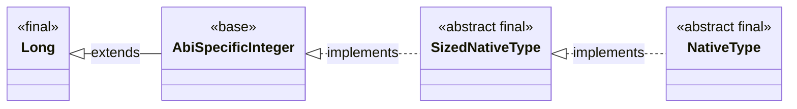

#### 21.3、**`bool`** <a href="#前言" style="font-size:17px; color:green;"><b>🔼</b></a> <a href="#🔚" style="font-size:17px; color:green;"><b>🔽</b></a>

```dart
final class bool
```

#### 21.4、**`double`** <a href="#前言" style="font-size:17px; color:green;"><b>🔼</b></a> <a href="#🔚" style="font-size:17px; color:green;"><b>🔽</b></a>

```dart
abstract final class double extends num
sealed class num implements Comparable<num>
```

#### 21.5、**`Float`** <a href="#前言" style="font-size:17px; color:green;"><b>🔼</b></a> <a href="#🔚" style="font-size:17px; color:green;"><b>🔽</b></a>

```dart
final class Float implements _NativeDouble
abstract final class _NativeDouble implements SizedNativeType
abstract final class SizedNativeType implements NativeType
abstract final class NativeType
```

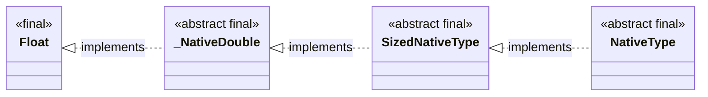

#### 21.6、**`String`** <a href="#前言" style="font-size:17px; color:green;"><b>🔼</b></a> <a href="#🔚" style="font-size:17px; color:green;"><b>🔽</b></a>

```dart
abstract final class String implements Comparable<String>, Pattern
abstract interface class Comparable<T>
abstract interface class Pattern
```

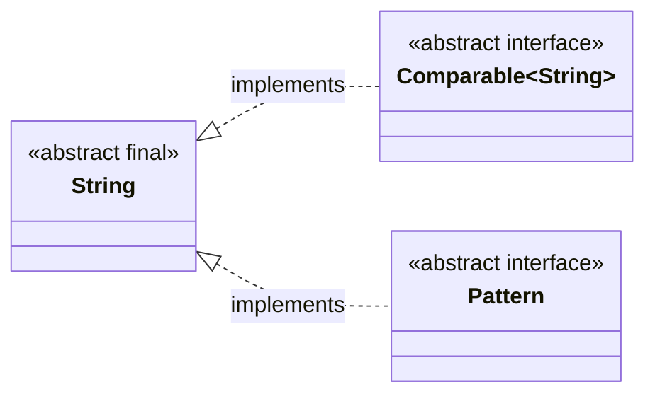

#### 21.7、**`List`** <a href="#前言" style="font-size:17px; color:green;"><b>🔼</b></a> <a href="#🔚" style="font-size:17px; color:green;"><b>🔽</b></a>

```dart
abstract interface class List<E> implements Iterable<E>, _ListIterable<E>
abstract mixin class Iterable<E>
abstract class _ListIterable<E> implements EfficientLengthIterable<E>, HideEfficientLengthIterable<E>
abstract class EfficientLengthIterable<T> extends Iterable<T>
abstract mixin class Iterable<E>
abstract interface class HideEfficientLengthIterable<T> implements Iterable<T>
```


#### 21.8、**`Map`** <a href="#前言" style="font-size:17px; color:green;"><b>🔼</b></a> <a href="#🔚" style="font-size:17px; color:green;"><b>🔽</b></a>

```dart
abstract interface class Map<K, V>
```

#### 21.9、**`Set`** <a href="#前言" style="font-size:17px; color:green;"><b>🔼</b></a> <a href="#🔚" style="font-size:17px; color:green;"><b>🔽</b></a>

```dart
abstract interface class Set<E> implements Iterable<E>, _SetIterable<E>
abstract mixin class Iterable<E>
abstract class _SetIterable<E>
implements EfficientLengthIterable<E>, HideEfficientLengthIterable<E>
abstract class EfficientLengthIterable<T> extends Iterable<T>
abstract mixin class Iterable<E>
```

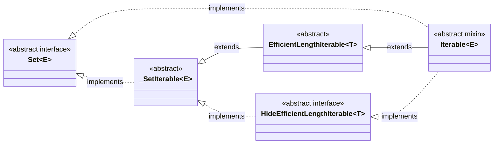

### 22、入参  <a href="#前言" style="font-size:17px; color:green;"><b>🔼</b></a> <a href="#🔚" style="font-size:17px; color:green;"><b>🔽</b></a>

> ⚠️<font color=red>**必须是编译期常量**</font>`const`。也就是意味着➤ 类似于：`X.w`、`X.h`之类的[**flutter_screenutil**](https://pub.dev/packages/flutter_screenutil)的扩展 `getter`（需要在 **运行时有 BuildContext**）。<u>故此时使用，即会报错</u>

#### 22.1、必传入参  <a href="#前言" style="font-size:17px; color:green;"><b>🔼</b></a> <a href="#🔚" style="font-size:17px; color:green;"><b>🔽</b></a>

> <font color=red>**直接传，不用带参数名。但是序号不能乱**</font>

```dart
void printUserInfo(String name, int age) {
  print('Name: $name, Age: $age');
}

void main() {
  printUserInfo('Jobs', 18);  // ✅ 正确
  // printUserInfo(18, 'Jobs'); // ❌ 顺序错误，类型也不匹配
  // printUserInfo('Jobs');     // ❌ 少传参数
}
```

#### 22.2、可选入参  <a href="#前言" style="font-size:17px; color:green;"><b>🔼</b></a> <a href="#🔚" style="font-size:17px; color:green;"><b>🔽</b></a>

> 在众多的参数列表中，序号可以乱，但是必须带参数名

##### 22.2.1、可选位置参数：传值时 **按顺序，但不带参数名** <font color=red>`[]`</font>   <a href="#前言" style="font-size:17px; color:green;"><b>🔼</b></a> <a href="#🔚" style="font-size:17px; color:green;"><b>🔽</b></a>

```dart
// 多个可选位置参数
void showTrip(
  String passengerName,                // 必传位置参数
  [String destination = 'Unknown',     // 可选位置参数 1
   String transport = 'Car',           // 可选位置参数 2
   String seatClass = 'Economy']       // 可选位置参数 3
) {
  print('👤 Passenger: $passengerName');
  print('📍 Destination: $destination');
  print('🚗 Transport: $transport');
  print('💺 Seat Class: $seatClass');
}

void main() {
  // 只传必传参数
  showTrip('Alice');
  print('---');

  // 传必传 + 第1个可选
  showTrip('Bob', 'Paris');
  print('---');

  // 传必传 + 第1个 + 第2个可选
  showTrip('Charlie', 'Tokyo', 'Plane');
  print('---');

  // 全部传
  showTrip('David', 'London', 'Train', 'First');
}

```

##### 22.2.2、可选命名参数：传值时用 **参数名**，顺序无关 <font color=red>`{}`</font>   <a href="#前言" style="font-size:17px; color:green;"><b>🔼</b></a> <a href="#🔚" style="font-size:17px; color:green;"><b>🔽</b></a>

```dart
void greet(String name, {String suffix = ''}) {
  print('Hello, $name$suffix');
}

void main() {
  greet('Jobs');                     // Hello, Jobs
  greet('Jobs', suffix: '!!!');      // Hello, Jobs!!!
}
```

##### 22.2.3、可选入参中必传： <font color=red>**required 带参数名 **</font>  <a href="#前言" style="font-size:17px; color:green;"><b>🔼</b></a> <a href="#🔚" style="font-size:17px; color:green;"><b>🔽</b></a>

```dart
void greet(String name, {required String mood}) {
  print('Hello, $name! You seem $mood today.');
}

void main() {
  greet('Jobs', mood: 'happy'); // ✅ 正确
  // greet('Jobs');             // ❌ 报错：缺少必传参数 mood
}
```

### 23、🔧**自动化代码生成工具** <a href="#前言" style="font-size:17px; color:green;"><b>🔼</b></a> <a href="#🔚" style="font-size:17px; color:green;"><b>🔽</b></a>

* [<font color=red>**build_runner**</font>](https://pub.dev/packages/build_runner)

  > **[Dart](https://dart.dev/) 的代码生成引擎**，用于根据规则自动生成 [**Dart**](https://dart.dev/) 代码
  >
  > 📦 它本身不生成代码，但**驱动其他插件去生成代码**。

  | 命令                                 | 作用                               |
  | ------------------------------------ | ---------------------------------- |
  | `flutter pub run build_runner build` | 一次性生成代码                     |
  | `flutter pub run build_runner watch` | 监听源码变化自动生成代码           |
  | `flutter pub run build_runner clean` | 清除 `.dart_tool` 中生成的缓存代码 |

  * `build_runner` 是建筑工人👷（实际干活的）
    * `json_serializable`、`flutter_gen_runner`、`freezed` 等是设计图 📐（告诉你该建什么）
    * `.g.dart`、`.gen.dart` 文件是建筑成果 🏠（自动生成的代码）


* 依赖的引入**`pubspec.yaml`** （[**VSCode**](https://code.visualstudio.com/)保存即执行：`dart pub get`）

* <font color=red>**手动运行中间代码生成工具**</font>

  ```shell
  dart run build_runner build
  ```

* 自动监听文件变动并实时生成代码（常驻运行的监听进程）

  * 前台终端运行此命令，则**不能关闭终端**。否则无法进行实时监听

    ```shell
    dart run build_runner watch
    ```

  * **后台运行（不阻塞终端）**

    > 加上 `&` 表示后台运行，但注意
    >
    > - 它不会输出错误日志到当前窗口；
    > - 还要手动 kill 掉后台进程，不够直观。

    ```shell
    dart run build_runner watch --delete-conflicting-outputs &
    ```

  | 功能                      | 描述                                            |
  | ------------------------- | ----------------------------------------------- |
  | 自动监听 `.dart` 文件变化 | 当你修改 model / 接口等文件时，自动触发代码生成 |
  | 实时生成 `.g.dart` 等文件 | 无需每次手动运行 `build_runner build`           |
  | 增量构建，速度更快        | 只构建有变化的文件，性能优于 `build`            |

* 代码示例：

  * [<font color=red>**flutter_gen_runner**</font>](https://pub.dev/packages/flutter_gen)

    > 根据你的 `pubspec.yaml` 中配置的资源文件，自动生成 `assets.gen.dart` 文件，让你用代码方式访问资源，更安全、方便。

    ```yaml
    dev_dependencies:
      flutter_gen_runner: any
      build_runner: any

    flutter_gen:
      output: lib/gen/ # 生成文件的目录
    ```

  * <font color=blue id=自动化代码生成Model>自动化代码生成**Model**</font>

    * 使用 [<font color=red id=json_serializable>**json_serializable**</font>](https://pub.dev/packages/json_serializable)：用于<u>序列化</u>/<u>反序列化</u>**JSON**数据（<font color=blue>**函数、方法、闭包等在 Dart 中是不可序列化的类型**</font>）

        > ```yaml
        > # pubspec.yaml 编辑完后执行：dart pub get
        > dependencies:
        >  json_annotation: any  # 仅运行时依赖，不自动生成代码时也能用
        >
        > dev_dependencies:
        >  build_runner: any     # 代码生成器
        >  json_serializable: any # 负责生成 .g.dart 文件
        > ```
        >
        > **生成的中间代码会与此文件在同一个文件夹下**
        >
        > 

        ```dart
        // UserModel.dart
        import 'package:json_annotation/json_annotation.dart';
        part 'UserModel.g.dart'; // （1️⃣ 第一个名字必须和本文件名一致，区分大小写）2️⃣ 必须自动化生成代码前就要写这一句，否则会报错

        @JsonSerializable() // 3️⃣ 用注解，将此类标注出来生成中间件。4️⃣ @JsonSerializable()只能用于类，不能用于变量或函数
        class UserModel {
          final String name;
          final int age;

          UserModel({
            required this.name,
            required this.age,
          });

          /// 只有成功生成中间代码以后：_$UserModelFromJson(json); 和 _$UserModelToJson(this);才不报错

          /// 从 JSON 转 Model
          factory UserModel.fromJson(Map<String, dynamic> json) =>
              _$UserModelFromJson(json);

          /// 从 Model 转 JSON
          Map<String, dynamic> toJson() => _$UserModelToJson(this);
        }
        ```

    * 使用 [<font color=red>**built_value**</font>](https://pub.dev/packages/built_value)

      > ```yaml
      > # pubspec.yaml 编辑完后执行：dart pub get
      > dependencies:
      > built_value: any
      > 	built_collection: any
      >
      > dev_dependencies:
      > 	build_runner: any
      > 	built_value_generator: any
      > ```
      >
      > **生成的中间代码会与此文件在同一个文件夹下**
      >
      > 

      ```dart
      /// serializers.dart
      library serializers; // ✅ 加上这一句非常关键！
      
      import 'package:built_value/serializer.dart';
      import 'package:built_value/standard_json_plugin.dart';
      import 'package:jobs_flutter_base_config/JobsDemoTools/Data/Data.3rd/JSONs.analyze/built_value_demo✅/利用脚本自动生成的built_value序列化文件/video_item.dart';
      import 'package:built_collection/built_collection.dart'; // ✅ 没有这一句就会找不到 BuiltList
      
      part 'serializers.g.dart'; // ✅ 生成器才能识别到它，并生成对应的序列化文件
      
      @SerializersFor([
        VideoItem,
        VideoList,
      ])
      final Serializers serializers = (_$serializers.toBuilder()
            ..addPlugin(StandardJsonPlugin())
            ..addBuilderFactory(
              const FullType(BuiltList, [FullType(VideoItem)]),
              () => ListBuilder<VideoItem>(),
            ))
          .build();
      ```

      ```dart
      /// video_item.dart
      import 'package:built_value/built_value.dart';
      import 'package:built_value/serializer.dart';
      import 'package:built_collection/built_collection.dart';
      
      part 'video_item.g.dart'; // ✅ 同目录内文件。不允许跨文件夹
      
      abstract class VideoItem implements Built<VideoItem, VideoItemBuilder> {
        String? get nick_name;
        String? get head;
        /// 省略若干...
      
        VideoItem._();
        factory VideoItem([void Function(VideoItemBuilder) updates]) = _$VideoItem;
      
        static Serializer<VideoItem> get serializer => _$videoItemSerializer;
      }
      
      abstract class VideoList implements Built<VideoList, VideoListBuilder> {
        BuiltList<VideoItem> get list;
      
        VideoList._();
        factory VideoList([void Function(VideoListBuilder) updates]) = _$VideoList;
      
        static Serializer<VideoList> get serializer => _$videoListSerializer;
      }
      ```


* 🚀 常见的代码生成应用场景

  | 应用场景          | 使用说明                                           | 常用库 / 工具                                     |
  | ----------------- | -------------------------------------------------- | ------------------------------------------------- |
  | ✅ JSON Model      | 自动生成 `fromJson()` / `toJson()`                 | `json_serializable` + `build_runner`              |
  | ✅ 多语言          | 自动生成 `AppLocalizations.of(context).xxx` 的代码 | Flutter 官方 `flutter_localizations` + `gen_l10n` |
  | ✅ 路由注册        | 自动注册路由，避免手写字符串跳转                   | `auto_route`、`get`、`go_router` 的生成器         |
  | ✅ API 封装        | 自动生成请求类、实体类、接口调用                   | `retrofit` + `dio` + `json_serializable`          |
  | ✅ Freezed 模型    | 自动生成不可变类、`copyWith()`、`==`、`hashCode`   | `freezed` + `build_runner`                        |
  | ✅ 表达式处理      | 比如 `sealed_union` / `pattern matching`           | `sealed_unions`, `sum_types`, `match` 等          |
  | ✅ 表单校验类      | 自动生成表单验证器                                 | `formz`, `reactive_forms`                         |
  | ✅ Bloc/State 构建 | 自动生成 Bloc 状态、事件类                         | `bloc` + `hydrated_bloc` + `freezed`              |
  | ✅ Equatable支持   | 自动添加 `==` / `hashCode` 比较                    | `freezed` 内建，或 `equatable` 手动               |
  | ✅ Hive Adapter    | 自动生成 Hive 的 `TypeAdapter`                     | `hive_generator`                                  |
  | ✅ ORM（数据库）   | 自动生成数据库表字段映射、查询函数                 | `floor`, `moor`（drift）                          |
  | ✅ 测试 mock       | 自动生成 `@Mock()`、伪接口                         | `mockito` + `build_runner`                        |
  | ✅ Dart FFI        | 自动生成 FFI 对应的 dart wrapper                   | `ffigen`                                          |

### 24、🏗️构造函数 <a href="#前言" style="font-size:17px; color:green;"><b>🔼</b></a> <a href="#🔚" style="font-size:17px; color:green;"><b>🔽</b></a>

#### 24.1、**默认构造函数**（<font color=red>**不能有两个默认构造函数（名字相同，参数不同也不行）**</font>） <a href="#前言" style="font-size:17px; color:green;"><b>🔼</b></a> <a href="#🔚" style="font-size:17px; color:green;"><b>🔽</b></a>

> 默认构造函数 == 没写名字的命名构造函数。

```dart
class Person {
  final String name;
  Person(this.name); // 默认构造函数（只能有一个，函数名即类名。名字相同，参数不同也不行）
  // Person(int age); // ❌ 报错：重复定义构造函数
}
```

#### 24.2、**命名构造函数**（<font color=red>**可以有多个命名构造函数，但是：必须有唯一名字**</font>） <a href="#前言" style="font-size:17px; color:green;"><b>🔼</b></a> <a href="#🔚" style="font-size:17px; color:green;"><b>🔽</b></a>

```dart
 class Person {
  final String name;
  final int age;
  Person(this.name, this.age); // 默认构造函数（只能有一个，函数名即类名。名字相同，参数不同也不行）
  Person.student(String name) : this(name, 18); // 默认学生18岁
  Person.student(int age) : this("Jobs", age); // ❌ 报错。Dart 不支持构造函数的重载（不像 Java 或 C++ 那样支持同名不同参）
}
```

```dart
/// 命名构造函数 的相关调用
void main() {
  var p1 = Person("Tom", 25);           // 调用默认构造函数
  var p2 = Person.student("Alice");     // 调用命名构造函数

  print("${p1.name}, ${p1.age}");       // 输出: Tom, 25
  print("${p2.name}, ${p2.age}");       // 输出: Alice, 18
}
```

#### 24.3、**初始化列表构造函数** <a href="#前言" style="font-size:17px; color:green;"><b>🔼</b></a> <a href="#🔚" style="font-size:17px; color:green;"><b>🔽</b></a>

```dart
class User {
  final String upperName;
  // ✅ 对参数做转换处理
  User(String name) : upperName = name.toUpperCase();// 对外来的参数，进行一次处理以后，再赋值到成员变量（初始化 final 字段）
}
```

```dart
/// 初始化列表构造函数 的相关调用
void main() {
  var user = User("jobs");
  print(user.upperName); // 输出：JOBS
}
```

#### 24.4、**`const` 构造函数**（**`Widget`** 常用）<a href="#前言" style="font-size:17px; color:green;"><b>🔼</b></a> <a href="#🔚" style="font-size:17px; color:green;"><b>🔽</b></a>

> | 作用                          | 好处                                                         |
> | ----------------------------- | ------------------------------------------------------------ |
> | 编译期常量                    | 提高性能，减少内存分配                                       |
> | 支持 **`Widget`**  树中的优化 | [**Flutter**](https://flutter.dev/) 的 `const` **`Widget`** 可避免重建，提高性能 |
> | 自动复用相同实例              | 节省资源、提高效率                                           |

```dart
class Point {
  final int x, y;
  const Point(this.x, this.y);
}
```

```dart
/// 普通调用（非 const）
void main() {
  var p = Point(3, 4);
  print('Point: (${p.x}, ${p.y})'); // 输出: Point: (3, 4)
}
```

```dart
/// const 调用（编译期常量）
void main() {
  const p1 = Point(3, 4);
  const p2 = Point(3, 4);
  // identical(p1, p2) 是 Dart 判断两个对象是否是“同一个内存地址”的方法。
  // 因为是 const，所以 Dart 会在编译期把 (3, 4) 的 Point 实例缓存并复用。
  print(identical(p1, p2)); // true ✅ 编译期常量，自动复用同一个对象
}
```

#### 24.5、**`factory` 构造函数**（高级构建方式） <a href="#前言" style="font-size:17px; color:green;"><b>🔼</b></a> <a href="#🔚" style="font-size:17px; color:green;"><b>🔽</b></a>

```dart
class Person {
  final String name;
  Person._internal(this.name); // 私有构造函数
  // 工厂构造函数（可以缓存/控制创建）
  factory Person.fromJson(Map<String, dynamic> json) {
    return Person._internal(json['name']);
  }
}
```

### 25、📦<font id=构建打包>**构建打包**</font> <a href="#前言" style="font-size:17px; color:green;"><b>🔼</b></a> <a href="#🔚" style="font-size:17px; color:green;"><b>🔽</b></a>

> 1️⃣ <a href="#自动化代码生成应用外观资源" style="font-size:17px; color:green;"><b>自动化代码生成应用外观资源</b></a>
>
> 2️⃣ 打包慢，尤其[**Android**](https://www.android.com/)平台
>
> 3️⃣ [**Flutter**](https://flutter.dev/) 的3大构建模式
>
> | 对比项                     | `debug` 模式                                         | `profile` 模式                      | `release` 模式                     |
> | -------------------------- | ---------------------------------------------------- | ----------------------------------- | ---------------------------------- |
> | ✅ **用途**                 | 开发调试阶段                                         | 性能分析阶段                        | 上线发布给用户                     |
> | 🧠 **Dart 执行方式**        | JIT（即时编译）                                      | AOT（提前编译）+ 部分调试支持       | 完整 AOT 编译（最高性能）          |
> | 🚀 **性能优化**             | 无优化                                               | 启用大部分性能优化                  | 完全优化                           |
> | 📦 **包体积大小**           | 最大（含调试信息、[**Dart**](https://dart.dev/) VM） | 中等                                | 最小（树摇优化、混淆、无调试信息） |
> | 🔁 **支持热重载**           | ✅ 支持                                               | ❌ 不支持                            | ❌ 不支持                           |
> | 🧪 **DevTools 支持**        | ✅ 支持调试和 DevTools                                | ✅ 支持部分 **DevTools**（性能分析） | ❌ 不支持调试工具                   |
> | 🐞 **断点调试 / `print()`** | ✅ 支持断点和 `print()` 输出                          | ✅ 支持 `print()`（部分断点）        | ❌ `print()` 默认不输出 / 被裁剪    |
> | 🔒 **混淆支持**             | ❌ 默认关闭                                           | ❌ 默认关闭                          | ✅ 可开启（需配置 Proguard / R8）   |
> | 🧬 **代码签名**             | ❌ 不签名（开发包）                                   | ✅ 可签名（需配置）                  | ✅ 强制签名（发布包）               |
> | 🔍 **Flutter inspector**    | ✅ 可用                                               | ❌ 不可用                            | ❌ 不可用                           |
> | 🛠 **构建命令**             | `flutter build apk --debug`                          | `flutter build apk --profile`       | `flutter build apk --release`      |
> | 📁 **输出路径**             | `build/app/outputs/flutter-apk/app-debug.apk`        | `.../app-profile.apk`               | `.../app-release.apk`              |

* 构建环境清理与诊断命令对照表

  * 🧹 [**Flutter**](https://flutter.dev/) 构建环境清理与诊断命令对照表

    | 📦 命令            | 💡 说明                                                       |
    | ----------------- | ------------------------------------------------------------ |
    | `flutter clean`   | 清理 [**Flutter**](https://flutter.dev/) 构建产物（适用于 **iOS** 和 [**Android**](https://www.android.com/)），解决异常构建、缓存问题 |
    | `flutter pub get` | 重新获取 [**Dart**](https://dart.dev/) 依赖（通常配合 clean 一起使用） |

  * 🍎 **iOS** 专用命令

    | 命令                                                         | 说明                                                         |
    | ------------------------------------------------------------ | ------------------------------------------------------------ |
    | `rm -rf ios/Pods`                                            | 删除 **iOS** 第三方依赖（**Pods** 文件夹）                   |
    | `rm ios/Podfile.lock`                                        | 删除 Pod 版本锁定文件                                        |
    | `pod install`                                                | 安装 **iOS** 依赖，需 [**CocoaPods**](https://cocoapods.org/) 支持 |
    | `pod update`                                                 | 升级 **iOS** 依赖，会更新所有 **Pods** 版本                  |
    | `arch -x86_64 pod install`（Intel 构建兼容命令，适用于 Apple Silicon） | 解决部分插件不兼容 ARM 的问题                                |
    | `flutter build ios --no-codesign`                            | 构建 **iOS** 项目但跳过签名，适用于 CI 或调试环境            |
    | `open ios/Runner.xcworkspace`                                | 用 [**XCode**](https://developer.apple.com/xcode/) 打开 **iOS** 工程（使用 [**CocoaPods**](https://cocoapods.org/) 管理时必须） |

  * 🤖 [**Android**](https://www.android.com/) 专用命令

    | 命令                                                    | 说明                                                         |
    | ------------------------------------------------------- | ------------------------------------------------------------ |
    | `rm -rf android/.gradle`                                | 删除 [**Android**](https://www.android.com/) 层的 gradle 缓存，适用于依赖异常或版本冲突问题 |
    | `rm -rf ~/.gradle`                                      | 删除全局 **gradle** 缓存（慎用），解决某些 **gradle** 残留 bug |
    | `rm -rf android/build`                                  | 删除 [**Android**](https://www.android.com/) 构建产物        |
    | `flutter build apk`                                     | 构建 **APK** 文件（适用于调试安装）                          |
    | `flutter build appbundle`                               | 构建 **AAB** 包（用于[**Google Play**](https://play.google.com/)上架） |
    | `flutter build apk --debug` / `--release` / `--profile` | 根据模式构建对应 **APK**                                     |
    | `./gradlew clean`（在 `android/` 目录下）               | 执行 [**Android**](https://www.android.com/) 原生 **gradle** 清理（`Flutter clean `不会清理全部） |
    | `./gradlew build`                                       | 构建完整 [**Android**](https://www.android.com/) 原生项目（包括 **Java**/**Kotlin** 代码） |

  * 🛠️ 诊断与环境检查命令

    | 命令                   | 说明                                                         |
    | ---------------------- | ------------------------------------------------------------ |
    | `flutter doctor -v`    | 检查 [**Flutter**](https://flutter.dev/)、[**Dart**](https://dart.dev/)、[**XCode**](https://developer.apple.com/xcode/)、[**Android**]([**Android**](https://www.android.com/))、[**CocoaPods**](https://cocoapods.org/)、**Java** 配置等所有环境 |
    | `flutter pub outdated` | 检查 `pubspec.yaml` 中的依赖是否有更新                       |
    | `flutter analyze`      | 分析 **Dart** 代码规范与静态错误                             |
    | `flutter upgrade`      | 升级 [**Flutter**](https://flutter.dev/).**SDK** 到最新版本  |

* 📦 [**Flutter**](https://flutter.dev/) 构建模式总览表

  | 模式名                             | 命令 / 配置示例                                  | 编译方式           | 是否调试   | 是否优化     | 主要用途                          | 适用平台                              | 备注                            |
  | ---------------------------------- | ------------------------------------------------ | ------------------ | ---------- | ------------ | --------------------------------- | ------------------------------------- | ------------------------------- |
  | <font color=red>**debug**</font>   | `flutter run``flutter build apk --debug`         | **JIT**            | ✅ 支持     | ❌ 无优化     | 开发调试                          | **Android**<br/> **iOS**<br/> **Web** | 默认模式，支持热重载            |
  | <font color=red>**profile**</font> | `flutter build apk --profile`                    | **AOT+Profile**    | ⚠️ 限制调试 | ✅ 部分优化   | 性能分析                          | **Android**<br/>**iOS**<br/>**Web**   | 不支持断点调试，但支持 DevTools |
  | <font color=red>**release**</font> | `flutter build apk --release`                    | **AOT**            | ❌ 禁用     | ✅ 最大优化   | 上线发布                          | **Android**<br/> **iOS**<br/> **Web** | 无调试符号，运行最快            |
  | **web-debug**                      | `flutter run -d chrome`                          | **Dart Dev**       | ✅ 支持     | ❌ 无优化     | **Web** 开发                      | **Web**<br/>（Chrome 等）             | 启动本地 dev-server             |
  | **web-profile**                    | `flutter build web --profile`                    | **Dart2JS **+ 调试 | ⚠️ 限制调试 | ✅ 优化部分   | **Web** 性能测试                  | **Web**<br/>                          | 用于 Web 基准测试               |
  | **web-release**                    | `flutter build web --release`                    | **Dart2JS** + 优化 | ❌ 禁用     | ✅ 最大优化   | **Web** 上线                      | **Web**<br/>                          | 用于部署生产环境                |
  | **jit_release**                    | 内部测试配置（非官方公开）                       | **JIT (Release)**  | ⚠️ 限制     | ✅ 类 release | 内部测试、验证行为差异            | 实验性/嵌入式场景                     | CLI 不支持，需手动设置          |
  | **dynamic**                        | [**Flutter**](https://flutter.dev/) 动态集成场景 | **JIT + AOT**      | 依项目配置 | 依项目配置   | Add-to-App 混合开发               | **Android**<br/>**iOS**               | 原生动态加载 Flutter            |
  | **flavor 模式**                    | `flutter build apk --flavor staging`             | 依所选模式         | 依所选模式 | 依所选模式   | 多环境打包（`staging`、`uat` 等） | **Android**<br/>**iOS**               | 非编译模式，属于构建配置        |

#### 25.1、[**配置Shell打包命令**](https://github.com/JobsKit/JobsMacEnvVarConfig) <a href="#前言" style="font-size:17px; color:green;"><b>🔼</b></a> <a href="#🔚" style="font-size:17px; color:green;"><b>🔽</b></a>

> 直接写入`.zshrc`➤[**Flutter**](https://flutter.dev/)的版本锁定+用于[**Android**](https://www.android.com/)的**Java**环境的锁定
>
> <font color=red>**如果修改了环境变量文件，要输入`rb`唤起`exec "$SHELL"`,可以避免不重启终端而加载修改项**</font>

```shell
# ✅ 打包构建前置：清理 & 拉依赖 & doctor（保证一定在项目根执行）
buildCheck() {
  local here="$PWD"
  local project_path

  if is_flutter_project "$here"; then
    project_path="$here"
  else
    project_path="$(get_flutter_project_dir "$here")" || { echo "已取消"; return 1; }
    cd "$project_path" || return 1
  fi

  read -r "?是否执行清理和依赖安装 (回车=执行，任意字符=跳过): " ans
  if [[ -z "$ans" ]]; then
    echo "🧹 flutter clean / pub get / doctor @ $project_path"
    flutter clean || return $?
    flutter pub get || return $?
    flutter doctor -v || return $?
  else
    echo "⏩ 跳过 flutter clean / pub get / doctor"
  fi
}

# ✅ Flutter 项目识别
is_flutter_project() {
  local dir="$1"
  [[ -d "$dir/lib" && -f "$dir/pubspec.yaml" ]]
}

# ✅ 获取 Flutter 项目目录（仅把“最后的路径”输出到 stdout）
# 用法：
#   local project_path; project_path="$(get_flutter_project_dir "$PWD")" || return 1
#   cd "$project_path" || return 1
get_flutter_project_dir() {
  local start="${1:-$PWD}"
  local project_path="$start"

  while ! is_flutter_project "$project_path"; do
    echo "❌ [$project_path] 不是合法的 Flutter 项目目录（缺少 lib/ 或 pubspec.yaml）" >&2
    read -r "?➤ 请输入 Flutter 项目路径（回车=继续询问，q=退出）: " input_path
    [[ "$input_path" == "q" || "$input_path" == "Q" ]] && return 1
    [[ -z "$input_path" ]] && continue
    eval "project_path=\"$input_path\""                       # 展开 ~
    project_path="$(cd "$project_path" 2>/dev/null && pwd || echo "")"
    [[ -z "$project_path" ]] && echo "⚠️ 路径无效，请重试" >&2
  done

  printf "%s\n" "$project_path"
}

# ================================== 构建前置：保证 fvm + 版本 + flutter_cmd ==================================
# ✅ 设定 flutter_cmd 为命令数组（优先 fvm），确保后续以 "${flutter_cmd[@]}" 执行
set_flutter_cmd() {
  export PATH="$HOME/.pub-cache/bin:$PATH"
  if command -v fvm >/dev/null 2>&1; then
    flutter_cmd=(fvm flutter)
  else
    flutter_cmd=(flutter)
  fi
  echo "[INFO] flutter_cmd = ${flutter_cmd[*]}"
}

# ✅ 读取当前项目希望使用的 Flutter 版本（优先 .fvmrc / .fvm/fvm_config.json）
read_project_flutter_version() {
  local v=""
  if [[ -f .fvmrc ]]; then
    v="$(jq -r '.flutterSdkVersion // empty' .fvmrc 2>/dev/null)"
  elif [[ -f .fvm/fvm_config.json ]]; then
    v="$(jq -r '.flutterSdkVersion // empty' .fvm/fvm_config.json 2>/dev/null)"
  fi
  [[ -n "$v" ]] && echo "$v"
}

# ✅ 读取当前项目希望使用的 Flutter 版本（更健壮）
read_project_flutter_version() {
  local v=""

  # 1) 优先：.fvm/version（FVM 3.x/4.x 常见）
  if [[ -f .fvm/version ]]; then
    v="$(tr -d '\r' < .fvm/version | tr -d '[:space:]')"
    [[ -n "$v" ]] && echo "$v" && return 0
  fi

  # 2) .fvmrc：可能是 JSON，也可能是纯文本；键名可能是 "flutter" 或 "flutterSdkVersion"
  if [[ -f .fvmrc ]]; then
    # 2.1 JSON 解析
    if command -v jq >/dev/null 2>&1 && head -c1 .fvmrc | grep -q '{'; then
      v="$(jq -r '.flutter // .flutterSdkVersion // empty' .fvmrc 2>/dev/null | tr -d '[:space:]')"
      [[ -n "$v" ]] && echo "$v" && return 0
    fi
    # 2.2 纯文本（直接写版本号）
    v="$(sed -E 's/^[[:space:]]+|[[:space:]]+$//g' .fvmrc \
        | grep -Eo '[0-9]+\.[0-9]+\.[0-9]+' | head -n1)"
    [[ -n "$v" ]] && echo "$v" && return 0
  fi

  # 3) .fvm/fvm_config.json（旧工具链常见）
  if [[ -f .fvm/fvm_config.json ]] && command -v jq >/dev/null 2>&1; then
    v="$(jq -r '.flutter // .flutterSdkVersion // empty' .fvm/fvm_config.json 2>/dev/null | tr -d '[:space:]')"
    [[ -n "$v" ]] && echo "$v" && return 0
  fi

  # 4) 兜底：如果项目内已经有 .fvm/flutter_sdk/bin/flutter，就直接读取版本号
  if [[ -x .fvm/flutter_sdk/bin/flutter ]]; then
    v="$(.fvm/flutter_sdk/bin/flutter --version 2>/dev/null \
        | grep -Eo 'Flutter [0-9]+\.[0-9]+\.[0-9]+' | awk '{print $2}' | head -n1)"
    [[ -n "$v" ]] && echo "$v" && return 0
  fi

  # 未找到
  return 1
}

# ✅ 在 apk 构建前调用：确保 fvm 存在 & 选定并安装好 Flutter 版本（若已有配置则不打扰）
ensure_fvm_and_flutter_version_before_build() {
  if ! command -v fvm >/dev/null 2>&1; then
    echo "[INFO] 未检测到 fvm，准备安装"
    if ! command -v dart >/dev/null 2>&1; then
      echo "[ERROR] 未检测到 dart，请先安装 dart 后重试"
      return 1
    fi
    dart pub global deactivate fvm >/dev/null 2>&1 || true
    dart pub global activate  fvm || { echo "[ERROR] fvm 安装失败"; return 1; }
    echo "[OK] fvm 安装成功"
  else
    # 确保 fvm 是用当前 Dart 重新激活过的，避免 kernel 版本不匹配
    dart pub global activate fvm >/dev/null 2>&1 || true
    echo "[INFO] fvm 已就绪"
  fi

  set_flutter_cmd

  local desired_version=""
  if desired_version="$(read_project_flutter_version)"; then
    echo "[INFO] 项目已绑定 Flutter 版本：$desired_version"
  else
    echo "[INFO] 项目未绑定 Flutter 版本，尝试获取 stable 列表"
    local versions latest
    versions="$(curl -fsSL https://storage.googleapis.com/flutter_infra_release/releases/releases_macos.json \
      | jq -r '.releases[] | select(.channel=="stable") | .version' | sort -V | uniq | tac)"
    latest="$(echo "$versions" | head -n1)"

    if command -v fzf >/dev/null 2>&1; then
      local pick
      pick="$(echo "$versions" | fzf --prompt='选择 Flutter 版本：' --height=50% --border --ansi)"
      desired_version="$(echo "$pick" | grep -Eo '^[0-9]+\.[0-9]+\.[0-9]+$')"
    fi
    desired_version="${desired_version:-$latest}"

    # 同步写入两处配置，兼容新旧工具链
    printf '{ "flutter": "%s" }\n' "$desired_version" > .fvmrc
    mkdir -p .fvm
    printf '{ "flutter": "%s", "flutterSdkVersion": "%s" }\n' "$desired_version" "$desired_version" > .fvm/fvm_config.json
    printf '%s\n' "$desired_version" > .fvm/version
    echo "[OK] 已写入 .fvmrc / .fvm/fvm_config.json / .fvm/version：$desired_version"
  fi

  # 安装 & 切换（install 幂等，直接执行最省事）
  echo "[INFO] 安装 Flutter $desired_version（如已安装会跳过下载）"
  fvm install "$desired_version" || { echo "[ERROR] fvm install 失败"; return 1; }

  fvm use "$desired_version" --force || { echo "[ERROR] fvm use 失败"; return 1; }

  set_flutter_cmd
  echo "[OK] Flutter $desired_version 就绪"
}

# ✅ 打 Android 包需要Java环境@17
ensure_jdk17() {
  if ! /usr/libexec/java_home -v 17 >/dev/null 2>&1; then
    err "系统未安装 JDK 17；请先安装（Temurin 17 / Zulu 17 等）。"
    exit 1
  fi
  jenv add "$(/usr/libexec/java_home -v 17)" >/dev/null 2>&1 || true
  jenv rehash
  local pick_17
  pick_17="$(jenv versions --bare | grep -E '(^|[[:space:]])(.*17(\.|$).*)' | head -n1 || true)"
  [[ -z "${pick_17:-}" ]] && { err "jenv 中未发现 JDK 17。"; exit 1; }

  jenv shell "$pick_17"
  export JENV_VERSION="$pick_17"
  export JAVA_HOME="$(jenv prefix)"
  export PATH="$JAVA_HOME/bin:$PATH"

  echo "$pick_17" > .java-version
  echo "JENV_VERSION=$JENV_VERSION"
  echo "JAVA_HOME=$JAVA_HOME"
  java -version
}

# ✅ 打 Android 包📦
apk() {
  local project_path
  project_path="$(get_flutter_project_dir "$PWD")" || return 1
  echo "[OK] 已确认 Flutter 项目目录: $project_path"
  cd "$project_path" || return 1

  # 现在才执行 buildCheck（保证在项目根）
  if typeset -f buildCheck >/dev/null; then buildCheck || return $?; fi

  ensure_fvm_and_flutter_version_before_build || return $?
  ensure_jdk17 || return $?

  # 子插件依赖更新
  if [[ -f "plugins/htprotect/pubspec.yaml" ]]; then
    echo "[INFO] 执行子插件依赖更新: plugins/htprotect"
    (cd plugins/htprotect && "${flutter_cmd[@]}" pub get) || return $?
  else
    echo "[WARN] 未找到 plugins/htprotect/pubspec.yaml，跳过 pub get"
  fi

  echo "[INFO] 开始构建 APK（release）..."
  "${flutter_cmd[@]}" build apk --release || return $?

  echo "[INFO] 打开输出目录: ./build/app/outputs/"
  open "./build/app/outputs/"
}

# ✅ 打 iOS 包📦
ipa() {
  if typeset -f buildCheck >/dev/null; then buildCheck; fi

  local project_path
  project_path="$(get_flutter_project_dir "$PWD")" || return 1
  echo "✅ 已确认 Flutter 项目目录: $project_path"
  cd "$project_path" || return 1

  echo "🚀 开始构建 iOS（release）..."
  flutter build ipa --release || return $?

  echo "📂 打开输出目录: ./build/ios/ipa/"
  open "./build/ios/ipa/"
}
```

#### 25.2、配置[**`SourceTree`**](https://www.sourcetreeapp.com/)打包脚本 <a href="#前言" style="font-size:17px; color:green;"><b>🔼</b></a> <a href="#🔚" style="font-size:17px; color:green;"><b>🔽</b></a>

* [**打包Flutter.Android**](https://github.com/JobsKit/SourceTree.sh/blob/main/%E3%80%90MacOS%40SourceTree%E3%80%91%F0%9F%93%A6%E5%8F%8C%E5%87%BB%E6%89%93%E5%8C%85Flutter.android.command)

  

  ```shell
  #!/bin/zsh
  # 【SourceTree 专用】Flutter Android 打包（自动发现子项目；纯文本；带心跳与阶段标记）
  set -euo pipefail
  
  # ---------------- 基本日志 ----------------
  SCRIPT_BASENAME=$(basename "$0" | sed 's/\.[^.]*$//')
  LOG_FILE="/tmp/${SCRIPT_BASENAME}.log"; : > "$LOG_FILE"
  BUILD_LOG="/tmp/flutter_build_log.txt"; : > "$BUILD_LOG"
  
  log()  { echo "$1" | tee -a "$LOG_FILE"; }
  info() { log "[INFO] $*"; }
  ok()   { log "[OK]   $*"; }
  warn() { log "[WARN] $*"; }
  err()  { log "[ERR]  $*" >&2; }
  
  ts()   { date "+%Y-%m-%d %H:%M:%S"; }
  hr()   { log "----------------------------------------------------------------"; }
  section(){ hr; log "== $* =="; hr; }
  
  HEARTBEAT_SECS="${HEARTBEAT_SECS:-15}"     # 心跳间隔（秒）
  OPEN_AFTER_BUILD="${OPEN_AFTER_BUILD:-1}"   # 1=构建成功后自动 open 产物目录
  
  # ---------------- 参数/环境 ----------------
  BUILD_TARGET="${BUILD_TARGET:-apk}"       # apk | appbundle | all
  BUILD_MODE="${BUILD_MODE:-release}"       # release | debug | profile
  FLAVOR="${FLAVOR:-}"                      # 可为空
  
  # 支持命令行覆盖
  while [[ $# -gt 0 ]]; do
    case "$1" in
      --target)  BUILD_TARGET="${2:-$BUILD_TARGET}"; shift 2;;
      --mode)    BUILD_MODE="${2:-$BUILD_MODE}";     shift 2;;
      --flavor)  FLAVOR="${2:-$FLAVOR}";             shift 2;;
      --)        shift; break;;
      *)         break;;
    esac
  done
  
  REPO_DIR="${1:-$PWD}"
  
  # ---------------- 小工具 ----------------
  is_flutter_root() { [[ -f "$1/pubspec.yaml" && -d "$1/lib" ]]; }
  
  # 安全执行（带心跳、统计耗时、正确保留退出码；输出同时写入 LOG_FILE/BUILD_LOG）
  # 用法：run_with_heartbeat "标题" 目录 cmd args...
  run_with_heartbeat() {
    local title="$1"; shift
    local wdir="$1"; shift
    local start_ts=$(date +%s)
    section "$title"
    info "start: $(ts)"
    info "workdir: $wdir"
    info "heartbeat: ${HEARTBEAT_SECS}s"
  
    # 启动命令
    (
      cd "$wdir" && "$@"
    ) 2>&1 | tee -a "$BUILD_LOG" &
    local cmd_pid=$!
  
    # 心跳
    (
      while kill -0 "$cmd_pid" 2>/dev/null; do
        sleep "$HEARTBEAT_SECS"
        kill -0 "$cmd_pid" 2>/dev/null || break
        log "[HB] $(ts) running: $title (pid=$cmd_pid)"
      done
    ) & local hb_pid=$!
  
    # 等待
    wait "$cmd_pid"; ec=$?
    kill "$hb_pid" 2>/dev/null || true
  
    local end_ts=$(date +%s)
    local dur=$(( end_ts - start_ts ))
    if [[ $ec -eq 0 ]]; then
      ok "$title done (duration ${dur}s)"
    else
      err "$title failed (duration ${dur}s, ec=$ec). See $BUILD_LOG"
    fi
    return $ec
  }
  
  # ---------------- 解析 Flutter 根目录（自动向下搜索） ----------------
  resolve_flutter_root() {
    local base="$1"
    if ! cd "$base" 2>/dev/null; then
      err "无法进入目录：$base"; exit 1
    fi
    base="$(pwd -P)"
    section "定位 Flutter 项目"
    info "基准目录：$base"
  
    if is_flutter_root "$base"; then
      FLUTTER_ROOT="$base"; ok "命中：$FLUTTER_ROOT"; return 0
    fi
    local hit
    hit="$(/usr/bin/find "$base" -name pubspec.yaml -type f -print 2>/dev/null | head -n1 || true)"
    if [[ -n "$hit" ]]; then
      FLUTTER_ROOT="$(dirname "$hit")"
      if is_flutter_root "$FLUTTER_ROOT"; then
        ok "在子目录中找到：$FLUTTER_ROOT"; return 0
      fi
    fi
    err "未找到 Flutter 项目（缺 pubspec.yaml 或 lib/）"; exit 1
  }
  
  # ---------------- 选择 flutter 命令 ----------------
  choose_flutter_cmd() {
    if command -v fvm >/dev/null 2>&1 && [[ -f "$FLUTTER_ROOT/.fvm/fvm_config.json" ]]; then
      FLUTTER_CMD=("fvm" "flutter"); info "使用：fvm flutter"
    else
      FLUTTER_CMD=("flutter"); info "使用：flutter"
    fi
  }
  
  # ---------------- Java 环境（固定 JDK17） ----------------
  ensure_java17() {
    section "Java 环境"
    if /usr/libexec/java_home -v 17 >/dev/null 2>&1; then
      export JAVA_HOME="$(/usr/libexec/java_home -v 17)"
      export PATH="$JAVA_HOME/bin:$PATH"
    else
      for p in /opt/homebrew/opt/openjdk@17 /usr/local/opt/openjdk@17; do
        if [[ -d "$p" && -x "$p/bin/java" ]]; then
          export JAVA_HOME="$p"; export PATH="$JAVA_HOME/bin:$PATH"; break
        fi
      done
    fi
    if ! command -v java >/dev/null 2>&1; then
      err "未检测到 JDK 17（java 不可用）。请安装 Temurin/Zulu/OpenJDK 17。"; exit 1
    fi
    ok "JAVA_HOME = $JAVA_HOME"
    info "java -version："; java -version | tee -a "$LOG_FILE" || true
  }
  
  # ---------------- 版本打印（防早退） ----------------
  print_versions() {
    section "环境版本"
    set +e
    if [[ -x "$FLUTTER_ROOT/android/gradlew" ]]; then
      info "Gradle Wrapper："
      (cd "$FLUTTER_ROOT/android" && ./gradlew -v) | tee -a "$LOG_FILE" || true
    else
      warn "未找到 $FLUTTER_ROOT/android/gradlew"
    fi
    local agp=""
    if [[ -f "$FLUTTER_ROOT/android/build.gradle" ]]; then
      agp="$(grep -Eo 'com\.android\.tools\.build:gradle:[0-9.]+' \
            "$FLUTTER_ROOT/android/build.gradle" 2>/dev/null | head -n1 | cut -d: -f3 || true)"
    fi
    if [[ -z "$agp" && -f "$FLUTTER_ROOT/android/settings.gradle" ]]; then
      agp="$(grep -Eo "com\.android\.application['\"]?[[:space:]]+version[[:space:]]+['\"]?[0-9.]+" \
            "$FLUTTER_ROOT/android/settings.gradle" 2>/dev/null | head -n1 \
            | grep -Eo '[0-9]+(\.[0-9]+){1,2}' || true)"
    fi
    set -e
    [[ -n "$agp" ]] && info "AGP：$agp" || warn "未检测到 AGP 版本"
  }
  
  # ---------------- pub get & build ----------------
  pub_get() {
    run_with_heartbeat "flutter pub get" "$FLUTTER_ROOT" "${FLUTTER_CMD[@]}" pub get
  }
  
  build_one() {
    local target="$1"
    local args=(build "$target" "--$BUILD_MODE")
    [[ -n "$FLAVOR" ]] && args+=(--flavor "$FLAVOR")
    run_with_heartbeat "flutter build $target ($BUILD_MODE ${FLAVOR:+/ flavor=$FLAVOR})" \
                       "$FLUTTER_ROOT" "${FLUTTER_CMD[@]}" "${args[@]}"
  }
  
  # ---------------- 打开产物目录（存在才开） ----------------
  open_if_exists() {
    local p="$1"
    if [[ "$OPEN_AFTER_BUILD" != "1" ]]; then return 0; fi
    if [[ -d "$p" ]]; then info "打开目录：$p"; open "$p" 2>/dev/null || true
    else warn "目录不存在：$p"; fi
  }
  
  # ---------------- 主流程 ----------------
  main() {
    section "启动参数"
    info "target=$BUILD_TARGET  mode=$BUILD_MODE  flavor=${FLAVOR:-<none>}  heartbeat=${HEARTBEAT_SECS}s"
    info "脚本日志：$LOG_FILE"
    info "构建日志：$BUILD_LOG"
  
    resolve_flutter_root "$REPO_DIR"
    choose_flutter_cmd
    ensure_java17
    print_versions
    pub_get
  
    case "$BUILD_TARGET" in
      apk)        build_one apk        || { err "APK 构建失败（见 $BUILD_LOG）"; exit 1; } ;;
      appbundle)  build_one appbundle  || { err "AAB 构建失败（见 $BUILD_LOG）"; exit 1; } ;;
      all)
        build_one apk       || { err "APK 构建失败（见 $BUILD_LOG）"; exit 1; }
        build_one appbundle || { err "AAB 构建失败（见 $BUILD_LOG）"; exit 1; }
        ;;
      *) warn "未知 BUILD_TARGET=$BUILD_TARGET，回退到 apk"; build_one apk || { err "APK 构建失败（见 $BUILD_LOG）"; exit 1; } ;;
    esac
  
    # 列出产物，并在存在时打开目录
    if [[ -d "$FLUTTER_ROOT/build/app/outputs" ]]; then
      section "产物列表"
      (cd "$FLUTTER_ROOT/build/app/outputs" && ls -lhR) | tee -a "$LOG_FILE" || true
    fi
    [[ "$BUILD_TARGET" == "apk" || "$BUILD_TARGET" == "all" ]] \
      && open_if_exists "$FLUTTER_ROOT/build/app/outputs/flutter-apk"
    [[ "$BUILD_TARGET" == "appbundle" || "$BUILD_TARGET" == "all" ]] \
      && open_if_exists "$FLUTTER_ROOT/build/app/outputs/bundle/$BUILD_MODE"
  
    ok "完成。构建日志：$BUILD_LOG ；脚本日志：$LOG_FILE"
  }
  
  main "$@"
  ```

* [**打包Flutter.iOS**](https://github.com/JobsKit/SourceTree.sh/blob/main/%E3%80%90MacOS%40SourceTree%E3%80%91%F0%9F%93%A6%E5%8F%8C%E5%87%BB%E6%89%93%E5%8C%85Flutter.iOS.command)

  

  ```shell
  #!/bin/zsh
  # 【SourceTree 专用】Flutter iOS 打包（自动发现子项目，纯文本；全局心跳 + 分阶段耗时）
  
  set -euo pipefail
  
  # ================= 日志/工具 =================
  SCRIPT_BASENAME="macos_sourcetree_build_ios"
  LOG_FILE="/tmp/${SCRIPT_BASENAME}.log"; : > "$LOG_FILE"
  BUILD_LOG="/tmp/flutter_build_ios.log"; : > "$BUILD_LOG"
  
  log()      { echo "$1" | tee -a "$LOG_FILE"; }
  info()     { log "[INFO] $*"; }
  ok()       { log "[OK]   $*"; }
  warn()     { log "[WARN] $*"; }
  err()      { log "[ERR]  $*" >&2; }
  hr()       { log "----------------------------------------------------------------"; }
  section()  { hr; log "== $* =="; hr; }
  ts()       { date "+%Y-%m-%d %H:%M:%S"; }
  
  HEARTBEAT_SECS="${HEARTBEAT_SECS:-15}"   # 心跳间隔（秒）
  OPEN_AFTER_BUILD="${OPEN_AFTER_BUILD:-1}" # 1=成功后打开产物目录
  STEP="init"
  
  # ======== 全局存活心跳（无论卡哪都能看到） ========
  HB_PID=""
  start_global_hb() {
    (
      while :; do
        sleep "$HEARTBEAT_SECS"
        echo "[HB] $(ts) alive pid=$$ step=$STEP" | tee -a "$LOG_FILE"
      done
    ) & HB_PID=$!
  }
  stop_global_hb() { [[ -n "${HB_PID:-}" ]] && kill "$HB_PID" 2>/dev/null || true; }
  
  cleanup() { stop_global_hb; }
  trap cleanup EXIT INT TERM
  
  # ================= 选项 =================
  BUILD_MODE="${BUILD_MODE:-release}"   # release | debug | profile
  FLAVOR="${FLAVOR:-}"                  # 可为空
  
  # 命令行覆盖
  while [[ $# -gt 0 ]]; do
    case "$1" in
      --mode)   BUILD_MODE="${2:-$BUILD_MODE}"; shift 2;;
      --flavor) FLAVOR="${2:-$FLAVOR}";         shift 2;;
      --)       shift; break;;
      *)        break;;
    esac
  done
  
  BASE_DIR="${1:-$PWD}"
  
  # ================= 辅助函数 =================
  is_flutter_root() { [[ -f "$1/pubspec.yaml" && -d "$1/lib" ]]; }
  
  # 带心跳的长任务执行器（阶段心跳 + 耗时 + 保留退出码）
  run_with_heartbeat() {
    local title="$1"; shift
    local wdir="$1"; shift
    local start=$(date +%s)
    STEP="$title"
  
    section "$title"
    info "start: $(ts)"
    info "workdir: $wdir"
    info "heartbeat: ${HEARTBEAT_SECS}s"
  
    (
      cd "$wdir" && "$@"
    ) 2>&1 | tee -a "$BUILD_LOG" &
    local pid=$!
  
    (
      while kill -0 "$pid" 2>/dev/null; do
        sleep "$HEARTBEAT_SECS"
        kill -0 "$pid" 2>/dev/null || break
        echo "[HB] $(ts) running: $title (pid=$pid)" | tee -a "$LOG_FILE"
      done
    ) & local local_hb=$!
  
    wait "$pid"; local ec=$?
    kill "$local_hb" 2>/dev/null || true
  
    local end=$(date +%s)
    local dur=$(( end - start ))
    if [[ $ec -eq 0 ]]; then
      ok "$title done (duration ${dur}s)"
    else
      err "$title failed (duration ${dur}s, ec=$ec). See $BUILD_LOG"
    fi
    return $ec
  }
  
  # ================= 定位 Flutter 项目（自动向下搜索） =================
  resolve_flutter_root() {
    STEP="resolve"
    local base="$1"
    if ! cd "$base" 2>/dev/null; then
      err "无法进入目录：$base"; exit 1
    fi
    base="$(pwd -P)"
    section "定位 Flutter 项目"
    info "基准目录：$base"
  
    if is_flutter_root "$base"; then
      FLUTTER_ROOT="$base"; ok "命中：$FLUTTER_ROOT"; return 0
    fi
  
    local hit
    hit="$(/usr/bin/find "$base" -name pubspec.yaml -type f -print 2>/dev/null | head -n1 || true)"
    if [[ -n "$hit" ]]; then
      FLUTTER_ROOT="$(dirname "$hit")"
      if is_flutter_root "$FLUTTER_ROOT"; then
        ok "在子目录中找到：$FLUTTER_ROOT"; return 0
      fi
    fi
  
    err "未找到 Flutter 项目（缺 pubspec.yaml 或 lib/）"
    exit 1
  }
  
  # ================= 选择 flutter 命令 =================
  choose_flutter_cmd() {
    STEP="choose_flutter"
    if command -v fvm >/dev/null 2>&1 && [[ -f "$FLUTTER_ROOT/.fvm/fvm_config.json" ]]; then
      FLUTTER_CMD=("fvm" "flutter"); info "使用：fvm flutter"
    else
      FLUTTER_CMD=("flutter"); info "使用：flutter"
    fi
  }
  
  # ================= 环境检查 =================
  check_env() {
    STEP="check_env"
    section "检查 Xcode / CocoaPods"
    if ! command -v xcodebuild >/dev/null 2>&1; then
      err "未检测到 Xcode（xcodebuild）。请安装 Xcode 并同意许可（首次需运行一次 xcodebuild）。"
      exit 1
    fi
    if ! command -v pod >/dev/null 2>&1; then
      warn "未检测到 CocoaPods（pod）。如项目使用 Pods，构建可能失败。"
    fi
    ok "环境检查完成"
  }
  
  # ================= 版本打印（安全，不早退） =================
  print_versions() {
    STEP="versions"
    section "环境版本"
    set +e
    info "xcodebuild -version："
    xcodebuild -version | tee -a "$LOG_FILE" || true
  
    info "flutter --version："
    (cd "$FLUTTER_ROOT" && "${FLUTTER_CMD[@]}" --version) | tee -a "$LOG_FILE" || true
  
    # 兼容新旧：优先静默试 flutter dart，失败再试系统 dart
    if (cd "$FLUTTER_ROOT" && "${FLUTTER_CMD[@]}" dart --version >/dev/null 2>&1); then
      info "flutter dart --version："
      (cd "$FLUTTER_ROOT" && "${FLUTTER_CMD[@]}" dart --version) | tee -a "$LOG_FILE" || true
    elif command -v dart >/dev/null 2>&1; then
      info "dart --version："
      dart --version | tee -a "$LOG_FILE" || true
    else
      warn "未检测到 dart 命令（新版本 Flutter 已移除 'flutter dart' 子命令）"
    fi
    set -e
  }
  
  # ================= pub get & build ipa =================
  pub_get()   { run_with_heartbeat "flutter pub get" "$FLUTTER_ROOT" "${FLUTTER_CMD[@]}" pub get; }
  build_ios() {
    local args=(build ipa "--$BUILD_MODE")
    [[ -n "$FLAVOR" ]] && args+=(--flavor "$FLAVOR")
    run_with_heartbeat "flutter build ipa ($BUILD_MODE${FLAVOR:+ / flavor=$FLAVOR})" \
                       "$FLUTTER_ROOT" "${FLUTTER_CMD[@]}" "${args[@]}"
  }
  
  # ================= 打开产物（存在才开） =================
  open_if_exists() {
    local p="$1"
    if [[ -e "$p" ]]; then
      info "打开：$p"
      open "$p" 2>/dev/null || true
    else
      warn "不存在：$p"
    fi
  }
  
  open_outputs() {
    STEP="open_outputs"
    local ipa_dir="$FLUTTER_ROOT/build/ios/ipa"
    local first_ipa=""
    if [[ -d "$ipa_dir" ]]; then
      first_ipa="$(/usr/bin/find "$ipa_dir" -type f -name '*.ipa' -print 2>/dev/null | head -n1 || true)"
    fi
  
    if [[ -n "$first_ipa" ]]; then
      ok "已生成 IPA：$(basename "$first_ipa")"
      [[ "$OPEN_AFTER_BUILD" == "1" ]] && open_if_exists "$ipa_dir"
      return 0
    fi
  
    local archive_dir="$FLUTTER_ROOT/build/ios/archive"
    local first_archive=""
    if [[ -d "$archive_dir" ]]; then
      first_archive="$(/usr/bin/find "$archive_dir" -type d -name '*.xcarchive' -print 2>/dev/null | head -n1 || true)"
    fi
  
    if [[ -n "$first_archive" ]]; then
      ok "生成了 xcarchive：$(basename "$first_archive")"
      [[ "$OPEN_AFTER_BUILD" == "1" ]] && open_if_exists "$archive_dir"
      return 0
    fi
  
    warn "未发现 IPA 或 xcarchive。请查看构建日志：$BUILD_LOG"
  }
  
  # ================= 主流程 =================
  main() {
    start_global_hb
  
    section "启动参数"
    info "mode=$BUILD_MODE  flavor=${FLAVOR:-<none>}  heartbeat=${HEARTBEAT_SECS}s"
    info "脚本日志：$LOG_FILE"
    info "构建日志：$BUILD_LOG"
  
    resolve_flutter_root "$BASE_DIR"
    choose_flutter_cmd
    check_env
    print_versions
    pub_get   || { err "pub get 失败，见：$BUILD_LOG"; exit 1; }
    build_ios || { err "构建失败，见：$BUILD_LOG"; exit 1; }
  
    if [[ -d "$FLUTTER_ROOT/build/ios" ]]; then
      section "产物列表：$FLUTTER_ROOT/build/ios"
      (cd "$FLUTTER_ROOT/build/ios" && ls -lhR) | tee -a "$LOG_FILE" || true
    fi
  
    open_outputs
    ok "完成。构建日志：$BUILD_LOG ；脚本日志：$LOG_FILE"
    STEP="done"
  }
  
  main "$@"
  ```

#### 25.3、[**Flutter**](https://flutter.dev/)打包和运行流程 <a href="#前言" style="font-size:17px; color:green;"><b>🔼</b></a> <a href="#🔚" style="font-size:17px; color:green;"><b>🔽</b></a>

> 打包只依赖于 **SDK、编译工具链（Android SDK / NDK / Xcode）**，不需要设备。
>
> 本地或 CI/CD 上：只需安装 Flutter + Android SDK/Xcode，就能 **无设备打包**。
>
> 部署到设备测试：才需要连接真机/模拟器。
>
> **真机调试特性**：比如调试相机、传感器、蓝牙等依赖硬件的功能，必须插上真机。

* **本地打包流程（不需要iOS设备）**

  ```mermaid
  flowchart TD
      A["Flutter 源码"] --> B["Flutter 编译器 (AOT)"]
      B --> C["平台构建工具链"]
      C -->|Android Gradle 构建| D["APK / AAB"]
      C -->|iOS Xcode 构建| E["IPA / APP"]
      J["签名证书 / Provisioning Profile (仅 iOS 必需)"] --> E
      classDef build fill:#00C2C7,stroke:#008B8B,color:#ffffff;
      classDef cert fill:#4CAF50,stroke:#1B5E20,color:#ffffff;
      class B,C,D,E build;
      class J cert;
  ```

*  **CI/CD 云端打包（也不需要iOS设备）**

  ```mermaid
  flowchart TD
      A["Flutter 源码"] --> H["CI/CD 服务 (GitHub Actions / Codemagic)"]
      H --> I["云端工具链构建"]
      I -->|产出安装包| D["APK / AAB"]
      I -->|产出安装包| E["IPA / APP"]
      J["签名证书 / Provisioning Profile (仅 iOS 必需)"] --> E
      classDef cloud fill:#673AB7,stroke:#4527A0,color:#ffffff;
      classDef cert fill:#4CAF50,stroke:#1B5E20,color:#ffffff;
      class H,I cloud;
      class J cert;
  ```

* **部署与运行（才需要iOS设备）**

  ```mermaid
  flowchart TD
      D["APK / AAB"] --> F["部署到设备"]
      E["IPA / APP"] --> F
      F --> G["真机 / 模拟器运行"]
      classDef device fill:#FF9800,stroke:#E65100,color:#ffffff;
      class F,G device;
  ```

#### 25.4、📦 [**Flutter**](https://flutter.dev/).[**Android**](https://www.android.com/)（较为复杂和繁琐）<a href="#前言" style="font-size:17px; color:green;"><b>🔼</b></a> <a href="#🔚" style="font-size:17px; color:green;"><b>🔽</b></a>

##### 25.4.1、 [**`Android Command Line Tools`**](https://developer.android.com/tools?hl=zh-cn).[**sdkmanager**](https://developer.android.com/tools/sdkmanager?hl=zh-cn) <a href="#前言" style="font-size:17px; color:green;"><b>🔼</b></a> <a href="#🔚" style="font-size:17px; color:green;"><b>🔽</b></a>

>  [**sdkmanager**](https://developer.android.com/tools/sdkmanager?hl=zh-cn) （<font color=red>**建议保持最新**</font>）是[**Android**](https://www.android.com/).**SDK**命令行工具：[**Android  Command Line Tools**](https://developer.android.com/tools?hl=zh-cn)的一部分，用于管理 [**Android**](https://www.android.com/).**SDK** 的组件。它允许你从终端安装、更新、查看和卸载[**Android**](https://www.android.com/).**SDK**中的各种包，比如：
>
>  - [**Android**](https://www.android.com/) 平台（如 `platforms;android-34`）
>  - 构建工具（如 `build-tools;34.0.0`）
>  - 系统镜像（如 `system-images;android-34;google_apis;x86_64`）
>  - 模拟器（如 `emulator`）
>  - 其他工具组件（如 `cmdline-tools`, `platform-tools`, `ndk`, `sources` 等）

*  [**sdkmanager**](https://developer.android.com/tools/sdkmanager?hl=zh-cn)的安装方式

  * [**Android Studio**](https://developer.android.com/studio?hl=zh-cn) 自带（最常见方式）

    * 安装 [**Android Studio**](https://developer.android.com/studio?hl=zh-cn) 时，会自动安装[**Android**](https://www.android.com/).**SDK**和 [**sdkmanager**](https://developer.android.com/tools/sdkmanager?hl=zh-cn)

    * 路径一般在：

      ```shell
      # 新版本
      ~/Library/Android/sdk/cmdline-tools/latest/bin/sdkmanager
      ```

      ```shell
      # 旧版本
      ~/Library/Android/sdk/tools/bin/sdkmanager
      ```

  * [**Homebrew**](https://brew.sh/) 安装（<font color=red>**macOS** 推荐</font>）

    ```shell
    brew install --cask android-commandlinetools
    ```

    ```shell
    cp -R /opt/homebrew/share/android-commandlinetools/cmdline-tools ~/Library/Android/sdk/cmdline-tools/latest
    ```

  * 手动下载安装（[**🔗 官方 zip 包**](https://developer.android.com/studio#command-tools)） ：解压到 ➤ `~/Library/Android/sdk/cmdline-tools/latest/bin/sdkmanager`

    * 用于自定义 **CI/CD** 环境（如 [**Docker**](https://www.docker.com/)镜像）

##### 25.4.2、[**Gradle**](https://gradle.org/) <a href="#前言" style="font-size:17px; color:green;"><b>🔼</b></a> <a href="#🔚" style="font-size:17px; color:green;"><b>🔽</b></a>

> 一个高度可配置、插件化、现代化的自动化构建工具（平台无关）

* 从 [**Flutter**](https://flutter.dev/) **3.16 起**，[**Flutter**](https://flutter.dev/) 官方默认使用 [**Kotlin DSL**](https://docs.gradle.org/current/userguide/kotlin_dsl.html)作为[**Android**](https://www.android.com/)构建脚本（为了更好支持类型提示和现代化 [**Gradle**](https://gradle.org/) 构建）

* [**Gradle**](https://gradle.org/) 官方并<font color=red>**不支持**</font> iOS 构建

  | 原因                                           | 说明                                                         |
  | ---------------------------------------------- | ------------------------------------------------------------ |
  | [**🍎Apple**](https://www.apple.com/)官方不支持 | [**🍎Apple**](https://www.apple.com/) 的工具链是[**XCode**](https://developer.apple.com/xcode/).**build** / [**fastlane**](https://fastlane.tools/)，[**Gradle**](https://gradle.org/) 无法完全替代 |
  | 🔐 签名复杂                                     | **iOS** 构建涉及 :`代码签名`、`Provisioning Profile`、`Entitlements` 等，使用 [**Gradle**](https://gradle.org/)  不如[**XCode**](https://developer.apple.com/xcode/)原生工具顺畅 |
  | 🔌 插件较少                                     | [**Gradle**](https://gradle.org/) 生态偏向 [**Java**](https://www.java.com/zh-CN/)/[**Android**](https://www.android.com/)，**iOS** 支持插件极少 |
  | 👥 团队协作难                                   | 大部分 **iOS** 团队成员更熟悉 [**XCode**](https://developer.apple.com/xcode/)原生工具顺畅，不习惯使用 [**Gradle**](https://gradle.org/) |

  💡 例外情况：**Kotlin Multiplatform (KMM)**

  如果使用 **Kotlin Multiplatform Mobile (KMM)** 开发 **iOS** + [**Android**](https://www.android.com/) 双端代码：

  - **Android**用 [**Gradle**](https://gradle.org/)  构建
  - **iOS** 使用 [**Gradle**](https://gradle.org/) 生成共享模块（`.framework`），再由[**XCode**](https://developer.apple.com/xcode/) 集成

  📌 所以  [**Gradle**](https://gradle.org/) 可以参与构建 **iOS** 的一部分（共享逻辑），但最终生成和打包 IPA 仍然交给 [XCode](https://developer.apple.com/xcode/)完成**。

* [**Gradle**](https://gradle.org/)的优势

  | 特性         | 优势说明                             |
  | ------------ | ------------------------------------ |
  | ⛓️ 依赖缓存   | 缓存依赖，避免重复下载，提高构建速度 |
  | 🔁 增量构建   | 只编译修改的部分，加快构建时间       |
  | 📜 自定义任务 | 你可以写任意脚本处理复杂构建流程     |
  | 🧩 插件支持   | 社区插件和官方插件支持强大扩展性     |

* 🧱  [**Gradle**](https://gradle.org/) 的基本组成

  * **`build.gradle` 文件**：构建脚本，定义构建逻辑（**Groovy** 或 **Kotlin** 语法）
  * **Project / Module 结构**：
    - 每个项目有一个根目录的 `build.gradle`
    - 每个模块（如 app）也有自己的 `build.gradle`

* ```groovy
  plugins {
      id 'com.android.application'
      id 'kotlin-android'
  }
  
  android {
      compileSdk 34
  
      defaultConfig {
          applicationId "com.example.myapp"
          minSdk 24
          targetSdk 34
          versionCode 1
          versionName "1.0"
      }
  
      buildTypes {
          release {
              minifyEnabled false
          }
      }
  }
  
  dependencies {
      implementation "androidx.core:core-ktx:1.12.0"
      implementation "androidx.appcompat:appcompat:1.6.1"
  }
  ```

##### 25.4.3、<font id=AGP>[<font color=red>**AGP**</font>](https://developer.android.com/build/agp-upgrade-assistant?hl=zh-cn) = <font color=red>**A**</font>ndroid <font color=red>**G**</font>radle <font color=red>**P**</font>lugin</font> <a href="#前言" style="font-size:17px; color:green;"><b>🔼</b></a> <a href="#🔚" style="font-size:17px; color:green;"><b>🔽</b></a>

* 🧱  [<font color=red>**AGP**</font>](https://developer.android.com/build/agp-upgrade-assistant?hl=zh-cn) 是连接 [**Gradle**](https://gradle.org/) 和 **[Android](https://www.android.com/) 构建逻辑** 的桥梁

  | 功能          | 说明                                                         |
  | ------------- | ------------------------------------------------------------ |
  | 📦 编译 & 打包 | 控制 `.java`/`.kt` 文件编译、资源打包、生成 **`.apk`** / **`.aab`** |
  | 🧩 插件扩展    | 支持 `kotlin-android`、`kapt`、`Jetpack Compose` 等插件      |
  | 🏗️ 构建配置    | 解析 `build.gradle` 中的 `buildTypes`、`productFlavors` 等   |
  | 🐞 调试支持    | 提供调试、签名、混淆、**Proguard** 等功能                    |
  | 📤 与 IDE 配合 | 和 [**Android Studio**](https://developer.android.com/studio?hl=zh-cn) 配合进行构建分析、**Lint** 检查等 |

* 📍 [<font color=red>**AGP**</font>](https://developer.android.com/build/agp-upgrade-assistant?hl=zh-cn) 存在的位置👇

  * 老旧项目：`./plugins/htprotect/android/build.gradle`

    ```groovy
    /// 仅对未使用 plugins DSL 的老项目仍然生效
    /// 优先级低
    buildscript {
        dependencies {
            classpath 'com.android.tools.build:gradle:7.3.0'  // 👈 AGP 就是这里！
        }
    }
    ```

  * 新项目：`./android/settings.gradle`

    ```groovy
    /// 或者在新模板中（使用 plugins DSL）：
    /// 优先级高
    plugins {
        id 'com.android.application' version '8.3.0' apply false
    }
    ```

* 🧠  [<font color=red>**AGP**</font>](https://developer.android.com/build/agp-upgrade-assistant?hl=zh-cn)  ≠  [**Gradle**](https://gradle.org/)

  | 比较项                 | [<font color=red>**AGP**</font>](https://developer.android.com/build/agp-upgrade-assistant?hl=zh-cn) | [**Gradle**](https://gradle.org/)                  |
  | ---------------------- | ------------------------------------------------------------ | -------------------------------------------------- |
  | 所属                   | [**Android**](https://www.android.com/)  官方                | [**Gradle**](https://gradle.org/)  社区            |
  | 作用                   | 提供 [**Android**](https://www.android.com/)  构建逻辑       | 提供通用构建系统                                   |
  | 版本关系               | 不同 [<font color=red>**AGP**</font>](https://developer.android.com/build/agp-upgrade-assistant?hl=zh-cn)  需配套不同 [**Gradle**](https://gradle.org/) | 独立更新                                           |
  | **Flutter** 项目中位置 | `build.gradle` 中的 `classpath`                              | `gradle-wrapper.properties` 中的 `distributionUrl` |

##### 25.4.4、[**Android**](https://www.android.com/)打包的产物 <a href="#前言" style="font-size:17px; color:green;"><b>🔼</b></a> <a href="#🔚" style="font-size:17px; color:green;"><b>🔽</b></a>

| 项目                 | <font color=red>**A**</font>ndroid <font color=red>**p**</font>ac<font color=red>**k**</font>age | <font color=red>**A**</font>ndroid <font color=red>**a**</font>pp <font color=red>**b**</font>undle |
| -------------------- | ------------------------------------------------------------ | ------------------------------------------------------------ |
| **后缀名**           | `.apk`                                                       | `.aab`                                                       |
| **构建命令**         | `flutter build apk --release`                                | `flutter build appbundle --release`                          |
| **是否可安装**       | ✅ 直接安装到设备                                             | ❌ 不能直接安装（需使用 `bundletool` 生成 `.apk`）            |
| **是否可发布**       | ✅ 可用于第三方渠道、内部测试                                 | ✅ 推荐用于 [**Google Play**](https://play.google.com/) 商店  |
| **是否包含全部资源** | ✅ 是一个完整应用包，包含所有架构和资源                       | ❌ 不包含最终 `.apk`，需根据设备动态生成                      |
| **大小**             | 一般比对应 `.aab` 更大（**包含所有资源**）                   | 更小（上传到  [**Play**](https://play.google.com/)  后分发**按需生成`.apk`**） |
| **调试支持**         | ✅ 支持调试（**Debug**/**Release** 都可）                     | 🚫 不支持调试                                                 |
| **生成后位置**       | `build/app/outputs/flutter-apk/app-release.apk`              | `build/app/outputs/bundle/release/app-release.aab`           |
| **常见用途**         | 内部测试、第三方分发、安装包备份                             | 上传 [**Google Play**](https://play.google.com/) 商店        |
| **是否推荐**         | ✅ 第三方或私有渠道使用                                       | ✅ [**Google**](https://www.google.com/) 官方推荐上传 [**Play**](https://play.google.com/) 商店使用 |

##### 25.4.5、[**Flutter**](https://flutter.dev/)打[**Android**](https://www.android.com/) 包的流程图 <a href="#前言" style="font-size:17px; color:green;"><b>🔼</b></a> <a href="#🔚" style="font-size:17px; color:green;"><b>🔽</b></a>

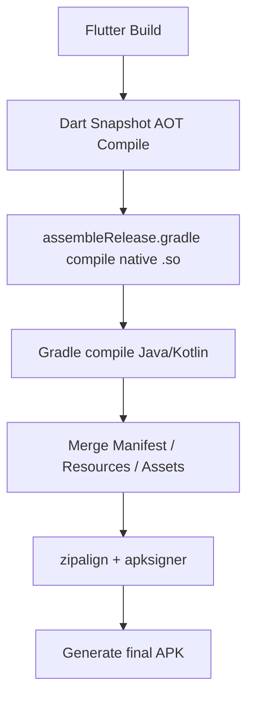

##### 25.4.6、如何加快[**Flutter**](https://flutter.dev/).[**Android**](https://www.android.com/)的打包速度？ <a href="#前言" style="font-size:17px; color:green;"><b>🔼</b></a> <a href="#🔚" style="font-size:17px; color:green;"><b>🔽</b></a>

| 优化方式                                            | 操作说明                                                     |
| --------------------------------------------------- | ------------------------------------------------------------ |
| ✅ 启用  [**Gradle**](https://gradle.org/) 缓存      | 使用 `--build-cache`，避免重复编译                           |
| ✅ **使用增量编译（debug）**                         | 日常开发尽量用 `flutter run` 或 `--debug`                    |
| ✅ 开启 [**Gradle**](https://gradle.org/) **daemon** | `~/.gradle/gradle.properties` 中加：`org.gradle.daemon=true` |
| ✅ **本地依赖缓存**                                  | 配置 [**Gradle**](https://gradle.org/) 离线模式、镜像源（例如阿里云） |
| ✅ **避免清除 build/ 太频繁**                        | 不要经常执行 `flutter clean`，除非必须                       |
| ✅ **使用 SSD 或清理磁盘空间**                       | 避免因 I/O 性能影响构建速度                                  |
| ✅ **设置构建线程数**                                | [**Gradle**](https://gradle.org/) 中设置：`org.gradle.parallel=true` |
| ✅ [**Flutter**](https://flutter.dev/) **版本更新**  | 新版本通常对构建性能有优化                                   |

##### 25.4.7、🪖<font color=red>**构建指令**</font>：`flutter build apk` <a href="#前言" style="font-size:17px; color:green;"><b>🔼</b></a> <a href="#🔚" style="font-size:17px; color:green;"><b>🔽</b></a>

| 模式      | 命令                                                   | 简称说明             |
| --------- | ------------------------------------------------------ | -------------------- |
| `debug`   | `flutter build apk --debug --verbose` 或 `flutter run` | 开发调试用，功能全   |
| `release` | `flutter build apk --release --verbose`                | 发布用，高性能最小包 |

* 构建参数的差异：**`debug`** 🆚 **`release`**

  * **`flutter run`** 默认是 **debug**
  * **`flutter build apk`**默认是**`release`**，其他模式要显式写出来。**`release`** 会走更严格的资源校验/压缩/签名流程；**`debug`** 不会
  * 能**`flutter build apk --debug`**但是不能**`flutter build apk --release`**是常见的。两者不是同一条流水线

* **`flutter build apk`** 等价于👇

  ```shell
  cd /path/to/flutter_project/build/app/.android
  
  ./gradlew \
    -I /path/to/flutter/bin/cache/artifacts/engine/android-arm-release/flutter.gradle \
    -Ptarget=/path/to/flutter_project/lib/main.dart \
    -Ptarget-platform=android-arm,android-arm64 \
    -Pdart-defines= \
    -Pdart-obfuscation=false \
    -Ptrack-widget-creation=true \
    -Ptree-shake-icons=false \
    -Psplit-debug-info= \
    assembleRelease
  ```

  | 参数                      | 含义                                            |
  | ------------------------- | ----------------------------------------------- |
  | `-I flutter.gradle`       | 插入 Flutter 初始化脚本（来自 Flutter SDK）     |
  | `-Ptarget=xxx`            | 要构建的 Dart 入口文件路径                      |
  | `-Ptarget-platform=xxx`   | 目标平台，通常是 `android-arm`、`android-arm64` |
  | `-Pdart-defines`          | 编译期定义，例如 `flutter.env=prod` 等          |
  | `-Pdart-obfuscation`      | 是否混淆 Dart 代码                              |
  | `-Ptrack-widget-creation` | 是否启用 widget 追踪（影响 DevTools）           |
  | `-Ptree-shake-icons`      | 是否移除未使用的图标资源                        |
  | `-Psplit-debug-info`      | 是否分离调试信息                                |
  | `assembleRelease`         | 构建 release 产物，最终生成 `app-release.apk`   |

##### 25.4.8、⚙️ 相关配置 <a href="#前言" style="font-size:17px; color:green;"><b>🔼</b></a> <a href="#🔚" style="font-size:17px; color:green;"><b>🔽</b></a>

* [**Flutter**](https://flutter.dev/).[**Android**](https://www.android.com/)打包需要涉及到**Java**环境推荐使用[<font color=red>**openJDK**</font>](https://openjdk.org/)

* <font color=red>为了不污染系统的开发环境，推荐用 [**Homebrew**](https://brew.sh/)➕[**jenv**](https://formulae.brew.sh/formula/jenv) 的形式。每个项目单独配置一个独属的**Java**环境</font>

  * 铆定的[**Java**](https://www.java.com/zh-CN/)版本号📝记录于[**Flutter**](https://flutter.dev/)项目根目录下的：`.java-version`

* **`targetSdk`** 🆚 **`minSdk`** 🆚 **`compileSdk`**

  | 项目         | 作用时间点 | 决定了什么                                 | 影响范围                                                     |
  | ------------ | ---------- | ------------------------------------------ | ------------------------------------------------------------ |
  | `targetSdk`  | 运行时     | 系统判断你是否适配该系统的新行为（兼容性） | 影响行为变更 +  [**Play**](https://play.google.com/)  审核要求 |
  | `compileSdk` | 编译时     | 你能用的 API 上限                          | 限制代码编写 +  <a href="#AGP" style="font-size:17px; color:green;"><b>**AGP**</b></a> 要求 |
  | `minSdk`     | 安装时     | **App** 最低可运行系统版本                 | 影响能否安装，越低设备越多                                   |

  * **`compileSdk`**

    > [**Android**](https://www.android.com/) 构建系统中的一个配置项，用于指定 编译时所使用的 [**Android**](https://www.android.com/).SDK 版本
    >
    > 1️⃣ **编译时 API 限制**：决定你在代码中能使用的 [**Android**](https://www.android.com/).API 上限（只能用 ≤ `compileSdk` 的 **API**）。
    >
    > 2️⃣ **不影响运行系统版本**：它不会影响 App 能运行在哪些 [**Android**](https://www.android.com/) 系统版本上，运行范围由 `minSdk` 和 `targetSdk` 控制。
    >
    > 3️⃣ **影响构建工具版本要求**：`compileSdk` 越高，所需的 <a href="#AGP" style="font-size:17px; color:green;"><b>**AGP**</b></a> 版本也必须越高，否则无法编译。

    ```groovy
    android {
      compileSdk = 34 /// 使用 Android SDK 34 来编译这个项目
    }
    ```

  * **`minSdk`**（最小支持版本）

    * 决定最低可安装系统版本：**App** 只能安装在 ≥ `minSdk` 的 **Android** 系统上，低于这个版本无法安装；
    * 影响兼容性：设置得越低，支持的设备越多；但也限制你使用某些新 API（必须兼容旧版本）；
    * 必须兼容旧系统：你需要对低版本系统做兼容处理，否则 **App** 会在运行时报错。

  * **`targetSdk`**（目标优化版本）

      * 告诉系统你为哪个版本做了适配：[**Android**](https://www.android.com/)  会根据 `targetSdk` 启用/禁用某些行为变更；

      * 不限制可安装系统版本：**App** 仍然可以安装在更高版本系统上，但系统会以 `targetSdk` 为基准判断兼容性；

      * 与  [**Google Play**](https://play.google.com/)  要求强相关：发布到  [**Play**](https://play.google.com/)  商店必须满足其最新的 `targetSdk` 要求，否则无法上线。


* [**Flutter**](https://flutter.dev/).[**Android**](https://www.android.com/)项目在首次构建或执行 `flutter clean` 后会重新下载👇

  | 资源                                                         | 说明                                                         |
  | ------------------------------------------------------------ | ------------------------------------------------------------ |
  | [**Gradle Wrapper**](https://docs.gradle.org/current/userguide/gradle_wrapper.html) 和插件 | 如 `gradle-7.5-all.zip`、`com.android.tools.build:gradle`    |
  | [**Kotlin**](https://kotlinlang.org/)插件                    | 如 `org.jetbrains.kotlin:kotlin-gradle-plugin`               |
  | 支持库                                                       | 各种 `androidx.*`、`support.*` 等库                          |
  | 第三方依赖                                                   | 来自 [**pub.dev**](https://pub.dev/) 的插件中声明的 AAR/JAR，如 [`image_gallery_saver`](https://pub.dev/packages/image_gallery_saver)、[`engagelab`](https://pub.dev/packages?q=engagelab) |
  | [**Google Maven**](https://maven.google.com/web/index.html) / [**JCenter**](https://mvnrepository.com/repos/jcenter) / [**MavenCentral**](https://central.sonatype.com/) | 默认构建源，国内访问会慢                                     |

##### 25.4.9、📦 [**Flutter**](https://flutter.dev/).[**Android**](https://www.android.com/) [打包脚本（MacOS）](https://github.com/JobsKit/JobsCommand-Flutter/blob/main/%E3%80%90MacOS%E3%80%91%F0%9F%93%A6%E5%8F%8C%E5%87%BB%E6%89%93%E5%8C%85Flutter.Android.command) <a href="#前言" style="font-size:17px; color:green;"><b>🔼</b></a> <a href="#🔚" style="font-size:17px; color:green;"><b>🔽</b></a>

><font color=red>**阻碍打包进程的几个关键点**</font>
>
>* [**Flutter**](https://flutter.dev/)版本号是否对齐
>* [**Android**](https://www.android.com/)所需的Java版本号是否对齐
>* 需要在`Flutter项目根目录/plugins/htprotect`下运行`flutter pub get`

<details>
<summary>点击展开代码</summary>

```dart
#!/bin/zsh

# ✅ 日志与输出函数
SCRIPT_BASENAME=$(basename "$0" | sed 's/\.[^.]*$//')   # 当前脚本名（去掉扩展名）
LOG_FILE="/tmp/${SCRIPT_BASENAME}.log"                  # 设置对应的日志文件路径

log()            { echo -e "$1" | tee -a "$LOG_FILE"; }
color_echo()     { log "\033[1;32m$1\033[0m"; }         # ✅ 正常绿色输出
info_echo()      { log "\033[1;34mℹ $1\033[0m"; }       # ℹ 信息
success_echo()   { log "\033[1;32m✔ $1\033[0m"; }       # ✔ 成功
warn_echo()      { log "\033[1;33m⚠ $1\033[0m"; }       # ⚠ 警告
warm_echo()      { log "\033[1;33m$1\033[0m"; }         # 🟡 温馨提示（无图标）
note_echo()      { log "\033[1;35m➤ $1\033[0m"; }       # ➤ 说明
error_echo()     { log "\033[1;31m✖ $1\033[0m"; }       # ✖ 错误
err_echo()       { log "\033[1;31m$1\033[0m"; }         # 🔴 错误纯文本
debug_echo()     { log "\033[1;35m🐞 $1\033[0m"; }      # 🐞 调试
highlight_echo() { log "\033[1;36m🔹 $1\033[0m"; }      # 🔹 高亮
gray_echo()      { log "\033[0;90m$1\033[0m"; }         # ⚫ 次要信息
bold_echo()      { log "\033[1m$1\033[0m"; }            # 📝 加粗
underline_echo() { log "\033[4m$1\033[0m"; }            # 🔗 下划线

# ✅ 自述信息
show_intro() {
  clear
  color_echo "🛠️ Flutter Android 打包脚本（支持 FVM / fzf / flavor / JDK 选择）"
  echo ""
  note_echo "📌 功能说明："
  note_echo "1️⃣ 自动识别当前 Flutter 项目路径（或拖入路径）"
  note_echo "2️⃣ 自动检测是否使用 FVM，并用 fvm flutter 构建"
  note_echo "3️⃣ 支持选择构建类型（仅 APK、仅 AAB、同时构建）"
  note_echo "4️⃣ 支持 flavor 参数和构建模式（release/debug/profile）"
  note_echo "5️⃣ 自动检测并配置 Java（openjdk），可选择版本"
  note_echo "6️⃣ 自动记忆上次使用的 JDK（保存在 .java-version）"
  note_echo "7️⃣ 构建前输出 📦 JDK / 📦 Gradle / 📦 AGP 三个版本信息"
  note_echo "8️⃣ 构建后自动打开输出产物目录"
  note_echo "9️⃣ 所有命令均统一交互：回车 = 执行，任意键 + 回车 = 跳过"
  note_echo "🔟 构建日志自动保存到 /tmp/flutter_build_log.txt"
  echo ""
  warm_echo "➤ 回车 = 执行默认 / 任意键 + 回车 = 跳过（统一交互）"
  echo ""
  read "?📎 按回车开始："
}

# ✅ 初始化路径与工具
init_environment() {
  cd "$(cd "$(dirname "$0")" && pwd -P)" || exit 1

  # 添加 sdkmanager 路径
  export PATH="/opt/homebrew/share/android-commandlinetools/cmdline-tools/latest/bin:$PATH"

  # jenv 初始化
  if [[ -d "$HOME/.jenv" ]]; then
    export PATH="$HOME/.jenv/bin:$PATH"
    eval "$(jenv init -)"
  fi
}

# ✅ 单行写文件（避免重复写入）
inject_shellenv_block() {
    local id="$1"           # 参数1：环境变量块 ID，如 "homebrew_env"
    local shellenv="$2"     # 参数2：实际要写入的 shellenv 内容，如 'eval "$(/opt/homebrew/bin/brew shellenv)"'
    local header="# >>> ${id} 环境变量 >>>"  # 自动生成注释头

    # 参数校验
    if [[ -z "$id" || -z "$shellenv" ]]; then
    error_echo "❌ 缺少参数：inject_shellenv_block <id> <shellenv>"
    return 1
    fi

    # 若用户未选择该 ID，则跳过写入
    if [[ ! " ${selected_envs[*]} " =~ " $id " ]]; then
    warn_echo "⏭️ 用户未选择写入环境：$id，跳过"
    return 0
    fi

    # 避免重复写入
    if grep -Fq "$header" "$PROFILE_FILE"; then
      info_echo "📌 已存在 header：$header"
    elif grep -Fq "$shellenv" "$PROFILE_FILE"; then
      info_echo "📌 已存在 shellenv：$shellenv"
    else
      echo "" >> "$PROFILE_FILE"
      echo "$header" >> "$PROFILE_FILE"
      echo "$shellenv" >> "$PROFILE_FILE"
      success_echo "✅ 已写入：$header"
    fi

    # 当前 shell 生效
    eval "$shellenv"
    success_echo "🟢 shellenv 已在当前终端生效"
}
 
# ✅ 判断芯片架构（ ARM64 / x86_64）
get_cpu_arch() {
  [[ $(uname -m) == "arm64" ]] && echo "arm64" || echo "x86_64"
}

# ✅ 自检 Homebrew
install_homebrew() {
  local arch="$(get_cpu_arch)"                   # 获取当前架构（arm64 或 x86_64）
  local shell_path="${SHELL##*/}"                # 获取当前 shell 名称（如 zsh、bash）
  local profile_file=""
  local brew_bin=""
  local shellenv_cmd=""

  if ! command -v brew &>/dev/null; then
    warn_echo "🧩 未检测到 Homebrew，正在安装中...（架构：$arch）"

    if [[ "$arch" == "arm64" ]]; then
      # Apple Silicon 原生 Homebrew（/opt/homebrew）
      /bin/bash -c "$(curl -fsSL https://raw.githubusercontent.com/Homebrew/install/HEAD/install.sh)" || {
        error_echo "❌ Homebrew 安装失败（arm64）"
        exit 1
      }
      brew_bin="/opt/homebrew/bin/brew"
    else
      # Intel 或在 Apple Silicon 下装一份 Intel 版 Homebrew（需要 Rosetta）
      arch -x86_64 /bin/bash -c "$(curl -fsSL https://raw.githubusercontent.com/Homebrew/install/HEAD/install.sh)" || {
        error_echo "❌ Homebrew 安装失败（x86_64）"
        exit 1
      }
      brew_bin="/usr/local/bin/brew"
    fi

    success_echo "✅ Homebrew 安装成功"

    # ==== 注入 shellenv 到对应配置文件（自动生效） ====
    shellenv_cmd="eval \"\$(${brew_bin} shellenv)\""
    case "$shell_path" in
      zsh)   profile_file="$HOME/.zprofile" ;;
      bash)  profile_file="$HOME/.bash_profile" ;;
      *)     profile_file="$HOME/.profile" ;;
    esac
    inject_shellenv_block "$profile_file" "$shellenv_cmd"

    # 立刻对当前会话生效（不等重开终端）
    eval "$(${brew_bin} shellenv)"

  else
    info_echo "🔄 Homebrew 已安装。是否执行更新？"
    echo "➤ 按 [Enter] 继续：将依次执行  brew update && brew upgrade && brew cleanup && brew doctor && brew -v"
    echo "➤ 输入任意字符后回车：跳过更新"
    # 仅当“直接回车”时继续；其他输入一律跳过
    local confirm
    IFS= read -r confirm
    if [[ -z "$confirm" ]]; then
      info_echo "⏳ 正在更新 Homebrew..."
      # 分步执行，任一步失败立即报错退出，方便定位
      brew update       || { error_echo "❌ brew update 失败"; return 1; }
      brew upgrade      || { error_echo "❌ brew upgrade 失败"; return 1; }
      brew cleanup      || { error_echo "❌ brew cleanup 失败"; return 1; }
      brew doctor       || { warn_echo  "⚠️  brew doctor 有警告/错误，请按提示处理"; }
      brew -v           || { warn_echo  "⚠️  打印 brew 版本失败（可忽略）"; }
      success_echo "✅ Homebrew 已更新"
    else
      note_echo "⏭️ 已选择跳过 Homebrew 更新"
    fi
  fi
}

# ✅ 自检 Homebrew.fzf
install_fzf() {
  if ! command -v fzf &>/dev/null; then
    note_echo "📦 未检测到 fzf，正在通过 Homebrew 安装..."
    brew install fzf || { error_echo "❌ fzf 安装失败"; exit 1; }
    success_echo "✅ fzf 安装成功"
  else
    info_echo "🔄 fzf 已安装。是否执行升级？"
    echo "➤ 按 [Enter] 继续：将依次执行  brew upgrade fzf && brew cleanup"
    echo "➤ 输入任意字符后回车：跳过升级"

    local confirm
    IFS= read -r confirm
    if [[ -z "$confirm" ]]; then
      info_echo "⏳ 正在升级 fzf..."
      brew upgrade fzf       || { error_echo "❌ fzf 升级失败"; return 1; }
      brew cleanup           || { warn_echo  "⚠️  brew cleanup 执行时有警告"; }
      success_echo "✅ fzf 已升级到最新版本"
    else
      note_echo "⏭️ 已选择跳过 fzf 升级"
    fi
  fi
}

# ✅ 转换路径为绝对路径
_abs_path() {
  local p="$1"
  [[ -z "$p" ]] && return 1
  p="${p//\"/}"                                                         # ✅ 移除双引号，防止参数传递误差
  [[ "$p" != "/" ]] && p="${p%/}"                                                               # ✅ 去除末尾斜杠，标准化路径形式

  if [[ -d "$p" ]]; then
    (cd "$p" 2>/dev/null && pwd -P)                                     # ✅ 子 shell，避免污染当前目录
  elif [[ -f "$p" ]]; then
    (cd "${p:h}" 2>/dev/null && printf "%s/%s\n" "$(pwd -P)" "${p:t}")  # ✅ 精准拼接
  else
    return 1
  fi
}

# ✅ 是否为 Flutter 项目的根目录
_is_flutter_project_root() {
  debug_echo "🔎 判断目录：$1"
  debug_echo "📄 pubspec.yaml 是否存在：$(ls -l "$1/pubspec.yaml" 2>/dev/null || echo ❌)"
  debug_echo "📁 lib 目录是否存在：$(ls -ld "$1/lib" 2>/dev/null || echo ❌)"
  [[ -f "$1/pubspec.yaml" && -d "$1/lib" ]]
}

# ✅ Flutter 项目路径识别（回车默认用脚本目录）
resolve_flutter_root() {

  script_dir="$(cd "$(dirname "${BASH_SOURCE[0]:-${(%):-%x}}")" && pwd)"
  debug_echo "🔍 脚本目录：$script_dir"

  if _is_flutter_project_root "$script_dir"; then
    flutter_root="$script_dir"
    cd "$flutter_root"
    highlight_echo "📌 使用脚本所在目录作为 Flutter 项目根目录"
    return
  fi

  if _is_flutter_project_root "$script_dir"; then
    flutter_root="$script_dir"
    cd "$flutter_root"
    highlight_echo "📌 使用当前工作目录作为 Flutter 项目根目录"
    return
  fi

  while true; do
    warn_echo "📂 请拖入 Flutter 项目根目录（包含 pubspec.yaml 和 lib/）："
    read -r input_path
    input_path="${input_path//\"/}"
    input_path=$(echo "$input_path" | xargs)

    # ✅ 如果用户什么都不输入，就使用脚本所在目录
    if [[ -z "$input_path" ]]; then
      input_path="$script_dir"
      info_echo "📎 未输入路径，默认使用脚本目录：$input_path"
    fi

    local abs=$(_abs_path "$input_path")
    debug_echo "🧪 用户输入路径解析为：$abs"

    if _is_flutter_project_root "$abs"; then
      flutter_root="$abs"
      cd "$flutter_root"
      success_echo "✅ 识别成功：$flutter_root"
      return
    fi
    error_echo "❌ 无效路径：$abs，请重试"
  done
}

# ✅  构建参数选择
select_build_target() {
  warn_echo "📦 请选择构建类型："
  local options=("只构建 APK" "只构建 AAB" "同时构建 APK 和 AAB")
  local selected=$(printf '%s\n' "${options[@]}" | fzf)
  case "$selected" in
    "只构建 APK") build_target="apk" ;;
    "只构建 AAB") build_target="appbundle" ;;
    "同时构建 APK 和 AAB") build_target="all" ;;
    *) build_target="apk" ;;
  esac
  success_echo "✅ 构建类型：$selected"
}
  
# ✅ 选择 flavor 和构建模式（release/debug/profile）
prompt_flavor_and_mode() {
  read "flavor_name?📎 请输入 flavor（可留空）: "
  local modes=("release" "debug" "profile")
  warn_echo "⚙️ 请选择构建模式："
  build_mode=$(printf '%s\n' "${modes[@]}" | fzf)
  success_echo "✅ 模式：$build_mode"
  [[ -n "$flavor_name" ]] && success_echo "✅ 使用 flavor：$flavor_name" || info_echo "📎 未指定 flavor"
}

# ✅ FVM 检测与 Flutter 命令
detect_flutter_command() {
  if command -v fvm >/dev/null && [[ -f "$flutter_root/.fvm/fvm_config.json" ]]; then
    flutter_cmd=("fvm" "flutter")
    warn_echo "🧩 检测到 FVM：使用 fvm flutter"
  else
    flutter_cmd=("flutter")
    info_echo "📦 使用系统 flutter"
  fi
}

# ✅ Java 环境配置
fix_jenv_java_version() {
  local jdk_path="/opt/homebrew/opt/openjdk@17"
  if command -v jenv >/dev/null 2>&1 && [[ -d "$jdk_path" ]]; then
    if ! jenv versions --bare | grep -q "^17"; then
      warn_echo "📦 openjdk@17 未注册到 jenv，尝试添加..."
      jenv add "$jdk_path"
    fi
  fi
}
# ✅ 配置 Java 环境（支持记忆）
configure_java_env() {
  local record_file="$flutter_root/.java-version"
  local selected=""
  local last_used=""
  [[ -f "$record_file" ]] && last_used=$(cat "$record_file")

  local available_versions=$(brew search openjdk@ | grep -E '^openjdk@\d+$' | sort -Vr)
  if [[ -z "$available_versions" ]]; then
    error_echo "❌ 未找到可用的 openjdk"
    exit 1
  fi

  if [[ -n "$last_used" && "$available_versions" == *"$last_used"* ]]; then
    success_echo "📦 上次使用的 JDK：$last_used"
    read "?➤ 是否继续使用？回车=是 / 任意键+回车=重新选择: "
    [[ -z "$REPLY" ]] && selected="$last_used"
  fi

  if [[ -z "$selected" ]]; then
    selected=$(echo "$available_versions" | fzf --prompt="☑️ 选择 openjdk 版本：" --height=40%)
    [[ -z "$selected" ]] && error_echo "❌ 未选择 JDK" && exit 1
  fi

  local version_number="${selected#*@}"
  brew list --formula | grep -q "^$selected$" || brew install "$selected"
  sudo ln -sfn "/opt/homebrew/opt/$selected/libexec/openjdk.jdk" "/Library/Java/JavaVirtualMachines/${selected}.jdk" 2>/dev/null
  export JAVA_HOME=$(/usr/libexec/java_home -v"$version_number")
  export PATH="$JAVA_HOME/bin:$PATH"
  echo "$selected" > "$record_file"
  success_echo "✅ JAVA_HOME 已设置为：$JAVA_HOME"
}

# ✅ 打印 AGP 版本
print_agp_version() {
  local build_file=""
  local agp_version=""

  # 优先检查 build.gradle.kts
  if [[ -f android/build.gradle.kts ]]; then
    build_file="android/build.gradle.kts"
    agp_version=$(grep -Eo 'com\.android\.tools\.build:gradle:\S+' "$build_file" | cut -d: -f3 | tr -d '"' | head -n1)
  elif [[ -f android/build.gradle ]]; then
    build_file="android/build.gradle"
    agp_version=$(grep -E "^classpath\s+['\"]com\.android\.tools\.build:gradle:\S+['\"]" "$build_file" | sed -E "s/.*:gradle:([^'\"]+).*/\1/" | head -n1)
  fi

  if [[ -n "$agp_version" ]]; then
    success_echo "✔ 检测到 AGP 版本：$agp_version（来源：$build_file）"
  else
    warn_echo "⚠️ 未在 build.gradle 中检测到 AGP 版本"
  fi
}

# ✅ 构建信息打印
print_agp_version() {
  local agp_version=""
  if [[ -f android/settings.gradle ]]; then
    agp_version=$(grep -oE "com\\.android\\.application['\"]?\\s+version\\s+['\"]?[0-9.]+" android/settings.gradle |
      head -n1 |
      grep -oE "[0-9]+\\.[0-9]+(\\.[0-9]+)?")
  fi
  if [[ -z "$agp_version" && -f android/build.gradle ]]; then
    agp_version=$(grep -oE "com\\.android\\.tools\\.build:gradle:[0-9.]+" android/build.gradle |
      head -n1 |
      cut -d: -f3)
  fi
  [[ -n "$agp_version" ]] && success_echo "📦 当前使用 AGP 版本：$agp_version" || warn_echo "📦 未检测到 AGP 版本"
}

print_sdk_versions() {
  local file=""
  for file in android/app/build.gradle android/app/build.gradle.kts; do
    [[ -f "$file" ]] || continue
    local compile_sdk=$(grep -E "compileSdk\s*[:=]\s*['\"]?[0-9]+['\"]?" "$file" | head -n1 | grep -oE "[0-9]+")
    local target_sdk=$(grep -E "targetSdk\s*[:=]\s*['\"]?[0-9]+['\"]?" "$file" | head -n1 | grep -oE "[0-9]+")
    local min_sdk=$(grep -E "minSdk\s*[:=]\s*['\"]?[0-9]+['\"]?" "$file" | head -n1 | grep -oE "[0-9]+")
    [[ -n "$compile_sdk" ]] && info_echo "compileSdk：$compile_sdk" || warn_echo "未检测到 compileSdk"
    [[ -n "$target_sdk" ]] && info_echo "targetSdk：$target_sdk" || warn_echo "未检测到 targetSdk"
    [[ -n "$min_sdk" ]] && info_echo "minSdk：$min_sdk" || warn_echo "未检测到 minSdk"
    break
  done
}

# ✅ 使用指定 JAVA_HOME 执行 Flutter 命令，确保构建环境一致
run_flutter_with_java() {
  JAVA_HOME="$JAVA_HOME" \
  PATH="$JAVA_HOME/bin:$PATH" \
  FVM_JAVA_HOME="$JAVA_HOME" \
  JAVA_TOOL_OPTIONS="" \
  env JAVA_HOME="$JAVA_HOME" PATH="$JAVA_HOME/bin:$PATH" "${flutter_cmd[@]}" "$@"
}

# ✅ 打开输出目录
open_output_folder() {
  local base="build/app/outputs"
  if [[ "$build_target" == "apk" || "$build_target" == "all" ]]; then
    open "$base/flutter-apk" 2>/dev/null
  fi
  if [[ "$build_target" == "appbundle" || "$build_target" == "all" ]]; then
    open "$base/bundle/$build_mode" 2>/dev/null
  fi
}

# ✅ 判断是否使用 FVM
_detect_flutter_cmd() {
  if command -v fvm >/dev/null 2>&1 && [[ -f ".fvm/fvm_config.json" ]]; then
    flutter_cmd=("fvm" "flutter")
    info_echo "🧩 检测到 FVM 项目，使用命令：fvm flutter"
  else
    flutter_cmd=("flutter")
    info_echo "📦 使用系统 Flutter 命令：flutter"
  fi
}

# ✅ 确认步骤函数
confirm_step() {
  local step="$1"
  read "REPLY?➤ 是否执行【$step】？回车=是 / 任意键+回车=跳过: "
  [[ -z "$REPLY" ]]
}

# ✅ 执行 flutter clean🧹 与 pub get
maybe_flutter_clean_and_get() {
  if confirm_step "flutter clean"; then
    "${flutter_cmd[@]}" clean
  fi

  if confirm_step "flutter pub get"; then
    "${flutter_cmd[@]}" pub get
  fi
}

# ✅ 在 Flutter 根目录下的 plugins/htprotect 执行 flutter pub get
ensure_htprotect_pub_get() {
  local plugin_dir="$flutter_root/plugins/htprotect"
  if [[ ! -d "$plugin_dir" ]]; then
    note_echo "⏭️ 未找到插件目录：$plugin_dir，跳过"
    return 0
  fi
  if [[ ! -f "$plugin_dir/pubspec.yaml" ]]; then
    warn_echo "⚠️ 插件目录存在，但缺少 pubspec.yaml：$plugin_dir，跳过"
    return 0
  fi

  if confirm_step "在 plugins/htprotect 执行 flutter pub get"; then
    pushd "$plugin_dir" >/dev/null || { error_echo "❌ 进入目录失败：$plugin_dir"; return 1; }
    # 继承当前 JAVA_HOME 与 flutter_cmd（支持 FVM）
    JAVA_HOME="$JAVA_HOME" PATH="$JAVA_HOME/bin:$PATH" "${flutter_cmd[@]}" pub get \
      && success_echo "✅ plugins/htprotect 依赖拉取完成" \
      || { error_echo "✖ plugins/htprotect pub get 失败"; popd >/dev/null; return 1; }
    popd >/dev/null
  else
    note_echo "⏭️ 已选择跳过 plugins/htprotect 的 pub get"
  fi
}

# ✅ 环境信息输出
print_env_diagnostics() {
  local log_file="/tmp/flutter_build_log.txt"
  rm -f "$log_file"
  local java_env_cmd=(env JAVA_HOME="$JAVA_HOME" PATH="$JAVA_HOME/bin:$PATH")

  {
    color_echo "🩺 运行 flutter doctor -v 检查环境..."
    "${flutter_cmd[@]}" doctor -v | tee -a "$log_file"
  }

  {
    color_echo "📦 当前使用 JDK 版本："
    java -version 2>&1 | tee -a "$log_file"
  }

  {
    info_echo "📦 当前使用 Gradle wrapper（./android/gradlew）版本："
    if [[ -x ./android/gradlew ]]; then
      ./android/gradlew -v | tee -a "$log_file"
    else
      warn_echo "❌ 未找到 gradlew 脚本"
    fi

    info_echo "📦 当前系统 gradle（可能已劫持）版本："
    if command -v gradle &>/dev/null; then
      gradle -v | tee -a "$log_file"
      info_echo "📦 gradle 路径：$(which gradle)" | tee -a "$log_file"
    else
      warn_echo "⚠️ 系统未安装 gradle"
    fi
  }

  {
    color_echo "📦 当前使用 AGP（Android Gradle Plugin）版本："
    print_agp_version | tee -a "$log_file"
  }

  {
    color_echo "📦 当前使用 sdkmanager 版本："
    sdkmanager --list > /dev/null 2>&1 && sdkmanager --version | tee -a "$log_file" || err_echo "❌ sdkmanager 执行失败"

    color_echo "📦 sdkmanager 来源路径："
    which sdkmanager | tee -a "$log_file"
  }

  {
    color_echo "📦 实际使用的 Android SDK 路径："
    "${flutter_cmd[@]}" config --machine | grep -o '"androidSdkPath":"[^"]*"' | cut -d':' -f2- | tr -d '"' | tee -a "$log_file"
  }

  {
    success_echo "🚀 构建命令：${flutter_cmd[*]} build $build_target ${flavor_name:+--flavor $flavor_name} --$build_mode"
    "${flutter_cmd[@]}" build $build_target ${flavor_name:+--flavor $flavor_name} --$build_mode | tee -a "$log_file"
  }
}

# ✅ 执行构建阶段
run_flutter_build() {
  local log_file="/tmp/flutter_build_log.txt"
  success_echo "🚀 开始构建：${flutter_cmd[*]} build $build_target ${flavor_name:+--flavor $flavor_name} --$build_mode"
  run_flutter_with_java build "$build_target" ${flavor_name:+--flavor "$flavor_name"} --"$build_mode" | tee -a "$log_file"
}

# ✅ 🚀 main 函数入口
main() {
    cd "$(cd "$(dirname "$0")" && pwd -P)"      # ✅ 切换到脚本目录
    show_intro                                  # ✅ 自述信息
    install_homebrew                            # ✅ 自检 Homebrew
    install_fzf                                 # ✅ 自检 Homebrew.fzf
    resolve_flutter_root                        # ✅ 获取 Flutter 根目录
    select_build_target                         # ✅ 选择 APK / AAB / All 构建类型
    prompt_flavor_and_mode                      # ✅ 选择 flavor 和构建模式（release/debug/profile）
    detect_flutter_command                      # ✅ 判断是否使用 FVM
    configure_java_env                          # ✅ 配置 Java 环境（支持记忆）
    
    print_env_diagnostics                       # ✅ 第一阶段：环境信息检查
    maybe_flutter_clean_and_get                 # ✅ 第二阶段：flutter clean 与 pub get
    ensure_htprotect_pub_get                    # ✅ 插件 htprotect 依赖拉取
    run_flutter_build                           # ✅ 第三阶段：执行构建
    
    open_output_folder                          # ✅ 打开构建产物目录
    success_echo "🎉 构建完成，日志保存在 /tmp/flutter_build_log.txt"
}

main "$@"

```
</details>

##### 25.4.10、打包成品  <a href="#前言" style="font-size:17px; color:green;"><b>🔼</b></a> <a href="#🔚" style="font-size:17px; color:green;"><b>🔽</b></a>

> [**Flutter**](https://flutter.dev/) 和 [**Gradle**](https://gradle.org/)  的构建系统默认会将最新产物**覆盖上一次的构建产物**


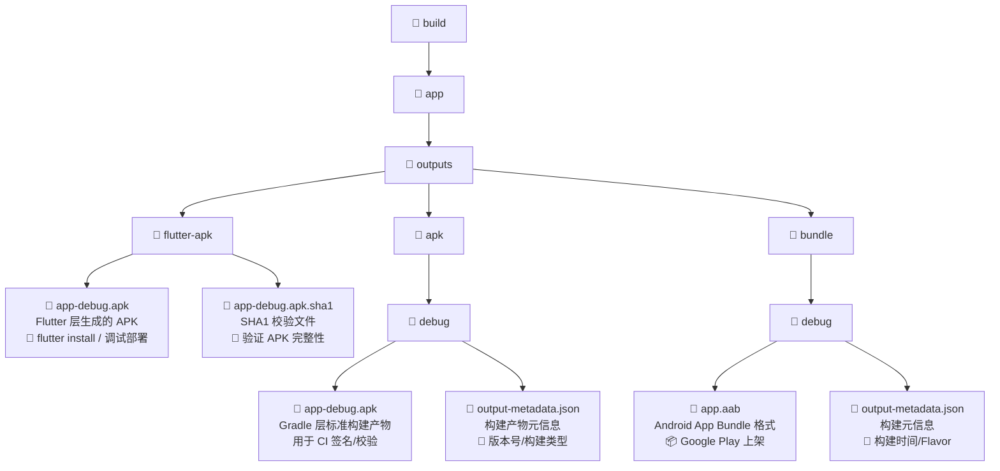

| 场景                                                | 应该使用                                                 |
| --------------------------------------------------- | -------------------------------------------------------- |
| 🔧 本地测试                                          | `flutter-apk/app-debug.apk` 或 `apk/debug/app-debug.apk` |
| 🚀 提测/发包                                         | `apk/release/app-release.apk`（需签名）                  |
| 🌐 上架  [**Google Play**](https://play.google.com/) | `bundle/release/app-release.aab`                         |

#### 25.5、📦 [**Flutter**](https://flutter.dev/).**iOS**（相对简单）<a href="#前言" style="font-size:17px; color:green;"><b>🔼</b></a> <a href="#🔚" style="font-size:17px; color:green;"><b>🔽</b></a>

##### 25.5.1、🪖<font color=red>**构建指令**</font>：`flutter build ios` 和 <font color=red>**`flutter build ipa`**</font> <a href="#前言" style="font-size:17px; color:green;"><b>🔼</b></a> <a href="#🔚" style="font-size:17px; color:green;"><b>🔽</b></a>

> **iOS** 项目主流是使用[**XCode**](https://developer.apple.com/xcode/) + [**XCode**](https://developer.apple.com/xcode/) **build system** 来进行构建

| 构建类型          | 构建命令                                                 | 说明                                                         |
| ----------------- | -------------------------------------------------------- | ------------------------------------------------------------ |
| **Debug** 构建    | `flutter build ios --debug`                              | 构建用于调试的 **iOS** 包（默认使用模拟器架构）              |
| **Profile** 构建  | `flutter build ios --profile`                            | 构建用于性能分析的中间态包                                   |
| **Release** 构建  | `flutter build ios --release`                            | 构建用于发布的 **iOS** 包（仅支持真机）                      |
| 构建 `.xcarchive` | `flutter build ipa --export-method app-store`            | 构建用于 App Store 提交的归档包（需配置 [**XCode**](https://developer.apple.com/xcode/) 导出选项） |
| 构建 `.ipa` 包    | <font color=red>**`flutter build ipa --release`**</font> | 自动使用 **Release** 模式归档并导出 `.ipa` 文件（默认导出方式为 development） |

| 参数名                   | 示例                                             | 说明                                     |
| ------------------------ | ------------------------------------------------ | ---------------------------------------- |
| `--flavor`               | `--flavor staging`                               | 构建指定 **flavor**（如多环境构建）      |
| `--export-options-plist` | `--export-options-plist=ios/ExportOptions.plist` | 指定导出 **ipa** 所需的 **plist**        |
| `--no-codesign`          | `flutter build ios --no-codesign`                | 构建时跳过签名，常用于 CI 环境或手动签名 |

##### 25.5.2、📁生成的包目录  <a href="#前言" style="font-size:17px; color:green;"><b>🔼</b></a> <a href="#🔚" style="font-size:17px; color:green;"><b>🔽</b></a>

> 虽然[**Flutter**](https://flutter.dev/)构建**iOS**的`.ipa`包最终还是调用**Xcode**的内部组件，<font color=red>但是生成的`.ipa`包的物理位置，与**Xcode**打正常的**iOS**原生`.ipa`是不同的</font>

* 原生**iOS**构建生成的`*.ipa` 包路径➤**`$HOME/Library/Developer/Xcode/DerivedData/具体的Xcode.iOS项目名/Build/Products/Debug-iphoneos/*.app`**

```Mermaid
graph TD
    A[📁 $HOME/Library/Developer/Xcode/DerivedData] --> B[📁 具体的Xcode.iOS项目名]
    B --> C[📁 Build]
    C --> D[📁 Products]
    D --> E[📁 Debug-iphoneos]
    E --> F[📄 *.app<br/>真机调试用 App 包<br/>📱 Debug 模式生成]
    F --> F1[📄 Info.plist<br/>应用配置]
    F --> F2[📄 Assets.car<br/>图片与资源]
    F --> F3[📄 Frameworks/<br/>依赖库目录]
    F --> F4[📄 PkgInfo<br/>包信息]
    F --> F5[📄 Embedded.mobileprovision<br/>签名配置]
```

* [**Flutter**](https://flutter.dev/)构建生成的`*.ipa` 包路径➤ **`Flutter项目根目录/build/ios/ipa/*.app`**

```Mermaid
graph TD
    A[📁 build] --> B[📁 ios]
    %% iphoneos
    B --> C[📁 iphoneos]
    C --> C1[📄 Runner.app<br/>真机用的 App 包<br/>📱 Release 模式生成]
    C --> C2[📄 App.framework<br/>Dart 编译后的核心二进制<br/>💡 AOT]
    %% simulator
    B --> D[📁 simulator]
    D --> D1[📄 Runner.app<br/>模拟器用 App<br/>🖥️ Debug 默认产物]
    %% archive
    B --> E[📁 archive]
    E --> E1[📁 Runner.xcarchive<br/>归档产物<br/>📦 导出 ipa 或上传 TestFlight]
    %% ipa
    B --> F[📁 ipa]
    F --> F1[📄 Runner.ipa<br/>实际可安装的 iOS 安装包<br/>📲 flutter build ipa]
    F --> F2[📄 ExportOptions.plist<br/>导出配置文件<br/>📝 控制签名/上传方式]
```

##### 25.5.3、📦 打包脚本 <a href="#前言" style="font-size:17px; color:green;"><b>🔼</b></a> <a href="#🔚" style="font-size:17px; color:green;"><b>🔽</b></a>

```shell
#!/bin/zsh

# ✅ 全局变量
SCRIPT_DIR="$(cd "$(dirname "${BASH_SOURCE[0]:-${(%):-%x}}")" && pwd)"
IPA_OUTPUT_DIR="$SCRIPT_DIR/build/ios/ipa"

# Flutter 命令数组（支持 FVM）
flutter_cmd=("flutter")

# ✅ 🌈彩色输出函数
SCRIPT_BASENAME=$(basename "$0" | sed 's/\.[^.]*$//')   # 当前脚本名（去掉扩展名）
LOG_FILE="/tmp/${SCRIPT_BASENAME}.log"                  # 设置对应的日志文件路径

log()            { echo -e "$1" | tee -a "$LOG_FILE"; }
color_echo()     { log "\033[1;32m$1\033[0m"; }         # ✅ 正常绿色输出
info_echo()      { log "\033[1;34mℹ $1\033[0m"; }       # ℹ 信息
success_echo()   { log "\033[1;32m✔ $1\033[0m"; }       # ✔ 成功
warn_echo()      { log "\033[1;33m⚠ $1\033[0m"; }       # ⚠ 警告
warm_echo()      { log "\033[1;33m$1\033[0m"; }         # 🟡 温馨提示（无图标）
note_echo()      { log "\033[1;35m➤ $1\033[0m"; }       # ➤ 说明
error_echo()     { log "\033[1;31m✖ $1\033[0m"; }       # ✖ 错误
err_echo()       { log "\033[1;31m$1\033[0m"; }         # 🔴 错误纯文本
debug_echo()     { log "\033[1;35m🐞 $1\033[0m"; }      # 🐞 调试
highlight_echo() { log "\033[1;36m🔹 $1\033[0m"; }      # 🔹 高亮
gray_echo()      { log "\033[0;90m$1\033[0m"; }         # ⚫ 次要信息
bold_echo()      { log "\033[1m$1\033[0m"; }            # 📝 加粗
underline_echo() { log "\033[4m$1\033[0m"; }            # 🔗 下划线

# ✅ 自述信息 ==================================
print_self_intro() {
    bold_echo "🛠️ Flutter iOS 打包脚本"
    note_echo "功能说明："
    gray_echo  "  1️⃣ 检查 Xcode 与 CocoaPods 环境（自动安装缺失组件）"
    gray_echo  "  2️⃣ 调用 Flutter 构建 iOS Release 产物"
    gray_echo  "  3️⃣ 构建完成后自动打开 IPA 输出文件夹"
    gray_echo  "  4️⃣ 记录完整日志到：$LOG_FILE"

    note_echo "构建流程："
    gray_echo  "  📂 脚本目录      ：$SCRIPT_DIR"
    gray_echo  "  📦 构建产物目录  ：$SCRIPT_DIR/build/ios"
    gray_echo  "  📲 IPA 输出目录  ：$IPA_OUTPUT_DIR"
    gray_echo  "  📝 日志文件路径  ：$LOG_FILE"

    note_echo "注意事项："
    gray_echo  "  ⚠ 请提前在 Xcode 中配置好签名证书和 Provisioning Profile"
    gray_echo  "  ⚠ 如果需要生成 IPA，请使用 'flutter build ipa --release' 替换 build ios"

    echo ""
}

# ✅ 执行耗时
print_duration() {
  END_TIME=$(date +%s)
  DURATION=$((END_TIME - START_TIME))
  success_echo "⚙️ 脚本总耗时：${DURATION}s"
}

# ✅ 单行写文件（避免重复写入）
inject_shellenv_block() {
    local id="$1"           # 参数1：环境变量块 ID，如 "homebrew_env"
    local shellenv="$2"     # 参数2：实际要写入的 shellenv 内容，如 'eval "$(/opt/homebrew/bin/brew shellenv)"'
    local header="# >>> ${id} 环境变量 >>>"  # 自动生成注释头

    # 参数校验
    if [[ -z "$id" || -z "$shellenv" ]]; then
    error_echo "❌ 缺少参数：inject_shellenv_block <id> <shellenv>"
    return 1
    fi

    # 若用户未选择该 ID，则跳过写入
    if [[ ! " ${selected_envs[*]} " =~ " $id " ]]; then
    warn_echo "⏭️ 用户未选择写入环境：$id，跳过"
    return 0
    fi

    # 避免重复写入
    if grep -Fq "$header" "$PROFILE_FILE"; then
      info_echo "📌 已存在 header：$header"
    elif grep -Fq "$shellenv" "$PROFILE_FILE"; then
      info_echo "📌 已存在 shellenv：$shellenv"
    else
      echo "" >> "$PROFILE_FILE"
      echo "$header" >> "$PROFILE_FILE"
      echo "$shellenv" >> "$PROFILE_FILE"
      success_echo "✅ 已写入：$header"
    fi

    # 当前 shell 生效
    eval "$shellenv"
    success_echo "🟢 shellenv 已在当前终端生效"
}

# ✅ 判断芯片架构（`ARM64` / `x86_64`）
get_cpu_arch() {
  [[ $(uname -m) == "arm64" ]] && echo "arm64" || echo "x86_64"
}

# ✅ 自检安装 🍺Homebrew（自动架构判断，包含环境注入）
install_homebrew() {
  local arch="$(get_cpu_arch)"                   # 获取当前架构（arm64 或 x86_64）
  local shell_path="${SHELL##*/}"                # 获取当前 shell 名称（如 zsh、bash）
  local profile_file=""
  local brew_bin=""
  local shellenv_cmd=""

  if ! command -v brew &>/dev/null; then
    warn_echo "🧩 未检测到 Homebrew，正在安装中...（架构：$arch）"

    if [[ "$arch" == "arm64" ]]; then
      /bin/bash -c "$(curl -fsSL https://raw.githubusercontent.com/Homebrew/install/HEAD/install.sh)" || {
        error_echo "❌ Homebrew 安装失败（arm64）"
        exit 1
      }
      brew_bin="/opt/homebrew/bin/brew"
    else
      arch -x86_64 /bin/bash -c "$(curl -fsSL https://raw.githubusercontent.com/Homebrew/install/HEAD/install.sh)" || {
        error_echo "❌ Homebrew 安装失败（x86_64）"
        exit 1
      }
      brew_bin="/usr/local/bin/brew"
    fi

    success_echo "✅ Homebrew 安装成功"

    # ==== 注入 shellenv 到对应配置文件（自动生效） ====
    shellenv_cmd="eval \"\$(${brew_bin} shellenv)\""

    case "$shell_path" in
      zsh)   profile_file="$HOME/.zprofile" ;;
      bash)  profile_file="$HOME/.bash_profile" ;;
      *)     profile_file="$HOME/.profile" ;;
    esac

    inject_shellenv_block "$profile_file" "$shellenv_cmd"

  else
    info_echo "🔄 Homebrew 已安装，正在更新..."
    brew update && brew upgrade && brew cleanup && brew doctor && brew -v
    success_echo "✅ Homebrew 已更新"
  fi
}

# ✅ 自检安装 🍺Homebrew.cocoapods
install_cocoapods() {
  if ! command -v pod &>/dev/null; then
    info_echo "📦 未检测到 CocoaPods，正在通过 Homebrew 安装..."
    brew install cocoapods || { error_echo "❌ CocoaPods 安装失败"; exit 1; }
    success_echo "✅ CocoaPods 安装成功"
  else
    info_echo "🔄 CocoaPods 已安装，升级中..."
    brew upgrade cocoapods && brew cleanup
    success_echo "✅ CocoaPods 已是最新版"
  fi

  # ✅ 打印版本并写入日志
  pod --version | tee -a "$LOG_FILE"
}

# ✅ 检查环境
check_env() {
    info_echo "检查环境..."
    if ! command -v xcodebuild &>/dev/null; then
        error_echo "未找到 Xcode，请安装后重试。"
        exit 1
    fi
    if ! command -v pod &>/dev/null; then
        error_echo "未找到 CocoaPods，请安装后重试。"
        install_homebrew  # ✅ 自检安装 🍺Homebrew（自动架构判断，包含环境注入）
        install_cocoapods # ✅ 自检安装 🍺Homebrew.cocoapods
        exit 1
    fi
    success_echo "环境检查通过 ✅"
}

# ✅ 构建 Flutter iOS 产物
flutter_build_ios() {
  cd "$SCRIPT_DIR" || {
      echo "❌ 无法进入脚本目录：$SCRIPT_DIR"
      exit 1
  }

  info_echo "开始构建 Flutter iOS Release 产物..."
  "${flutter_cmd[@]}" clean
  "${flutter_cmd[@]}" pub get
  "${flutter_cmd[@]}" build ipa --release
  success_echo "Flutter 构建完成 ✅"
}

# ✅ 打开 IPA 文件夹
open_output_dir() {
    info_echo "打开 IPA 文件夹..."
    open "$IPA_OUTPUT_DIR"
}

# ✅ 等待用户
wait_for_user_to_start() {
  echo ""
  read "?➤ 按下回车开始执行，或 Ctrl+C 取消..."
  echo ""
}

# ✅ 主函数
main() {
    print_self_intro                    # ✅ 自述信息
    wait_for_user_to_start              # ✅ 等待用户
    START_TIME=$(date +%s)
    check_env                           # ✅ 检查环境
    flutter_build_ios                   # ✅ 构建 Flutter iOS 产物
    open_output_dir                     # ✅ 打开 IPA 文件夹
    print_duration                      # ✅ 执行耗时
    success_echo "全部完成 🎉"
}

main "$@"
```

##### 25.5.4、⚠️注意事项  <a href="#前言" style="font-size:17px; color:green;"><b>🔼</b></a> <a href="#🔚" style="font-size:17px; color:green;"><b>🔽</b></a>

* 必须要有苹果的开发者账号（普通账户充值）

* 必须真机运行

* <font color=red>无法通过**[XCode](https://developer.apple.com/xcode/)**直接编译</font>[**Flutter**](https://flutter.dev/)<font color=red>项目</font>

  > 是因为其中的`Podfile`是通过[**Flutter**](https://flutter.dev/)进行唤起的，并非标准的**iOS** `Podfile` 文件格式
  >
  > ====================================================================
  >
  > [**Flutter**](https://flutter.dev/)**会控制 Pod 的安装和版本**，并写入：
  >
  > - `ios/Podfile`
  > - `ios/Podfile.lock`
  > - `.flutter-plugins`
  > - `.flutter-plugins-dependencies`
  >
  > 任何试图手动运行 `pod install` 而未执行 `flutter build ios`，都会缺少 `Flutter.framework` 和 Pod 配置，导致如下报错：`Could not find Flutter.framework or Flutter.podspec`

    <details>
    <summary>点击展开代码</summary>

    ```ruby
    # Uncomment this line to define a global platform for your project
    # platform :ios, '12.0'
  
    # CocoaPods analytics sends network stats synchronously affecting flutter build latency.
    ENV['COCOAPODS_DISABLE_STATS'] = 'true'
  
    project 'Runner', {
      'Debug' => :debug,
      'Profile' => :release,
      'Release' => :release,
    }
  
    def flutter_root
      generated_xcode_build_settings_path = File.expand_path(File.join('..', 'Flutter', 'Generated.xcconfig'), __FILE__)
      unless File.exist?(generated_xcode_build_settings_path)
        raise "#{generated_xcode_build_settings_path} must exist. If you're running pod install manually, make sure flutter pub get is executed first"
      end
  
      File.foreach(generated_xcode_build_settings_path) do |line|
        matches = line.match(/FLUTTER_ROOT\=(.*)/)
        return matches[1].strip if matches
      end
      raise "FLUTTER_ROOT not found in #{generated_xcode_build_settings_path}. Try deleting Generated.xcconfig, then run flutter pub get"
    end
  
    require File.expand_path(File.join('packages', 'flutter_tools', 'bin', 'podhelper'), flutter_root)
  
    flutter_ios_podfile_setup
  
    target 'Runner' do
      use_frameworks!
  
      flutter_install_all_ios_pods File.dirname(File.realpath(__FILE__))
      target 'RunnerTests' do
        inherit! :search_paths
      end
    end
  
    post_install do |installer|
      installer.pods_project.targets.each do |target|
        flutter_additional_ios_build_settings(target)
      end
    end
  
    ```
    </details>

### 26、[**颜色格式的转换**](https://github.com/JobsKit/JobsCommand-Flutter/blob/42822411fe3dba59a4c37e2c4abd3df9f11db289/%E3%80%90MacOS%E3%80%91%F0%9F%8C%9E%E9%A2%9C%E8%89%B2%E6%A0%BC%E5%BC%8F%E7%9A%84%E8%BD%AC%E6%8D%A2.command) <a href="#前言" style="font-size:17px; color:green;"><b>🔼</b></a> <a href="#🔚" style="font-size:17px; color:green;"><b>🔽</b></a>


```shell
#!/usr/bin/env bash
# ================================== 自述 ==================================
# 名称：万能颜色格式转换器（纯 Shell）
# 功能：在 #RRGGBB / #RRGGBBAA / rgb() / rgba() / 0xAARRGGBB 之间互转
# 输出：#RRGGBB、#RRGGBBAA、rgb()、rgba()、0xAARRGGBB
# 交互：
#   - 无参数 → 进入交互模式（可多次输入，q 退出）
#   - 有参数 → 逐个批量转换并输出
# 依赖：仅用系统自带 bash/zsh + awk/sed/printf（无第三方）
# =========================================================================

# ================================== 全局配置 ==================================
# 标题颜色: #D2D4DE (210,212,222)
TITLE_R=210; TITLE_G=212; TITLE_B=222
ESC=$'\033'
RESET="${ESC}[0m"
TITLE_FG_TRUECOLOR="${ESC}[38;2;${TITLE_R};${TITLE_G};${TITLE_B}m"
TITLE_FG_FALLBACK="${ESC}[37m"

supports_truecolor() {
  [[ "${COLORTERM:-}" == *truecolor* || "${COLORTERM:-}" == *24bit* ]]
}

TITLE_COLOR() {
  if supports_truecolor; then printf "%s" "$TITLE_FG_TRUECOLOR"; else printf "%s" "$TITLE_FG_FALLBACK"; fi
}

# ================================== 基础工具函数 ==================================
to_hex() { printf "%02X" "$1"; }
alpha_float_to_255() { awk 'BEGIN{v='"$1"'; if(v<0)v=0;if(v>1)v=1; printf("%d",(v*255)+0.5)}'; }
alpha_255_to_float() { awk 'BEGIN{printf("%.2f",'"$1"'/255)}'; }
sanitize_input() { echo "$1" | tr -d '[:space:]' | tr -d '"' | tr -d "'"; }
upper_hex() { echo "$1" | tr '[:lower:]' '[:upper:]'; }

# ================================== 解析输入为 RGBA =============================
# 输出（全局变量）：
#   r g b       : 0~255
#   a_float     : 0.00~1.00
#   aa_hex      : 两位十六进制 Alpha（关键：打印阶段直接用它，避免被二次换算）
parse_input() {
  local raw="$1" input
  input=$(sanitize_input "$raw")

  # 0xAARRGGBB
  if [[ "$input" =~ ^0x[0-9a-fA-F]{8}$ ]]; then
    local hex="${input:2}"; hex=$(upper_hex "$hex")
    local aa=${hex:0:2} rr=${hex:2:2} gg=${hex:4:2} bb=${hex:6:2}
    r=$((16#$rr)); g=$((16#$gg)); b=$((16#$bb))
    aa_hex="$aa"
    a_float=$(alpha_255_to_float $((16#$aa)))
    return 0
  fi

  # #RRGGBB / #RRGGBBAA
  if [[ "$input" =~ ^#[0-9a-fA-F]{6}([0-9a-fA-F]{2})?$ ]]; then
    local hex="${input:1}"; hex=$(upper_hex "$hex")
    local rr=${hex:0:2} gg=${hex:2:2} bb=${hex:4:2}
    r=$((16#$rr)); g=$((16#$gg)); b=$((16#$bb))
    if [[ ${#hex} -eq 8 ]]; then
      aa_hex=${hex:6:2}
      a_float=$(alpha_255_to_float $((16#$aa_hex)))
    else
      aa_hex="FF"          # ✅ 无透明度 → 默认不透明
      a_float="1.00"
    fi
    return 0
  fi

  # rgb(...) / rgba(...)
  if [[ "$input" =~ ^rgba?\( ]]; then
    local nums; nums=$(echo "$input" | sed -E 's/rgba?\(|\)//g')
    IFS=',' read -r R G B A <<<"$nums"
    r=${R%%.*}; g=${G%%.*}; b=${B%%.*}
    [[ -z "$A" ]] && A="1"
    a_float=$(awk 'BEGIN{printf("%.2f",'"$A"')}')
    local A255; A255=$(alpha_float_to_255 "$a_float")
    aa_hex=$(to_hex "$A255")  # ✅ 直接得到两位十六进制 Alpha
    return 0
  fi

  return 1
}

# ================================== 格式化输出 ==================================
format_and_print_all() {
  local RR=$(to_hex "$r") GG=$(to_hex "$g") BB=$(to_hex "$b")
  local AA="$aa_hex"   # ✅ 直接使用解析阶段给定的 AA，避免误差

  echo
  echo -e "${ESC}[1m输入：$user_input${RESET}"
  echo "----------------------------------------"
  echo "HEX（不透明）:  #${RR}${GG}${BB}"
  echo "HEX（含透明） :  #${RR}${GG}${BB}${AA}"
  echo "RGB           :  rgb(${r}, ${g}, ${b})"
  echo "RGBA          :  rgba(${r}, ${g}, ${b}, $(printf '%.2f' "$a_float"))"
  echo "0x 格式       :  0x${AA}${RR}${GG}${BB}"
  echo
}

# ================================== UI & 交互 ==================================
print_title() {
  local c="$(TITLE_COLOR)"
  echo -e "${c}================== 颜色格式转换器 ==================${RESET}"
  echo -e "${c}支持：#RRGGBB / #RRGGBBAA / rgb() / rgba() / 0xAARRGGBB${RESET}"
  echo -e "${c}标题使用颜色：#D2D4DE（210,212,222）${RESET}"
  echo
}

preface_and_wait() {
  print_title
  echo "自述："
  echo " - 纯 Shell 实现，不依赖第三方。"
  echo " - 输出包含 HEX、RGBA、以及 0xAARRGGBB（Flutter/Dart 常用）。"
  echo " - 无参进入交互模式，输入 q 退出。"
  echo
  printf "按回车开始执行..."
  IFS= read -r _
}

interactive_loop() {
  while true; do
    echo
    printf "请输入颜色值（q 退出）： "
    IFS= read -r user_input
    [[ -z "$user_input" ]] && continue
    [[ "$user_input" == [Qq] ]] && { echo "✅ 已退出"; break; }
    if parse_input "$user_input"; then
      format_and_print_all
    else
      echo "❌ 无法识别：$user_input"
      echo "示例：#D2D4DE、#D2D4DE80、rgb(210,212,222)、rgba(210,212,222,0.5)、0x80D2D4DE"
    fi
  done
}

convert_once() {
  user_input="$1"
  if parse_input "$user_input"; then
    format_and_print_all
  else
    echo "❌ 无法识别：$user_input"
  fi
}

# ================================== main ==================================
main() {
  preface_and_wait  # 显示自述并等待用户回车

  if [[ $# -ge 1 ]]; then
    # 传入 1 个或多个参数：逐个转换
    for user_input in "$@"; do
      convert_once "$user_input"
    done
  else
    # 无参数：进入交互模式
    interactive_loop
  fi
}

main "$@"
```

### 27、在 `child:` 中写条件判断 (`if`) <a href="#前言" style="font-size:17px; color:green;"><b>🔼</b></a> <a href="#🔚" style="font-size:17px; color:green;"><b>🔽</b></a>

> <font color=red>**不能直接写if，只能对接一个`Widget`**</font>

#### 27.1、方案一：三元运算符（最常用）<a href="#前言" style="font-size:17px; color:green;"><b>🔼</b></a> <a href="#🔚" style="font-size:17px; color:green;"><b>🔽</b></a>

```dart
Container(
 child: condition
   ? const Text("条件成立")
   : const SizedBox.shrink(), // 占位，什么也不显示
);
```

#### 27.2、方案二：使用 `Builder` 包裹 `if/else` <a href="#前言" style="font-size:17px; color:green;"><b>🔼</b></a> <a href="#🔚" style="font-size:17px; color:green;"><b>🔽</b></a>

> 适合逻辑复杂、需要 **return** 不同 `widget` 的情况。

```dart
Container(
 child: Builder(
  builder: (context) {
   if (condition) {
		return const Text("条件成立");
   } else {
    return const Icon(Icons.close);
   }
  },
 ),
);
```

#### 27.3、方案三：用 `children` 和集合展开（if 控制多个组件）<a href="#前言" style="font-size:17px; color:green;"><b>🔼</b></a> <a href="#🔚" style="font-size:17px; color:green;"><b>🔽</b></a>

> 当父组件是 `Column`、`Row`、`ListView` 等 **可接收多个 children** 的情况，可以直接写 `if`

```dart
Column(
 children: [
  const Text("固定部分"),
  if (condition) const Text("条件成立"),
  if (!condition) const Icon(Icons.close),
 ],
);
```

### 28、扩展运算符 <a href="#前言" style="font-size:17px; color:green;"><b>🔼</b></a> <a href="#🔚" style="font-size:17px; color:green;"><b>🔽</b></a>

> 会把一个 **List** 的元素逐个展开，放进父 **List**

```dart
children: [
  Text("A"),
  if (true) ...[Text("B"), Text("C")],
  Text("D"),
]

/// 等价于：
children: [
  Text("A"),
  Text("B"),
  Text("C"),
  Text("D"),
]
```

### 29、级联运算符 <a href="#前言" style="font-size:17px; color:green;"><b>🔼</b></a> <a href="#🔚" style="font-size:17px; color:green;"><b>🔽</b></a>

> 级联运算符适合的场景主要是：
>
> - 控制器类（`AnimationController`、`TextEditingController` 等）
> - 集合（List / Map / Set）做连续操作
> - 任何有 **方法** 或 **可修改属性** 的对象

```dart
final list = []
  ..add('A')
  ..add('B')
  ..add('C');

/// 等价于：
final list = [];
list.add('A');
list.add('B');
list.add('C');
```

### 30、`switch` <a href="#前言" style="font-size:17px; color:green;"><b>🔼</b></a> <a href="#🔚" style="font-size:17px; color:green;"><b>🔽</b></a>

* `switch` 表达式要求**穷尽匹配**。如果搭配万用类型**`dynamic`**则需要同时实现**兜底分支**

  ```dart
  TextStyle textStyleBy(dynamic ok) => switch (ok) {
        true => const TextStyle(
            color: Color(0xFFFF5A5A),
            fontSize: 12,
            fontWeight: FontWeight.w400,
          ),
        false => const TextStyle(
            color: Color(0xFF23D17F),
            fontSize: 12,
            fontWeight: FontWeight.w400,
          ),
        null => const TextStyle(
            color: Color(0xFFE6EBF2),
            fontSize: 12,
            fontWeight: FontWeight.w400,
          ),
        _ => const TextStyle(
            // 兜底：任何其他类型
            color: Color(0xFF9AA3B2),
            fontSize: 12,
            fontWeight: FontWeight.w400),
      };
  ```

### 31、<font color=blue>**Function**</font>（回调）的使用 <a href="#前言" style="font-size:17px; color:green;"><b>🔼</b></a> <a href="#🔚" style="font-size:17px; color:green;"><b>🔽</b></a>

* 定义

  > 1️⃣ 用 <font color=blue>**Function**</font> 定义这个回调的**入参**和**出参**
  >
  > 2️⃣ 这个<font color=blue>**Function**</font> 的形式，很长一串，略显臃肿，所以需要 <font color=red>**typedef **</font>来进行别名化处理。以后，就用此**别名**来替代如此冗长的定义部分

  ```dart
  // 定义一个回调类型，接受 int，返回 void
  typedef IntCallback = void Function(int value);
  ```

* 在函数里使用回调（**传入参数，即使用回调**）

  > 在高级语言中，这个回调可以被定义为可选性（可以为null）；但是，如果在低级语言中，没有判定这个回调是否存在的前提下就直接用，程序会崩溃

  ```dart
  void doSomething(int x, IntCallback? callback) {
    print("doing something with $x");
    if (callback != null) {
      callback(x * 2); // 安全调用
    }
  }
  ```

* 传入一个回调函数

  ```dart
  void main() {
    doSomething(10, (result) {
      print("callback result: $result");
    });
  }
  ```

### 32、<font id="Diff">`Diff` 算法</font> <a href="#前言" style="font-size:17px; color:green;"><b>🔼</b></a> <a href="#🔚" style="font-size:17px; color:green;"><b>🔽</b></a>

* 在 Dart.Flutter 中，`Diff` 算法指的是用于**比较新旧 *Widget* 树的差异，并确定哪些部分需要更新**的算法。这个算法被称为 "Diff" 是因为它会找出两个树之间的差异，并尽可能地最小化更新的成本，**只更新必要的部分**。
* `Diff` 算法的基本思想是递归地比较新旧 *Widget* 树的每个节点，找出它们之间的差异。这个比较是根据节点的类型、属性、以及子节点的情况来进行的。当发现节点之间存在差异时，`Diff` 算法会尝试**尽可能地复用已有的节点，并更新其属性**，而不是直接销毁和重建节点。
* 以下是 `Diff` 算法的基本步骤：
  * **比较节点类型**：首先比较新旧节点的类型。如果它们的类型不同，则说明节点需要被替换；
  * **比较属性**：如果节点的类型相同，那么就比较它们的属性。如果属性有变化，则需要更新节点的属性；
  * **比较子节点**：如果节点是容器类节点（比如 `Row`、`Column`、`ListView` 等），则需要递归地比较它们的子节点。如果子节点有变化，则需要更新子节点；
  * **更新差异部分**：根据比较的结果，确定哪些部分需要更新，并执行相应的更新操作；
    通过这种方式，`Diff` 算法可以高效地找出新旧 *Widget* 树之间的差异，并尽可能地减少更新的成本。这种优化可以帮助 Flutter 在处理复杂 UI 结构时保持良好的性能。

### 33、[**Dart**](https://dart.dev/).[**Flutter**](https://flutter.dev/).**`Widget`树** <a href="#前言" style="font-size:17px; color:green;"><b>🔼</b></a> <a href="#🔚" style="font-size:17px; color:green;"><b>🔽</b></a>

* 有状态的*Widget*通常由两部分组成：
  * 一个是状态对象（State Object），用于存储和管理状态；
  * 另一个是小部件本身，用于构建UI；
* 在 Dart.Flutter 中，*Widget* 树是由各种 *Widget* 组成的**层次结构**，用于描述应用程序的用户界面；
* *Widget* 树是 Dart.Flutter 中**构建用户界面的基本概念**，它由 *Widget* 对象组成，**每个 *Widget* 对象代表一个 UI 元素**，比如文本、按钮、布局等；
* *Widget* 树是一个**不可变的树结构**，其中每个节点都是一个 *Widget* 对象，它们描述了应用程序界面的**布局、外观和交互**；
* *Widget* 树中的**每个节点都可以有一个或多个子节点**，这些子节点也是 *Widget* 对象；
* Dart.Flutter 使用 *Widget* 树来构建应用程序的用户界面，并在需要时重新构建部分或全部界面；
* 当 *Widget* 树中的任何一个节点发生变化时（比如属性变化、状态变化等），Dart.Flutter 会根据变化情况重新构建 *Widget* 树，并更新应用程序的用户界面。**重新构建不是在原有的基础上直接修改，而是重新创建整个（局部的） *Widget* 树**。这种重新构建的方式有以下几个特点：
  * **不可变性**：***Widget* 树中的节点是不可变的，一旦创建就不能被修改**。因此，当节点的属性变化时，Dart.Flutter 不会直接修改原有的节点，而是**创建一个新的节点来替换旧的节点**；
  * [***Diff 算法***](#Diff)：Dart.Flutter 使用一种称为 `Diff` 算法的技术来**比较新旧 *Widget* 树的差异**，并仅在**必要时更新** UI。`Diff` 算法会逐级比较新旧 *Widget* 树的节点，找出需要更新的部分，并仅重新构建和更新这部分节点，而不是重新构建整个 *Widget* 树；
  * **重建顶级节点**：虽然 *Widget* 树中的大部分节点可能保持不变，但在某些情况下，比如状态变化或路由导航等，顶级节点可能会发生变化。在这种情况下，Dart.Flutter 会重新构建整个 *Widget* 树，从根节点开始，而不是从变化的节点开始；
  * **重用已构建的部分**：为了提高性能，Dart.Flutter 会尽可能地重用已构建的部分 *Widget* 树。如果某些节点在新旧 *Widget* 树中是相同的（例如，它们具有相同的类型和属性），Dart.Flutter 将重用已构建的节点，而不是重新创建它们；
    *虽然重新构建 Widget树看起来像是创建一个全新的树，但实际上 Flutter 会**尽可能地重用已有的节点**，并仅在必要时更新变化的部分，以提高性能和效率*

### 34、<font id=稳定key>稳定 `key`</font> <a href="#前言" style="font-size:17px; color:green;"><b>🔼</b></a> <a href="#🔚" style="font-size:17px; color:green;"><b>🔽</b></a>

* key是***Widgets***，***Elements***和***SemanticsNodes***的标识符；

* key有**`LocalKey`** 和 **`GlobalKey`**两种；

  * **`LocalKey`**  是一个*抽象类*，用于标识和区分[***Widget树***](#Widget树)中的不同节点。它是***所有用于本地（局部）标识的关键类的基类***。常见的用法是在需要在同一父级下修改控件顺序或数量时使用 `LocalKey`
    *演示了如何使用 `LocalKey` 来标识 `Container` 和 `Text` Widget，并在它们之间交换位置👇🏻*

* **`GlobalKey`**是一个通用的全局标识符，**用于标识 ** *Widget* **树中的单个元素**； 

  * 与 `LocalKey` 不同，`GlobalKey` 不仅能够**在同一父级下修改控件顺序或数量**，还可以在**整个应用程序中引用一个** *Widget* **的状态**；
  * 允许 *Widget* 在应用中的**任何位置更改父级而不会丢失 ** *State*；
    *演示了如何使用 `GlobalKey` 来引用 `TextField` 控件的状态，并在按下按钮时清除文本框中的文本*

  <font color="red">*核心思想：将数据进行📌标记，而非对控件进行📌标记*</font>

  ```dart
  import 'package:flutter/material.dart';
  
  void main() {
    runApp(MyApp());
  }
  
  class MyApp extends StatelessWidget {
    // 创建一个 GlobalKey 用于引用 TextField 的状态
    final GlobalKey<TextFieldState> textFieldKey = GlobalKey();
  
    @override
    Widget build(BuildContext context) {
      return MaterialApp(
        home: Scaffold(
          appBar: AppBar(
            title: Text('GlobalKey Demo'),
          ),
          body: Center(
            child: Column(
              mainAxisAlignment: MainAxisAlignment.center,
              children: [
                // 使用 GlobalKey 引用的 TextField
                TextField(key: textFieldKey),
                SizedBox(height: 20),
                ElevatedButton(
                  onPressed: () {
                    // 清除 TextField 中的文本
                    textFieldKey.currentState!.clear();
                  },
                  child: Text('Clear Text'),
                ),
              ],
            ),
          ),
        ),
      );
    }
  }
  /**
  	实际上我通过textFieldKey就拿到了textField的一个（状态）引用，可以对textField做一些操作;
  	GlobalKey 提供了一种方便的机制来跨 Widget 访问和管理 Widget 的状态，同时也可以提高代码的灵活性和可维护性。
  */
  ```

  > 使用 `GlobalKey` 相比直接持有对象的引用，有一些区别和优势：
  >
  > * **跨 *Widget* 访问**：`GlobalKey` 允许你在整个应用程序中引用特定的 *Widget* 实例。这意味着你可以在任何地方访问这个 *Widget* 的状态并对其进行操作，而不受 *Widget* 树结构的限制。**而直接持有对象的引用通常限制在同一** *Widget* **树中**；
  > * **无需传递引用**：通过 `GlobalKey`，你可以直接通过键来访问 *Widget* 的状态，而不需要手动将对象引用传递到需要的地方。这样可以**减少代码的耦合度**，使代码更加清晰简洁；
  > * **组件状态管理**：`GlobalKey` 还可以用于管理 *Widget* 的状态。例如，你可以使用 `GlobalKey` 来保存和恢复 *Widget* 的状态，或者在需要时重新构建 *Widget*；
  > * **重建 Widget**：使用 `GlobalKey` 可以在需要时重新构建整个 *Widget*，而不必手动保存和重新创建 *Widget* 的状态。这在一些场景下可能会更加方便；

* **Key 的本质**：帮助 [**Flutter**](https://flutter.dev/)  区分哪些 **`widget`** 还是同一个。

* **稳定 Key 的意义**：用业务唯一 ID（比如 `orderNo`）确保 item 在列表中有持续一致的身份。

* **没有稳定 Key 的风险**：刷新 / 翻页时可能出现闪烁、错位、状态丢失。

* [**Flutter**](https://flutter.dev/) 渲染机制和 Key 的作用

  * [**Flutter**](https://flutter.dev/) 在 `ListView`、`Column` 这种有多个子节点”的 **`widget`**  树里，**会尝试复用 `widget` 节点**，以减少重建和提高性能。

  * 判断“能不能复用”的依据就是 **`Key`**。

    - 如果子 **`widget`**  的 `Key` 没变，[**Flutter**](https://flutter.dev/)  认为这是同一个 **`widget`** ，只会更新数据，不会销毁重建。
    - 如果 `Key` 变了，[**Flutter**](https://flutter.dev/)  会把旧 **`widget`**  销毁，再新建一个 **`widget`** ，导致 UI 重新构建。

  * <font color=red>**如果没有稳定 Key，会发生什么？**</font>

    ```
    ListView.builder(
      itemCount: records.length,
      itemBuilder: (_, i) {
        final record = records[i];
        return betRecordTile(record); // ❌ 没有 key
      },
    );
    ```

    > 当下拉刷新时，列表会清空再填充新的数据。
    >
    > [**Flutter**](https://flutter.dev/) 只会用**位置 (index)** 来推断是否能复用。
    >
    > 如果顺序或数据不完全一致，[**Flutter**](https://flutter.dev/)  可能把“第 0 个元素”的旧 **`widget`**  用来显示“新的第 0 个元素”。
    >
    > 结果就是：**UI 出现闪烁 / 滚动错乱**，比如明明是另一条订单，但动画/状态还残留。

### 35、[**Flutter**](https://flutter.dev/).<font color="red">**`set/get`**</font> <a href="#前言" style="font-size:17px; color:green;"><b>🔼</b></a> <a href="#🔚" style="font-size:17px; color:green;"><b>🔽</b></a>

  * ```dart
    import 'dart:async';
    import 'package:flutter/material.dart';
    
    void main() {
      scheduleMicrotask(() => debugPrint("Microtask 1"));// 会自动导入asyn包，即：import 'dart:async';
      Future.microtask(() => debugPrint("Microtask 2"));
      Future.value(123).then((value) => debugPrint("Microtask 3"));
    
      debugPrint("main1");
      Future.sync(() => debugPrint("sync 1"));
      Future.value(getName());
      debugPrint("main2");
    
      runApp(const MyApp());
    }
    
    String getName() {
      debugPrint("get name");
      return "bob";
    }
    // 运行结果
    Launching lib/main.dart on iPhone Xs in debug mode...
    Xcode build done.                                            7.4s
    Connecting to VM Service at ws://127.0.0.1:58560/hTChdl8QhRw=/ws
    flutter: main1
    flutter: sync 1
    flutter: get name
    flutter: main2
    flutter: Microtask 1
    flutter: Microtask 2
    flutter: Microtask 3
    ```

  * 代码加入到Event

    ```dart
    import 'dart:async';
    import 'package:flutter/material.dart';
    
    void main() {
      Future.delayed(Duration(seconds: 1),()=>debugPrint("event 3"));
      Future(()=>debugPrint("event 1"));
      // 这里的时间，不是精确的时间，而是最短的等待时间
      // 这里的Duration.zero不是立即执行，而是0秒以后，系统有机会尽快执行
      // Future(()=>debugPrint("event 1")); 和 Future.delayed(Duration.zero,()=>debugPrint("event 2")); 都是等待0秒，谁在前，先执行谁
      Future.delayed(Duration.zero,()=>debugPrint("event 2"));
    
      scheduleMicrotask(() => debugPrint("Microtask 1"));
      Future.microtask(() => debugPrint("Microtask 2"));
      Future.value(123).then((value) => debugPrint("Microtask 3"));
    
      debugPrint("main1");
      Future.sync(() => debugPrint("sync 1"));
      Future.value(getName());
      debugPrint("main2");
    
      runApp(const MyApp());
    }
    
    String getName() {
      debugPrint("get name");
      return "bob";
    }
    // 运行结果
    Launching lib/main.dart on iPhone Xs in debug mode...
    Xcode build done.                                            7.3s
    Connecting to VM Service at ws://127.0.0.1:58560/hTChdl8QhRw=/ws
    flutter: main1
    flutter: sync 1
    flutter: get name
    flutter: main2
    flutter: Microtask 1
    flutter: Microtask 2
    flutter: Microtask 3
    flutter: event 1
    flutter: event 2
    flutter: event 3
    ```

### 36、<font color="red">***`var`***</font>、<font color="red">***`dynamic`***</font>、<font color="red">***`object`***</font> <a href="#前言" style="font-size:17px; color:green;"><b>🔼</b></a> <a href="#🔚" style="font-size:17px; color:green;"><b>🔽</b></a>

* <font color="red">***`var`***</font>定义的类型是不可变的；
* <font color="red">***`dynamic`***</font>和<font color="red">***`object`***</font>类型是可以变的，而<font color="red">***`dynamic`***</font>与<font color="red">***`object`***</font>的区别是在静态类型检查上；
  * <font color="red">***`dynamic`***</font>：编译时**不**进行静态类型检查的类型（更灵活），而是在运行期间进行类型检查。（被编译后，实际是一个<font color="red">***`object`***</font>类型）
  * <font color="red">***`object`***</font>：编译时会进行类型检查（更安全）

### 37、<font color="red">***`const`***</font>和<font color="red">***`final`***</font> <a href="#前言" style="font-size:17px; color:green;"><b>🔼</b></a> <a href="#🔚" style="font-size:17px; color:green;"><b>🔽</b></a>

* ***相同点***  
  * <font color="red">***`final`***</font>、<font color="red">***`const`***</font>必须初始化；
  *  <font color="red">***`final`***</font>、<font color="red">***`const`***</font>只能赋值一次；
  * 均表示不可被修改  
  
*  ***不同点***
  
  * 访问类中<font color="red">***`const`***</font>修饰的变量需要<font color="red">***`static`***</font>修饰；
  
    ```dart
    import 'package:flutter/material.dart';
    
    class MyClass {
      // 如果要声明一个类中的静态变量，并且希望它是编译时常量，可以使用 static const：
      // 所以，这里的 static const 位置不能互换
      static const int myConstVar = 42;
      static void printConstVar() {
        debugPrint('My const variable: $myConstVar');
      }
    }
    
    void main() {
      // 直接访问静态方法
      MyClass.printConstVar();
      // 或者通过类名访问静态变量
      debugPrint('Accessing const variable via class: ${MyClass.myConstVar}');
    }
    ```
  
  * <font color="red">***const***</font>修饰的List集合任意索引不可修改
  
    <font color="red">***final***</font>修饰的可以修改；
  
    ```dart
    import 'package:flutter/material.dart';
    
    void main() {
      // 使用 const 修饰的 List，其中的元素是编译时常量，不可修改
      const List<int> constList = [1, 2, 3];
      // 尝试修改元素，会导致编译时错误
      // constList[0] = 10;
    
      // 使用 final 修饰的 List 是一个运行时常量，其引用是不可变的，但可以添加、删除或修改元素
      final List<int> finalList = [1, 2, 3];
      // 修改元素
      finalList[0] = 10;
      // 添加元素
      finalList.add(4);
      // 删除元素
      finalList.removeAt(1);
    
      debugPrint('Final List: $finalList');
    }
    ```
  *  <font color="red">***`const`***</font>不可以修饰实例变量
     
     <font color="red">***`final`***</font>可修饰实例变量
     
  *  <font color="red">***`const`***</font>用来修饰变量 只能被赋值一次，在**编译**时赋值；**仅用于标识编译时常量**
     <font color="red">***`final`***</font>用来修饰变量 只能被赋值一次，在**运行**时赋值；
     
  * <font color="red">***`const`***</font>关键字即可修饰变量也可用来修饰常量构造函数；当<font color="red">***const***</font>修饰类的构造函数时，它要求该类的所有成员都必须是<font color="red">***final***</font>的；
  
    <font color="red">***`final`***</font>**只可用来修饰变量**；
  
    ```dart
    import 'package:flutter/material.dart';
    
    class MyClass {
      final int x;
      final int y;
      const MyClass(this.x, this.y); // 使用 const 修饰构造函数，并要求所有成员都是 final 的
      void printValues() {
        debugPrint('x: $x, y: $y');
      }
    }
    
    void main() {
      // 创建编译时常量对象
      const myConstObject = MyClass(10, 20);
      // 尝试修改对象的属性，会导致编译时错误
      // myConstObject.x = 30;
      // 调用对象的方法
      myConstObject.printValues();
    }
    ```
  
*  其他
  
  * ```dart
    const a = NextPage(); // ✅ 编译时创建实例并缓存
    const b = NextPage(); // ✅ 相同参数 → 复用缓存
    
    print(identical(a, b)); // ✅ true，确实是同一个对象
    ```
  
    ```dart
    /// final 并不表示这个对象是“唯一”或者“全局单例”。它的意思是：“这个变量只赋值一次”，不能再被重新指向别的对象。
    final a = NextPage(); // 创建了一个新的 NextPage 实例，赋值给变量 a
    final b = NextPage(); // 又创建了一个新的实例，赋值给变量 b
    // a 和 b 是两个不同的对象，但都不能再改成别的值
    print(identical(a, b)); // false ❌ 两个新对象
    ```
  
  * > 1、`const Text('xxx')` 和 `Text('xxx')` 在功能上没有区别，但加了 `const` 能显著提升性能，避免不必要的 Widget 重建，因此**强烈推荐：能加就加**。
    >
    > 2、在 **频繁重建的 UI / 列表中** 不加 `const` 会浪费内存和 CPU
    >
    > 3、在大型项目中，**加 `const` 是规范和习惯**，也是静态分析工具推荐的（在 VSCode / Android Studio 中打开：`Dart: Prefer const constructors`）
  
  * | 构造方式           | 行为                             | 类比                         |
    | ------------------ | -------------------------------- | ---------------------------- |
    | `NextPage()`       | 每次都创建新实例                 | 普通 new 调用，像构造函数    |
    | `const NextPage()` | 复用内存中已存在的实例（如果有） | 更像类级别方法或单例构造优化 |

### 38、[**Dart**](https://dart.dev/).<font color=red>**Lambda表达式(箭头函数)**</font> <a href="#前言" style="font-size:17px; color:green;"><b>🔼</b></a> <a href="#🔚" style="font-size:17px; color:green;"><b>🔽</b></a>

* ```dart
  class LaunchScreen extends StatefulWidget {
    const LaunchScreen({super.key});
    @override
    _LaunchScreenState createState() => _LaunchScreenState();
    /// => 是 Dart 的简写语法（箭头函数）。等价写法
    _LaunchScreenState createState() {
      return _LaunchScreenState();
    }
  }
  ```

* ```dart
  List<CurrencyBean> findCommonData(List<CurrencyBean> currencyList, List<CoinBean> availableList) {
    return currencyList
        .where((currency) =>
            availableList.any((availableCurrency) => currency.cur == availableCurrency.currencyId))
        .toList();
  }
  ```

  * 方法名：`findCommonData`

  * 方法入参列表：`(List<CurrencyBean> currencyList, List<CoinBean> availableList)`

    * 入参1：`List<CurrencyBean> currencyList`，参数名是`currencyList`，参数类型是`List`，这个`List`里面装的元素类型是`CurrencyBean`
    * 入参2：`List<CoinBean> availableList`，参数名是`availableList`，参数类型是`List`，这个`List`里面装的元素类型是`CoinBean`

  * 方法返回值：`List<CurrencyBean>`。返回值类型是List，List里面的元素是CurrencyBean类型

  * 条件函数：将满足 `currency.cur == availableCurrency.currencyId` 的元素进行返回

  * `toList()`：返回的元素形成List（List里面的元素是CurrencyBean类型）对外输出

  * **`currency`是一个迭代器中的元素，它代表了 `currencyList` 中的每个 `CurrencyBean` 对象**

  * ❤️这段方法都是意思是：对入参1的引用<font color=red>**currencyList**</font>：`List<CurrencyBean> currencyList`作为目标进行轮询操作（挨个取出里面`CurrencyBean`类型的元素对象，命名为`currency`）；对于入参2：`List<CoinBean> availableList`里面的每一个（any）元素引用<font color=red>**availableCurrency**</font>，将满足条件<font color=red>**currencyList**</font>.**cur** == <font color=red>**availableCurrency**</font>.**currencyId**❤️

  * `where`方法定义在`abstract class Iterable<E>`。`Iterable`是迭代器接口，**接口不定义具体实现（在外部具体调用的时候实现，因为不知道具体的条件过滤方法）**

  * ```dart
    abstract class List<E> implements EfficientLengthIterable<E> 
    ```

  * `currencyList`之所以能够调用`where`方法，是因为 `List<CurrencyBean> currencyList` ， `currencyList`的类型是`List`
  
  * 等价OC化
  
    ```objective-c
    - (NSArray<CurrencyBean *> *)findCommonDataWithCurrencyList:(NSArray<CurrencyBean *> *)currencyList
                                                   availableList:(NSArray<CoinBean *> *)availableList {
        NSMutableArray<CurrencyBean *> *result = NSMutableArray.array;
        for (CurrencyBean *currency in currencyList) {
            for (CoinBean *coin in availableList) {
                if ([currency.cur isEqualToString:coin.currencyId]) {
                    [result addObject:currency];
                    break; // 匹配到后可跳出内层循环
                }
            }
        }return result.copy;
    }
    ```

### 39、[**Dart**](https://dart.dev/).**import** <a href="#前言" style="font-size:17px; color:green;"><b>🔼</b></a> <a href="#🔚" style="font-size:17px; color:green;"><b>🔽</b></a>

| 导入方式                       | 含义                                   |
| ------------------------------ | -------------------------------------- |
| `import 'xxx.dart';`           | 导入整个文件，所有 public 成员都可以用 |
| `import 'xxx.dart' show A, B;` | 只导入 `A` 和 `B`                      |
| `import 'xxx.dart' hide A;`    | 导入除 `A` 以外的所有成员              |

#### 39.1、[**Dart**](https://dart.dev/).<font color="red">**`part`**</font>  <a href="#前言" style="font-size:17px; color:green;"><b>🔼</b></a> <a href="#🔚" style="font-size:17px; color:green;"><b>🔽</b></a>

* 用于将一个源文件分割成多个部分，每个部分被称为一个<font color="red">*`part`*</font>。通常情况下，一个库（库是Dart中代码组织的单元）可以由多个源文件组成，这些源文件通过<font color="red">*`part`*</font>关键字进行引入;

* 注意事项：
  * 一个库可以有多个部分文件，但是每个部分文件只能属于一个库；
  * <font color="red">*`part`*</font>关键字只能在源文件的最顶部使用，并且必须是文件的第一个非空白、非注释行；
  
* 使用<font color="red">*`part`*</font>关键字的两个关键点：
  * **主文件**：包含库的声明以及引入其他部分的声明。通常以`.dart`作为文件扩展名。主文件使用<font color="red">*library*</font>关键字声明库；
  
    ```dart
    // main.dart
    library my_library;
    
    import 'part1.dart';
    import 'part2.dart';
    
    // 主文件中的其他代码
    ```
  * **部分文件**：
    
    ```dart
    // part1.dart
    part of my_library;
    // 部分文件中的代码
    ```
    
    * 部分文件包含库的一部分代码，它们不包含库的声明，而是使用<font color="red">*`part of`*</font>关键字引入到主文件中。通常也以`.dart`作为文件扩展名；
    * 使用<font color="red">*`part of`*</font>关键字，将部分文件与主文件关联起来，形成一个完整的库；
    * 这种方式可以将大型代码库拆分成更小的模块，提高代码的可维护性和可读性；

### 40、[**Dart**](https://dart.dev/).**事件循环（Event Loop）** <a href="#前言" style="font-size:17px; color:green;"><b>🔼</b></a> <a href="#🔚" style="font-size:17px; color:green;"><b>🔽</b></a>


* **Microtask Queue**（微服务队列）
  * 优先级别高于**Event Queue**（事件队列）<font color="red">***等于VIP***</font>；
  * 只有当**Microtask Queue**（微服务队列）全部执行完成以后，系统才会有机会执行**Event Queue**（事件队列）里面的代码；
  * 一般是交给[**Dart**](https://dart.dev/)自己来处理的，不建议强行往此队列添加事件，**尽量不要去干涉**[**Dart**](https://dart.dev/)**的内部行为**；
  * 一般用**`scheduleMicrotask`**方法来对**Microtask Queue**（微服务队列）添加事件，但是一般实战中是不会使用的。
* **Event Queue**（事件队列） 
  * 主要就是不停的检查**Event Queue**（事件队列），如果有新的事件，就要把响应的代码送去执行；
  * 所谓异步操作，其实就是在**Event Queue**（事件队列）上添加事件；

### 41、🧵[**Dart**](https://dart.dev/).**线程处理** <a href="#前言" style="font-size:17px; color:green;"><b>🔼</b></a> <a href="#🔚" style="font-size:17px; color:green;"><b>🔽</b></a>

> <font color="red">**值得注意的是：在Dart中，异步操作不是多线程（有别于Java）**</font>

#### 41.2、🧵[**Dart**](https://dart.dev/).<font id="Isolate">**`Isolate`**</font> <a href="#前言" style="font-size:17px; color:green;"><b>🔼</b></a> <a href="#🔚" style="font-size:17px; color:green;"><b>🔽</b></a>

* 在[**Dart**](https://dart.dev/) 2.6 版本中引入。**`Isolate`** 是 [**Dart**](https://dart.dev/) 中的<u>并发执行单元</u>，<font color="red">***类似于线程***</font>（即，[**Dart**](https://dart.dev/)**的线程是被封装在Isolate里面的**）。但具有独立的堆内存；
* **`Isolate`** 之间通过**消息传递**进行通信，这种模型<u>有助于避免共享内存的并发问题</u>。( JS里面也是模拟多线程，<font color="red">**因为总共才一个线程**</font>)

#### 41.3、🧵[**Dart**](https://dart.dev/).<font id="Future">**`Future`**</font> <a href="#前言" style="font-size:17px; color:green;"><b>🔼</b></a> <a href="#🔚" style="font-size:17px; color:green;"><b>🔽</b></a>

> **`Future`** 是一个***用于表示异步操作结果的对象***。通常用于处理需要等待一段时间才能完成的操作。它表示一个在某个未来时刻会产生值或错误的计算过程；

##### 41.3.1、🧵快速入手 <a href="#前言" style="font-size:17px; color:green;"><b>🔼</b></a> <a href="#🔚" style="font-size:17px; color:green;"><b>🔽</b></a>

* 示例一：以下这三种方式等价

  ```dart
  /// 用async和await
  void _incrementCounter()async{
    await Future.delayed(Duration(seconds: 1));
    setState(() {
      _counter++;
    });
  }
  ```

  ```dart
  /// 不用async和await，直接用函数包裹起来的形式
  void _incrementCounter() {
    Future.delayed(Duration(seconds: 1),(){
      setState(() {
        _counter++;
    });
  });
  ```

  ```dart
  /// 不用async和await，直接用Future + then
  /// then会在Future执行完毕的瞬间（拿到处理结果）继续去执行
  void _incrementCounter() {
    Future.delayed(Duration(seconds: 1)).then(
      (value) => setState(() {
        _counter++;
      }),
    );   
  }
  ```
* 示例二：

  ```dart
  Future<String> getFuture(){
    return Future(() => "Alice");/// Future对象包裹字符串对象
  }
  
  void _incrementCounter() {
    getFuture().then((value) => debugPrint(value));/// Future对象用then打开。这里的value就是String，也就是"Alice"
  }
  ```
##### 41.3.2、🧵 <a href="#FutureBuilder" style="font-size:17px; color:green;"><b>`FutureBuilder`</b></a>（跳转查看） <a href="#前言" style="font-size:17px; color:green;"><b>🔼</b></a> <a href="#🔚" style="font-size:17px; color:green;"><b>🔽</b></a>

##### 41.3.3、🧵异步操作的结果 <a href="#前言" style="font-size:17px; color:green;"><b>🔼</b></a> <a href="#🔚" style="font-size:17px; color:green;"><b>🔽</b></a>

* ***Future*** 代表一个异步操作的结果。当异步操作完成时，***Future*** 将会返回一个值（data）或一个错误（error）。*错误和值不可能同时出现*；
* 所以，***Future*** 总共有3种形态：**刚进来没有完成的状态**、**正常完成以后得状态**、**异常完成以后得到的错误信息**；

##### 41.3.4、🧵代码执行优先级 <a href="#前言" style="font-size:17px; color:green;"><b>🔼</b></a> <a href="#🔚" style="font-size:17px; color:green;"><b>🔽</b></a>

  * [**Dart**](https://dart.dev/)代码直接<u>Debug</u>模式运行**立即执行的**

    ```dart
    import 'package:flutter/material.dart';
    
    void main() {
      debugPrint("main1");
      Future.sync(() => debugPrint("main2"));
      Future.value(getName());// 已经确定一个字符串"bob",将他封装成Future
      debugPrint("main2");
    
      runApp(const MyApp());
    }
    
    String getName() {
      debugPrint("get name");
      return "bob";
    }
    // 运行结果
    Launching lib/main.dart on iPhone Xs in debug mode...
    Xcode build done.                                           17.3s
    Connecting to VM Service at ws://127.0.0.1:58560/hTChdl8QhRw=/ws
    flutter: main1
    flutter: main2
    flutter: get name
    flutter: main2
    ```
  * 代码加入到**`Microtask`**

    ```dart
    import 'dart:async';
    import 'package:flutter/material.dart';
    
    void main() {
      scheduleMicrotask(() => debugPrint("Microtask 1"));// 会自动导入asyn包，即：import 'dart:async';
      Future.microtask(() => debugPrint("Microtask 2"));
      Future.value(123).then((value) => debugPrint("Microtask 3"));
    
      debugPrint("main1");
      Future.sync(() => debugPrint("sync 1"));
      Future.value(getName());
      debugPrint("main2");
    
      runApp(const MyApp());
    }
    
    String getName() {
      debugPrint("get name");
      return "bob";
    }
    // 运行结果
    Launching lib/main.dart on iPhone Xs in debug mode...
    Xcode build done.                                            7.4s
    Connecting to VM Service at ws://127.0.0.1:58560/hTChdl8QhRw=/ws
    flutter: main1
    flutter: sync 1
    flutter: get name
    flutter: main2
    flutter: Microtask 1
    flutter: Microtask 2
    flutter: Microtask 3

  * 代码加入到**`Event`**

    ```dart
    import 'dart:async';
    import 'package:flutter/material.dart';
    
    void main() {
      Future.delayed(Duration(seconds: 1),()=>debugPrint("event 3"));
      Future(()=>debugPrint("event 1"));
      // 这里的时间，不是精确的时间，而是最短的等待时间
      // 这里的Duration.zero不是立即执行，而是0秒以后，系统有机会尽快执行
      // Future(()=>debugPrint("event 1")); 和 Future.delayed(Duration.zero,()=>debugPrint("event 2")); 都是等待0秒，谁在前，先执行谁
      Future.delayed(Duration.zero,()=>debugPrint("event 2"));
    
      scheduleMicrotask(() => debugPrint("Microtask 1"));
      Future.microtask(() => debugPrint("Microtask 2"));
      Future.value(123).then((value) => debugPrint("Microtask 3"));
    
      debugPrint("main1");
      Future.sync(() => debugPrint("sync 1"));
      Future.value(getName());
      debugPrint("main2");
    
      runApp(const MyApp());
    }
    
    String getName() {
      debugPrint("get name");
      return "bob";
    }
    // 运行结果
    Launching lib/main.dart on iPhone Xs in debug mode...
    Xcode build done.                                            7.3s
    Connecting to VM Service at ws://127.0.0.1:58560/hTChdl8QhRw=/ws
    flutter: main1
    flutter: sync 1
    flutter: get name
    flutter: main2
    flutter: Microtask 1
    flutter: Microtask 2
    flutter: Microtask 3
    flutter: event 1
    flutter: event 2
    flutter: event 3
    ```

##### 41.3.5、🧵`then()`方法 <a href="#前言" style="font-size:17px; color:green;"><b>🔼</b></a> <a href="#🔚" style="font-size:17px; color:green;"><b>🔽</b></a>

> 1️⃣ 可以使用**`Future`对象的`then()`方法注册回调函数**
>
> 2️⃣ <font color="red">在正常情况下，等待中的**`Future`**在完成时的瞬间，**`then()`**方法会被立即执行，而不会产生**`Microtask`**事件</font>。

```dart
import 'dart:async';
import 'package:flutter/material.dart';

void main() {
  Future.delayed(Duration(seconds: 1),() => debugPrint("delayed"))
    .then((value) {
    scheduleMicrotask(() => debugPrint("micro"));
    debugPrint("then");
    })
    .then((value) => debugPrint("then 2"));// Furture的then还是返回一个Future

  runApp(const MyApp());   
}
// 运行结果
Launching lib/main.dart on iPhone Xs in debug mode...
Xcode build done.                                            9.0s
Connecting to VM Service at ws://127.0.0.1:58560/hTChdl8QhRw=/ws
flutter: delayed
flutter: then
flutter: then 2
flutter: micro 
```

> 1️⃣ <font color="red">在已经完成的**`Future`**上使用`then()`，是会被添加到`Microtask`</font>；
>
> 2️⃣`then()`方法接受两个可选参数：一个用于处理成功情况的回调函数和一个用于处理错误情况的回调函数；

```dart
import 'dart:async';

void main() {
  debugPrint('Fetching Number...');

  fetchNumber().then((value) {
    debugPrint('Fetched Number: $value');
  }).catchError((error) {
    debugPrint('Error Fetching Number: $error');
  });

  debugPrint('Continuing Execution...');
}
```

```dart
import 'dart:async';

Future<int> fetchNumber() {
  // 正常的返回值
  return Future.delayed(Duration(seconds: 2), () => 42);
}

运行结果：
Fetching Number..
Continuing Execution...
Fetched Number: 42
```

```dart
import 'dart:async';

Future<int> fetchNumber() {
  return Future.delayed(Duration(seconds: 2), () {
    // 模拟一个错误，假设异步操作失败了
    throw Exception('Failed To Fetch Number');
  });
}

运行结果：
Fetching Number...
Continuing Execution...
Error Fetching Number: Exception: Failed To Fetch Number
```

##### 41.3.6、🧵[**Dart**](https://dart.dev/).**`async`** <a href="#前言" style="font-size:17px; color:green;"><b>🔼</b></a> <a href="#🔚" style="font-size:17px; color:green;"><b>🔽</b></a>

> 以下3种写法等价

```dart
Future<int> getFuture(){
  return Future.value(100);
}
```

```dart
// ❤️async Function会直接包装函数的返回值，使之成为Future类型❤️
Future<int> getFuture()async{
  return 100;
}
```

```dart
// 当然，也可以省略Future<int>，但是不能写成int
getFuture(){
  return Future.value(100);
}
```

##### 41.3.7、🧵[**Dart**](https://dart.dev/).<font color="red">`await`</font> 和 [**Dart**](https://dart.dev/).<font color="red">`async`</font> <a href="#前言" style="font-size:17px; color:green;"><b>🔼</b></a> <a href="#🔚" style="font-size:17px; color:green;"><b>🔽</b></a>

> * 通过<font color="red">*`async`*</font>关键字标记的函数可以使用<font color="red">*`await`*</font>关键字来等待*Future*的完成，而不必使用`then()`方法注册回调函数
> * <font color="red">***`await`是`async`的反义词***</font>

```dart
Future<int> getFuture()async{
  return 100;
}

xxx()async{
  int id = await getFuture();
  debugPrint(id);
  id *=2;
  debugPrint(id);
}
// 运行结果
Launching lib/main.dart on iPhone Xs in debug mode...
Xcode build done.                                            9.5s
Connecting to VM Service at ws://127.0.0.1:58560/hTChdl8QhRw=/ws
flutter: 100
flutter: 200
```

*让抛出异常变得简单*

  ```dart
Future<int> getFuture()async{
  throw "oops";
}

xxx() async{
  try {
    int id = await getFuture();
  } catch (e) {
    debugPrint(e);
  }
}
// 运行结果
Launching lib/main.dart on iPhone Xs in debug mode...
Xcode build done.                                            8.1s
Connecting to VM Service at ws://127.0.0.1:59963/uNDeeaH8Z-0=/ws
flutter: oops 
  ```

##### 41.3.8、🧵[**Dart**](https://dart.dev/).**`error`** <a href="#前言" style="font-size:17px; color:green;"><b>🔼</b></a> <a href="#🔚" style="font-size:17px; color:green;"><b>🔽</b></a>

```dart
Future<String> getFuture(){
  return Future.error(Exception("Something went wrong"));
}

void _incrementCounter() {
  // 有错误出现，就不能打印value了，需要用catchError进行捕获错误error
  getFuture()
    .then((value)=>debugPrint(value))
    .catchError((err) => debugPrint(err))
    .whenComplete(() => debugPrint("complete"));// whenComplete == finally
  debugPrint("hi");
}
// 运行结果
Launching lib/main.dart on iPhone Xs in debug mode...
Xcode build done.                                            7.8s
Connecting to VM Service at ws://127.0.0.1:58560/hTChdl8QhRw=/ws
flutter: hi
flutter: Exception: Something went wrong
flutter: complete
```

```dart
Future<int> getFuture(){
  return Future.value(100);
}

void _incrementCounter() {
  getFuture().then((value) {
    debugPrint(value);// 这里的value就是上面传进来的100
    return 5;
  })
  .then((value)=>debugPrint(value))// 打印上一个then的返回值：Future类型的int，值为5
  .catchError((err) => debugPrint(err))
  .whenComplete(() => debugPrint("complete"));
  debugPrint("hi");
  setState(() {
    _counter++;
  });
}
// 运行结果
Launching lib/main.dart on iPhone Xs in debug mode...
Xcode build done.                                            9.1s
Connecting to VM Service at ws://127.0.0.1:56052/1B9ZBF0rAQg=/ws
flutter: hi
flutter: 100
flutter: 5
flutter: complete
```

##### 41.3.9、🧵[**Dart**](https://dart.dev/).[**Flutter**](https://flutter.dev/).**`FutureBuilder`** <a href="#前言" style="font-size:17px; color:green;"><b>🔼</b></a> <a href="#🔚" style="font-size:17px; color:green;"><b>🔽</b></a>

> 1️⃣ **`Future`**提供了一个名为 **`FutureBuilder`** 的**`Widget`**，<font color="red">**用于在Future完成后构建UI**</font>。
>
> 2️⃣ 使用 **`FutureBuilder`**，你可以轻松地根据 **`Future`** 的状态（未完成、完成并成功返回结果、完成但返回错误）来构建不同的UI；
>
> 3️⃣ <font color=red>**使用 [GetX](https://pub.dev/packages/get) 可以避免使用`FutureBuilder`**</font>

```dart
import 'package:flutter/material.dart';

void main() {
  runApp(const MyApp());
}

class MyApp extends StatelessWidget {
  const MyApp({super.key});
  @override
  Widget build(BuildContext context) {
    return MaterialApp(
      title: 'Flutter Demo',
      theme: ThemeData(
        colorScheme: ColorScheme.fromSeed(seedColor: Colors.deepPurple),
        useMaterial3: true,
      ),
      home: const MyHomePage(title: 'Flutter Demo Home Page'),
    );
  }
}

class MyHomePage extends StatefulWidget {
  const MyHomePage({super.key, required this.title});
  final String title;
  @override
  State<MyHomePage> createState() => _MyHomePageState();
}

class _MyHomePageState extends State<MyHomePage> {
  int _counter = 0;

  void _incrementCounter() {
    setState(() {
      _counter++;
    });
  }
  // 异步操作始终是围绕着：等待、正确、错误，三种状态进行的
  @override
  Widget build(BuildContext context) {
    return Scaffold(
      appBar: AppBar(
        backgroundColor: Theme.of(context).colorScheme.inversePrimary,
        title: Text(widget.title),
      ),
      // ❤️关键代码❤️
      body: Center(
        // 最大的好处是在 StatelessWidget里面就可以使用FutureBuilder
        child: FutureBuilder(
          initialData: 72, // 在异步操作开始之前，会使用这个初始值来构建 UI
          future:
              Future.delayed(const Duration(seconds: 2), () => throw ('oops')),
          // snapshot就是这个Future最近的状态
          builder: (BuildContext context, AsyncSnapshot<dynamic> snapshot) {
            if (snapshot.connectionState == ConnectionState.waiting) {
              return Text("${snapshot.data}",
                style: const TextStyle(fontSize: 72));
            }
            // ConnectionState.done，这里的done只是完成，而不是正常完成。
            // Future在没有完成的时候data和error都为空
            if (snapshot.hasError) {
              return const Icon(Icons.error, size: 80);
            }
            if (snapshot.hasData) {
              return Text("${snapshot.data}",
                  style: const TextStyle(fontSize: 72));
            }
            return const CircularProgressIndicator(); // 显示进度条
          },
        ),
      ),
    );
  }
}
// 运行效果：设备屏幕正中央，先出现72，等待2秒以后，出现错误图标
```

##### 41.3.10、🧵[**Dart**](https://dart.dev/).[**Flutter**](https://flutter.dev/).<font id="AsyncSnapshot">**`AsyncSnapshot`**</font> <a href="#前言" style="font-size:17px; color:green;"><b>🔼</b></a> <a href="#🔚" style="font-size:17px; color:green;"><b>🔽</b></a>

* 只存在于[**Dart**](https://dart.dev/).[**Flutter**](https://flutter.dev/)中；
* **`AsyncSnashot`** 是[**Flutter**](https://flutter.dev/)中用于表示异步操作的快照的类。它通常与 [***FutureBuilder***](#FutureBuilder) 或 [***StreamBuilder***](#StreamBuilder) 一起使用，用于获取异步操作的结果或状态，并在 UI 中进行相应的处理。
* **`AsyncSnashot`**包含了有关异步操作当前状态的信息，例如数据、错误、连接状态等；

### 44、[**Dart**](https://dart.dev/).<font id="Stream">**`Stream`**</font> <a href="#前言" style="font-size:17px; color:green;"><b>🔼</b></a> <a href="#🔚" style="font-size:17px; color:green;"><b>🔽</b></a>

#### 44.1、相关细节 <a href="#前言" style="font-size:17px; color:green;"><b>🔼</b></a> <a href="#🔚" style="font-size:17px; color:green;"><b>🔽</b></a>

* 在使用[***GetX***](#GetX)框架时，通常可以避免使用显式的***Stream***；
* 在 [**Dart**](https://dart.dev/).[**Flutter**](https://flutter.dev/) 中有两种处理异步操作的方式 ***Future*** 和 ***Stream***； 
  * ***Future*** 用于处理单个异步操作（***以后给我们一个值***）， ***Stream***用来处理连续的异步操作（***给我们一连串的值***）。


> <font color="red">*比如，往水杯倒水，将一个水杯倒满为一个 **Future**，连续的将多个水杯倒满就**Stream***</font>

```dart
final future = Future.delayed(Duration(seconds: 1), () => 42);
final stream = Stream.periodic(Duration(seconds: 1), (_) => 42);

void _incrementCounter() {
  setState(() {
    _counter++;
  });
}

@override
void initState() {
  future.then((value) => debugPrint("future complete:$value"));
  // 除了以这样一种方式，还可以用SteamBuilder的方式来进行监听
  stream.listen((event) {
    debugPrint("steam :$event");
  });
  super.initState();
}
// 运行结果
Launching lib/main.dart on iPhone Xs in debug mode...
Xcode build done.                                           10.0s
[ERROR:flutter/shell/platform/darwin/graphics/FlutterDarwinContextMetalImpeller.mm(42)] Using the Impeller rendering backend.
Connecting to VM Service at ws://127.0.0.1:61385/ShWG62w8EkE=/ws
flutter: future complete:42
53 flutter: steam :42 （源源不断的打印 42）
```

#### 44.2、[**Dart**](https://dart.dev/).[**Flutter**](https://flutter.dev/).**`Widget`**.**`StreamBuilder`** <a href="#前言" style="font-size:17px; color:green;"><b>🔼</b></a> <a href="#🔚" style="font-size:17px; color:green;"><b>🔽</b></a>

* [**Dart**](https://dart.dev/).[**Flutter**](https://flutter.dev/).**`Widget`**.**`StreamBuilder`** *.builder.[**snapshot**](#AsyncSnapshot).ConectionState* 比 ***FutureBuilder*** *.builder.snapshot.ConectionState* 多一个 ***active***状态；
* [**Dart**](https://dart.dev/).[**Flutter**](https://flutter.dev/).**`Widget`**.**`StreamBuilder`** *.builder.[**snapshot**](#AsyncSnapshot).ConectionState === active* 可以出现无数新的数值（data）和错误（error）；
* [**Dart**](https://dart.dev/).[**Flutter**](https://flutter.dev/).**`Widget`**.**`StreamBuilder`** *.builder.[**snapshot**](#AsyncSnapshot).ConectionState === done* 以后，不可以出现新的数值（data）和错误（error）；
* [**Dart**](https://dart.dev/).[**Flutter**](https://flutter.dev/).**`Widget`**.**`StreamBuilder`**是在*active*阶段产生数值（data）和错误（error）；而***FutureBuilder*** 是在*done*阶段产生数值（data）和错误（error）；
* [**Dart**](https://dart.dev/).[**Flutter**](https://flutter.dev/).**`Widget`**.**`StreamBuilder`**监听的当前最新流进来的数据值；

```dart
File("").openRead();// 读取文件
///   Stream<List<int>> openRead([int? start, int? end]);
```

```dart
import 'dart:async';
import 'package:flutter/material.dart';

void main() {
  runApp(MyApp());
}

class MyApp extends StatelessWidget {
  @override
  Widget build(BuildContext context) {
    return MaterialApp(
      title: 'StreamBuilder Demo',
      home: RandomNumberScreen(),
    );
  }
}

class RandomNumberScreen extends StatefulWidget {
  @override
  _RandomNumberScreenState createState() => _RandomNumberScreenState();
}

class _RandomNumberScreenState extends State<RandomNumberScreen> {
  final StreamController<int> _streamController = StreamController<int>();
  late Stream<int> _stream;
  late int _currentRandomNumber;

  @override
  void initState() {
    super.initState();
    _stream = _streamController.stream;
    _generateRandomNumber();
  }

  @override
  void dispose() {
    _streamController.close();
    super.dispose();
  }

  void _generateRandomNumber() {
    Timer.periodic(Duration(seconds: 1), (timer) {
      _currentRandomNumber = _generateRandom();
      _streamController.add(_currentRandomNumber);
    });
  }

  int _generateRandom() {
    return DateTime.now().second;
  }

  @override
  Widget build(BuildContext context) {
    return Scaffold(
      appBar: AppBar(title: Text('StreamBuilder Demo')),
      body: Center(
        child: StreamBuilder<int>(
          stream: _stream,
          builder: (context, snapshot) {
            if (snapshot.hasData) {
              return Text(
                'Random Number: ${snapshot.data}',
                style: TextStyle(fontSize: 24),
              );
            } else if (snapshot.hasError) {
              return Text('Error: ${snapshot.error}');
            } else {
              return CircularProgressIndicator();
            }
          },
        ),
      ),
    );
  }
}
/**
  在这个示例中，我们创建了一个名为 RandomNumberScreen 的 StatefulWidget，其中包含一个 StreamController<int> 用于生成随机数，并使用 StreamBuilder 来监听这个 Stream。StreamBuilder 根据 Stream 的状态自动构建 Widget，并在 UI 中显示随机数的变化。当 Stream 中有新数据到达时，StreamBuilder 会自动重新构建 UI，显示最新的随机数。
*/
```

#### 44.3、[**Dart**](https://dart.dev/).[**Flutter**](https://flutter.dev/).<font id="StreamController">**`StreamController`**</font> <a href="#前言" style="font-size:17px; color:green;"><b>🔼</b></a> <a href="#🔚" style="font-size:17px; color:green;"><b>🔽</b></a>

* [**Dart**](https://dart.dev/).[**Flutter**](https://flutter.dev/)中用于创建和管理流（[**Dart**](https://dart.dev/).`Stream`）的类。充当了流的生产者，可以使用它来创建一个新的流，并在需要时向该流中添加数据；

* 借助**`StreamController`**实现更精确的控制。创建一个**`StreamController`**的时候，系统会自动帮我们生成一个***水龙头（sink）***和***水流（stream）***，他们是一一对应的关系；

```dart
// 创建
final controller = StreamController();
// 添加事件或者错误 
controller.sink.add(72);
// 监听
controller.stream.listen((event) {
   // TODO
});
// 结束stream需要进行关闭（2种方式关闭）
@override
void dispose() {
  controller.close();
  // 或者
  controller.sink.close();
  super.dispose();
}
```

* 除了可以用***StreamController***创建***stream***，还可以用👇🏻

```dart
// 间隔1秒打印当前时间
Stream<DateTime> getTime() async* {
  while (true) {
    await Future.delayed(const Duration(seconds: 1));
    yield DateTime.now();
  }
}
```

* 如果不关闭***水流（stream）***，***水龙头（sink）***会一直运行；是否需要结束***水流（stream）***，看应用场景；
* ***stream***里面添加的可以是任意数据类型；
* 可以对***stream*** 进行一些操作；

```dart
// where 是用来过滤（条件限制）。满足where限定为真，才可以执行下面的监听（否则没有响应）
// distinct 去重：同样的数据流输入，不会每次都builder一次
controller.stream.map((event) => event * 2).where((event) => event is int).distinct();
```

* <font color="red">优点：当没有对象进行监听***stream***的时候，数据是有所缓存的</font>（案例：5秒以后发起监听，之前点按的数据可以进行输出）
* **默认情况下，一个数据流，只允许一个对象进行监听**；
* 如果需要多对象监听数据流，那么需要把***stream***变成广播***broadcast***；
  * <font color="red">缺点：当没有对象进行监听***broadcast***的时候，数据是不会有所缓存的</font>案例：5秒以后发起监听，之前点按的数据不能进行输出）

```dart
final controller = StreamController.broadcast();
```

### 45、[**Dart**](https://dart.dev/)**.**[**Flutter**](https://flutter.dev/)@**页面的销毁**  <a href="#前言" style="font-size:17px; color:green;"><b>🔼</b></a> <a href="#🔚" style="font-size:17px; color:green;"><b>🔽</b></a>

* 当通过`Navigator.push()`方法将一个新页面推送到导航堆栈时，通常情况下该页面并不会被销毁。相反，它会被添加到导航堆栈中，并且保持在内存中，直到你显式地将其从导航堆栈中移除。
* 然而，如果内存资源不足或者 Flutter 的路由管理系统认为需要释放页面以节省内存，那么这个页面可能会被销毁。Flutter提供了一些机制来帮助你管理页面的生命周期和内存使用，例如使用`AutomaticKeepAliveClientMixin`混入类可以在页面切换时保持页面状态。
* 页面的销毁：不能直接销毁一个页面，**Flutter的路由管理系统会负责管理页面的生命周期和内存**。但是可以通过以下方法实现类似的效果：
  * **手动管理页面状态**：可以手动管理页面的状态，当页面不再需要时，清除或重置页面的状态和数据。例如，可以在页面的`dispose()`方法中取消订阅流或清除数据
  * **使用`Navigator.pop()`返回上一页**：当你使用`Navigator.pop()`返回上一页时，当前页面将被弹出栈，并且通常情况下不会立即销毁，但它不再可见，并且不会继续消耗资源。
  * **使用`Navigator.pushReplacement()`替换当前页面**：如果你希望将当前页面替换为新页面并销毁当前页面，可以使用`Navigator.pushReplacement()`方法。
  * **手动调用`Navigator.removeRoute()`或`Navigator.removeRouteBelow()`**：这两个方法可以手动从导航栈中移除指定的路由或指定路由下面的所有路由。但是要小心使用，因为**直接操作导航栈可能会导致意外的行为**。
  * **使用`PageRoute`的回调函数**：你可以通过`PageRoute`的回调函数来监听页面的生命周期事件，并在适当的时候执行一些操作。例如，你可以在页面`dispose`时执行一些清理操作。

## 七、<font color=red>**F**</font><font color=green>**A**</font><font color=blue>**Q**</font> <a href="#前言" style="font-size:17px; color:green;"><b>🔼</b></a> <a href="#🔚" style="font-size:17px; color:green;"><b>🔽</b></a>

* <font color=red>不出**UI**的总结</font>

  * `Expanded` 不能直接作为 `Container`.`child`

  * **`Expanded` 只能作为 `Column / Row / Flex` 的直接子节点**，用来占满剩余空间

  * ➤ 只有当在 `Flex`（`Row`/`Column`）里放置<u>会在主轴方向无限扩展的子 `widget`</u>（典型：可滚动 **`ListView`**/**`GridView`**），才需要用 `Expanded`/`Flexible` 来给它有限的剩余空间

    * **Expanded / Flexible** 自己不会“无限伸展”，它们是 **吃掉父 Flex 剩余空间**。即：🔹如果父容器剩余空间有限 → **`Expanded`** 正常工作🔹如果父容器剩余空间无限（比如在 `ScrollView` 里）→ **`Expanded`** 无法计算，直接报错。

  * 规则（硬性）

    > 1️⃣ **可滚动组件（`ListView`/`GridView`/`CustomScrollView`）在 `Row/Column` 里 → 必须给有限空间。**
    >
    > - 常规解：`Expanded(child: ListView(...))`
    > - 或外面包 `SizedBox(height: X)` / `ConstrainedBox`
    >
    > 2️⃣ **`Expanded/Flexible` 只能用于 `Flex` 家族容器中（`Row/Column/Flex`）。**
    >
    > - 如果放在 `Stack` / `Container` / `SingleChildScrollView` 里 → 报错。
    >
    > 3️⃣ **`SingleChildScrollView` 里不要用 `Expanded`。**
    >
    > - 因为`SingleChildScrollView`提供的是**不受约束（无限）**的主轴尺寸。
    >
    > 4️⃣ **只想“内容多高就多高”的内嵌列表**
    >
    > - `ListView(shrinkWrap: true, physics: NeverScrollableScrollPhysics())`
    > - 但**性能差**，仅用于列表很短、嵌套复杂且不可滚动的场景。

  * 什么时候需要 `Expanded/Flexible`

    * **`Column`/`Row` + 可滚动子 widget** → ✅ 必须包 `Expanded`/`Flexible`

      ```dart
      Column/Row(
        children: [
          Text("header"),
          Expanded(child: ListView/GridView/CustomScrollView/Column/Row(...)), // 必须 Expanded
        ],
      )
      ```

    * **`Column`/`Row` + 普通子 `widget`** → ❌ 不需要

      ```dart
      Column(
        children: [
          Text("A"),
          Text("B"), // 普通控件没问题
        ],
      )
      ```

    * **`Column`/`Row` ⊂ `ScrollView`** → ❌ 不能用 `Expanded`

      ```dart
      SingleChildScrollView(
        child: Column(
          children: [
            Expanded(...), // ❌ 报错，因为 ScrollView 给的高度是无限。改 Sliver 体系或给固定/约束尺寸。
          ],
        ),
      )
      ```

  * 场景速查表

    | 场景                                                         | 能否直接放 | 是否需要 `Expanded/Flexible` | 备注/替代方案                                                |
    | ------------------------------------------------------------ | ---------- | ---------------------------- | ------------------------------------------------------------ |
    | `Column` 内放 **普通控件**（`Text/Container/...`）           | ✅ 可以     | ❌ 不需要                     | 正常布局即可                                                 |
    | `Column` 内放 **ListView/GridView/CustomScrollView**         | ❌ 不可以   | ✅ 需要                       | 用 `Expanded(child: ListView(...))`；给出有限高度            |
    | `Row` 内放 **横向 ListView**（`scrollDirection: Axis.horizontal`） | ❌ 不可以   | ✅ 需要                       | 用 `Expanded`/`Flexible` 给有限宽度                          |
    | `Column` ⊂ `Scaffold.body`（屏幕提供有限高度）               | ✅ 可以     | 视情况                       | 当子项想“占满剩余空间”（如列表）→ 需要 `Expanded`            |
    | `Column` ⊂ `SingleChildScrollView`                           | ⚠️ 小心     | ❌ 不能用 `Expanded`          | ScrollView 给的是 **无限高度**，`Expanded` 会报错            |
    | `ListView` ⊂ `Column` 想只占内容高度                         | ⚠️ 慎用     | ❌ 不用 `Expanded`            | 可 `shrinkWrap: true` + `physics: NeverScrollableScrollPhysics()`；性能差，慎用 |
    | `ListView` ⊂ `SizedBox(height: X)`                           | ✅ 可以     | ❌ 不需要                     | `SizedBox` 已给出明确高度                                    |
    | `ListView` ⊂ `Expanded` ⊂ `Column`                           | ✅ 标准     | ✅ 已满足                     | 推荐写法                                                     |
    | `Row` 内多个子项按比例分配空间                               | ✅ 可以     | ✅ 用 `Expanded(flex: n)`     | 或 `Flexible`；`Spacer` 等价 `Expanded(child: SizedBox.shrink())` |
    | `GridView` / `ListView.builder` 顶层直接作为 `Scaffold.body` | ✅ 可以     | ❌ 不需要                     | 顶层约束由屏幕提供                                           |

* [**Dart**](https://dart.dev/)（[**Flutter**](https://flutter.dev/)）不支持真正的内部类

* 类型判断： **this is**

  ```dart
  bool flag = this is Text; // 判断是否是 Text
  ```

* **`call()`**

  ```dart
  void sayHello() {
    print("Hello!");
  }
  
  void main() {
    var fn = sayHello;
    fn();        // ✅ 传统写法：调用函数
    fn.call();   // ✅ 等价写法：显式调用 call 方法
  }
  ```

  ```dart
  /// 甚至可以重写 call 方法
  class Greeter {
    void call() {
      print("Hi, I'm callable!");
    }
  }
  
  void main() {
    var g = Greeter();
  
    g();        // ✅ 像函数一样调用
    g.call();   // ✅ 等价写法
  }
  ```

* ✅什么是`ScrollController`?

  * ✅ [**Flutter**](https://flutter.dev/)与 **iOS** 滚动控制对照总表

    | 用途 / 功能                          | [**Flutter**](https://flutter.dev/) (`ScrollController`)     | iOS (`UIScrollView + Delegate`)                       |
    | ------------------------------------ | ------------------------------------------------------------ | ----------------------------------------------------- |
    | **获取滚动位置**                     | `controller.offset`                                          | `scrollView.contentOffset`                            |
    | **监听滚动事件**                     | `controller.addListener()`                                   | `scrollViewDidScroll:` 等代理方法                     |
    | **判断是否滚动到底部/顶部**          | `controller.position.atEdge` + `offset` 判断                 | 手动判断 `contentOffset + frame.size` 🆚 `contentSize` |
    | **跳转/动画滚动到指定位置**          | `controller.jumpTo()` / `animateTo()`                        | `setContentOffset:animated:`                          |
    | **控制多个滚动同步**                 | 多个组件使用同一个 `ScrollController`                        | KVO / 通知 / delegate 绑定多个 `scrollView`           |
    | **搭配滚动组件（如 Scrollbar）使用** | 与 `Scrollbar`、`DraggableScrollbar`、`NestedScrollView` 联动 | 与系统滚动指示器自动联动，无需手动控制                |
    | **监听滚动边界 / 弹性状态**          | `controller.position` 里的 `extentBefore` / `extentAfter`    | 手动判断 `contentOffset` 与边界                       |
    | **滚动停止/开始等状态监听**          | `ScrollNotification`（更细粒度）                             | `scrollViewWillBeginDragging:` 等代理方法             |
    | **是否滚动中 / 拖拽中**              | `controller.position.isScrollingNotifier`                    | `scrollView.isDragging`、`isDecelerating`             |

  * 📌 总结对比重点：

    | 特性                            | [**Flutter**](https://flutter.dev/)          | iOS                                      |
    | ------------------------------- | -------------------------------------------- | ---------------------------------------- |
    | 控制 & 监听是否分离             | 合在 `ScrollController` 或通知               | 控制靠 `scrollView`，监听靠 delegate     |
    | 联动滚动是否简便                | 非常方便，多个组件绑定同一个 controller 即可 | 比较麻烦，需要同步多个 scrollView 的状态 |
    | 滚动状态判定是否易用            | `position` 属性丰富，封装完好                | 需要自己计算或判断                       |
    | 可拓展性是否强（嵌套 / 自定义） | 非常强，如 `NestedScrollView`                | 一般，需要手动组合                       |

  * 示例代码：

    <details>
    <summary>点击展开代码</summary>

    ```dart
    /// 监听和滚动到某个位置
    class ScrollControllerDemo extends StatefulWidget {
      @override
      _ScrollControllerDemoState createState() => _ScrollControllerDemoState();
    }
    
    class _ScrollControllerDemoState extends State<ScrollControllerDemo> {
      final ScrollController _controller = ScrollController();
    
      @override
      void initState() {
        super.initState();
    
        // ✅ 添加滚动监听
        _controller.addListener(() {
          print('当前滚动位置: ${_controller.offset}');
        });
      }
    
      @override
      void dispose() {
        _controller.dispose(); // ✅ 别忘了释放
        super.dispose();
      }
    
      void _scrollToTop() {
        _controller.animateTo(
          0.0, // 目标 offset
          duration: Duration(milliseconds: 500),
          curve: Curves.easeOut,
        );
      }
    
      void _scrollToBottom() {
        _controller.animateTo(
          _controller.position.maxScrollExtent, // 最大可滚动距离
          duration: Duration(milliseconds: 500),
          curve: Curves.easeInOut,
        );
      }
    
      @override
      Widget build(BuildContext context) {
        return Scaffold(
          appBar: AppBar(title: Text('ScrollController 示例')),
          body: Column(
            children: [
              Row(
                children: [
                  TextButton(onPressed: _scrollToTop, child: Text('回到顶部')),
                  TextButton(onPressed: _scrollToBottom, child: Text('滑到底部')),
                ],
              ),
              Expanded(
                child: ListView.builder(
                  controller: _controller, // ✅ 绑定控制器
                  itemCount: 50,
                  itemBuilder: (context, index) => ListTile(title: Text('Item $index')),
                ),
              ),
            ],
          ),
        );
      }
    }
    ```
    ```dart
    /// 多个组件同步滚动
    final controller = ScrollController();
    
    Row(
      children: [
        Expanded(
          child: ListView(controller: controller, ...),
        ),
        Expanded(
          child: ListView(controller: controller, ...), // 同一个控制器！
        ),
      ],
    )
    ```

    </details>

* ✅什么是`external`?

  > 这个方法没有在 [**Dart**](https://dart.dev/) 层实现，而是由 [**Dart**](https://dart.dev/) VM 或平台原生层提供实现。

* ✅为什么[**Dart**](https://dart.dev/).[**Flutter**](https://flutter.dev/)禁止反射机制？

  ➤ 是为了保证 **更快启动、更小体积、更高性能的移动应用体验**，这是设计上的取舍

  * **AOT 无法支持动态反射**

    [官方文档说明](https://github.com/flutter/flutter/issues/2072)：“<u>We have no plans to support dart:mirrors in Flutter.</u>”

    ```dart
    import 'dart:mirrors'; // ❌ 直接报错：Unsupported in Flutter
    ```

    反射意味着：

    - 动态调用方法（通过字符串方法名）
    - 动态创建对象（通过类名字符串）
    - 动态读取字段（通过字符串字段名）

    这要求 Dart 在运行时 **保留所有类型信息** 和 **方法表**，但 **AOT** 编译时会：

    - ✅ **去掉未用代码（Tree Shaking）**
    - ✅ **剥离类型信息来压缩包体积**
    - ✅ **只保留被静态调用的代码路径**

    ➡️ 所以 **反射需要的运行时信息根本就被编译器优化掉了**。

  * **`dart:mirrors` 会极大增加体积和启动时间**

    * [**Flutter**](https://flutter.dev/) 官方测试显示：
       **启用 dart:mirrors 会增加几 MB 的包大小**（尤其是 **iOS**）
    * 启动速度也会明显变慢，因为要加载大量元信息

  * 替代反射

    <font color=red>用的这些 `@JsonSerializable()`、`build_runner` 代码生成，其实就是“用静态代码生成”来**替代反射能做的那些事**。</font>

    | 目的            | Flutter 推荐做法                        |
    | --------------- | --------------------------------------- |
    | **JSON** 转换   | 用 `json_serializable` 生成代码代替反射 |
    | 路由注册        | 用静态表 / 自动生成路由注册             |
    | **AOP**（切面） | 用 **codegen** 或封装中间件实现         |
    | 服务定位        | 用 `GetIt` 或 `provider` 的静态注入机制 |

* <font id=Shell页面>✅什么是**Shell**页面？</font>

  > **Shell 页面就是你 App 的“主骨架页面”**，它负责承载内容、管理导航结构，而不是展示具体业务数据。

  在 **iOS** 中等同于：

  - `UITabBarController`
  - `UINavigationController`
  - 或者你自定义的“主容器 + 内容页切换框架”

* <font id=模态>✅ 什么是**模态**？</font>

  > 1️⃣ 指的是一种**强制用户完成某个操作或关闭弹窗之后，才能继续与页面其他部分交互**的界面方式。
  >
  > 2️⃣ 能防止用户误操作，也用于强调重要性
  >
  > 🔒 特点是：**阻断交互**。一旦出现模态界面：
  >
  > - 背后的内容变灰或被遮罩；
  > - 用户无法点击、滚动、与其他界面交互；
  > - 只能操作弹出的模态框（如“确定”或“取消”）；
  > - 关闭弹窗后，才能回到原界面。

* 🔥父类调用的顺序

  * **特别的与众不同**

    > <font color=red>目前主流平台里，只有 [**Dart**](https://dart.dev/).[**Flutter**](https://flutter.dev/) 推荐 “先自己初始化，再调用 `super.XXX`”。</font>
    >
    > **父类不依赖子类状态，先初始化自己更安全**

    ```dart
    @override
    void initState() {
      // 先初始化
      super.initState(); // 后调用父类的钩子
    }
    ```

  * ```kotlin
    override fun onCreate(savedInstanceState: Bundle?) {
        super.onCreate(savedInstanceState) // ✅ 通常先调用
        // 再初始化当前 Activity 或 Fragment 的内容
    }
    ```

  * ```swift
    override func viewDidLoad() {
        super.viewDidLoad()
        // 再初始化子类内容
    }
    ```

  * ```objective-c
    - (void)viewDidLoad {
        [super viewDidLoad];
    		// 再初始化子类内容
    }
    ```

  * ```java
    public class Child extends Parent {
        public Child() {
            super();     // ✅ 必须放第一行，否则编译报错
            // 初始化子类内容
        }
    }
    ```

* `.trim()`

  > ➤ **去掉字符串开头和结尾的所有空白字符（whitespace）**，返回一个新的字符串。

  ```dart
  void main() {
    print("   hello   ".trim());   // 输出: "hello"   （前后的空格被去掉）
    print("\n\t hi \t\n".trim());  // 输出: "hi"      （换行符 \n 和制表符 \t 也算空白）
    print("abc".trim());           // 输出: "abc"     （没有空格，原样返回）
  }
  ```

* 🌊**流式布局**

  > **`流式布局`**是一种网页或应用界面布局方式，其核心理念是**内容会根据屏幕大小自动“流动”并重新排列**，以适应不同的设备和分辨率。它是一种相对于固定布局的响应式设计方法，常用于前端开发和 UI 设计中。

* 🔧**实用快捷键**

  * 如果希望在某个**`widget`**外面包裹另一个**`widget`**：**`^+.`** (已修改)

    > 和**MacOS**关闭**iOS模拟器**的热键冲突（**`command+.`**）。所以，需要进行更改为**`^+.`** ：
    >
    > <div style="text-align: center;">
    > 
    > 
    > 
    > </div>

<a id="🔚" href="#前言" style="font-size:17px; color:green; font-weight:bold;">我是有底线的➤点我回到首页</a>
